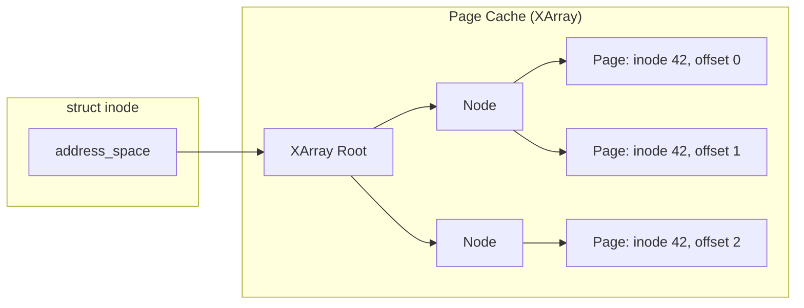
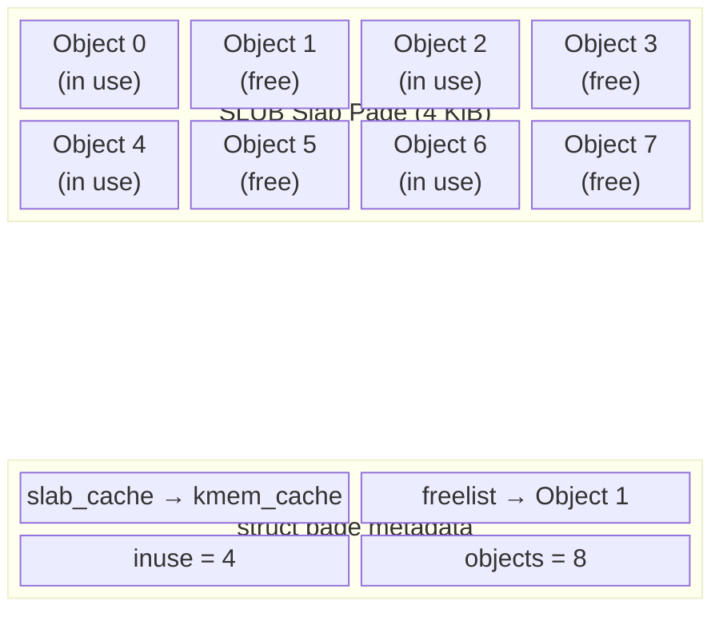
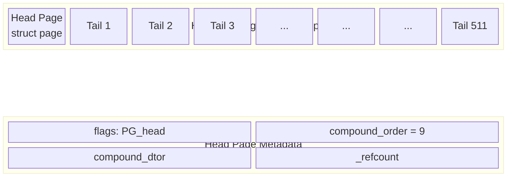
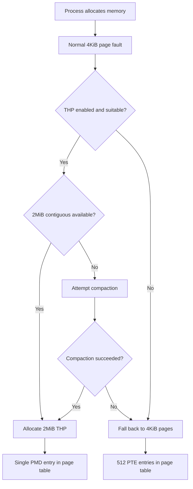
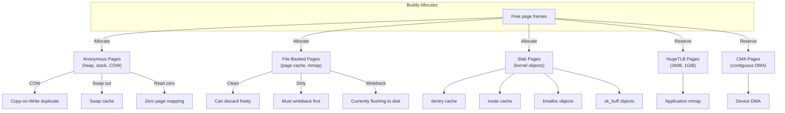

# Page Types

## Overview

The Linux kernel manages physical memory through a **page frame** abstraction. Every physical page in the system is represented by a `struct page` and classified by its usage type. Understanding page types is essential for memory management debugging, performance tuning, and kernel development.

The kernel's page allocator (buddy system) hands out fixed-size blocks—typically **4 KiB** on x86-64—but pages serve radically different purposes once allocated. The type of a page determines how it is mapped, reclaimed, shared, and accounted.

> **See also:** [Memory Management Overview](./index.md), [Slab Allocator](./slab.md), [Huge Pages](./hugepages.md)

---

## struct page — The Universal Page Descriptor

Every physical page frame in the system has an associated `struct page` (or `struct folio` in newer kernels). This structure is one of the most contested data structures in the kernel — it must fit in 64 bytes (or one cache line) yet represent dozens of different page types.

### struct page Key Fields

```c
/* include/linux/mm_types.h */
struct page {
    unsigned long flags;         /* Page flags (PG_locked, PG_dirty, etc.) */
    union {
        struct {                 /* Anonymous pages */
            struct list_head lru;    /* LRU list linkage */
            struct address_space *mapping; /* NULL for anon */
            pgoff_t index;           /* Offset within mapping */
            unsigned long private;   /* Private data */
        };
        struct {                 /* Slab pages */
            struct kmem_cache *slab_cache; /* Which cache */
            void *freelist;          /* First free object */
            unsigned int inuse;      /* Allocated objects */
            unsigned int objects;    /* Total objects */
        };
        struct {                 /* Compound (huge) pages */
            unsigned long compound_head;  /* Head page pointer */
            unsigned char compound_dtor;  /* Destructor */
            unsigned char compound_order; /* Allocation order */
            atomic_t compound_mapcount;   /* PMD mappings */
            atomic_t subpages_mapcount;   /* PTE mappings */
        };
        /* ... more unions ... */
    };
    atomic_t _refcount;          /* Reference count */
    atomic_t _mapcount;          /* Page table mappings */
};
```

### The folio Transition

Starting in Linux 5.16, the kernel is transitioning from `struct page` to `struct folio` as the primary unit of memory management. A folio represents a physically contiguous group of one or more pages that is managed as a single unit:

```c
/* include/linux/mm_types.h */
struct folio {
    union {
        struct {
            unsigned long flags;
            struct list_head lru;
            struct address_space *mapping;
            pgoff_t index;
            /* ... */
            atomic_t _mapcount;
            atomic_t _refcount;
        };
        struct page page;
    };
};
```

> **See also:** [Folio documentation](https://www.kernel.org/doc/html/latest/mm/folio.html)

---

## Anonymous Pages

### Characteristics

Anonymous pages have **no backing store on disk**. They hold:

- Process heap memory (`malloc`, `brk`, `mmap(MAP_ANONYMOUS)`)
- Stack space
- Copy-on-write (COW) duplicates of shared pages
- Private anonymous file mappings

```c
/* Typical creation paths */
vma->vm_flags |= VM_ANON;           /* Set in mm/mmap.c */
page = alloc_pages(GFP_HIGHUSER, 0); /* Allocate from highmem */
```

### Lifecycle

```mermaid
flowchart TD
    A[Process accesses new memory] --> B[Page fault]
    B --> C{Read or write?}
    C -->|Read| D[Map zero page read-only]
    C -->|Write| E[Allocate new zero-filled page]
    E --> F[Install in page table]
    F --> G{Page under memory pressure?}
    G -->|No| H[Page stays in memory]
    G -->|Yes| I{Swap available?}
    I -->|Yes| J[Write to swap, free page]
    I -->|No| K[Page stays (cannot reclaim)]
    J --> L[Process accesses again]
    L --> M[Read from swap, allocate new page]
    M --> F
    H --> N{Process exits or munmap?}
    N -->|Yes| O[Free page to buddy allocator]
    N -->|No| H
    D --> P{Write to zero page?}
    P -->|Yes| Q[COW: allocate new page, copy]
    Q --> F
    P -->|No| D
```

### Detection

```bash
# Per-process anonymous memory
cat /proc/<pid>/smaps | grep Anonymous
# Anonymous:        4096 kB
# Anonymous:           0 kB

# System-wide anonymous page count
grep nr_anon_pages /proc/vmstat
# nr_anon_pages 123456

# Anon pages in swap
grep nr_swap_pages /proc/vmstat
```

### Page Flags

Anonymous pages are identified by:

```c
/* Check if page is anonymous */
bool PageAnon(struct page *page)
{
    return page->mapping & PAGE_MAPPING_ANON;
}

/* Or using folio API (newer kernels) */
bool folio_test_anon(struct folio *folio)
{
    return folio->mapping & PAGE_MAPPING_ANON;
}
```

---

## File-Backed Pages

### Characteristics

File-backed pages cache contents of files from disk filesystems. They appear in:

- `mmap()` of regular files
- Page cache (read/write I/O buffering)
- Shared memory backed by `tmpfs`/`shmfs`
- Executable code segments

```c
/* In mm/filemap.c */
struct page *page_cache_get(struct address_space *mapping, pgoff_t index)
```

### Page Cache Integration

Every file-backed page is indexed by its `address_space` and offset (index). The radix tree (or XArray in newer kernels) maps `(mapping, index) → struct page`.



### Page States

| State         | Description                                      |
|---------------|--------------------------------------------------|
| **Clean**     | Matches disk contents; can be discarded freely   |
| **Dirty**     | Modified in memory; must be written back first   |
| **Writeback** | Currently being flushed to disk                  |
| **Locked**    | Under I/O; other threads must wait               |
| **Uptodate**  | Contains valid data from disk                    |

### Page Flag Bits

```c
/* include/linux/page-flags.h */
PG_dirty     /* Page is dirty — needs writeback */
PG_writeback /* Writeback is in progress */
PG_locked    /* Page is locked for I/O */
PG_uptodate  /* Page contents are valid */
PG_lru        /* Page is on an LRU list */
PG_active     /* Page is on the active LRU list */
```

### Reclaim

The kernel reclaims file-backed pages through:

- **Direct reclaim** — Synchronous in the allocating context
- **kswapd** — Background daemon scanning LRU lists
- **Eviction** — Clean pages are freed; dirty pages are written back first

```bash
# File-backed page statistics
grep -i "nr_file_pages\|nr_dirty\|nr_writeback" /proc/vmstat
# nr_file_pages 128450
# nr_dirty 42
# nr_writeback 0
```

> **See also:** [Page Cache](../filesystems/page-cache.md), [Writeback](./writeback.md)

---

## Slab Pages

### Purpose

The **slab allocator** (SLAB/SLUB/SLOB) manages kernel objects smaller than a full page. Slab pages are subdivided into fixed-size **caches** for structures like `inode`, `dentry`, `task_struct`, and `sk_buff`.

```c
/* Creating a new cache */
struct kmem_cache *cache = kmem_cache_create(
    "my_object", sizeof(struct my_object),
    0, SLAB_HWCACHE_ALIGN, NULL);
```

### SLUB Internals (Default Allocator)

Each slab page belongs to a `kmem_cache` and is divided into **objects** of uniform size:



### SLUB Free List

SLUB uses an embedded free list within the slab page. Each free object contains a pointer to the next free object:

```c
/* Simplified SLUB free list walk */
void *object = page->freelist;  /* First free object */
while (object) {
    void *next = *(void **)object;  /* Next pointer stored in object */
    /* Object is free */
    object = next;
}
```

### Key SLUB Data Structures

```c
/* include/linux/slub_def.h */
struct kmem_cache {
    struct kmem_cache_cpu __percpu *cpu_slab;  /* Per-CPU slab */
    slab_flags_t flags;                         /* Cache flags */
    unsigned long min_partial;                  /* Min partial slabs */
    int size;                                   /* Object size including metadata */
    int object_size;                            /* Real object size */
    int offset;                                 /* Free pointer offset */
    struct kmem_cache_order_objects oo;         /* Slab order and objects */
    struct kmem_cache_order_objects min;        /* Min slab order */
    struct kmem_cache_order_objects max;        /* Max slab order */
    gfp_t allocflags;                           /* Allocation flags */
    int refcount;                               /* Reference count */
    void (*ctor)(void *);                       /* Constructor */
    unsigned int inuse;                         /* Offset to metadata */
    unsigned int align;                         /* Alignment */
    const char *name;                           /* Cache name */
    struct list_head list;                      /* Cache list */
    struct kmem_cache_node *node[MAX_NUMNODES]; /* Per-node slabs */
};

struct kmem_cache_cpu {
    union {
        struct {
            void **freelist;     /* Free list pointer */
            unsigned long tid;   /* Transaction ID for cmpxchg */
        };
    };
    struct page *page;           /* Current slab page */
    struct page *partial;        /* Partial slab pages */
};
```

### Monitoring

```bash
# /proc/slabinfo — slab cache statistics
sudo cat /proc/slabinfo
# name            <active_objs> <num_objs> <objsize> <objperslab> <pagesperslab>
inode_cache           12450    12600      608           25            1
dentry                28300    28350      192           42            1
kmalloc-256            4800     4800      256           16            1
kmalloc-1k             2400     2400     1024            4            1

# slabtop — live view of slab usage
sudo slabtop -o | head -20

# SLUB debug (if CONFIG_SLUB_DEBUG)
sudo cat /sys/kernel/slab/<cache_name>/alloc_slabs
sudo cat /sys/kernel/slab/<cache_name>/objects
sudo cat /sys/kernel/slab/<cache_name>/sanity_checks
```

> **See also:** [Slab Allocator Details](./slab.md), [`kmem_cache` API](../api/kmem-cache.md)

---

## HugeTLB Pages

### Overview

HugeTLB (Huge Translation Lookaside Buffer) pages are **pre-allocated large pages** that bypass the normal page-table hierarchy. On x86-64, supported sizes are:

| Size     | Page-Table Level | Allocation Flag        |
|----------|------------------|------------------------|
| 2 MiB    | PMD (Level 2)    | `MAP_HUGETLB` (default)|
| 1 GiB    | PUD (Level 3)    | `MAP_HUGETLB + 30`    |

### Configuration

```bash
# Reserve 10 x 2 MiB huge pages at boot
echo 10 > /proc/sys/vm/nr_hugepages

# Reserve 2 x 1 GiB huge pages
echo 2 > /sys/kernel/mm/hugepages/hugepages-1048576kB/nr_hugepages

# Check status
cat /proc/meminfo | grep -i huge
# HugePages_Total:      10
# HugePages_Free:        8
# HugePages_Rsvd:        2
# HugePages_Surp:        0
# Hugepagesize:       2048 kB

# Per-node huge page allocation
cat /sys/devices/system/node/node0/hugepages/hugepages-2048kB/nr_hugepages
```

### HugeTLB Page Structure



### Usage in Applications

```c
/* mmap-based huge page allocation */
void *ptr = mmap(NULL, 2 * 1024 * 1024,
                 PROT_READ | PROT_WRITE,
                 MAP_PRIVATE | MAP_ANONYMOUS | MAP_HUGETLB,
                 -1, 0);

/* shmget-based huge page allocation */
int shmid = shmget(IPC_PRIVATE, 2 * 1024 * 1024,
                   SHM_HUGETLB | IPC_CREAT | 0666);
void *ptr = shmat(shmid, NULL, 0);
```

### Advantages

- **Reduced TLB pressure** — Fewer page-table entries to traverse
- **Fewer page faults** — One fault covers 2 MiB instead of 4 KiB
- **Lower page-table overhead** — Fewer levels of translation
- **Better DMA performance** — Larger contiguous regions for devices

### Caveats

- Memory fragmentation can prevent allocation after boot
- Reserved but unused huge pages waste memory
- Not swappable in most configurations
- Requires contiguous physical memory

> **See also:** [Transparent Huge Pages (THP)](./thp.md), [TLB Management](./tlb.md)

---

## Transparent Huge Pages (THP)

THP is a kernel feature that **automatically** uses huge pages for suitable allocations without application changes:



### THP Configuration

```bash
# Check THP status
cat /sys/kernel/mm/transparent_hugepage/enabled
# [always] madvise never

# Set THP mode
echo madvise > /sys/kernel/mm/transparent_hugepage/enabled

# THP defrag mode
cat /sys/kernel/mm/transparent_hugepage/defrag
# [always] defer defer+madvise madvise never

# THP khugepaged (background THP promotion)
cat /sys/kernel/mm/transparent_hugepage/khugepaged/pages_to_scan
# 4096

# Per-process THP settings
echo "inherit" > /proc/<pid>/thp_enabled
```

---

## Zero Page

### Mechanism

The **zero page** (`empty_zero_page`) is a single, globally shared page filled with zeros. When a process reads from an unmapped anonymous region (or reads new heap memory), the kernel maps the zero page **read-only** instead of allocating a fresh page.

```c
/* In mm/memory.c */
if (is_zero_pfn(pte_pfn(pte))) {
    /* Map the global zero page */
}
```

### Benefits

- **Memory savings** — Hundreds of processes sharing zero-filled regions use one physical page
- **Faster page faults** — No allocation or zeroing needed for read faults

### Detection

```bash
grep zero_page /proc/vmstat
# zero_page_allocated 4582
```

A high count is normal; it reflects read faults on fresh memory.

---

## Guard Pages

### Purpose

A **guard page** is an unmapped page placed adjacent to a memory region to detect **out-of-bounds access**. When code reads or writes a guard page, the kernel raises `SIGSEGV`.

### Common Locations

| Location            | Protects Against             |
|---------------------|------------------------------|
| Stack guard page    | Stack overflow (grows down)  |
| `mprotect(PROT_NONE)` | Manual buffer overflow detection |
| `mmap` guard region | Heap overflow                |
| Kernel stack guard  | Kernel stack overflow (`CONFIG_VMAP_STACK`) |

### Stack Guard Example

```bash
$ ulimit -s          # Stack size limit
8192                 # 8 MiB

# The page immediately below the stack is the guard page
$ cat /proc/<pid>/maps | grep stack
7ffc12340000-7ffc12361000 rw-p 00000000 00:00 0    [stack]
```

### Kernel Guard Pages

With `CONFIG_VMAP_STACK=y`, kernel stacks are allocated with `vmalloc()` and surrounded by guard pages. A kernel stack overflow triggers:

```
kernel BUG at arch/x86/kernel/traps.c:xxx!
```

Instead of silent memory corruption.

---

## CMA (Contiguous Memory Allocator) Pages

### Overview

CMA reserves a region of physically contiguous memory at boot for devices that need it (e.g., DMA engines, video capture). The reserved region is used for movable allocations when not needed by the device, maximizing utilization.

### CMA Page Characteristics

```bash
# Check CMA regions
cat /proc/meminfo | grep Cma
# CmaTotal:         65536 kB
# CmaFree:          32768 kB

# CMA region info per zone
cat /proc/zoneinfo | grep -A5 "cma"
```

### CMA and GUP Interaction

Pages in CMA regions are movable (they can be migrated by the page allocator). However, long-term GUP pins (`FOLL_LONGTERM`) must not pin CMA pages, as this would prevent the CMA from serving its intended purpose.

> **See also:** [GUP](./gup.md) — FOLL_LONGTERM and CMA

---

## Page Cache (Buffer) Pages

### Overview

Buffer pages hold filesystem metadata (superblocks, inode tables, block bitmaps). They are a subset of file-backed pages but with distinct characteristics:

```c
/* include/linux/buffer_head.h */
struct buffer_head {
    struct buffer_head *b_this_page;  /* Circular list */
    struct page *b_page;              /* Back-pointer to page */
    sector_t b_blocknr;               /* Block number */
    size_t b_size;                    /* Block size */
    char *b_data;                     /* Pointer to data */
    unsigned long b_state;            /* Buffer state flags */
    /* ... */
};
```

### Buffer States

| State | Meaning |
|-------|---------|
| `BH_Uptodate` | Buffer contains valid data |
| `BH_Dirty` | Buffer is dirty — needs writeback |
| `BH_Locked` | Buffer is locked for I/O |
| `BH_Mapped` | Buffer has a valid block mapping |
| `BH_Async_Write` | Async write in progress |

---

## Page Type Detection

### In the Kernel

```c
/* Check if page is anonymous */
bool PageAnon(struct page *page);
bool folio_test_anon(struct folio *folio);

/* Check if page is a slab page */
bool PageSlab(struct page *page);
bool folio_test_slab(struct folio *folio);

/* Check if page is part of a compound (huge) page */
bool PageCompound(struct page *page);
bool folio_test_large(struct folio *folio);

/* Check for zero page */
bool is_zero_pfn(unsigned long pfn);

/* Check if page is in the page cache */
bool PageLRU(struct page *page);
bool folio_test_lru(struct folio *folio);

/* Check page flags */
bool PageDirty(struct page *page);
bool PageLocked(struct page *page);
bool PageWriteback(struct page *page);
bool PageUptodate(struct page *page);

/* Check if page is reserved (kernel internal use) */
bool PageReserved(struct page *page);
```

### From Userspace

```bash
# Per-process page types
cat /proc/<pid>/smaps    # Detailed VMA-level info
cat /proc/<pid>/pagemap   # Physical page mapping info
cat /proc/<pid>/numa_maps # NUMA page distribution

# System-wide counters
grep -E "nr_(anon|file|slab|hugepages)" /proc/vmstat

# NUMA page distribution
cat /proc/zoneinfo

# Detailed page flags (requires root)
cat /proc/kpageflags
```

### /proc/kpageflags

Each bit in `/proc/kpageflags` corresponds to a page flag:

```bash
# Read flags for a specific PFN
# Each 8-byte entry contains flags for one page
dd if=/proc/kpageflags bs=8 count=1 skip=$PFN 2>/dev/null | xxd

# Flag bits (include/linux/kernel-page-flags.h):
# KPF_LOCKED       0
# KPF_ERROR        1
# KPF_REFERENCED   2
# KPF_UPTODATE     3
# KPF_DIRTY        4
# KPF_LRU          5
# KPF_ACTIVE       6
# KPF_SLAB         7
# KPF_WRITEBACK    8
# KPF_RECLAIM      9
# KPF_BUDDY        10
# KPF_MMAP         11
# KPF_ANON         12
# KPF_SWAPCACHE    13
# KPF_SWAPBACKED   14
# KPF_COMPOUND     15
# KPF_THP          17
# KPF_BALLOON      21
# KPF_ZERO_PAGE    22
# KPF_IDLE         23
```

---

## Interaction Summary



---

## Page Flag Operations

### Setting and Clearing Flags

```c
/* Atomic flag operations */
void set_page_dirty(struct page *page);
void clear_page_dirty(struct page *page);
void lock_page(struct page *page);
void unlock_page(struct page *page);
int trylock_page(struct page *page);

/* Test flags */
bool PageDirty(struct page *page);
bool PageLocked(struct page *page);

/* Non-atomic (caller must hold lock) */
__SetPageDirty(struct page *page);
__ClearPageDirty(struct page *page);
```

### Page Flag Hierarchy

```mermaid
flowchart TD
    FLAGS["page->flags<br/>(unsigned long)"]
    FLAGS --> LOCKED["PG_locked (0)"]
    FLAGS --> ERROR["PG_error (1)"]
    FLAGS --> REFERENCED["PG_referenced (2)"]
    FLAGS --> UPTODATE["PG_uptodate (3)"]
    FLAGS --> DIRTY["PG_dirty (4)"]
    FLAGS --> LRU["PG_lru (5)"]
    FLAGS --> ACTIVE["PG_active (6)"]
    FLAGS --> SLAB["PG_slab (7)"]
    FLAGS --> WRITEBACK["PG_writeback (8)"]
    FLAGS --> RECLAIM["PG_reclaim (9)"]
    FLAGS --> BUDDY["PG_buddy (10)"]
    FLAGS --> MMAP["PG_mmap (11)"]
    FLAGS --> ANON["PG_anon (12)"]
    FLAGS --> SWAPCACHE["PG_swapcache (13)"]
    FLAGS --> COMPOUND["PG_head (16)"]
    FLAGS --> THP["PG_trans_huge (17)"]
    FLAGS --> IDLE["PG_idle (23)"]
```



---

## Per-Page Statistics

### /proc/vmstat Counters

```bash
# Key per-page-type counters
cat /proc/vmstat | grep -E "^nr_"
# nr_free_pages 123456
# nr_inactive_anon 78901
# nr_active_anon 234567
# nr_inactive_file 89012
# nr_active_file 345678
# nr_slab_reclaimable 12345
# nr_slab_unreclaimable 6789
# nr_isolated_anon 0
# nr_isolated_file 0
# nr_anon_pages 345678
# nr_mapped 456789
# nr_file_pages 234567
# nr_dirty 42
# nr_writeback 0
# nr_slab 19134
# nr_kernel_stack 1234
# nr_bounce 0
# nr_free_cma 32768
# nr_anon_transparent_hugepages 123
# nr_shmem 5678
```

### Per-Process Statistics

```bash
# Detailed per-VMA statistics
cat /proc/<pid>/smaps | head -50
# 7f1234000000-7f1234200000 rw-p 00000000 00:00 0    [heap]
# Size:               2048 kB
# KernelPageSize:        4 kB
# MMUPageSize:           4 kB
# Rss:                 512 kB
# Pss:                 512 kB
# Shared_Clean:          0 kB
# Shared_Dirty:          0 kB
# Private_Clean:         0 kB
# Private_Dirty:       512 kB
# Referenced:          512 kB
# Anonymous:           512 kB
# LazyFree:              0 kB
# AnonHugePages:         0 kB
# ShmemPmdMapped:        0 kB
# Shared_Hugetlb:        0 kB
# Private_Hugetlb:       0 kB
# Swap:                  0 kB
# SwapPss:               0 kB
# Locked:                0 kB
```

---

## Source Files

| File | Contents |
|------|----------|
| `include/linux/mm_types.h` | `struct page`, `struct folio` definitions |
| `include/linux/page-flags.h` | Page flag definitions and accessors |
| `include/linux/page_ref.h` | Page reference counting |
| `mm/memory.c` | Page fault handling, zero page |
| `mm/filemap.c` | Page cache operations |
| `mm/slab.h` | Slab page definitions |
| `mm/huge_memory.c` | THP operations |
| `mm/migrate.c` | Page migration |
| `fs/proc/page.c` | `/proc/kpageflags`, `/proc/kpagecount` |

---

## Further Reading

- [Linux kernel source: `include/linux/page-flags.h`](https://elixir.bootlin.com/linux/latest/source/include/linux/page-flags.h)
- [Linux kernel source: `mm/memory.c`](https://elixir.bootlin.com/linux/latest/source/mm/memory.c)
- [Linux kernel source: `include/linux/mm_types.h`](https://elixir.bootlin.com/linux/latest/source/include/linux/mm_types.h)
- **Understanding the Linux Virtual Memory Manager** — Mel Gorman
- [kernel.org: Hugetlbpage](https://www.kernel.org/doc/html/latest/admin-guide/mm/hugetlbpage.html)
- [LWN: The SLUB allocator](https://lwn.net/Articles/229984/)
- [LWN: Folios](https://lwn.net/Articles/849538/) — struct folio introduction
- [proc(5) man page](https://man7.org/linux/man-pages/man5/proc.5.html)
- [pagemap documentation](https://www.kernel.org/doc/html/latest/admin-guide/mm/pagemap.html)

> **Related topics:** [Page Allocator](./page-allocator.md), [Memory Zones](./zones.md), [NUMA](./numa.md), [OOM Killer](./oom-killer.md), [GUP](./gup.md), [Memory Compaction](./compaction.md), [Idle Page Tracking](./idle-page-tracking.md), [zpool](./zpool.md)
