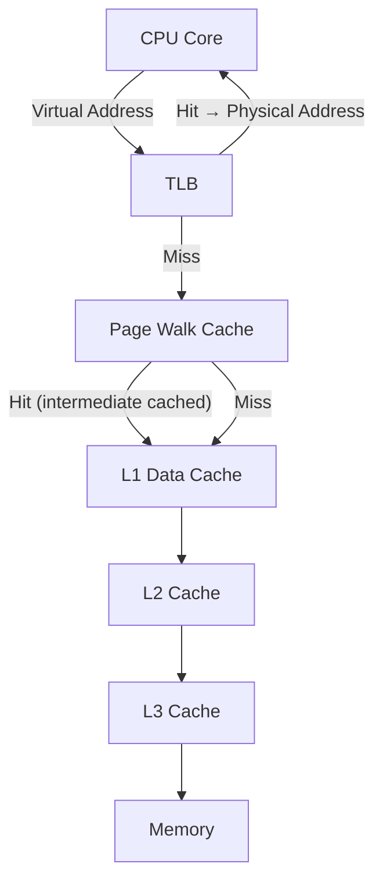

# x86_64 Paging

## Introduction

Paging is the hardware mechanism that enables virtual memory on x86_64 processors. The CPU's Memory Management Unit (MMU) translates every memory reference from a virtual address to a physical address by walking a hierarchical set of page tables maintained by the Linux kernel. Understanding the paging structures — their format, flags, and the walk algorithm — is essential for kernel developers, performance engineers, and anyone debugging memory-related issues.

This page covers the complete x86_64 paging hierarchy (PGD → PUD → PMD → PTE), the format of page table entries at each level, flag bits, huge page support at the PMD and PUD levels, and the kernel's management of these structures.

## Paging Hierarchy Overview

### 4-Level Paging (Standard)

x86_64 with 4-level paging uses 48-bit virtual addresses, split across four page table levels plus a page offset:

```
Virtual Address (48 bits):
┌─────────┬─────────┬─────────┬─────────┬──────────┐
│ PGD [9] │ PUD [9] │ PMD [9] │ PTE [9] │ Offset[12]│
│ 47:39   │ 38:30   │ 29:21   │ 20:12   │ 11:0     │
└─────────┴─────────┴─────────┴─────────┴──────────┘

Each index: 9 bits → 512 entries per table
Each entry: 8 bytes
Each table: 512 × 8 = 4096 bytes = 1 page
```

The page table walk proceeds:

```
CR3 → PGD base (physical address)
PGD[index_47:39] → PUD base
PUD[index_38:30] → PMD base
PMD[index_29:21] → PTE base (or huge page if PS=1)
PTE[index_20:12] → Physical page frame
Physical address = PFN << 12 | offset[11:0]
```

### 5-Level Paging (LA57)

With Intel's LA57 feature, virtual addresses extend to 57 bits, inserting a **P4D** (Page 4th-level Directory) between PGD and PUD:

```
Virtual Address (57 bits):
┌─────────┬─────────┬─────────┬─────────┬─────────┬──────────┐
│ PGD [9] │ P4D [9] │ PUD [9] │ PMD [9] │ PTE [9] │ Offset[12]│
│ 56:48   │ 47:39   │ 38:30   │ 29:21   │ 20:12   │ 11:0     │
└─────────┴─────────┴─────────┴─────────┴─────────┴──────────┘
```

The kernel adapts at compile time via `CONFIG_X86_5LEVEL`:

```c
/* arch/x86/include/asm/pgtable-types.h */
#ifdef CONFIG_X86_5LEVEL
typedef struct { pgdval_t pgd; } pgd_t;
typedef struct { p4dval_t p4d; } p4d_t;    /* Only with 5-level */
typedef struct { pudval_t pud; } pud_t;
#else
/* Without 5-level, p4d_t is a typedef for pgd_t */
typedef struct { pgdval_t pgd; } p4d_t;
#endif
```

## Page Table Entry Format

### Full 64-Bit PTE Layout

Each page table entry is 64 bits. For a leaf entry (final PTE pointing to a page):

```
Bit  63      : NX (No Execute)
Bits 62:59   : Available for software
Bits 58:52   : Available for software (some used by hardware: Protection Key)
Bits 51:M    : Reserved (must be 0, M depends on MAXPHYADDR)
Bits M-1:12  : Physical page frame number (PFN)
Bit  11      : Available
Bit  10      : Available (PAT for 4K pages)
Bit  9       : Available
Bit  8       : G (Global)
Bit  7       : PAT (for 4K pages) / PS (Page Size, for higher levels)
Bit  6       : D (Dirty)
Bit  5       : A (Accessed)
Bit  4       : PCD (Page Cache Disable)
Bit  3       : PWT (Page Write-Through)
Bit  2       : U/S (User/Supervisor)
Bit  1       : R/W (Read/Write)
Bit  0       : P (Present)
```

### Flag Bits in Detail

| Bit | Name | Kernel Define | Meaning |
|-----|------|---------------|---------|
| 0 | **P** | `_PAGE_PRESENT` | Page is present in physical memory. If 0, a page fault occurs. |
| 1 | **R/W** | `_PAGE_RW` | 0 = read-only; 1 = writable. Controls write access. |
| 2 | **U/S** | `_PAGE_USER` | 0 = supervisor (kernel) only; 1 = user accessible. |
| 3 | **PWT** | `_PAGE_PWT` | 0 = write-back caching; 1 = write-through caching. |
| 4 | **PCD** | `_PAGE_PCD` | 0 = cacheable; 1 = not cached. Used for memory-mapped I/O. |
| 5 | **A** | `_PAGE_ACCESSED` | Set by CPU on any access (read or write). Software must clear. |
| 6 | **D** | `_PAGE_DIRTY` | Set by CPU on write. Used for page reclaim (dirty pages must be written back). |
| 7 | **PAT** / **PS** | `_PAGE_PAT` / `_PAGE_PSE` | PAT for 4K pages; Page Size for higher levels (1 = huge page). |
| 8 | **G** | `_PAGE_GLOBAL` | Global page: not flushed from TLB on CR3 change (kernel pages). |
| 9 | — | — | Available for software |
| 10 | — | — | Available for software (PAT bit for 2M/1G pages) |
| 11 | — | — | Available for software |
| 51:M | Reserved | — | Must be 0. M = MAXPHYADDR (typically 46 or 52). |
| 62 | **NX** | `_PAGE_NX` | No Execute: instruction fetches from this page cause #PF. |
| 63 | (same as NX in some configs) | | |

### Intermediate (Non-Leaf) Entries

For PGD, PUD (when not huge), and PMD (when not huge) entries, the format is similar but fewer flags apply:

```
Non-leaf entry:
- P, R/W, U/S, PWT, PCD, A: Same meanings
- PS: Reserved at PGD/PUD levels (not a huge page indicator)
- D: Reserved (not dirty tracking for non-leaf)
- Bits M-1:12: Physical address of next-level table
```

## PGD (Page Global Directory)

The PGD is the top-level page table, pointed to by the CR3 register. On x86_64 with 4-level paging, it contains 512 entries, each 8 bytes.

### Kernel PGD Management

```c
/* arch/x86/include/asm/pgtable.h */

/* Get the PGD entry for a virtual address */
static inline pgd_t *pgd_offset(const struct mm_struct *mm,
                                 unsigned long address)
{
    return (pgd_t *)mm->pgd + pgd_index(address);
}

/* Index into PGD: bits 47:39 of virtual address */
static inline unsigned long pgd_index(unsigned long address)
{
    return (address >> PGDIR_SHIFT) & (PTRS_PER_PGD - 1);
}

#define PGDIR_SHIFT     39
#define PTRS_PER_PGD    512
#define PGDIR_SIZE      (1UL << PGDIR_SHIFT)  /* 512 GiB */
#define PGDIR_MASK      (~(PGDIR_SIZE - 1))
```

### Kernel Page Tables

The kernel's PGD entries are shared across all processes. User-space page tables are per-process, but the upper half (kernel space) of every PGD points to the same PUD/PMD/PTE structures:

```c
/* arch/x86/kernel/head_64.S (boot-time PGD initialization) */
/*
 * The kernel's page table is set up so that:
 * - Entries 0-255 (user space): per-process
 * - Entries 256-511 (kernel space): shared globally
 */
```

This is why `PAGE_OFFSET` (the start of kernel address space) is in the upper half:

```c
/* arch/x86/include/asm/pgtable_64_types.h */
#define PGDIR_SIZE      (1UL << PGDIR_SHIFT)      /* 512 GiB */
#define PGDIR_MASK      (~(PGDIR_SIZE - 1))

/* Kernel space starts at entry 256 of PGD */
#define __PAGE_OFFSET_BASE  _AC(0xffff888000000000, UL)
#define PAGE_OFFSET         __PAGE_OFFSET_BASE
```

## PUD (Page Upper Directory)

The PUD is the second level. Each PGD entry points to a PUD table (512 entries). Each PUD entry covers 1 GiB of virtual address space.

```c
#define PUD_SHIFT       30
#define PTRS_PER_PUD    512
#define PUD_SIZE        (1UL << PUD_SHIFT)  /* 1 GiB */
#define PUD_MASK        (~(PUD_SIZE - 1))

static inline unsigned long pud_index(unsigned long address)
{
    return (address >> PUD_SHIFT) & (PTRS_PER_PUD - 1);
}
```

### 1 GiB Huge Pages at PUD Level

When the **PS** (Page Size) bit is set in a PUD entry, it directly maps a 1 GiB physical region, bypassing PMD and PTE entirely:

```
PUD entry with PS=1 (1 GiB huge page):
┌────┬─────┬─────────────────────────────┬───────────────────────┐
│NX  │Avail│ PFN (bits 51:30)            │ Flags (P,R/W,U/S,PS=1)│
└────┴─────┴─────────────────────────────┴───────────────────────┘

Physical address = (PFN_from_PUD << 30) | offset[29:0]
```

```c
/* arch/x86/include/asm/pgtable.h */
static inline int pud_large(pud_t pud)
{
    return (pud_val(pud) & (_PAGE_PSE | _PAGE_PRESENT)) ==
           (_PAGE_PSE | _PAGE_PRESENT);
}
```

## PMD (Page Middle Directory)

The PMD is the third level. Each PUD entry points to a PMD table. Each PMD entry covers 2 MiB of virtual address space.

```c
#define PMD_SHIFT       21
#define PTRS_PER_PMD    512
#define PMD_SIZE        (1UL << PMD_SHIFT)  /* 2 MiB */
#define PMD_MASK        (~(PMD_SIZE - 1))

static inline unsigned long pmd_index(unsigned long address)
{
    return (address >> PMD_SHIFT) & (PTRS_PER_PMD - 1);
}
```

### 2 MiB Huge Pages at PMD Level

When the **PS** bit is set in a PMD entry, it directly maps a 2 MiB physical region:

```
PMD entry with PS=1 (2 MiB huge page):
┌────┬─────┬──────────────────────────────┬───────────────────────┐
│NX  │Avail│ PFN (bits 51:21)             │ Flags (P,R/W,U/S,PS=1)│
└────┴─────┴──────────────────────────────┴───────────────────────┘

Physical address = (PFN_from_PMD << 21) | offset[20:0]
```

```c
/* arch/x86/include/asm/pgtable.h */
static inline int pmd_large(pmd_t pmd)
{
    return (pmd_val(pmd) & (_PAGE_PSE | _PAGE_PRESENT)) ==
           (_PAGE_PSE | _PAGE_PRESENT);
}

static inline int pmd_trans_huge(pmd_t pmd)
{
    return (pmd_val(pmd) & (_PAGE_PSE | _PAGE_DEVMAP)) != 0 &&
           (pmd_val(pmd) & _PAGE_PRESENT) != 0;
}
```

### Transparent Huge Pages (THP) at PMD

THP uses PMD-level entries to automatically create 2 MiB mappings when beneficial. The kernel may split a PMD huge page back into 512 PTE pages (called "THP split") if only part of the region is actively used. See [Huge Pages](huge-pages.md).

## PTE (Page Table Entry)

The PTE is the final level. Each PMD entry points to a PTE table. Each PTE entry maps a single 4 KiB page.

```c
#define PAGE_SHIFT      12
#define PTRS_PER_PTE    512
#define PAGE_SIZE       (1UL << PAGE_SHIFT)  /* 4 KiB */
#define PAGE_MASK       (~(PAGE_SIZE - 1))

static inline unsigned long pte_index(unsigned long address)
{
    return (address >> PAGE_SHIFT) & (PTRS_PER_PTE - 1);
}
```

### PTE Manipulation Functions

```c
/* arch/x86/include/asm/pgtable.h */

static inline pte_t pte_mkwrite(pte_t pte)
{
    return __pte(pte_val(pte) | _PAGE_RW);
}

static inline pte_t pte_wrprotect(pte_t pte)
{
    return __pte(pte_val(pte) & ~_PAGE_RW);
}

static inline pte_t pte_mkdirty(pte_t pte)
{
    return __pte(pte_val(pte) | _PAGE_DIRTY);
}

static inline pte_t pte_mkclean(pte_t pte)
{
    return __pte(pte_val(pte) & ~_PAGE_DIRTY);
}

static inline pte_t pte_mkyoung(pte_t pte)
{
    return __pte(pte_val(pte) | _PAGE_ACCESSED);
}

static inline pte_t pte_mkold(pte_t pte)
{
    return __pte(pte_val(pte) & ~_PAGE_ACCESSED);
}

static inline int pte_present(pte_t pte)
{
    return pte_val(pte) & _PAGE_PRESENT;
}

static inline int pte_dirty(pte_t pte)
{
    return pte_val(pte) & _PAGE_DIRTY;
}

static inline int pte_write(pte_t pte)
{
    return pte_val(pte) & _PAGE_RW;
}
```

## Permission Model

The x86_64 paging permission model combines R/W and U/S bits across all levels. The **most restrictive** permission applies:

| PGD R/W | PUD R/W | PMD R/W | PTE R/W | Effective |
|---------|---------|---------|---------|-----------|
| RW | RW | RW | RW | Read/Write |
| R | RW | RW | R | Read-only (PGD restricts) |
| RW | RW | R | RW | Read-only (PMD restricts) |

The NX bit is OR'd across all levels — if **any** level has NX=1, the page is non-executable.

```c
/* Simplified effective permission calculation */
pgprot_t effective_prot(pgprot_t pgd_prot, pgprot_t pud_prot,
                        pgprot_t pmd_prot, pgprot_t pte_prot)
{
    pgprot_t prot = __pgprot(
        pgprot_val(pgd_prot) &
        pgprot_val(pud_prot) &
        pgprot_val(pmd_prot) &
        pgprot_val(pte_prot)
    );
    return prot;
}
```

## Page Table Allocation and Management

### Allocating Page Tables

Page tables themselves consume physical memory. The kernel allocates them using `alloc_page()`:

```c
/* mm/pgtable-generic.c */
pte_t *pte_alloc_one(struct mm_struct *mm, unsigned long address)
{
    pte_t *pte = NULL;
    pgtable_t page = alloc_page(GFP_KERNEL_ACCOUNT | __GFP_ZERO);
    if (page)
        pte = (pte_t *)page_address(page);
    return pte;
}

/* Initialize a new PTE table */
static inline pgtable_t pte_alloc_one(struct mm_struct *mm,
                                       unsigned long address)
{
    return __pte_alloc_one(mm, address, GFP_KERNEL_ACCOUNT);
}
```

### Filling Page Tables on Demand

Page tables are built lazily. When `handle_mm_fault()` is called for an address whose PMD doesn't yet have a PTE table, the kernel creates one:

```c
/* mm/memory.c (simplified) */
static vm_fault_t __handle_mm_fault(struct vm_area_struct *vma,
                                     unsigned long address,
                                     unsigned int flags)
{
    struct mm_struct *mm = vma->vm_mm;
    pgd_t *pgd;
    p4d_t *p4d;
    vm_fault_t ret;

    pgd = pgd_offset(mm, address);
    p4d = p4d_alloc(mm, pgd, address);
    if (!p4d)
        return VM_FAULT_OOM;

    pud = pud_alloc(mm, p4d, address);
    if (!pud)
        return VM_FAULT_OOM;

    pmd = pmd_alloc(mm, pud, address);
    if (!pmd)
        return VM_FAULT_OOM;

    /* Now at PMD level — check for huge page */
    if (pmd_trans_huge(*pmd) || pmd_devmap(*pmd)) {
        /* Handle huge page fault */
        return create_huge_pmd(vma, address, pmd, flags);
    }

    /* Allocate PTE table if needed */
    pte = pte_alloc_map(mm, pmd, address);
    if (!pte)
        return VM_FAULT_OOM;

    return handle_pte_fault(vmf);
}
```

## Page Size Extensions Summary

| Level | PS Bit | Page Size | Offset Bits | Entries Saved |
|-------|--------|-----------|-------------|---------------|
| PTE | — | 4 KiB | 12 | — |
| PMD | PS=1 | 2 MiB | 21 | No PTE table needed |
| PUD | PS=1 | 1 GiB | 30 | No PMD/PTE tables needed |

## Hardware Page Table Walk

Modern x86_64 CPUs perform the page table walk in hardware (no software intervention needed for TLB misses on present pages). The MMU reads page table entries from memory using the same caching hierarchy as regular data. This is why page tables benefit from being in CPU caches.

The hardware walk uses a **page walk cache** to cache intermediate (non-leaf) entries:



## Debugging Page Tables

### Examining Page Tables with /proc

```bash
# View the kernel's page table entries for a process
$ sudo cat /proc/1234/maps | head -5
00400000-0048c000 r-xp 00000000 08:01 131074  /usr/bin/cat
0068b000-0068c000 r--p 0000b000 08:01 131074  /usr/bin/cat

# Use /proc/<pid>/pagemap to inspect page table entries
# Each 8-byte entry in pagemap describes one page:
#   Bit 63: Page present
#   Bit 62: Page swapped
#   Bits 0-54: PFN (if present)
```

### Using crash/kdump

```bash
# In crash utility, walk page tables manually
crash> vtop 7f8c4a200040 1234
VIRTUAL     PHYSICAL
7f8c4a200040  8b000040

PAGE DIRECTORY: ffff888123456000
  PGD: ffff8881234567f0 => 1a000067
  PUD: ffff8881a000848 => 2b000067
  PMD: ffff8882b000100 => 3c000067
  PTE: ffff8883c000800 => 8b000067
  PAGE: 8b000000

  PAGE   PHYSICAL  MAPPING  PAGEOPT  GTP   RCP  FLAGS
  fffffea00022c00  8b000000  ffff88812345a00  80000000000000  0  0
  referenced,uptodate,lru,active,private
```

### /proc/kpageflags

```bash
# View page flags for physical pages
# Each 8-byte entry describes flags for one physical page
$ sudo python3 -c "
import struct, os
with open('/proc/kpageflags', 'rb') as f:
    f.seek(0x8b000 * 8)  # Seek to PFN 0x8b000
    flags = struct.unpack('Q', f.read(8))[0]
    print(f'Page flags: 0x{flags:016x}')
    flag_names = [
        'LOCKED', 'ERROR', 'REFERENCED', 'UPTODATE',
        'DIRTY', 'LRU', 'ACTIVE', 'SLAB',
        'WRITEBACK', 'RECLAIM', 'BUDDY', 'MMAP',
        'ANON', 'SWAPCACHE', 'SWAPBACKED', 'COMPOUND_HEAD',
        'COMPOUND_TAIL', 'HUGE', 'UNEVICTABLE', 'HWPOISON',
    ]
    for i, name in enumerate(flag_names):
        if flags & (1 << i):
            print(f'  {name}')
"
```

## Page Table Memory Overhead

Page tables themselves consume significant memory. On a system running many processes:

```bash
$ grep PageTables /proc/meminfo
PageTables:      196608 kB

# Per-process page table size
$ grep VmPTE /proc/1234/status
VmPTE:      40 kB

# Total kernel page table pages
$ sudo cat /proc/vmstat | grep nr_page_table_pages
nr_page_table_pages 49152
```

### Overhead Calculation

| Memory Used | Pages Mapped | PTE Tables | Page Table Memory |
|-------------|-------------|------------|-------------------|
| 1 GiB | 262,144 | 512 | 2 MiB |
| 4 GiB | 1,048,576 | 2,048 | 8 MiB |
| 128 GiB | 33,554,432 | 65,536 | 256 MiB |

Using 2 MiB huge pages reduces overhead by 512× at the PTE level. See [Huge Pages](huge-pages.md).

## Kernel Page Table Isolation (KPTI)

After the Meltdown vulnerability (CVE-2017-5754), Linux implements KPTI, which separates user-space and kernel-space page tables:

```
Without KPTI:
  PGD has both user (0-255) and kernel (256-511) entries
  Kernel pages always visible (speculative execution can leak data)

With KPTI:
  User PGD: Only user entries + minimal kernel trampoline
  Kernel PGD: Full kernel entries + user entries
  Switching between them on every syscall/interrupt
```

```bash
# Check if KPTI is enabled
$ grep pti /proc/cpuinfo | head -1
flags           : ... pti ...

# Kernel command line
$ cat /proc/cmdline | tr ' ' '\n' | grep pti
pti=on
```

KPTI adds overhead due to additional CR3 writes and TLB flushes. PCID mitigates some of this cost.

## Related Kernel Data Structures

```c
/* include/linux/mm_types.h */
typedef struct { pgdval_t pgd; } pgd_t;
typedef struct { p4dval_t p4d; } p4d_t;
typedef struct { pudval_t pud; } pud_t;
typedef struct { pmdval_t pmd; } pmd_t;
typedef struct { pteval_t pte; } pte_t;

/* Helper macros */
#define pgd_val(x)      ((x).pgd)
#define pud_val(x)      ((x).pud)
#define pmd_val(x)      ((x).pmd)
#define pte_val(x)      ((x).pte)

#define __pgd(x)        ((pgd_t) { (x) })
#define __pud(x)        ((pud_t) { (x) })
#define __pmd(x)        ((pmd_t) { (x) })
#define __pte(x)        ((pte_t) { (x) })
```

## References

- [The Linux Kernel Documentation](https://docs.kernel.org/)
- [GNU Project Documentation](https://www.gnu.org/doc/doc.html)
- [GNU Manuals](https://www.gnu.org/manual/manual.html)
- [Free Software Directory](https://directory.fsf.org/wiki/Main_Page)
- [Planet GNU](https://planet.gnu.org/)
- [Free Software Books](https://www.gnu.org/doc/other-free-books.html)

- **Intel 64 and IA-32 Architectures Software Developer's Manual, Volume 3A** — Chapter 4: Paging
- **AMD64 Architecture Programmer's Manual, Volume 2** — Section 5.3: Page Translation
- [Kernel source: arch/x86/include/asm/pgtable.h](https://elixir.bootlin.com/linux/latest/source/arch/x86/include/asm/pgtable.h)
- [Kernel source: arch/x86/mm/fault.c](https://elixir.bootlin.com/linux/latest/source/arch/x86/mm/fault.c)
- [LWN: A new page table for x86](https://lwn.net/Articles/717293/)
- [Gustavo Duarte: Paging in Linux](https://manybutfinite.com/post/paging-in-linux/)

## Related Topics

- [Virtual Memory](virtual-memory.md) — Concepts, address translation walkthrough
- [Huge Pages](huge-pages.md) — 2 MiB and 1 GiB huge page support
- [Page Allocator](page-allocator.md) — Physical page frame allocation
- [Memory Management Overview](overview.md) — High-level overview
