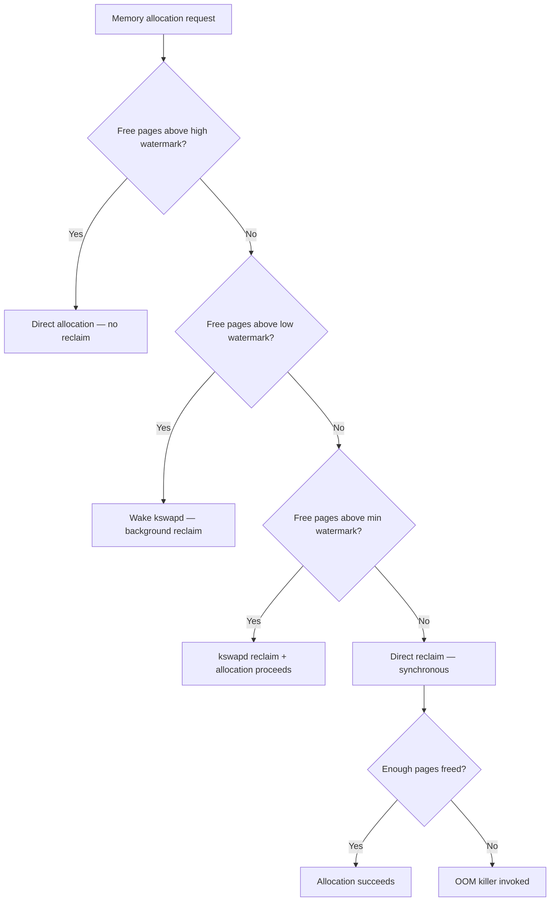
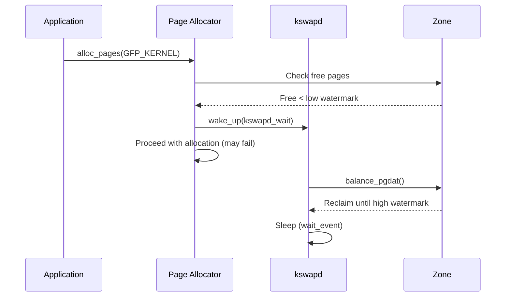
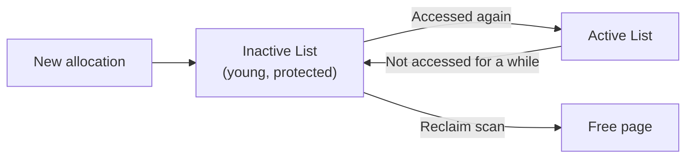
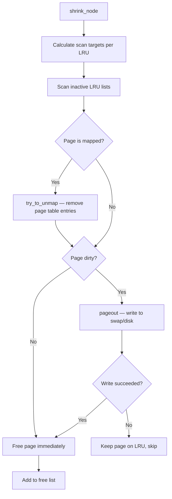

# Page Reclaim

## Overview

Page reclaim is the kernel mechanism that frees physical memory pages when the system runs low on free memory. It decides which pages to evict, writes dirty pages to swap or disk, and returns freed pages to the page allocator. Page reclaim is one of the most complex and performance-critical subsystems in the Linux memory manager.

The reclaim subsystem has two entry points: **kswapd** (background, asynchronous) and **direct reclaim** (synchronous, in the allocating context). Both operate on **LRU (Least Recently Used) lists** to identify pages that haven't been accessed recently.

> **Source:** `mm/vmscan.c` — the core reclaim engine  
> **Key functions:** `kswapd()`, `shrink_node()`, `shrink_lruvec()`, `try_to_free_pages()`

---

## Two Paths to Reclaim

### 1. Background Reclaim (kswapd)

Each NUMA node runs a `kswapd` kernel thread that proactively frees pages when memory drops below the **low watermark**. kswapd runs in the background and doesn't block allocation paths:

```c
/* mm/vmscan.c */
static int kswapd(void *p)
{
    pg_data_t *pgdat = (pg_data_t *)p;
    struct task_struct *tsk = current;

    for (;;) {
        /* Sleep until woken by zone watermark */
        wait_event_freezable(pgdat->kswapd_wait,
                             kswapd_work_requested(pgdat));

        /* Reclaim pages from all zones */
        balance_pgdat(pgdat, order, highest_zoneidx);
    }
}
```

kswapd is woken when:
- A zone's free pages drop below the **low watermark** during allocation
- A cgroup hits its memory limit
- A node needs reclaim for compaction

### 2. Direct Reclaim

When kswapd cannot keep up with allocation demand, the allocating process enters **direct reclaim** and frees pages synchronously. This blocks the caller until enough pages are freed:

```c
/* mm/page_alloc.c */
static struct page *
__alloc_pages_direct_reclaim(gfp_t gfp_mask, unsigned int order,
                             unsigned int alloc_flags,
                             const struct alloc_context *ac,
                             unsigned long *did_some_progress)
{
    struct page *page = NULL;
    unsigned long nr_reclaimed;

    nr_reclaimed = try_to_free_pages(ac->zonelist, order, gfp_mask, ac);
    if (nr_reclaimed) {
        /* Try allocation again after reclaim */
        page = __alloc_pages_slow(gfp_mask, order, alloc_flags, ac);
    }
    return page;
}
```

### Reclaim Path Selection



---

## Watermarks

Each memory zone has three watermarks that control reclaim behavior:

| Watermark | Purpose | Default |
|-----------|---------|---------|
| **min** | Critical threshold — direct reclaim forced | `min_free_kbytes / 4` per zone |
| **low** | kswapd wake-up threshold | `min + min / 4` |
| **high** | kswapd goes back to sleep | `min + min / 2` |

### Watermark Configuration

```bash
# Set minimum free memory (affects all watermarks)
sysctl vm.min_free_kbytes=65536

# Scale watermarks (percentage of zone size * 10000)
sysctl vm.watermark_scale_factor=10   # default: 10 = 0.1%

# Boost watermarks for anti-fragmentation
sysctl vm.watermark_boost_factor=15000  # default: 15000 = 150%

# Check current watermarks
cat /proc/zoneinfo | grep -E "Node|min|low|high"
```

### Watermark Flow



---

## LRU Lists

The kernel uses LRU (Least Recently Used) lists to track page age and decide which pages to reclaim first.

### Classic LRU (Two-List)

The classic LRU uses **5 lists** per LRU vector (one per zone or cgroup):

| LRU List | Contents | Reclaim Priority |
|----------|----------|-----------------|
| `LRU_INACTIVE_ANON` | Old anonymous pages | Swap candidates |
| `LRU_ACTIVE_ANON` | Young anonymous pages | Protected |
| `LRU_INACTIVE_FILE` | Old file-backed pages | Reclaim candidates |
| `LRU_ACTIVE_FILE` | Young file-backed pages | Protected |
| `LRU_UNEVICTABLE` | mlocked pages | Never reclaimed |

```c
/* include/linux/mmzone.h */
enum lru_list {
    LRU_INACTIVE_ANON = LRU_BASE,
    LRU_ACTIVE_ANON   = LRU_BASE + LRU_ANON,
    LRU_INACTIVE_FILE  = LRU_BASE + LRU_FILE,
    LRU_ACTIVE_FILE    = LRU_BASE + LRU_FILE + LRU_ANON,
    LRU_UNEVICTABLE,
    NR_LRU_LISTS
};

struct lruvec {
    struct list_head lists[NR_LRU_LISTS];  /* The 5 LRU lists */
    atomic_long_t anon_cost;                /* Anonymous page access cost */
    atomic_long_t file_cost;                /* File page access cost */
    spinlock_t lru_lock;                    /* LRU list lock */
    /* ... */
};
```

### LRU Promotion and Demotion

Pages move between active and inactive lists based on access patterns:



- **Promotion**: When a page on the inactive list is accessed (PTE Accessed bit set), it's promoted to the active list.
- **Demotion**: When the active list grows too large relative to the inactive list, pages are moved back to inactive.
- **Reclaim**: Pages at the tail of the inactive list are reclaimed first.

### Multi-Gen LRU (MGLRU, Linux 6.1, 2022)

MGLRU replaces the classic two-list approach with **multiple generations** of pages, providing better age tracking and reducing scanning overhead:

```c
/* include/linux/mmzone.h — MGLRU */
struct lru_gen_folio {
    unsigned long max_seq;           /* Newest generation */
    unsigned long min_seq[ANON_AND_FILE]; /* Oldest generation */
    struct list_head folios[MAX_NR_GENS][ANON_AND_FILE][MAX_NR_ZONES];
    /* ... */
};
```

MGLRU advantages:
- **Better age granularity**: Pages are sorted into multiple generations (typically 4+), not just active/inactive.
- **Reduced scanning**: Only scans pages that changed generation, not entire LRU lists.
- **Better THP handling**: Works at folio granularity, not individual pages.
- **Improved workload-adaptive behavior**: Automatically adjusts to different access patterns.

```bash
# Enable MGLRU (default on in most distros)
echo Y > /sys/kernel/mm/lru_gen/enabled

# MGLRU parameters
cat /sys/kernel/mm/lru_gen/enabled
# 00000000 00000000 00000000 00000001  (bit 0 = MGLRU enabled)

# MGLRU debug stats
cat /sys/kernel/debug/lru_gen
```

---

## What Gets Reclaimed

### File Pages (Page Cache)

File-backed pages (page cache) are reclaimed first because:
- **Clean pages** can be freed immediately (data is on disk)
- **Dirty pages** must be written back first (expensive)
- File pages are often re-accessable from disk

Reclaim order: clean file pages → dirty file pages → anonymous pages

### Anonymous Pages

Anonymous pages have no disk backing store, so they must be **swapped out** before reclaim:
- Requires a swap device to be configured
- Swap-out is expensive (compression + I/O)
- Pages in swap can be swapped back in on demand

### Slab Caches

Kernel slab caches (dentry, inode, etc.) are reclaimed via **shrinkers**:
- Each shrinker provides `count_objects()` and `scan_objects()` callbacks
- Shrinkers are called during reclaim to free kernel objects
- Dentry and inode caches are the most common targets

```c
/* include/linux/shrinker.h */
struct shrinker {
    unsigned long (*count_objects)(struct shrinker *, struct shrink_control *);
    unsigned long (*scan_objects)(struct shrinker *, struct shrink_control *);
    long batch;        /* Objects to free per scan */
    int seeks;         /* Cost of recreating objects */
    /* ... */
};
```

### Swappiness

The `vm.swappiness` sysctl controls the balance between reclaiming file pages vs. anonymous pages:

```bash
# 0 = strongly prefer file page reclaim (avoid swap)
# 100 = equal preference for file and anon
# 200 = strongly prefer anonymous page reclaim (use swap aggressively)
sysctl vm.swappiness=60   # default: 60
```

---

## The Reclaim Algorithm

### shrink_node()

The core reclaim function for a NUMA node:

```c
/* mm/vmscan.c */
static void shrink_node(struct pglist_data *pgdat, struct scan_control *sc)
{
    struct lruvec *lruvec;

    /* Scan each memory cgroup's LRU lists */
    mem_cgroup_iter(NULL, NULL, NULL);
    do {
        lruvec = mem_cgroup_lruvec(sc->target_mem_cgroup, pgdat);
        shrink_lruvec(lruvec, sc);
    } while (mem_cgroup_iter(NULL, sc->target_mem_cgroup, &reclaim));

    /* Also call shrinkers (slab reclaim) */
    shrink_slab(sc);
}
```

### shrink_lruvec()

Scans the inactive LRU list and reclaims pages:

```c
/* mm/vmscan.c */
static void shrink_lruvec(struct lruvec *lruvec, struct scan_control *sc)
{
    unsigned long nr[NR_LRU_LISTS];
    /* ... */
    /* Calculate how many pages to scan from each list */
    get_scan_count(lruvec, sc, nr);

    /* Scan each list */
    for_each_evictable_lru(lru) {
        if (nr[lru]) {
            shrink_list(lru, nr[lru], lruvec, sc);
        }
    }
}
```

### Reclaim Decision Flow



---

## OOM Killer

When reclaim fails to free enough memory, the OOM (Out of Memory) killer selects and kills a process to free memory:

### OOM Score

Each process has an OOM score based on its memory usage:

```bash
# Check a process's OOM score (0-1000)
cat /proc/<pid>/oom_score

# Set OOM score adjustment (-1000 to 1000)
echo -500 > /proc/<pid>/oom_score_adj
# -1000 = never kill, 1000 = always kill first
```

### OOM Selection Criteria

The OOM killer selects the process that:
1. Has the highest `oom_score` (proportional to memory usage)
2. Is not in the same cgroup that triggered the OOM (for cgroup OOM)
3. Doesn't have `oom_score_adj = -1000` (OOM-immune)
4. Has the least impact on the system when killed

```bash
# View OOM events
dmesg | grep -i "oom\|killed process"
journalctl -k | grep -i oom
```

---

## Reclaim Behavior Tunables

| Sysctl | Default | Effect |
|--------|---------|--------|
| `vm.swappiness` | 60 | Balance between anon and file reclaim (0-200) |
| `vm.vfs_cache_pressure` | 100 | Shrinker aggressiveness for dentry/inode |
| `vm.min_free_kbytes` | ~65536 | Minimum free memory per zone |
| `vm.watermark_scale_factor` | 10 | Watermark gap as % of zone size |
| `vm.watermark_boost_factor` | 15000 | Anti-fragmentation watermark boost |
| `vm.dirty_ratio` | 20 | Max dirty pages before sync writeback |
| `vm.dirty_background_ratio` | 10 | Max dirty pages before background writeback |
| `vm.zone_reclaim_mode` | 0 | Per-node reclaim policy (0=off) |
| `vm.extfrag_threshold` | 500 | Compaction vs reclaim preference |

---

## Observability

### Monitor Reclaim Activity

```bash
# Reclaim counters from /proc/vmstat
grep -E "pgscan|pgsteal|pgrefill|pgactivate|pgdeactivate" /proc/vmstat
# pgscan_kswapd      12345    — Pages scanned by kswapd
# pgscan_direct      678      — Pages scanned by direct reclaim
# pgsteal_kswapd     12000    — Pages freed by kswapd
# pgsteal_direct     600      — Pages freed by direct reclaim

# Reclaim efficiency = pgsteal / pgscan
# If ratio is low, reclaim is struggling (pages are unevictable)

# OOM statistics
grep oom_kill /proc/vmstat
```

### Trigger Memory Pressure

```bash
# Create memory pressure for testing
# Using stress-ng:
stress-ng --vm 4 --vm-bytes 2G --timeout 60s

# Using memfill (tools/mm):
echo 2G > /sys/fs/cgroup/memory/test/memory.limit
dd if=/dev/zero of=/dev/null bs=1M count=2048

# Using cgroup v2:
echo 2G > /sys/fs/cgroup/test/memory.max
```

### Trace Reclaim Events

```bash
# Enable reclaim tracepoints
echo 1 > /sys/kernel/debug/tracing/events/vmscan/mm_vmscan_lru_isolate/enable
echo 1 > /sys/kernel/debug/tracing/events/vmscan/mm_vmscan_lru_shrink_active/enable
echo 1 > /sys/kernel/debug/tracing/events/vmscan/mm_vmscan_direct_reclaim_begin/enable
echo 1 > /sys/kernel/debug/tracing/events/vmscan/mm_vmscan_direct_reclaim_end/enable

# View traces
cat /sys/kernel/debug/tracing/trace_pipe
```

### Check Zone Pressure

```bash
# PSI memory pressure (Linux 4.20+)
cat /proc/pressure/memory
# some avg10=0.00 avg60=0.00 avg300=0.00 total=0
# full avg10=0.00 avg60=0.00 avg300=0.00 total=0

# Per-cgroup pressure
cat /sys/fs/cgroup/<cgroup>/memory.pressure
```

---

## Common Issues

### Direct Reclaim Stalls

**Symptom**: Application latency spikes when memory is low.

**Cause**: The allocating thread enters direct reclaim and blocks for milliseconds while scanning LRU lists and writing dirty pages.

**Solutions**:
- Increase `vm.min_free_kbytes` to trigger kswapd earlier
- Use `vm.watermark_boost_factor` for anti-fragmentation
- Set `vm.zone_reclaim_mode=0` on NUMA systems (default)
- Use cgroup memory limits to isolate workloads

### kswapd CPU Usage

**Symptom**: kswapd consuming 100% CPU.

**Cause**: Constant memory pressure causing kswapd to never sleep.

**Solutions**:
- Add more physical memory
- Reduce application memory usage
- Enable zswap for compressed swap
- Use cgroup memory limits

### OOM Kills Despite Free Memory

**Symptom**: OOM kills when `free` shows available memory.

**Cause**: Memory is in use by page cache, slab, or is fragmented (not enough contiguous pages for the requested order).

**Solutions**:
- Check `/proc/zoneinfo` for fragmentation
- Use `cat /sys/kernel/debug/extfrag/extfrag_index`
- Consider compaction tuning
- Check for memory leaks in slab (`/proc/slabinfo`)

---

## History

| Version | Change |
|---------|--------|
| v2.4 | Initial page reclaim with simple LRU |
| v2.5 | rmap (reverse mapping) — reclaim mapped pages |
| v2.6.28 | Split LRU — separate anon/file lists |
| v2.6.35 | Memory compaction integrated with reclaim |
| v3.8 | vmpressure notifications |
| v4.20 | PSI (Pressure Stall Information) |
| v5.9 | Proactive compaction |
| v6.1 | MGLRU (Multi-Gen LRU) |

---

## Source Files

| File | Contents |
|------|----------|
| `mm/vmscan.c` | Core reclaim engine: kswapd, shrink_node, shrink_lruvec |
| `mm/oom_kill.c` | OOM killer implementation |
| `mm/memcontrol.c` | cgroup memory reclaim |
| `mm/swap.c` | LRU list management |
| `mm/workingset.c` | Working set detection |
| `include/linux/mmzone.h` | LRU list definitions |
| `include/linux/memcontrol.h` | Memory cgroup structures |

---

## Further Reading

- **Kernel documentation**: `Documentation/admin-guide/sysctl/vm.rst`
- **kernel-internals.org**: [Page Reclaim](https://kernel-internals.org/mm/reclaim/)
- **LWN**: ["The Multi-Gen LRU"](https://lwn.net/Articles/856931/) — MGLRU design
- **LWN**: ["A new approach to LRU"](https://lwn.net/Articles/495543/) — Original LRU redesign
- **Mel Gorman**: "Understanding the Linux Virtual Memory Manager"
- **Source**: `mm/vmscan.c` — reclaim implementation

---

## See Also

- [Memory Management Overview](./overview.md) — page allocator, zones
- [Page Types](./page-types.md) — what gets reclaimed
- [Swap](./swap.md) — swap subsystem for anonymous pages
- [zswap](./zswap.md) — compressed swap cache
- [zpool](./zpool.md) — compressed memory pool
- [OOM Killer](./oom-killer.md) — last-resort memory recovery
- [Memory Compaction](./compaction.md) — compaction during reclaim
- [vmpressure](./vmpressure.md) — pressure notifications
- [Idle Page Tracking](./idle-page-tracking.md) — identifying cold pages
- [GUP](./gup.md) — pinned pages affect reclaim
- [Page Cache](./page-cache.md) — file-backed page management
- [Slab Allocator](./slab-allocator.md) — kernel object reclaim
