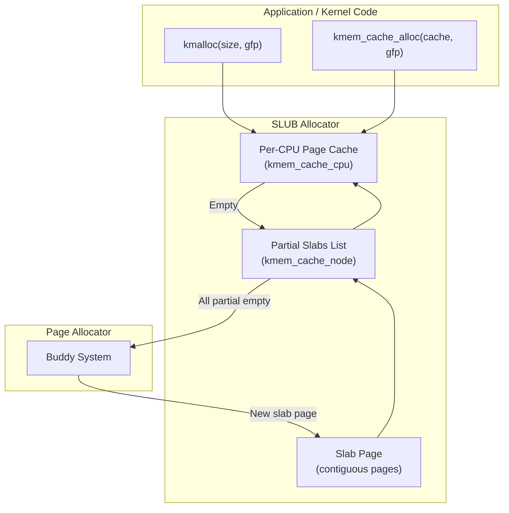

# Slab Allocator (SLAB/SLUB/SLOB)

## Introduction

The Linux kernel frequently needs to allocate small, fixed-size objects — data structures like `struct task_struct`, `struct inode`, `struct dentry`, etc. Allocating these directly from the page allocator (which works in units of pages) would be extremely wasteful. The **slab allocator** solves this by pre-allocating pages and carving them into fixed-size objects, providing fast allocation and freeing with minimal overhead.

Linux has three slab allocator implementations:
- **SLAB**: The original, feature-rich allocator (being phased out)
- **SLUB**: The default allocator since Linux 2.6.22 — simpler, more scalable, better NUMA performance
- **SLOB**: A minimal allocator for embedded systems with very limited memory

## Slab Allocator Architecture

### Design Principles

1. **Object pooling**: Pre-allocate objects and reuse them without returning to the page allocator.
2. **Per-CPU caches**: Reduce lock contention by caching objects per CPU.
3. **NUMA awareness**: Allocate objects from the local NUMA node when possible.
4. **Slab merging**: Combine caches with similar object sizes to reduce fragmentation.



## SLUB Allocator (Default)

### Key Data Structures

```c
/* include/linux/slub_def.h */

/* Per-CPU cache: fast path for allocation */
struct kmem_cache_cpu {
    union {
        struct {
            unsigned long tid;    /* Transaction ID for lockless fast path */
            freelist_aba_t freelist; /* Pointer to first free object */
        };
        freelist_aba_t freelist_aba;
    };
    struct slab *slab;     /* Slab from which objects are being allocated */
#ifdef CONFIG_SLUB_CPU_PARTIAL
    struct slab *partial;  /* Per-CPU partial slab list */
#endif
    /* ... stat counters ... */
};

/* Per-node structure: manages partial slab lists */
struct kmem_cache_node {
    spinlock_t list_lock;        /* Protects the lists */
    unsigned long nr_partial;    /* Number of partial slabs */
    struct list_head partial;    /* List of partial slabs */
    /* ... */
};

/* The slab cache descriptor */
struct kmem_cache {
    struct kmem_cache_cpu __percpu *cpu_slab; /* Per-CPU caches */
    slab_flags_t flags;            /* Cache flags */
    unsigned long min_partial;     /* Minimum partial slabs to keep */
    unsigned int size;             /* Object size including metadata */
    unsigned int object_size;      /* Actual object size */
    struct reciprocal_value reciprocal_size;
    unsigned int offset;           /* Free pointer offset within object */
    struct kmem_cache_node *node[MAX_NUMNODES]; /* Per-node data */

    const char *name;              /* Cache name (shown in /proc/slabinfo) */
    struct list_head list;         /* List of all caches */

    /* Constructor/destructor */
    void (*ctor)(void *object);

    /* ... sizing, debugging, sysfs fields ... */
};
```

### Slab Page Layout

A slab is one or more contiguous pages that contain objects. The metadata (free list pointer) is stored either within the objects themselves or in a separate area:

```c
/* mm/slub.c */
struct slab {
    unsigned long __page_flags;
    struct kmem_cache *slab_cache;  /* Back-pointer to cache */
    union {
        struct {
            union {
                struct list_head slab_list;  /* Node partial list */
                struct rcu_head rcu_head;
            };
            struct {
                void *freelist;     /* First free object */
                union {
                    unsigned long counters;
                    struct {
                        unsigned inuse:16;
                        unsigned objects:15;
                        unsigned frozen:1;
                    };
                };
            };
        };
    };
    /* ... */
};
```

Free objects are linked via an embedded free list. The free pointer is stored at `object + cache->offset`:

```c
/* Simplified: free pointer stored within the object */
object[0] -> next_free = object[1]
object[1] -> next_free = object[2]
object[2] -> next_free = NULL
/* freelist points to object[0] */
```

### Allocation Fast Path

```c
/* mm/slub.c (simplified) */
static __always_inline void *slab_alloc_node(struct kmem_cache *s,
                                              gfp_t gfpflags,
                                              int node, unsigned long addr)
{
    void *object;
    struct kmem_cache_cpu *c;
    unsigned long tid;

    /* Get per-CPU slab */
    c = raw_cpu_ptr(s->cpu_slab);

    /* Lockless fast path: check freelist */
    if (likely(c->freelist)) {
        object = c->freelist;
        c->freelist = get_freepointer(s, object);
        return object;
    }

    /* Slow path: try partial list, allocate new slab */
    return __slab_alloc(s, gfpflags, node, addr);
}
```

The fast path is extremely efficient — just a pointer dereference and update, no locks needed (uses transaction-ID-based optimistic concurrency).

### Allocation Slow Path

```c
/* mm/slub.c (simplified) */
static void *__slab_alloc(struct kmem_cache *s, gfp_t gfpflags,
                           int node, unsigned long addr)
{
    struct kmem_cache_cpu *c = raw_cpu_ptr(s->cpu_slab);

    /* 1. Check per-CPU partial list */
    if (c->partial) {
        c->slab = c->partial;
        c->partial = c->slab->next;
        goto new_slab;
    }

    /* 2. Check per-node partial list */
    if (kmem_cache_has_cpu_partial(s)) {
        /* Transfer partial slabs from node to CPU */
        /* ... */
    }

    /* 3. Allocate a new slab from page allocator */
    c->slab = allocate_slab(s, gfpflags, node);
    if (!c->slab)
        return NULL;

new_slab:
    /* Initialize slab and return first object */
    c->freelist = c->slab->freelist;
    object = c->freelist;
    c->freelist = get_freepointer(s, object);
    return object;
}
```

### Free Path

```c
/* mm/slub.c (simplified) */
static __always_inline void slab_free(struct kmem_cache *s,
                                       struct slab *slab,
                                       void *object,
                                       unsigned long addr)
{
    /* Fast path: put back on per-CPU freelist */
    if (slab == c->slab) {
        set_freepointer(s, object, c->freelist);
        c->freelist = object;
        return;
    }

    /* Slow path: returning to a different slab */
    __slab_free(s, slab, object, addr);
}
```

## SLAB Allocator (Legacy)

SLAB was the original Linux slab allocator. It uses per-CPU object arrays (array caches) and per-node shared caches. SLAB is more complex than SLUB but was the default for many years:

```c
/* mm/slab.c (simplified SLAB structure) */
/*
 * Per-CPU array cache: holds recently freed objects
 * Per-node shared cache: overflow from array caches
 * Per-node alien cache: objects from other NUMA nodes
 * Slab pages: contain the actual objects
 */
```

SLAB was removed from the kernel in Linux 6.8. SLUB is now the only full-featured allocator.

## SLOB Allocator

SLOB is a minimal allocator for embedded systems:

```c
/* mm/slob.c */
/*
 * SLOB uses a simple first-fit algorithm:
 * - Maintains free lists sorted by size
 * - Very small code footprint (~6KB)
 * - No per-CPU caches
 * - Poor performance under heavy load
 * - Suitable for systems with <64MB RAM
 */
```

```bash
# Select slab allocator at compile time
# CONFIG_SLAB=y    (legacy, removed in 6.8)
# CONFIG_SLUB=y    (default)
# CONFIG_SLOB=y    (embedded)
```

## kmem_cache: Creating Object Caches

### Defining a Cache

```c
/* Kernel example: creating a slab cache */
#include <linux/slab.h>

/* Define a cache for struct my_object */
struct kmem_cache *my_cache;

static int __init my_init(void)
{
    my_cache = kmem_cache_create(
        "my_object_cache",     /* Name (appears in /proc/slabinfo) */
        sizeof(struct my_object), /* Object size */
        0,                     /* Alignment (0 = default) */
        SLAB_HWCACHE_ALIGN,    /* Flags */
        NULL                   /* Constructor */
    );
    if (!my_cache)
        return -ENOMEM;

    return 0;
}

/* Allocate an object */
struct my_object *obj = kmem_cache_alloc(my_cache, GFP_KERNEL);

/* Free an object */
kmem_cache_free(my_cache, obj);

/* Destroy the cache (all objects must be freed first) */
kmem_cache_destroy(my_cache);
```

### Cache Flags

```c
/* include/linux/slab.h */
#define SLAB_HWCACHE_ALIGN   0x00002000  /* Align to hardware cache line */
#define SLAB_CACHE_DMA       0x00004000  /* Allocate from DMA zone */
#define SLAB_PANIC           0x00040000  /* Panic on failure */
#define SLAB_TYPESAFE_BY_RCU 0x00080000  /* RCU-safe freeing */
#define SLAB_MEM_SPREAD      0x00100000  /* Spread allocations across nodes */
#define SLAB_TRACE           0x00200000  /* Trace allocations */
```

## kmalloc Family

### kmalloc — The Primary Small Allocator

`kmalloc()` is the most common kernel memory allocation function. It allocates physically contiguous memory from a size-indexed slab cache:

```c
/* include/linux/slab.h */
void *kmalloc(size_t size, gfp_t flags);
void kfree(const void *ptr);

/* Size-specific variants for known sizes (compile-time optimized) */
void *kmalloc_track_caller(size_t size, gfp_t flags);  /* Tracks actual caller */
void *kvmalloc_node(size_t size, gfp_t flags, int node); /* vmalloc fallback */

/* Array allocation */
void *kmalloc_array(size_t n, size_t size, gfp_t flags);
void *kcalloc(size_t n, size_t size, gfp_t flags); /* Zero-initialized */
```

### Size Classes

SLUB maintains multiple caches for different size ranges. On a typical system:

```bash
$ cat /proc/slabinfo | grep -E "^kmalloc" | head -20
# name            <active_objs> <num_objs> <objsize> <objperslab> <pagesperslab>
kmalloc-8k           256    256   8192    4    8
kmalloc-4k          1024   1024   4096    8    8
kmalloc-2k          2048   2048   2048   16    8
kmalloc-1k          4096   4096   1024   16    4
kmalloc-512         8192   8192    512   16    2
kmalloc-256        16384  16384    256   16    1
kmalloc-128        32768  32768    128   32    1
kmalloc-64         65536  65536     64   64    1
kmalloc-32        131072 131072     32  128    1
kmalloc-16        262144 262144     16  256    1
kmalloc-8         524288 524288      8  512    1
```

### How kmalloc Works

```c
/* mm/slub.c (simplified) */
static __always_inline void *__kmalloc(size_t size, gfp_t flags)
{
    struct kmem_cache *s;
    void *ret;

    /* Find the appropriate size-indexed cache */
    if (size <= KMALLOC_MAX_CACHE_SIZE) {
        s = kmalloc_caches[kmalloc_index(size)][kmalloc_type(flags)];
        ret = slab_alloc_node(s, flags, NUMA_NO_NODE, _RET_IP_);
    } else {
        /* Large allocation: go directly to page allocator */
        ret = __kmalloc_large(size, flags);
    }

    return ret;
}

/* Map size to cache index (power-of-2 rounding) */
static __always_inline unsigned int kmalloc_index(size_t size)
{
    if (!size) return 0;
    if (size <= 8) return 3;       /* kmalloc-8 */
    if (size <= 16) return 4;      /* kmalloc-16 */
    if (size <= 32) return 5;      /* kmalloc-32 */
    if (size <= 64) return 6;      /* kmalloc-64 */
    if (size <= 128) return 7;     /* kmalloc-128 */
    if (size <= 256) return 8;     /* kmalloc-256 */
    if (size <= 512) return 9;     /* kmalloc-512 */
    if (size <= 1024) return 10;   /* kmalloc-1k */
    if (size <= 2048) return 11;   /* kmalloc-2k */
    if (size <= 4096) return 12;   /* kmalloc-4k */
    if (size <= 8192) return 13;   /* kmalloc-8k */
    /* ... up to KMALLOC_MAX_SIZE (usually 8192 or 32768) */
    return 0; /* Should not reach here */
}
```

### kfree

```c
/* mm/slub.c */
void kfree(const void *x)
{
    struct page *page;
    void *object = (void *)x;

    page = virt_to_head_page(x);
    if (unlikely(!PageSlab(page))) {
        /* Large kmalloc: free pages directly */
        free_pages((unsigned long)x, compound_order(page));
        return;
    }

    /* Return to slab cache */
    slab_free(page->slab_cache, page, object, _RET_IP_);
}
```

## Slab Merging

### The Problem

Different subsystems may create caches with similar object sizes. To reduce waste, SLUB can merge compatible caches:

```c
/* mm/slab_common.c */
/*
 * Two caches can be merged if:
 * 1. Same object size
 * 2. Same alignment
 * 3. Compatible flags
 * 4. No custom constructor/destructor
 */
```

### Merge Control

```bash
# Disable slab merging (for debugging)
$ cat /proc/cmdline | tr ' ' '\n' | grep slub
slub_nomerge

# Or via sysfs
$ cat /sys/kernel/slab/kmalloc-64/merge
kmalloc-64

# View merged caches
$ ls /sys/kernel/slab/
kmalloc-8        kmalloc-128    kmalloc-1k     ...
dentry           inode_cache    ext4_inode_cache ...
```

## Debugging and Monitoring

### /proc/slabinfo

```bash
$ cat /proc/slabinfo
slabinfo - version: 2.1
# name            <active_objs> <num_objs> <objsize> <objperslab> <pagesperslab> : tunables <limit> <batchcount> <sharedfactor> : slabdata <active_slabs> <num_slabs> <sharedavail>
# Global stats:
slabinfo - version: 2.1
# name            <active_objs> <num_objs> <objsize> <objperslab> <pagesperslab>
kmalloc-8         1024   1024     8  512    1
dentry             8192  8192   192   21    1
inode_cache        4096  4096   640   25    4
ext4_inode_cache   2048  2048  1088   15    4
task_struct         256   256  6016    5    8
signal_cache        128   128  1152   14    4
mm_struct            64    64  1664   19    8
```

### /sys/kernel/slab/

```bash
# Per-cache detailed statistics
$ cat /sys/kernel/slab/kmalloc-64/alloc_fastpath
12345678

$ cat /sys/kernel/slab/kmalloc-64/alloc_slowpath
12345

$ cat /sys/kernel/slab/kmalloc-64/free_fastpath
12340000

$ cat /sys/kernel/slab/kmalloc-64/object_size
64

$ cat /sys/kernel/slab/kmalloc-64/slab_size
64

$ cat /sys/kernel/slab/kmalloc-64/objs_per_slab
64

$ cat /sys/kernel/slab/kmalloc-64/order
1
```

### Slab Memory in /proc/meminfo

```bash
$ grep -E "Slab|SReclaim|SUnreclaim" /proc/meminfo
Slab:            1048576 kB    # Total slab memory
SReclaimable:     786432 kB    # Reclaimable (dentry, inode caches)
SUnreclaim:       262144 kB    # Unreclaimable (kmalloc, task_struct)
```

### slabtop

```bash
$ slabtop -o | head -20
 Active / Total Objects (% used)    : 123456 / 134567 (91.7%)
 Active / Total Slabs (% used)      : 3456 / 3456 (100.0%)
 Active / Total Caches              : 78 / 120
 Active / Total Size (% used)       : 45678.90K / 52345.67K (87.3%)
 Minimum / Average / Maximum Object : 0.01K / 0.37K / 8.00K

  OBJS ACTIVE  USE OBJ SIZE  SLABS OBJ/SLAB CACHE SIZE NAME
 65536  62345  95%    0.06K   1024       64      4096K kmalloc-64
 32768  31200  95%    0.19K    512       64      6144K dentry
 16384  15200  92%    0.58K    512       32      9216K radix_tree_node
  8192   7600  92%    1.00K    256       32      8192K kmalloc-1k
  4096   3800  92%    0.63K    128       32      4096K inode_cache
  2048   1900  92%    0.50K     64       32      2048K kmalloc-512
```

## SLUB Allocator Internals: The Transaction ID

SLUB uses a lockless fast path based on a transaction ID (TID) to avoid CMPXCHG:

```c
/* mm/slub.c */
static __always_inline void *slab_alloc_node(struct kmem_cache *s,
                                              gfp_t gfpflags,
                                              int node, unsigned long addr)
{
    void *object;
    struct kmem_cache_cpu *c;
    unsigned long tid;
    freelist_aba_t freelist;

    c = raw_cpu_ptr(s->cpu_slab);

    do {
        tid = this_cpu_read(s->cpu_slab->tid);
        freelist = this_cpu_read(s->cpu_slab->freelist);

        if (!freelist.freelist)
            goto slowpath;

        /* Optimistic: assume freelist won't change */
        object = freelist.freelist;
        freelist.freelist = get_freepointer(s, object);

    } while (!this_cpu_try_cmpxchg_double(s->cpu_slab->freelist,
                                            s->cpu_slab->tid,
                                            freelist, tid));

    return object;

slowpath:
    return __slab_alloc(s, gfpflags, node, addr);
}
```

## kmem_cache Flags and NUMA Behavior

### Per-Node vs Global Caches

By default, each NUMA node has its own set of slab pages. Objects are preferentially allocated from the local node:

```c
/* Allocate from specific node */
void *obj = kmem_cache_alloc_node(cache, GFP_KERNEL, node_id);

/* Allocate from current node (default) */
void *obj = kmem_cache_alloc(cache, GFP_KERNEL);
```

### SLAB_TYPESAFE_BY_RCU

This flag allows objects to be accessed after `kfree()` under RCU protection — the physical memory is not immediately returned to the page allocator:

```c
my_cache = kmem_cache_create("my_cache", sizeof(struct my_obj),
                              0, SLAB_TYPESAFE_BY_RCU, NULL);

/* Objects freed with kfree_rcu() or call_rcu() */
kfree_rcu(obj, rcu_head);
```

## Allocator Comparison

| Feature | SLUB (default) | SLAB (removed 6.8) | SLOB |
|---------|---------------|-------------------|------|
| Per-CPU caches | Yes (freelist) | Yes (array cache) | No |
| NUMA support | Yes | Yes | No |
| Lockless fast path | Yes (TID-based) | No | No |
| Slab merging | Yes | Yes | No |
| Code size | Medium | Large | Small |
| Debugging | Extensive | Extensive | Minimal |
| Performance | Best overall | Good | Worst |
| Use case | General | Legacy | Embedded (<64MB) |

## Code Example: Kernel Module with Custom Cache

```c
#include <linux/module.h>
#include <linux/slab.h>
#include <linux/list.h>

struct widget {
    int id;
    char name[32];
    struct list_head list;
};

static struct kmem_cache *widget_cache;
static LIST_HEAD(widget_list);

static struct widget *create_widget(int id, const char *name)
{
    struct widget *w;

    w = kmem_cache_alloc(widget_cache, GFP_KERNEL);
    if (!w)
        return NULL;

    w->id = id;
    strscpy(w->name, name, sizeof(w->name));
    list_add(&w->list, &widget_list);
    return w;
}

static void destroy_widget(struct widget *w)
{
    list_del(&w->list);
    kmem_cache_free(widget_cache, w);
}

static int __init widget_init(void)
{
    widget_cache = kmem_cache_create("widget_cache",
                                      sizeof(struct widget),
                                      0, SLAB_HWCACHE_ALIGN, NULL);
    if (!widget_cache)
        return -ENOMEM;

    create_widget(1, "alpha");
    create_widget(2, "beta");
    create_widget(3, "gamma");

    pr_info("Created 3 widgets, cache: %s\n",
            kmem_cache_name(widget_cache));

    return 0;
}

static void __exit widget_exit(void)
{
    struct widget *w, *tmp;

    list_for_each_entry_safe(w, tmp, &widget_list, list)
        destroy_widget(w);

    kmem_cache_destroy(widget_cache);
    pr_info("All widgets destroyed\n");
}

module_init(widget_init);
module_exit(widget_exit);
MODULE_LICENSE("GPL");
```

## References

- [The Linux Kernel Documentation](https://docs.kernel.org/)
- [GNU Project Documentation](https://www.gnu.org/doc/doc.html)
- [GNU Manuals](https://www.gnu.org/manual/manual.html)
- [Free Software Directory](https://directory.fsf.org/wiki/Main_Page)
- [Planet GNU](https://planet.gnu.org/)
- [Free Software Books](https://www.gnu.org/doc/other-free-books.html)

- **Linux Kernel Development, 3rd Edition** — Chapter 12: Memory Management (Slab Allocator)
- **Understanding the Linux Kernel, 3rd Edition** — Chapter 8: Memory Management
- [Kernel source: mm/slub.c](https://elixir.bootlin.com/linux/latest/source/mm/slub.c)
- [Kernel source: mm/slab_common.c](https://elixir.bootlin.com/linux/latest/source/mm/slab_common.c)
- [Kernel documentation: Slab Allocator](https://docs.kernel.org/mm/slab.html)
- [Kernel documentation: Memory Allocation Guide](https://docs.kernel.org/core-api/memory-allocation.html)
- [LWN: SLUB allocator](https://lwn.net/Articles/229984/)
- [Christoph Lameter: SLUB — The Unqueued Slab Allocator](https://www.kernel.org/doc/gorman/html/understand/understand011.html)

## Related Topics

- [Page Allocator](page-allocator.md) — Underlying physical page allocation
- [vmalloc vs kmalloc](vmalloc-kmalloc.md) — When to use which allocator
- [Memory Management Overview](overview.md) — High-level overview
- [OOM Killer](oom-killer.md) — Memory exhaustion handling
