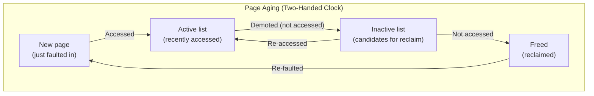
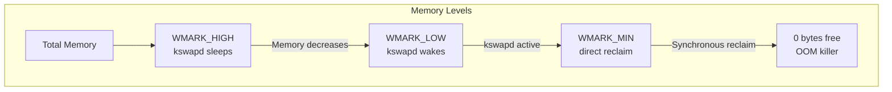

# Swap Subsystem

## Introduction

The swap subsystem extends available memory by moving inactive pages from RAM to a designated area on disk (swap space). When physical memory is scarce and the kernel needs to reclaim pages, it can write anonymous pages (heap, stack, data segments) to swap and free the physical frames. Later, if a swapped-out page is accessed, a major page fault occurs and the page is read back from swap.

Swap is essential for:
- **Overcommit**: Allowing processes to use more virtual memory than physical RAM
- **Hibernation**: Storing the entire system state to disk
- **Memory pressure relief**: Keeping the system running instead of killing processes
- **NUMA balancing**: Moving pages between nodes

## Swap Areas

### Types of Swap

Linux supports two types of swap areas:

1. **Swap partition**: A dedicated disk partition (e.g., `/dev/sda2`)
2. **Swap file**: A regular file on a filesystem

```bash
# Create a swap partition
$ sudo mkswap /dev/sdb1
$ sudo swapon /dev/sdb1

# Create a swap file
$ sudo fallocate -l 4G /swapfile
$ sudo chmod 600 /swapfile
$ sudo mkswap /swapfile
$ sudo swapon /swapfile

# View active swap areas
$ swapon --show
NAME      TYPE      SIZE  USED  PRIO
/dev/sdb1 partition   8G  256M     0
/swapfile  file        4G    0B    -2
```

### Swap Header and Layout

Each swap area has a header containing metadata:

```c
/* include/linux/swap.h */
struct swap_header {
    union {
        struct {
            char reserved[PAGE_SIZE - 10];
            char magic[10];           /* "SWAP-SPACE2" or "SWAPSPACE2" */
        } magic;
        struct {
            __u32 version;
            __u32 last_page;
            __u32 nr_badpages;
            unsigned char sws_uuid[16];
            unsigned char sws_volume[16];
            __u32 padding[117];
            __u32 badpages[1];
        } info;
    };
};
```

### Swap Info Structure

```c
/* include/linux/swap.h (simplified) */
struct swap_info_struct {
    unsigned long flags;
    short prio;                    /* Priority (higher = used first) */
    struct file *swap_file;        /* Underlying file/device */
    struct block_device *bdev;     /* Block device */
    struct swap_cluster_info *cluster_info; /* Cluster-based allocation */
    struct swap_cluster_list free_clusters; /* Free clusters */
    unsigned int max;              /* Maximum page slot */
    unsigned int inuse_pages;      /* Currently used pages */
    int pages;                     /* Total usable pages */
    unsigned char *swap_map;       /* Per-page reference counts */
    struct swap_cluster_info *cluster_info;
    /* ... */
};
```

## Swap Cache

### Purpose

The swap cache sits between the page cache and swap space. When a page is being swapped out, it temporarily exists in both the page cache and swap space. The swap cache:

1. **Prevents redundant I/O**: If the page is accessed during writeback, it can be found in the swap cache without reading from disk.
2. **Handles races**: Between the decision to swap out and the actual disk write.
3. **Simplifies swap-in**: When swapping in, the kernel first checks the swap cache.

```c
/* mm/swap_state.c */
struct address_space swapper_spaces[MAX_SWAPFILES] = {
    [0 ... MAX_SWAPFILES-1] = {
        .i_pages = XARRAY_INIT(swapper_spaces[0].i_pages,
                                XA_FLAGS_LOCK_IRQ),
        .a_ops = &swap_aops,
    }
};
```

### Swap Cache Operations

```c
/* mm/swap_state.c (simplified) */

/* Add a page to the swap cache */
int add_to_swap_cache(struct folio *folio, swp_entry_t entry,
                      gfp_t gfp)
{
    struct address_space *address_space = swap_address_space(entry);
    pgoff_t idx = swp_offset(entry);

    return filemap_add_folio(address_space, folio, idx, gfp);
}

/* Look up a page in the swap cache */
struct folio *filemap_get_folio(struct address_space *mapping,
                                pgoff_t index)
{
    return xa_load(&mapping->i_pages, index);
}
```

## Swap Entry Format

A swap entry encodes the swap device and offset:

```c
/* include/linux/swapops.h */
typedef struct {
    unsigned long val;
} swp_entry_t;

/* Encode: device + offset */
swp_entry_t swp_entry(unsigned type, pgoff_t offset)
{
    swp_entry_t ret;
    ret.val = (type << SWP_TYPE_SHIFT(offset)) |
              (offset << SWP_OFFSET_SHIFT);
    return ret;
}

/* Decode */
unsigned swp_type(swp_entry_t entry)
{
    return (entry.val >> SWP_TYPE_SHIFT(entry.val)) & SWP_TYPE_MASK;
}

pgoff_t swp_offset(swp_entry_t entry)
{
    return entry.val >> SWP_OFFSET_SHIFT(entry.val);
}
```

The PTE format for a swapped-out page:

```
PTE (page not present, swapped out):
┌─────────────────────────────────────┬──────────┐
│ Swap type + offset                  │ Present=0 │
│ (encoded in bits 1-62)              │ Bit 0=0   │
└─────────────────────────────────────┴──────────┘
```

## Swap Allocation

### Cluster-Based Allocation

Modern Linux uses **cluster-based** swap allocation for better I/O performance:

```c
/* mm/swapfile.c (simplified) */
struct swap_cluster_info {
    unsigned int data:24;
    unsigned char flags;
};

/* Allocate a swap cluster (typically 256 pages = 1 MB) */
static struct swap_cluster_info *alloc_cluster(struct swap_info_struct *sis,
                                                unsigned long idx)
{
    struct swap_cluster_info *ci;

    ci = sis->cluster_info + idx / SWAP_CLUSTER_SIZE;
    ci->data = idx;
    ci->flags = CLUSTER_FLAG_HUGE;  /* For THP swap */

    return ci;
}
```

### Swap Slot Allocation

```c
/* mm/swapfile.c (simplified) */
int get_swap_pages(int n_goal, swp_entry_t *entries)
{
    struct swap_info_struct *si;
    int n_ret = 0;

    /* Iterate through swap devices by priority */
    for_each_swap_info(si) {
        /* Allocate from this device */
        n_ret += scan_swap_map_slots(si, SWAP_CLUSTER_MAX,
                                      entries + n_ret);
        if (n_ret >= n_goal)
            break;
    }

    return n_ret;
}
```

## Page Reclaim

### LRU Lists

The kernel tracks all reclaimable pages on LRU (Least Recently Used) lists:

```c
/* include/linux/mmzone.h */
enum lru_list {
    LRU_INACTIVE_ANON,   /* Old anonymous pages (candidates for swap) */
    LRU_ACTIVE_ANON,     /* Recently used anonymous pages */
    LRU_INACTIVE_FILE,   /* Old file pages (page cache) */
    LRU_ACTIVE_FILE,     /* Recently used file pages */
    LRU_UNEVICTABLE,     /* mlock'd pages */
    NR_LRU_LISTS
};

struct lruvec {
    struct list_head lists[NR_LRU_LISTS];
    /* ... */
};
```



### The Aging Process

The kernel periodically scans pages to determine which are active:

```c
/* mm/vmscan.c (simplified) */
static void shrink_active_list(unsigned long nr_to_scan,
                                struct lruvec *lruvec)
{
    struct folio *folio;
    LIST_HEAD(l_hold);

    /* Move pages from active to temp list */
    while (nr_to_scan--) {
        folio = lru_to_folio(&lruvec->lists[LRU_ACTIVE_FILE]);
        list_move(&folio->lru, &l_hold);
    }

    /* Check access bits */
    list_for_each_entry_safe(folio, ..., &l_hold, lru) {
        if (folio_test_referenced(folio) || folio_test_workingset(folio)) {
            /* Still active: put back on active list */
            list_move(&folio->lru, &lruvec->lists[LRU_ACTIVE_FILE]);
            folio_clear_referenced(folio);
        } else {
            /* Demote to inactive list */
            list_move(&folio->lru, &lruvec->lists[LRU_INACTIVE_FILE]);
        }
    }
}
```

### Reclaim Decision

For each page on the inactive list, the reclaimer decides:

```c
/* mm/vmscan.c (simplified) */
static enum folio_references folio_check_references(struct folio *folio,
                                                      struct scan_control *sc)
{
    int referenced_ptes, referenced_folio;
    bool dirty = folio_test_dirty(folio);

    referenced_ptes = folio_referenced(folio, 0, &vm_flags, NULL);
    referenced_folio = folio_test_clear_referenced(folio);

    if (referenced_ptes || referenced_folio) {
        /* Page was accessed — promote back to active */
        return FOLIO_REFERENCED;
    }

    if (dirty && !folio_test_writeback(folio)) {
        /* Dirty page: write back to disk */
        return FOLIO_DIRTY;
    }

    /* Clean file page or swapbacked: can reclaim */
    return FOLIO_RECLAIM_CLEAN;
}
```

## kswapd: Background Reclaim

### The kswapd Daemon

`kswapd` is a kernel thread per NUMA node that performs background page reclaim when memory drops below the low watermark:

```c
/* mm/vmscan.c */
static int kswapd(void *p)
{
    pg_data_t *pgdat = p;
    struct task_struct *tsk = current;

    for (;;) {
        /* Sleep until woken by memory pressure */
        wait_event_interruptible(pgdat->kswapd_wait,
                     kswapd_wait_event(pgdat));

        /* Reclaim pages until watermarks are satisfied */
        balance_pgdat(pgdat, 0, &highest_zoneidx);
    }
}
```

### Watermark-Based Activation



```bash
# View zone watermarks
$ cat /proc/zoneinfo | grep -E "min|low|high"
        min      1024
        low      1280
        high     1536
```

## Direct Reclaim

When allocations cannot proceed (below min watermark), the calling process enters **direct reclaim** — synchronously reclaiming pages:

```c
/* mm/vmscan.c (simplified) */
static unsigned long try_to_free_pages(struct zonelist *zonelist,
                                        int order, gfp_t gfp_mask)
{
    struct scan_control sc = {
        .gfp_mask = gfp_mask,
        .order = order,
        .priority = DEF_PRIORITY,
        .may_writepage = !laptop_mode,
        .may_unmap = 1,
        .may_swap = 1,
    };

    /* Try to reclaim at decreasing priority */
    do {
        shrink_zones(&sc);
        if (sc.nr_reclaimed >= SWAP_CLUSTER_MAX)
            break;
        sc.priority--;
    } while (sc.priority >= 1);

    return sc.nr_reclaimed;
}
```

## Swappiness

### What It Controls

The `swappiness` parameter controls the balance between reclaiming file pages (page cache) and anonymous pages (swap):

```bash
$ cat /proc/sys/vm/swappiness
60

# Range: 0-200
# 0: Only swap if absolutely necessary (prefer file cache)
# 60: Default (balanced)
# 100: Equal preference
# 200: Strongly prefer swapping (aggressive swap usage)
```

### How It Works

```c
/* mm/vmscan.c (simplified) */
static void get_scan_count(struct lruvec *lruvec,
                            struct scan_control *sc,
                            unsigned long *nr)
{
    /* Calculate scanning ratio for anon vs file pages */
    unsigned long ap, fp;
    int swappiness = mem_cgroup_swappiness(memcg);

    ap = swappiness * (lruvec_size(LRU_INACTIVE_ANON) +
                       lruvec_size(LRU_ACTIVE_ANON));
    fp = (200 - swappiness) * (lruvec_size(LRU_INACTIVE_FILE) +
                                lruvec_size(LRU_ACTIVE_FILE));

    /* Scan anon and file lists proportionally */
    /* Higher swappiness → more anon scanning → more swapping */
}
```

### Tuning Guidelines

| Workload | Recommended swappiness | Reasoning |
|----------|----------------------|-----------|
| Database server | 10-30 | Keep data in page cache, minimize swap |
| Desktop | 60 (default) | Balanced responsiveness |
| Embedded (no swap) | 0 | Avoid swap entirely |
| Container host | 10-60 | Depends on workload |
| Hibernation setup | 60+ | Need swap for hibernate image |

## Swap Statistics

### System-Wide

```bash
$ cat /proc/meminfo | grep Swap
SwapTotal:       8388608 kB    # Total swap space
SwapFree:        8126464 kB    # Free swap space
SwapCached:       131072 kB    # Pages in swap cache (also in RAM)

$ cat /proc/vmstat | grep -E "pswp|pgpg"
pgpgin    1843200     # Pages read from disk
pgpgout   2457600     # Pages written to disk
pswpin       1024     # Pages swapped in
pswpout      2048     # Pages swapped out
```

### Per-Process

```bash
# Per-process swap usage
$ cat /proc/<pid>/status | grep VmSwap
VmSwap:        256 kB

# Detailed per-process swap
$ for pid in $(ls /proc/ | grep -E '^[0-9]+$'); do
    swap=$(awk '/VmSwap/{print $2}' /proc/$pid/status 2>/dev/null)
    if [ "$swap" -gt 0 ] 2>/dev/null; then
        name=$(cat /proc/$pid/comm)
        echo "$pid $name ${swap}kB"
    fi
done | sort -k3 -n -r | head -10

# smaps shows per-VMA swap usage
$ cat /proc/<pid>/smaps | grep Swap
Swap:                  0 kB
SwapPss:               0 kB
Swap:                128 kB
```

## Swap on Modern Systems

### SSD vs HDD Swap

| Aspect | SSD | HDD |
|--------|-----|-----|
| Latency | ~100 μs | ~10 ms |
| IOPS | 50,000+ | 100-200 |
| Wear concerns | Yes (limited write cycles) | No |
| Recommended swappiness | 10-30 | 60 |
| Zram swap | Preferred | Preferred |

### Zram (Compressed RAM Swap)

Zram creates a compressed swap device in RAM — trading CPU time for effective memory:

```bash
# Load zram module
$ sudo modprobe zram num_devices=1

# Configure zram (2GB compressed swap)
$ echo lz4 > /sys/block/zram0/comp_algorithm
$ echo 2G > /sys/block/zram0/disksize
$ sudo mkswap /dev/zram0
$ sudo swapon -p 100 /dev/zram0  # High priority (use before disk swap)

# Check zram stats
$ cat /sys/block/zram0/mm_stat
    orig_data_size    compr_data_size  mem_used_total  mem_limit  ...
         1073741824         358039552       402653184  2147483648  ...
```

Zram provides 2-3x effective memory expansion with ~10% CPU overhead.

## Swap Prefetch and Readahead

When swapping in a page, the kernel may read adjacent swap slots proactively:

```c
/* mm/swap_state.c */
static void swap_readahead(struct swap_info_struct *si,
                            pgoff_t offset)
{
    /* Read ahead N pages from swap */
    /* Typically 2-8 pages depending on access pattern */
}
```

## THP (Transparent Huge Pages) Swap

With THP, the kernel can swap out entire 2 MiB huge pages as a single unit:

```c
/* mm/swapfile.c */
int swap_writepage(struct page *page, struct writeback_control *wbc)
{
    if (PageTransHuge(page)) {
        /* Write entire 2 MiB as one swap slot cluster */
        return swap_writepage_thp(page, wbc);
    }
    /* Write single 4 KiB page */
    return __swap_writepage(page, wbc);
}
```

See [Huge Pages](huge-pages.md) for details.

## Emergency Swap

### swapd and OOM

When all swap is exhausted and memory pressure continues, the OOM killer activates. See [OOM Killer](oom-killer.md).

### Overcommit and Swap

```bash
$ cat /proc/sys/vm/overcommit_memory
0    # 0=heuristic, 1=always, 2=strict

# With mode 2: committed memory ≤ swap + RAM × overcommit_ratio/100
$ cat /proc/sys/vm/overcommit_ratio
50

$ cat /proc/meminfo | grep Commit
Committed_AS:   25165824 kB
CommitLimit:    24772608 kB
```

## Code Example: Swap Monitoring

```c
/* Kernel module to monitor swap activity */
#include <linux/module.h>
#include <linux/swap.h>
#include <linux/swapops.h>

static void print_swap_info(void)
{
    struct swap_info_struct *si;
    int i;

    pr_info("=== Swap Information ===\n");
    for (i = 0; i < MAX_SWAPFILES; i++) {
        si = swap_info[i];
        if (!si || !(si->flags & SWP_USED))
            continue;

        pr_info("Swap %d: %d/%d pages used, prio=%d\n",
                i, si->inuse_pages, si->pages, si->prio);
    }
    pr_info("Total swap cache: %lu pages\n",
            total_swapcache_pages());
}
```

## /proc/sys/vm/ Tunables

The kernel exposes numerous VM tunables under `/proc/sys/vm/`. These parameters control memory allocation behavior, swap aggressiveness, dirty page writeback, and cache management. Changes can be made at runtime via `sysctl` or by writing to the `/proc/sys/vm/` files.

### Important VM Tunables Reference Table

| Parameter | Default | Description |
|-----------|---------|-------------|
| `admin_reserve_kbytes` | 8192 | Free pages reserved for processes with `cap_sys_admin`. Ensures root/admin can log in and manage the system even under memory pressure. |
| `dirty_background_ratio` | 10 | Percentage of total available memory that can be dirty before background writeback starts (via `flush` threads). |
| `dirty_background_bytes` | 0 | Alternative to `dirty_background_ratio` — absolute byte threshold. Only one of the two can be non-zero. |
| `dirty_ratio` | 20 | Percentage of total available memory a process can have dirty before it is forced into synchronous writeback. |
| `dirty_bytes` | 0 | Alternative to `dirty_ratio` — absolute byte threshold. Only one of the two can be non-zero. |
| `dirty_expire_centisecs` | 3000 | Dirty data older than this (in centiseconds = 30 seconds default) is eligible for writeback by the flusher threads. |
| `dirty_writeback_centisecs` | 500 | Interval (in centiseconds = 5 seconds default) at which the flusher threads wake up to write back dirty data. |
| `drop_caches` | 0 | Writing `1` frees pagecache, `2` frees dentries/inodes, `3` frees both. Only drops clean (not dirty) caches. Useful for benchmarking. |
| `swappiness` | 60 | Controls the balance between reclaiming file pages vs anonymous pages (swap). Range: 0–200. Lower = prefer file cache; higher = prefer swapping. |
| `overcommit_memory` | 0 | Memory overcommit policy: `0` = heuristic (default), `1` = always allow, `2` = strict (commit ≤ swap + RAM × overcommit_ratio). |
| `overcommit_ratio` | 50 | Percentage of RAM usable for committed memory in mode 2 (combined with swap). |
| `overcommit_kbytes` | 0 | Absolute byte limit for overcommit (alternative to ratio). Only effective in mode 2. |
| `min_free_kbytes` | ~67584 | Minimum free memory (in KiB) the kernel tries to maintain. Affects watermark levels for all zones. |
| `vfs_cache_pressure` | 100 | Controls the kernel's tendency to reclaim dentry and inode cache. Higher = more aggressive reclaim; lower = retain caches longer. |
| `nr_hugepages` | 0 | Number of persistent (static) huge pages to allocate. Size depends on `HUGETLB_PAGE_SIZE_VARIABLE`. |
| `nr_overcommit_hugepages` | 0 | Number of huge pages that can be allocated on top of `nr_hugepages` (overcommit pool). |
| `zone_reclaim_mode` | 0 | NUMA zone reclaim policy. `0` = disabled (allocate from any node); `1` = reclaim from local node before remote; `2` = write dirty pages; `4` = swap pages. Can be combined (bitmask). |
| `watermark_scale_factor` | 10 | Controls the gap between min/low/high watermarks as a fraction of total memory (÷ 10000). Higher = larger gap, less frequent direct reclaim but more memory reserved. |
| `watermark_boost_factor` | 15000 | Boosts watermarks temporarily when fragmentation is detected. Set to 0 to disable. |
| `extra_free_kbytes` | 0 | Additional free pages to maintain above `min_free_kbytes`. Helps reduce latency on systems with bursty allocations. |
| `percpu_pagelist_high_fraction` | 0 | Divisor for per-CPU page list high watermark. When set, each CPU's page cache high mark is `managed_pages / this_value`. |
| `stat_interval` | 1 | Interval (in seconds) between VM statistics updates. Increase to reduce overhead. |
| `mmap_min_addr` | 65536 | Minimum virtual address allowed for `mmap()`. Prevents userspace from mapping low addresses (NULL pointer protection). |
| `mmap_rnd_bits` | 28 | Number of random bits for mmap ASLR on x86_64. |
| `panic_on_oom` | 0 | `0` = OOM killer (default); `1` = panic on OOM; `2` = panic on OOM for non-`mempolicy` allocations. |
| `oom_kill_allocating_task` | 0 | If 1, OOM kills the allocating task instead of selecting the worst offender. |
| `oom_dump_tasks` | 1 | If 1, dump task list to kernel log on OOM (useful for debugging). |
| `max_map_count` | 65530 | Maximum number of VMAs (Virtual Memory Areas) per process. Increase for processes with many `mmap()` calls. |
| `hugetlb_shm_group` | 0 | GID allowed to create SysV shared memory segments using huge pages. |
| `compact_memory` | 0 | Writing `1` triggers memory compaction on all zones (for testing/optimization). |
| `compact_unevictable_allowed` | 1 | Allow compaction of unevictable (locked) pages. |
| `laptop_mode` | 0 | When enabled, delays and batches disk I/O to allow drives to spin down (power saving). |
| `block_dump` | 0 | Log block I/O debugging info to kernel log. |
| `page-cluster` | 3 | Number of pages to read ahead during swap-in (2^N pages). `0` disables swap readahead. |

### Dirty Page Writeback

The dirty page tunables form a hierarchy:

```text
1. Process writes dirty pages to page cache
2. When dirty_ratio/dirty_bytes threshold is hit → process blocks (sync writeback)
3. Background flusher wakes every dirty_writeback_centisecs
4. Pages older than dirty_expire_centisecs are written back
5. When dirty_background_ratio/dirty_background_bytes is hit → background writeback starts
```

```bash
# View current dirty page stats
$ cat /proc/meminfo | grep -i dirty
Dirty:            262144 kB
Writeback:             0 kB
WritebackTmp:          0 kB

# Tune for database workloads (less aggressive background writeback)
$ sysctl vm.dirty_background_ratio=5
$ sysctl vm.dirty_ratio=10
$ sysctl vm.dirty_expire_centisecs=500
$ sysctl vm.dirty_writeback_centisecs=100
```

### Swappiness Deep Dive

The `swappiness` parameter controls how aggressively the kernel swaps out anonymous pages:

```bash
# Check current value
$ cat /proc/sys/vm/swappiness
60

# For database servers (keep data in page cache)
$ sysctl vm.swappiness=10

# For systems with zram swap (can be more aggressive)
$ sysctl vm.swappiness=100

# Disable swap entirely (not recommended for most workloads)\$ swapoff -a
```

| Value | Behavior |
|-------|----------|
| 0 | Only swap if absolutely necessary (OOM risk higher) |
| 1–30 | Prefer file cache; swap sparingly |
| 60 | Default; balanced |
| 100 | Equal preference between file and anonymous pages |
| 200 | Strongly prefer swapping (aggressive) |

### Drop Caches

The `drop_caches` tunable is useful for benchmarking and debugging. It drops **clean** caches only — dirty data is never dropped:

```bash
# Drop pagecache only
$ sync && echo 1 > /proc/sys/vm/drop_caches

# Drop dentries and inodes
$ sync && echo 2 > /proc/sys/vm/drop_caches

# Drop both pagecache and slab (dentries/inodes)
$ sync && echo 3 > /proc/sys/vm/drop_caches

# Verify the effect
$ free -h
              total        used        free      shared  buff/cache   available
Mem:           31Gi        12Gi        17Gi       512Mi       512Mi        18Gi
```

> **Warning**: Dropping caches in production is generally a bad idea. It causes a spike in I/O as caches are repopulated, and can cause temporary performance degradation.

### Overcommit Memory

```bash
# Check current mode
$ cat /proc/sys/vm/overcommit_memory
0

# View committed vs limit
$ grep -i commit /proc/meminfo
Committed_AS:   25165824 kB
CommitLimit:    24772608 kB

# Mode 2: strict overcommit
$ sysctl vm.overcommit_memory=2
$ sysctl vm.overcommit_ratio=80
```

### Watermark Tuning

```bash
# View current watermarks
$ cat /proc/zoneinfo | grep -E "min|low|high"
        min      1024
        low      1280
        high     1536

# Increase watermark gap (reduce direct reclaim frequency)
$ sysctl vm.watermark_scale_factor=50

# View the effect
$ cat /proc/zoneinfo | grep -E "min|low|high"
        min      1024
        low      2048
        high     3072
```

### NUMA Zone Reclaim

```bash
# Check current mode
$ cat /proc/sys/vm/zone_reclaim_mode
0

# Enable local node reclaim (for NUMA-sensitive workloads)
$ sysctl vm.zone_reclaim_mode=1

# Enable local reclaim + write dirty pages + swap
$ sysctl vm.zone_reclaim_mode=7
```

> **Note**: Setting `zone_reclaim_mode` to non-zero can significantly hurt performance for workloads that benefit from using all available memory across NUMA nodes. Only enable it if you understand your NUMA topology and workload characteristics.

## /proc/sys/vm/ Tunables (from kernel docs)

From the kernel documentation at `docs.kernel.org/admin-guide/sysctl/vm.html`. Default values and initialization routines for most of these files can be found in `mm/swap.c`.

### Complete VM Tunables Reference

| Parameter | Default | Description |
|-----------|---------|-------------|
| `admin_reserve_kbytes` | min(3% free, 8MB) | Free memory reserved for `cap_sys_admin` processes. Ensures admin can log in and kill processes under memory pressure. |
| `compact_memory` | 0 | Writing `1` compacts all zones for contiguous free blocks (important for huge page allocation). |
| `compaction_proactiveness` | 20 | Range [0,100]. How aggressively background compaction runs. 0 disables. Values >80 make compaction more sensitive to fragmentation. |
| `compact_unevictable_allowed` | 1 (0 on RT) | Allow compaction of mlocked pages. On `PREEMPT_RT`, defaults to 0 to avoid page faults blocking task activation. |
| `defrag_mode` | 0 | When 1, page allocator tries harder to avoid fragmentation. Enable right after boot. |
| `dirty_background_bytes` | 0 | Absolute byte threshold for background writeback (alternative to `dirty_background_ratio`). |
| `dirty_background_ratio` | 10 | Percentage of available memory before background flusher starts writeback. |
| `dirty_bytes` | 0 | Absolute byte threshold for process writeback (alternative to `dirty_ratio`). Min = 2 pages. |
| `dirty_expire_centisecs` | 3000 | Dirty data older than this (30s) is eligible for writeback. |
| `dirty_ratio` | 20 | Percentage of available memory a process can dirty before forced synchronous writeback. |
| `dirty_writeback_centisecs` | 500 | Interval (5s) at which flusher threads wake up. 0 disables periodic writeback. |
| `dirtytime_expire_seconds` | 0 | For lazytime inodes: when dirty inode is eligible for writeback. 0 disables. |
| `drop_caches` | 0 | 1=pagecache, 2=dentries/inodes, 3=both. Only drops clean caches. Run `sync` first to maximize freed objects. |
| `enable_soft_offline` | 1 | Control soft-offlining of pages with corrected memory errors. |
| `extfrag_threshold` | - | Controls when the kernel prefers reclaim over compaction for fragmentation. |
| `hugetlb_shm_group` | 0 | GID allowed to create SysV shared memory with huge pages. |
| `legacy_va_layout` | 0 | Use legacy mmap layout (top-down by default). |
| `lowmem_reserve_ratio` | - | Reserve ratios for DMA/DMA32 zones. |
| `max_map_count` | 65530 | Maximum VMAs per process. Increase for mmap-heavy workloads. |
| `memory_failure_early_kill` | 0 | Aggressively kill processes on memory failure. |
| `memory_failure_recovery` | 1 | Attempt recovery from memory failures. |
| `min_free_kbytes` | ~67584 | Minimum free memory (KiB) the kernel maintains. Sets watermark levels for all zones. |
| `min_slab_ratio` | 5 | Minimum percentage of free pages for slab reclaim. |
| `min_unmapped_ratio` | 1 | Minimum percentage of unmapped pages for file cache reclaim. |
| `mmap_min_addr` | 65536 | Minimum virtual address for `mmap()`. NULL pointer protection. |
| `mmap_rnd_bits` | 28 (x86_64) | Random bits for mmap ASLR. |
| `nr_hugepages` | 0 | Number of static huge pages to allocate. |
| `nr_overcommit_hugepages` | 0 | Huge pages beyond `nr_hugepages` (overcommit pool). |
| `numa_zonelist_order` | - | NUMA zonelist ordering. |
| `oom_dump_tasks` | 1 | Dump task list on OOM. |
| `oom_kill_allocating_task` | 0 | Kill allocating task instead of worst offender. |
| `overcommit_kbytes` | 0 | Absolute byte limit for overcommit (mode 2). |
| `overcommit_memory` | 0 | 0=heuristic, 1=always, 2=strict. |
| `overcommit_ratio` | 50 | % of RAM for committed memory in mode 2. |
| `page-cluster` | 3 | Pages to read ahead during swap-in (2^N). 0 disables readahead. |
| `page_lock_unfairness` | 5 | Unfairness of page lock. |
| `panic_on_oom` | 0 | 0=OOM killer, 1=panic, 2=panic for non-mempolicy. |
| `percpu_pagelist_high_fraction` | 0 | Divisor for per-CPU page list high watermark. |
| `stat_interval` | 1 | Seconds between VM statistics updates. |
| `stat_refresh` | 0 | Writing `1` forces immediate VM stat refresh. |
| `swappiness` | 60 | 0-200. Balance between reclaiming file vs anonymous pages. |
| `unprivileged_userfaultfd` | 0 | Allow unprivileged userfaultfd. |
| `user_reserve_kbytes` | min(3% free, 128MB) | Free memory reserved for user processes. |
| `vfs_cache_pressure` | 100 | Tendency to reclaim dentry/inode cache. Higher = more aggressive. |
| `vfs_cache_pressure_denom` | 100 | Denominator for vfs_cache_pressure calculation. |
| `watermark_boost_factor` | 15000 | Temporary watermark boost on fragmentation. 0 disables. |
| `watermark_scale_factor` | 10 | Gap between min/low/high watermarks (÷10000 of total memory). |
| `zone_reclaim_mode` | 0 | NUMA reclaim policy: 0=disabled, 1=local reclaim, 2=write dirty, 4=swap. Bitmask. |

### Dirty Page Writeback Hierarchy

```text
1. Process writes dirty pages to page cache
2. dirty_ratio/dirty_bytes hit → process blocks (sync writeback)
3. Background flusher wakes every dirty_writeback_centisecs (5s)
4. Pages older than dirty_expire_centisecs (30s) written back
5. dirty_background_ratio/dirty_background_bytes hit → background writeback starts
```

### Drop Caches Detail

Writing to `drop_caches` is a **non-destructive** operation — it will not free dirty objects. Run `sync` first to maximize the number of objects freed. Informational messages in the kernel log (e.g., `cat (1234): drop_caches: 3`) are normal. To suppress them, write `4` (bit 2).

> **Warning**: Dropping caches causes significant I/O and CPU to recreate the dropped objects. Not recommended outside testing/debugging.

### Compaction Proactiveness

The `compaction_proactiveness` tunable (range 0–100, default 20) controls background compaction aggressiveness. Writing a non-zero value immediately triggers proactive compaction. The kernel uses heuristics to avoid wasting CPU if proactive compaction isn't effective. Values above 80 make compaction more sensitive to fragmentation increases but reduce fragmentation less per run. Values like 100 can cause excessive background compaction.

## Page Reclaim Algorithm (from kernel docs)

The following details are drawn from the kernel's memory management documentation at [docs.kernel.org/mm/](https://docs.kernel.org/mm/page_reclaim.html) and the vmscan implementation.

### Overview

The page reclaim algorithm decides which pages to evict from memory when the system is under pressure. The kernel maintains LRU (Least Recently Used) lists and uses a two-handed clock algorithm to age pages and reclaim the least recently used ones.

### LRU List Architecture

The kernel maintains five LRU lists per NUMA node:

```c
enum lru_list {
    LRU_INACTIVE_ANON,   /* Old anonymous pages (swap candidates) */
    LRU_ACTIVE_ANON,     /* Recently used anonymous pages */
    LRU_INACTIVE_FILE,   /* Old file pages (page cache) */
    LRU_ACTIVE_FILE,     /* Recently used file pages */
    LRU_UNEVICTABLE,     /* mlock'd pages */
    NR_LRU_LISTS
};
```

### Page Aging (Two-Handed Clock)

The reclaim algorithm uses a two-handed clock approach:

1. **Active → Inactive demotion**: Pages on the active list that haven't been referenced are moved to the inactive list. The kernel scans the active list and checks the referenced bit — if a page was referenced, it stays active (bit cleared); if not, it's demoted.
2. **Inactive → Freed**: Pages on the inactive list that aren't referenced are reclaimed. Referenced pages are promoted back to active.

```c
/* Simplified aging logic from mm/vmscan.c */
static void shrink_active_list(unsigned long nr_to_scan, struct lruvec *lruvec)
{
    list_for_each_entry_safe(folio, ..., &l_hold, lru) {
        if (folio_test_referenced(folio) || folio_test_workingset(folio)) {
            /* Still active: put back on active list, clear reference */
            list_move(&folio->lru, &lruvec->lists[LRU_ACTIVE_FILE]);
            folio_clear_referenced(folio);
        } else {
            /* Demote to inactive list */
            list_move(&folio->lru, &lruvec->lists[LRU_INACTIVE_FILE]);
        }
    }
}
```

### Reclaim Decision for Inactive Pages

For each page on the inactive list, the reclaimer checks:

1. **Referenced PTEs or folio**: Page was accessed → promote back to active
2. **Dirty and not in writeback**: Write back to disk before reclaiming
3. **Clean file page or swapbacked**: Can reclaim immediately

### Watermark-Based Activation

The kernel uses three watermarks per zone to control reclaim:

- **`WMARK_HIGH`**: kswapd sleeps (plenty of free memory)
- **`WMARK_LOW`**: kswapd wakes and starts background reclaim
- **`WMARK_MIN`**: Direct reclaim begins (synchronous, allocation blocks)

```bash
# View zone watermarks
cat /proc/zoneinfo | grep -E "min|low|high"
# min      1024
# low      1280
# high     1536
```

Watermarks are scaled by `watermark_scale_factor` (÷10000 of total memory). Higher values increase the gap between watermarks, reducing direct reclaim frequency but reserving more memory.

### kswapd (Background Reclaim)

`kswapd` is a per-NUMA-node kernel thread that performs background page reclaim when memory drops below the low watermark:

```c
static int kswapd(void *p) {
    pg_data_t *pgdat = p;
    for (;;) {
        wait_event_interruptible(pgdat->kswapd_wait, kswapd_wait_event(pgdat));
        balance_pgdat(pgdat, 0, &highest_zoneidx);
    }
}
```

### Direct Reclaim (Synchronous)

When allocations cannot proceed (below min watermark), the calling process enters direct reclaim:

```c
static unsigned long try_to_free_pages(struct zonelist *zonelist, int order, gfp_t gfp_mask)
{
    struct scan_control sc = {
        .gfp_mask = gfp_mask,
        .order = order,
        .priority = DEF_PRIORITY,
        .may_writepage = !laptop_mode,
        .may_unmap = 1,
        .may_swap = 1,
    };
    do {
        shrink_zones(&sc);
        if (sc.nr_reclaimed >= SWAP_CLUSTER_MAX) break;
        sc.priority--;
    } while (sc.priority >= 1);
    return sc.nr_reclaimed;
}
```

### Swappiness and Anon vs File Scanning

The `swappiness` parameter (0–200) controls the scanning ratio between anonymous and file LRU lists:

```c
ap = swappiness * (inactive_anon + active_anon);
fp = (200 - swappiness) * (inactive_file + active_file);
/* Scan anon and file lists proportionally */
```

- Higher swappiness → more anonymous scanning → more swapping
- Lower swappiness → more file scanning → keep page cache

### Compaction

Memory compaction runs alongside reclaim to create contiguous free blocks for huge page allocation. The `compaction_proactiveness` tunable (0–100, default 20) controls background compaction aggressiveness.

## Swap Optimization

The Linux kernel provides several mechanisms to optimize swap performance, reducing I/O overhead and improving responsiveness under memory pressure.

### Zswap: Compressed Swap Cache

Zswap is a lightweight compressed write-back cache for swap. When a page is about to be swapped out, zswap compresses it and stores it in a dynamically allocated RAM-based memory pool. If the compressed page fits, no disk I/O is needed. If the pool is full, the least recently used page is written to the backing swap device.

```bash
# Enable zswap
$ echo 1 > /sys/module/zswap/parameters/enabled

# Configure compressor (lz4 is fast, zstd has better ratio)
$ echo lz4 > /sys/module/zswap/parameters/compressor

# Configure zpool backend (zbud: 2:1 ratio, z3fold: 3:1, zsmalloc: variable)
$ echo zsmalloc > /sys/module/zswap/parameters/zpool

# Set max pool size (percentage of total RAM)
$ echo 20 > /sys/module/zswap/parameters/max_pool_percent

# View zswap statistics
$ grep -r . /sys/kernel/debug/zswap/
# same_filled_pages: 0
# stored_pages: 12345
# pool_total_size: 45678900
# writeback: 100
# reject_compress_poor: 50
# reject_alloc_fail: 0
# reject_kmemcache_fail: 0
# reject_reclaim_fail: 0
```

Zswap differs from Zram in that zswap is a swap *cache* (works with an existing swap device), while zram *is* the swap device.

### Zswap Internals (from kernel docs)

From the [kernel zswap documentation](https://docs.kernel.org/mm/zswap.html), zswap is a lightweight compressed write-back cache that sits in front of the swap device. When a page is candidate for swapping, zswap compresses it and stores it in a dynamically allocated RAM-based memory pool. If the compressed page fits, no disk I/O is needed. If the pool is full or compression fails, the least recently used (LRU) page is written to the backing swap device.

**Key design properties:**

- **Write-back policy**: zswap does not write through to the backing device. Pages are stored in the compressed pool and only written to swap when the pool is full or under memory pressure.
- **LRU-based eviction**: When the pool reaches `max_pool_percent`, the oldest entry is evicted to the backing swap device.
- **Same-filled page optimization**: Pages filled entirely with the same byte value are not compressed — instead, zswap records the fill value and size, using zero additional memory.
- **Compression algorithm selection**: The compressor can be changed at runtime (requires all existing pages to be re-compressed or evicted first).
- **zpool backend**: zswap uses zpool as its compressed page storage abstraction. Available backends include `zbud` (2 pages per 1 compressed page), `z3fold` (3 pages per 1), and `zsmalloc` (variable ratio, better for larger compressed objects).

**Architecture flow:**

```
Page to be swapped out
        │
        ▼
   ┌─────────┐     compressed?    ┌──────────────┐
   │  zswap   │ ──── yes ────────▶│ Compressed   │
   │  compress│                    │ Pool (zpool)  │
   └─────────┘                    └──────────────┘
        │                                │
        │ no / pool full                 │ pool full / evict
        ▼                                ▼
   ┌──────────────┐              ┌──────────────┐
   │ Write to     │◀─────────────│ LRU eviction │
   │ backing swap │              └──────────────┘
   └──────────────┘
```

**Runtime tunables (all under `/sys/module/zswap/parameters/`):**

| Parameter | Default | Description |
|-----------|---------|-------------|
| `enabled` | Y | Enable/disable zswap |
| `max_pool_percent` | 20 | Max % of total RAM for compressed pool |
| `compressor` | depends on config | Compression algorithm (lz4, zstd, lzo, etc.) |
| `zpool` | zbud | Compressed page storage backend |
| `accept_threshold_percent` | 90 | Pool fullness % at which pages are rejected |
| `non_same_filled_pages_enabled` | Y | Disable to store only same-filled pages (debug) |

**Disabling zswap:** Set `enabled=N` or pass `zswap.enabled=0` on the kernel command line.

**Interaction with swap devices:** zswap works with any swap device (disk, partition, or zram). It caches pages before they reach the swap device, reducing I/O. If the swap device is zram, pages go through two levels of compression — zswap's pool first, then zram if evicted. This is generally not recommended (choose one or the other).

**Statistics (under `/sys/kernel/debug/zswap/`):**

```bash
$ grep -r . /sys/kernel/debug/zswap/
same_filled_pages: 0
stored_pages: 12345
pool_total_size: 45678900
writeback: 100
reject_compress_poor: 50
reject_alloc_fail: 0
reject_kmemcache_fail: 0
reject_reclaim_fail: 0
duplicate_entry: 0
```

| Statistic | Meaning |
|-----------|---------|
| `same_filled_pages` | Pages stored as fill-value (zero-cost) |
| `stored_pages` | Pages currently in the compressed pool |
| `pool_total_size` | Current pool memory usage (bytes) |
| `writeback` | Pages evicted to backing swap device |
| `reject_compress_poor` | Pages rejected (compression ratio too low) |
| `reject_alloc_fail` | Pages rejected (pool allocation failed) |

**zswap vs zram decision:**

| Aspect | zswap | zram |
|--------|-------|-----|
| Role | Swap *cache* (in front of existing swap) | Swap *device* (replaces disk swap) |
| Needs backing swap | Yes (optional but recommended) | No |
| Eviction | Writes to backing swap device | None (compressed in RAM) |
| Best for | Systems with disk swap | Systems without disk swap (embedded, containers) |
| Double compression risk | Yes, if used with zram | No |

### Zram: In-Memory Compressed Swap

Zram creates a block device that compresses data in RAM, effectively expanding available memory:

```bash
# Setup zram (detailed)
$ modprobe zram num_devices=1
$ echo lz4 > /sys/block/zram0/comp_algorithm
$ echo 4G > /sys/block/zram0/disksize
$ echo 100 > /sys/block/zram0/mem_limit   # Max memory for compressed data
$ mkswap /dev/zram0
$ swapon -p 100 /dev/zram0  # Higher priority than disk swap

# View compression stats
$ cat /sys/block/zram0/mm_stat
# orig_data_size  compr_data_size  mem_used_total  mem_limit  ...
# 1073741824      358039552        402653184       4294967296

# Reconfigure (must swapoff first)
$ swapoff /dev/zram0
$ echo zstd > /sys/block/zram0/comp_algorithm
$ echo 8G > /sys/block/zram0/disksize
$ swapon /dev/zram0
```

### THP (Transparent Huge Pages) Swap

With THP enabled, the kernel can swap entire 2 MiB huge pages as a single unit, reducing the number of I/O operations:

```c
/* mm/swapfile.c */
int swap_writepage(struct page *page, struct writeback_control *wbc)
{
    if (PageTransHuge(page)) {
        /* Write entire 2 MiB as one swap slot cluster */
        return swap_writepage_thp(page, wbc);
    }
    /* Write single 4 KiB page */
    return __swap_writepage(page, wbc);
}
```

### Swap Prefetch and Readahead

When swapping in a page, the kernel reads adjacent swap slots proactively:

```c
/* mm/swap_state.c */
static void swap_readahead(struct swap_info_struct *si, pgoff_t offset)
{
    /* Read ahead N pages from swap */
    /* Typically 2-8 pages depending on access pattern */
}
```

The `page-cluster` tunable controls readahead (2^N pages, default 3 = 8 pages):

```bash
$ cat /proc/sys/vm/page-cluster
3
```

### Cluster-Based Swap Allocation

Modern Linux uses cluster-based allocation for better I/O alignment:

```c
/* mm/swapfile.c (simplified) */
struct swap_cluster_info {
    unsigned int data:24;
    unsigned char flags;
};

/* Allocate a swap cluster (typically 256 pages = 1 MB) */
static struct swap_cluster_info *alloc_cluster(struct swap_info_struct *sis,
                                                unsigned long idx)
{
    struct swap_cluster_info *ci;
    ci = sis->cluster_info + idx / SWAP_CLUSTER_SIZE;
    ci->data = idx;
    ci->flags = CLUSTER_FLAG_HUGE;  /* For THP swap */
    return ci;
}
```

### NUMA-Aware Swap

On NUMA systems, swap allocation should prefer the local node:

```bash
# Check NUMA swap statistics
$ numastat | grep -i swap
# Swap: free swap across nodes

# zone_reclaim_mode affects swap behavior
$ cat /proc/sys/vm/zone_reclaim_mode
0
# 4 = swap pages from local node before allocating remotely
```

### Swap Optimization Tips

| Strategy | Effect |
|----------|--------|
| Use zram + disk swap | Fast in-memory compression before slow disk I/O |
| Tune `swappiness` | Lower values (10-30) keep hot data in page cache |
| Use SSD for swap | 100x lower latency than HDD |
| Set `page-cluster` | Increase for sequential workloads, decrease for random |
| Enable zswap | Compresses pages before they hit disk |
| Use THP swap | Fewer I/O ops for huge page workloads |
| Pin swap to fast device | `swapon -p` prioritizes devices |

## References

- [The Linux Kernel Documentation](https://docs.kernel.org/)
- [GNU Project Documentation](https://www.gnu.org/doc/doc.html)
- [GNU Manuals](https://www.gnu.org/manual/manual.html)
- [Free Software Directory](https://directory.fsf.org/wiki/Main_Page)
- [Planet GNU](https://planet.gnu.org/)
- [Free Software Books](https://www.gnu.org/doc/other-free-books.html)

- **Understanding the Linux Kernel, 3rd Edition** — Chapter 17: Page Frame Reclaiming
- **Linux Kernel Development, 3rd Edition** — Chapter 16: Page Cache and Page Writeback
- [Kernel source: mm/swapfile.c](https://elixir.bootlin.com/linux/latest/source/mm/swapfile.c)
- [Kernel source: mm/vmscan.c](https://elixir.bootlin.com/linux/latest/source/mm/vmscan.c)
- [Kernel source: mm/swap_state.c](https://elixir.bootlin.com/linux/latest/source/mm/swap_state.c)
- [Kernel documentation: Page Reclaim — docs.kernel.org](https://docs.kernel.org/mm/page_reclaim.html)
- [Kernel documentation: Swap](https://www.kernel.org/doc/html/latest/admin-guide/mm/concepts.html)
- [LWN: Zram](https://lwn.net/Articles/545216/)
- [LWN: THP swap](https://lwn.net/Articles/703927/)
- [Documentation for /proc/sys/vm/ (kernel docs)](https://docs.kernel.org/admin-guide/sysctl/vm.html)
- [Kernel documentation: zswap](https://docs.kernel.org/mm/zswap.html) — zswap internals, tunables, statistics
- [Kernel documentation: Swap](https://docs.kernel.org/mm/swap.html)
- [Kernel documentation: Memory Management](https://docs.kernel.org/mm/)

## Related Topics

- [Page Cache](page-cache.md) — File page caching and writeback
- [OOM Killer](oom-killer.md) — Out-of-memory handling
- [Huge Pages](huge-pages.md) — THP swap support
- [Page Allocator](page-allocator.md) — Physical page allocation
- [Virtual Memory](virtual-memory.md) — Page tables and address translation
