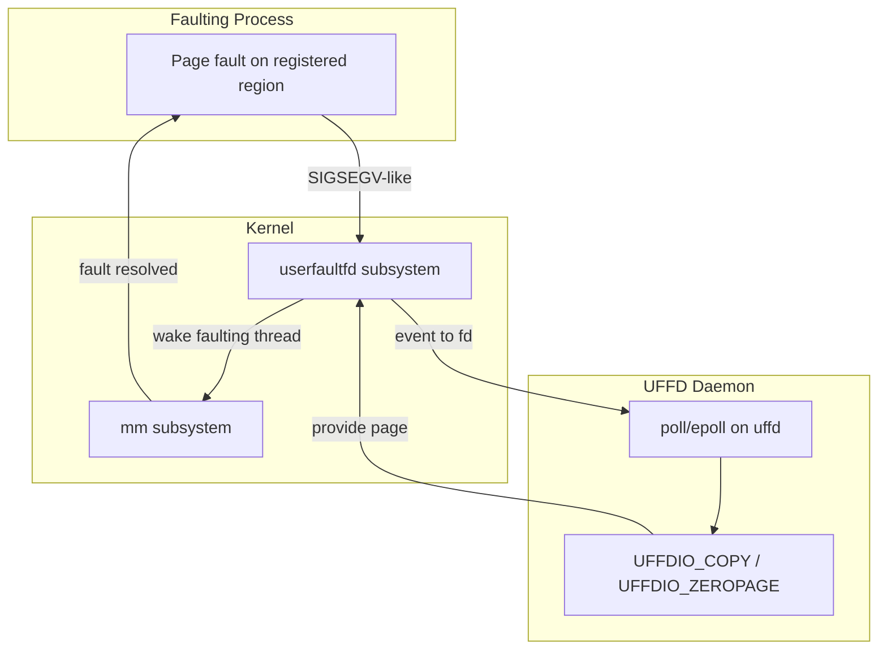
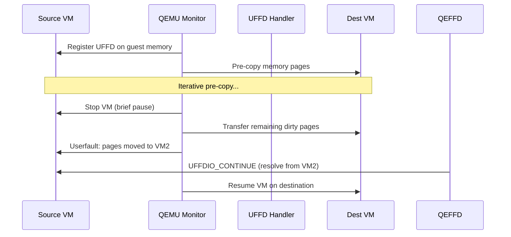

# userfaultfd

## Overview

userfaultfd (UFFD) is a Linux system call that allows userspace to handle page faults. Instead of the kernel handling all page faults internally, userfaultfd lets a userspace daemon register a file descriptor that receives page fault notifications. The daemon can then resolve the fault by providing the page data.

userfaultfd is critical for **live migration** (QEMU/KVM), **distributed shared memory**, **garbage collectors**, and **memory snapshot tools**.

> **Introduced:** Linux 4.3 (commit `cdeefa8`)  
> **Source:** `fs/userfaultfd.c`  
> **Syscall:** `userfaultfd(2)`

---

## Architecture



---

## System Call

```c
#include <linux/userfaultfd.h>

int uffd = syscall(__NR_userfaultfd, O_CLOEXEC | O_NONBLOCK);

/* Register memory region */
struct uffdio_register reg = {
    .range = { .start = addr, .len = length },
    .mode = UFFDIO_REGISTER_MODE_MISSING
};
ioctl(uffd, UFFDIO_REGISTER, &reg);

/* Read events */
struct uffd_msg msg;
read(uffd, &msg, sizeof(msg));
/* msg.event == UFFD_EVENT_PAGEFAULT */

/* Resolve fault */
struct uffdio_copy copy = {
    .dst = msg.arg.pagefault.address,
    .src = page_buffer,
    .len = PAGE_SIZE
};
ioctl(uffd, UFFDIO_COPY, &copy);
```

---

## Event Types

| Event | Description |
|-------|-------------|
| `UFFD_EVENT_PAGEFAULT` | Page fault occurred |
| `UFFD_EVENT_FORK` | Monitored process forked |
| `UFFD_EVENT_REMAP` | Region was remapped |
| `UFFD_EVENT_REMOVE` | Region was unmapped |
| `UFFD_EVENT_UNMAP` | Region unmapped (madvise) |

### Page Fault Event

```c
struct uffd_msg {
    __u8 event;                     /* UFFD_EVENT_PAGEFAULT */
    union {
        struct {
            __u64 flags;            /* UFFD_PAGEFAULT_FLAG_* */
            __u64 address;          /* Faulting address */
        } pagefault;
        /* ... other event types */
    } arg;
};
```

---

## Registration Modes

| Mode | Fault Triggered When | Use Case |
|------|---------------------|----------|
| `UFFDIO_REGISTER_MODE_MISSING` | Page not present | Live migration, demand paging |
| `UFFDIO_REGISTER_MODE_WP` | Write to write-protected page | Dirty tracking, CoW |

---

## Use Cases

### QEMU Live Migration



### Distributed Shared Memory

```python
# Simplified distributed shared memory with UFFD
import mmap, os

# Allocate shared region
region = mmap.mmap(-1, 4096 * 100)

# Register with UFFD
uffd = userfaultfd()
uffd.register(region.addr(), 4096 * 100, mode="missing")

# Handle faults
while True:
    event = uffd.read_event()
    if event.event == "pagefault":
        addr = event.address
        # Fetch page from remote node
        page_data = fetch_from_remote(addr)
        uffd.copy(addr, page_data)
```

---

## io_uring Integration (Linux 6.7+)

userfaultfd can be polled via io_uring for zero-copy handling:

```c
/* Register UFFD with io_uring */
io_uring_prep_poll_add(sqe, uffd, POLLIN);
io_uring_submit(&ring);

/* Wait for event */
io_uring_wait_cqe(&ring, &cqe);
/* Process UFFD event */
```

---

## Security Considerations

userfaultfd has security implications — it can be used to stall the kernel during page fault handling, enabling race condition exploits:

```bash
# Disable userfaultfd for unprivileged users (default since 5.11)
sysctl vm.unprivileged_userfaultfd=0

# Allow for specific users
sysctl vm.unprivileged_userfaultfd=1

# Set capabilities
# CAP_SYS_PTRACE required for cross-process UFFD
```

---

## Troubleshooting

```bash
# Check if userfaultfd is available
grep userfaultfd /proc/kallsyms

# Check UFFD status
cat /proc/<pid>/status | grep -i uffd

# Trace UFFD events
strace -e userfaultfd <program>
```

---

## Source Files

| File | Contents |
|------|----------|
| `fs/userfaultfd.c` | userfaultfd system call implementation |
| `mm/userfaultfd.c` | MM integration |
| `include/uapi/linux/userfaultfd.h` | UAPI header |

---

## Further Reading

- **Kernel documentation**: `Documentation/admin-guide/mm/userfaultfd.rst`
- **LWN**: ["User-space page fault handling"](https://lwn.net/Articles/638845/)
- **man page**: `userfaultfd(2)`

---

## See Also

- [mmap](./mmap.md) — memory mapping
- [Page Types](./page-types.md) — page fault handling
- [GUP](./gup.md) — get_user_pages
- [KVM](../virtualization/kvm.md) — live migration use case
