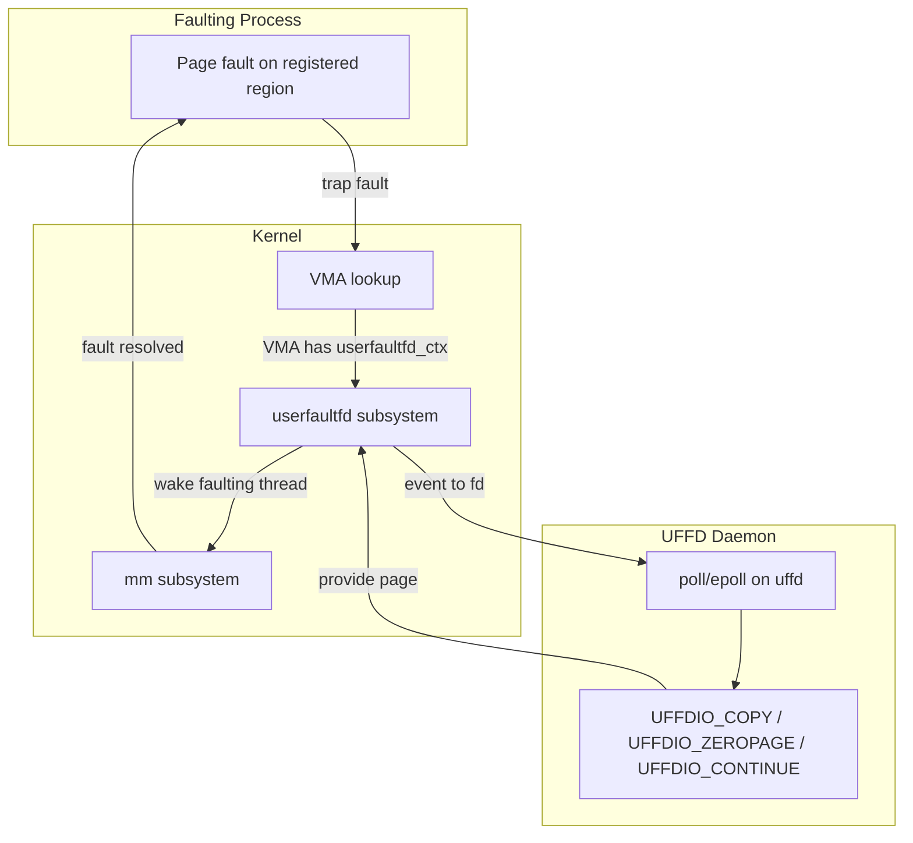
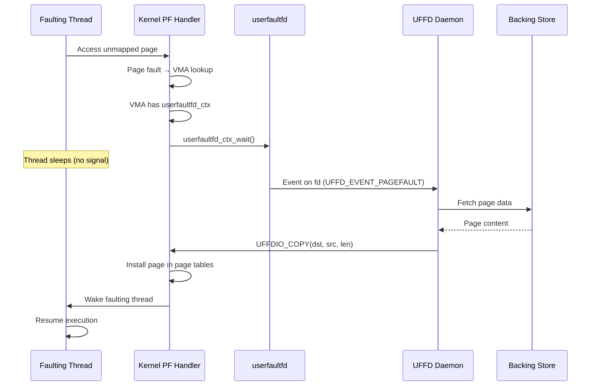
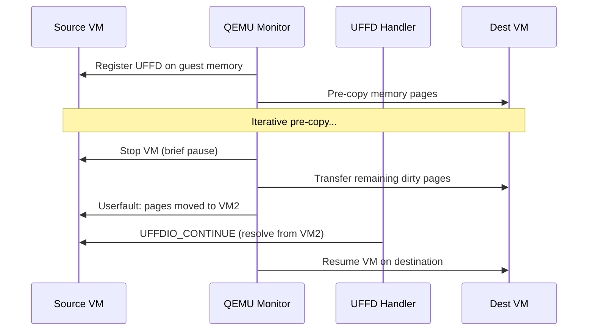

# userfaultfd

## Overview

userfaultfd (UFFD) is a Linux system call that allows userspace to handle page faults. Instead of the kernel handling all page faults internally, userfaultfd lets a userspace daemon register a file descriptor that receives page fault notifications. The daemon can then resolve the fault by providing the page data.

userfaultfd is critical for **live migration** (QEMU/KVM), **distributed shared memory**, **garbage collectors**, **memory snapshot tools**, and **demand paging from userland**.

> **Introduced:** Linux 4.3 (commit `cdeefa8`)  
> **Source:** `fs/userfaultfd.c`, `mm/userfaultfd.c`  
> **Syscall:** `userfaultfd(2)`  
> **Device:** `/dev/userfaultfd` (since Linux 5.11)

---

## Why userfaultfd?

Traditional page fault handling is entirely kernel-internal. When a process accesses an unmapped page, the kernel's page fault handler resolves it by reading from disk (file-backed), mapping the zero page (anonymous), or sending SIGSEGV. Userspace has no say in this process.

userfaultfd changes this by letting a **userspace daemon** intercept and resolve page faults. This is fundamentally different from `mprotect(PROT_NONE)` + `SIGSEGV`:

| Approach | Mechanism | Latency | Scalability |
|----------|-----------|---------|-------------|
| `PROT_NONE` + `SIGSEGV` | Signal delivery to handler | High (signal overhead) | Poor (one handler per signal) |
| userfaultfd | Event on file descriptor | Low (no signals) | Excellent (epoll/io_uring) |

The key advantage: userfaultfd operations **never take `mmap_lock` for writing** and don't create new VMAs, making it scalable to terabyte-scale address spaces.

---

## Architecture



---

## System Call and Initialization

### Creating a userfaultfd

```c
#include <linux/userfaultfd.h>
#include <sys/syscall.h>
#include <unistd.h>

/* Method 1: syscall (Linux 4.3+) */
int uffd = syscall(__NR_userfaultfd, O_CLOEXEC | O_NONBLOCK);

/* Method 2: /dev/userfaultfd (Linux 5.11+, fine-grained access control) */
int devfd = open("/dev/userfaultfd", O_RDWR | O_CLOEXEC);
int uffd = ioctl(devfd, USERFAULTFD_IOC_NEW);
close(devfd);
```

**Access control differences:**

| Method | Kernel faults | User faults | Access control |
|--------|--------------|-------------|----------------|
| `syscall()` + `CAP_SYS_PTRACE` | ✓ | ✓ | Capability |
| `syscall()` + `vm.unprivileged_userfaultfd=1` | ✓ | ✓ | sysctl |
| `syscall()` + `UFFD_USER_MODE_ONLY` | ✗ | ✓ | None needed |
| `/dev/userfaultfd` | ✓ | ✓ | File permissions |

### Initializing the API

```c
struct uffdio_api api = {
    .api = UFFD_API,
    .features = UFFD_FEATURE_EVENT_FORK |
                UFFD_FEATURE_EVENT_REMAP |
                UFFD_FEATURE_EVENT_REMOVE |
                UFFD_FEATURE_EVENT_UNMAP |
                UFFD_FEATURE_MISSING_HUGETLBFS |
                UFFD_FEATURE_MISSING_SHMEM |
                UFFD_FEATURE_MINOR_HUGETLBFS |
                UFFD_FEATURE_MINOR_SHMEM,
};
ioctl(uffd, UFFDIO_API, &api);
/* api.ioctls now contains available ioctls */
```

### Registering Memory Regions

```c
struct uffdio_register reg = {
    .range = { .start = addr, .len = length },
    .mode = UFFDIO_REGISTER_MODE_MISSING | UFFDIO_REGISTER_MODE_WP,
};
ioctl(uffd, UFFDIO_REGISTER, &reg);
/* reg.ioctls now contains available ioctls for this region */
```

---

## Event Types

| Event | Description | Since |
|-------|-------------|-------|
| `UFFD_EVENT_PAGEFAULT` | Page fault occurred | 4.3 |
| `UFFD_EVENT_FORK` | Monitored process forked | 4.3 |
| `UFFD_EVENT_REMAP` | Region was remapped (mremap) | 4.3 |
| `UFFD_EVENT_REMOVE` | Region was unmapped (munmap) | 4.3 |
| `UFFD_EVENT_UNMAP` | Region unmapped (madvise) | 4.3 |

### Page Fault Event Structure

```c
struct uffd_msg {
    __u8 event;                     /* UFFD_EVENT_PAGEFAULT */
    union {
        struct {
            __u64 flags;            /* UFFD_PAGEFAULT_FLAG_* */
            __u64 address;          /* Faulting address */
        } pagefault;
        /* ... other event types */
    } arg;
};

/* Page fault flags */
#define UFFD_PAGEFAULT_FLAG_WRITE   (1<<0)  /* Write fault */
#define UFFD_PAGEFAULT_FLAG_MINOR   (1<<1)  /* Minor fault (5.13+) */
#define UFFD_PAGEFAULT_FLAG_WP      (1<<1)  /* Write-protect fault */
```

---

## Registration Modes

| Mode | Fault Triggered When | Use Case |
|------|---------------------|----------|
| `UFFDIO_REGISTER_MODE_MISSING` | Page not present | Live migration, demand paging |
| `UFFDIO_REGISTER_MODE_WP` | Write to write-protected page | Dirty tracking, CoW |
| `UFFDIO_REGISTER_MODE_MINOR` | Page present but not mapped (5.13+) | Pre-copy migration, snapshot restore |

### Missing Mode

The most common mode. When a process accesses a page that is not present in its page tables, the kernel delivers a `UFFD_EVENT_PAGEFAULT` to the userfaultfd. The daemon must provide the page content.

### Write-Protect Mode

Catches writes to pages that are present but write-protected. Used for:
- **Dirty page tracking**: Write-protect all pages, track which ones get written
- **Copy-on-Write**: Intercept writes to implement custom CoW semantics
- **Incremental snapshots**: Only copy pages that were modified

```c
/* Write-protect a range */
struct uffdio_writeprotect wp = {
    .range = { .start = addr, .len = length },
    .mode = UFFDIO_WRITEPROTECT_MODE_WP,
};
ioctl(uffd, UFFDIO_WRITEPROTECT, &wp);
```

### Minor Fault Mode (Linux 5.13+)

For shared mappings (shmem, hugetlbfs). The page exists in the page cache but is not yet mapped into the faulting process's page tables. The daemon can modify the page content before it's mapped.

```c
/* Resolve a minor fault — map existing page cache page */
struct uffdio_continue cont = {
    .range = { .start = fault_addr, .len = PAGE_SIZE },
    .mode = 0,
};
ioctl(uffd, UFFDIO_CONTINUE, &cont);
```

---

## Fault Resolution Methods

### UFFDIO_COPY — Install a page with data

Copies data from a userspace buffer into the faulting address. The kernel allocates a new page, copies the data, and maps it into the faulting process.

```c
struct uffdio_copy copy = {
    .dst = msg.arg.pagefault.address,  /* Faulting address */
    .src = page_buffer,                 /* Source data */
    .len = PAGE_SIZE,
    .mode = 0,                          /* 0 or UFFDIO_COPY_MODE_DONTWAKE */
};
ioctl(uffd, UFFDIO_COPY, &copy);
/* copy.copy returns number of bytes copied */
```

**Return value**: Number of bytes copied, or `-1` with `errno` set:
- `EEXIST`: Page already exists (race with another thread)
- `ENOMEM`: Out of memory
- `ENOENT`: Faulting thread was killed

### UFFDIO_ZEROPAGE — Install a zero page

Maps the zero page at the faulting address. Faster than `UFFDIO_COPY` with a zero buffer because it reuses the kernel's zero page.

```c
struct uffdio_zeropage zero = {
    .range = { .start = msg.arg.pagefault.address, .len = PAGE_SIZE },
    .mode = 0,
};
ioctl(uffd, UFFDIO_ZEROPAGE, &zero);
```

### UFFDIO_CONTINUE — Resolve minor fault (Linux 5.13+)

For minor faults on shared mappings. The page already exists in the page cache; this just maps it into the faulting process.

```c
struct uffdio_continue cont = {
    .range = { .start = msg.arg.pagefault.address, .len = PAGE_SIZE },
    .mode = 0,
};
ioctl(uffd, UFFDIO_CONTINUE, &cont);
```

### UFFDIO_WRITEPROTECT — Write-protect pages

Write-protects or un-protects a range of pages. Used with `UFFDIO_REGISTER_MODE_WP` to track dirty pages.

```c
/* Write-protect */
struct uffdio_writeprotect wp = {
    .range = { .start = addr, .len = length },
    .mode = UFFDIO_WRITEPROTECT_MODE_WP,
};
ioctl(uffd, UFFDIO_WRITEPROTECT, &wp);

/* Un-protect */
wp.mode = UFFDIO_WRITEPROTECT_MODE_UNWP;
ioctl(uffd, UFFDIO_WRITEPROTECT, &wp);
```

### UFFDIO_MOVE — Move page contents (Linux 6.8+)

Moves a page from one address to another without copying data through userspace. Useful for compaction and migration.

```c
struct uffdio_move move = {
    .dst = dest_addr,
    .src = src_addr,
    .len = PAGE_SIZE,
    .mode = 0,
};
ioctl(uffd, UFFDIO_MOVE, &move);
```

---

## Fault Resolution Flow



---

## Kernel Internals

### Fault Interception Path

When a page fault occurs, the kernel's fault handler checks if the VMA has an associated `userfaultfd_ctx`:

```c
/* mm/memory.c — simplified */
static vm_fault_t handle_mm_fault(struct vm_area_struct *vma,
                                   unsigned long address, ...)
{
    /* ... normal fault handling ... */

    /* Check for userfaultfd */
    if (unlikely(vma->vm_flags & VM_UFFD_MISSING)) {
        /* This VMA is registered with userfaultfd */
        ret = handle_userfault(vmf, VM_UFFD_MISSING);
        return ret;
    }

    /* ... continue normal fault handling ... */
}
```

### struct userfaultfd_ctx

Each userfaultfd file descriptor has an associated context:

```c
/* fs/userfaultfd.c */
struct userfaultfd_ctx {
    wait_queue_head_t fault_pending_wqh;   /* Threads waiting for fault resolution */
    wait_queue_head_t fault_wqh;           /* Threads woken after resolution */
    wait_queue_head_t fd_wqh;              /* Pollers waiting for events */
    wait_queue_head_t event_wqh;           /* Event waiters */
    atomic_t refcount;                      /* Reference count */
    unsigned int flags;                     /* O_CLOEXEC, O_NONBLOCK, etc. */
    struct userfaultfd_ctx *ctx;            /* Self-reference for locking */
    struct mm_struct *mm;                   /* Address space */
    spinlock_t fault_pending_wqh_lock;     /* Lock for pending queue */
    /* ... */
};
```

### VMA Integration

Each VMA can have at most one userfaultfd_ctx. The VMA flags indicate which modes are registered:

```c
/* include/linux/mm.h */
#define VM_UFFD_MISSING     /* Registered for missing faults */
#define VM_UFFD_WP          /* Registered for write-protect faults */
#define VM_UFFD_MINOR       /* Registered for minor faults */
```

The VMA stores a pointer to the userfaultfd_ctx in `vm_area_struct->vm_userfaultfd_ctx`.

### Locking Model

userfaultfd is designed to avoid `mmap_lock` contention:

- **Fault resolution** (UFFDIO_COPY, etc.) uses `mmap_read_lock()` only
- **Registration** (UFFDIO_REGISTER) uses `mmap_write_lock()` briefly
- **Event delivery** uses lockless wait queues
- **No VMA splitting/merging** during fault resolution

This makes userfaultfd scale well with many concurrent faults.

### Wait Queue Mechanism

When a fault occurs, the faulting thread is placed on a wait queue:

```c
/* fs/userfaultfd.c — simplified */
static vm_fault_t handle_userfault(struct vm_fault *vmf, ...)
{
    struct userfaultfd_ctx *ctx = vma->vm_userfaultfd_ctx.ctx;

    /* Create userfault entry on stack */
    struct userfaultfd_wait_queue uwq = {
        .wq = { .private = current },
        .msg = { .event = UFFD_EVENT_PAGEFAULT,
                 .arg.pagefault.address = vmf->address },
    };

    /* Add to pending wait queue */
    spin_lock(&ctx->fault_pending_wqh_lock);
    list_add(&uwq.node, &ctx->fault_pending_wqh.head);
    spin_unlock(&ctx->fault_pending_wqh_lock);

    /* Wake up pollers */
    wake_up_poll(&ctx->fd_wqh, EPOLLIN);

    /* Sleep until resolved */
    for (;;) {
        set_current_state(TASK_KILLABLE);
        if (!uwq.wakeup)
            schedule();
        else
            break;
    }

    return 0;
}
```

---

## Events Beyond Page Faults

### Non-Cooperative Monitoring

A manager process can monitor another process's memory without that process's cooperation. This requires `CAP_SYS_PTRACE` and is used for:

- **Checkpoint/Restore (CRIU)**: Snapshot process memory
- **Live migration**: QEMU monitors VM memory
- **Debuggers**: Intercept memory access

```c
/* Fork event: new process inherits UFFD registration */
if (msg.event == UFFD_EVENT_FORK) {
    int new_uffd = msg.arg.fork.ufd;
    /* Monitor the forked process too */
    register_regions(new_uffd, ...);
}

/* Remap event: mremap was called */
if (msg.event == UFFD_EVENT_REMAP) {
    unsigned long from = msg.arg.remap.from;
    unsigned long to = msg.arg.remap.to;
    unsigned long len = msg.arg.remap.len;
    /* Update tracking */
}
```

---

## Use Cases

### QEMU Live Migration



### Distributed Shared Memory

```python
# Simplified distributed shared memory with UFFD
import mmap, os

# Allocate shared region
region = mmap.mmap(-1, 4096 * 100)

# Register with UFFD
uffd = userfaultfd()
uffd.register(region.addr(), 4096 * 100, mode="missing")

# Handle faults
while True:
    event = uffd.read_event()
    if event.event == "pagefault":
        addr = event.address
        # Fetch page from remote node
        page_data = fetch_from_remote(addr)
        uffd.copy(addr, page_data)
```

### Incremental Snapshot with Write-Protect

```c
/* Snapshot workflow using UFFDIO_REGISTER_MODE_WP */
void incremental_snapshot(int uffd, void *base, size_t len)
{
    /* Write-protect all pages */
    struct uffdio_writeprotect wp = {
        .range = { .start = (unsigned long)base, .len = len },
        .mode = UFFDIO_WRITEPROTECT_MODE_WP,
    };
    ioctl(uffd, UFFDIO_WRITEPROTECT, &wp);

    /* Wait for write faults */
    while (1) {
        struct uffd_msg msg;
        read(uffd, &msg, sizeof(msg));

        if (msg.event == UFFD_EVENT_PAGEFAULT &&
            (msg.arg.pagefault.flags & UFFD_PAGEFAULT_FLAG_WP)) {
            /* Page was written — record it as dirty */
            mark_dirty(msg.arg.pagefault.address);

            /* Un-protect so the write can proceed */
            struct uffdio_writeprotect unwp = {
                .range = { .start = msg.arg.pagefault.address,
                           .len = PAGE_SIZE },
                .mode = UFFDIO_WRITEPROTECT_MODE_UNWP,
            };
            ioctl(uffd, UFFDIO_WRITEPROTECT, &unwp);
        }
    }
}
```

### Demand Paging from Userland

```c
/* Lazy page provider — pages loaded on demand */
void handle_uffd_events(int uffd)
{
    struct uffd_msg msg;
    while (read(uffd, &msg, sizeof(msg)) > 0) {
        if (msg.event == UFFD_EVENT_PAGEFAULT) {
            unsigned long addr = msg.arg.pagefault.address;

            if (msg.arg.pagefault.flags & UFFD_PAGEFAULT_FLAG_MINOR) {
                /* Minor fault: page in page cache, just map it */
                struct uffdio_continue cont = {
                    .range = { .start = addr, .len = PAGE_SIZE },
                };
                ioctl(uffd, UFFDIO_CONTINUE, &cont);
            } else {
                /* Missing fault: provide page from backing store */
                void *page = load_page_from_store(addr);
                struct uffdio_copy copy = {
                    .dst = addr,
                    .src = page,
                    .len = PAGE_SIZE,
                };
                ioctl(uffd, UFFDIO_COPY, &copy);
                free(page);
            }
        }
    }
}
```

---

## io_uring Integration (Linux 6.7+)

userfaultfd can be polled via io_uring for zero-copy handling:

```c
/* Register UFFD with io_uring */
io_uring_prep_poll_add(sqe, uffd, POLLIN);
io_uring_submit(&ring);

/* Wait for event */
io_uring_wait_cqe(&ring, &cqe);
/* Process UFFD event */
```

This eliminates the overhead of `read()` system calls for event delivery, which matters in high-fault-rate scenarios like live migration.

---

## /proc/sys Tunables

```bash
# Control unprivileged userfaultfd access
# 0 = only privileged (CAP_SYS_PTRACE) users can handle kernel faults (default since 5.11)
# 1 = any user can handle kernel faults (security risk)
sysctl vm.unprivileged_userfaultfd=0
```

**Security note**: userfaultfd can be used to stall the kernel during page fault handling, enabling race condition exploits (CVE-2020-0041, CVE-2021-3411). The default was changed from 1 to 0 in Linux 5.11.

---

## Observability

### Per-Process UFFD Status

```bash
# Check if a process has userfaultfd regions
grep -i "uffd" /proc/<pid>/status
# Uffd: 3    (userfaultfd file descriptor count)

# Check VMA flags for userfaultfd
cat /proc/<pid>/smaps | grep -i "uffd"
# VmFlags: ... uffd_missing uffd_wp ...
```

### Trace UFFD Events

```bash
# Trace userfaultfd syscalls
strace -e userfaultfd <program>

# Trace with ftrace
echo 1 > /sys/kernel/debug/tracing/events/userfaultfd/enable
cat /sys/kernel/debug/tracing/trace_pipe
```

### Check UFFD Availability

```bash
# Check if userfaultfd is compiled in
grep userfaultfd /proc/kallsyms
# ffffffff81234567 T __x64_sys_userfaultfd

# Check /dev/userfaultfd
ls -la /dev/userfaultfd
# crw-rw---- 1 root root 10, 125 Jul 22 10:00 /dev/userfaultfd

# Check API version
cat /proc/kallsyms | grep userfaultfd_ctx
```

---

## Performance Considerations

| Factor | Impact | Mitigation |
|--------|--------|------------|
| **Fault granularity** | One fault per page (4KB) | Batch UFFDIO_COPY with multiple pages |
| **Event delivery** | read() syscall overhead | Use io_uring (6.7+) |
| **Daemon latency** | Every fault round-trips to daemon | Minimize daemon processing time |
| **Lock contention** | Minimal (no mmap_lock write) | None needed — designed for scalability |
| **Memory overhead** | Wait queue entries per fault | Bounded by concurrent faulting threads |

### Batching Fault Resolution

```c
/* Resolve multiple faults in one ioctl */
struct uffdio_copy copy = {
    .dst = fault_addr_1,
    .src = page_buffer_1,
    .len = PAGE_SIZE * 4,  /* Copy 4 pages at once */
};
ioctl(uffd, UFFDIO_COPY, &copy);
```

---

## Security Considerations

userfaultfd has been used in kernel exploits because it can stall the faulting thread indefinitely, creating race windows:

```bash
# Disable userfaultfd for unprivileged users (default since 5.11)
sysctl vm.unprivileged_userfaultfd=0

# For containers, block userfaultfd in seccomp
# In seccomp profile:
{
    "syscalls": [{
        "names": ["userfaultfd"],
        "action": "SCMP_ACT_ERRNO",
        "args": [{"index": 0, "value": 0}]
    }]
}

# Or use /dev/userfaultfd with restrictive permissions
chmod 600 /dev/userfaultfd
```

### CVE History

| CVE | Year | Issue |
|-----|------|-------|
| CVE-2020-0041 | 2020 | Race condition via userfaultfd + binder |
| CVE-2021-3411 | 2021 | userfaultfd + io_uring race |
| CVE-2022-2590 | 2022 | userfaultfd + shmem race |

---

## Complete Working Example

```c
#include <linux/userfaultfd.h>
#include <sys/ioctl.h>
#include <sys/mman.h>
#include <sys/syscall.h>
#include <unistd.h>
#include <stdio.h>
#include <string.h>
#include <poll.h>

int main(void)
{
    /* Create userfaultfd */
    int uffd = syscall(__NR_userfaultfd, O_CLOEXEC | O_NONBLOCK);

    /* Initialize API */
    struct uffdio_api api = { .api = UFFD_API };
    ioctl(uffd, UFFDIO_API, &api);

    /* Allocate region */
    size_t len = 4 * 1024 * 1024;  /* 4MB */
    void *addr = mmap(NULL, len, PROT_READ | PROT_WRITE,
                      MAP_PRIVATE | MAP_ANONYMOUS, -1, 0);

    /* Register for missing faults */
    struct uffdio_register reg = {
        .range = { .start = (unsigned long)addr, .len = len },
        .mode = UFFDIO_REGISTER_MODE_MISSING,
    };
    ioctl(uffd, UFFDIO_REGISTER, &reg);

    /* Access memory — will trigger userfault */
    char *p = (char *)addr;
    printf("Accessing page: %c\n", p[0]);  /* Triggers fault */

    /* Handle faults */
    struct uffd_msg msg;
    read(uffd, &msg, sizeof(msg));

    if (msg.event == UFFD_EVENT_PAGEFAULT) {
        /* Provide zero page */
        struct uffdio_zeropage zero = {
            .range = { .start = msg.arg.pagefault.address,
                       .len = PAGE_SIZE },
        };
        ioctl(uffd, UFFDIO_ZEROPAGE, &zero);
    }

    /* Now the access succeeds */
    printf("Page content: %c\n", p[0]);  /* Should print \0 */

    /* Cleanup */
    struct uffdio_unregister unreg = {
        .range = { .start = (unsigned long)addr, .len = len },
    };
    ioctl(uffd, UFFDIO_UNREGISTER, &unreg);
    munmap(addr, len);
    close(uffd);

    return 0;
}
```

---

## Kconfig Options

```
CONFIG_USERFAULTFD=y    # Enable userfaultfd (usually built-in)
```

---

## Source Files

| File | Contents |
|------|----------|
| `fs/userfaultfd.c` | userfaultfd system call implementation, event delivery |
| `mm/userfaultfd.c` | MM integration, page installation (UFFDIO_COPY, etc.) |
| `include/uapi/linux/userfaultfd.h` | UAPI structures and constants |
| `include/linux/userfaultfd_k.h` | Kernel-internal helpers |

---

## Further Reading

- **Kernel documentation**: `Documentation/admin-guide/mm/userfaultfd.rst`
- **LWN**: ["User-space page fault handling"](https://lwn.net/Articles/638845/)
- **LWN**: ["Userfaultfd for user-defined page fault handling"](https://lwn.net/Articles/656197/)
- **man page**: `userfaultfd(2)`
- **kernel-internals.org**: [userfaultfd](https://kernel-internals.org/mm/userfaultfd/)
- **CRIU**: [Using userfaultfd for C/R](https://criu.org/Userfaultfd)

---

## See Also

- [mmap](./mmap.md) — memory mapping
- [Page Types](./page-types.md) — page fault handling
- [GUP](./gup.md) — get_user_pages
- [KVM](../virtualization/kvm.md) — live migration use case
- [io_uring](../io-uring/) — async event delivery
