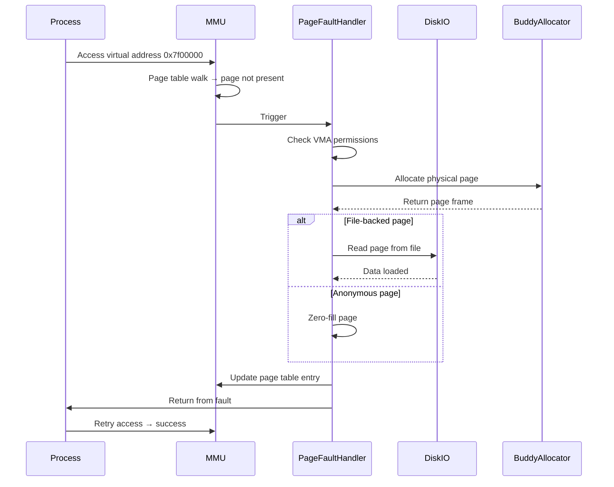
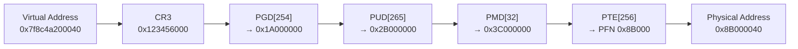
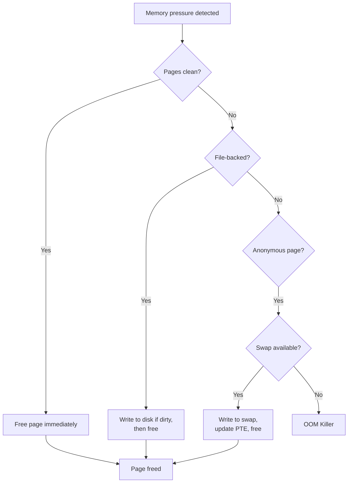

# Virtual Memory

## Introduction

Virtual memory is the cornerstone of modern operating system design. It provides each process with the illusion of a large, contiguous, private address space, while the underlying physical memory may be fragmented, shared, or even absent (backed by disk). Linux implements virtual memory using hardware support from the CPU's Memory Management Unit (MMU), multi-level page tables, and the Translation Lookaside Buffer (TLB).

This page covers virtual memory concepts in depth, the page table structures used on x86_64, the TLB and its management, and a complete walkthrough of address translation from virtual address to physical memory access.

## Virtual Memory Concepts

### The Abstraction

Virtual memory decouples the addresses used by software from physical memory locations. Each process operates in its own virtual address space, and the kernel and hardware cooperate to translate virtual addresses to physical ones on every memory access.

```
Process A sees:     0x7f00_0000_0000 ──→ Physical frame 0x1A000
Process B sees:     0x7f00_0000_0000 ──→ Physical frame 0x8B000
                                  (same virtual, different physical)
```

### Pages and Page Frames

Virtual memory is divided into **pages** (typically 4 KiB). Physical memory is divided into **page frames** of the same size. The page table maps virtual pages to physical page frames.

| Concept | Size (x86_64 default) | Address Bits |
|---------|----------------------|--------------|
| Page / Page Frame | 4 KiB | 12-bit offset |
| PMD Entry (huge page) | 2 MiB | 21-bit offset |
| PUD Entry (1G huge page) | 1 GiB | 30-bit offset |

### Demand Paging

Linux uses **demand paging** — pages are not loaded into physical memory until they are actually accessed. When a process accesses a page that is not yet mapped, a **page fault** occurs, and the kernel's page fault handler:

1. Verifies the access is legal (checks VMA permissions).
2. Allocates a physical page frame.
3. If file-backed: reads the content from disk.
4. If anonymous: zero-fills the page.
5. Updates the page table to map the virtual page to the new physical frame.
6. Returns to the process, which re-executes the faulting instruction.



### Copy-on-Write (COW)

When a process calls `fork()`, the child initially shares all pages with the parent. Both the parent's and child's page table entries point to the same physical frames, marked read-only. When either process writes to a page, a page fault occurs, and the kernel:

1. Allocates a new physical page.
2. Copies the content from the original page.
3. Updates the faulting process's page table to point to the new page with write permission.
4. Decrements the reference count on the original page.

This is critical for `fork()` performance — if the child immediately calls `exec()`, no pages are actually copied.

```c
/* mm/memory.c (simplified COW handler) */
static vm_fault_t do_wp_page(struct vm_fault *vmf)
{
    struct page *old_page = vmf->page;
    struct page *new_page;

    if (page_count(old_page) == 1) {
        /* Only one mapping — just make it writable */
        reuse = true;
    } else {
        /* Multiple mappings — must copy */
        new_page = alloc_page_vma(GFP_HIGHUSER_MOVABLE, vma, vmf->address);
        copy_user_highpage(new_page, old_page, vmf->address, vma);
        /* Update page table to point to new page */
    }
    /* ... */
}
```

## Page Tables on x86_64

### 4-Level Page Table Hierarchy

x86_64 uses a 4-level page table structure (with optional 5-level extension). Each virtual address is split into fields that index into successive tables:

```
48-bit Virtual Address (4-level paging):
┌──────────┬──────────┬──────────┬──────────┬──────────────┐
│ PGD (9b) │ PUD (9b) │ PMD (9b) │ PTE (9b) │ Offset (12b) │
│ bits 47:39│ bits 38:30│ bits 29:21│ bits 20:12│ bits 11:0    │
└──────────┴──────────┴──────────┴──────────┴──────────────┘
```

| Level | Name | Entries | Index Bits | Entry Size |
|-------|------|---------|------------|------------|
| 5 | **PGD** (Page Global Directory) | 512 | bits 47:39 | 8 bytes |
| 4 | **PUD** (Page Upper Directory) | 512 | bits 38:30 | 8 bytes |
| 3 | **PMD** (Page Middle Directory) | 512 | bits 29:21 | 8 bytes |
| 2 | **PTE** (Page Table Entry) | 512 | bits 20:12 | 8 bytes |
| 1 | **Page** | 4096 bytes | bits 11:0 | — |

The kernel has one set of page tables per process (stored in `mm_struct->pgd`). When a process is scheduled in, its PGD is loaded into the CR3 register.

### 5-Level Page Tables (LA57)

With Intel's LA57 extension, virtual addresses expand to 57 bits, adding a **P4D** level:

```
57-bit Virtual Address (5-level paging):
┌──────────┬──────────┬──────────┬──────────┬──────────┬──────────────┐
│ PGD (9b) │ P4D (9b) │ PUD (9b) │ PMD (9b) │ PTE (9b) │ Offset (12b) │
└──────────┴──────────┴──────────┴──────────┴──────────┴──────────────┘
```

This expands the virtual address space from 256 TiB to 128 PiB. The kernel detects LA57 support at boot and configures page table levels accordingly.

### Page Table Entry Format

Each page table entry (PTE) on x86_64 is 64 bits:

```
63    62:52  51:M    M-1:12   11:0 (or higher bits for flags)
┌───┬───────┬───────┬────────┬──────────────────────────┐
│NX │Avail  │Reserved│PFN    │ Flags                    │
│   │       │       │(phys   │                          │
│   │       │       │frame #)│                          │
└───┴───────┴───────┴────────┴──────────────────────────┘
```

Key flags in each PTE/PMD/PUD/PGD entry:

| Bit | Flag | Meaning |
|-----|------|---------|
| 0 | **P** (Present) | Page is in physical memory |
| 1 | **R/W** (Read/Write) | 0=read-only, 1=writable |
| 2 | **U/S** (User/Supervisor) | 0=kernel only, 1=user accessible |
| 3 | **PWT** (Page Write-Through) | Cache write-through policy |
| 4 | **PCD** (Page Cache Disable) | Disable caching for this page |
| 5 | **A** (Accessed) | Set by CPU on read/write |
| 6 | **D** (Dirty) | Set by CPU on write |
| 7 | **PAT** (Page Attribute Table) | Page size / PAT index |
| 8 | **G** (Global) | Not flushed on CR3 switch (kernel pages) |
| 51:M | Reserved | Must be 0 (hardware ignores) |
| 62 | **NX** (No Execute) | Prevents instruction fetch |

### Walking the Page Tables: Kernel Code

The kernel implements page table walking in architecture-specific code:

```c
/* arch/x86/include/asm/pgtable.h (simplified) */

static inline pud_t *pud_offset(p4d_t *p4d, unsigned long address)
{
    return (pud_t *)p4d_page_vaddr(*p4d) + pud_index(address);
}

static inline pmd_t *pmd_offset(pud_t *pud, unsigned long address)
{
    return (pmd_t *)pud_page_vaddr(*pud) + pmd_index(address);
}

static inline pte_t *pte_offset_kernel(pmd_t *pmd, unsigned long address)
{
    return (pte_t *)pmd_page_vaddr(*pmd) + pte_index(address);
}
```

The generic page table walk function `walk_page_range()` in `mm/pagewalk.c` iterates through all levels:

```c
/* mm/pagewalk.c (simplified) */
int walk_page_range(struct mm_struct *mm, unsigned long start,
                    unsigned long end, const struct mm_walk_ops *ops,
                    void *private)
{
    pgd_t *pgd;
    unsigned long next;

    pgd = pgd_offset(mm, start);
    do {
        next = pgd_addr_end(start, end);
        if (pgd_none_or_clear_bad(pgd))
            continue;
        /* Walk PUD → PMD → PTE */
        err = walk_p4d_range(pgd, start, next, walk);
    } while (pgd++, start = next, start < end && !err);

    return err;
}
```

## The Translation Lookaside Buffer (TLB)

### What is the TLB?

A full page table walk (4-5 memory accesses per translation) is expensive. The **TLB** is a hardware cache that stores recent virtual→physical address translations. On modern CPUs, the TLB has two levels:

| Level | Size (typical) | Latency |
|-------|----------------|---------|
| L1 dTLB | 64 entries, 4-way | ~1 cycle |
| L1 iTLB | 128 entries, 8-way | ~1 cycle |
| L2 sTLB | 1536 entries, 12-way | ~7 cycles |

A TLB hit avoids the page table walk entirely. A TLB miss triggers a hardware page table walk (if supported by the CPU) or a software walk by the kernel.

### TLB Flush Operations

When page tables change (e.g., page is unmapped, protection changed, or process switches), the TLB must be invalidated. The kernel provides several TLB flush operations:

```c
/* arch/x86/include/asm/tlbflush.h */

/* Flush a single page from TLB */
static inline void __flush_tlb_one_user(unsigned long addr)
{
    asm volatile("invlpg (%0)" ::"r" (addr) : "memory");
}

/* Flush all TLB entries (full flush on CR3 write) */
static inline void __flush_tlb_global(void)
{
    /* Writes CR3 with PGE bit cleared */
    write_cr3(build_cr3(native_read_cr3(), 0));
}

/* Flush only user-space TLB entries (PCID-aware) */
static inline void __flush_tlb_one_kernel(unsigned long addr)
{
    asm volatile("invlpg (%0)" ::"r" (addr) : "memory");
}
```

### Process-Context Identifiers (PCID)

Modern x86_64 CPUs support **PCID** (Process-Context Identifiers), which tag TLB entries with a 12-bit ID. This allows TLB entries from multiple processes to coexist without flushing on context switch:

```c
/* arch/x86/mm/tlb.c */
void switch_mm_irqs_off(struct mm_struct *prev, struct mm_struct *next,
                        struct task_struct *tsk)
{
    /* With PCID, we can avoid a full TLB flush */
    if (static_cpu_has(X86_FEATURE_PCID)) {
        /* Use ASID-based TLB management */
        /* Only flush entries for the old process if needed */
    } else {
        /* Full TLB flush on every context switch */
    }
}
```

PCID support can be verified:

```bash
$ grep pcid /proc/cpuinfo | head -1
flags           : ... pcid ...
```

### TLB Performance Monitoring

```bash
# Using perf to monitor TLB misses
$ perf stat -e dTLB-load-misses,dTLB-store-misses,iTLB-load-misses \
    -- dd if=/dev/zero of=/tmp/testfile bs=1M count=1024

 Performance counter stats for 'dd ...':

     2,847,392      dTLB-load-misses
       142,567      dTLB-store-misses
        23,891      iTLB-load-misses

$ cat /proc/vmstat | grep tlb
nr_tlb_remote_flush         0
nr_tlb_remote_flush_received 0
nr_tlb_local_flush_all      14892
```

## Complete Address Translation Walkthrough

Let's trace the translation of a virtual address `0x7f8c4a200040` through the page tables on x86_64 with 4-level paging.

### Step 1: Parse the Virtual Address

```
Virtual address: 0x00007f8c4a200040
Binary: 0000 0000 0000 0000 0111 1111 1000 1100 0100 1010 0010 0000 0000 0100 0000

Fields:
┌─────────┬─────────┬─────────┬─────────┬──────────────┐
│ PGD idx │ PUD idx │ PMD idx │ PTE idx │ Page offset  │
│ (9 bits)│ (9 bits)│ (9 bits)│ (9 bits)│ (12 bits)    │
├─────────┼─────────┼─────────┼─────────┼──────────────┤
│ 0x0FE   │ 0x109   │ 0x020   │ 0x100   │ 0x040        │
│ (254)   │ (265)   │ (32)    │ (256)   │ (64)         │
└─────────┴─────────┴─────────┴─────────┴──────────────┘
```

### Step 2: Load PGD from CR3

The CR3 register contains the physical address of the current process's PGD:

```
CR3 = 0x00000001_23456000 (physical address of PGD)
PGD entry at: CR3 + PGD_index * 8 = 0x123456000 + 254 * 8 = 0x1234567F0
```

### Step 3: PGD → PUD

```
PGD[254] = 0x00000000_1A000067
  Present=1, R/W=1, User=1, Accessed
  PUD base physical address = 0x1A000000

PUD entry at: 0x1A000000 + 265 * 8 = 0x1A000848
PUD[265] = 0x00000000_2B000067
  Present=1, R/W=1, User=1, Accessed
  PMD base physical address = 0x2B000000
```

### Step 4: PMD → PTE

```
PMD entry at: 0x2B000000 + 32 * 8 = 0x2B000100
PMD[32] = 0x00000000_3C000067
  Present=1, R/W=1, User=1, Accessed
  PTE base physical address = 0x3C000000
```

### Step 5: PTE → Physical Page

```
PTE entry at: 0x3C000000 + 256 * 8 = 0x3C000800
PTE[256] = 0x00000000_8B000067
  Present=1, R/W=1, User=1, Accessed, Dirty
  Physical page frame = 0x8B000
```

### Step 6: Physical Address

```
Physical address = (PFN << 12) | offset
                 = (0x8B000 << 12) | 0x040
                 = 0x8B000000 | 0x040
                 = 0x8B000040
```



### TLB Acceleration

If the translation is already in the TLB:

```
TLB Hit: Virtual page 0x7f8c4a200 → Physical frame 0x8B000
Physical address = 0x8B000000 + 0x040 = 0x8B000040
Time: ~1 cycle (vs ~100+ cycles for a full page table walk)
```

## Page Fault Handling

When the MMU cannot translate an address (page not present, protection violation), it generates a page fault exception (#PF, vector 14). The error code indicates the cause:

```c
/* arch/x86/mm/fault.c */
static noinline void
__do_page_fault(struct pt_regs *regs, unsigned long error_code,
                unsigned long address)
{
    struct vm_area_struct *vma;
    struct mm_struct *mm;
    vm_fault_t fault;

    mm = current->mm;

    /* 1. Find the VMA containing the faulting address */
    vma = find_vma(mm, address);
    if (!vma || address < vma->vm_start) {
        /* No VMA → segmentation fault */
        bad_area(regs, error_code, address);
        return;
    }

    /* 2. Check access permissions */
    if (error_code & X86_PF_USER) {
        if (!(vma->vm_flags & VM_READ) && !(vma->vm_flags & VM_EXEC)) {
            bad_area_access_error(regs, error_code, address);
            return;
        }
    }

    /* 3. Handle the fault */
    fault = handle_mm_fault(vma, address, flags, regs);

    /* 4. Check result */
    if (fault & VM_FAULT_ERROR) {
        if (fault & VM_FAULT_OOM)
            page_fault_out_of_memory();
        else if (fault & VM_FAULT_SIGBUS)
            do_sigbus(regs, error_code, address);
    }
}
```

### Fault Types

| Error Code Bit | Meaning | Typical Cause |
|----------------|---------|---------------|
| Bit 0 (P) | 0=not present, 1=protection fault | Page not mapped vs. write to read-only |
| Bit 1 (W/R) | 0=read, 1=write | COW triggered by write |
| Bit 2 (U/S) | 0=kernel, 1=user | User accessing kernel memory |
| Bit 3 (RSVD) | Reserved bit set | Page table corruption |
| Bit 4 (I/D) | Instruction fetch | Executing non-executable page |

### Minor vs Major Faults

- **Minor fault**: Page is in memory (e.g., first access to anonymous page, COW). No disk I/O needed.
- **Major fault**: Page must be read from disk (file-backed page or swap-in). Slow.

```bash
# View page fault counts per process
$ ps -o pid,min_flt,maj_flt -p $$
    PID  MINFL  MAJFL
  12345   1523     12

# System-wide page fault stats
$ cat /proc/vmstat | grep fault
pgfault         28473920
pgmajfault      14256
```

## Page Reclaim and Swapping

When physical memory is scarce, the kernel reclaims pages. See [Swap](swap.md) and [OOM Killer](oom-killer.md) for complete details. The high-level flow:



## Virtual Memory Areas (VMAs)

Each contiguous region of a virtual address space with uniform properties is represented by a `vm_area_struct`. VMAs are organized in both a linked list and a red-black tree for efficient lookup:

```c
/* include/linux/mm_types.h (simplified) */
struct vm_area_struct {
    unsigned long vm_start;        /* Start address */
    unsigned long vm_end;          /* End address (exclusive) */
    struct mm_struct *vm_mm;       /* Back-pointer to mm */
    pgprot_t vm_page_prot;         /* Access permissions */
    unsigned long vm_flags;        /* VM_READ | VM_WRITE | VM_EXEC | ... */

    struct rb_node vm_rb;          /* Red-black tree node */
    struct vm_area_struct *vm_next, *vm_prev; /* Linked list */

    struct list_head anon_vma_chain;
    struct anon_vma *anon_vma;     /* For anonymous pages */
    const struct vm_operations_struct *vm_ops; /* Operations (fault, etc.) */
    unsigned long vm_pgoff;        /* File offset (in pages) */
    struct file *vm_file;          /* Backing file (NULL if anonymous) */
    void *vm_private_data;         /* Driver-private data */
};
```

### VMA Flags

```c
/* include/linux/mm.h */
#define VM_READ     0x00000001
#define VM_WRITE    0x00000002
#define VM_EXEC     0x00000004
#define VM_SHARED   0x00000008
#define VM_MAYREAD  0x00000010
#define VM_MAYWRITE 0x00000020
#define VM_MAYEXEC  0x00000040
#define VM_GROWSDOWN 0x00000100   /* Stack-like, grows downward */
#define VM_GROWSUP   0x00000200   /* Heap-like, grows upward */
#define VM_LOCKED    0x00002000   /* Pages are locked (mlock) */
#define VM_IO        0x00004000   /* Memory-mapped I/O */
#define VM_PFNMAP   0x00000400   /* Page-frame-number-only mapping */
```

### VMA Lookup

The kernel uses a red-black tree for O(log n) VMA lookup:

```c
/* mm/mmap.c */
struct vm_area_struct *find_vma(struct mm_struct *mm, unsigned long addr)
{
    struct rb_node *rb_node;
    struct vm_area_struct *vma;

    /* Check the cache first (most accesses hit recent VMA) */
    vma = vmacache_find(mm, addr);
    if (likely(vma))
        return vma;

    rb_node = mm->mm_rb.rb_node;
    while (rb_node) {
        vma = rb_entry(rb_node, struct vm_area_struct, vm_rb);
        if (vma->vm_end > addr) {
            if (vma->vm_start <= addr)
                return vma;  /* Found */
            rb_node = rb_node->rb_left;
        } else {
            rb_node = rb_node->rb_right;
        }
    }
    return NULL;
}
```

## Monitoring Virtual Memory

### Per-Process Virtual Memory

```bash
# Full VMA list
$ cat /proc/self/maps | wc -l
18

# Detailed VMA info with smaps
$ cat /proc/self/smaps_rollup
Rss:               1568 kB
Pss:               1568 kB
Pss_Anon:           348 kB
Pss_File:          1220 kB
Pss_Shmem:            0 kB
Shared_Clean:         0 kB
Shared_Dirty:         0 kB
Private_Clean:     1568 kB
Private_Dirty:        0 kB
Referenced:        1568 kB
Anonymous:          348 kB
LazyFree:             0 kB
AnonHugePages:        0 kB
ShmemPmdMapped:       0 kB
Shared_Hugetlb:       0 kB
Private_Hugetlb:      0 kB
Swap:                 0 kB
SwapPss:              0 kB
Locked:               0 kB
```

### System-Wide Virtual Memory Stats

```bash
$ cat /proc/vmstat | head -30
nr_free_pages 537600
nr_zone_inactive_anon 2097152
nr_zone_active_anon 4194304
nr_zone_inactive_file 4456448
nr_zone_active_file 8912896
nr_zone_unevictable 0
nr_zone_write_pending 65536
nr_mlock 0
nr_page_table_pages 49152
nr_kernel_stack 18432
nr_bounce 0
nr_free_cma 0
pgfault 28473920
pgmajfault 14256
pgpgin 1843200
pgpgout 2457600
pswpin 1024
pswpout 2048
```

## Performance Considerations

### TLB Pressure

Applications with large working sets may suffer TLB misses. Solutions:
- Use [Huge Pages](huge-pages.md) (2 MiB or 1 GiB) to cover more memory per TLB entry.
- Reduce memory footprint.
- Use `madvise()` hints to improve page placement.

### Page Table Memory Overhead

Each page table level consumes memory. For a process using 4 GiB of virtual memory:

```
Pages mapped: 4 GiB / 4 KiB = 1,048,576 pages
PTE entries:  1,048,576 × 8 bytes = 8 MiB
PMD entries:  2048 × 8 bytes = 16 KiB
PUD entries:  8 × 8 bytes = 64 bytes
PGD entries:  1 × 8 bytes = 8 bytes
Total page table overhead: ~8 MiB
```

With 2 MiB huge pages, PTE entries are eliminated:
```
Huge pages: 4 GiB / 2 MiB = 2048 pages
PMD entries:  2048 × 8 bytes = 16 KiB
Savings: ~8 MiB of page table memory, + faster TLB coverage
```

## References

- **Understanding the Linux Kernel, 3rd Edition** — Chapter 9: Process Address Space
- **Intel 64 and IA-32 Architectures Software Developer's Manual** — Volume 3A: Paging
- [Kernel documentation: Virtual Memory](https://www.kernel.org/doc/html/latest/mm/)
- [LWN: Four-level page tables](https://lwn.net/Articles/117387/)
- [LWN: Five-level page tables](https://lwn.net/Articles/717293/)
- [Gustavo Duarte: How the Kernel Manages Your Memory](https://manybutfinite.com/post/how-the-kernel-manages-your-memory/)

## Related Topics

- [Memory Management Overview](overview.md) — High-level memory subsystem overview
- [Paging](paging.md) — Detailed paging structures and flags
- [Page Allocator](page-allocator.md) — Physical page allocation
- [mmap](mmap.md) — Memory mapping and VMA management
- [Huge Pages](huge-pages.md) — Large page support
- [Swap](swap.md) — Page reclaim and swapping
- [OOM Killer](oom-killer.md) — Out-of-memory handling
