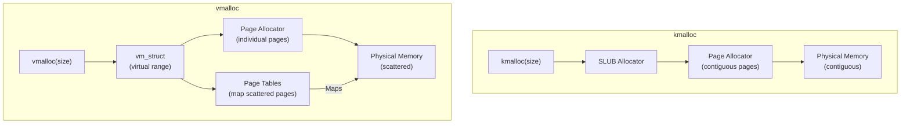
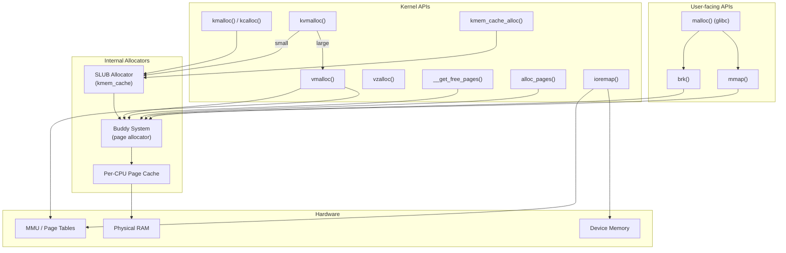
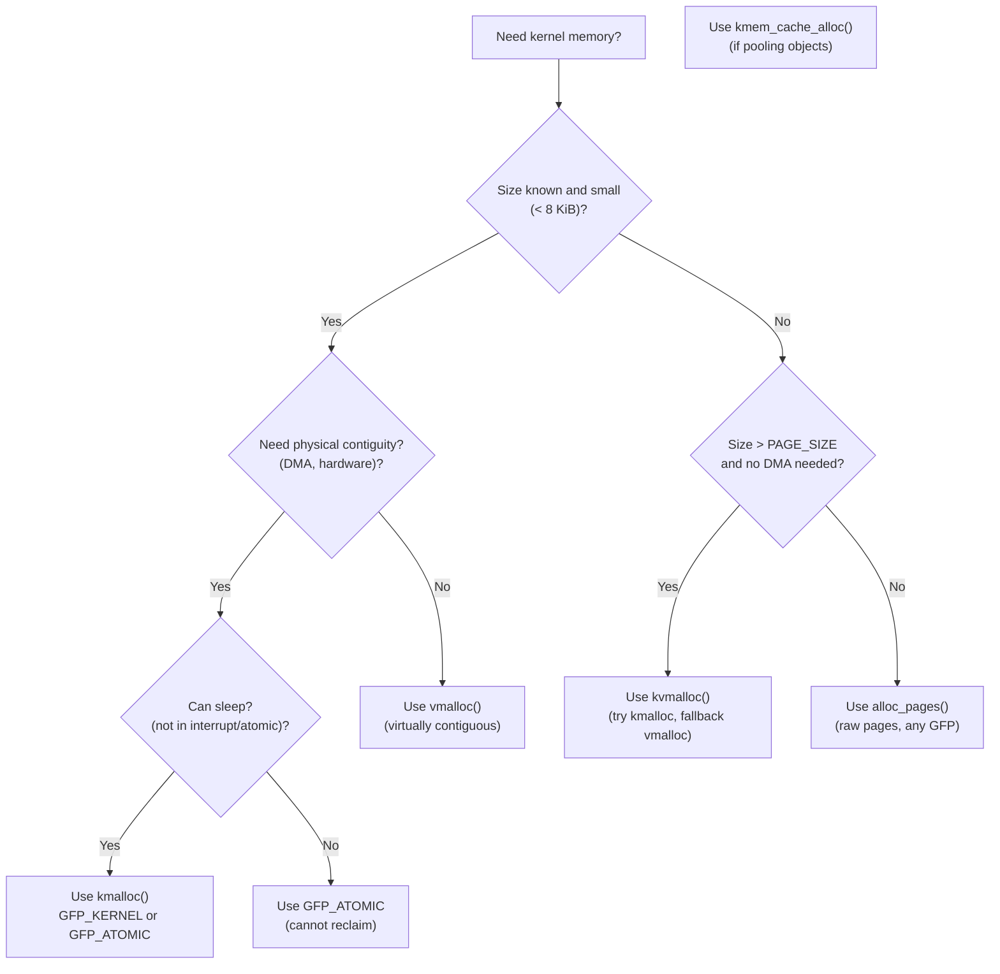

# vmalloc vs kmalloc

## Introduction

The Linux kernel provides several APIs for dynamic memory allocation, each with different characteristics regarding contiguity, size limits, performance, and use cases. The two most commonly confused are `kmalloc()` and `vmalloc()`. Understanding when to use each — and the full hierarchy of allocation APIs — is essential for writing correct and efficient kernel code.

- **kmalloc()**: Allocates physically and virtually contiguous memory from the slab allocator. Fast, but limited in size.
- **vmalloc()**: Allocates virtually contiguous memory (physical pages may be scattered). Slower due to page table manipulation, but can allocate large buffers.

## kmalloc in Detail

### How kmalloc Works

`kmalloc()` allocates memory from the SLUB allocator's size-indexed caches. The returned memory is both **physically and virtually contiguous** in the kernel's direct mapping:

```c
/* include/linux/slab.h */
static __always_inline void *kmalloc(size_t size, gfp_t flags)
{
    if (__builtin_constant_p(size)) {
        /* Compile-time size: optimize to specific cache */
        if (size > KMALLOC_MAX_CACHE_SIZE)
            return __kmalloc_large(size, flags);
        return __kmalloc(size, flags);
    }
    return __kmalloc(size, flags);
}
```

### Characteristics

| Property | Value |
|----------|-------|
| **Physical contiguity** | Yes |
| **Virtual contiguity** | Yes |
| **Size limit** | Typically 8 KiB (KMALLOC_MAX_CACHE_SIZE), up to 32 KiB with certain configs |
| **Performance** | Fast (per-CPU freelist, no page table manipulation) |
| **DMA-safe** | Yes (in DMA/DMA32 zones if needed) |
| **Sleepable** | Depends on GFP flags (GFP_KERNEL = yes, GFP_ATOMIC = no) |
| **Backing** | SLUB slab allocator → page allocator |

### Size Limits

```c
/* include/linux/slab.h */
#define KMALLOC_MAX_CACHE_SIZE  (1UL << KMALLOC_SHIFT_HIGH)
#define KMALLOC_SHIFT_HIGH     ((MAX_PAGE_ORDER + PAGE_SHIFT - 1) <= 25 ? \
                                (MAX_PAGE_ORDER + PAGE_SHIFT - 1) : 25)
/* On most systems: KMALLOC_MAX_CACHE_SIZE = 8192 (8 KiB) */

/* Maximum allocation via kmalloc (including large allocations) */
#define KMALLOC_MAX_SIZE        (1UL << KMALLOC_SHIFT_HIGH)
```

For allocations larger than `KMALLOC_MAX_CACHE_SIZE`, `kmalloc()` falls through to the page allocator directly:

```c
/* mm/slub.c */
static void *__kmalloc_large(size_t size, gfp_t flags)
{
    struct page *page;
    unsigned int order = kmalloc_large_order(size);

    if (unlikely(order >= MAX_PAGE_ORDER))
        return NULL;

    page = alloc_pages(flags | __GFP_COMP, order);
    if (!page)
        return NULL;

    /* Set up slab metadata for kfree() to recognize this as a large alloc */
    page->slab_cache = NULL;  /* Signals: not from SLUB */

    return page_address(page);
}
```

### When to Use kmalloc

- Small allocations (a few bytes to ~8 KiB)
- Need physically contiguous memory (DMA buffers, hardware descriptors)
- Performance-critical paths (fast allocation/deallocation)
- Need to work in atomic context (with `GFP_ATOMIC`)

### Code Example

```c
#include <linux/slab.h>

/* Small allocation */
char *buf = kmalloc(256, GFP_KERNEL);
if (!buf)
    return -ENOMEM;

/* Zero-initialized allocation */
int *array = kcalloc(100, sizeof(int), GFP_KERNEL);

/* DMA-capable allocation */
void *dma_buf = kmalloc(4096, GFP_KERNEL | GFP_DMA);

/* Array with overflow check */
struct item **items = kmalloc_array(n, sizeof(struct item *), GFP_KERNEL);

kfree(buf);
kfree(array);
kfree(dma_buf);
kfree(items);
```

## vmalloc in Detail

### How vmalloc Works

`vmalloc()` allocates a contiguous range of **kernel virtual addresses** but the underlying physical pages may be non-contiguous. It works by:

1. Reserving a range of virtual addresses in the vmalloc area.
2. Allocating individual physical pages from the page allocator.
3. Creating page table entries to map the scattered physical pages into the contiguous virtual range.

```c
/* mm/vmalloc.c (simplified) */
void *vmalloc(unsigned long size)
{
    return __vmalloc_node(size, 1, GFP_KERNEL | __GFP_HIGHMEM,
                          NUMA_NO_NODE, __builtin_return_address(0));
}

static void *__vmalloc_node(unsigned long size, unsigned long align,
                             gfp_t gfp_mask, int node,
                             const void *caller)
{
    struct vm_struct *area;
    void *addr;
    unsigned long real_size = size;

    /* Round up to page size */
    size = PAGE_ALIGN(size);
    if (!size || (size >> PAGE_SHIFT) > totalram_pages())
        return NULL;

    /* Allocate vm_struct to track the mapping */
    area = __get_vm_area_node(size, align, VM_ALLOC | VM_MAP,
                               VMALLOC_START, VMALLOC_END,
                               node, gfp_mask, caller);
    if (!area)
        return NULL;

    /* Map physical pages into the virtual area */
    addr = __vmalloc_area_node(area, gfp_mask, node);
    if (!addr) {
        vfree(area);
        return NULL;
    }

    return addr;
}
```

### The vmalloc Virtual Address Range

```c
/* arch/x86/include/asm/pgtable_64_types.h */
#define VMALLOC_SIZE    (VMALLOC_END - VMALLOC_START)

/* Typical values on x86_64: */
#define VMALLOC_START   0xffffc90000000000UL
#define VMALLOC_END     0xffffe8ffffffffffUL
/* VMALLOC_SIZE ≈ 32 TiB */
```

### Characteristics

| Property | Value |
|----------|-------|
| **Physical contiguity** | No (pages may be scattered) |
| **Virtual contiguity** | Yes |
| **Size limit** | Limited by vmalloc area (~32 TiB) and available RAM |
| **Performance** | Slower (TLB flush, page table manipulation) |
| **DMA-safe** | No (physical pages not contiguous) |
| **Sleepable** | Yes (always uses GFP_KERNEL internally) |
| **Backing** | Page allocator (individual pages) |

### Page Table Setup

```c
/* mm/vmalloc.c (simplified) */
static int vmap_pages_range(unsigned long addr, unsigned long end,
                            pgprot_t prot, struct page **pages, int page_shift)
{
    pgd_t *pgd;
    unsigned long next;
    int err = 0;

    pgd = pgd_offset_k(addr);
    do {
        next = pgd_addr_end(addr, end);
        err = vmap_p4d_range(pgd, addr, next, prot, pages, page_shift);
    } while (pgd++, addr = next, addr < end && !err);

    return err;
}
```

Each call to `vmalloc()` creates new page table entries in the kernel's PGD (shared across all processes), which means all CPUs see the mapping.

### When to Use vmalloc

- Large allocations (>8 KiB, especially >1 page)
- Physical contiguity is not required
- Allocating buffers for data that will be accessed sequentially
- Loading kernel modules (module text/data sections)
- Swap maps, network buffers, video frame buffers

### Code Example

```c
#include <linux/vmalloc.h>

/* Large buffer allocation */
void *big_buf = vmalloc(1024 * 1024); /* 1 MiB */
if (!big_buf)
    return -ENOMEM;

/* Use the buffer */
memset(big_buf, 0, 1024 * 1024);

/* Free it */
vfree(big_buf);

/* Note: vmalloc memory cannot be used for DMA
 * because physical pages are not contiguous */
```

## vmalloc vs kmalloc: Side-by-Side Comparison



### Complete Comparison Table

| Aspect | kmalloc | vmalloc |
|--------|---------|---------|
| **Physical contiguity** | ✅ Yes | ❌ No |
| **Virtual contiguity** | ✅ Yes | ✅ Yes |
| **Max size** | ~8 KiB (slab), ~4 MiB (page) | ~32 TiB |
| **Speed** | Fast (~ns) | Slow (~μs, TLB flush) |
| **DMA capable** | ✅ Yes | ❌ No |
| **Atomic context** | ✅ (with GFP_ATOMIC) | ❌ Always sleeps |
| **Page table overhead** | None (uses direct map) | Creates new PTEs |
| **TLB efficiency** | Good (direct map) | Worse (vmalloc area, may need TLB fills) |
| **Typical use** | Small structures, DMA buffers | Large buffers, module loading |

## kvmalloc: Best of Both Worlds

The `kvmalloc()` family tries `kmalloc()` first and falls back to `vmalloc()` if the allocation is large or the system is fragmented:

```c
/* include/linux/slab.h */
static inline void *kvmalloc(size_t size, gfp_t flags)
{
    return kvmalloc_node(size, flags, NUMA_NO_NODE);
}

/* mm/util.c */
void *kvmalloc_node(size_t size, gfp_t flags, int node)
{
    void *ret;

    /* Try kmalloc first (fast path) */
    ret = __kmalloc_node(size, flags, node);
    if (ret || size <= PAGE_SIZE)
        return ret;

    /* Fallback to vmalloc for large allocations */
    if (!(flags & __GFP_NOWARN) && !(flags & __GFP_NORETRY))
        flags |= __GFP_NOWARN;

    return __vmalloc_node(size, 1, flags, node,
                          __builtin_return_address(0));
}
```

### When to Use kvmalloc

- You need a buffer that is *usually* small but *sometimes* large
- Physical contiguity is not required
- You want the performance of kmalloc when possible

```c
/* Example: network buffer that varies in size */
void *buf = kvmalloc(pkt_len, GFP_KERNEL);
if (!buf)
    return -ENOMEM;

/* Use the buffer */

kvfree(buf);  /* Works for both kmalloc and vmalloc allocations */
```

## Full Kernel Memory Allocation Hierarchy



## Summary of All Allocation APIs

### High-Level APIs

| Function | Use Case | Max Size | Contiguity | Context |
|----------|----------|----------|------------|---------|
| `kmalloc()` | Small, general-purpose | ~8 KiB | Physical + Virtual | Any (with right GFP) |
| `kzalloc()` | Zero-initialized kmalloc | ~8 KiB | Physical + Virtual | Any |
| `kcalloc()` | Array, overflow-safe | ~8 KiB | Physical + Virtual | Any |
| `kvmalloc()` | Flexible, kmalloc→vmalloc | ~32 TiB | Virtual only (if fallback) | Process |
| `kvzalloc()` | Zero-initialized kvmalloc | ~32 TiB | Virtual only (if fallback) | Process |
| `vmalloc()` | Large buffer | ~32 TiB | Virtual only | Process |
| `vzalloc()` | Zero-initialized vmalloc | ~32 TiB | Virtual only | Process |
| `kmem_cache_alloc()` | Object from cache | varies | Physical | Any |
| `__get_free_pages()` | Raw page allocation | 4 MiB (order 10) | Physical + Virtual | Any |
| `alloc_pages()` | NUMA-aware pages | 4 MiB (order 10) | Physical (struct page) | Any |

### Free Functions

| Allocate | Corresponding Free |
|----------|-------------------|
| `kmalloc()` / `kzalloc()` / `kcalloc()` | `kfree()` |
| `kvmalloc()` / `kvzalloc()` | `kvfree()` |
| `vmalloc()` / `vzalloc()` | `vfree()` |
| `kmem_cache_alloc()` | `kmem_cache_free()` |
| `__get_free_pages()` | `free_pages()` |
| `alloc_pages()` | `__free_pages()` |

### Decision Tree



## DMA Memory Considerations

### DMA and kmalloc

For DMA-capable devices, physical contiguity is required. `kmalloc()` with `GFP_DMA` or `GFP_DMA32` provides memory from the appropriate zone:

```c
/* ISA DMA (first 16 MB) */
void *buf = kmalloc(size, GFP_KERNEL | GFP_DMA);

/* 32-bit DMA (first 4 GB) */
void *buf = kmalloc(size, GFP_KERNEL | GFP_DMA32);

/* Streaming DMA API */
dma_addr_t dma_handle;
buf = kmalloc(size, GFP_KERNEL);
dma_handle = dma_map_single(dev, buf, size, DMA_TO_DEVICE);
```

### Why vmalloc Cannot Be Used for DMA

```c
/* vmalloc memory is virtually contiguous but physically scattered */
void *vbuf = vmalloc(4096 * 10);
/* vbuf[0] might be at physical page 0x1A000 */
/* vbuf[4096] might be at physical page 0x3F000 */
/* DMA hardware operates on physical addresses → cannot use this */
```

## Performance Considerations

### Benchmarking kmalloc vs vmalloc

```c
/* Kernel module benchmark */
#include <linux/module.h>
#include <linux/slab.h>
#include <linux/vmalloc.h>
#include <linux/ktime.h>

static int __init bench_init(void)
{
    ktime_t start, end;
    int i, iterations = 100000;

    /* Benchmark kmalloc */
    start = ktime_get();
    for (i = 0; i < iterations; i++) {
        void *p = kmalloc(256, GFP_KERNEL);
        kfree(p);
    }
    end = ktime_get();
    pr_info("kmalloc(256): %lld ns/iter\n",
            ktime_to_ns(ktime_sub(end, start)) / iterations);

    /* Benchmark vmalloc */
    start = ktime_get();
    for (i = 0; i < iterations; i++) {
        void *p = vmalloc(256);
        vfree(p);
    }
    end = ktime_get();
    pr_info("vmalloc(256): %lld ns/iter\n",
            ktime_to_ns(ktime_sub(end, start)) / iterations);

    return 0;
}

static void __exit bench_exit(void) {}
module_init(bench_init);
module_exit(bench_exit);
MODULE_LICENSE("GPL");
```

Typical results:
```
kmalloc(256): ~50 ns/iter
vmalloc(256): ~2000 ns/iter  (40x slower due to page table manipulation)
```

## Common Mistakes

### 1. Using kmalloc for Large Allocations

```c
/* WRONG: kmalloc for large buffer may fail under fragmentation */
void *buf = kmalloc(1024 * 1024, GFP_KERNEL);  /* May fail! */

/* RIGHT: Use vmalloc for large allocations */
void *buf = vmalloc(1024 * 1024);

/* RIGHT: Or use kvmalloc for flexibility */
void *buf = kvmalloc(1024 * 1024, GFP_KERNEL);
```

### 2. Using vmalloc for DMA

```c
/* WRONG: DMA requires physically contiguous memory */
void *buf = vmalloc(4096);
dma_map_single(dev, buf, 4096, DMA_TO_DEVICE);  /* BUG! */

/* RIGHT: Use kmalloc for DMA */
void *buf = kmalloc(4096, GFP_KERNEL | GFP_DMA);
dma_map_single(dev, buf, 4096, DMA_TO_DEVICE);
```

### 3. Using vmalloc in Atomic Context

```c
/* WRONG: vmalloc always sleeps */
irqreturn_t my_irq_handler(int irq, void *data)
{
    void *buf = vmalloc(4096);  /* BUG: sleeping in interrupt! */
    /* ... */
}

/* RIGHT: Use kmalloc with GFP_ATOMIC */
irqreturn_t my_irq_handler(int irq, void *data)
{
    void *buf = kmalloc(4096, GFP_ATOMIC);
    /* ... */
}
```

### 4. Mixing Free Functions

```c
/* WRONG: Using kfree() on vmalloc'd memory */
void *buf = vmalloc(4096);
kfree(buf);  /* BUG! */

/* RIGHT: Use vfree() for vmalloc'd memory */
void *buf = vmalloc(4096);
vfree(buf);

/* RIGHT: Use kvfree() for kvmalloc'd memory (works for both) */
void *buf = kvmalloc(4096, GFP_KERNEL);
kvfree(buf);
```

## ioremap: Mapping Device Memory

`ioremap()` maps physical device memory (MMIO) into the kernel's virtual address space. It uses the same vmalloc infrastructure:

```c
/* include/asm-generic/io.h */
void __iomem *ioremap(phys_addr_t phys_addr, size_t size);

/* Map a device's registers */
void __iomem *regs = ioremap(0xFE200000, 4096);
if (!regs)
    return -ENOMEM;

/* Read/write device registers */
u32 val = readl(regs + 0x04);
writel(0x1, regs + 0x08);

/* Unmap when done */
iounmap(regs);
```

Unlike `vmalloc()`, `ioremap()` maps **device memory** (not RAM), so the pages are marked as non-cacheable (`PCD=1`).

## References

- [The Linux Kernel Documentation](https://docs.kernel.org/)
- [GNU Project Documentation](https://www.gnu.org/doc/doc.html)
- [GNU Manuals](https://www.gnu.org/manual/manual.html)
- [Free Software Directory](https://directory.fsf.org/wiki/Main_Page)
- [Planet GNU](https://planet.gnu.org/)
- [Free Software Books](https://www.gnu.org/doc/other-free-books.html)

- **Linux Device Drivers, 3rd Edition** — Chapter 8: Allocating Memory
- **Linux Kernel Development, 3rd Edition** — Chapter 12: Memory Management
- [Kernel source: mm/vmalloc.c](https://elixir.bootlin.com/linux/latest/source/mm/vmalloc.c)
- [Kernel source: mm/slab_common.c](https://elixir.bootlin.com/linux/latest/source/mm/slab_common.c)
- [Kernel documentation: Memory Allocation](https://www.kernel.org/doc/html/latest/core-api/memory-allocation.html)
- [LWN: vmalloc improvements](https://lwn.net/Articles/737424/)

## Related Topics

- [Slab Allocator](slab-allocator.md) — SLUB internals, kmem_cache
- [Page Allocator](page-allocator.md) — Buddy system, zones
- [Memory Management Overview](overview.md) — High-level overview
- [Huge Pages](huge-pages.md) — Large page support
