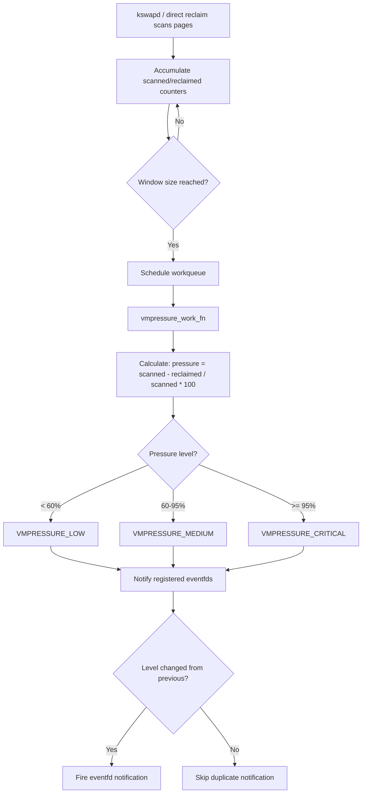
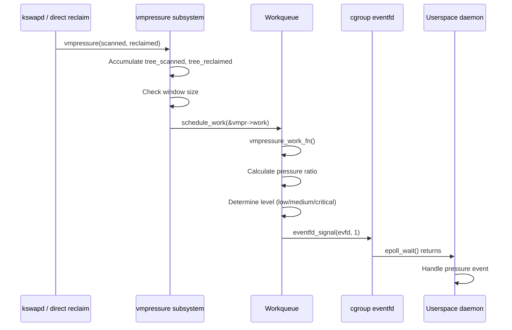
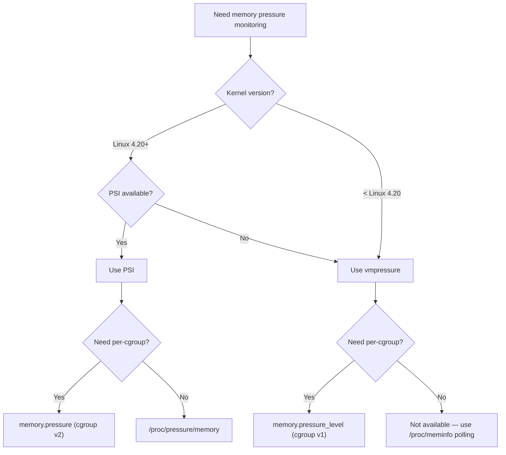
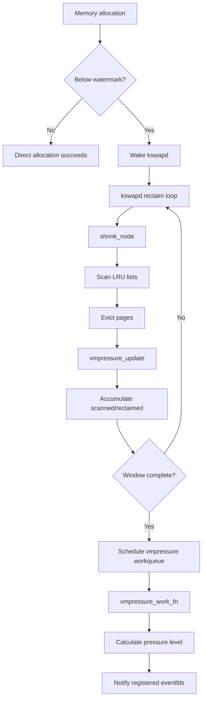
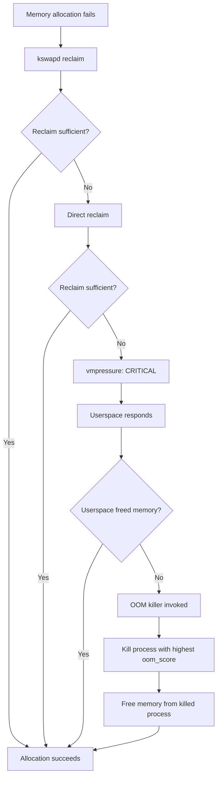

# vmpressure — Memory Pressure Notifications

## Overview

`vmpressure` is a kernel subsystem that monitors memory pressure levels and generates
notifications when the system experiences varying degrees of memory scarcity. It acts
as a bridge between the kernel's page reclaim mechanisms and userspace consumers,
enabling proactive memory management decisions before the system reaches a critical
OOM (Out of Memory) state.

Unlike direct OOM killer invocation, vmpressure provides graduated feedback —
**low**, **medium**, and **critical** — that lets userspace daemons, cgroups, and
container orchestrators respond proportionally.

> **Introduced:** Linux 3.8 (commit `783a5900`)  
> **Author:** Anton Vorontsov  
> **Source:** `mm/vmpressure.c`, `include/linux/vmpressure.h`

---

## History and Motivation

The vmpressure interface was introduced by Anton Vorontsov and contributed to the
mainline kernel in **Linux 3.8** (2013). The original motivation was to provide a
mechanism for Android's low-memory killer daemon (lmkd) and similar userspace agents
to receive timely, structured notifications about memory stress, replacing ad-hoc
polling of `/proc/meminfo` or other heuristics.

Prior to vmpressure, the kernel offered no intermediate signal between "everything is
fine" and "OOM killer is shooting processes." The vmpressure subsystem fills this gap
by computing a pressure ratio based on reclaim efficiency.

### Why Reclaim Efficiency?

The key insight behind vmpressure is that **reclaim efficiency** is a leading
indicator of memory pressure. When the kernel's reclaim path scans pages but
fails to free them (because they're all dirty, pinned, or otherwise unevictable),
the system is under stress. This ratio provides an early warning before the
system actually runs out of memory.

---

## How Memory Pressure Is Calculated

### Reclaim Scanning vs. Reclaim Efficiency

The vmpressure subsystem hooks into the kernel's page reclaim path (mm/vmpressure.c).
Every time the kswapd daemon or direct reclaim scans pages, vmpressure tracks:

- **Scanned**: the number of pages examined during reclaim
- **Reclaimed**: the number of pages actually freed

The pressure ratio is:

```
pressure = (scanned - reclaimed) / scanned * 100
```

A high ratio means reclaim is spending a lot of effort but freeing few pages — the
system is under memory stress.

### Workqueue-Based Smoothing

Raw reclaim events are noisy. vmpressure uses a kernel workqueue to aggregate
samples over a window and compute a smoothed pressure value. This prevents
transient spikes from triggering false alarms.

The workqueue function `vmpressure_work_fn()` processes accumulated
scanned/reclaimed counters:

```c
/* mm/vmpressure.c */
static void vmpressure_work_fn(struct work_struct *work)
{
    struct vmpressure *vmpr = container_of(work, struct vmpressure,
                                            work);
    unsigned long scanned, reclaimed;

    /* Atomically read and reset counters */
    scanned = vmpr->tree_scanned;
    reclaimed = vmpr->tree_reclaimed;
    vmpr->tree_scanned = 0;
    vmpr->tree_reclaimed = 0;

    /* Calculate pressure level */
    vmpressure_event(vmpr, scanned, reclaimed);
}
```

### Pressure Levels

| Level      | Threshold  | Meaning                                        |
|------------|------------|------------------------------------------------|
| `low`      | ~60%       | Minor reclaim inefficiency; background pressure |
| `medium`   | ~80%       | Significant reclaim difficulty; action advised  |
| `critical` | ~95%       | Reclaim nearly failing; imminent OOM risk       |

These thresholds are defined in `mm/vmpressure.c` and are not currently tunable at
runtime, though some downstream kernels (Android, Chrome OS) adjust them.

### Threshold Definitions

```c
/* mm/vmpressure.c */
static const unsigned long vmpressure_win = SWAP_CLUSTER_MAX * 16;
static const unsigned long vmpressure_level_med = 60;
static const unsigned long vmpressure_level_critical = 95;

/* Level classification */
enum vmpressure_levels {
    VMPRESSURE_LOW = 0,
    VMPRESSURE_MEDIUM,
    VMPRESSURE_CRITICAL,
    VMPRESSURE_NUM_LEVELS = VMPRESSURE_CRITICAL,
};
```

### Pressure Calculation Algorithm



---

## Kernel Internals

### Data Structures

```c
/* include/linux/vmpressure.h */
struct vmpressure {
    unsigned long scanned;
    unsigned long reclaimed;
    unsigned long tree_scanned;
    unsigned long tree_reclaimed;
    struct vmpressure_levels levels[VMPRESSURE_NUM_LEVELS];
    struct mutex lock;
    struct work_struct work;
};

/* Per-level notification tracking */
struct vmpressure_levels {
    struct vmpressure *vmpr;    /* Back-pointer to parent */
    enum vmpressure_levels level;
    struct eventfd_ctx *evfd;   /* eventfd for notification */
    unsigned long pending;      /* Pending notifications */
};
```

Each memory cgroup (`memcg`) has its own `vmpressure` instance, enabling per-cgroup
pressure tracking.

### Call Sites

The primary call sites are:

- **`vmpressure()`** — invoked from `shrink_node()` during reclaim. This is the
  main entry point for system-wide pressure monitoring.

- **`vmpressure_prio()`** — invoked when reclaim priority changes. Used to detect
  escalating reclaim difficulty.

- **`vmpressure_memcg()`** — invoked per-memcg during cgroup reclaim. Triggers
  per-cgroup pressure events.

```c
/* mm/vmscan.c — shrink_node() */
static void shrink_node(struct pglist_data *pgdat, struct scan_control *sc)
{
    /* ... reclaim logic ... */

    /* Report pressure after reclaim */
    if (sc->nr_scanned) {
        vmpressure(sc->gfp_mask, memcg,
                   sc->nr_scanned, sc->nr_reclaimed);
    }
}
```

### Event Delivery

vmpressure exposes events via:

1. **cgroup file interface**: `memory.pressure_level` (eventfd-based notification)
2. **PSI (Pressure Stall Information)**: the newer PSI subsystem (`/proc/pressure/memory`)
   subsumes many vmpressure use cases with finer granularity

### Internal Event Flow



---

## cgroup Integration

### memory cgroup v1

In cgroup v1, vmpressure is exposed under:

```
/sys/fs/cgroup/memory/<cgroup>/memory.pressure_level
```

Userspace registers for notifications using an `eventfd` via `cgroup.event_control`:

```bash
# Register for medium pressure events
echo "7 memory.pressure_level medium" > /sys/fs/cgroup/memory/<cgroup>/cgroup.event_control
```

Where `7` is the eventfd file descriptor.

#### cgroup v1 Registration Example (C)

```c
#include <sys/eventfd.h>
#include <fcntl.h>
#include <stdio.h>
#include <unistd.h>

int main(void)
{
    int efd = eventfd(0, EFD_NONBLOCK);
    char buf[64];

    /* Register eventfd for medium pressure */
    snprintf(buf, sizeof(buf), "%d memory.pressure_level medium", efd);
    int ctl_fd = open("/sys/fs/cgroup/memory/mygroup/cgroup.event_control",
                      O_WRONLY);
    write(ctl_fd, buf, sizeof(buf));
    close(ctl_fd);

    /* Wait for events */
    uint64_t count;
    while (read(efd, &count, sizeof(count)) > 0 || errno == EAGAIN) {
        printf("Memory pressure event received!\n");
        /* Take action: free memory, kill processes, etc. */
    }
    close(efd);
    return 0;
}
```

### cgroup v2

In cgroup v2, the direct vmpressure event file is less commonly used because PSI
provides a more general interface:

```
/sys/fs/cgroup/<cgroup>/memory.pressure
```

PSI reports "some" and "full" stall percentages, which correlate with vmpressure
levels but are computed differently (based on time stalled rather than reclaim
efficiency).

#### cgroup v2 Memory Events

cgroup v2 also exposes memory events that complement pressure monitoring:

```bash
cat /sys/fs/cgroup/<cgroup>/memory.events
# low 123        ← vmpressure low events
# high 456       ← vmpressure high events (above high watermark)
# max 789        ← memory.max violations
# oom 0          ← OOM kills in this cgroup
# oom_kill 0     ← OOM kills by this cgroup
# oom_group_kill 0
```

---

## Userspace Consumers

### Android lmkd

Android's `lmkd` (Low Memory Killer Daemon) is the primary consumer of vmpressure
on mobile devices. It listens for pressure events and kills background processes
to free memory before the kernel's OOM killer acts indiscriminately.

```c
/* Android lmkd — simplified pressure handling */
static void mp_event_common(int data, uint32_t events, struct polling_params *poll_params)
{
    /* data contains the pressure level */
    switch (data) {
    case VMPRESSURE_LOW:
        /* Kill cached processes */
        break;
    case VMPRESSURE_MEDIUM:
        /* Kill background processes */
        break;
    case VMPRESSURE_CRITICAL:
        /* Kill foreground services if needed */
        break;
    }
}
```

#### Android lmkd Configuration

```bash
# /system/etc/lmkd.rc (Android init config)
service lmkd /system/bin/lmkd
    class core
    group root system readproc
    critical
    socket lmkd seqpacket 0660 system system
    writepid /dev/cpuset/system-background/tasks

# lmkd properties
ro.lmk.use_psi=true           # Use PSI instead of vmpressure
ro.lmk.use_minfree_levels=false
ro.lmk.low=100
ro.lmk.medium=80
ro.lmk.critical=20
```

### systemd

systemd can use cgroup memory pressure notifications to trigger actions like
service restarts or resource limit adjustments via `MemoryPressureWatch=` in
unit files (added in systemd 250+).

```ini
[Unit]
Description=Memory-sensitive Service

[Service]
ExecStart=/usr/bin/my-app
MemoryPressureWatch=on
MemoryPressureThresholdSec=10s
# Triggered when memory pressure is detected for 10+ seconds

[Install]
WantedBy=multi-user.target
```

#### systemd Memory Pressure Actions

```bash
# Check if a unit has memory pressure
systemctl show my-service | grep MemoryPressure
# MemoryPressureWatch=on
# MemoryPressureThresholdSec=10s

# View memory pressure events in journal
journalctl -u my-service | grep memory.pressure
```

### Custom Daemons

Any userspace process with access to the cgroup hierarchy can register for
vmpressure events. A typical pattern:

```c
int efd = eventfd(0, EFD_NONBLOCK);
/* register efd with cgroup.event_control for desired level */
struct epoll_event ev = { .events = EPOLLIN, .data.fd = efd };
epoll_ctl(epfd, EPOLL_CTL_ADD, efd, &ev);
/* ... epoll_wait loop ... */
uint64_t count;
read(efd, &count, sizeof(count));
/* pressure event received — take action */
```

### Complete Monitoring Daemon Example

```c
#include <sys/epoll.h>
#include <sys/eventfd.h>
#include <fcntl.h>
#include <stdio.h>
#include <stdlib.h>
#include <string.h>
#include <unistd.h>

#define MAX_EVENTS 3

static int register_pressure(const char *cgroup_path, const char *level)
{
    int efd = eventfd(0, EFD_NONBLOCK);
    char path[256], buf[64];

    snprintf(path, sizeof(path), "%s/cgroup.event_control", cgroup_path);
    snprintf(buf, sizeof(buf), "%d memory.pressure_level %s", efd, level);

    int fd = open(path, O_WRONLY);
    write(fd, buf, strlen(buf));
    close(fd);

    return efd;
}

int main(int argc, char *argv[])
{
    const char *cgroup = argc > 1 ? argv[1] : "/sys/fs/cgroup/memory/myapp";
    int epfd = epoll_create1(0);
    struct epoll_event ev, events[MAX_EVENTS];

    /* Register for all three levels */
    int efd_low = register_pressure(cgroup, "low");
    int efd_med = register_pressure(cgroup, "medium");
    int efd_crit = register_pressure(cgroup, "critical");

    ev.events = EPOLLIN;
    ev.data.fd = efd_low; epoll_ctl(epfd, EPOLL_CTL_ADD, efd_low, &ev);
    ev.data.fd = efd_med; epoll_ctl(epfd, EPOLL_CTL_ADD, efd_med, &ev);
    ev.data.fd = efd_crit; epoll_ctl(epfd, EPOLL_CTL_ADD, efd_crit, &ev);

    printf("Monitoring memory pressure on %s\n", cgroup);

    while (1) {
        int nfds = epoll_wait(epfd, events, MAX_EVENTS, -1);
        for (int i = 0; i < nfds; i++) {
            uint64_t count;
            read(events[i].data.fd, &count, sizeof(count));
            if (events[i].data.fd == efd_low)
                printf("LOW pressure — consider freeing caches\n");
            else if (events[i].data.fd == efd_med)
                printf("MEDIUM pressure — killing background tasks\n");
            else if (events[i].data.fd == efd_crit)
                printf("CRITICAL pressure — emergency action!\n");
        }
    }
    return 0;
}
```

---

## Relationship to PSI

The **Pressure Stall Information (PSI)** subsystem, merged in Linux 4.20, provides
a more general and arguably superior mechanism for pressure monitoring:

| Aspect        | vmpressure              | PSI                          |
|---------------|-------------------------|------------------------------|
| Metric        | Reclaim efficiency (%)  | Time stalled (seconds/sec)   |
| Granularity   | Three discrete levels   | Continuous "some"/"full"     |
| Resources     | Memory only             | CPU, memory, I/O             |
| Interface     | eventfd via cgroup      | `/proc/pressure/{cpu,mem,io}` |
| cgroup v2     | Supported but secondary | Primary interface             |
| Accuracy      | Can have false positives | More accurate (time-based)   |
| Overhead      | Very low                | Low (per-CPU timers)         |

PSI is the recommended mechanism for new code, but vmpressure remains in use
for backward compatibility, especially in Android.

### PSI Memory Pressure Interface

```bash
# System-wide memory pressure
cat /proc/pressure/memory
# some avg10=0.00 avg60=0.00 avg300=0.00 total=0
# full avg10=0.00 avg60=0.00 avg300=0.00 total=0

# Per-cgroup pressure (cgroup v2)
cat /sys/fs/cgroup/<cgroup>/memory.pressure
# some avg10=2.50 avg60=1.20 avg300=0.30 total=123456789
# full avg10=0.00 avg60=0.00 avg300=0.00 total=0
```

- **`some`**: At least one task is stalled on memory (partial stall).
- **`full`**: All tasks are stalled on memory (complete stall).
- **`avg10/60/300`**: Moving averages over 10s, 60s, 300s windows.
- **`total`**: Total stall time in microseconds.

### PSI vs vmpressure Decision



---

## vmpressure Internal Implementation

### Core Functions

```c
/* mm/vmpressure.c */

/* Main entry point — called from reclaim path */
void vmpressure(gfp_t gfp, struct mem_cgroup *memcg,
                unsigned long scanned, unsigned long reclaimed);

/* Called when reclaim priority changes */
void vmpressure_prio(gfp_t gfp, struct mem_cgroup *memcg, int prio);

/* Per-memcg pressure event */
void vmpressure_memcg(gfp_t gfp, struct mem_cgroup *memcg,
                      unsigned long scanned, unsigned long reclaimed);

/* Workqueue handler */
static void vmpressure_work_fn(struct work_struct *work);

/* Classify pressure into a level */
static enum vmpressure_levels vmpressure_level(unsigned long pressure);

/* Notify registered eventfds */
static void vmpressure_notify(struct vmpressure *vmpr,
                               enum vmpressure_levels level);
```

### vmpressure and Memory Cgroups

Each `mem_cgroup` contains a `vmpressure` field:

```c
/* include/linux/memcontrol.h */
struct mem_cgroup {
    /* ... */
    struct vmpressure vmpressure;
    /* ... */
};
```

This means every memory cgroup independently tracks pressure. A child cgroup
may experience pressure even when the parent has plenty of free memory.

### Interaction with kswapd



### Interaction with Direct Reclaim

When a process allocates memory and kswapd cannot keep up, the process enters
**direct reclaim** and calls `try_to_free_pages()`. vmpressure also hooks into
this path:

```c
/* mm/vmscan.c */
static unsigned long do_try_to_free_pages(struct zonelist *zonelist,
                                           struct scan_control *sc)
{
    /* ... reclaim zones ... */

    /* Report pressure after reclaim attempt */
    vmpressure(sc->gfp_mask, sc->target_mem_cgroup,
               sc->nr_scanned, sc->nr_reclaimed);

    return sc->nr_reclaimed;
}
```

---

## Tuning and Debugging

### Sysctls

There are no direct sysctls for vmpressure. Reclaim behavior is influenced by:

- `vm.swappiness` — swap vs. file-backed reclaim preference
- `vm.vfs_cache_pressure` — dentry/inode cache reclaim aggressiveness
- `vm.watermark_scale_factor` — kswapd wakeup thresholds
- `vm.min_free_kbytes` — minimum free memory before direct reclaim
- `vm.watermark_boost_factor` — boost watermarks for fragmentation

```bash
# Tune reclaim behavior (affects vmpressure indirectly)
sysctl vm.swappiness=60
sysctl vm.vfs_cache_pressure=100
sysctl vm.watermark_scale_factor=10
sysctl vm.min_free_kbytes=65536
```

### Tracing

vmpressure events can be traced via ftrace:

```bash
# Enable vmpressure tracepoints
echo 1 > /sys/kernel/debug/tracing/events/vmpressure/enable
cat /sys/kernel/debug/tracing/trace_pipe

# Output example:
# kworker/0:1-1234 [000]  1234.567890: vmpressure: scanned=512 reclaimed=200 level=medium
```

### Observability

Check per-cgroup pressure (cgroup v2):

```bash
cat /sys/fs/cgroup/<cgroup>/memory.pressure
# some avg10=0.00 avg60=0.00 avg300=0.00 total=0
# full avg10=0.00 avg60=0.00 avg300=0.00 total=0
```

### System-Wide Memory Pressure Indicators

```bash
# Check vmstat for reclaim activity
grep -E "pgscan|pgsteal|pgfault|pgmajfault" /proc/vmstat
# pgscan_kswapd 12345
# pgscan_direct 678
# pgsteal_kswapd 12000
# pgsteal_direct 600

# Check memory info
free -h
cat /proc/meminfo | grep -E "MemFree|Buffers|Cached|SwapFree"

# Check OOM kill history
dmesg | grep -i "oom\|killed process"
journalctl -k | grep -i oom
```

---

## Configuration Examples

### Container Memory Pressure Monitoring (cgroup v2)

```bash
#!/bin/bash
CGROUP_PATH="/sys/fs/cgroup/mycontainer"
MEMORY_PRESSURE_FILE="$CGROUP_PATH/memory.pressure"

# Monitor for "some" pressure (at least one task stalled)
while true; do
    some=$(grep 'some' "$MEMORY_PRESSURE_FILE" | awk '{print $2}' | cut -d= -f2)
    full=$(grep 'full' "$MEMORY_PRESSURE_FILE" | awk '{print $2}' | cut -d= -f2)
    if (( $(echo "$full > 50" | bc -l) )); then
        echo "CRITICAL: full memory pressure at $full%"
        # Trigger container scale-up or OOM action
    elif (( $(echo "$some > 25" | bc -l) )); then
        echo "WARNING: some memory pressure at $some%"
    fi
    sleep 5
done
```

### systemd Unit with Memory Pressure

```ini
[Unit]
Description=Memory-sensitive Service

[Service]
ExecStart=/usr/bin/my-app
MemoryPressureWatch=on
MemoryPressureThresholdSec=10s
```

### Kubernetes Memory Pressure Handling

```yaml
apiVersion: v1
kind: Pod
metadata:
  name: memory-aware-app
spec:
  containers:
  - name: app
    image: my-app:latest
    resources:
      limits:
        memory: "512Mi"
      requests:
        memory: "256Mi"
    env:
    - name: MEMORY_PRESSURE_MONITOR
      value: "true"
  # OOMKilled pods are restarted by the kubelet
  restartPolicy: Always
```

### Custom Pressure-Responsive Application

```python
#!/usr/bin/env python3
"""Monitor memory pressure and adjust behavior."""
import os
import time
import struct

def read_psi(path="/proc/pressure/memory"):
    """Parse PSI memory pressure data."""
    result = {}
    with open(path) as f:
        for line in f:
            parts = line.split()
            label = parts[0]
            metrics = {}
            for item in parts[1:]:
                key, val = item.split('=')
                metrics[key] = float(val)
            result[label] = metrics
    return result

def check_cgroup_pressure(cgroup_path):
    """Check cgroup v2 memory pressure."""
    path = os.path.join(cgroup_path, "memory.pressure")
    if os.path.exists(path):
        return read_psi(path)
    return None

def adjust_behavior(pressure):
    """Adjust application behavior based on pressure."""
    if pressure['full']['avg10'] > 50:
        # Critical: shed load aggressively
        return "critical"
    elif pressure['some']['avg10'] > 25:
        # Warning: reduce cache sizes, defer non-essential work
        return "warning"
    else:
        # Normal operation
        return "normal"

if __name__ == "__main__":
    while True:
        psi = read_psi()
        status = adjust_behavior(psi)
        print(f"Memory pressure status: {status}")
        print(f"  some: avg10={psi['some']['avg10']:.2f}%")
        print(f"  full: avg10={psi['full']['avg10']:.2f}%")
        time.sleep(5)
```

---

## Common Pitfalls

1. **Ignoring cgroup context**: vmpressure events are per-cgroup; a "low" event in
   a child cgroup doesn't mean the host is under pressure.

2. **Confusing vmpressure with PSI**: they use different metrics. A vmpressure
   "medium" event doesn't directly map to a specific PSI value.

3. **Relying solely on vmpressure**: for comprehensive memory management, combine
   with PSI, OOM scores, and cgroup memory limits.

4. **Event flooding**: under extreme pressure, events can fire rapidly. Use
   throttling or debouncing in userspace handlers.

5. **Not checking return values**: `eventfd` registration can fail. Always check
   for errors when writing to `cgroup.event_control`.

6. **Assuming thresholds are tunable**: the vmpressure thresholds (60%, 80%, 95%)
   are hardcoded. You cannot change them without patching the kernel.

7. **Forgetting cgroup v1 vs v2 differences**: the interfaces are different.
   cgroup v1 uses `cgroup.event_control`, cgroup v2 uses `memory.pressure` (PSI).

---

## vmpressure vs OOM Killer

vmpressure is an early warning system. The OOM killer is the last resort:



---

## Performance Impact

vmpressure has minimal overhead:

- **Reclaim path**: Two atomic additions per reclaim scan (scanned, reclaimed counters).
- **Workqueue**: Runs only when the window is full (typically every few hundred ms).
- **Eventfd signal**: A single `wake_up()` call if a notification is pending.

The total overhead is negligible compared to the reclaim work itself.

---

## Source Files

| File | Contents |
|------|----------|
| `mm/vmpressure.c` | Core vmpressure implementation |
| `include/linux/vmpressure.h` | vmpressure API header |
| `mm/vmscan.c` | Reclaim path calling vmpressure |
| `mm/memcontrol.c` | cgroup integration |
| `kernel/cgroup/cgroup.c` | cgroup event_control |

---

## Further Reading

- **Kernel source**: `mm/vmpressure.c`, `include/linux/vmpressure.h`
- **Documentation**: `Documentation/admin-guide/cgroup-v2.rst` (memory.pressure section)
- **PSI documentation**: `Documentation/accounting/psi.rst`
- **LWN article**: ["Memory pressure notifications"](https://lwn.net/Articles/524806/) —
  original design discussion
- **Android lmkd**: `system/memory/lmkd` — reference consumer implementation
- **commit 783a5900** — "mm: vmpressure: a new memory pressure notification mechanism"
- **LWN article**: ["Pressure stall information"](https://lwn.net/Articles/759781/) — PSI introduction
- **commit 2ce7135** — PSI introduction (Linux 4.20)

---

## See Also

- [Page Reclaim](./reclaim.md) — page reclaim mechanism (source of vmpressure data)
- [OOM Killer](./oom-killer.md) — last-resort memory recovery
- [Memory Cgroups](./cgroups.md) — per-cgroup memory management
- [Page Types](./page-types.md) — page classification and reclaim
- [Memory Compaction](./compaction.md) — compaction under pressure
- [zpool](./zpool.md) — compressed memory pool (affected by pressure)
- [Idle Page Tracking](./idle-page-tracking.md) — identifying cold pages under pressure
- [GUP](./gup.md) — pinned pages affect reclaim and pressure
