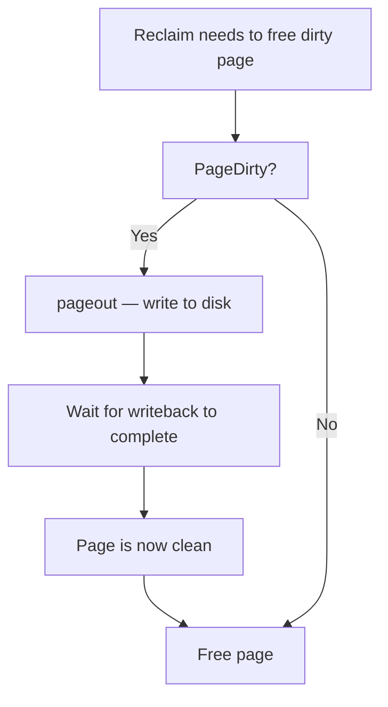
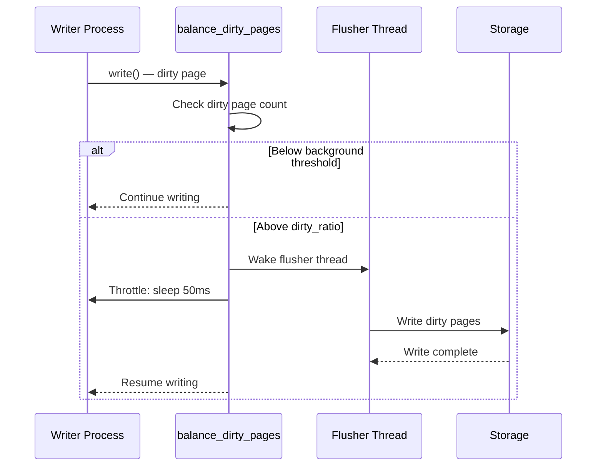
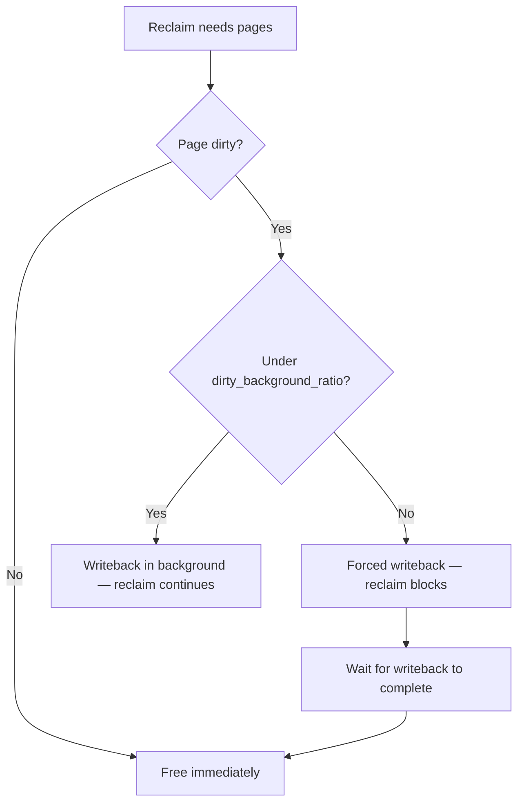

# Dirty Page Writeback

## Overview

When a process writes to a file (via `write()` or memory-mapped I/O), the data goes into **page cache** pages that are marked **dirty** — meaning they differ from the on-disk contents. Writeback is the kernel mechanism that flushes these dirty pages to stable storage (disk/SSD), ensuring data durability and preventing unbounded dirty page accumulation.

Writeback is a critical link between the memory management and filesystem/block subsystems. Too many dirty pages can cause reclaim stalls (pages must be written before they can be freed); too few can hurt write throughput.

> **Source:** `mm/page-writeback.c`, `fs/fs-writeback.c`  
> **Key functions:** `balance_dirty_pages()`, `wb_workfn()`, `writeback_sb_inodes()`

---

## How Dirty Pages Are Created

```mermaid
flowchart TD
    A[Process calls write()] --> B[VFS write_iter]
    B --> C[Filesystem write handler]
    C --> D[Write data to page cache page]
    D --> E[Mark page dirty: set_page_dirty]
    E --> F[Page is now dirty in page cache]
    F --> G{Dirty ratio threshold?}
    G -->|Below| H[Process continues]
    G -->|Above| I[Balance dirty pages — throttle writer]
```

### Dirty Page Lifecycle

1. **Write**: Data copied from userspace to page cache
2. **Dirty**: Page marked dirty (`PG_dirty` flag)
3. **Writeback**: Kernel writes page to disk (`PG_writeback`)
4. **Clean**: Writeback complete, page is clean

---

## Writeback Triggers

### 1. Background Writeback (flusher threads)

Each **backing device** (bdi) has a flusher kernel thread (`kworker/*:*+flush-*`) that periodically writes back dirty pages:

```c
/* fs/fs-writeback.c */
static void wb_workfn(struct work_struct *work)
{
    struct bdi_writeback *wb = container_of(work, struct bdi_writeback, dwork.work);

    /* Write back dirty inodes */
    wb_do_writeback(wb);
}
```

The flusher is woken when:
- Dirty pages exceed `dirty_background_ratio`
- A time interval expires (`dirty_writeback_centisecs`)
- Memory pressure forces dirty page writeback

### 2. Sync Writeback

Explicit sync operations force all dirty pages to disk:

```bash
# Sync all dirty pages
sync

# Sync specific file
sync -f /path/to/file

# Sync filesystem
sync -f /
```

```c
/* fs/sync.c */
SYSCALL_DEFINE0(sync)
{
    /* Iterate all super blocks, write back dirty data */
    iterate_supers(sync_inodes_one_sb, NULL);
    sync_filesystems(0);
    sync_filesystems(1);
    return 0;
}
```

### 3. fsync/fdatasync

Per-file sync operations:

```c
/* fsync — sync data + metadata */
int fsync(int fd);

/* fdatasync — sync data only (skip metadata if unchanged) */
int fdatasync(int fd);

/* sync_file_range — sync specific byte range */
int sync_file_range(int fd, off64_t offset, off64_t nbytes, unsigned int flags);
```

### 4. Direct Reclaim

When reclaim needs to free dirty pages, it forces writeback first:



---

## Dirty Page Tuning

### Sysctl Parameters

```bash
# Maximum dirty pages as % of total RAM
# Writer processes are throttled when this is exceeded
sysctl vm.dirty_ratio=20

# Dirty pages that trigger background writeback (as % of total RAM)
sysctl vm.dirty_background_ratio=10

# Alternative: absolute values in pages (override ratio)
sysctl vm.dirty_bytes=0           # 0 = use dirty_ratio
sysctl vm.dirty_background_bytes=0

# Writeback wakeup interval (centiseconds)
sysctl vm.dirty_writeback_centisecs=500   # 5 seconds

# Dirty page expiration time (centiseconds)
sysctl vm.dirty_expire_centisecs=3000     # 30 seconds
```

### When to Tune

| Scenario | Recommendation |
|----------|---------------|
| **Database (fsync-heavy)** | Lower `dirty_ratio` to 5-10, `dirty_background_ratio` to 2-5 |
| **Large file writes** | Higher `dirty_ratio` (30-40) for throughput |
| **Interactive desktop** | Lower `dirty_ratio` (5-10) to avoid stalls |
| **NFS server** | Lower `dirty_background_ratio` to reduce NFS latency |
| **Embedded/flash** | Lower both ratios to reduce write amplification |

---

## The Balance Dirty Pages Path

When a writer creates too many dirty pages, the kernel throttles the writer in `balance_dirty_pages()`:

```c
/* mm/page-writeback.c */
static void balance_dirty_pages(struct bdi_writeback *wb,
                                 unsigned long pages_dirtied)
{
    unsigned long nr_reclaimable;
    unsigned long bg_thresh, thresh;

    /* Calculate thresholds */
    bg_thresh = global_dirty_background_bytes() >> (PAGE_SHIFT - 10);
    thresh = global_dirty_bytes() >> (PAGE_SHIFT - 10);

    nr_reclaimable = global_node_page_state(NR_FILE_DIRTY) +
                     global_node_page_state(NR_UNSTABLE_NFS);

    if (nr_reclaimable > thresh) {
        /* Over threshold: throttle and wait for writeback */
        wb_start_background_writeback(wb);
        congestion_wait(BLK_RW_ASYNC, HZ / 50);
    }
}
```

### Throttling Behavior



---

## The Flusher (bdi_writeback)

### Architecture

Each `bdi_writeback` structure manages writeback for a block device:

```c
/* include/linux/backing-dev.h */
struct bdi_writeback {
    struct backing_dev_info *bdi;    /* Backing device */
    unsigned long last_old_flush;    /* Last flush time */
    struct delayed_work dwork;       /* Flush work */
    struct list_head b_dirty;        /* Dirty inodes */
    struct list_head b_io;           /* Inodes under I/O */
    struct list_head b_more_io;      /* More I/O pending */
    struct list_head b_dirty_time;   /* Dirty-time inodes */
    spinlock_t list_lock;            /* List lock */
    /* ... */
};
```

### Flusher Work Loop

```c
/* fs/fs-writeback.c */
static long wb_do_writeback(struct bdi_writeback *wb)
{
    long nr_pages = 0;

    /* Write back dirty inodes */
    nr_pages += wb_writeback(wb, &work);

    /* Write back dirty inode metadata */
    nr_pages += wb_check_background_flush(wb);

    return nr_pages;
}
```

### Inode-Based Writeback

The flusher groups pages by inode for efficient I/O:

```c
/* fs/fs-writeback.c */
static long writeback_sb_inodes(struct super_block *sb,
                                 struct bdi_writeback *wb,
                                 struct wb_writeback_work *work)
{
    while (!list_empty(&wb->b_dirty)) {
        struct inode *inode = wb_inode(wb->b_dirty.prev);

        /* Write back all dirty pages of this inode */
        __writeback_single_inode(inode, &wbc);

        /* Move to io list */
        list_move(&inode->i_io_list, &wb->b_io);
    }
}
```

---

## Dirty Page Tracking

### /proc/sys/vm Dirty Statistics

```bash
# System-wide dirty page counters
grep -E "nr_dirty|nr_writeback|nr_unstable" /proc/vmstat
# nr_dirty 42           — Dirty pages in page cache
# nr_writeback 0        — Pages under writeback
# nr_unstable_nfs 0     — NFS unstable pages

# Per-device dirty info
cat /proc/diskstats
```

### Per-File Dirty Pages

```bash
# Check dirty pages of a specific file (requires pagemap)
# Tools like fincore can show page cache status
fincore /path/to/file

# /proc/<pid>/smaps shows dirty pages per VMA
cat /proc/<pid>/smaps | grep -E "Dirty|Writeback"
# Shared_Dirty:     0 kB
# Private_Dirty:  512 kB
# Writeback:        0 kB
```

### Per-BDI Writeback Stats

```bash
# Writeback status per backing device
cat /sys/devices/virtual/bdi/*/stats/b_dirty_bytes
cat /sys/devices/virtual/bdi/*/stats/b_writeback_bytes
cat /sys/devices/virtual/bdi/*/stats/b_dirty_time

# Per-block-device writeback
cat /sys/block/sda/stat
```

---

## Writeback and fsync()

### fsync() Internals

`fsync()` forces all dirty data and metadata for a file to disk:

```c
/* fs/sync.c */
SYSCALL_DEFINE1(fsync, unsigned int, fd)
{
    struct fd f = fdget(fd);
    int ret = vfs_fsync(f.file, 0);  /* datasync=0: sync everything */
    fdput(f);
    return ret;
}

/* fs/fs-writeback.c */
int vfs_fsync(struct file *file, int datasync)
{
    /* 1. Write back dirty pages of this file */
    /* 2. Wait for writeback to complete */
    /* 3. Sync inode metadata */
    /* 4. Flush device write cache */
    return file->f_op->fsync(file, ...);
}
```

### fdatasync() vs fsync()

| Operation | Data | Metadata | Use Case |
|-----------|------|----------|----------|
| `fsync()` | ✓ | ✓ | Full durability |
| `fdatasync()` | ✓ | Only if changed | Database WAL |
| `sync_file_range()` | Partial | No | Batch writes |

### syncfs()

Sync all dirty data of a filesystem:

```c
/* fs/sync.c */
SYSCALL_DEFINE1(syncfs, int, fd)
{
    struct super_block *sb = file->f_path.dentry->d_sb;
    sync_filesystem(sb);
    return 0;
}
```

---

## Writeback and Memory Reclaim

### Dirty Pages in Reclaim

When reclaim encounters a dirty page, it must write it back before freeing:

```c
/* mm/vmscan.c */
static pageout_t pageout(struct page *page, struct address_space *mapping)
{
    /* Only writeback if dirty */
    if (!PageDirty(page))
        return PAGE_KEEP;

    /* Write back to disk */
    ret = mapping->a_ops->writepage(page, &wbc);

    if (ret == 0)
        return PAGE_CLEAN;  /* Page is now clean */

    return PAGE_KEEP;  /* Writeback in progress */
}
```

### Reclaim vs Writeback



---

## Writeback with io_uring (Linux 6.0+)

io_uring can perform writeback operations asynchronously:

```c
/* io_uring writeback ops */
io_uring_prep_sync_file_range(sqe, fd, offset, nbytes, flags);
io_uring_prep_fsync(sqe, fd, IORING_FSYNC_DATASYNC);
```

---

## Common Issues

### Dirty Page Accumulation

**Symptom**: `nr_dirty` in `/proc/vmstat` keeps growing; `free` shows lots of cache but system is slow.

**Cause**: `dirty_ratio` is too high, or the storage is slow and can't keep up with write rate.

**Solutions**:
- Lower `vm.dirty_ratio` and `vm.dirty_background_ratio`
- Check disk I/O bandwidth (`iostat -x 1`)
- Use faster storage or RAID for write throughput

### fsync() Latency Spikes

**Symptom**: Application `fsync()` calls take milliseconds to seconds.

**Cause**: Large dirty page backlog needs to be flushed, or storage is slow/congested.

**Solutions**:
- Lower `dirty_background_ratio` to spread writeback over time
- Use `fdatasync()` instead of `fsync()` where possible
- Use io_uring for async fsync
- Use battery-backed write cache (BBU/FBWC)

### Reclaim Stalls on Dirty Pages

**Symptom**: Direct reclaim takes a long time when memory is low.

**Cause**: Reclaim must wait for dirty pages to be written to disk.

**Solutions**:
- Lower `dirty_ratio` to prevent too many dirty pages
- Ensure `dirty_background_ratio` triggers early writeback
- Monitor `nr_writeback` for I/O congestion

---

## Further Reading

- **Kernel documentation**: `Documentation/admin-guide/sysctl/vm.rst`
- **kernel-internals.org**: [Page Cache Writeback](https://kernel-internals.org/io/page-cache-writeback/)
- **LWN**: ["Writeback clustering"](https://lwn.net/Articles/396253/)
- **LWN**: ["Flushing out pdflush"](https://lwn.net/Articles/326751/) — per-bdi flusher design
- **Source**: `mm/page-writeback.c` — dirty throttling, balance_dirty_pages
- **Source**: `fs/fs-writeback.c` — flusher thread implementation

---

## See Also

- [Page Cache](./page-cache.md) — page cache management
- [Page Types](./page-types.md) — dirty page classification
- [Page Reclaim](./reclaim.md) — reclaim triggers writeback
- [Filesystems](./ext4.md) — filesystem writeback callbacks
- [Block I/O](./block-io.md) — block layer writeback
