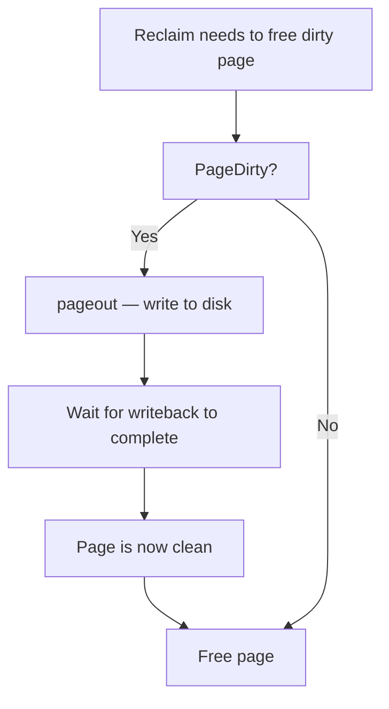
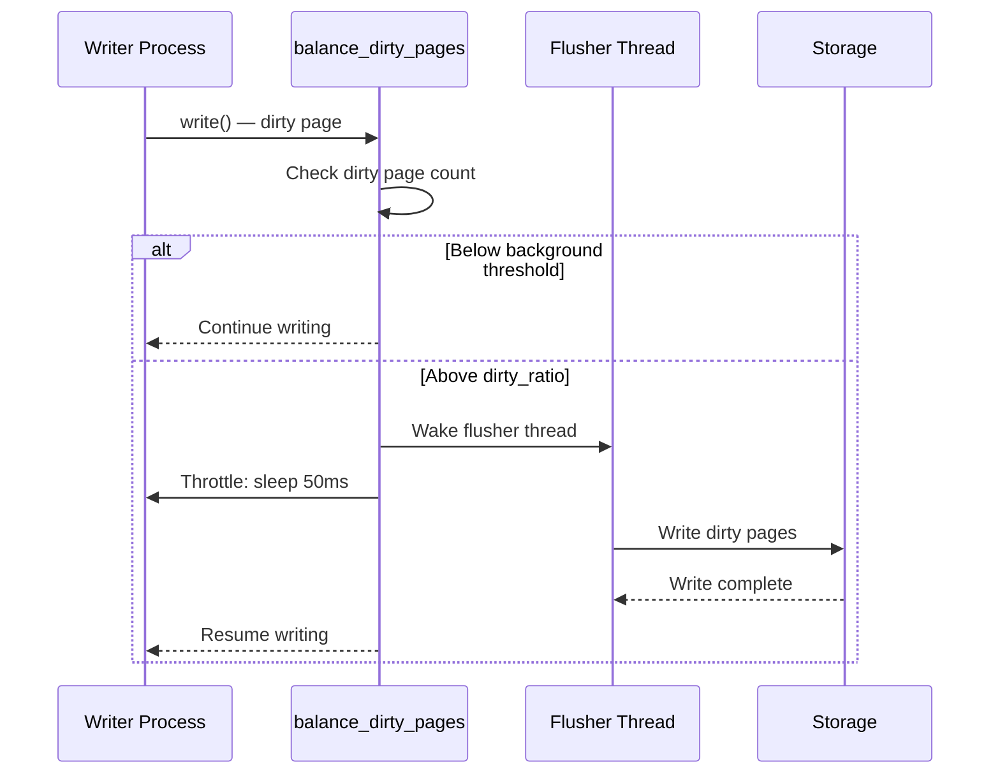
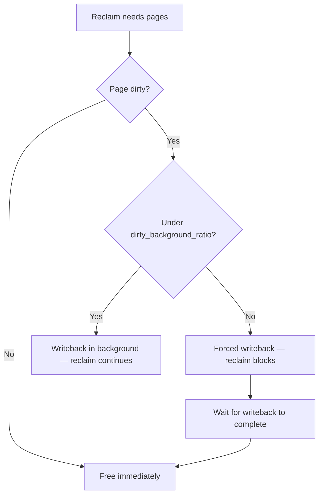
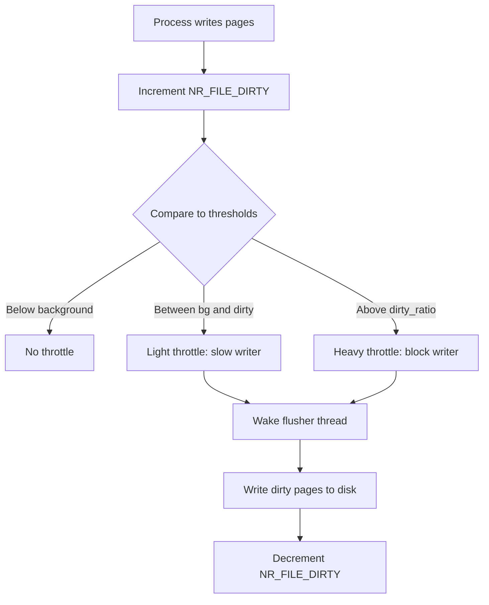
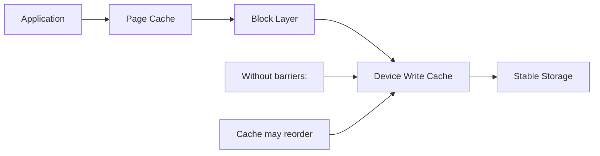
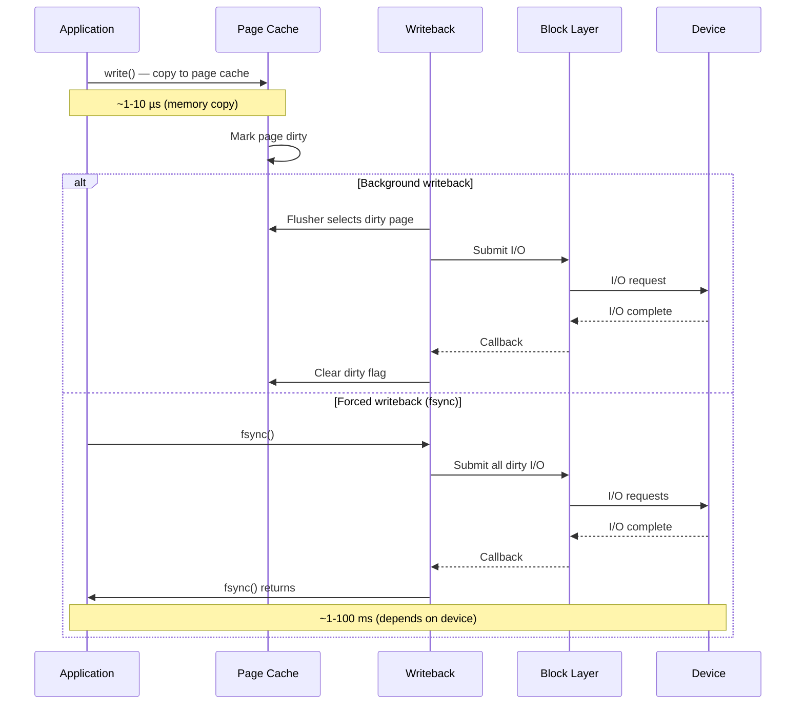

# Dirty Page Writeback

## Overview

When a process writes to a file (via `write()` or memory-mapped I/O), the data goes into **page cache** pages that are marked **dirty** — meaning they differ from the on-disk contents. Writeback is the kernel mechanism that flushes these dirty pages to stable storage (disk/SSD), ensuring data durability and preventing unbounded dirty page accumulation.

Writeback is a critical link between the memory management and filesystem/block subsystems. Too many dirty pages can cause reclaim stalls (pages must be written before they can be freed); too few can hurt write throughput.

> **Source:** `mm/page-writeback.c`, `fs/fs-writeback.c`  
> **Key functions:** `balance_dirty_pages()`, `wb_workfn()`, `writeback_sb_inodes()`

---

## How Dirty Pages Are Created

```mermaid
flowchart TD
    A[Process calls write()] --> B[VFS write_iter]
    B --> C[Filesystem write handler]
    C --> D[Write data to page cache page]
    D --> E[Mark page dirty: set_page_dirty]
    E --> F[Page is now dirty in page cache]
    F --> G{Dirty ratio threshold?}
    G -->|Below| H[Process continues]
    G -->|Above| I[Balance dirty pages — throttle writer]
```

### Dirty Page Lifecycle

1. **Write**: Data copied from userspace to page cache
2. **Dirty**: Page marked dirty (`PG_dirty` flag)
3. **Writeback**: Kernel writes page to disk (`PG_writeback`)
4. **Clean**: Writeback complete, page is clean

---

## Writeback Triggers

### 1. Background Writeback (flusher threads)

Each **backing device** (bdi) has a flusher kernel thread (`kworker/*:*+flush-*`) that periodically writes back dirty pages:

```c
/* fs/fs-writeback.c */
static void wb_workfn(struct work_struct *work)
{
    struct bdi_writeback *wb = container_of(work, struct bdi_writeback, dwork.work);

    /* Write back dirty inodes */
    wb_do_writeback(wb);
}
```

The flusher is woken when:
- Dirty pages exceed `dirty_background_ratio`
- A time interval expires (`dirty_writeback_centisecs`)
- Memory pressure forces dirty page writeback

### 2. Sync Writeback

Explicit sync operations force all dirty pages to disk:

```bash
# Sync all dirty pages
sync

# Sync specific file
sync -f /path/to/file

# Sync filesystem
sync -f /
```

```c
/* fs/sync.c */
SYSCALL_DEFINE0(sync)
{
    /* Iterate all super blocks, write back dirty data */
    iterate_supers(sync_inodes_one_sb, NULL);
    sync_filesystems(0);
    sync_filesystems(1);
    return 0;
}
```

### 3. fsync/fdatasync

Per-file sync operations:

```c
/* fsync — sync data + metadata */
int fsync(int fd);

/* fdatasync — sync data only (skip metadata if unchanged) */
int fdatasync(int fd);

/* sync_file_range — sync specific byte range */
int sync_file_range(int fd, off64_t offset, off64_t nbytes, unsigned int flags);
```

### 4. Direct Reclaim

When reclaim needs to free dirty pages, it forces writeback first:



---

## Dirty Page Tuning

### Sysctl Parameters

```bash
# Maximum dirty pages as % of total RAM
# Writer processes are throttled when this is exceeded
sysctl vm.dirty_ratio=20

# Dirty pages that trigger background writeback (as % of total RAM)
sysctl vm.dirty_background_ratio=10

# Alternative: absolute values in pages (override ratio)
sysctl vm.dirty_bytes=0           # 0 = use dirty_ratio
sysctl vm.dirty_background_bytes=0

# Writeback wakeup interval (centiseconds)
sysctl vm.dirty_writeback_centisecs=500   # 5 seconds

# Dirty page expiration time (centiseconds)
sysctl vm.dirty_expire_centisecs=3000     # 30 seconds
```

### When to Tune

| Scenario | Recommendation |
|----------|---------------|
| **Database (fsync-heavy)** | Lower `dirty_ratio` to 5-10, `dirty_background_ratio` to 2-5 |
| **Large file writes** | Higher `dirty_ratio` (30-40) for throughput |
| **Interactive desktop** | Lower `dirty_ratio` (5-10) to avoid stalls |
| **NFS server** | Lower `dirty_background_ratio` to reduce NFS latency |
| **Embedded/flash** | Lower both ratios to reduce write amplification |

---

## The Balance Dirty Pages Path

When a writer creates too many dirty pages, the kernel throttles the writer in `balance_dirty_pages()`:

```c
/* mm/page-writeback.c */
static void balance_dirty_pages(struct bdi_writeback *wb,
                                 unsigned long pages_dirtied)
{
    unsigned long nr_reclaimable;
    unsigned long bg_thresh, thresh;

    /* Calculate thresholds */
    bg_thresh = global_dirty_background_bytes() >> (PAGE_SHIFT - 10);
    thresh = global_dirty_bytes() >> (PAGE_SHIFT - 10);

    nr_reclaimable = global_node_page_state(NR_FILE_DIRTY) +
                     global_node_page_state(NR_UNSTABLE_NFS);

    if (nr_reclaimable > thresh) {
        /* Over threshold: throttle and wait for writeback */
        wb_start_background_writeback(wb);
        congestion_wait(BLK_RW_ASYNC, HZ / 50);
    }
}
```

### Throttling Behavior



---

## The Flusher (bdi_writeback)

### Architecture

Each `bdi_writeback` structure manages writeback for a block device:

```c
/* include/linux/backing-dev.h */
struct bdi_writeback {
    struct backing_dev_info *bdi;    /* Backing device */
    unsigned long last_old_flush;    /* Last flush time */
    struct delayed_work dwork;       /* Flush work */
    struct list_head b_dirty;        /* Dirty inodes */
    struct list_head b_io;           /* Inodes under I/O */
    struct list_head b_more_io;      /* More I/O pending */
    struct list_head b_dirty_time;   /* Dirty-time inodes */
    spinlock_t list_lock;            /* List lock */
    /* ... */
};
```

### Flusher Work Loop

```c
/* fs/fs-writeback.c */
static long wb_do_writeback(struct bdi_writeback *wb)
{
    long nr_pages = 0;

    /* Write back dirty inodes */
    nr_pages += wb_writeback(wb, &work);

    /* Write back dirty inode metadata */
    nr_pages += wb_check_background_flush(wb);

    return nr_pages;
}
```

### Inode-Based Writeback

The flusher groups pages by inode for efficient I/O:

```c
/* fs/fs-writeback.c */
static long writeback_sb_inodes(struct super_block *sb,
                                 struct bdi_writeback *wb,
                                 struct wb_writeback_work *work)
{
    while (!list_empty(&wb->b_dirty)) {
        struct inode *inode = wb_inode(wb->b_dirty.prev);

        /* Write back all dirty pages of this inode */
        __writeback_single_inode(inode, &wbc);

        /* Move to io list */
        list_move(&inode->i_io_list, &wb->b_io);
    }
}
```

---

## Dirty Page Tracking

### /proc/sys/vm Dirty Statistics

```bash
# System-wide dirty page counters
grep -E "nr_dirty|nr_writeback|nr_unstable" /proc/vmstat
# nr_dirty 42           — Dirty pages in page cache
# nr_writeback 0        — Pages under writeback
# nr_unstable_nfs 0     — NFS unstable pages

# Per-device dirty info
cat /proc/diskstats
```

### Per-File Dirty Pages

```bash
# Check dirty pages of a specific file (requires pagemap)
# Tools like fincore can show page cache status
fincore /path/to/file

# /proc/<pid>/smaps shows dirty pages per VMA
cat /proc/<pid>/smaps | grep -E "Dirty|Writeback"
# Shared_Dirty:     0 kB
# Private_Dirty:  512 kB
# Writeback:        0 kB
```

### Per-BDI Writeback Stats

```bash
# Writeback status per backing device
cat /sys/devices/virtual/bdi/*/stats/b_dirty_bytes
cat /sys/devices/virtual/bdi/*/stats/b_writeback_bytes
cat /sys/devices/virtual/bdi/*/stats/b_dirty_time

# Per-block-device writeback
cat /sys/block/sda/stat
```

---

## Writeback and fsync()

### fsync() Internals

`fsync()` forces all dirty data and metadata for a file to disk:

```c
/* fs/sync.c */
SYSCALL_DEFINE1(fsync, unsigned int, fd)
{
    struct fd f = fdget(fd);
    int ret = vfs_fsync(f.file, 0);  /* datasync=0: sync everything */
    fdput(f);
    return ret;
}

/* fs/fs-writeback.c */
int vfs_fsync(struct file *file, int datasync)
{
    /* 1. Write back dirty pages of this file */
    /* 2. Wait for writeback to complete */
    /* 3. Sync inode metadata */
    /* 4. Flush device write cache */
    return file->f_op->fsync(file, ...);
}
```

### fdatasync() vs fsync()

| Operation | Data | Metadata | Use Case |
|-----------|------|----------|----------|
| `fsync()` | ✓ | ✓ | Full durability |
| `fdatasync()` | ✓ | Only if changed | Database WAL |
| `sync_file_range()` | Partial | No | Batch writes |

### syncfs()

Sync all dirty data of a filesystem:

```c
/* fs/sync.c */
SYSCALL_DEFINE1(syncfs, int, fd)
{
    struct super_block *sb = file->f_path.dentry->d_sb;
    sync_filesystem(sb);
    return 0;
}
```

---

## Writeback and Memory Reclaim

### Dirty Pages in Reclaim

When reclaim encounters a dirty page, it must write it back before freeing:

```c
/* mm/vmscan.c */
static pageout_t pageout(struct page *page, struct address_space *mapping)
{
    /* Only writeback if dirty */
    if (!PageDirty(page))
        return PAGE_KEEP;

    /* Write back to disk */
    ret = mapping->a_ops->writepage(page, &wbc);

    if (ret == 0)
        return PAGE_CLEAN;  /* Page is now clean */

    return PAGE_KEEP;  /* Writeback in progress */
}
```

### Reclaim vs Writeback



---

## Writeback with io_uring (Linux 6.0+)

io_uring can perform writeback operations asynchronously:

```c
/* io_uring writeback ops */
io_uring_prep_sync_file_range(sqe, fd, offset, nbytes, flags);
io_uring_prep_fsync(sqe, fd, IORING_FSYNC_DATASYNC);
```

---

## Common Issues

### Dirty Page Accumulation

**Symptom**: `nr_dirty` in `/proc/vmstat` keeps growing; `free` shows lots of cache but system is slow.

**Cause**: `dirty_ratio` is too high, or the storage is slow and can't keep up with write rate.

**Solutions**:
- Lower `vm.dirty_ratio` and `vm.dirty_background_ratio`
- Check disk I/O bandwidth (`iostat -x 1`)
- Use faster storage or RAID for write throughput

### fsync() Latency Spikes

**Symptom**: Application `fsync()` calls take milliseconds to seconds.

**Cause**: Large dirty page backlog needs to be flushed, or storage is slow/congested.

**Solutions**:
- Lower `dirty_background_ratio` to spread writeback over time
- Use `fdatasync()` instead of `fsync()` where possible
- Use io_uring for async fsync
- Use battery-backed write cache (BBU/FBWC)

### Reclaim Stalls on Dirty Pages

**Symptom**: Direct reclaim takes a long time when memory is low.

**Cause**: Reclaim must wait for dirty pages to be written to disk.

**Solutions**:
- Lower `dirty_ratio` to prevent too many dirty pages
- Ensure `dirty_background_ratio` triggers early writeback
- Monitor `nr_writeback` for I/O congestion

---

## Dirty Throttling Algorithm

The kernel doesn't just check a simple threshold — it uses a **proportional controller** to smoothly throttle writers as dirty pages approach the limit.

### Proportional Control

```c
/* mm/page-writeback.c — simplified proportional control */\static unsigned long wb_dirty_ratelimit(struct bdi_writeback *wb)
{
    /* Calculate write bandwidth */
    unsigned long bw = wb->avg_write_bandwidth;

    /* Calculate dirty page rate */
    unsigned long dirty_ratelimit = bw * dirty_ratio / 100;

    return dirty_ratelimit;
}
```

The throttling algorithm works like a **feedback controller**:



### Bandwidth Estimation

The kernel tracks **write bandwidth** to estimate how fast dirty pages can be flushed:

```c
/* mm/page-writeback.c */
struct wb_domain {
    spinlock_t lock;
    unsigned long dirty_limit;        /* Current dirty page limit */
    unsigned long dirty_balanced_dirty_ratelimit_pages;
};

/* Per-BDI bandwidth tracking */
struct bdi_writeback {
    unsigned long avg_write_bandwidth;  /* Smoothed write BW (pages/sec) */
    unsigned long dirty_ratelimit;      /* Current throttle rate */
    unsigned long balanced_dirty_ratelimit; /* Balanced throttle rate */
    /* ... */
};
```

The bandwidth is estimated using an **exponential moving average** (EWMA), which smooths out bursts:

```c
/* Simplified EWMA update */
wb->avg_write_bandwidth = (wb->avg_write_bandwidth * 7 + new_bw) / 8;
```

### Throttle Sleep Duration

When a writer is throttled, the sleep duration is proportional to the overshoot:

```c
/* mm/page-writeback.c — simplified */
static void balance_dirty_pages(struct bdi_writeback *wb, unsigned long pages_dirtied)
{
    unsigned long nr_reclaimable;
    unsigned long bg_thresh, thresh;
    long pause;

    bg_thresh = global_dirty_background_bytes() >> (PAGE_SHIFT - 10);
    thresh = global_dirty_bytes() >> (PAGE_SHIFT - 10);

    nr_reclaimable = global_node_page_state(NR_FILE_DIRTY) +
                     global_node_page_state(NR_UNSTABLE_NFS);

    if (nr_reclaimable > thresh) {
        /* Over threshold: calculate pause based on overshoot */
        unsigned long over = nr_reclaimable - thresh;
        pause = min_t(long, over * HZ / (thresh + 1), HZ / 5);
        /* Cap at 200ms */
        pause = min_t(long, pause, HZ / 5);

        schedule_timeout_interruptible(pause);
    } else if (nr_reclaimable > bg_thresh) {
        /* Between background and dirty: light throttle */
        wb_start_background_writeback(wb);
        congestion_wait(BLK_RW_ASYNC, HZ / 50);  /* 20ms */
    }
}
```

---

## Cgroup Writeback

### Per-Cgroup Dirty Limits

cgroup v2 allows per-cgroup dirty page limits, so one container can't monopolize writeback bandwidth:

```bash
# Set per-cgroup dirty limits
echo 104857600 > /sys/fs/cgroup/myapp/memory.dirty.max      # 100MB
echo 52428800 > /sys/fs/cgroup/myapp/memory.dirty.high       # 50MB
echo 26214400 > /sys/fs/cgroup/myapp/memory.dirty.low        # 25MB

# Check current dirty pages per cgroup
cat /sys/fs/cgroup/myapp/memory.stat | grep dirty
# dirty 4294967296
# dirty_throttled 0
```

### Cgroup Writeback Architecture

```mermaid
flowchart TD
    subgraph Cgroup1["cgroup: /myapp"]
        P1[Process 1] --> WRITE1[write()]
        P2[Process 2] --> WRITE2[write()]
    end

    subgraph Cgroup2["cgroup: /database"]
        P3[Process 3] --> WRITE3[write()]
    end

    WRITE1 --> WB[cgroup writeback]
    WRITE2 --> WB
    WRITE3 --> WB2[cgroup writeback]

    WB --> BDI1[backing_dev_info]
    WB2 --> BDI1
    BDI1 --> DISK[Block Device]
```

Each cgroup has its own `bdi_writeback` instance with independent dirty tracking:

```c
/* mm/backing-dev.c */
struct bdi_writeback *wb_get_create(struct backing_dev_info *bdi,
                                     struct cgroup_subsys_state *memcg_css)
{
    /* Create per-cgroup wb if it doesn't exist */
    /* Each wb tracks dirty pages independently */
}
```

### Cgroup Dirty Throttling

When a cgroup hits its dirty limit, only writers in that cgroup are throttled — other cgroups continue unaffected:

```bash
# Check per-cgroup writeback stats
cat /sys/fs/cgroup/myapp/memory.stat | grep -E "dirty|writeback"

# Per-cgroup dirty throttling events
cat /sys/fs/cgroup/myapp/memory.events | grep dirty
# dirty 0
# dirty_throttled 0
```

---

## O_SYNC and O_DSYNC

### File Open Flags

These flags control when write() returns — whether data is guaranteed on disk:

| Flag | Data | Metadata | Equivalent to |
|------|------|----------|---------------|
| (default) | Buffered | Eventually | None |
| `O_SYNC` | ✓ on disk | ✓ on disk | `write()` + `fsync()` |
| `O_DSYNC` | ✓ on disk | Only if changed | `write()` + `fdatasync()` |
| `O_RSYNC` | (Combines with O_SYNC/O_DSYNC) | | |

### O_SYNC Implementation

When `O_SYNC` is set, each `write()` call blocks until data reaches stable storage:

```c
/* fs/open.c */
SYSCALL_DEFINE3(open, const char __user *, filename, int, flags, umode_t, mode)
{
    /* O_SYNC forces writeback after each write */
    if (flags & O_SYNC)
        /* All writes will be synchronous */
}

/* Write path with O_SYNC */
ssize_t new_sync_write(struct file *filp, const char __user *buf,
                        size_t len, loff_t *ppos)
{
    ssize_t ret;
    ret = __kernel_write(filp, buf, len, ppos);
    if (ret > 0 && (filp->f_flags & O_SYNC)) {
        /* Force writeback after write */
        vfs_fsync(filp, 0);
    }
    return ret;
}
```

### Performance Impact

```bash
# Benchmark: buffered vs O_SYNC writes
# Buffered: ~500 MB/s (writes to page cache)
# O_SYNC:   ~5-50 MB/s (each write waits for disk)

# Use strace to see fsync overhead
strace -e trace=open,write,fsync dd if=/dev/zero of=/tmp/test bs=4k count=1000 oflag=sync
```

---

## Write Barriers and Cache Flushing

### Storage Write Cache

Most storage devices have a volatile write cache. Without barriers, the device may reorder writes, leading to data corruption after a crash.



### FLUSH and FUA

The kernel uses two mechanisms to ensure data reaches stable storage:

| Mechanism | Description |
|-----------|-------------|
| `REQ_PREFLUSH` | Flush the device write cache before this write |
| `REQ_FUA` | Force Unit Access — bypass device write cache for this write |

```c
/* fsync implementation uses PREFLUSH + FUA */
void file_fsync_write(struct file *file)
{
    /* 1. Submit PREFLUSH to flush device cache */
    submit_bio(REQ_OP_WRITE | REQ_PREFLUSH | REQ_SYNC);

    /* 2. Write data */
    submit_bio(REQ_OP_WRITE | REQ_SYNC);

    /* 3. If device supports FUA, use REQ_FUA instead of PREFLUSH */
    /* This is more efficient as it avoids a separate flush */
}
```

### Checking Barrier Support

```bash
# Check if device supports flush
cat /sys/block/sda/queue/write_cache
# write back  (volatile cache)
# write through (no cache)

# Check FUA support
cat /sys/block/sda/queue/fua
# 1 (supported) or 0 (not supported)

# Check for volatile write cache
cat /sys/block/sda/queue/volatile_write_cache
# 1 (has volatile cache)
```

---

## Folio-Based Writeback

### From struct page to folio

Since Linux 5.16, the kernel uses **folios** for page cache operations. A folio is a physically contiguous set of pages that is the unit of page cache management.

```c
/* include/linux/pagemap.h */
struct folio {
    union {
        struct {
            unsigned long flags;
            struct list_head lru;
            struct address_space *mapping;
            pgoff_t index;
            /* ... */
        };
        struct page page;  /* Can be cast to struct page */
    };
};
```

### Folio Writeback Benefits

1. **Reduced locking overhead**: One lock per folio instead of per-page
2. **Better I/O alignment**: Submit larger I/O requests
3. **Simplified code**: No compound page handling

```c
/* mm/page-writeback.c — folio-based writeback */
int folio_write_one(struct folio *folio)
{
    /* Write a single folio — may be 4KB, 16KB, 64KB, etc. */
    struct address_space *mapping = folio->mapping;
    int ret;

    ret = mapping->a_ops->writepage(&folio->page, &wbc);
    return ret;
}

/* Write a range of folios */
int write_cache_pages(struct address_space *mapping,
                      struct writeback_control *wbc)
{
    struct folio *folio;
    pgoff_t index = wbc->range_start >> PAGE_SHIFT;
    pgoff_t end = wbc->range_end >> PAGE_SHIFT;

    while (index <= end) {
        folio = filemap_get_folio(mapping, index);
        if (folio) {
            /* Write folio */
            folio_write_one(folio);
            index += folio_nr_pages(folio);
        } else {
            index++;
        }
    }
}
```

---

## Tracing and Debugging

### Writeback Tracepoints

```bash
# List available writeback tracepoints
ls /sys/kernel/debug/tracing/events/writeback/
# writeback_dirty_folio    writeback_start     writeback_written
# writeback_dirty_inode    writeback_wait_iff_congested
# writeback_dirty_page     writeback_queue_io
# writeback_write_inode    writeback_exec

# Enable writeback tracing
echo 1 > /sys/kernel/debug/tracing/events/writeback/writeback_dirty_folio/enable
echo 1 > /sys/kernel/debug/tracing/events/writeback/writeback_written/enable

# View trace
cat /sys/kernel/debug/tracing/trace_pipe
# kworker/u8:0-1234  [001] .... 12345.678: writeback_dirty_folio: bdi 8:0 ino=123 index=42
# kworker/u8:0-1234  [001] .... 12345.679: writeback_written: bdi 8:0 ino=123 written=1
```

### Monitoring Dirty Pages

```bash
# Real-time dirty page monitoring
watch -n 1 'grep -E "nr_dirty|nr_writeback" /proc/vmstat'
# Every 1.0s: nr_dirty 42  nr_writeback 0

# Per-file dirty page tracking
# /proc/<pid>/smaps shows dirty pages per VMA
cat /proc/<pid>/smaps | grep -E "Dirty|Writeback"
# Shared_Dirty:     0 kB
# Private_Dirty:  512 kB
# Writeback:        0 kB

# System-wide dirty ratio
echo "scale=2; $(grep nr_dirty /proc/vmstat | cut -d' ' -f2) * 100 / $(grep MemTotal /proc/meminfo | awk '{print $2}')" | bc
```

### BDI Stats

```bash
# Per-BDI (backing device info) writeback stats
ls /sys/devices/virtual/bdi/
# 0:0  8:0  default

cat /sys/devices/virtual/bdi/8:0/status
# bdi_dirty: 1234
# bdi_writeback: 0
# bdi_dirty_ratelimit: 1000
# bdi_balanced_dirty_ratelimit: 1200

# Per-block-device stats
cat /sys/block/sda/stat
# 1234 5678 9012 ... (I/O counters)
```

### Debugging Dirty Page Accumulation

```bash
#!/bin/bash
# diagnose-dirty.sh — Find processes generating dirty pages

while true; do
    echo "=== $(date) ==="
    for pid in /proc/[0-9]*; do
        p=$(basename $pid)
        dirty=$(awk '/Private_Dirty/{sum += $2} END{print sum}' /proc/$p/smaps 2>/dev/null)
        if [ -n "$dirty" ] && [ "$dirty" -gt 10000 ]; then
            echo "PID $p: ${dirty} kB dirty — $(cat $pid/comm 2>/dev/null)"
        fi
    done | sort -t: -k2 -rn | head -10
    sleep 5
done
```

---

## Performance Analysis

### Writeback Latency Breakdown



### Key Performance Metrics

| Metric | Where to Find | Good Value |
|--------|---------------|------------|
| Dirty pages | `/proc/vmstat` nr_dirty | < `dirty_background_ratio` |
| Pages under writeback | `/proc/vmstat` nr_writeback | Near 0 |
| Writeback congestion | `/proc/vmstat` nr_congested | 0 |
| Flusher thread CPU | `top -p $(pgrep kworker.*flush)` | < 5% |
| Write latency | `iostat -x 1` await | < 10ms (SSD) |

### Writeback Throughput Optimization

```bash
# For high-throughput sequential writes:
# 1. Increase dirty limits to allow batching
sysctl -w vm.dirty_ratio=40
sysctl -w vm.dirty_background_ratio=20

# 2. Increase writeback interval
sysctl -w vm.dirty_writeback_centisecs=1000  # 10 seconds

# 3. Use deadline or mq-deadline scheduler for write fairness
echo mq-deadline > /sys/block/sda/queue/scheduler

# 4. Increase nr_requests for deeper queue depth
echo 256 > /sys/block/sda/queue/nr_requests
```

### Low-Latency Writeback (Databases)

```bash
# For databases requiring low fsync latency:
# 1. Lower dirty limits to reduce fsync burst
sysctl -w vm.dirty_ratio=5
sysctl -w vm.dirty_background_ratio=2

# 2. Lower expire time
sysctl -w vm.dirty_expire_centisecs=500  # 5 seconds

# 3. Use O_DSYNC instead of O_SYNC where possible
# 4. Use direct I/O for write-ahead logs
# 5. Use battery-backed write cache (BBU/FBWC)
```

---

## Common Issues

### Dirty Page Accumulation

**Symptom**: `nr_dirty` in `/proc/vmstat` keeps growing; `free` shows lots of cache but system is slow.

**Cause**: `dirty_ratio` is too high, or the storage is slow and can't keep up with write rate.

**Solutions**:
- Lower `vm.dirty_ratio` and `vm.dirty_background_ratio`
- Check disk I/O bandwidth (`iostat -x 1`)
- Use faster storage or RAID for write throughput
- Use direct I/O for write-heavy workloads

### fsync() Latency Spikes

**Symptom**: Application `fsync()` calls take milliseconds to seconds.

**Cause**: Large dirty page backlog needs to be flushed, or storage is slow/congested.

**Solutions**:
- Lower `dirty_background_ratio` to spread writeback over time
- Use `fdatasync()` instead of `fsync()` where possible
- Use io_uring for async fsync
- Use battery-backed write cache (BBU/FBWC)

### Reclaim Stalls on Dirty Pages

**Symptom**: Direct reclaim takes a long time when memory is low.

**Cause**: Reclaim must wait for dirty pages to be written to disk.

**Solutions**:
- Lower `dirty_ratio` to prevent too many dirty pages
- Ensure `dirty_background_ratio` triggers early writeback
- Monitor `nr_writeback` for I/O congestion
- Use `vm.dirty_background_bytes` for absolute limits instead of ratios

### Write Starvation

**Symptom**: Some processes get very low write throughput while others dominate.

**Cause**: Per-BDI fairness not working, or single filesystem with many writers.

**Solutions**:
- Use cgroup v2 dirty limits to isolate workloads
- Use separate filesystems for different workloads
- Check for I/O scheduler fairness (`cat /sys/block/sda/queue/scheduler`)

---

## Source Files

| File | Contents |
|------|----------|
| `mm/page-writeback.c` | Dirty throttling, `balance_dirty_pages()`, bandwidth estimation |
| `fs/fs-writeback.c` | Flusher thread implementation, inode writeback |
| `mm/backing-dev.c` | Per-BDI and per-cgroup writeback |
| `include/linux/writeback.h` | Writeback structures and declarations |
| `include/linux/backing-dev.h` | `bdi_writeback` structure |
| `mm/folio-compat.c` | Folio compatibility layer for writeback |

---

## Further Reading

- **Kernel documentation**: `Documentation/admin-guide/sysctl/vm.rst`
- **Kernel documentation**: `Documentation/admin-guide/cgroup-v2.html` — per-cgroup dirty limits
- **kernel-internals.org**: [Page Cache Writeback](https://kernel-internals.org/io/page-cache-writeback/)
- **LWN**: ["Writeback clustering"](https://lwn.net/Articles/396253/)
- **LWN**: ["Flushing out pdflush"](https://lwn.net/Articles/326751/) — per-bdi flusher design
- **LWN**: ["Toward better writeback"](https://lwn.net/Articles/682369/) — modern writeback improvements
- **Source**: `mm/page-writeback.c` — dirty throttling, balance_dirty_pages
- **Source**: `fs/fs-writeback.c` — flusher thread implementation

---

## See Also

- [Page Cache](./page-cache.md) — page cache management
- [Page Types](./page-types.md) — dirty page classification
- [Page Reclaim](./reclaim.md) — reclaim triggers writeback
- [Filesystems](./ext4.md) — filesystem writeback callbacks
- [Block I/O](./block-io.md) — block layer writeback
- [Folio](./folio.md) — folio abstraction for page cache
- [Memory Cgroups](./memcg.md) — per-cgroup writeback limits
