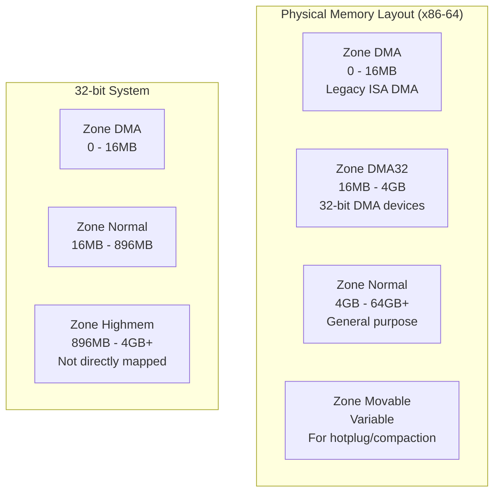
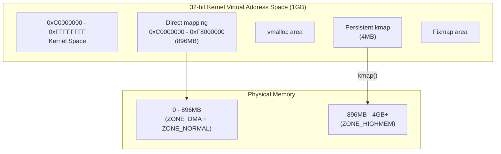
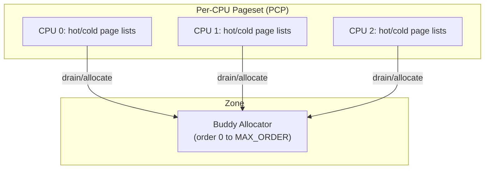
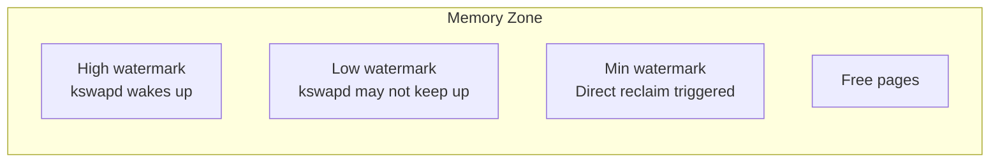
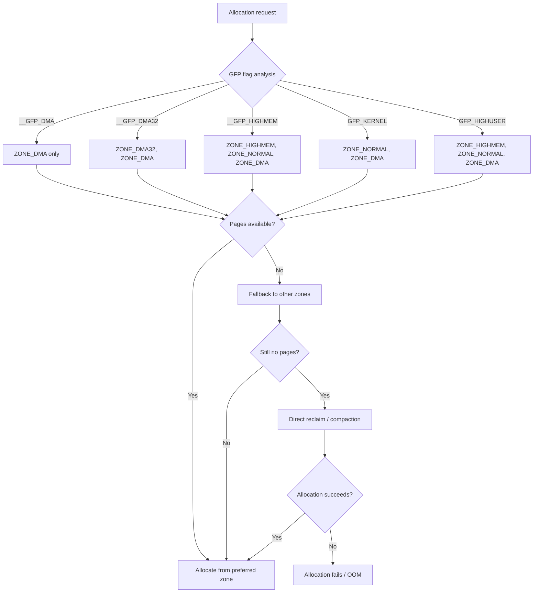
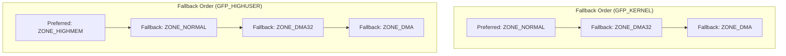

# Memory Zones

## Introduction

Memory zones are the kernel's way of categorizing physical memory into regions with different properties and constraints. The Linux kernel defines several zones — `ZONE_DMA`, `ZONE_DMA32`, `ZONE_NORMAL`, `ZONE_HIGHMEM`, and `ZONE_MOVABLE` — each representing a range of physical addresses with specific characteristics. The buddy allocator, page cache, and slab allocator all operate within these zones.

The zone system exists primarily because not all physical memory is equal. Some devices can only DMA to low addresses. 32-bit systems can't directly address all physical memory. And some allocations need movable pages for compaction. Zones ensure that allocations are satisfied from appropriate memory regions.

## Zone Types

### Overview



### ZONE_DMA

```c
/* Zone DMA: 0 to 16MB on x86 */
/* Some ISA devices can only access the first 16MB of physical memory */

/* Typical use: old ISA network cards, sound cards, floppy controllers */
struct page *page = alloc_pages(GFP_DMA, order);

/* Modern systems rarely need ZONE_DMA */
/* Most PCI devices support 32-bit DMA (ZONE_DMA32) */
```

**Why 16MB?** The original IBM PC AT (1984) had a 24-bit address bus on the ISA bus, limiting DMA to the first 16MB. Modern PCI/PCIe devices typically support 32-bit or 64-bit DMA, but the zone persists for legacy compatibility.

### ZONE_DMA32

```c
/* Zone DMA32: 0 to 4GB on x86-64 */
/* 32-bit DMA devices can access this zone */
/* Most modern devices use this zone */

struct page *page = alloc_pages(GFP_DMA32, order);
```

**Why 4GB?** 32-bit PCI devices can only address memory below 4GB. This zone exists only on 64-bit systems (on 32-bit, ZONE_NORMAL covers this range).

### ZONE_NORMAL

```c
/* Zone Normal: directly mapped kernel memory */
/* On x86-64: typically 4GB to end of physical memory */
/* This is where most allocations come from */

struct page *page = alloc_pages(GFP_KERNEL, order);  /* Usually from ZONE_NORMAL */
```

ZONE_NORMAL is the workhorse zone — most kernel allocations, page cache entries, and user pages come from here. The kernel maintains a direct mapping (`page_offset_base` to `page_offset_base + memory_size`) where every physical page in ZONE_NORMAL has a fixed virtual address.

### ZONE_HIGHMEM (32-bit only)

```c
/* Zone Highmem: above 896MB on 32-bit x86 */
/* Cannot be permanently mapped in kernel address space */
/* 32-bit kernels have ~1GB of kernel virtual address space */
/* Only 896MB can be directly mapped */

/* Pages in HIGHMEM must be kmap()'d before use */
void *vaddr = kmap(highmem_page);
memcpy(vaddr, data, PAGE_SIZE);
kunmap(highmem_page);

/* 64-bit kernels don't have HIGHMEM — all memory is directly mapped */
```



### ZONE_MOVABLE

```c
/* Zone Movable: pages that can be migrated/compacted */
/* Used for memory hotplug and anti-fragmentation */
/* Not all pages in this zone are movable, but the zone is
   created with the expectation that pages can be moved */

/* Set up via kernel command line or sysfs */
/* kernelcore=1G movablecore=2G */
```

ZONE_MOVABLE was introduced to improve memory hotplug support and reduce fragmentation. Pages in this zone are expected to be movable (user pages, page cache), allowing the kernel to migrate them for compaction or hot-remove.

## Zone Structure

```c
/* Simplified from include/linux/mmzone.h */
struct zone {
    unsigned long _watermark[NR_WMARK];  /* Watermark levels */
    long lowmem_reserve[MAX_NR_ZONES];   /* Reserve for higher zones */

    struct pglist_data *zone_pgdat;      /* Back-pointer to node */
    struct per_cpu_pages __percpu *per_cpu_pageset;  /* Per-cpu page caches */

    unsigned long zone_start_pfn;        /* First page frame in zone */
    atomic_long_t managed_pages;         /* Pages managed by buddy */
    unsigned long spanned_pages;         /* Total pages (including holes) */
    unsigned long present_pages;         /* Physical pages present */

    const char *name;                    /* "DMA", "Normal", etc. */

    /* Free area: buddy allocator lists */
    struct free_area free_area[NR_PAGE_ORDERS];

    unsigned long flags;                 /* Zone flags */
    spinlock_t lock;                     /* Protects the zone */

    /* Statistics */
    unsigned long nr_saved_writeback;    /* Writeback pages */
    unsigned long nr_unaccepted;         /* Unaccepted pages */
};
```

### Per-CPU Page Cache (PCP)



The per-cpu page cache (PCP) caches small (order-0) allocations per CPU to avoid contending on the zone lock:

```c
struct per_cpu_pages {
    int count;          /* Number of pages in list */
    int high;           /* High watermark for draining */
    struct list_head lists[MIGRATE_TYPES]; /* Per-migrate-type lists */
};
```

## Watermarks

### Three Watermark Levels



| Watermark | Behavior |
|-----------|----------|
| **High** | `kswapd` goes back to sleep (enough free memory) |
| **Low** | `kswapd` wakes up to reclaim pages |
| **Min** | Allocations block and do direct reclaim |

### Watermark Calculation

```bash
# View current watermarks
$ cat /proc/zoneinfo | grep -A 5 "Node 0, zone   Normal"
Node 0, zone   Normal
  pages free     234567
        boost    0
        min      4096
        low      5120
        high     6144
        spanned  8388608
        present  8388608
        managed  8123456

# Watermarks are in pages (4KB each)
# min = 16MB, low = 20MB, high = 24MB (for this zone)

# Tune watermarks
$ sysctl vm.watermark_boost_factor
vm.watermark_boost_factor = 15000

$ sysctl vm.watermark_scale_factor
vm.watermark_scale_factor = 10

# watermark_min = min_free_kbytes / zone_size * zone_managed_pages
$ sysctl vm.min_free_kbytes
vm.min_free_kbytes = 67584
```

## GFP Flags and Zone Selection

### GFP (Get Free Pages) Flags

```c
/* Zone modifiers */
#define __GFP_DMA       0x01u   /* Allocate from ZONE_DMA */
#define __GFP_HIGHMEM   0x02u   /* Allocate from ZONE_HIGHMEM */
#define __GFP_DMA32     0x04u   /* Allocate from ZONE_DMA32 */
#define __GFP_MOVABLE   0x08u   /* Allocate from ZONE_MOVABLE */

/* Action modifiers */
#define __GFP_RECLAIM   0x400000u  /* Can trigger reclaim */
#define __GFP_NORETRY   0x0400000u /* Don't retry on failure */
#define __GFP_NOFAIL    0x0800000u /* Never fail (retry forever) */

/* Common combinations */
#define GFP_KERNEL      (__GFP_RECLAIM | __GFP_IO | __GFP_FS)
#define GFP_ATOMIC      (__GFP_HIGH)
#define GFP_USER        (__GFP_RECLAIM | __GFP_IO | __GFP_FS | __GFP_HARDWALL)
#define GFP_DMA         (__GFP_DMA)
#define GFP_DMA32       (__GFP_DMA32)
#define GFP_HIGHUSER    (__GFP_RECLAIM | __GFP_IO | __GFP_FS | __GFP_HARDWALL | __GFP_HIGHMEM)
```

### Zone Selection Flow



## /proc/zoneinfo

```bash
$ cat /proc/zoneinfo
Node 0, zone      DMA
  pages free     3968
        boost    0
        min      16
        low      20
        high     24
        spanned  4096
        present  3975
        managed  3968
        protection: (0, 2045, 3852, 3852, 3852)
  nr_free_pages 3968
  nr_zone_active_anon 0
  nr_zone_inactive_anon 0
  nr_zone_active_file 0
  nr_zone_inactive_file 0
  # ... many more counters ...

Node 0, zone    DMA32
  pages free     234567
        boost    0
        min      8192
        low      10240
        high     12288
        spanned  1048576
        present  524288
        managed  520000
        protection: (0, 0, 1804, 1804, 1804)

Node 0, zone   Normal
  pages free     1234567
        boost    0
        min      32768
        low      40960
        high     49152
        spanned  8388608
        present  8388608
        managed  8123456
        protection: (0, 0, 0, 0, 0)
```

### Key Fields

| Field | Meaning |
|-------|---------|
| `free` | Current free pages |
| `min/low/high` | Watermark levels |
| `spanned` | Total pages (including holes in physical address space) |
| `present` | Physical pages actually present |
| `managed` | Pages managed by the buddy allocator |
| `protection` | Lowmem reserve from other zones |

## Zone Allocation Fallback

When a zone can't satisfy an allocation, the kernel falls back to other zones:



The fallback order is defined by the `zonelist` structure, which is built at boot time based on the system's NUMA topology and zone layout.

## Implementation Details

### Key Source Files

- **`mm/page_alloc.c`** — Buddy allocator and zone management (~8000 lines)
- **`include/linux/mmzone.h`** — Zone and zone-related structures
- **`mm/vmstat.c`** — Zone statistics (`/proc/zoneinfo`)
- **`mm/page-writeback.c`** — Writeback watermarks

### Zone Initialization

```c
/* Simplified zone initialization */
static void __meminit zone_init_free_lists(struct zone *zone) {
    unsigned int order, t;

    for_each_migratetype_order(order, t) {
        INIT_LIST_HEAD(&zone->free_area[order].free_list[t]);
        zone->free_area[order].nr_free = 0;
    }
}

/* Boot-time zone setup */
void __meminit free_area_init_node(int nid, unsigned long *zones_size,
                                    unsigned long node_start_pfn,
                                    unsigned long *zholes_size) {
    pg_data_t *NODE_DATA(nid) = ...;
    /* Initialize each zone in this NUMA node */
    for (i = 0; i < MAX_NR_ZONES; i++) {
        struct zone *zone = NODE_DATA(nid)->node_zones + i;
        zone->name = zone_names[i];
        zone_init_free_lists(zone);
    }
}
```

### Buddy Allocator

```c
/* Buddy allocator: power-of-2 page allocation */
struct free_area {
    struct list_head free_list[MIGRATE_TYPES];
    unsigned long nr_free;
};

/* Allocate 2^order pages from a zone */
struct page *__alloc_pages(gfp_t gfp, unsigned int order, int preferred_nid,
                           nodemask_t *nodemask) {
    struct page *page;
    struct zonelist *zonelist;
    struct zone *zone;

    /* Try each zone in the zonelist */
    for_each_zone_zonelist_nodemask(zone, zonelist, preferred_nid, nodemask) {
        /* Try the buddy allocator */
        page = __alloc_pages_slow(gfp, order, zone);
        if (page)
            return page;
    }
    return NULL;  /* All zones exhausted */
}
```

## References

- [Linux kernel mm/mmzone.h](https://github.com/torvalds/linux/blob/master/include/linux/mmzone.h)
- [Linux kernel mm/page_alloc.c](https://github.com/torvalds/linux/blob/master/mm/page_alloc.c)
- [Kernel documentation: Memory Management](https://www.kernel.org/doc/html/latest/admin-guide/mm/index.html)

## Further Reading

- https://www.kernel.org/doc/html/latest/admin-guide/sysctl/vm.html
- https://man7.org/linux/man-pages/man5/proc.5.html — /proc/zoneinfo
- https://lwn.net/Articles/712460/ — "Folios and the page cache"
- https://www.kernel.org/doc/html/latest/mm/page_alloc.html
- https://lwn.net/Articles/152347/ — "The zone allocator"

## Related Topics

- [numa](./numa.md) — NUMA nodes contain zones
- [compaction](./compaction.md) — Compaction operates within zones
- [buffer-cache](./buffer-cache.md) — Page cache uses zone-based allocation
- [aslr](./aslr.md) — ASLR interacts with zone-based allocation
