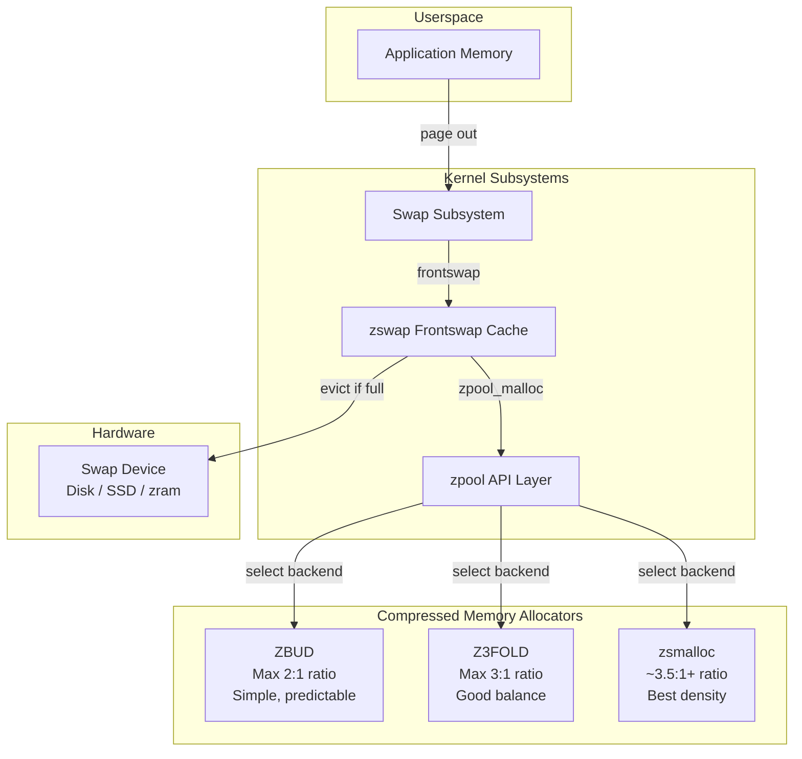
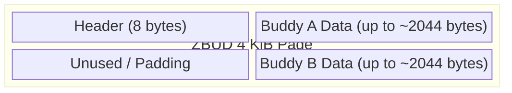
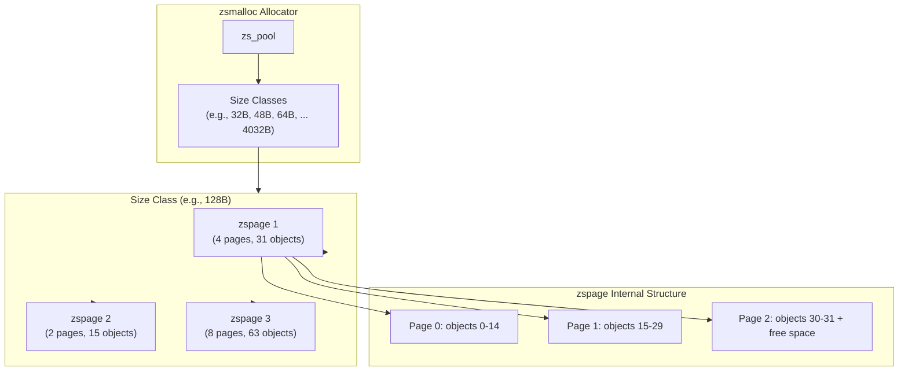
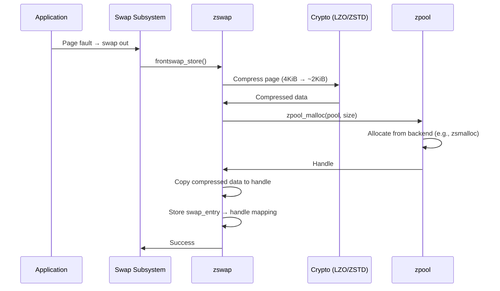
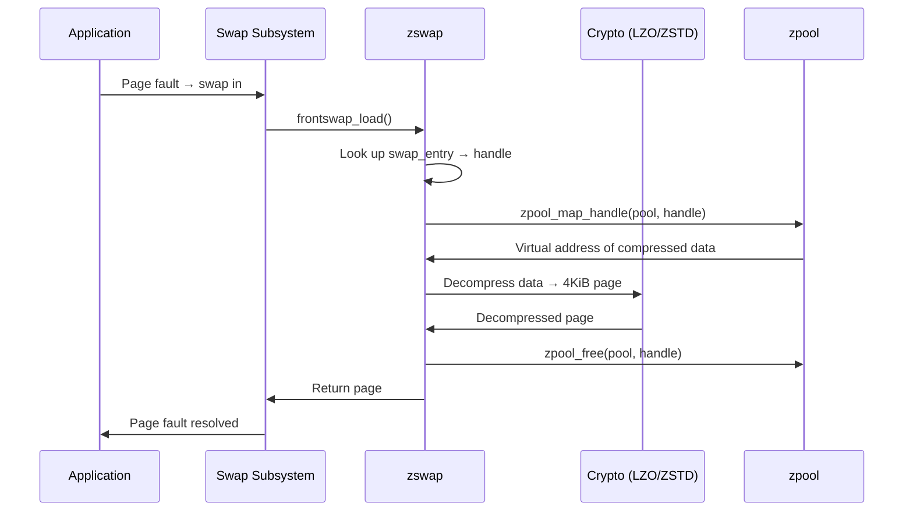

# zpool: Compressed Memory Pool

## Overview

zpool is a compressed memory pool abstraction in the Linux kernel that provides a common interface for storing compressed pages in memory. It serves as the backend storage mechanism for **zswap**, the compressed swap cache. zpool itself is not a swap device—it is a generic compressed page allocator that can use different compression-oriented allocators.

The zpool API was introduced to unify and abstract the storage layer that zswap (and potentially other subsystems) uses to hold compressed data in RAM, avoiding duplication of allocator logic across different compressed memory backends.

> **Introduced:** Linux 3.11 (commit `c890572`)  
> **Maintainer:** Seth Jennings, Dan Streetman  
> **Source:** `mm/zpool.c`

---

## Architecture



zpool sits between consumers like zswap and the low-level allocators. A consumer creates a zpool with a specified type, then uses `zpool_malloc()` / `zpool_free()` to store and retrieve compressed pages. The actual memory layout and compaction strategy are delegated entirely to the chosen allocator.

---

## Allocators

### ZBUD

ZBUD stores up to **two compressed pages** in a single 4 KiB "bud" page. It is the simplest allocator:

- Each buddy page holds exactly 0, 1, or 2 compressed objects.
- If two objects are stored and one is freed, the remaining object can be relocated by the buddy allocator, enabling memory reclaim.
- Maximum compression ratio is capped at 2:1 (two objects per page).
- Uses the buddy allocator for page-level allocation.

ZBUD was the original zpool allocator. Its simplicity makes it predictable, but the 2:1 ratio ceiling limits storage density.

#### ZBUD Internal Layout



Each ZBUD page has a compact header tracking which slots are occupied and the size of each compressed object. Objects are placed at opposite ends of the page and grow inward.

#### ZBUD Source Code

```c
/* mm/zbud.c */
struct zbud_header {
    struct list_head lru;        /* LRU list linkage */
    struct list_head buddy;      /* Buddy list linkage */
    unsigned int first_chunks;   /* Size of first buddy */
    unsigned int last_chunks;    /* Size of second buddy */
    unsigned int under_reclaim;  /* Being reclaimed? */
};

/* Allocate a zbud page, store compressed data */
void *zbud_alloc(struct zbud_pool *pool, size_t size, gfp_t gfp);

/* Free a zbud handle */
void zbud_free(struct zbud_pool *pool, void *handle);

/* Map handle to access data */
void *zbud_map(struct zbud_pool *pool, void *handle);

/* Unmap handle */
void zbud_unmap(struct zbud_pool *pool, void *handle);
```

#### ZBUD Reclaim

ZBUD supports reclaim through relocation. When one buddy is freed and the other is still in use, the remaining object can be relocated to a different zbud page, allowing the now-empty page to be returned to the buddy allocator. This is handled by `zbud_reclaim_page()`:

```c
/* mm/zbud.c */
int zbud_reclaim_page(struct zbud_pool *pool, unsigned int retries);
```

The reclaim path:
1. Scan the LRU list for zbud pages with one free slot.
2. Lock the page and relocate the remaining object.
3. Free the now-empty page back to the buddy allocator.

---

### Z3FOLD

Z3FOLD stores up to **three compressed pages** per buddy page:

- Uses a more sophisticated header to track three slots of variable size within each 4 KiB page.
- Allows up to 3:1 compression ratio, improving density over ZBUD.
- Supports compactible pages: when a slot is freed, the remaining entries can be rearranged to reduce fragmentation.
- Requires a lock per page for slot manipulation.
- Uses a workqueue for background compaction.

Z3FOLD was added as an improvement over ZBUD for zswap workloads where higher density matters.

> **Introduced:** Linux 4.9 (commit `d146003`)  
> **Source:** `mm/z3fold.c`

#### Z3FOLD Internal Layout


Each Z3FOLD page has a header tracking three slots. Slots are allocated from the ends of the page and can be compacted in-place when neighbors are freed.

#### Z3FOLD Data Structures

```c
/* mm/z3fold.c */
struct z3fold_header {
    spinlock_t page_lock;
    struct list_head buddy;       /* Buddy list linkage */
    struct list_head lru;         /* LRU list linkage */
    unsigned long first_chunks;   /* First slot size (in chunks) */
    unsigned long middle_chunks;  /* Middle slot size */
    unsigned long last_chunks;    /* Last slot size */
    unsigned short start_middle;  /* Start offset of middle chunk */
    unsigned short first_num:2;   /* Buddy number for first chunk */
    unsigned short mapped:2;      /* Mapped buddy number */
    unsigned short foreign:1;     /* From another z3fold pool */
    unsigned short cpu:8;         /* CPU that allocated this page */
};
```

#### Z3FOLD Compaction

Z3FOLD performs in-page compaction: when a slot is freed, the remaining objects are shifted to consolidate free space. A workqueue (`z3fold_compact_wq`) periodically scans for reclaimable pages:

```bash
# Check Z3FOLD workqueue activity
cat /sys/kernel/debug/workqueue/z3fold_compact/state
```

#### Z3FOLD Shrinker

Z3FOLD registers as a shrinker to respond to memory pressure:

```c
/* mm/z3fold.c */
static struct shrinker z3fold_shrinker = {
    .count_objects = z3fold_shrink_count,
    .scan_objects = z3fold_shrink_scan,
    .seeks = DEFAULT_SEEKS,
};
```

When the kernel's reclaim path calls the shrinker, Z3FOLD evicts the least-recently-used pages and relocates their contents.

---

### zsmalloc

zsmalloc is a general-purpose compressed page allocator not originally designed for zpool, but later integrated:

- Groups objects of similar size into **size classes**, each backed by contiguous pages (called "zspages").
- Achieves very high density when many small compressed pages of similar size exist.
- Objects can span multiple physical pages within a zspage, so individual object freeing requires a mapping table.
- Compaction support allows defragmentation of zspages.
- Uses per-class spinlocks for concurrency.

zsmalloc is generally the best choice for zswap when density is the priority, though it has higher per-operation overhead than ZBUD or Z3FOLD.

> **Introduced:** Linux 3.15 (commit `33c2d3`)  
> **Source:** `mm/zsmalloc.c`

#### zsmalloc Architecture



#### zsmalloc Size Classes

zsmalloc organizes allocations into size classes. Each class handles objects of a specific size range. The classes are defined at pool creation time:

```c
/* mm/zsmalloc.c */
struct zs_pool {
    const char *name;
    struct size_class *size_class[ZS_SIZE_CLASSES];  /* Array of size classes */
    struct zs_compact_notifier *notifier;             /* Compaction callback */
    struct kref refcount;                              /* Reference counting */
    /* ... */
};

struct size_class {
    int size;                    /* Object size for this class */
    int objs_per_zspage;        /* Objects per zspage */
    int pages_per_zspage;       /* Pages per zspage */
    spinlock_t lock;             /* Per-class lock */
    struct list_head fullness_list[NR_FULLNESS_GROUP]; /* Fullness groups */
    /* ... */
};
```

Each size class maintains four **fullness groups**:
- `ZS_ALMOST_EMPTY` — less than 1/4 of objects allocated
- `ZS_ALMOST_FULL` — more than 3/4 of objects allocated
- `ZS_EMPTY` — no objects allocated (can be freed)
- `ZS_FULL` — all objects allocated (cannot compact)

#### zsmalloc Object Mapping

Objects in zsmalloc are identified by **handles** rather than direct pointers. A handle encodes the zspage and the object's position within it:

```c
/* Map a handle to a virtual address (may need kmap_atomic) */
void *zs_map_object(struct zs_pool *pool, unsigned long handle,
                    enum zs_mapmode mapmode);

/* Unmap a previously mapped handle */
void zs_unmap_object(struct zs_pool *pool, unsigned long handle);
```

For objects that span multiple pages, `zs_map_object()` uses `kmap_atomic()` to create a temporary virtual mapping. This is why zsmalloc has higher per-operation overhead than ZBUD or Z3FOLD.

#### zsmalloc Compaction

zsmalloc supports full zspage compaction:

```c
/* Compact the pool — move objects from sparsely-used zspages */
unsigned long zs_compact(struct zs_pool *pool);
```

The compaction algorithm:
1. Scan fullness groups for partially-empty zspages.
2. For each partially-empty zspage, find a destination zspage with free space.
3. Move objects from source to destination using `memcpy()`.
4. If source zspage becomes empty, free its pages back to the page allocator.

```bash
# Trigger zsmalloc compaction (via zswap shrinker)
# This happens automatically under memory pressure

# Check zsmalloc pool statistics (if debugfs available)
cat /sys/kernel/debug/zsmalloc/zswap/pool_name
```

#### zsmalloc Class-Based Sizing

| Object Size | Pages per zspage | Objects per zspage | Utilization |
|-------------|------------------|--------------------|----|
| 32 B | 1 | 128 | High |
| 64 B | 1 | 64 | High |
| 128 B | 1 | 31 | Good |
| 256 B | 1 | 16 | Good |
| 512 B | 2 | 15 | Moderate |
| 1024 B | 4 | 15 | Moderate |
| 2048 B | 8 | 15 | Lower |
| 4032 B | 16 | 15 | Lower |

The sizing ensures that objects are packed efficiently into zspages without excessive internal fragmentation.

---

## zpool API

The zpool API is defined in `<linux/zpool.h>`:

```c
/* Create a zpool of the given type (e.g., "z3fold", "zbud", "zsmalloc") */
struct zpool *zpool_create_pool(const char *type, const char *name,
                                gfp_t gfp);

/* Allocate compressed storage, returns a handle */
void *zpool_malloc(struct zpool *pool, size_t size, gfp_t gfp);

/* Free a previously allocated handle */
void zpool_free(struct zpool *pool, void *handle);

/* Map a handle to access its data */
void *zpool_map_handle(struct zpool *pool, void *handle,
                       enum zpool_mapmode mapmode);

/* Unmap a handle */
void zpool_unmap_handle(struct zpool *pool, void *handle);

/* Total size in bytes */
u64 zpool_get_total_size(struct zpool *pool);

/* Register a new allocator type */
int zpool_register_driver(const char *type, struct zpool_driver *driver);

/* Unregister an allocator type */
void zpool_unregister_driver(struct zpool_driver *driver);

/* Get list of available allocator types */
const char *zpool_get_type(void *pool);

/* Iterate over registered types */
bool zpool_has_pool(char *type);
```

### Handle Model

zpool uses a **handle-based** interface rather than raw pointers. The consumer receives an opaque `void *handle` from `zpool_malloc()`. To access the underlying memory, the consumer calls `zpool_map_handle()` which returns a virtual address. This indirection allows allocators like zsmalloc to store objects in memory that is not permanently mapped.

The `zpool_mapmode` enum controls mapping permissions:

- `ZPOOL_MM_RW` — read/write access
- `ZPOOL_MM_RO` — read-only access
- `ZPOOL_MM_WO` — write-only access

### zpool_driver Interface

Each allocator registers as a `zpool_driver`:

```c
struct zpool_driver {
    char *type;                      /* Allocator name (e.g., "z3fold") */
    struct module *owner;            /* Owning module */
    atomic_t refcount;               /* Reference count */

    /* Core operations */
    void *(*malloc)(struct zpool *pool, size_t size, gfp_t gfp);
    void (*free)(struct zpool *pool, void *handle);
    void *(*map)(struct zpool *pool, void *handle,
                 enum zpool_mapmode mode);
    void (*unmap)(struct zpool *pool, void *handle);
    u64 (*total_size)(struct zpool *pool);

    /* Optional operations */
    void (*sleep_mapped)(struct zpool *pool, void *handle);
    void (*wake_mapped)(struct zpool *pool, void *handle);
    bool (*shrink)(struct zpool *pool, unsigned int pages);
};
```

### Registration Example

```c
/* mm/z3fold.c */
static struct zpool_driver z3fold_driver = {
    .type =     "z3fold",
    .malloc =   z3fold_alloc,
    .free =     z3fold_free,
    .map =      z3fold_map,
    .unmap =    z3fold_unmap,
    .total_size = z3fold_get_pool_size,
};

static int __init init_z3fold(void)
{
    zpool_register_driver(&z3fold_driver);
    return 0;
}
```

When a consumer calls `zpool_create_pool("z3fold", ...)`, zpool looks up the registered driver and delegates all operations.

---

## Relationship with zswap

zswap is the primary consumer of zpool. When a page is swapped out:



When the page is swapped in:



If zpool allocation fails (memory pressure), zswap can evict compressed pages to the actual swap device:

```c
/* mm/zswap.c — eviction path */
static int zswap_writeback_entry(struct zpool *pool, void *handle)
{
    /* Decompress and write to actual swap device */
    /* Then free the zpool handle */
    zpool_free(pool, handle);
    return 0;
}
```

---

## zpool Internal Data Structures

### struct zpool

```c
/* mm/zpool.c */
struct zpool {
    char *type;                /* Allocator type name */
    struct zpool_driver *driver; /* Allocator driver */
    void *pool;                /* Allocator-specific pool handle */
    struct list_head list;     /* Global zpool list linkage */
    atomic_t refcount;         /* Reference count */
    bool evictable;            /* Can pages be evicted? */
};
```

### Global zpool List

All zpool instances are tracked in a global list protected by a spinlock:

```c
/* mm/zpool.c */
static LIST_HEAD(zpools);
static DEFINE_SPINLOCK(zpools_lock);
```

This allows the kernel to enumerate all zpool instances for debugging and statistics.

---

## Configuration

### Boot-time

```bash
# Select the zpool allocator for zswap
zpool=z3fold

# Or via zswap parameter
zswap.zpool=smalloc
```

### Runtime (via sysfs)

```bash
# Check current zswap pool type
cat /sys/module/zswap/parameters/zpool
# Output: zsmalloc (or z3fold, zbud)

# Enable/disable zswap
echo 1 > /sys/module/zswap/parameters/enabled

# Set maximum pool size (percentage of total memory)
echo 20 > /sys/module/zswap/parameters/max_pool_percent

# Set compression algorithm
echo zstd > /sys/module/zswap/parameters/compressor

# Check if zswap is using the same pool as zram
cat /sys/module/zswap/parameters/zpool
```

### Allocator Module Parameters

Each allocator has its own module parameters:

```bash
# Z3FOLD — no special parameters; uses default buddy allocator pages

# zsmalloc — page order for zspages is auto-tuned, but can be influenced
# via CONFIG_ZSMALLOC_STAT for statistics collection
```

---

## Allocator Selection Guide

| Criterion | ZBUD | Z3FOLD | zsmalloc |
|-----------|------|--------|----------|
| Max ratio | 2:1 | 3:1 | ~3.5:1+ |
| Complexity | Low | Medium | High |
| Compaction | Yes (relocation) | Yes (in-page) | Yes (zspage) |
| Per-page lock | No | Yes | No (per-class) |
| Handle mapping | Always mapped | Always mapped | Needs kmap_atomic |
| Reclaim speed | Fast | Moderate | Slower |
| NUMA awareness | Minimal | Minimal | Per-node pools |
| Best for | Predictability | Balance | Density |
| Kernel default | No | No | Yes (since 5.x) |

### Recommendations

- **Production systems**: Use **zsmalloc** (default). Best compression density.
- **Low-latency systems**: Consider **Z3FOLD**. More predictable per-operation cost.
- **Debugging/testing**: **ZBUD** is simplest to reason about.
- **Container hosts**: zsmalloc with `max_pool_percent` tuned for workload.

---

## Implementation Details

### Compaction and Reclaim

All three allocators support compaction to varying degrees:

- **ZBUD**: If a buddy page has one freed slot, the remaining object can be relocated, and the page returned to the buddy allocator. Uses `zbud_reclaim_page()`.
- **Z3FOLD**: Supports in-page compaction — when a slot is freed, remaining objects are shifted to consolidate free space. A workqueue (`z3fold_compact`) periodically scans for reclaimable pages. Also registers as a shrinker.
- **zsmalloc**: Supports full zspage compaction where objects are migrated from partially-empty zspages to consolidate them, freeing entire zspages. Uses `zs_compact()`.

### Memory Accounting

zpool does not independently account for memory. The consumer (zswap) is responsible for tracking how much memory is used. `zpool_get_total_size()` reports the raw allocation size of the pool, which includes internal fragmentation.

```bash
# Check zswap's memory usage
grep -i zswap /proc/meminfo
# SwapCached:         12345 kB  (includes zswap)
```

### Locking

Each allocator has different locking characteristics:

- **ZBUD**: Uses the buddy allocator's lock. Minimal additional locking.
- **Z3FOLD**: Per-page spinlock for slot manipulation. Can contend under heavy concurrent access.
- **zsmalloc**: Per-size-class spinlock. Better concurrency than per-page locks for workloads with many similarly-sized objects.

### NUMA Awareness

```c
/* zsmalloc supports per-node pools */
struct zs_pool *zs_create_pool(const char *name, int node);
```

zsmalloc can be configured to allocate from a specific NUMA node, reducing cross-node memory access. ZBUD and Z3FOLD rely on the buddy allocator's NUMA policies.

---

## Debugging

### /sys/kernel/debug/zpool/

If debugfs is mounted, each zpool instance exposes:

```bash
# List pools and their statistics
cat /sys/kernel/debug/zpool/zswap/pool_name
cat /sys/kernel/debug/zpool/zswap/total_size
cat /sys/kernel/debug/zpool/zswap/mem_limit

# For zsmalloc, per-size-class stats are available
cat /sys/kernel/debug/zsmalloc/<pool_name>/classes
```

### Kernel Messages

```bash
# Check which allocator is in use
dmesg | grep zpool

# Check zswap status
dmesg | grep zswap
# [    0.000000] zswap: loaded using pool zsmalloc/zbud
```

### vmstat Counters

```bash
# zswap activity shows through swap counters
grep -i zswap /proc/vmstat
# zswpout_pages 12345
# zswpin_pages 6789
# zswpwb_count 0
# zswpwb_fail_count 0

# For detailed allocator stats
grep -i "zswap\|zpool\|zsmalloc" /proc/vmstat
```

### Memory Usage Monitoring

```bash
# Check compressed pool size
cat /sys/kernel/debug/zpool/zswap/total_size

# Compare with raw swap usage
grep SwapTotal /proc/meminfo
grep SwapFree /proc/meminfo

# Compression ratio = (pages stored * PAGE_SIZE) / pool_size
```

### Common Issues

| Issue | Symptom | Debug |
|-------|---------|-------|
| Pool fragmentation | `total_size` grows but `stored_pages` doesn't | Check allocator compaction stats |
| High lock contention | Latency spikes in zswap path | Trace with `perf lock` |
| OOM despite zswap | zswap full, eviction failing | Check `zswpwb_fail_count` |
| Wrong allocator | Poor compression ratio | Verify `cat /sys/module/zswap/parameters/zpool` |

---

## Performance Considerations

### Compression Ratio vs. Speed

- **zsmalloc** has the best ratio but higher per-operation cost (potential `kmap_atomic` for multi-page objects).
- **Z3FOLD** is a good middle ground — reasonable density with predictable per-operation cost.
- **ZBUD** is fastest but wastes space (2:1 maximum).

### Fragmentation

All allocators suffer from fragmentation under mixed allocation/free patterns:

- **ZBUD**: Fragmentation is bounded (worst case: 50% utilization with 1 buddy per page).
- **Z3FOLD**: In-page compaction helps but workqueue overhead adds latency.
- **zsmalloc**: Full compaction can be expensive but achieves near-optimal utilization.

### Locking Contention

- **Z3FOLD** per-page locks can become a bottleneck under high concurrent swap activity.
- **zsmalloc** per-class locks distribute contention across multiple size classes.
- For NUMA systems, per-node zsmalloc pools reduce cross-node lock contention.

### Workload Patterns

| Workload | Best Allocator | Reason |
|----------|---------------|--------|
| Database (many similar-sized pages) | zsmalloc | High density, good compaction |
| Web server (mixed sizes) | z3fold | Balanced density and latency |
| Real-time (predictable latency) | zbud | Simple, no compaction stalls |
| Container host (memory pressure) | zsmalloc | Best density under pressure |

---

## Relationship with zram

zram is a compressed **block device** that uses zpool-like mechanisms internally. While zpool is used by zswap (which sits in front of the swap subsystem), zram creates a virtual block device that can be formatted with a filesystem or used as swap:

| Aspect | zswap + zpool | zram |
|--------|--------------|------|
| Interface | Frontswap hook | Block device |
| Swap backing | Needs real swap device | Self-sufficient |
| Compression | In-kernel via zpool | In-kernel via zcomp |
| Allocator | zpool (zsmalloc/z3fold/zbud) | zsmalloc (built-in) |
| Eviction | To real swap device | To backing device (optional) |

> **See also:** [zram](../drivers/zram.md) — compressed RAM-based block device

---

## Source Files

| File | Contents |
|------|----------|
| `mm/zpool.c` | zpool API implementation |
| `include/linux/zpool.h` | zpool API header |
| `mm/zbud.c` | ZBUD allocator |
| `mm/z3fold.c` | Z3FOLD allocator |
| `mm/zsmalloc.c` | zsmalloc allocator |
| `include/linux/zsmalloc.h` | zsmalloc API header |
| `mm/zswap.c` | Primary zpool consumer |

---

## Further Reading

- **Documentation/mm/zpool.rst** — kernel documentation for the zpool API
- **Documentation/mm/zswap.rst** — zswap documentation covering zpool integration
- **Documentation/mm/zsmalloc.rst** — zsmalloc internals and design
- **LWN: [A compressed memory allocator](https://lwn.net/Articles/546009/)** — zbud/zsmalloc design
- **LWN: [z3fold](https://lwn.net/Articles/636218/)** — Z3FOLD introduction
- **zswap design document** — `Documentation/vm/zswap.txt` (older kernels)
- **commit c890572** — zpool API introduction
- **commit d146003** — Z3FOLD introduction

---

## See Also

- [zswap](./zswap.md) — compressed swap cache (primary zpool consumer)
- [zram](../drivers/zram.md) — compressed RAM-based block device
- [Swap](./swap.md) — Linux swap subsystem
- [Memory Management](./index.md) — overview of Linux MM
- [GUP](./gup.md) — get_user_pages (DMA pinning)
- [Memory Compaction](./compaction.md) — compaction and zpool interaction
- [Page Types](./page-types.md) — page classification
