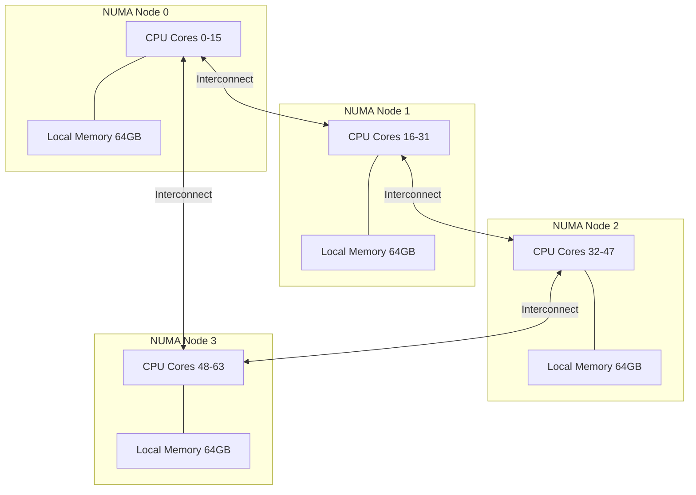

# NUMA (Non-Uniform Memory Access)

## Introduction

NUMA (Non-Uniform Memory Access) is a memory architecture used in multiprocessor systems where each processor has its own local memory, and access to remote memory (attached to another processor) is slower than access to local memory. This creates a non-uniform memory access pattern that the operating system must understand and optimize for.

Modern multi-socket servers are NUMA systems. Each socket has its own memory controllers and directly attached DIMMs. Accessing memory on the same socket is fast (local access), while accessing memory on another socket requires traversing the interconnect (QPI/UPI for Intel, Infinity Fabric for AMD), adding latency and reducing bandwidth.

Linux has extensive NUMA support, including NUMA-aware memory allocation, automatic page migration, and tools for diagnosing and optimizing NUMA performance.

## NUMA Architecture



### Access Latency


## NUMA Topology Discovery

### Viewing NUMA Information

```bash
# Show NUMA nodes
numactl --hardware
# available: 4 nodes (0-3)
# node 0 cpus: 0 1 2 3 4 5 6 7 8 9 10 11 12 13 14 15
# node 0 size: 65536 MB
# node 0 free: 32768 MB
# node 1 cpus: 16 17 18 19 20 21 22 23 24 25 26 27 28 29 30 31
# node 1 size: 65536 MB
# node 1 free: 30000 MB
# node 2 cpus: 32 33 34 35 36 37 38 39 40 41 42 43 44 45 46 47
# node 2 size: 65536 MB
# node 2 free: 28000 MB
# node 3 cpus: 48 49 50 51 52 53 54 55 56 57 58 59 60 61 62 63
# node 3 size: 65536 MB
# node 3 free: 25000 MB
#
# node distances:
# node   0   1   2   3
#   0:  10  21  31  21
#   1:  21  10  21  31
#   2:  31  21  10  21
#   3:  21  31  21  10

# Show NUMA CPU mapping
lscpu | grep -i numa
# NUMA node(s):        4
# NUMA node0 CPU(s):   0-15
# NUMA node1 CPU(s):   16-31
# NUMA node2 CPU(s):   32-47
# NUMA node3 CPU(s):   48-63

# View distance matrix
cat /sys/devices/system/node/node*/distance
# 10 21 31 21
# 21 10 21 31
# 31 21 10 21
# 21 31 21 10

# View memory per node
cat /sys/devices/system/node/node*/meminfo
# Node 0 MemTotal:       67108864 kB
# Node 0 MemFree:        33554432 kB
# Node 0 MemUsed:        33554432 kB

# View NUMA node state
cat /sys/devices/system/node/node*/online
# 0-3

# NUMA node details
ls /sys/devices/system/node/
# has_cpu  has_memory  node0  node1  node2  node3  online  possible
```

### ACPI SRAT (System Resource Affinity Table)

The NUMA topology is provided by the firmware via the ACPI SRAT table:

```bash
# View SRAT table
sudo acpidump -b
sudo acpixtract -a acpidump.dat
sudo iasl -d srat.dat

# Or via sysfs
ls /sys/firmware/acpi/tables/
# SRAT is listed if present

# SRAT contains:
# - CPU affinity: which CPUs belong to which NUMA node
# - Memory affinity: which memory ranges belong to which NUMA node
```

## NUMA Memory Allocation Policy

### Default Policy: Local Allocation

By default, Linux allocates memory from the NUMA node where the allocating process is currently running. This is called the "local" allocation policy.

```bash
# View default allocation policy
cat /proc/self/numa_maps
# 00400000 default file=/usr/bin/bash mapped=28 N0=28
# 7f1234000000 default anon=32 dirty=32 N0=32
```

### NUMA Allocation Policies

Linux supports several NUMA memory policies:

```c
#include <numaif.h>

/* Set memory policy for a range */
long set_mempolicy(int mode, const unsigned long *nodemask,
                    unsigned long maxnode);

/* Get current policy */
long get_mempolicy(int *mode, unsigned long *nodemask,
                    unsigned long maxnode, void *addr, unsigned long flags);

/* Policy modes */
#define MPOL_DEFAULT     0  /* Allocate on current node */
#define MPOL_PREFERRED   1  /* Prefer specified node */
#define MPOL_BIND        2  /* Allocate only on specified nodes */
#define MPOL_INTERLEAVE  3  /* Round-robin across specified nodes */
#define MPOL_LOCAL       4  /* Allocate on local node */
#define MPOL_WEIGHTED_INTERLEAVE 5  /* Weighted round-robin */
```

### Using libnuma

```c
#include <numa.h>
#include <numaif.h>
#include <stdio.h>
#include <stdlib.h>

int main(void)
{
    if (numa_available() < 0) {
        printf("NUMA not available\n");
        return 1;
    }
    
    /* Get NUMA topology */
    int max_node = numa_max_node();
    printf("Max NUMA node: %d\n", max_node);
    printf("Num nodes: %d\n", numa_num_configured_nodes());
    printf("Num CPUs: %d\n", numa_num_configured_cpus());
    
    /* Get memory info per node */
    long free_node0 = numa_node_size(0, NULL);
    printf("Node 0 free memory: %ld MB\n", free_node0 / (1024 * 1024));
    
    /* Allocate memory on specific node */
    void *ptr = numa_alloc_onnode(4096, 1);  /* 4 KiB on node 1 */
    if (ptr) {
        /* Use the memory */
        numa_free(ptr, 4096);
    }
    
    /* Allocate interleaved across all nodes */
    struct bitmask *all_nodes = numa_allocate_nodemask();
    numa_bitmask_setall(all_nodes);
    numa_set_interleave_mask(all_nodes);
    
    /* All subsequent allocations are interleaved */
    ptr = numa_alloc_interleaved(1024 * 1024);  /* 1 MiB */
    if (ptr) {
        /* Memory pages distributed across nodes */
        numa_free(ptr, 1024 * 1024);
    }
    
    /* Set preferred node for current thread */
    numa_set_preferred(0);  /* Prefer node 0 */
    
    /* Bind to specific nodes */
    struct bitmask *bind_mask = numa_allocate_nodemask();
    numa_bitmask_setbit(bind_mask, 0);
    numa_bitmask_setbit(bind_mask, 1);
    numa_bind(bind_mask);  /* Only run on nodes 0 and 1 */
    
    numa_free_nodemask(all_nodes);
    numa_free_nodemask(bind_mask);
    
    return 0;
}
```

### Compile and Run

```bash
gcc -o numa_example numa_example.c -lnuma
./numa_example
```

## The numactl Command

```bash
# Run program with NUMA policy
# Allocate on node 0
numactl --membind=0 ./myapp

# Prefer node 1, fallback to others
numactl --preferred=1 ./myapp

# Interleave across all nodes
numactl --interleave=all ./myapp

# Bind to specific CPUs and memory node
numactl --cpunodebind=0 --membind=0 ./myapp

# Bind to specific CPUs
numactl --physcpubind=0-7 ./myapp

# Run with multiple policies
numactl --interleave=0,1 --cpunodebind=0,1 ./myapp

# Show NUMA statistics for running process
numastat -p <pid>

# Show per-node memory statistics
numastat
# Per-node numastat
#                          Node 0       Node 1       Node 2       Node 3    Total
# ---------------  ------------  -----------  -----------  -----------  -------
# Numa_Hit            12345678     8765432      5678901      3456789   30246700
# Numa_Miss              12345       23456        34567        45678     116046
# Numa_Foreign           23456       12345        45678        34567     116046
# Interleave_hit          1234        2345         3456         4567      11602
# Local_Node          11000000      7800000      5000000      3000000   26800000
# Other_Node            1345678       965432       678901       456789    3446800
```

## NUMA Policy via Memory Maps

### /proc/PID/numa_maps

```bash
# View NUMA memory distribution for a process
cat /proc/self/numa_maps
# 00400000 default file=/usr/bin/cat mapped=4 N3=4
# 7f1234000000 default anon=128 dirty=128 N0=64 N1=64
# 7ffcb5a00000 default anon=32 dirty=32 N0=32

# Fields:
# - Address range
# - Policy (default, bind, interleave, etc.)
# - File/anon mapping
# - Page counts
# - Per-node distribution (N0=, N1=, etc.)

# For specific process
cat /proc/<pid>/numa_maps

# Detailed view with huge pages
cat /proc/<pid>/numa_maps | grep huge
# 7f0000000000 bind anon=256 dirty=256 N0=256 huge
```

### /proc/PID/smaps

```bash
# Detailed per-VMA NUMA info
cat /proc/<pid>/smaps | grep -A5 "Numa"
# Numa_Node: 0
# Numa_Hit: 64
# Numa_Miss: 0
# Numa_Foreign: 0
# Numa_Interleave: 0
# Numa_Local: 64
# Numa_Other: 0
```

## NUMA-Aware Kernel Internals

### Node Zonelists

The kernel maintains zonelists that define the fallback order for memory allocation:

```c
/* When allocating on node 0:
 * 1. Try node 0 DMA zone
 * 2. Try node 0 DMA32 zone
 * 3. Try node 0 Normal zone
 * 4. Try node 1 Normal zone (fallback)
 * 5. Try node 2 Normal zone (fallback)
 * 6. Try node 3 Normal zone (fallback)
 */

struct zonelist {
    struct zoneref _zonerefs[MAX_ZONES_PER_ZONELIST + 1];
};

struct zoneref {
    struct zone *zone;
    int zone_idx;
};
```

### NUMA Balancing (Automatic Page Migration)

Linux NUMA balancing automatically migrates pages to the node where they're most frequently accessed:

```c
/* NUMA balancing works by:
 * 1. Marking pages as PROT_NONE in page tables
 * 2. On access, a page fault occurs
 * 3. The fault handler notes which NUMA node accessed the page
 * 4. If access pattern suggests migration would help, migrate the page
 */

/* Enable/disable NUMA balancing */
/* /proc/sys/kernel/numa_balancing */
```

```bash
# Check NUMA balancing status
cat /proc/sys/kernel/numa_balancing
# 1  (enabled)

# Enable NUMA balancing
echo 1 > /proc/sys/kernel/numa_balancing

# Disable NUMA balancing
echo 0 > /proc/sys/kernel/numa_balancing

# NUMA balancing statistics
cat /proc/vmstat | grep numa
# numa_hit 12345678
# numa_miss 234567
# numa_foreign 234567
# numa_interleave 12345
# numa_local 11000000
# numa_other 1345678
# numa_pte_updates 567890
# numa_huge_pte_updates 12345
# numa_hint_faults 890123
# numa_hint_faults_local 789012
# numa_pages_migrated 101112

# NUMA balancing scan settings
cat /proc/sys/kernel/numa_balancing_scan_delay_ms
# 1000
cat /proc/sys/kernel/numa_balancing_scan_period_min_ms
# 1000
cat /proc/sys/kernel/numa_balancing_scan_period_max_ms
# 60000
cat /proc/sys/kernel/numa_balancing_scan_size_mb
# 256
```

## NUMA Statistics and Monitoring

```bash
# Per-node memory usage
cat /sys/devices/system/node/node*/meminfo

# NUMA hit/miss statistics
cat /proc/vmstat | grep numa
# numa_hit:        Allocations that succeeded on the preferred node
# numa_miss:       Allocations that had to use a different node
# numa_foreign:    Allocations from a node due to remote freeing
# numa_interleave: Interleaved allocations
# numa_local:      Allocations on the local node
# numa_other:      Allocations on a non-local, non-preferred node

# Calculate NUMA hit rate
awk '/^numa_hit/{hit=$2} /^numa_miss/{miss=$2} END{printf "NUMA hit rate: %.2f%%\n", hit/(hit+miss)*100}' /proc/vmstat

# Per-process NUMA stats
numastat -p $(pidof myapp)

# System-wide NUMA stats
numastat
```

## NUMA Optimization Techniques

### 1. Thread-to-Node Binding

```bash
# Bind process threads to specific NUMA nodes
numactl --cpunodebind=0 --membind=0 ./myapp

# Or in code
#include <sched.h>
cpu_set_t cpuset;
CPU_ZERO(&cpuset);
CPU_SET(0, &cpuset);   /* CPU 0 (on node 0) */
sched_setaffinity(0, sizeof(cpuset), &cpuset);
```

### 2. Memory Interleaving for Large Allocations

```bash
# Interleave memory across nodes (good for databases)
numactl --interleave=all ./database_server

# In code
set_mempolicy(MPOL_INTERLEAVE, nodemask, maxnode);
```

### 3. First-Touch Policy

```bash
# Default: allocate on first touch
# Each thread's allocations go to the node it runs on
# Good when each thread works on its own data

# Example:
# Thread on node 0 allocates → pages on node 0
# Thread on node 1 allocates → pages on node 1
```

### 4. NUMA-Aware Application Design

```c
/* Partition data by NUMA node */
struct worker_data {
    void *data;
    size_t size;
    int node;
};

void *worker_thread(void *arg)
{
    struct worker_data *wd = (struct worker_data *)arg;
    
    /* Bind to the assigned node */
    numa_run_on_node(wd->node);
    
    /* Allocate memory on the local node */
    wd->data = numa_alloc_onnode(wd->size, wd->node);
    
    /* Process data */
    /* ... */
    
    return NULL;
}
```

## NUMA and Virtualization

### KVM NUMA Configuration

```bash
# Pin vCPUs to NUMA nodes
virsh vcpupin <vm_name> 0 0-15    # vCPU 0 → host CPUs 0-15 (node 0)
virsh vcpupin <vm_name> 1 16-31   # vCPU 1 → host CPUs 16-31 (node 1)

# Configure NUMA topology for VM
virsh numatune <vm_name> --mode=strict --nodeset=0-1

# QEMU NUMA configuration
qemu-system-x86_64 \
    -smp 4 \
    -m 8G \
    -numa node,cpus=0-1,memdev=mem0 \
    -numa node,cpus=2-3,memdev=mem1 \
    -object memory-backend-ram,size=4G,id=mem0 \
    -object memory-backend-ram,size=4G,id=mem1
```

### libvirt NUMA Configuration

```xml
<domain>
  <vcpu placement='static'>4</vcpu>
  <numatune>
    <memory mode='strict' nodeset='0-1'/>
  </numatune>
  <cpu>
    <numa>
      <cell id='0' cpus='0-1' memory='2097152'/>
      <cell id='1' cpus='2-3' memory='2097152'/>
    </numa>
  </cpu>
</domain>
```

## NUMA Debugging

```bash
# View NUMA topology
lscpu | grep -i numa

# View per-node memory
numastat -m

# View per-process NUMA distribution
numastat -p <pid>

# Check for NUMA imbalance
cat /proc/vmstat | grep numa
# High numa_miss rate indicates poor NUMA placement

# View NUMA migration activity
cat /proc/vmstat | grep numa_pages_migrated
# numa_pages_migrated 12345

# Check NUMA balancing
cat /proc/sys/kernel/numa_balancing

# View memory policy for process
cat /proc/<pid>/numa_maps

# Monitor NUMA events
perf stat -e numa:* -p <pid>

# Trace NUMA page migrations
echo 1 > /sys/kernel/debug/tracing/events/migrate/enable
cat /sys/kernel/debug/tracing/trace_pipe
```

## SRAT and SLIT Tables

### SLIT (System Locality Information Table)

The SLIT table provides the relative distance between NUMA nodes:

```bash
# View SLIT distance matrix
numactl --hardware | grep "node distances"
# node distances:
# node   0   1   2   3
#   0:  10  21  31  21
#   1:  21  10  21  31
#   2:  31  21  10  21
#   3:  21  31  21  10

# Distance 10 = local (same node)
# Distance 21 = 1 hop (adjacent node)
# Distance 31 = 2 hops (distant node)
```

## References

- [Linux NUMA documentation](https://www.kernel.org/doc/html/latest/vm/numa.html)
- [numactl(8) man page](https://man7.org/linux/man-pages/man8/numactl.8.html)
- [numa(3) man page](https://man7.org/linux/man-pages/man3/numa.3.html)
- [LWN: NUMA scheduling](https://lwn.net/Articles/524977/)
- [LWN: NUMA balancing](https://lwn.net/Articles/524354/)
- [Intel NUMA Best Practices](https://www.intel.com/content/www/us/en/developer/articles/technical/intel-sdm.html)
- [ACPI SLIT/SRAT Specification](https://uefi.org/specifications/ACPI/6.4/)

## Related Topics

- [Page Allocation](./page-allocation.md) — How pages are allocated per-node
- [Virtual Memory](./virtual-memory.md) — Address space management
- [Memory Zones](./memory-zones.md) — Zone types per node
- [Cgroups](../core/processes/cgroups.md) — NUMA-aware cgroup policies
