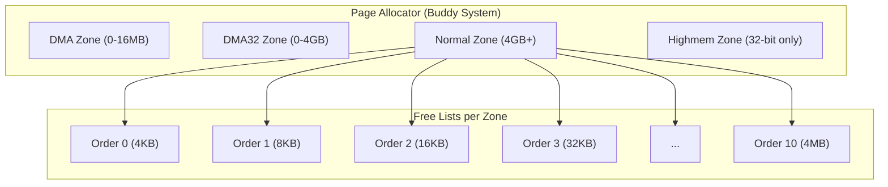
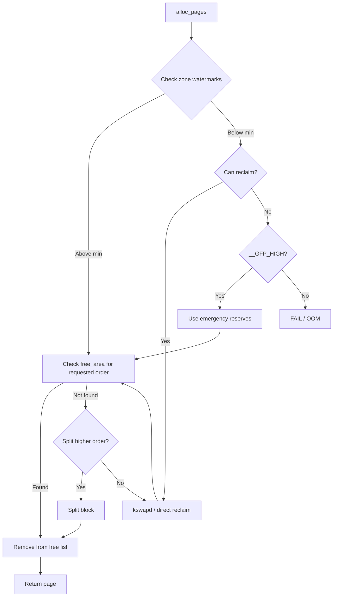

# Page Allocation

## Introduction

The page allocator is the foundation of Linux memory management. It is responsible for allocating and freeing contiguous blocks of physical memory in units of pages (typically 4096 bytes). All higher-level memory allocation mechanisms — `kmalloc()`, `vmalloc()`, slab caches, and even userspace memory via `mmap()` — ultimately depend on the page allocator to obtain physical pages.

The Linux page allocator implements a **buddy system** algorithm, which maintains free lists of power-of-2 sized blocks (called "buddies"). When a request comes in, it finds the smallest available block that satisfies the request. If a larger block is available, it's split in half recursively. When blocks are freed, the buddy system attempts to merge them back into larger blocks, minimizing fragmentation.

## Page Allocator Architecture



## Core Concepts

### Pages and Page Frames

A **page** is the smallest unit of memory the kernel manages. A **page frame** is a physical page of memory. The `struct page` structure describes each page frame:

```c
/* Simplified struct page (actual is ~64 bytes, heavily unionized) */
struct page {
    unsigned long flags;           /* Page flags (PG_locked, PG_dirty, etc.) */
    
    /* Union of various uses */
    union {
        struct {   /* Slab/SLUB allocator */
            struct kmem_cache *slab_cache;
            void *freelist;
        };
        struct {   /* Page cache / anonymous pages */
            struct list_head lru;
            struct address_space *mapping;
            pgoff_t index;
            unsigned long private;
        };
        struct {   /* Compound pages (huge pages) */
            unsigned long compound_head;
            unsigned char compound_dtor;
            unsigned char compound_order;
            atomic_t compound_mapcount;
            atomic_t compound_pincount;
        };
        /* ... more variants ... */
    };
    
    atomic_t _refcount;            /* Reference count */
    atomic_t _mapcount;            /* Page table mappings count */
};
```

### Memory Zones

Physical memory is divided into zones based on hardware constraints:

| Zone | Range (64-bit) | Purpose |
|------|----------------|---------|
| `ZONE_DMA` | 0-16 MB | ISA DMA devices (can only address low 16 MB) |
| `ZONE_DMA32` | 0-4 GB | 32-bit DMA devices |
| `ZONE_NORMAL` | 4 GB - high | Normal kernel memory |
| `ZONE_HIGHMEM` | Varies (32-bit) | Memory above 896 MB (32-bit only) |
| `ZONE_MOVABLE` | Varies | Memory that can be migrated (for hotplug/anti-fragmentation) |

```c
struct zone {
    /* Watermarks for memory pressure */
    unsigned long _watermark[NR_WMARK];
    unsigned long watermark_boost;
    
    /* Free area lists (buddy system) */
    struct free_area free_area[NR_PAGE_ORDERS];
    
    /* Zone statistics */
    atomic_long_t vm_stat[NR_VM_ZONE_STAT_ITEMS];
    
    /* Zone characteristics */
    const char *name;
    struct pglist_data *zone_pgdat;
    struct page *zone_mem_map;
    
    unsigned long zone_start_pfn;
    unsigned long managed_pages;
    unsigned long spanned_pages;
    unsigned long present_pages;
    
    int node;               /* NUMA node */
    enum zone_type type;    /* DMA, DMA32, NORMAL, etc. */
    
    /* ... */
};
```

### NUMA Nodes

On NUMA systems, memory is organized into nodes, each associated with a CPU:

```c
typedef struct pglist_data {
    struct zone node_zones[MAX_NR_ZONES];
    struct zonelist node_zonelists[MAX_ZONELISTS];
    int nr_zones;
    int node_id;
    
    /* Node statistics */
    atomic_long_t vm_stat[NR_VM_NODE_STAT_ITEMS];
    
    /* ... */
} pg_data_t;
```

## Buddy System Algorithm

The buddy system maintains free lists indexed by order (block size). Each order `n` represents blocks of 2^n contiguous pages:

```
Order  Block Size  Pages
  0      4 KiB       1
  1      8 KiB       2
  2     16 KiB       4
  3     32 KiB       8
  4     64 KiB      16
  5    128 KiB      32
  6    256 KiB      64
  7    512 KiB     128
  8      1 MiB     256
  9      2 MiB     512
 10      4 MiB    1024
```

### Buddy Splitting

When allocating order-N memory:
1. Check the free list for order N
2. If empty, check order N+1
3. If order N+1 has a block, split it into two "buddies" of order N
4. Put one buddy on the order-N free list, return the other
5. Recurse if necessary

### Buddy Merging

When freeing order-N memory:
1. Calculate the buddy address (flip bit N in the page frame number)
2. If the buddy is free and of the same order, merge them
3. Remove both from the order-N list
4. Put the merged block on the order-(N+1) list
5. Recurse (merge the merged block with its buddy if possible)

```c
/* Free area structure (one per order per zone) */
struct free_area {
    struct list_head free_list[MIGRATE_TYPES];
    unsigned long nr_free;
};

/* Migration types for anti-fragmentation */
enum migratetype {
    MIGRATE_UNMOVABLE,    /* Kernel allocations, cannot be moved */
    MIGRATE_MOVABLE,      /* Userspace pages, can be migrated */
    MIGRATE_RECLAIMABLE,  /* Can be reclaimed (e.g., page cache) */
    MIGRATE_CMA,          /* Contiguous Memory Allocator */
    MIGRATE_ISOLATE,      /* Isolated for hotplug/migration */
    MIGRATE_TYPES
};
```

## Page Allocation API

### alloc_pages() — The Core Interface

```c
#include <linux/gfp.h>
#include <linux/mm.h>

/* Allocate 2^order contiguous pages */
struct page *alloc_pages(gfp_t gfp_mask, unsigned int order);

/* Get the virtual address from a page */
void *page_address(struct page *page);

/* Free pages */
void __free_pages(struct page *page, unsigned int order);

/* Combined allocation + address */
void *get_zeroed_page(gfp_t gfp_mask);           /* Single zeroed page */
unsigned long __get_free_page(gfp_t gfp_mask);    /* Single page */
unsigned long __get_free_pages(gfp_t gfp_mask, unsigned int order);

/* Free by address */
void free_page(unsigned long addr);
void free_pages(unsigned long addr, unsigned int order);
```

### GFP Flags

GFP (Get Free Pages) flags control the allocation behavior:

```c
/* Zone modifiers */
#define __GFP_DMA       0x01u   /* Allocate from DMA zone */
#define __GFP_HIGHMEM   0x02u   /* Allocate from highmem zone */
#define __GFP_DMA32     0x04u   /* Allocate from DMA32 zone */
#define __GFP_MOVABLE   0x08u   /* Page is movable (anti-fragmentation) */

/* Watermark modifiers */
#define __GFP_HIGH      0x20u   /* Access emergency reserves */
#define __GFP_ATOMIC    0x4000u /* Don't sleep, use reserves */
#define __GFP_MEMALLOC  0x20000u /* Access all reserves */
#define __GFP_NOMEMALLOC 0x80000u /* Don't access reserves */

/* Action modifiers */
#define __GFP_IO        0x40u   /* Can do I/O (not in interrupt) */
#define __GFP_FS        0x80u   /* Can call filesystem code */
#define __GFP_NOWARN    0x200u  /* Don't print warnings */
#define __GFP_RETRY_MAYFAIL 0x400u /* Retry but may fail */
#define __GFP_NOFAIL    0x800u  /* Never fail (infinite retry) */
#define __GFP_ZERO      0x10000u /* Zero the allocated pages */
#define __GFP_COMP      0x40000u /* Return compound page */
#define __GFP_NORETRY   0x1000u /* Don't retry, may fail */

/* Common combinations */
#define GFP_KERNEL      (__GFP_RECLAIM | __GFP_IO | __GFP_FS)
    /* Can sleep, do I/O, call FS — for process context */
    
#define GFP_ATOMIC      (__GFP_HIGH)
    /* Cannot sleep — for interrupt/atomic context */
    
#define GFP_USER        (__GFP_RECLAIM | __GFP_IO | __GFP_FS | __GFP_HARDWALL)
    /* For userspace allocations */
    
#define GFP_HIGHUSER    (GFP_USER | __GFP_HIGHMEM)
    /* Userspace, can use highmem */
    
#define GFP_HIGHUSER_MOVABLE (GFP_HIGHUSER | __GFP_MOVABLE)
    /* Userspace, movable pages (for page migration) */
    
#define GFP_DMA         (__GFP_DMA)
    /* DMA zone allocation */
    
#define GFP_DMA32       (__GFP_DMA32)
    /* DMA32 zone allocation */
```

### Usage Examples

```c
/* Allocate a single page in process context */
struct page *page = alloc_page(GFP_KERNEL);
if (!page)
    return -ENOMEM;

/* Use the page */
void *addr = page_address(page);
memset(addr, 0, PAGE_SIZE);

/* Free when done */
__free_page(page);

/* Allocate 4 contiguous pages (order 2, 16 KiB) */
struct page *pages = alloc_pages(GFP_KERNEL, 2);
if (!pages)
    return -ENOMEM;

/* Use */
void *buf = page_address(pages);
/* ... */

/* Free */
__free_pages(pages, 2);

/* Allocate zeroed page */
void *buf = (void *)get_zeroed_page(GFP_KERNEL);
if (!buf)
    return -ENOMEM;

/* Free */
free_page((unsigned long)buf);

/* Allocate in interrupt context (cannot sleep) */
struct page *page = alloc_page(GFP_ATOMIC);
if (page) {
    /* Use page in interrupt context */
    __free_page(page);
}
```

### __GFP_ZERO Example

```c
/* Allocate zeroed pages */
struct page *page = alloc_pages(GFP_KERNEL | __GFP_ZERO, 0);
/* Page contents guaranteed to be zero */
```

### DMA Allocation

```c
/* Allocate DMA-capable memory */
void *dma_buf = kmalloc(size, GFP_KERNEL | GFP_DMA);

/* Or for page-level DMA allocation */
struct page *page = alloc_pages(GFP_DMA, order);
dma_addr_t dma_addr = dma_map_single(dev, page_address(page), size,
                                      DMA_TO_DEVICE);
```

## Page Allocator Internals

### The Allocation Path



### Watermarks

Each zone has three watermarks that control memory pressure behavior:

```c
enum zone_watermarks {
    WMARK_MIN,    /* Minimum free pages — emergency reserves */
    WMARK_LOW,    /* Low watermark — wake kswapd for background reclaim */
    WMARK_HIGH,   /* High watermark — kswapd goes back to sleep */
    NR_WMARK
};

/* These are tuned automatically based on zone size */
/* Typical: MIN = 0.25% of zone, LOW = 1% of zone, HIGH = 1.5% of zone */
```

```bash
# View zone watermarks
cat /proc/zoneinfo
# Node 0, zone   Normal
#   pages free     123456
#         min      1000
#         low      2500
#         high     3750
#         spanned  4194304
#         present  4194304
#         managed  3932160
```

### Free Area and Buddy Algorithm in Detail

```c
/* __rmqueue_smallest — find and remove smallest sufficient block */
static inline struct page *__rmqueue_smallest(struct zone *zone,
                                               unsigned int order,
                                               int migratetype)
{
    unsigned int current_order;
    struct free_area *area;
    struct page *page;
    
    /* Search for the smallest order that has a free block */
    for (current_order = order; current_order < MAX_PAGE_ORDER; current_order++) {
        area = &(zone->free_area[current_order]);
        page = list_first_entry_or_null(&area->free_list[migratetype],
                                         struct page, lru);
        if (!page)
            continue;
        
        /* Found a block — remove it from the free list */
        list_del(&page->lru);
        rmv_page_order(page);
        area->nr_free--;
        
        /* Split larger blocks down to requested order */
        expand(zone, page, order, current_order, migratetype);
        
        return page;
    }
    
    return NULL;  /* No suitable block found */
}

/* expand — split a larger block into smaller pieces */
static inline void expand(struct zone *zone, struct page *page,
                           int low, int high, int migratetype)
{
    unsigned long size = 1 << high;
    
    while (high > low) {
        high--;
        size >>= 1;
        
        /* Add the buddy half to the free list */
        struct free_area *area = &(zone->free_area[high]);
        list_add(&page[size].lru, &area->free_list[migratetype]);
        area->nr_free++;
        set_page_order(&page[size], high);
    }
}
```

## Per-CPU Page Cache (PCP)

To reduce lock contention, the page allocator maintains per-CPU caches of recently freed pages:

```c
/* Per-CPU pageset */
struct per_cpu_pages {
    int count;          /* Number of pages in the list */
    int high;           /* High watermark for batch */
    int batch;          /* Number of pages to add/remove at once */
    struct list_head lists[MIGRATE_TYPES];  /* Free page lists */
};

/* When allocating:
 * 1. Check PCP list first (fast path, no zone lock)
 * 2. If PCP empty, refill from buddy system (slow path, zone lock)
 * 
 * When freeing:
 * 1. Put page on PCP list (fast path)
 * 2. If PCP above high watermark, drain to buddy system
 */
```

## OOM Killer

When the system is critically low on memory and all reclaim attempts fail, the OOM (Out Of Memory) killer selects and kills a process to free memory:

```c
/* OOM score calculation (simplified) */
static unsigned long oom_badness(struct task_struct *p,
                                  unsigned long totalpages)
{
    unsigned long points;
    long adj;
    
    /* Base score: RSS + swap usage + page table size */
    points = get_mm_rss(p->mm) + get_mm_counter(p->mm, MM_SWAPENTS) +
             mm_pgtables_bytes(p->mm) / PAGE_SIZE;
    
    /* Adjust by oom_score_adj (-1000 to 1000) */
    adj = (long)p->signal->oom_score_adj;
    if (adj == OOM_SCORE_ADJ_MIN)
        return 0;  /* Never kill */
    
    points += (points * adj) / 1000;
    
    return points > 0 ? points : 1;
}
```

```bash
# View OOM scores
cat /proc/<pid>/oom_score
# 123

# Adjust OOM score (-1000 to 1000)
echo 500 > /proc/<pid>/oom_score_adj  # More likely to be killed
echo -1000 > /proc/<pid>/oom_score_adj  # Never kill

# View OOM events
dmesg | grep -i "oom\|out of memory"
# [12345.678901] Out of memory: Killed process 1234 (big_app) score 456 or sacrifice child
```

## Page Allocation Statistics

```bash
# View memory zones
cat /proc/zoneinfo

# View buddy system state
cat /proc/buddyinfo
# Node 0, zone      DMA      2      2      1      1      2      1      1      0      1      1      3
# Node 0, zone    DMA32    120     85     42     21      8      5      2      1      0      0    200
# Node 0, zone   Normal  15234   8456   4231   2100   1050    500    200     50     10      2    500
# (Each column = order 0 through 10, values = number of free blocks)

# View pagetypeinfo (migration types)
cat /proc/pagetypeinfo

# View /proc/meminfo
cat /proc/meminfo
# MemTotal:       16384000 kB
# MemFree:         8192000 kB
# MemAvailable:   12288000 kB
# Buffers:          256000 kB
# Cached:          3072000 kB
# SwapTotal:       2097152 kB
# SwapFree:        2097152 kB

# View per-zone statistics
cat /proc/vmstat | grep -E "^nr_|^pgscan|^pgsteal"
# nr_free_pages 2048000
# nr_alloc_success 12345678
# nr_free_success 12345670
# nr_alloc_fail 0
```

## Allocation Fallback Mechanisms

When the preferred zone or migration type doesn't have free pages:

```c
/* Zonelist fallback order (for NUMA and zone fallback) */
static struct zonelist *node_zonelist(int nid, gfp_t gfp)
{
    return NODE_DATA(nid)->node_zonelists + gfp_zonelist(gfp);
}

/* The kernel tries zones in this order:
 * 1. Preferred zone (based on GFP flags)
 * 2. DMA32 zone (if DMA requested but DMA zone full)
 * 3. Normal zone (fallback)
 * 4. Highmem zone (32-bit only)
 */
```

## Buddyinfo and Fragmentation

```bash
# Interpret buddyinfo
cat /proc/buddyinfo
# Node 0, zone   Normal  15234   8456   4231   2100   1050    500    200     50     10      2    500

# Column interpretation:
# Order 0 (4KB):   15234 free blocks
# Order 1 (8KB):    8456 free blocks
# Order 2 (16KB):   4231 free blocks
# ...
# Order 10 (4MB):    500 free blocks

# High order-0 count + low higher-order count = fragmentation

# Reduce fragmentation
echo 1 > /proc/sys/vm/compact_memory  # Trigger compaction

# View fragmentation index
cat /sys/kernel/debug/extfrag/extfrag_index
```

## Contiguous Memory Allocator (CMA)

CMA reserves contiguous memory regions for devices that need them (e.g., video buffers):

```bash
# CMA regions in kernel command line
# cma=256M@0x0-0x100000000

# View CMA regions
dmesg | grep -i cma
# [    0.000000] Reserved: 0x0000000080000000 - 0x0000000090000000 (256 MiB)

# View CMA allocation stats
cat /proc/meminfo | grep Cma
# CmaTotal:        262144 kB
# CmaFree:         204800 kB
```

## References

- [Linux Device Drivers, 3rd Edition — Chapter 15: Memory Mapping and DMA](https://lwn.net/Kernel/LDD3/)
- [Kernel documentation: Memory Management](https://www.kernel.org/doc/html/latest/mm/index.html)
- [LWN: A multi-layered approach to page allocation](https://lwn.net/Articles/812319/)
- [LWN: Memory allocation in the kernel](https://lwn.net/Articles/229096/)
- [Linux MM documentation](https://www.kernel.org/doc/html/latest/mm/)
- [Mel Gorman: Understanding the Linux Virtual Memory Manager](https://www.kernel.org/doc/gorman/)

## Related Topics

- [Virtual Memory](./virtual-memory.md) — Virtual-to-physical mapping
- [Memory Zones](./memory-zones.md) — Zone types and constraints
- [Slab Allocator](../mm/slab.md) — Small object allocation built on page allocator
- [Swap](./swap.md) — Swap space management
- [Compaction](./compaction.md) — Reducing fragmentation
