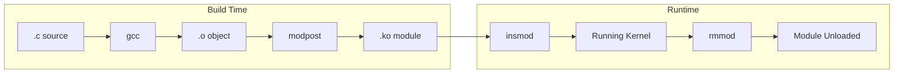

# Kernel Modules

## Introduction

Kernel modules are pieces of code that can be loaded into and unloaded from the running kernel on demand. They extend kernel functionality without requiring a full kernel rebuild and reboot. Modules are used for device drivers, filesystem drivers, system calls, and more.

This chapter covers writing, compiling, loading, and managing kernel modules, including module parameters, symbol exports, and best practices.

## Module Basics

### What Is a Kernel Module?

A kernel module is an object file (`.ko` — kernel object) that contains code and data that links into the running kernel. It runs in kernel space (Ring 0) with full hardware access.



### Module vs Built-in

| Feature | Module (=m) | Built-in (=y) |
|---------|-------------|----------------|
| Load/unload at runtime | Yes | No |
| Boot time availability | After module load | Immediately |
| Memory usage | Only when loaded | Always in memory |
| Build time | Faster (separate) | Slower (linked) |
| Debugging | Can reload after fix | Requires reboot |

## Writing a Minimal Module

### Hello World Module

```c
/* hello.c — minimal kernel module */
#include <linux/init.h>
#include <linux/module.h>
#include <linux/kernel.h>

MODULE_LICENSE("GPL");
MODULE_AUTHOR("Your Name");
MODULE_DESCRIPTION("A simple hello world kernel module");
MODULE_VERSION("1.0");

static int __init hello_init(void)
{
    pr_info("hello: module loaded\n");
    return 0;  /* 0 = success */
}

static void __exit hello_exit(void)
{
    pr_info("hello: module unloaded\n");
}

module_init(hello_init);
module_exit(hello_exit);
```

### Makefile

```makefile
# Makefile for out-of-tree module
KDIR ?= /lib/modules/$(shell uname -r)/build

obj-m += hello.o

all:
	$(MAKE) -C $(KDIR) M=$(PWD) modules

clean:
	$(MAKE) -C $(KDIR) M=$(PWD) clean
```

### Building and Loading

```bash
# Build the module
$ make
make -C /lib/modules/6.1.0-23-amd64/build M=/home/user/hello modules
make[1]: Entering directory '/usr/src/linux-headers-6.1.0-23-amd64'
  CC [M]  /home/user/hello/hello.o
  MODPOST /home/user/hello/Module.symvers
  CC [M]  /home/user/hello/hello.mod.o
  LD [M]  /home/user/hello/hello.ko
make[1]: Leaving directory '/usr/src/linux-headers-6.1.0-23-amd64'

# Load the module
$ sudo insmod hello.ko

# Check kernel log
$ dmesg | tail -5
[12345.678901] hello: module loaded

# List loaded modules
$ lsmod | grep hello
hello                  16384  0

# Unload the module
$ sudo rmmod hello

# Check kernel log
$ dmesg | tail -5
[12345.678901] hello: module loaded
[12346.123456] hello: module unloaded
```

## Module Entry and Exit Points

### module_init / module_exit

```c
/* The __init and __exit annotations are important:
 * __init: marks code that can be freed after initialization
 * __exit: marks code that can be discarded when modules are disabled
 */

static int __init my_init(void)
{
    /* Called when module is loaded */
    /* Allocate resources, register drivers, etc. */
    return 0;  /* Return 0 on success, negative on error */
}

static void __exit my_exit(void)
{
    /* Called when module is unloaded */
    /* Free resources, unregister drivers, etc. */
}

module_init(my_init);
module_exit(my_exit);
```

### Module Information Macros

```c
MODULE_LICENSE("GPL");           /* License (GPL, "GPL v2", etc.) */
MODULE_AUTHOR("Name");           /* Author */
MODULE_DESCRIPTION("desc");      /* Description */
MODULE_VERSION("1.0");           /* Version */
MODULE_ALIAS("alias");           /* Module alias */
MODULE_DEVICE_TABLE(type, id);   /* Hotplug device table */
```

## Module Parameters

Modules can accept parameters at load time:

```c
/* hello_param.c — module with parameters */
#include <linux/init.h>
#include <linux/module.h>
#include <linux/kernel.h>
#include <linux/moduleparam.h>

MODULE_LICENSE("GPL");

/* Module parameters */
static int count = 1;
module_param(count, int, 0644);
MODULE_PARM_DESC(count, "Number of times to print message");

static char *name = "World";
module_param(name, charp, 0644);
MODULE_PARM_DESC(name, "Name to greet");

static int debug = 0;
module_param(debug, bool, 0644);
MODULE_PARM_DESC(debug, "Enable debug output");

static int __init hello_param_init(void)
{
    int i;
    for (i = 0; i < count; i++) {
        pr_info("hello: Hello, %s! (%d/%d)\n", name, i + 1, count);
        if (debug)
            pr_info("hello: debug mode enabled\n");
    }
    return 0;
}

static void __exit hello_param_exit(void)
{
    pr_info("hello: Goodbye, %s!\n", name);
}

module_init(hello_param_init);
module_exit(hello_param_exit);
```

### Loading with Parameters

```bash
# Load with parameters
$ sudo insmod hello_param.ko count=3 name="Linux" debug=1

# Or using modprobe (requires module installed)
$ sudo modprobe hello_param count=3 name="Linux" debug=1

# Check results
$ dmesg | tail -10
[12345.678901] hello: Hello, Linux! (1/3)
[12345.678901] hello: debug mode enabled
[12345.678902] hello: Hello, Linux! (2/3)
[12345.678902] hello: debug mode enabled
[12345.678903] hello: Hello, Linux! (3/3)
[12345.678903] hello: debug mode enabled

# Parameters are visible in sysfs
$ cat /sys/module/hello_param/parameters/count
3
$ cat /sys/module/hello_param/parameters/name
Linux

# Change parameter at runtime (if permissions allow)
$ echo 5 | sudo tee /sys/module/hello_param/parameters/count
```

### Parameter Types

| Type | `module_param` type | Description |
|------|-------------------|-------------|
| `bool` | `bool` | Boolean (0/1) |
| `charp` | `charp` | String pointer |
| `int` | `int` | Integer |
| `long` | `long` | Long integer |
| `short` | `short` | Short integer |
| `uint` | `uint` | Unsigned int |
| `ulong` | `ulong` | Unsigned long |
| `ushort` | `ushort` | Unsigned short |

### Array Parameters

```c
static int arr[5] = {1, 2, 3, 4, 5};
static int arr_count;
module_param_array(arr, int, &arr_count, 0644);
MODULE_PARM_DESC(arr, "Array of integers");

/* Load: sudo insmod mymod.ko arr=10,20,30 */
```

## Symbol Export

Modules can export symbols (functions and variables) for use by other modules:

```c
/* Exported function */
int my_helper_function(int x)
{
    return x * 2;
}
EXPORT_SYMBOL(my_helper_function);

/* Exported function with GPL-only license */
void my_gpl_function(void)
{
    /* Only GPL-licensed modules can use this */
}
EXPORT_SYMBOL_GPL(my_gpl_function);

/* Exported variable */
int my_global_variable = 42;
EXPORT_SYMBOL(my_global_variable);
```

### Using Exported Symbols

```c
/* Another module using the exported symbol */
extern int my_helper_function(int x);

static int __init my_init(void)
{
    int result = my_helper_function(21);
    pr_info("result = %d\n", result);  /* 42 */
    return 0;
}
```

### Viewing Exported Symbols

```bash
# List all exported symbols
$ cat /proc/kallsyms | grep T | head -20
ffffffff81000000 T _stext
ffffffff81000000 T _text
ffffffff81001000 T startup_64
ffffffff81001000 T __startup_64

# Symbols exported by a specific module
$ cat /proc/kallsyms | grep '\[hello\]'

# View Module.symvers (built during compilation)
$ cat Module.symvers | head -5
0x12345678  my_helper_function  hello  EXPORT_SYMBOL
0xabcdef01  my_gpl_function     hello  EXPORT_SYMBOL_GPL
```

## Module Loading: insmod vs modprobe

### insmod

`insmod` loads a single module by filename. It does **not** resolve dependencies:

```bash
# Load a module by filename
$ sudo insmod /lib/modules/$(uname -r)/kernel/drivers/net/e1000e.ko

# Load with parameters
$ sudo insmod hello.ko count=5
```

### modprobe

`modprobe` is the recommended tool. It reads module dependency information and automatically loads required modules:

```bash
# Load module by name (resolves dependencies)
$ sudo modprobe e1000e

# Load with parameters
$ sudo modprobe hello count=5

# Remove module and its unused dependencies
$ sudo modprobe -r hello

# Dry run — show what would be loaded
$ sudo modprobe --show-depends e1000e
insmod /lib/modules/6.1.0/kernel/drivers/net/phy/libphy.ko
insmod /lib/modules/6.1.0/kernel/drivers/net/phy/mdio-devres.ko
insmod /lib/modules/6.1.0/kernel/drivers/net/ethernet/intel/e1000e/e1000e.ko

# List all available modules
$ modprobe -l | head -20
# Or on newer systems:
$ find /lib/modules/$(uname -r) -name "*.ko*" | head -20

# Show module info
$ modprobe --show-depends e1000e

# Force load (ignore version mismatch)
$ sudo modprobe --force hello
```

### Module Dependency Database

```bash
# Module dependencies are stored in modules.dep
$ cat /lib/modules/$(uname -r)/modules.dep | head -10
kernel/drivers/net/e1000e/e1000e.ko: kernel/drivers/net/phy/libphy.ko kernel/drivers/net/phy/mdio-devres.ko

# Rebuild dependency database
$ sudo depmod -a
```

### rmmod

```bash
# Remove a module
$ sudo rmmod hello

# Force removal (even if in use — dangerous!)
$ sudo rmmod -f hello

# Check if module is in use
$ lsmod | grep hello
hello                  16384  0
# "Used by" column shows 0 = safe to remove
```

## Module Utilities

### lsmod

```bash
# List loaded modules
$ lsmod
Module                  Size  Used by
ext4                  786432  1
mbcache                16384  1 ext4
jbd2                  131072  1 ext4
e1000e                294912  0
```

### modinfo

```bash
# Show module information
$ modinfo e1000e
filename:       /lib/modules/6.1.0/kernel/drivers/net/ethernet/intel/e1000e/e1000e.ko
version:        5.14.2
license:        GPL v2
description:    Intel(R) PRO/1000 Network Driver
author:         Intel Corporation
firmware:       e1000e/82571-1.fw
firmware:       e1000e/82571-2.fw
firmware:       e1000e/82572-1.fw
alias:          pci:v00008086d0000105Esv*sd*bc*sc*i*
alias:          pci:v00008086d000010B8sv*sd*bc*sc*i*
depends:        libphy,mdio-devres
retpoline:      Y
intree:         Y
name:           e1000e
vermagic:       6.1.0-23-amd64 SMP preempt mod_unload modversions
parm:           debug:Debug level (0=none,...,16=all) (int)
parm:           copybreak:Maximum size of packet that is copied to a new buffer on receive (uint)
parm:           TxIntDelay:Transmit Interrupt Delay (array of int)
```

### modprobe Configuration

```bash
# Blacklist a module
$ cat /etc/modprobe.d/blacklist-nouveau.conf
blacklist nouveau
options nouveau modeset=0

# Set default module parameters
$ cat /etc/modprobe.d/e1000e.conf
options e1000e InterruptThrottleRate=3

# Module aliases
$ cat /etc/modprobe.d/aliases.conf
alias my-device my_driver

# Install command (run instead of loading)
$ cat /etc/modprobe.d/custom.conf
install my_module /sbin/modprobe --ignore-install my_module && /usr/local/bin/setup.sh
```

## Writing a Character Device Module

A more realistic module example — a character device:

```c
/* chardev.c — simple character device */
#include <linux/init.h>
#include <linux/module.h>
#include <linux/fs.h>
#include <linux/cdev.h>
#include <linux/uaccess.h>

#define DEVICE_NAME "mychardev"
#define BUF_SIZE 1024

MODULE_LICENSE("GPL");

static dev_t dev_num;
static struct cdev my_cdev;
static char buffer[BUF_SIZE];
static size_t buf_len;

static int my_open(struct inode *inode, struct file *filp)
{
    pr_info("mychardev: opened\n");
    return 0;
}

static int my_release(struct inode *inode, struct file *filp)
{
    pr_info("mychardev: closed\n");
    return 0;
}

static ssize_t my_read(struct file *filp, char __user *ubuf,
                       size_t count, loff_t *ppos)
{
    if (*ppos >= buf_len)
        return 0;
    if (count > buf_len - *ppos)
        count = buf_len - *ppos;
    if (copy_to_user(ubuf, buffer + *ppos, count))
        return -EFAULT;
    *ppos += count;
    return count;
}

static ssize_t my_write(struct file *filp, const char __user *ubuf,
                        size_t count, loff_t *ppos)
{
    if (count > BUF_SIZE)
        count = BUF_SIZE;
    if (copy_from_user(buffer, ubuf, count))
        return -EFAULT;
    buf_len = count;
    *ppos = 0;
    return count;
}

static const struct file_operations my_fops = {
    .owner = THIS_MODULE,
    .open = my_open,
    .release = my_release,
    .read = my_read,
    .write = my_write,
};

static int __init chardev_init(void)
{
    int ret;

    /* Allocate device number */
    ret = alloc_chrdev_region(&dev_num, 0, 1, DEVICE_NAME);
    if (ret < 0) {
        pr_err("mychardev: failed to allocate device number\n");
        return ret;
    }

    /* Initialize cdev */
    cdev_init(&my_cdev, &my_fops);
    my_cdev.owner = THIS_MODULE;

    /* Add cdev */
    ret = cdev_add(&my_cdev, dev_num, 1);
    if (ret < 0) {
        pr_err("mychardev: failed to add cdev\n");
        unregister_chrdev_region(dev_num, 1);
        return ret;
    }

    pr_info("mychardev: registered with major %d, minor %d\n",
            MAJOR(dev_num), MINOR(dev_num));
    return 0;
}

static void __exit chardev_exit(void)
{
    cdev_del(&my_cdev);
    unregister_chrdev_region(dev_num, 1);
    pr_info("mychardev: unregistered\n");
}

module_init(chardev_init);
module_exit(chardev_exit);
```

### Using the Character Device

```bash
# Build and load
$ make && sudo insmod chardev.ko

# Check device number
$ dmesg | tail -3
[12345.678901] mychardev: registered with major 234, minor 0

# Create device node
$ sudo mknod /dev/mychardev c 234 0
$ sudo chmod 666 /dev/mychardev

# Test it
$ echo "Hello, kernel!" > /dev/mychardev
$ cat /dev/mychardev
Hello, kernel!
```

## Module Versioning

Module versioning ensures compatibility between modules and the running kernel:

```bash
# Module version magic is embedded in the .ko file
$ modinfo hello.ko | grep vermagic
vermagic:       6.1.0-23-amd64 SMP preempt mod_unload modversions

# Check kernel CRC for a symbol
$ cat /proc/kallsyms | grep printk
ffffffff810a1234 T printk
```

### CONFIG_MODVERSIONS

When enabled, the kernel generates CRC checksums for all exported symbols. Modules must match these CRCs to load:

```bash
# Enable in kernel config
$ scripts/config --enable CONFIG_MODVERSIONS

# Force load with version mismatch (dangerous!)
$ sudo modprobe --force hello
```

## Autoloading Modules

### Module Aliases and udev

```bash
# Modules can be autoloaded based on device aliases
$ modinfo e1000e | grep alias
alias:          pci:v00008086d0000105Esv*sd*bc*sc*i*

# udev triggers module loading via modalias
$ cat /sys/bus/pci/devices/0000:00:1f.2/modalias
pci:v00008086d0000A102sv*sd*bc*sc*i*

# Load module for a specific device
$ sudo modprobe $(cat /sys/bus/pci/devices/0000:00:1f.2/modalias)
```

### /etc/modules

```bash
# Modules to load at boot
$ cat /etc/modules
# /etc/modules: kernel modules to load at boot.
#
# This file contains the names of kernel modules that should be loaded
# at boot time, one per line.
e1000e
bonding
```

### systemd-modules-load

```bash
# systemd loads modules listed in /etc/modules-load.d/
$ cat /etc/modules-load.d/network.conf
# Load bonding module for network teaming
bonding

# Check service status
$ systemctl status systemd-modules-load
```

## Debugging Modules

### Kernel Logs

```bash
# View kernel messages
$ dmesg | grep mymodule

# Follow kernel messages
$ dmesg -w | grep mymodule

# View with timestamps
$ dmesg -T | tail -20
[Mon Jul 21 16:30:00 2024] hello: module loaded
```

### Dynamic Debug

```bash
# Enable dynamic debug for a module
$ echo 'module mymodule +p' > /sys/kernel/debug/dynamic_debug/control

# Enable for a specific function
$ echo 'func my_function +p' > /sys/kernel/debug/dynamic_debug/control

# Enable for a specific file and line
$ echo 'file mymodule.c line 42 +p' > /sys/kernel/debug/dynamic_debug/control

# In source code:
pr_debug("This is a debug message\n");  /* Controlled by dynamic debug */
```

### Module Crash Analysis

```bash
# If a module causes issues, check:
$ dmesg | tail -50

# Typical kernel oops message:
[12345.678901] BUG: unable to handle page fault at ffffffff81234567
[12345.678901] PGD 0 P4D 0
[12345.678901] Oops: 0000 [#1] SMP
[12345.678901] CPU: 0 PID: 1234 Comm: insmod Tainted: G        W
[12345.678901] RIP: 0010:my_init+0x15/0x50 [hello]

# Decode addresses with addr2line
$ addr2line -e hello.ko -f 0x15
my_init
/home/user/hello/hello.c:12
```

## Security Considerations

### Module Signing

```bash
# Enable module signature verification
$ scripts/config --enable CONFIG_MODULE_SIG
$ scripts/config --enable CONFIG_MODULE_SIG_FORCE

# Sign modules during build
$ make modules_sign
```

### Secure Boot

```bash
# With Secure Boot, only signed modules can be loaded
# MOK (Machine Owner Key) enrollment is required for custom modules

# Check Secure Boot status
$ mokutil --sb-state
SecureBoot enabled

# Enroll a key
$ sudo mokutil --import /path/to/MOK.der
```

### Capabilities and Permissions

```bash
# Loading modules requires CAP_SYS_MODULE capability
# Or root privileges

# Check your capabilities
$ capsh --print | grep current
current = cap_sys_module,cap_net_raw,...

# Restrict module loading at runtime
$ echo 1 | sudo tee /proc/sys/kernel/modules_disabled
# After this, no new modules can be loaded until reboot
```

## Real-World Module Examples

### Network Driver Module Structure

```c
/* Simplified e1000e probe function */
static int e1000_probe(struct pci_dev *pdev,
                       const struct pci_device_id *ent)
{
    struct net_device *netdev;
    struct e1000_adapter *adapter;
    int err;

    /* Allocate net_device */
    netdev = alloc_etherdev(sizeof(struct e1000_adapter));
    adapter = netdev_priv(netdev);

    /* Enable PCI device */
    err = pci_enable_device(pdev);

    /* Map BAR regions */
    adapter->hw_addr = pci_iomap(pdev, 0, 0);

    /* Register net_device */
    register_netdev(netdev);

    /* Set up NAPI, interrupts, etc. */
    netif_napi_add(netdev, &adapter->napi, e1000e_poll, 64);
    napi_enable(&adapter->napi);

    return 0;
}
```

### Filesystem Module Structure

```c
/* Simplified filesystem module */
static struct file_system_type my_fs_type = {
    .name = "myfs",
    .fs_flags = FS_REQUIRES_DEV,
    .mount = my_fs_mount,
    .kill_sb = kill_block_super,
};

static int __init my_fs_init(void)
{
    return register_filesystem(&my_fs_type);
}

static void __exit my_fs_exit(void)
{
    unregister_filesystem(&my_fs_type);
}
```

## Further Reading

- [Linux Kernel Module Programming Guide](https://tldp.org/LDP/lkmpg/2.6/html/)
- [The Linux Kernel documentation — Modules](https://www.kernel.org/doc/html/latest/core-api/modules.html)
- [Linux Device Drivers, 3rd Edition — Chapter 2](https://lwn.net/Kernel/LDD3/)
- [Kernel Newbies: Kernel Modules](https://kernelnewbies.org/KernelModules)
- [LKM (Loadable Kernel Module) basics](https://www.kernel.org/doc/html/latest/kbuild/modules.html)

## Related Topics

- [Kernel Overview](overview.md) — Monolithic design with modules
- [Build System](build-system.md) — Compiling modules with Kbuild
- [Configuration](configuration.md) — Module-related config options
- [Boot Process](boot-process.md) — Module loading at boot
- [Command Line Parameters](cmdline-params.md) — Module-related boot parameters
