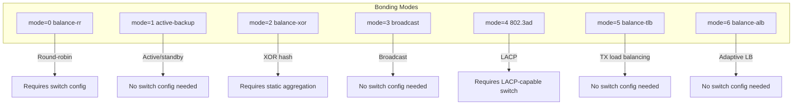
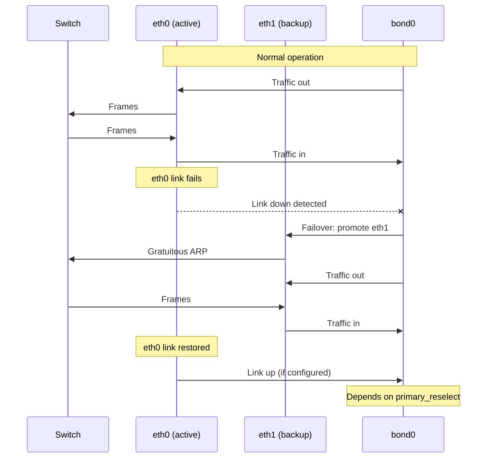

# Network Bonding

## Introduction

Network bonding (also called NIC teaming or link aggregation) combines multiple physical network interfaces into a single logical interface. This provides increased bandwidth, redundancy, and load balancing. If one link fails, traffic automatically fails over to the remaining links, providing high availability.

Linux bonding has been part of the kernel since 2.4 and is implemented by the `bonding` driver (`drivers/net/bonding/`). It supports multiple modes (policies) for distributing traffic across the member interfaces, each with different trade-offs between bandwidth utilization, failover behavior, and switch configuration requirements.

## Bonding Modes



### Mode Comparison Summary

| Mode | Name | TX LB | RX LB | Switch Config | Max Bandwidth | Failover |
|------|------|-------|-------|---------------|---------------|----------|
| 0 | balance-rr | Yes | Yes | Yes (trunk) | N × link | Yes |
| 1 | active-backup | No | No | No | 1 × link | Yes |
| 2 | balance-xor | Yes | Yes | Yes (static) | N × link | Yes |
| 3 | broadcast | No | No | No | 1 × link | Yes |
| 4 | 802.3ad | Yes | Yes | Yes (LACP) | N × link | Yes |
| 5 | balance-tlb | Yes | No | No | N × link TX | Yes |
| 6 | balance-alb | Yes | Yes | No | N × link | Yes |

### Mode 0: balance-rr (Round Robin)

Packets are transmitted in sequential order across all interfaces. Provides load balancing and fault tolerance.

- **Pros**: Simple, good throughput for single TCP streams
- **Cons**: Requires switch-side configuration (static trunk/LACP), packets may arrive out of order
- **Switch requirement**: EtherChannel / static trunk or LACP

```bash
# Create round-robin bond
ip link add bond0 type bond mode balance-rr
ip link set eth0 master bond0
ip link set eth1 master bond0
ip addr add 192.168.1.100/24 dev bond0
ip link set bond0 up
```

### Mode 1: active-backup

Only one interface is active. If it fails, another takes over. The MAC address is shared.

- **Pros**: Simple, no switch configuration needed, reliable failover
- **Cons**: Only one link is used at a time — no bandwidth aggregation
- **Switch requirement**: None

```bash
ip link add bond0 type bond mode active-backup
ip link set eth0 master bond0
ip link set eth1 master bond0
ip link set bond0 up
ip addr add 10.0.0.100/24 dev bond0

# Verify active interface
cat /proc/net/bonding/bond0
# Bonding Mode: fault-tolerance (active-backup)
# Primary Slave: None
# Currently Active Slave: eth0
# MII Status: up
# MII Polling Interval (ms): 100
# Up Delay (ms): 0
# Down Delay (ms): 0
#
# Slave Interface: eth0
# MII Status: up
# Speed: 1000 Mbps
# Duplex: full
# Link Failure Count: 0
#
# Slave Interface: eth1
# MII Status: up
# Speed: 1000 Mbps
# Duplex: full
# Link Failure Count: 0
```

### Mode 2: balance-xor

Transmits based on XOR of source and destination MAC addresses. Provides load balancing and fault tolerance.

- **Pros**: Deterministic load balancing
- **Cons**: Requires static aggregation on switch
- **Switch requirement**: Static EtherChannel

```bash
ip link add bond0 type bond mode balance-xor
ip link set eth0 master bond0
ip link set eth1 master bond0
ip link set bond0 up
ip addr add 192.168.1.100/24 dev bond0
```

### Mode 3: broadcast

Transmits all frames on all interfaces. Provides fault tolerance.

- **Pros**: Maximum redundancy
- **Cons**: No bandwidth gain, high overhead
- **Switch requirement**: None

```bash
ip link add bond0 type bond mode broadcast
ip link set eth0 master bond0
ip link set eth1 master bond0
ip link set bond0 up
```

### Mode 4: 802.3ad (LACP)

Uses IEEE 802.3ad Link Aggregation Control Protocol (LACP). The most sophisticated and commonly used mode for bandwidth aggregation.

- **Pros**: Standards-based, automatic link aggregation, load balancing
- **Cons**: Requires LACP-capable switch, more complex configuration
- **Switch requirement**: LACP-capable managed switch

```bash
ip link add bond0 type bond mode 802.3ad
ip link set eth0 master bond0
ip link set eth1 master bond0
ip link set bond0 up

# LACP parameters
cat /proc/net/bonding/bond0
# Bonding Mode: IEEE 802.3ad Dynamic link aggregation
# Transmit Hash Policy: layer2 (0)
# MII Status: up
# MII Polling Interval (ms): 100
# Up Delay (ms): 0
# Down Delay (ms): 0
# 802.3ad info
# LACP rate: slow
# Min links: 0
# Aggregator selection policy (ad_select): stable
# System priority: 65535
# System MAC address: xx:xx:xx:xx:xx:xx
# Active Aggregator Info:
#     Aggregator ID: 1
#     Number of ports: 2
#     Actor Key: 15
#     Partner Key: 15
#     Partner Mac Address: yy:yy:yy:yy:yy:yy
```

#### LACP Configuration with Switch

```bash
# Linux side: LACP with fast rate
ip link add bond0 type bond mode 802.3ad
ip link set bond0 type bond lacp_rate fast
ip link set bond0 type bond xmit_hash_policy layer3+4
ip link set bond0 type bond ad_select bandwidth

# Cisco switch side (example):
# interface Port-channel1
#   switchport mode trunk
#   lacp rate fast
#
# interface GigabitEthernet0/1
#   channel-group 1 mode active
#
# interface GigabitEthernet0/2
#   channel-group 1 mode active
```

### Mode 5: balance-tlb

Transmit Load Balancing — outgoing traffic is distributed based on current load. Incoming traffic uses the current active slave.

- **Pros**: No switch configuration, TX load balancing
- **Cons**: No RX load balancing (incoming traffic uses single link)
- **Switch requirement**: None

```bash
ip link add bond0 type bond mode balance-tlb
ip link set eth0 master bond0
ip link set eth1 master bond0
ip link set bond0 up
ip addr add 192.168.1.100/24 dev bond0
```

### Mode 6: balance-alb

Adaptive Load Balancing — includes balance-tlb plus receive load balancing via ARP negotiation.

- **Pros**: Full TX+RX load balancing, no switch configuration
- **Cons**: ARP-based RX balancing has limitations, doesn't work well with non-ARP traffic
- **Switch requirement**: None

```bash
ip link add bond0 type bond mode balance-alb
ip link set eth0 master bond0
ip link set eth1 master bond0
ip link set bond0 up
ip addr add 192.168.1.100/24 dev bond0
```

## Configuration

### Using iproute2

```bash
# Load the bonding module
modprobe bonding

# Create bond interface
ip link add bond0 type bond mode 802.3ad

# Set bond parameters
ip link set bond0 type bond xmit_hash_policy layer3+4
ip link set bond0 type bond lacp_rate fast
ip link set bond0 type bond miimon 100
ip link set bond0 type bond min_links 1

# Add slave interfaces
ip link set eth0 down
ip link set eth0 master bond0
ip link set eth1 down
ip link set eth1 master bond0

# Configure IP
ip addr add 192.168.1.100/24 dev bond0
ip link set bond0 up

# Remove slave
ip link set eth0 nomaster

# Delete bond
ip link del bond0
```

### Using /etc/netplan (Ubuntu)

```yaml
# /etc/netplan/01-bond.yaml
network:
  version: 2
  ethernets:
    eth0:
      dhcp4: false
    eth1:
      dhcp4: false
  bonds:
    bond0:
      interfaces:
        - eth0
        - eth1
      parameters:
        mode: 802.3ad
        lacp-rate: fast
        mii-monitor-interval: 100
        transmit-hash-policy: layer3+4
      addresses:
        - 192.168.1.100/24
      gateway4: 192.168.1.1
```

### Using /etc/network/interfaces (Debian)

```bash
# /etc/network/interfaces
auto bond0
iface bond0 inet static
    address 192.168.1.100
    netmask 255.255.255.0
    gateway 192.168.1.1
    bond-slaves eth0 eth1
    bond-mode 802.3ad
    bond-miimon 100
    bond-xmit-hash-policy layer3+4
    bond-lacp-rate fast
```

### Using NetworkManager

```bash
# Create bond
nmcli connection add type bond con-name bond0 ifname bond0 \
    bond.options "mode=802.3ad,miimon=100,xmit_hash_policy=layer3+4,lacp_rate=fast"

# Add slave connections
nmcli connection add type ethernet con-name bond0-slave1 ifname eth0 master bond0
nmcli connection add type ethernet con-name bond0-slave2 ifname eth1 master bond0

# Configure IP
nmcli connection modify bond0 ipv4.addresses 192.168.1.100/24
nmcli connection modify bond0 ipv4.gateway 192.168.1.1
nmcli connection modify bond0 ipv4.method manual

# Bring up
nmcli connection up bond0
nmcli connection up bond0-slave1
nmcli connection up bond0-slave2

# Show bond status
nmcli connection show bond0
```

### Using systemd-networkd

```ini
# /etc/systemd/network/20-bond.netdev
[NetDev]
Name=bond0
Kind=bond

[Bond]
Mode=802.3ad
MIIMonitorSec=100ms
TransmitHashPolicy=layer3+4
LACPTransmitRate=fast

# /etc/systemd/network/20-bond.network
[Match]
Name=bond0

[Network]
Address=192.168.1.100/24
Gateway=192.168.1.1

# /etc/systemd/network/20-eth0.network
[Match]
Name=eth0

[Network]
Bond=bond0

# /etc/systemd/network/20-eth1.network
[Match]
Name=eth1

[Network]
Bond=bond0
```

## Hash Policies

The transmit hash policy determines how outgoing packets are distributed across slave interfaces:

| Policy | Description | Use Case |
|--------|-------------|----------|
| `layer2` | XOR of MAC addresses | Simple setups |
| `layer2+3` | XOR of MAC + IP addresses | Better distribution |
| `layer3+4` | XOR of IP + port addresses | Best distribution for multi-host traffic |
| `encap2+3` | Same as layer2+3 for encapsulated packets | Tunnels |
| `encap3+4` | Same as layer3+4 for encapsulated packets | Tunnels |

```bash
# Set hash policy
ip link set bond0 type bond xmit_hash_policy layer3+4

# Verify
cat /sys/class/net/bond0/bonding/xmit_hash_policy
# layer3+4 0
```

### Hash Policy Deep Dive

```bash
# layer2: Only uses MAC addresses
# Flow: src_mac XOR dst_mac → slave selection
# Problem: all traffic to same destination goes to same slave

# layer2+3: MAC + IP
# Flow: (src_mac XOR dst_mac) XOR (src_ip XOR dst_ip)
# Better: different source IPs spread across slaves

# layer3+4: IP + Port (recommended)
# Flow: (src_ip XOR dst_ip) XOR (src_port XOR dst_port)
# Best: each TCP/UDP connection gets its own slave
# Caveat: may reorder packets for same connection if hash changes

# For tunnel traffic (GRE, VXLAN):
# Use encap2+3 or encap3+4 to hash on inner headers
```

## Monitoring

```bash
# Bond status
cat /proc/net/bonding/bond0

# Interface statistics
ip -s link show bond0

# Monitor link changes
journalctl -f -u systemd-networkd | grep bond

# Test failover
ip link set eth0 down  # simulate link failure
sleep 2
cat /proc/net/bonding/bond0  # verify eth1 is active
ip link set eth0 up     # restore

# Kernel bonding module parameters
cat /sys/class/net/bond0/bonding/mode
# 802.3ad 4
cat /sys/class/net/bond0/bonding/miimon
# 100
cat /sys/class/net/bond0/bonding/slaves
# eth0 eth1
```

## Failover Behavior



### Failover Testing Script

```bash
#!/bin/bash
# Test bonding failover

BOND=bond0
SLAVE1=eth0
SLAVE2=eth1
TARGET=192.168.1.1

echo "=== Bonding Failover Test ==="
echo ""

# Show initial state
echo "Initial state:"
cat /proc/net/bonding/$BOND | grep -E "Currently Active|MII Status"
echo ""

# Start continuous ping
ping -i 0.2 $TARGET &
PING_PID=$!

# Simulate link failure on slave 1
echo "Bringing down $SLAVE1..."
ip link set $SLAVE1 down
sleep 2

echo "After failover:"
cat /proc/net/bonding/$BOND | grep -E "Currently Active|MII Status"
echo ""

# Restore link
echo "Restoring $SLAVE1..."
ip link set $SLAVE1 up
sleep 3

echo "After restore:"
cat /proc/net/bonding/$BOND | grep -E "Currently Active|MII Status"

# Stop ping
kill $PING_PID 2>/dev/null
wait $PING_PID 2>/dev/null

echo ""
echo "=== Failover test complete ==="
```

## Advanced Parameters

```bash
# Primary slave (prefer this interface when up)
ip link set bond0 type bond primary eth0

# How primary is re-selected after recovery
# 0 = always (immediate), 1 = if better, 2 = never
ip link set bond0 type bond primary_reselect 0

# Minimum links before activating bond
ip link set bond0 type bond min_links 1

# Number of peer notifications after failover
ip link set bond0 type bond num_grat_arp 1

# LACP rate: slow (30s) or fast (1s)
ip link set bond0 type bond lacp_rate fast

# ARP monitoring (alternative to miimon)
ip link set bond0 type bond arp_interval 250
ip link set bond0 type bond arp_ip_target 192.168.1.1

# MII link monitoring interval (ms)
ip link set bond0 type bond miimon 100

# Up/down delay (ms) — prevent flapping
ip link set bond0 type bond updelay 200
ip link set bond0 type bond downdelay 200

# Ad aggregator selection policy
# stable = use same aggregator while it's up
# bandwidth = choose aggregator with most bandwidth
# count = choose aggregator with most ports
ip link set bond0 type bond ad_select bandwidth

# System priority for LACP (lower = higher priority)
ip link set bond0 type bond ad_actor_sys_prio 1

# LACP actor system MAC
ip link set bond0 type bond ad_actor_system 00:11:22:33:44:55
```

### MII vs ARP Monitoring

| Feature | MII Monitoring | ARP Monitoring |
|---------|---------------|----------------|
| Method | Reads NIC carrier status | Sends ARP requests to gateway |
| Detects | Physical link failures | Logical connectivity failures |
| Overhead | Minimal | ARP traffic |
| Configuration | `miimon=100` | `arp_interval=250 arp_ip_target=<gw>` |
| Use case | Most setups | When link up doesn't mean connectivity |

```bash
# Use both MII and ARP monitoring
ip link set bond0 type bond miimon 100
ip link set bond0 type bond arp_interval 250
ip link set bond0 type bond arp_ip_target 192.168.1.1

# ARP monitoring validates actual connectivity
# MII monitoring provides fast link-down detection
# Together: best of both worlds
```

## Bonding with VLANs

```bash
# Create bond
ip link add bond0 type bond mode 802.3ad
ip link set eth0 master bond0
ip link set eth1 master bond0
ip link set bond0 up

# Create VLANs on bond
ip link add link bond0 name bond0.100 type vlan id 100
ip addr add 192.168.100.1/24 dev bond0.100
ip link set bond0.100 up

ip link add link bond0 name bond0.200 type vlan id 200
ip addr add 192.168.200.1/24 dev bond0.200
ip link set bond0.200 up
```

## Bonding with Network Namespaces

```bash
# Create bond in namespace
ip netns add ns1
ip link add bond0 type bond mode active-backup
ip link set eth0 master bond0
ip link set eth1 master bond0
ip link set bond0 netns ns1
ip netns exec ns1 ip addr add 10.0.0.1/24 dev bond0
ip netns exec ns1 ip link set bond0 up
ip netns exec ns1 ip link set eth0 up
ip netns exec ns1 ip link set eth1 up
```

## Bonding for Virtual Machines

```bash
# Create bond for VM bridge
ip link add bond0 type bond mode 802.3ad
ip link set eth0 master bond0
ip link set eth1 master bond0
ip link set bond0 up

# Create bridge on bond
ip link add br0 type bridge
ip link set bond0 master br0
ip link set br0 up

# VMs connect to br0
# Traffic is distributed across eth0 and eth1
```

## Security Considerations

### MAC Address Security

```bash
# Bond MAC address is taken from first active slave
# Verify MAC address
ip link show bond0 | grep link/ether

# Set explicit MAC address
ip link set bond0 address 00:11:22:33:44:55

# Prevent MAC flapping on switch
# Use mode 1 (active-backup) with consistent MAC
```

### LACP Security

```bash
# LACP doesn't authenticate partners
# Attacker could potentially inject LACP frames
# Mitigation: use switch port security

# On Cisco switch:
# switchport port-security maximum 5
# switchport port-security violation shutdown
```

### Failover Attack Vectors

```bash
# An attacker could force failover by:
# 1. Cutting one cable (physical access)
# 2. Sending crafted LACP frames (LACP mode)
# 3. ARP spoofing (ARP monitoring)

# Mitigation:
# - Use physical security
# - Enable switch port security
# - Use encrypted management channels
```

## Performance Benchmarks

### Expected Throughput by Mode

| Mode | 2x1GbE | 2x10GbE | 4x10GbE |
|------|--------|---------|---------|
| balance-rr | ~1.8 Gbps | ~18 Gbps | ~36 Gbps |
| active-backup | 1 Gbps | 10 Gbps | 10 Gbps |
| balance-xor | ~1.8 Gbps | ~18 Gbps | ~36 Gbps |
| 802.3ad | ~1.8 Gbps | ~18 Gbps | ~36 Gbps |
| balance-tlb | ~1.8 Gbps TX | ~18 Gbps TX | ~36 Gbps TX |
| balance-alb | ~1.8 Gbps | ~18 Gbps | ~36 Gbps |

*Note: Actual throughput depends on traffic distribution and hash policy*

### Performance Testing

```bash
# Test bonding throughput with iperf3
# Server side:
iperf3 -s

# Client side (test each flow):
iperf3 -c 192.168.1.100 -t 30 -P 4

# Test multiple flows (should distribute across slaves):
for i in $(seq 1 8); do
    iperf3 -c 192.168.1.100 -t 10 -P 1 &
done
wait

# Monitor slave utilization during test:
watch -n 1 'cat /proc/net/bonding/bond0 | grep -E "Slave|Speed"'
```

## Troubleshooting

### Common Issues

```bash
# Issue: Bond not coming up
# Check: Module loaded?
lsmod | grep bonding
modprobe bonding

# Check: Slaves added?
cat /sys/class/net/bond0/bonding/slaves

# Check: Link status?
cat /proc/net/bonding/bond0 | grep "MII Status"

# Issue: No load balancing
# Check: Hash policy
cat /sys/class/net/bond0/bonding/xmit_hash_policy

# Check: Multiple flows?
# Single TCP stream goes to one slave - use multiple streams

# Issue: LACP not working
# Check: Switch LACP status
# Check: LACP rate matches switch
cat /sys/class/net/bond0/bonding/lacp_rate

# Check: System MAC matches
cat /sys/class/net/bond0/bonding/ad_actor_system
```

### Debug Commands

```bash
# Full bond status
cat /proc/net/bonding/bond0

# Bond configuration
cat /sys/class/net/bond0/bonding/mode
cat /sys/class/net/bond0/bonding/miimon
cat /sys/class/net/bond0/bonding/xmit_hash_policy
cat /sys/class/net/bond0/bonding/lacp_rate
cat /sys/class/net/bond0/bonding/ad_select
cat /sys/class/net/bond0/bonding/min_links
cat /sys/class/net/bond0/bonding/primary
cat /sys/class/net/bond0/bonding/primary_reselect

# Slave status
cat /sys/class/net/bond0/bonding/slaves
for slave in $(cat /sys/class/net/bond0/bonding/slaves); do
    echo "$slave: $(cat /sys/class/net/$slave/operstate)"
done

# Link statistics
ip -s link show bond0
ethtool -S bond0 2>/dev/null || echo "No ethtool stats for bond"
```

## Bonding vs Other Solutions

| Feature | Bonding | Team | OVS LACP |
|---------|---------|------|----------|
| Kernel module | bonding | team | openvswitch |
| Configuration | ip/nmcli | teamd | ovs-vsctl |
| LACP support | Yes (mode 4) | Yes | Yes |
| Performance | Good | Better (userspace) | Best (SDN) |
| Monitoring | miimon/arp | ethtool | OVSDB |
| Complexity | Low | Medium | High |
| VM use | Common | Growing | Datacenter |

## References

- [The Linux Kernel Documentation](https://docs.kernel.org/)
- [LWN.net - Linux and free software news](https://lwn.net/)
- [GNU Project Documentation](https://www.gnu.org/doc/doc.html)
- [GNU Manuals](https://www.gnu.org/manual/manual.html)
- [Free Software Directory](https://directory.fsf.org/wiki/Main_Page)
- [Planet GNU](https://planet.gnu.org/)
- [Free Software Books](https://www.gnu.org/doc/other-free-books.html)

- [Kernel Bonding Documentation](https://www.kernel.org/doc/Documentation/networking/bonding.txt)
- [Linux Ethernet Bonding Driver HOWTO](https://www.kernel.org/doc/Documentation/networking/bonding.txt)
- [IEEE 802.3ad Specification](https://standards.ieee.org/standard/802_3ad-2000.html)
- [Red Hat: Configuring Network Bonding](https://docs.redhat.com/en/documentation/red_hat_enterprise_linux/9/html/configuring_and_managing_networking/configuring-network-bonding_configuring-and-managing-networking)

## Related Topics

- [Bridging](./bridging.md) — Software switching between interfaces
- [VLANs](./vlans.md) — VLANs on bonded interfaces
- [Network Namespaces](./namespaces.md) — Bonding in containers
- [Traffic Control](./tc.md) — QoS on bond interfaces
- [Network Drivers](../drivers/net-drivers.md) — NIC driver internals
