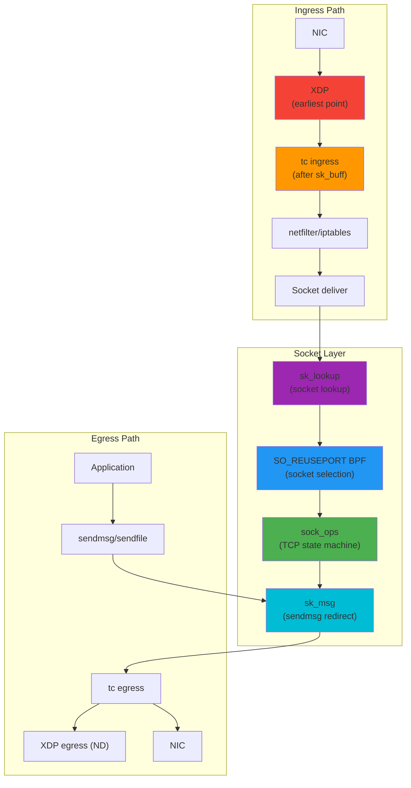
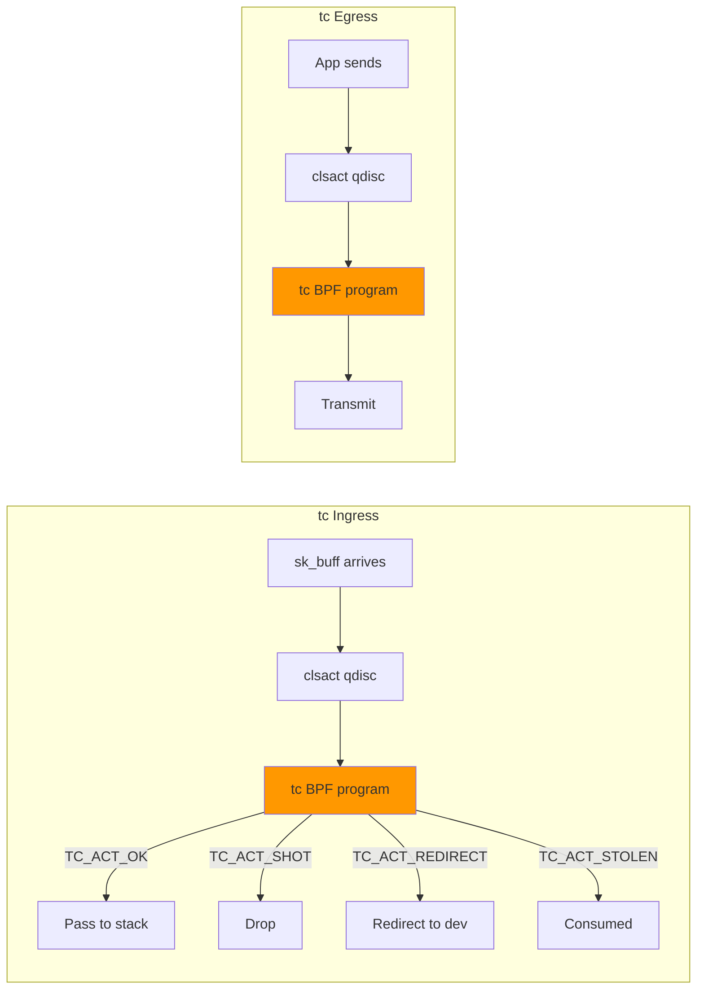
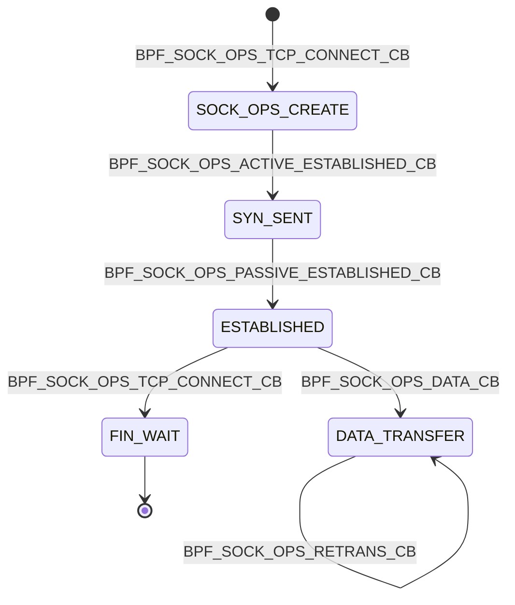
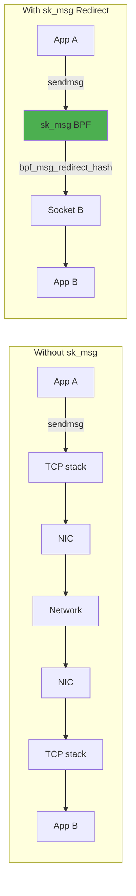
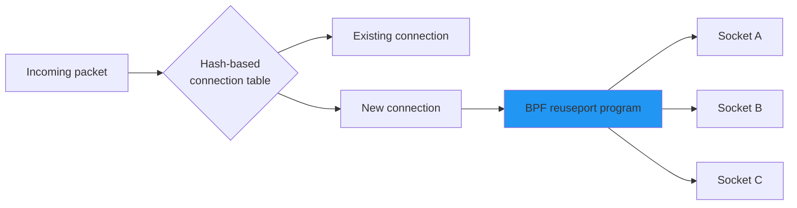
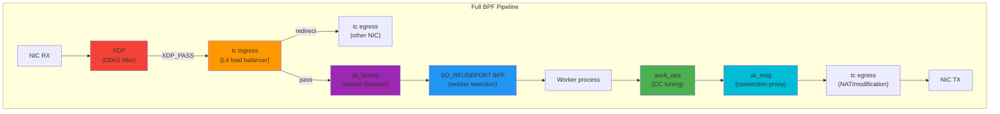

# BPF Networking

## Introduction

BPF (Berkeley Packet Filter) networking refers to the use of eBPF programs attached to various networking hooks in the Linux kernel to inspect, modify, redirect, and make decisions about network traffic. While [XDP](./xdp.md) handles the earliest ingress point and [tc](./tc.md) provides traditional traffic control, BPF networking encompasses a broader set of hooks including `sock_ops`, `sk_msg`, `sk_lookup`, and `SO_REUSEPORT` programs that operate at the socket and transport layers.

These programs enable high-performance, programmable networking without modifying kernel code — powering modern load balancers (Katran, Cilium), service meshes (Cilium, Istio sidecar replacement), DDoS mitigation systems, and network observability platforms.

## BPF Networking Hook Points

### Overview of All Hooks



### Hook Summary Table

| Hook | Attach Point | Direction | Layer | Use Cases |
|------|-------------|-----------|-------|-----------|
| **XDP** | NIC driver | Ingress | L2/L3 | DDoS, firewall, forwarding |
| **tc BPF** | qdisc | Both | L2-L4 | QoS, NAT, monitoring |
| **sock_ops** | TCP socket | Both | L4 (TCP) | Congestion control, metrics |
| **sk_msg** | socket sendmsg | Egress | L4 | Socket redirect, proxy |
| **sk_lookup** | socket lookup | Ingress | L4 | Socket dispatch, multi-listener |
| **SO_REUSEPORT** | socket bind | Ingress | L4 | Load balancing, socket selection |

## tc BPF Programs

tc (traffic control) BPF programs are attached to the kernel's qdisc (queueing discipline) layer. They can inspect and modify packets, enforce rate limiting, and redirect traffic.

### Architecture



### tc Action Return Codes

| Code | Value | Description |
|------|-------|-------------|
| `TC_ACT_OK` | 0 | Allow packet to continue |
| `TC_ACT_RECLASSIFY` | 1 | Reclassify and restart |
| `TC_ACT_SHOT` | 2 | Drop packet |
| `TC_ACT_PIPE` | 3 | Pipe to next action |
| `TC_ACT_STOLEN` | 4 | Consume packet (no stats) |
| `TC_ACT_REDIRECT` | 7 | Redirect to another interface |

### Attaching tc BPF Programs

```bash
# Create clsact qdisc (supports both ingress and egress)
sudo tc qdisc add dev eth0 clsact

# Attach BPF program to ingress
sudo tc filter add dev eth0 ingress bpf direct-action obj tc_prog.o sec classifier

# Attach BPF program to egress
sudo tc filter add dev eth0 egress bpf direct-action obj tc_prog.o sec classifier

# List attached filters
sudo tc filter show dev eth0 ingress

# Remove filter
sudo tc filter del dev eth0 ingress
```

### tc BPF Program Example (C)

```c
// tc_prog.c — Traffic classifier and packet modifier
#include <linux/bpf.h>
#include <bpf/bpf_helpers.h>
#include <linux/pkt_cls.h>
#include <linux/if_ether.h>
#include <linux/ip.h>
#include <linux/tcp.h>

// Map to store per-IP packet counts
struct {
    __uint(type, BPF_MAP_TYPE_HASH);
    __uint(max_entries, 10240);
    __type(key, __u32);      // source IP
    __type(value, __u64);    // packet count
} pkt_count SEC(".maps");

// Map to store rate limit state
struct {
    __uint(type, BPF_MAP_TYPE_HASH);
    __uint(max_entries, 10240);
    __type(key, __u32);      // source IP
    __type(value, __u64);    // timestamp of last packet
} rate_limit SEC(".maps");

SEC("classifier")
int tc_filter(struct __sk_buff *skb)
{
    void *data     = (void *)(long)skb->data;
    void *data_end = (void *)(long)skb->data_end;

    // Parse Ethernet header
    struct ethhdr *eth = data;
    if ((void *)(eth + 1) > data_end)
        return TC_ACT_OK;

    // Only process IPv4
    if (eth->h_proto != __constant_htons(ETH_P_IP))
        return TC_ACT_OK;

    // Parse IP header
    struct iphdr *ip = (void *)(eth + 1);
    if ((void *)(ip + 1) > data_end)
        return TC_ACT_OK;

    __u32 src_ip = ip->saddr;

    // Update packet count
    __u64 *count = bpf_map_lookup_elem(&pkt_count, &src_ip);
    if (count) {
        __sync_fetch_and_add(count, 1);
    } else {
        __u64 init_val = 1;
        bpf_map_update_elem(&pkt_count, &src_ip, &init_val, BPF_ANY);
    }

    // Simple rate limiting: drop if too frequent
    __u64 now = bpf_ktime_get_ns();
    __u64 *last = bpf_map_lookup_elem(&rate_limit, &src_ip);
    if (last && (now - *last) < 1000000) {  // 1ms interval
        return TC_ACT_SHOT;  // Drop
    }
    bpf_map_update_elem(&rate_limit, &src_ip, &now, BPF_ANY);

    // Parse TCP header for port-based decisions
    if (ip->protocol == IPPROTO_TCP) {
        struct tcphdr *tcp = (void *)ip + (ip->ihl * 4);
        if ((void *)(tcp + 1) > data_end)
            return TC_ACT_OK;

        // Mark SSH traffic with a priority (modify DSCP)
        if (tcp->dest == __constant_htons(22)) {
            ip->tos = (ip->tos & 0x03) | 0x20;  // DSCP = 8
        }
    }

    return TC_ACT_OK;
}

char _license[] SEC("license") = "GPL";
```

### Using libbpf to Load tc Programs

```c
// loader.c — Load and attach tc BPF program
#include <bpf/libbpf.h>
#include <bpf/bpf.h>
#include <net/if.h>
#include <linux/pkt_cls.h>

int main(int argc, char **argv)
{
    struct bpf_object *obj;
    struct bpf_program *prog;
    int ifindex = if_nametoindex("eth0");

    // Open and load BPF object
    obj = bpf_object__open_file("tc_prog.o", NULL);
    bpf_object__load(obj);

    // Find the classifier program
    prog = bpf_object__find_program_by_name(obj, "tc_filter");

    // Attach to tc ingress using libbpf's tc attach helper
    DECLARE_LIBBPF_OPTS(bpf_tc_hook, hook,
        .ifindex = ifindex,
        .attach_point = BPF_TC_INGRESS,
    );
    bpf_tc_hook_create(&hook);

    DECLARE_LIBBPF_OPTS(bpf_tc_opts, opts,
        .handle = 1,
        .priority = 1,
        .prog_fd = bpf_program__fd(prog),
    );
    bpf_tc_attach(&hook, &opts);

    printf("tc BPF program attached to eth0 ingress\n");
    // ... cleanup
    return 0;
}
```

## sock_ops Programs

`sock_ops` programs attach to the TCP state machine, providing hooks at every stage of a TCP connection's lifecycle. They can observe and modify socket options, congestion control parameters, and connection metadata.

### sock_ops Hooks



### sock_ops Callback Types

| Callback | When | Use Case |
|----------|------|----------|
| `BPF_SOCK_OPS_TCP_CONNECT_CB` | Active connect | Set CC algorithm per-connection |
| `BPF_SOCK_OPS_ACTIVE_ESTABLISHED_CB` | SYN-ACK received | Connection tracking |
| `BPF_SOCK_OPS_PASSIVE_ESTABLISHED_CB` | Passive open | Server-side tracking |
| `BPF_SOCK_OPS_RWND_CB` | Window update | Flow control tuning |
| `BPF_SOCK_OPS_RTO_CB` | Retransmission timeout | Congestion monitoring |
| `BPF_SOCK_OPS_RETRANS_CB` | Retransmission | Loss detection |
| `BPF_SOCK_OPS_STATE_CB` | State change | Connection lifecycle |

### sock_ops Program Example

```c
// sock_ops_monitor.c — TCP connection monitoring
#include <linux/bpf.h>
#include <bpf/bpf_helpers.h>
#include <linux/bpf.h>

// Store connection info
struct conn_info {
    __u32 saddr;
    __u32 daddr;
    __u16 sport;
    __u16 dport;
    __u32 bytes_sent;
    __u32 bytes_received;
    __u32 retransmissions;
    __u64 established_ns;
};

struct {
    __uint(type, BPF_MAP_TYPE_SK_STORAGE);
    __uint(map_flags, BPF_F_NO_PREALLOC);
    __type(key, int);
    __type(value, struct conn_info);
} conn_map SEC(".maps");

SEC("sockops")
int tcp_monitor(struct bpf_sock_ops *skops)
{
    int op = skops->op;
    struct conn_info *info;

    switch (op) {
    case BPF_SOCK_OPS_ACTIVE_ESTABLISHED_CB:
    case BPF_SOCK_OPS_PASSIVE_ESTABLISHED_CB:
        // Initialize connection tracking
        info = bpf_sk_storage_get(&conn_map, skops->sk, 0,
                                  BPF_SK_STORAGE_GET_F_CREATE);
        if (!info)
            break;

        info->saddr = skops->local_ip4;
        info->daddr = skops->remote_ip4;
        info->sport = skops->local_port;
        info->dport = bpf_ntohl(skops->remote_port);
        info->bytes_sent = 0;
        info->bytes_received = 0;
        info->retransmissions = 0;
        info->established_ns = bpf_ktime_get_ns();

        // Set congestion control algorithm for this connection
        bpf_setsockopt(skops, SOL_TCP, TCP_CONGESTION,
                       "bbr", sizeof("bbr"));
        break;

    case BPF_SOCK_OPS_RETRANS_CB:
        info = bpf_sk_storage_get(&conn_map, skops->sk, 0, 0);
        if (info)
            info->retransmissions++;
        break;

    case BPF_SOCK_OPS_STATE_CB:
        if (skops->args[1] == BPF_TCP_CLOSE) {
            // Connection closing — could push to perf event
            bpf_sk_storage_delete(&conn_map, skops->sk);
        }
        break;
    }

    return 1;
}

char _license[] SEC("license") = "GPL";
```

### Attaching sock_ops Programs

```bash
# Load and attach to a cgroup (all sockets in the cgroup)
bpftool prog load sock_ops_monitor.o /sys/fs/bpf/sock_ops_monitor
bpftool net attach sockops id $(bpftool prog show name tcp_monitor -j | jq .id) \
    pinned /sys/fs/cgroup/unified/

# Or with libbpf:
# struct bpf_link *link = bpf_program__attach_sockops(prog, cgroup_fd);
```

## sk_msg Programs

`sk_msg` programs intercept `sendmsg()` and `sendfile()` calls, allowing BPF programs to redirect messages between sockets without passing through the full network stack. This is the foundation of BPF-based socket-level proxies and load balancers.

### sk_msg Architecture



### sk_msg Program Example

```c
// sk_msg_redirect.c — Redirect messages between sockets
#include <linux/bpf.h>
#include <bpf/bpf_helpers.h>
#include <linux/tcp.h>

// Map storing socket references for redirect
struct {
    __uint(type, BPF_MAP_TYPE_SOCKHASH);
    __uint(max_entries, 65535);
    __type(key, __u32);    // cookie or identifier
    __type(value, __u64);  // socket cookie
} sock_map SEC(".maps");

SEC("sk_msg")
int sk_msg_redirect(struct sk_msg_md *msg)
{
    __u32 key = msg->local_port;  // Use local port as key

    // Look up destination socket
    __u64 *dst_cookie = bpf_map_lookup_elem(&sock_map, &key);
    if (!dst_cookie)
        return SK_PASS;  // No redirect, pass normally

    // Redirect message to the target socket
    bpf_msg_redirect_hash(msg, &sock_map, &key, BPF_F_INGRESS);

    return SK_PASS;
}

char _license[] SEC("license") = "GPL";
```

### Use Cases for sk_msg

1. **Service mesh sidecar proxy** — Redirect app traffic to a proxy socket
2. **TCP splicing** — Forward data between connections without copying to userspace
3. **Load balancing** — Distribute connections across backend sockets
4. **Protocol-aware routing** — Inspect payload to route to different backends

```c
// Protocol-aware routing example
SEC("sk_msg")
int protocol_router(struct sk_msg_md *msg)
{
    // Check first bytes of payload for HTTP method
    char method[4] = {};
    bpf_msg_pull_data(msg, 0, 4, 0);
    if (msg->data_end - msg->data >= 4) {
        __builtin_memcpy(method, (void *)msg->data, 4);

        __u32 key;
        if (method[0] == 'G' && method[1] == 'E' && method[2] == 'T') {
            key = 1;  // GET backend
        } else if (method[0] == 'P' && method[1] == 'O') {
            key = 2;  // POST backend
        } else {
            key = 0;  // Default backend
        }

        bpf_msg_redirect_hash(msg, &sock_map, &key, BPF_F_INGRESS);
    }

    return SK_PASS;
}
```

## sk_lookup Programs

`sk_lookup` programs (also called `BPF_PROG_TYPE_SK_LOOKUP`) run when the kernel needs to find a socket to deliver an incoming packet to. They override the default socket lookup, enabling custom dispatch logic for multi-listener servers and socket sharing across processes.

### Problem sk_lookup Solves

```mermaid
graph TB
    subgraph "Traditional: Single Listener"
        PKT1[Incoming packet :80] --> BIND1[bind(:80)]
        BIND1 --> PROC1[Single process]
    end

    subgraph "SO_REUSEPORT: Round-Robin"
        PKT2[Incoming packet :80] --> RR[Round-robin]
        RR --> PROC2[Process 1 :80]
        RR --> PROC3[Process 2 :80]
        RR --> PROC4[Process 3 :80]
    end

    subgraph "sk_lookup: Custom Dispatch"
        PKT3[Incoming packet :80] --> SK_LU[sk_lookup BPF]
        SK_LU -->|by tenant| PROC5[Tenant A socket]
        SK_LU -->|by tenant| PROC6[Tenant B socket]
        SK_LU -->|fallback| PROC7[Default socket]
    end

    style SK_LU fill:#9C27B0
```

### sk_lookup Program Example

```c
// sk_lookup_multi.c — Dispatch connections by source IP
#include <linux/bpf.h>
#include <bpf/bpf_helpers.h>
#include <linux/in.h>
#include <linux/net.h>
#include <linux/tcp.h>

// Map: tenant subnet → socket
struct {
    __uint(type, BPF_MAP_TYPE_SOCKMAP);
    __uint(max_entries, 256);
    __type(key, __u32);   // tenant ID (derived from source IP)
    __type(value, __u64); // socket cookie
} tenant_sockets SEC(".maps");

// Fallback socket
struct {
    __uint(type, BPF_MAP_TYPE_SOCKMAP);
    __uint(max_entries, 1);
    __type(key, __u32);
    __type(value, __u64);
} default_socket SEC(".maps");

SEC("sk_lookup")
int dispatch_by_tenant(struct bpf_sk_lookup *ctx)
{
    struct bpf_sock *sk;
    __u32 tenant_key;

    // Only handle TCP
    if (ctx->protocol != IPPROTO_TCP)
        return SK_PASS;

    // Derive tenant ID from source IP (simple example)
    // Real world: look up tenant mapping
    tenant_key = ctx->ip4 >> 24;  // First octet as rough grouping

    // Try tenant-specific socket first
    sk = bpf_sk_lookup_tcp(ctx, &tenant_key, sizeof(tenant_key),
                           BPF_F_CURRENT_NETNS, 0);
    if (sk) {
        bpf_sk_assign(ctx, sk, 0);
        bpf_sk_release(sk);
        return SK_PASS;
    }

    // Fallback to default socket
    __u32 def_key = 0;
    sk = bpf_sk_lookup_tcp(ctx, &def_key, sizeof(def_key),
                           BPF_F_CURRENT_NETNS, 0);
    if (sk) {
        bpf_sk_assign(ctx, sk, 0);
        bpf_sk_release(sk);
    }

    return SK_PASS;
}

char _license[] SEC("license") = "GPL";
```

### Attaching sk_lookup

```bash
# Load program
bpftool prog load sk_lookup_multi.o /sys/fs/bpf/dispatch

# Attach to a network namespace
bpftool net attach sk_lookup pinned /sys/fs/bpf/dispatch tag <tag>

# With libbpf:
# link = bpf_program__attach_sk_lookup(prog, netns_fd);
```

## SO_REUSEPORT BPF Programs

`SO_REUSEPORT` allows multiple sockets to bind to the same port. The kernel normally distributes incoming connections across them using a hash. With a BPF program attached, you can implement custom load-balancing logic.

### BPF_PROG_TYPE_SK_REUSEPORT



### SO_REUSEPORT BPF Example

```c
// reuseport_lb.c — Application-level load balancer
#include <linux/bpf.h>
#include <bpf/bpf_helpers.h>
#include <linux/in.h>
#include <linux/ip.h>
#include <linux/tcp.h>

struct {
    __uint(type, BPF_MAP_TYPE_REUSEPORT_SOCKARRAY);
    __uint(max_entries, 32);
    __type(key, __u32);
    __type(value, __u64);  // socket cookie
} socks SEC(".maps");

struct {
    __uint(type, BPF_MAP_TYPE_ARRAY);
    __uint(max_entries, 1);
    __type(key, __u32);
    __type(value, __u32);  // round-robin counter
} rr_state SEC(".maps");

SEC("sk_reuseport")
int reuseport_select(struct sk_reuseport_md *ctx)
{
    // Get number of available sockets
    __u32 num_socks = ctx->max_sockets;
    if (num_socks == 0)
        return SK_PASS;

    // Round-robin selection
    __u32 key = 0;
    __u32 *counter = bpf_map_lookup_elem(&rr_state, &key);
    if (!counter)
        return SK_PASS;

    __u32 idx = __sync_fetch_and_add(counter, 1) % num_socks;

    // Select the socket at index idx
    int *selected = bpf_map_lookup_elem(&socks, &idx);
    if (selected) {
        return SK_PASS;  // Kernel uses this socket
    }

    return SK_PASS;  // Fallback to default
}

char _license[] SEC("license") = "GPL";
```

### Setting Up SO_REUSEPORT with BPF

```c
// Server-side setup
int main(void)
{
    int num_workers = 4;

    // Create reuseport socket group
    for (int i = 0; i < num_workers; i++) {
        int fd = socket(AF_INET, SOCK_STREAM, 0);

        int opt = 1;
        setsockopt(fd, SOL_SOCKET, SO_REUSEPORT, &opt, sizeof(opt));

        struct sockaddr_in addr = {
            .sin_family = AF_INET,
            .sin_port = htons(8080),
            .sin_addr.s_addr = INADDR_ANY,
        };
        bind(fd, (struct sockaddr *)&addr, sizeof(addr));

        // Add socket to BPF map
        __u32 key = i;
        __u64 cookie;
        bpf_getsockopt(fd, SOL_SOCKET, SO_COOKIE, &cookie, sizeof(cookie));
        bpf_map_update_elem(sock_map_fd, &key, &cookie, BPF_ANY);

        // Attach reuseport BPF program
        setsockopt(fd, SOL_SOCKET, SO_ATTACH_REUSEPORT_EBPF,
                   &prog_fd, sizeof(prog_fd));

        listen(fd, 128);

        // Fork worker process
        if (fork() == 0) {
            // Worker: accept and handle connections
            while (1) {
                int conn = accept(fd, NULL, NULL);
                handle_connection(conn);
            }
        }
    }

    // Parent: wait for workers
    while (1) wait(NULL);
}
```

## Combined BPF Networking Pipeline

Real-world BPF networking solutions combine multiple hook types:



### Cilium's BPF Pipeline (Example)

Cilium uses all these hooks for its service mesh:

```bash
# Cilium's BPF programs (simplified)
bpftool prog show | grep cilium

# XDP: DDoS protection and fast-path forwarding
# tc ingress: Service load balancing (L3/L4), NAT
# sock_ops: Connection tracking, socket-level load balancing
# sk_msg: Transparent proxy (socket-level redirect)
# sk_lookup: Socket dispatch for multi-listener
# cgroup/connect4/6: Intercept connect() for service resolution
# cgroup/sendmsg4/6: Intercept UDP for service resolution
```

## Performance Considerations

### BPF vs. iptables/nftables

```mermaid
graph LR
    subgraph "iptables Path"
        IP_PKT1[Packet] --> IP_TABLES[iptables rules]
        IP_TABLES --> IP_MATCH{Linear match}
        IP_MATCH --> IP_VERDICT[Drop/Accept]
    end

    subgraph "BPF Path"
        BPF_PKT1[Packet] --> BPF_PROG[JIT-compiled BPF]
        BPF_PROG --> BPF_MAP[Map lookup O(1)]
        BPF_MAP --> BPF_VERDICT[Drop/Accept/Redirect]
    end

    style IP_MATCH fill:#F44336
    style BPF_MAP fill:#4CAF50
```

| Aspect | iptables/nftables | BPF |
|--------|-------------------|-----|
| **Matching** | Linear chain traversal | O(1) map lookup |
| **Programmability** | Fixed rule syntax | Full C/Rust programs |
| **JIT** | No | Yes, native code |
| **Redirect** | Complex (ip rule, etc.) | `bpf_redirect()` |
| **Per-packet overhead** | ~100ns+ | ~10-50ns |
| **State tracking** | conntrack (kernel) | Custom BPF maps |

### Map Performance Tips

```c
// Use per-CPU maps for high-frequency counters
struct {
    __uint(type, BPF_MAP_TYPE_PERCPU_HASH);
    __uint(max_entries, 100000);
    __type(key, __u32);
    __type(value, struct stats);
} percpu_stats SEC(".maps");

// Use LRU maps for automatic eviction
struct {
    __uint(type, BPF_MAP_TYPE_LRU_HASH);
    __uint(max_entries, 1000000);
    __type(key, __u32);
    __type(value, struct flow_data);
} flow_table SEC(".maps");

// Use array maps for fixed-index fast lookup
struct {
    __uint(type, BPF_MAP_TYPE_PERCPU_ARRAY);
    __uint(max_entries, 256);
    __type(key, __u32);
    __type(value, __u64);
} counters SEC(".maps");
```

## BPF CO-RE for Networking

BPF Compile Once — Run Everywhere (CO-RE) allows networking programs to work across kernel versions:

```c
// CO-RE: Access kernel struct fields portably
#include <vmlinux.h>
#include <bpf/bpf_helpers.h>
#include <bpf/bpf_core_read.h>

SEC("sockops")
int co_re_sockops(struct bpf_sock_ops *skops)
{
    // Access kernel struct tcp_sock fields via CO-RE
    struct tcp_sock *tcp = (void *)skops->sk;

    // BPF_CORE_READ handles field offsets across kernel versions
    __u32 snd_cwnd = BPF_CORE_READ(tcp, snd_cwnd);
    __u32 srtt = BPF_CORE_READ(tcp, srtt_us);

    // Store metrics
    struct tcp_metrics metrics = {
        .cwnd = snd_cwnd,
        .rtt = srtt >> 3,  // srtt is in 1/8 microsecond units
    };

    return 1;
}
```

## Tools for BPF Networking

### bpftool

```bash
# List all BPF programs
bpftool prog show

# List all maps
bpftool map show

# Dump map contents
bpftool map dump name pkt_count

# Show program attached to network
bpftool net show

# Pin a program for persistence
bpftool prog pin id 42 /sys/fs/bpf/my_prog

# Attach to tc
bpftool net attach tc pinned /sys/fs/bpf/my_prog dev eth0 ingress
```

### bpftrace One-Liners

```bash
# Trace all TCP connections
bpftrace -e 'kprobe:tcp_connect { printf("%s → %s\n", comm, ntop(((struct sock *)arg0)->__sk_common.skc_daddr)); }'

# Count packets per protocol
bpftrace -e 'tracepoint:net:netif_receive_skb { @proto[args->protocol] = count(); }'

# Trace socket-level events
bpftrace -e 'tracepoint:sock:inet_sock_set_state { printf("%s %s → %s\n", comm, args->oldstate, args->newstate); }'

# Measure TCP retransmissions
bpftrace -e 'kprobe:tcp_retransmit_skb { @retrans[comm] = count(); }'
```

## Kernel Source References

| File | Description |
|------|-------------|
| `net/core/filter.c` | tc BPF, socket BPF program types |
| `net/core/sock_map.c` | sock_ops, sk_msg, sock map |
| `net/core/skmsg.c` | sk_msg infrastructure |
| `net/ipv4/tcp_bpf.c` | TCP-specific BPF hooks |
| `net/core/bpf_sk_lookup.c` | sk_lookup program type |
| `tools/testing/selftests/bpf/` | BPF selftests (many networking examples) |

## Further Reading

- [BPF and XDP Reference Guide](https://docs.cilium.io/en/stable/bpf/) — Cilium's comprehensive BPF guide
- [BPF CO-RE Reference](https://nakryiko.com/posts/bpf-core-reference-guide/)
- [Kernel BPF Documentation](https://docs.kernel.org/bpf/index.html)
- [libbpf Examples](https://github.com/libbpf/libbpf-bootstrap)
- [BPF Performance Tools](http://www.brendangregg.com/bpf-performance-tools-book.html)
- Kernel source: `net/core/filter.c`, `net/core/sock_map.c`
