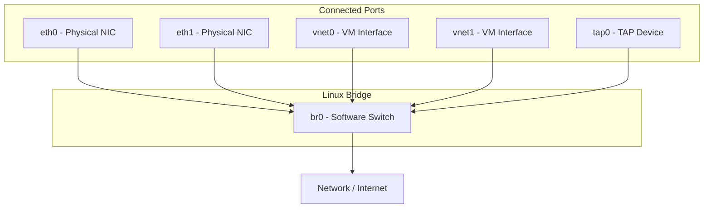
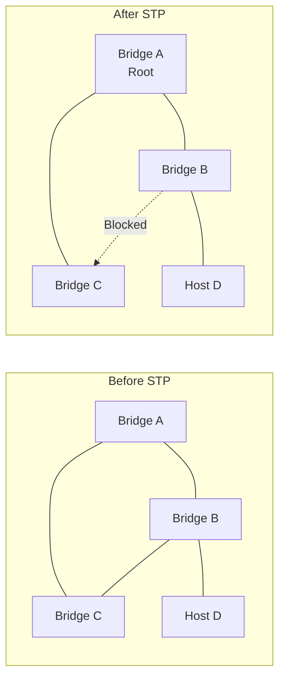

# Linux Bridge

## Introduction

A Linux bridge is a software switch that forwards Ethernet frames between connected network interfaces based on MAC addresses. It operates at Layer 2 (Data Link) of the OSI model, learning which MAC addresses are behind each port and forwarding frames only to the appropriate destination port — just like a physical Ethernet switch.

Linux bridging is fundamental to modern virtualization and containerization. KVM/QEMU virtual machines connect to the host network through bridges. Docker and Kubernetes use bridges (docker0, cbr0) for container networking. Linux bridges also support STP (Spanning Tree Protocol), VLAN filtering, and various offload capabilities, making them suitable for production use.

## Bridge Architecture



## Creating and Managing Bridges

### Using iproute2 (Preferred)

```bash
# Create a bridge
ip link add name br0 type bridge

# Set bridge parameters
ip link set br0 type bridge ageing_time 30000
ip link set br0 type bridge stp_state 1
ip link set br0 type bridge vlan_filtering 1

# Add interfaces to the bridge
ip link set eth0 master br0
ip link set eth1 master br0
ip link set tap0 master br0

# Assign IP address to the bridge
ip addr add 192.168.1.100/24 dev br0

# Bring everything up
ip link set eth0 up
ip link set eth1 up
ip link set br0 up

# Remove interface from bridge
ip link set eth0 nomaster

# Delete bridge
ip link del br0
```

### Using bridge Command

The `bridge` utility (part of iproute2) provides bridge-specific management:

```bash
# Show bridge details
bridge link show
# 3: eth0: <BROADCAST,MULTICAST,UP,LOWER_UP> mtu 1500 master br0 state forwarding priority 32 cost 100
# 4: eth1: <BROADCAST,MULTICAST,UP,LOWER_UP> mtu 1500 master br0 state forwarding priority 32 cost 100
# 5: tap0: <BROADCAST,MULTICAST,UP,LOWER_UP> mtu 1500 master br0 state forwarding priority 32 cost 100

# Show FDB (forwarding database / MAC table)
bridge fdb show
# 00:11:22:33:44:55 dev eth0 master br0
# 66:77:88:99:aa:bb dev eth1 master br0
# ff:ff:ff:ff:ff:ff dev eth0 master br0 permanent

# Add static FDB entry
bridge fdb add de:ad:be:ef:00:01 dev eth0 master br0

# Delete FDB entry
bridge fdb del de:ad:be:ef:00:01 dev eth0 master br0

# Show MAC table count
bridge fdb show | wc -l

# Show bridge VLAN info
bridge vlan show
# port    vlan ids
# eth0     1 PVID Egress Untagged
# eth1     1 PVID Egress Untagged
# tap0     1 PVID Egress Untagged

# Add VLAN to port
bridge vlan add dev eth0 vid 100
bridge vlan add dev eth0 vid 100 pvid untagged

# Remove VLAN from port
bridge vlan del dev eth0 vid 100
```

### Using brctl (Legacy)

The `brctl` command is the legacy bridge management tool. It still works but is deprecated:

```bash
# Create bridge
brctl addbr br0

# Add interfaces
brctl addif br0 eth0
brctl addif br0 eth1

# Show bridge status
brctl show
# bridge name    bridge id           STP enabled    interfaces
# br0            8000.001122334455   yes            eth0
#                                                   eth1

# Show MAC table
brctl showmacs br0
# port no    mac addr                is local?   ageing timer
#  1         00:11:22:33:44:55       yes          0.00
#  2         66:77:88:99:aa:bb       no           3.12

# Enable/disable STP
brctl stp br0 on
brctl stp br0 off

# Set bridge parameters
brctl setageing br0 30
brctl setfd br0 15

# Remove interface
brctl delif br0 eth0

# Delete bridge
brctl delbr br0
```

## STP (Spanning Tree Protocol)

STP prevents loops in networks with redundant bridges/switches. When multiple paths exist between two points, STP blocks redundant paths to prevent broadcast storms.

### How STP Works



### STP Configuration

```bash
# Enable STP
ip link set br0 type bridge stp_state 1

# Or via brctl
brctl stp br0 on

# Set bridge priority (lower = more likely root bridge, default 32768)
ip link set br0 type bridge priority 4096

# Set port priority (lower = preferred, default 128)
ip link set eth0 type bridge_slave priority 10
ip link set eth1 type bridge_slave priority 20

# Set path cost (lower = preferred path)
ip link set eth0 type bridge_slave cost 100
ip link set eth1 type bridge_slave cost 200

# Forward delay (time in listening/learning state, in 1/100 seconds)
ip link set br0 type bridge forward_delay 1500

# Hello time (STP BPDU interval)
ip link set br0 type bridge hello_time 200

# Max age (BPDU validity period)
ip link set br0 type bridge max_age 2000

# View STP status
bridge link show
# port states: disabled, listening, learning, forwarding, blocking

cat /sys/class/net/br0/bridge/stp_state
# 1
```

### RSTP (Rapid STP)

RSTP (802.1w) provides faster convergence than classic STP:

```bash
# RSTP is enabled by default when STP is on in modern kernels
ip link set br0 type bridge stp_state 1
# Modern kernels use RSTP automatically

# View STP protocol in use
bridge -d link show | grep -i "state"
```

## VLAN Filtering

Linux bridges support IEEE 802.1Q VLAN filtering, allowing the bridge to act as a VLAN-aware switch:

```bash
# Enable VLAN filtering
ip link set br0 type bridge vlan_filtering 1

# View current VLAN configuration
bridge vlan show
# port    vlan ids
# eth0     1 PVID Egress Untagged
# eth1     1 PVID Egress Untagged
# br0      1 PVID Egress Untagged

# Add VLAN 100 to eth0, tagged
bridge vlan add dev eth0 vid 100

# Add VLAN 100 to eth0, untagged (access port)
bridge vlan add dev eth0 vid 100 pvid untagged

# Remove default VLAN 1 from port
bridge vlan del dev eth0 vid 1

# Add multiple VLANs (trunk port)
bridge vlan add dev eth1 vid 100
bridge vlan add dev eth1 vid 200
bridge vlan add dev eth1 vid 300

# Show VLAN details
bridge -d vlan show
# port    vlan ids
# eth0     100 PVID Egress Untagged
# eth1     100
#          200
#          300

# Self port (bridge itself as VLAN member)
bridge vlan add dev br0 vid 100 self
```

### VLAN-Aware Bridge Example

```bash
# Create VLAN-aware bridge
ip link add name br0 type bridge vlan_filtering 1

# eth0: trunk port carrying VLANs 100, 200
ip link set eth0 master br0
bridge vlan add dev eth0 vid 100
bridge vlan add dev eth0 vid 200
bridge vlan del dev eth0 vid 1  # remove default VLAN

# tap0 (VM): access port on VLAN 100
ip link set tap0 master br0
bridge vlan add dev tap0 vid 100 pvid untagged
bridge vlan del dev tap0 vid 1

# tap1 (VM): access port on VLAN 200
ip link set tap1 master br0
bridge vlan add dev tap1 vid 200 pvid untagged
bridge vlan del dev tap1 vid 1
```

## Bridge in Virtualization

### KVM/QEMU with Bridged Networking

```bash
# 1. Create bridge
ip link add name br0 type bridge
ip link set br0 up

# 2. Move host IP to bridge
ip addr del 192.168.1.100/24 dev eth0
ip addr add 192.168.1.100/24 dev br0
ip link set eth0 master br0
ip route add default via 192.168.1.1 dev br0

# 3. Launch VM with bridge
qemu-system-x86_64 \
    -m 2048 \
    -netdev bridge,id=net0,br=br0 \
    -device virtio-net-pci,netdev=net0 \
    disk.qcow2

# Or with tap device manually
ip tuntap add dev tap0 mode tap
ip link set tap0 master br0
ip link set tap0 up
qemu-system-x86_64 \
    -netdev tap,id=net0,ifname=tap0,script=no,downscript=no \
    -device virtio-net-pci,netdev=net0 \
    disk.qcow2
```

### Docker Bridge Networking

```bash
# Docker creates docker0 bridge by default
ip link show docker0
# docker0: <BROADCAST,MULTICAST,UP,LOWER_UP> mtu 1500

bridge link show | grep docker
# veth1234@if5: <BROADCAST,MULTICAST,UP,LOWER_UP> mtu 1500 master docker0 state forwarding

# Custom bridge network
docker network create --driver bridge \
    --subnet 172.20.0.0/16 \
    --gateway 172.20.0.1 \
    mybridge

# Run container on custom bridge
docker run --network mybridge --ip 172.20.0.10 -it ubuntu
```

### Libvirt Bridged Network

```xml
<!-- /etc/libvirt/qemu/networks/br0.xml -->
<network>
  <name>br0</name>
  <forward mode="bridge"/>
  <bridge name="br0"/>
</network>
```

```bash
virsh net-define br0.xml
virsh net-start br0
virsh net-autostart br0
```

## Bridge Offloading

Modern NICs support bridge offloading, where the hardware performs switching functions:

```bash
# Check if hardware offloading is available
ethtool -k eth0 | grep -i switch
# switchdev: on

# Enable bridge hardware offloading (for supported NICs)
ip link set eth0 type bridge_slave hwmode on
# or for switchdev mode
devlink dev eswitch set pci/0000:03:00.0 mode switchdev

# View offload status
bridge -d link show | grep -i offload
# eth0: <...> master br0 ... offload yes
```

## Bridge Monitoring

```bash
# Show bridge status
ip -d link show br0
# br0: <BROADCAST,MULTICAST,UP,LOWER_UP> mtu 1500 ...
#     bridge forward_delay 1500 hello_time 200 max_age 2000
#     vlan_filtering 1 vlan_protocol 802.1Q

# Show MAC address table
bridge fdb show dev br0

# Count learned MACs
bridge fdb show | grep -v permanent | wc -l

# Monitor FDB changes
bridge monitor fdb

# Monitor link state changes
bridge monitor

# Bridge statistics
ip -s link show br0

# Show bridge port states
bridge -d link show
```

## Per-VLAN Spanning Tree (PVST)

```bash
# Linux bridge supports per-VLAN STP (PVST)
# With VLAN filtering enabled, STP runs per VLAN

# Set per-VLAN STP state
bridge vlan dev eth0 vid 100 state 3  # 0=disabled, 1=listening, 2=learning, 3=forwarding
```

## Bridge Internals

The Linux bridge is implemented in `net/bridge/` and uses:

- **Hash table** for FDB (MAC learning table)
- **Port state machine** for STP (listening → learning → forwarding)
- **VLAN database** per port for VLAN filtering
- **Netfilter hooks** for ebtables integration
- **Switchdev API** for hardware offloading

```bash
# View bridge internals via debugfs
ls /sys/kernel/debug/br0/
#  br0/hash_size
#  br0/group_fwd_mask

# View bridge FDB hash table details
cat /sys/class/net/br0/bridge/hash_max
# 4096
```

## References

- [Kernel Bridge Documentation](https://docs.kernel.org/networking/bridge.html)
- [Linux Foundation: Bridge](https://wiki.linuxfoundation.org/networking/bridge)
- [man-pages: bridge(8)](https://man7.org/linux/man-pages/man8/bridge.8.html)
- [IEEE 802.1D — Spanning Tree](https://standards.ieee.org/standard/802_1D-2004.html)
- [IEEE 802.1Q — VLANs](https://standards.ieee.org/standard/802_1Q-2018.html)
- [Red Hat: Configuring Network Bridging](https://docs.redhat.com/en/documentation/red_hat_enterprise_linux/9/html/configuring_and_managing_networking/configuring-a-network-bridge_configuring-and-managing-networking)

## Related Topics

- [Network Bonding](./bonding.md) — Link aggregation
- [VLANs](./vlans.md) — 802.1Q VLAN interfaces
- [Network Namespaces](./namespaces.md) — Isolated network stacks
- [Traffic Control](./tc.md) — QoS on bridge ports
- [Netlink](./netlink.md) — Programmatic bridge management
