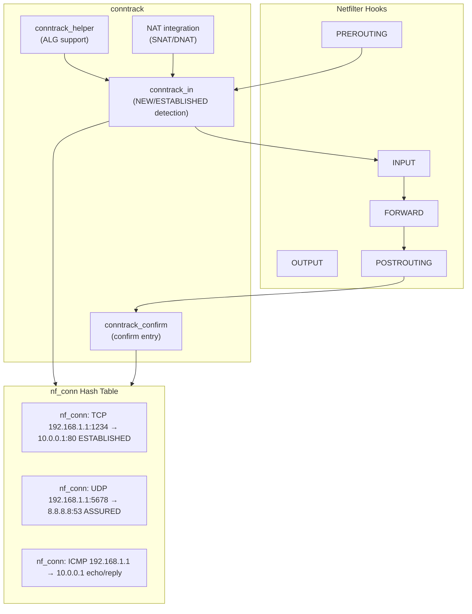
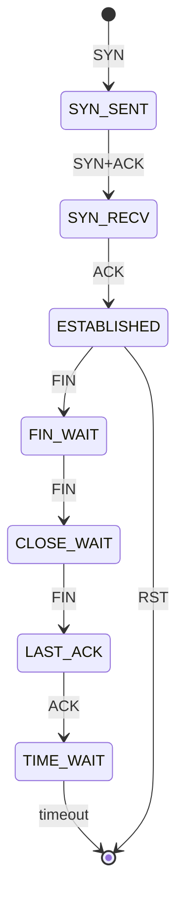
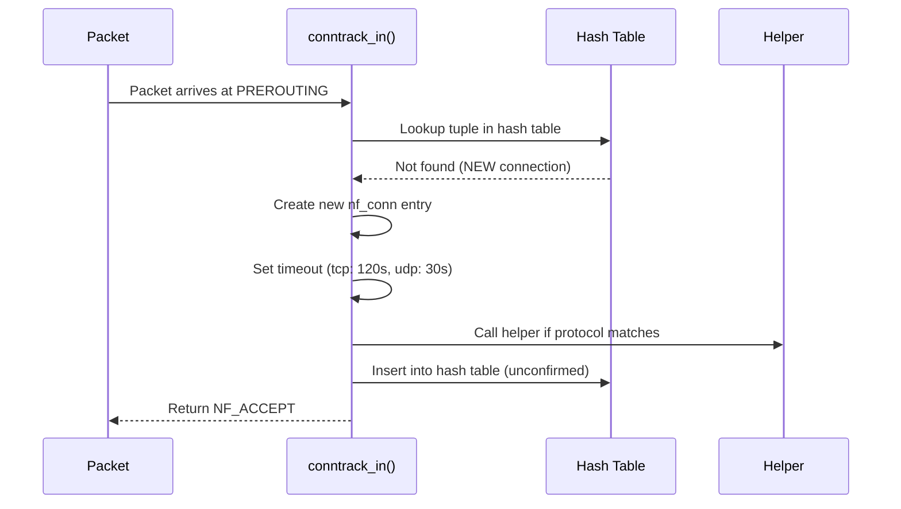
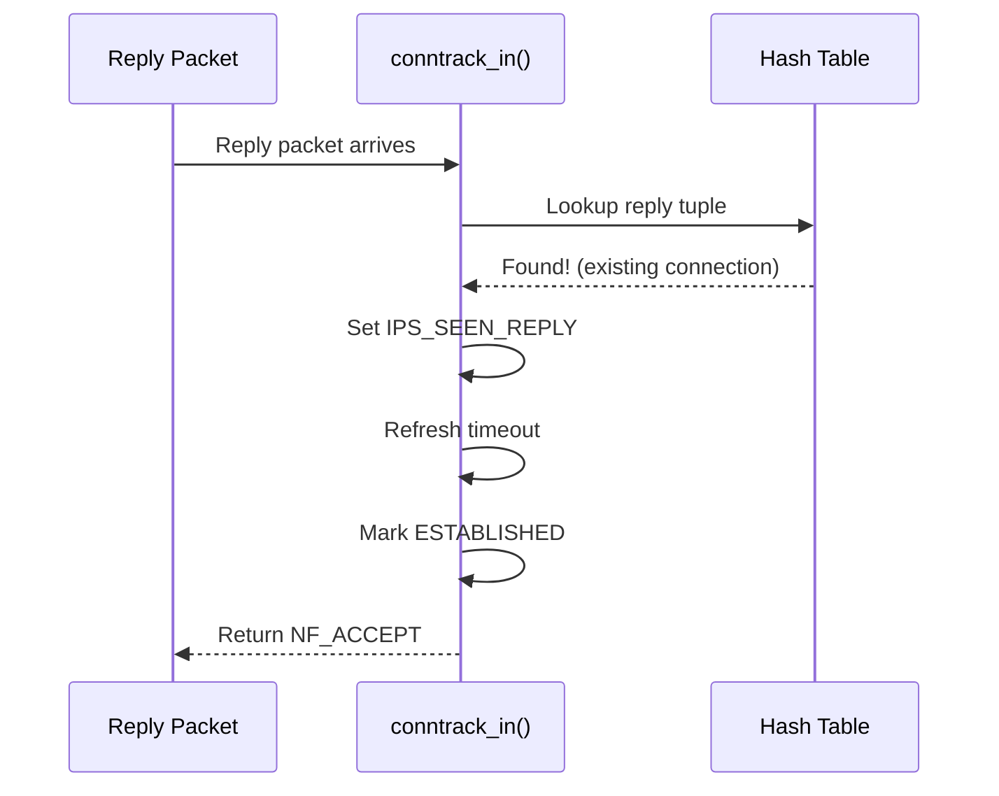
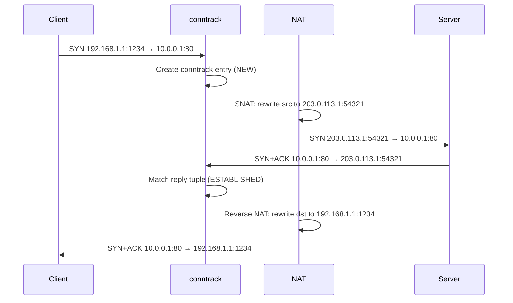

# Connection Tracking (conntrack)

## Overview

Connection tracking (conntrack) is the netfilter subsystem that monitors and tracks the state of all network connections passing through the Linux kernel. It examines every packet to determine which connection it belongs to and what state that connection is in. conntrack is the foundation for stateful firewalls (nftables, iptables), NAT, and ALG (Application Layer Gateways).

conntrack tracks connections for TCP, UDP, ICMP, and other protocols by maintaining a hash table of connection entries (`nf_conn`). Each entry records the source/destination addresses, ports, protocol state, and timestamps.

> **Source:** `net/netfilter/nf_conntrack_core.c`  
> **Module:** `nf_conntrack`  
> **Key structures:** `struct nf_conn`, `struct nf_conntrack_tuple`

---

## Architecture



---

## Connection States

### Generic States (All Protocols)

| State | Meaning |
|-------|---------|
| `NEW` | First packet seen, no reply yet |
| `ESTABLISHED` | Reply packet seen (bidirectional traffic confirmed) |
| `RELATED` | New connection related to an existing one (e.g., FTP data channel) |
| `INVALID` | Packet doesn't belong to any known connection |

### TCP-Specific States

TCP tracking is more granular, following the TCP state machine:



| conntrack TCP State | TCP Flag | Meaning |
|---------------------|----------|---------|
| `SYN_SENT` | SYN | Connection initiated |
| `SYN_RECV` | SYN+ACK | SYN acknowledged |
| `ESTABLISHED` | ACK | Connection established |
| `FIN_WAIT` | FIN | Closing initiated |
| `CLOSE_WAIT` | FIN received | Remote closing |
| `LAST_ACK` | FIN+ACK | Final close |
| `TIME_WAIT` | ACK | Waiting for stray packets |
| `NONE` | — | Unknown state |

---

## Key Data Structures

### struct nf_conn

Each tracked connection is represented by:

```c
/* include/net/netfilter/nf_conntrack.h */
struct nf_conn {
    struct nf_conntrack ct_general;    /* Refcount, extension list */

    /* Tuple hash entries (reply and original direction) */
    struct nf_conntrack_tuple_hash tuplehash[IP_CT_DIR_MAX];

    /* Connection status (IPS_*) */
    unsigned long status;

    /* Timeout in jiffies */
    unsigned long timeout;

    /* Protocol-specific data (TCP state, etc.) */
    union nf_conntrack_proto proto;

    /* NAT manipulation data */
    struct nf_conn_nat __rcu *nat;

    /* Helper (ALG) */
    struct nf_conn_help __rcu *helper;

    /* Mark and labels */
    u32 mark;
    u32 secmark;

    /* Extension list (labels, timeout, acct, etc.) */
    struct nf_ct_ext *ext;
};
```

### Connection Status Bits (IPS_*)

```c
/* include/uapi/linux/netfilter/nf_conntrack_common.h */
enum ip_conntrack_info {
    IP_CT_NEW,            /* New connection */
    IP_CT_RELATED,        /* Related to existing connection */
    IP_CT_ESTABLISHED,    /* Established connection */
    IP_CT_IS_REPLY,       /* Reply direction */
    /* ... */
};

/* Connection status flags */
IPS_SEEN_REPLY_BIT      /* Reply packet seen */
IPS_ASSURED_BIT         /* Connection is assured (won't be evicted) */
IPS_CONFIRMED_BIT       /* Entry is in the hash table */
IPS_SRC_NAT_BIT         /* Source NAT applied */
IPS_DST_NAT_BIT         /* Destination NAT applied */
IPS_DYING_BIT           /* Entry is being destroyed */
IPS_FIXED_TIMEOUT_BIT   /* Timeout is fixed (not refreshed) */
```

### Conntrack Tuple

A **tuple** uniquely identifies a packet's 5-tuple:

```c
/* include/net/netfilter/nf_conntrack_tuple.h */
struct nf_conntrack_tuple {
    struct nf_conntrack_man src;    /* Source: addr + port + ID */
    struct {
        union nf_inet_addr u3;     /* Destination IP */
        union {
            __be16 tcp;             /* TCP port */
            __be16 udp;             /* UDP port */
            struct {
                __be16 id;          /* ICMP ID */
                u8 type;            /* ICMP type */
                u8 code;            /* ICMP code */
            } icmp;
            /* ... */
        } u;
        u8 protonum;                /* Protocol number */
    } dst;                          /* Destination */
};
```

### Hash Table

conntrack uses a hash table for fast tuple lookup:

```c
/* net/netfilter/nf_conntrack_core.c */
static struct nf_conntrack_hash nf_conntrack_hash;

/* Hash function: based on source/dest IP, ports, protocol */
static u32 hash_conntrack(const struct net *net,
                          const struct nf_conntrack_tuple *tuple)
{
    /* ... */
    return reciprocal_scale(hash, nf_conntrack_hash_size);
}
```

---

## Conntrack Lifecycle

### 1. First Packet (NEW)



### 2. Confirmed (at POSTROUTING or LOCAL_IN)

```c
/* net/netfilter/nf_conntrack_core.c */
int nf_conntrack_confirm(struct sk_buff *skb)
{
    struct nf_conn *ct = (struct nf_conn *)skb_nfct(skb);

    /* Mark as confirmed */
    if (!nf_ct_is_confirmed(ct)) {
        nf_ct_del_from_dying_unconfirmed_list(ct);
        __nf_conntrack_hash_insert(ct, hash, reply_hash);
        set_bit(IPS_CONFIRMED_BIT, &ct->status);
    }
    return NF_ACCEPT;
}
```

### 3. Subsequent Packets (ESTABLISHED)



### 4. Timeout and Cleanup

Each connection entry has a timeout. If no packets are seen within the timeout, the entry is evicted:

| Protocol | Default Timeout |
|----------|----------------|
| TCP established | 5 days (432000s) |
| TCP SYN_SENT | 120s |
| TCP SYN_RECV | 60s |
| TCP TIME_WAIT | 120s |
| UDP | 30s |
| ICMP | 30s |
| Generic | 120s |

---

## Conntrack Helpers (ALG)

Helpers track **related connections** that can't be determined from the packet header alone:

### FTP Helper

```c
/* net/netfilter/nf_conntrack_ftp.c */
static struct nf_conntrack_helper ftp[MAX_PORTS] = {
    {
        .name = "ftp",
        .me = THIS_MODULE,
        .tuple.src.l3num = NFPROTO_IPV4,
        .tuple.dst.protonum = IPPROTO_TCP,
        .tuple.src.u.tcp.port = htons(21),
        .help = ftp_help,          /* Parse PORT/PASV commands */
        .expect_policy = &ftp_exp_policy,
    },
};
```

### Supported Helpers

| Protocol | Module | What it Tracks |
|----------|--------|---------------|
| FTP | `nf_conntrack_ftp` | Data channel (PORT/PASV) |
| SIP | `nf_conntrack_sip` | RTP media streams |
| TFTP | `nf_conntrack_tftp` | Data transfers |
| H.323 | `nf_conntrack_h323` | Call signaling + media |
| PPTP | `nf_conntrack_pptp` | GRE tunnels |
| NFS | `nf_conntrack_nfs` | RPC callbacks |

### Helper Loading

```bash
# Load FTP helper
modprobe nf_conntrack_ftp

# Check loaded helpers
lsmod | grep nf_conntrack_

# Enable helper for a connection (nftables)
nft add rule ip filter input tcp dport 21 ct helper set "ftp"
```

---

## Conntrack Marks (connmark)

conntrack marks allow labeling connections for routing or policy decisions:

```bash
# Mark a connection (iptables)
iptables -t mangle -A PREROUTING -p tcp --dport 80 -j CONNMARK --set-mark 1

# Restore connection mark to packet
iptables -t mangle -A PREROUTING -j CONNMARK --restore-mark

# Save packet mark to connection
iptables -t mangle -A POSTROUTING -j CONNMARK --save-mark

# nftables equivalent
nft add rule ip mangle prerouting tcp dport 80 ct mark set 1
```

---

## Monitoring and Debugging

### conntrack Tool

```bash
# List all tracked connections
conntrack -L

# Count connections
conntrack -C

# Watch real-time connection events
conntrack -E

# Filter by state
conntrack -L -p tcp --state ESTABLISHED

# Filter by source IP
conntrack -L -s 192.168.1.1

# Show specific connection
conntrack -L -p tcp --dport 80
```

### /proc/net/nf_conntrack

```bash
# Raw conntrack table
cat /proc/net/nf_conntrack

# Example entry:
# tcp  6 431998 ESTABLISHED src=192.168.1.1 dst=10.0.0.1 sport=12345 dport=80
#   src=10.0.0.1 dst=192.168.1.1 sport=80 dport=12345 [ASSURED] mark=0 use=1

# Conntrack statistics
cat /proc/net/stat/nf_conntrack
# entries  found  new  invalid  ignore  delete  delete_list  insert  insert_failed  drop  early_drop  error  search_restart
# 1234     56789  123  5        67      89      90           123     0              0     0           0      45
```

### sysfs Conntrack Parameters

```bash
# Maximum tracked connections
cat /proc/sys/net/netfilter/nf_conntrack_max
# Default: 65536 (auto-scaled on high-mem systems)
echo 262144 > /proc/sys/net/netfilter/nf_conntrack_max

# Hash table size
cat /proc/sys/net/netfilter/nf_conntrack_buckets
# Default: nf_conntrack_max / 4
echo 65536 > /proc/sys/net/netfilter/nf_conntrack_buckets

# Timeout per protocol
cat /proc/sys/net/netfilter/nf_conntrack_tcp_timeout_established
# Default: 432000 (5 days)
echo 3600 > /proc/sys/net/netfilter/nf_conntrack_tcp_timeout_established

# UDP timeout
cat /proc/sys/net/netfilter/nf_conntrack_udp_timeout
# Default: 30
```

### Conntrack Timeout Sysctls

```bash
# TCP timeouts
/proc/sys/net/netfilter/nf_conntrack_tcp_timeout_syn_sent        # 120
/proc/sys/net/netfilter/nf_conntrack_tcp_timeout_syn_recv        # 60
/proc/sys/net/netfilter/nf_conntrack_tcp_timeout_established     # 432000
/proc/sys/net/netfilter/nf_conntrack_tcp_timeout_fin_wait        # 120
/proc/sys/net/netfilter/nf_conntrack_tcp_timeout_close_wait      # 60
/proc/sys/net/netfilter/nf_conntrack_tcp_timeout_last_ack        # 30
/proc/sys/net/netfilter/nf_conntrack_tcp_timeout_time_wait       # 120
/proc/sys/net/netfilter/nf_conntrack_tcp_timeout_close           # 10

# Other protocol timeouts
/proc/sys/net/netfilter/nf_conntrack_udp_timeout                 # 30
/proc/sys/net/netfilter/nf_conntrack_udp_timeout_stream          # 120
/proc/sys/net/netfilter/nf_conntrack_icmp_timeout                # 30
/proc/sys/net/netfilter/nf_conntrack_generic_timeout             # 120
```

---

## Tuning for High-Connection-Rate Environments

### Web Servers / Load Balancers

```bash
# Increase max connections
echo 1048576 > /proc/sys/net/netfilter/nf_conntrack_max

# Increase hash table size (must be set before loading module)
echo 262144 > /sys/module/nf_conntrack/parameters/hashsize
# Or at module load:
modprobe nf_conntrack hashsize=262144

# Reduce TCP established timeout (don't keep stale entries for 5 days)
echo 3600 > /proc/sys/net/netfilter/nf_conntrack_tcp_timeout_established

# Reduce TIME_WAIT timeout
echo 30 > /proc/sys/net/netfilter/nf_conntrack_tcp_timeout_time_wait

# Reduce UDP timeout for DNS
echo 10 > /proc/sys/net/netfilter/nf_conntrack_udp_timeout
```

### DDoS Mitigation

```bash
# Reduce SYN_RECV timeout (detect SYN floods faster)
echo 15 > /proc/sys/net/netfilter/nf_conntrack_tcp_timeout_syn_recv

# Enable conntrack accounting
echo 1 > /proc/sys/net/netfilter/nf_conntrack_log_invalid

# Consider using raw table to bypass conntrack for trusted traffic
iptables -t raw -A PREROUTING -s 10.0.0.0/8 -j NOTRACK
iptables -t raw -A OUTPUT -d 10.0.0.0/8 -j NOTRACK
```

### Monitoring Conntrack Usage

```bash
# Current entries vs max
echo "Entries: $(conntrack -C) / $(cat /proc/sys/net/netfilter/nf_conntrack_max)"

# Monitor for table full
dmesg | grep "nf_conntrack: table full"
# This means packets are being dropped!

# Conntrack events (real-time monitoring)
conntrack -E | head -20
```

---

## Conntrack and NAT

conntrack is required for NAT. Each NAT rule must be associated with a conntrack entry:

```bash
# SNAT (source NAT)
iptables -t nat -A POSTROUTING -o eth0 -j MASQUERADE

# DNAT (destination NAT)
iptables -t nat -A PREROUTING -p tcp --dport 8080 -j DNAT --to-destination 10.0.0.1:80

# nftables NAT
nft add rule ip nat prerouting tcp dport 8080 dnat to 10.0.0.1:80
nft add rule ip nat postrouting oifname "eth0" masquerade
```

### NAT and conntrack Flow



---

## Conntrack in Containers

In container environments (Docker, Kubernetes), conntrack is heavily used for:
- Container-to-container networking
- Service load balancing (kube-proxy)
- NAT for pod networking

### Kubernetes conntrack Tuning

```bash
# Kubernetes recommends:
echo 131072 > /proc/sys/net/netfilter/nf_conntrack_max
echo 32768 > /sys/module/nf_conntrack/parameters/hashsize

# For high-traffic clusters:
echo 524288 > /proc/sys/net/netfilter/nf_conntrack_max
echo 131072 > /sys/module/nf_conntrack/parameters/hashsize

# Reduce timeouts for ephemeral connections
echo 300 > /proc/sys/net/netfilter/nf_conntrack_tcp_timeout_established
echo 30 > /proc/sys/net/netfilter/nf_conntrack_tcp_timeout_time_wait
```

---

## Common Issues

### "nf_conntrack: table full" Drops

**Symptom**: `dmesg` shows "nf_conntrack: table full, dropping packet".

**Cause**: Too many connections for the configured max.

**Solutions**:
- Increase `nf_conntrack_max`
- Increase hash table size
- Reduce timeout values
- Use `NOTRACK` for trusted/internal traffic

### Conntrack Hash Contention

**Symptom**: High CPU usage in softirq, lock contention on conntrack hash.

**Cause**: Too many connections for the hash table size.

**Solutions**:
- Increase `hashsize` parameter
- Use per-CPU conntrack (enabled by default in modern kernels)

### Connection Tracking Overhead

**Symptom**: Packet processing overhead from conntrack.

**Solutions**:
- Disable conntrack for internal/trusted traffic using `NOTRACK`
- Use `raw` table to bypass conntrack
- Consider nftables flow offload for hardware-accelerated tracking

---

## Source Files

| File | Contents |
|------|----------|
| `net/netfilter/nf_conntrack_core.c` | Core conntrack logic |
| `net/netfilter/nf_conntrack_proto_tcp.c` | TCP state tracking |
| `net/netfilter/nf_conntrack_proto_udp.c` | UDP tracking |
| `net/netfilter/nf_conntrack_helper.c` | ALG helpers |
| `net/netfilter/nf_conntrack_netlink.c` | Netlink interface |
| `include/net/netfilter/nf_conntrack.h` | Core data structures |
| `net/netfilter/nf_conntrack_standalone.c` | proc/sysfs interfaces |

---

## Further Reading

- **Arthur Chiao's Blog**: [Conntrack Design and Implementation](https://arthurchiao.art/blog/conntrack-design-and-implementation/) — Excellent deep dive
- **thermalcircle.de**: [Connection Tracking Core Implementation](https://thermalcircle.de/doku.php?id=blog:linux:connection_tracking_2_core_implementation)
- **kernel-internals.org**: [Connection Tracking](https://kernel-internals.org/net/conntrack/)
- **Kernel documentation**: `Documentation/networking/nf_conntrack-sysctl.rst`
- **nftables wiki**: [Conntrack](https://wiki.nftables.org/wiki-nftables/index.php/Conntrack)

---

## See Also

- [Netfilter](./netfilter.md) — netfilter hook architecture
- [nftables](./nftables.md) — nftables rule language
- [XDP](./xdp.md) — high-performance packet processing
- [Network Namespaces](./namespaces.md) — per-namespace conntrack
