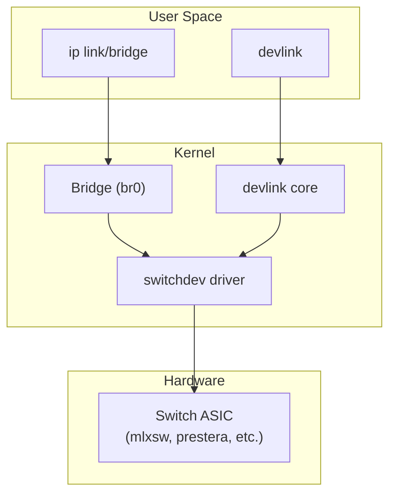

# Devlink

**Devlink** is a kernel framework for managing device-level features of network
hardware (NICs, switches, SmartNICs) that go beyond what `ip`, `ethtool`, or
sysfs expose. It provides a unified interface for firmware parameters, health
monitoring, port abstraction, flash management, and resource allocation.

> **Introduced:** Linux 4.1 (initial), expanded significantly in 5.x+  
> **Subsystems:** `net/core/devlink.c`, drivers under `drivers/net/ethernet/`  
> **User-space tool:** `devlink` (part of iproute2)

---

## Architecture Overview

```
┌──────────────────────────────────────────────────┐
│                  User Space                      │
│              devlink (iproute2)                  │
│         devlink dev, port, param, health ...     │
└───────────────────┬──────────────────────────────┘
                    │  Netlink (DEVLINK_GENL_*)
                    ▼
┌──────────────────────────────────────────────────┐
│                Kernel Core                        │
│              net/core/devlink.c                   │
│                                                  │
│  ┌──────────┐ ┌──────────┐ ┌──────────┐         │
│  │  Params  │ │  Ports   │ │  Health  │ ...     │
│  └──────────┘ └──────────┘ └──────────┘         │
└───────────────────┬──────────────────────────────┘
                    │  devlink_ops callbacks
                    ▼
┌──────────────────────────────────────────────────┐
│              Device Driver                       │
│  mlx5, bnxt, nfp, ice, mlxsw, prestera, ...     │
└──────────────────────────────────────────────────┘
```

Devlink objects are identified by **bus** and **device name**:

```
pci/0000:03:00.0   # PCI device
platform/netdevsim0 # Platform / virtual device
```

---

## Core Concepts

### Device

A devlink device represents a physical or virtual network device registered
with the devlink subsystem.

```bash
# List all devlink devices
devlink dev show

# Example output
pci/0000:03:00.0
pci/0000:03:00.1
```

### Port

Ports are the network-facing interfaces. Devlink classifies them by **type**:

| Type | Description | Example |
|------|-------------|---------|
| `ethernet` | Standard Ethernet port | NIC physical port |
| `ib` | InfiniBand port | HCA port |
| `auto` | Auto-detected | Kernel default |

```bash
# List all ports
devlink port show

# Show port details
devlink port show pci/0000:03:00.0/0

# Example output:
# pci/0000:03:00.0/0: type eth netdev ens1f0 flavour physical port 0
```

#### Port Flavours

| Flavour | Meaning |
|---------|---------|
| `physical` | Actual physical port on the device |
| `cpu` | CPU-facing port (for switch ASICs) |
| `dsa` | DSA (Distributed Switch Architecture) port |
| `pf` | Physical function port (SR-IOV) |
| `vf` | Virtual function port (SR-IOV) |

#### Setting Port Type

```bash
# Change port type
devlink port set pci/0000:03:00.0/0 type eth
```

---

## Device Parameters

Parameters expose device-specific configuration knobs. They can be:

- **runtime** — changeable while device is running
- **driverinit** — applied only at device initialization (requires restart)
- **permanent** — stored in NVMEM, survives reboot

```bash
# List all parameters for a device
devlink dev param show pci/0000:03:00.0

# Example output:
# pci/0000:03:00.0:
#   name enable_sriov type generic
#     values:
#       cmode driverinit value false
#   name max_macs type generic
#     values:
#       cmode runtime value 64
```

### Reading and Setting Parameters

```bash
# Get parameter value
devlink dev param get pci/0000:03:00.0 param enable_sriov

# Set parameter (runtime changeable)
devlink dev param set pci/0000:03:00.0 param max_macs cmode runtime value 128

# Set driverinit parameter (requires reload)
devlink dev param set pci/0000:03:00.0 param enable_sriov cmode driverinit value true
devlink dev reload pci/0000:03:00.0
```

### Common Parameters

| Parameter | Type | Description |
|-----------|------|-------------|
| `enable_sriov` | bool | Enable SR-IOV |
| `max_macs` | u32 | Maximum MAC addresses per port |
| `internal_port` | bool | Internal CPU port mode |
| `region_snapshot_enable` | bool | Enable region snapshots |

---

## Health Reporters

Health reporters track device health events (firmware crashes, hardware errors,
assertions). They provide:

- **Auto-dump**: automatic data collection on error
- **Auto-recover**: automatic recovery trigger
- **Manual dump/recover**: on-demand via user space

### Listing Reporters

```bash
# List all health reporters
devlink health show

# Example output:
# pci/0000:03:00.0:
#   reporter fw_fatal
#     state error recovered true grace_period 0 auto_recover true auto_dump true
#     healthy true
#   reporter fw_non_fatal
#     state healthy recovered false grace_period 0 auto_recover false auto_dump true
#     healthy true
```

### Working with Health Reporters

```bash
# Show detailed health reporter info
devlink health show pci/0000:03:00.0 reporter fw_fatal

# Trigger a manual dump
devlink health dump show pci/0000:03:00.0 reporter fw_fatal

# Trigger manual recovery
devlink health recover pci/0000:03:00.0 reporter fw_fatal

# Set reporter options
devlink health set pci/0000:03:00.0 reporter fw_fatal \
    auto_recover true auto_dump true grace_period 10000

# Diagnose (show current diagnostic info)
devlink health diagnose pci/0000:03:00.0 reporter fw_fatal
```

### Health Reporter State Machine

```
          ┌──────────┐
          │ healthy  │◄──── normal operation
          └────┬─────┘
               │ error detected
               ▼
          ┌──────────┐
          │  error   │──── auto_dump? → collect dump
          └────┬─────┘──── auto_recover? → attempt recovery
               │
               ▼
          ┌──────────┐
          │recovered │──── recovery succeeded
          └──────────┘
```

---

## Regions

Regions expose device memory spaces for debugging and diagnostics. A region is
a mapped area of device memory that can be dumped via snapshots.

### Creating and Using Regions

```bash
# List available regions
devlink region show

# Example output:
# pci/0000:03:00.0/cr-space: size 1048576 snapshot_max 4
# pci/0000:03:00.0/fw-health: size 65536 snapshot_max 8

# Take a snapshot of a region
devlink region snapshot new pci/0000:03:00.0/cr-space

# List snapshots
devlink region snapshot show pci/0000:03:00.0/cr-space

# Read a snapshot (to file)
devlink region dump pci/0000:03:00.0/cr-space snapshot 0 > cr-space-dump.bin

# Delete a snapshot
devlink region snapshot del pci/0000:03:00.0/cr-space id 0
```

### Region Use Cases

| Region | Content |
|--------|---------|
| `cr-space` | Device configuration space |
| `fw-health` | Firmware health registers |
| `hw` | Hardware state for debug |
| `flash` | Flash memory content |

---

## Resource Management

Some devices have allocatable resources (e.g., number of VFs, queue pairs).
Devlink exposes and manages these.

```bash
# List resources
devlink resource show pci/0000:03:00.0

# Example output:
# pci/0000:03:00.0:
#   name kvd size 262144
#   name kvd linear size 65536
#   name kvd hash_single size 131072
#   name kvd hash_double size 65536

# Set resource size
devlink resource set pci/0000:03:00.0 path /kvd/hash_single size 196608

# Apply (requires reload)
devlink dev reload pci/0000:03:00.0
```

---

## Flash Management

Devlink provides firmware flash and update capabilities:

```bash
# Show flash info
devlink dev info pci/0000:03:00.0

# Example output:
# pci/0000:03:00.0:
#   driver mlx5_core
#   serial_number MT2107X01234
#   versions:
#     fixed:
#       hw.revision 0
#     running:
#       fw.version 16.32.1020
#       fw.mgmt.version 16.32.1020

# Flash firmware
devlink dev flash pci/0000:03:00.0 file firmware.bin

# Flash with overwrite mode
devlink dev flash pci/0000:03:00.0 file firmware.bin overwrite settings
```

---

## Traps and Trap Groups

Devlink allows configuring which packets are trapped to the CPU (for control
plane policing):

```bash
# List traps
devlink trap show

# Example output:
# pci/0000:03:00.0:
#   name igmp_query type control action trap group_l2_drops
#   name arp_bc type control action trap group_l2_drops

# Set trap action
devlink trap set pci/0000:03:00.0 name arp_bc action mirror

# List trap groups
devlink trap group show
```

### Trap Actions

| Action | Behavior |
|--------|----------|
| `trap` | Forward to CPU only |
| `mirror` | Forward to CPU and normal destination |
| `drop` | Drop the packet |

---

## Linecard Management

For modular switch systems, devlink manages line cards:

```bash
# List linecards
devlink lc show

# Set linecard type
devlink lc set pci/0000:03:00.0 lc 0 type 16x100G
```

---

## Common Workflows

### Enable SR-IOV

```bash
# Set parameter and reload
devlink dev param set pci/0000:03:00.0 param enable_sriov cmode driverinit value true
devlink dev reload pci/0000:03:00.0

# Create VFs via sysfs (standard method)
echo 4 > /sys/class/net/ens1f0/device/sriov_numvfs
```

### Debug a Firmware Crash

```bash
# Enable auto-dump
devlink health set pci/0000:03:00.0 reporter fw_fatal auto_dump true

# When crash occurs, examine the dump
devlink health dump show pci/0000:03:00.0 reporter fw_fatal

# Trigger recovery
devlink health recover pci/0000:03:00.0 reporter fw_fatal
```

### Capture Device Internal State

```bash
# Take a snapshot
devlink region snapshot new pci/0000:03:00.0/cr-space

# Dump to file for analysis
devlink region dump pci/0000:03:00.0/cr-space snapshot 0 > snapshot.bin

# Hexdump inspection
hexdump -C snapshot.bin | head -50
```

---

## Netlink API

Devlink uses Generic Netlink with family `DEVLINK_GENL_NAME` ("devlink"):

```
Commands:
  DEVLINK_CMD_DEV_GET / SET / NEW / DEL
  DEVLINK_CMD_PORT_GET / SET
  DEVLINK_CMD_PARAM_GET / SET
  DEVLINK_CMD_HEALTH_REPORTER_*
  DEVLINK_CMD_REGION_*
  DEVLINK_CMD_FLASH_UPDATE
  DEVLINK_CMD_TRAP_*
  DEVLINK_CMD_RESOURCE_*
  DEVLINK_CMD_LINECARD_*
```

Drivers register with devlink via:

```c
struct devlink *devlink_alloc(const struct devlink_ops *ops, size_t priv_size);
int devlink_register(struct devlink *devlink, struct device *dev);
```

### Driver Integration Example

```c
static const struct devlink_ops my_devlink_ops = {
    .port_split       = my_port_split,
    .port_unsplit     = my_port_unsplit,
    .info_get         = my_info_get,
    .flash_update      = my_flash_update,
    .reload_down      = my_reload_down,
    .reload_up        = my_reload_up,
    .health_reporter   = my_health_ops,
};
```

---

## Kernel Config

```
CONFIG_NET_DEVLINK=y      # Core devlink support (usually built-in)
CONFIG_MLX5_CORE=y        # Mellanox ConnectX driver (example)
CONFIG_NETDEVSIM=m        # Virtual devlink device for testing
```

---

## Relation to Other Subsystems

- **devlink** sits between device drivers and user-space management tools.
- **ethtool** handles per-port link settings; devlink handles device-level config.
- **ip link** manages network namespace interfaces; devlink manages hardware.
- **[SR-IOV](/kernel/networking/sriov)** VFs are created via devlink parameters.
- **switchdev** drivers use devlink for ASIC-level resource management.

---

## Switchdev Integration

Switchdev is a kernel framework for hardware-switched networking. Devlink works closely with switchdev to manage ASIC-level configuration on network switches.

### Switchdev Architecture



### Switchdev Mode Configuration

```bash
# Switchdev mode enables hardware offloading
# The ASIC mirrors the kernel bridge/FDB state

# Set device to switchdev mode
devlink dev eswitch set pci/0000:03:00.0 mode switchdev

# Legacy mode (default for NICs, no offload)
devlink dev eswitch set pci/0000:03:00.0 mode legacy

# Check current mode
devlink dev eswitch show pci/0000:03:00.0
# pci/0000:03:00.0: mode switchdev inline-mode none encap enable

# Switchdev with SR-IOV
# Create VFs in switchdev mode
echo 4 > /sys/class/net/ens1f0/device/sriov_numvfs
devlink dev eswitch set pci/0000:03:00.0 mode switchdev

# VFs get representor ports in the bridge
ip link set ens1f0_0 master br0
ip link set ens1f0_1 master br0
```

### Forwarding Database (FDB) Offload

```bash
# When switchdev mode is active, bridge FDB entries
# are automatically offloaded to hardware

# Create bridge and add ports
ip link add br0 type bridge
ip link set ens1f0 master br0
ip link set ens1f0_0 master br0

# Add static FDB entry (offloaded to ASIC)
bridge fdb add aa:bb:cc:dd:ee:ff dev ens1f0_0 master

# Check offloaded entries
bridge fdb show dev br0
# aa:bb:cc:dd:ee:ff dev ens1f0_0 master br0
# aa:bb:cc:dd:ee:ff dev ens1f0_0 offload
#                   ^^^^^^^^ hardware offloaded
```

## DSA (Distributed Switch Architecture)

DSA manages Ethernet switches connected to a host CPU via a management interface. Devlink provides the control plane for DSA switches.

```bash
# DSA switches appear as multiple ports under one device
# Example: a 5-port managed switch

# List DSA ports
devlink port show
# pci/0000:03:00.0/0: type eth netdev lan1 flavour physical port 0
# pci/0000:03:00.0/1: type eth netdev lan2 flavour physical port 1
# pci/0000:03:00.0/2: type eth netdev lan3 flavour physical port 2
# pci/0000:03:00.0/3: type eth netdev lan4 flavour physical port 3
# pci/0000:03:00.0/4: type eth netdev wan  flavour physical port 4
# pci/0000:03:00.0/5: type eth netdev cpu  flavour cpu

# Configure DSA port
ip link set lan1 master br0
ip link set lan2 master br0
```

## Advanced Health Reporter Workflows

### Automated Health Monitoring Script

```bash
#!/bin/bash
# Monitor devlink health reporters and alert on errors

devices=$(devlink dev show -j | jq -r '.devlink.dev[].bus+"/"+.devlink.dev[].dev')

for dev in $devices; do
    reporters=$(devlink health show $dev -j 2>/dev/null | \
        jq -r '.devlink.health[].reporter | keys[]' 2>/dev/null)
    
    for reporter in $reporters; do
        state=$(devlink health show $dev reporter $reporter -j | \
            jq -r '.devlink.health[0].reporter."$reporter".state')
        
        if [ "$state" = "error" ]; then
            echo "ALERT: $dev reporter $reporter in error state"
            devlink health dump show $dev reporter $reporter > /tmp/dump_${dev////_}_${reporter}.bin
            devlink health recover $dev reporter $reporter
        fi
    done
done
```

### Firmware Crash Recovery

```bash
# Set up automatic recovery with grace period
devlink health set pci/0000:03:00.0 reporter fw_fatal \
    auto_recover true auto_dump true grace_period 5000

# After crash, examine dump
devlink health dump show pci/0000:03:00.0 reporter fw_fatal | \
    strings | head -50

# Force reload device (nuclear option)
devlink dev reload pci/0000:03:00.0
```

## Devlink and SR-IOV Workflow

### Complete SR-IOV Setup with Devlink

```bash
# Step 1: Enable SR-IOV via devlink parameter
devlink dev param set pci/0000:03:00.0 param enable_sriov cmode driverinit value true
devlink dev reload pci/0000:03:00.0

# Step 2: Create Virtual Functions
echo 4 > /sys/class/net/ens1f0/device/sriov_numvfs

# Step 3: Verify VF ports
devlink port show | grep vf
# pci/0000:03:00.0/10000: type eth netdev ens1f0v0 flavour vf pf 0 vf 0
# pci/0000:03:00.0/10001: type eth netdev ens1f0v1 flavour vf pf 0 vf 1
# pci/0000:03:00.0/10002: type eth netdev ens1f0v2 flavour vf pf 0 vf 2
# pci/0000:03:00.0/10003: type eth netdev ens1f0v3 flavour vf pf 0 vf 3

# Step 4: Set VF MAC address
devlink port function set pci/0000:03:00.0/10000 hw_addr 00:11:22:33:44:55

# Step 5: Configure rate limiting per VF
devlink port function rate add pci/0000:03:00.0/vf0
devlink port function rate set pci/0000:03:00.0/vf0 tx_max 10Gbit
```

### VF Rate Limiting

```bash
# Create rate objects for bandwidth control
devlink port function rate add pci/0000:03:00.0/vf0
devlink port function rate add pci/0000:03:00.0/vf1

# Set bandwidth limits
devlink port function rate set pci/0000:03:00.0/vf0 \
    tx_share 1Gbit tx_max 5Gbit
devlink port function rate set pci/0000:03:00.0/vf1 \
    tx_share 500Mbit tx_max 2Gbit

# View rate configuration
devlink port function rate show

# Delete rate object
devlink port function rate del pci/0000:03:00.0/vf0
```

## Devlink with SmartNICs (DPU)

SmartNICs (Data Processing Units) expose complex devlink hierarchies:

```bash
# SmartNIC may have multiple devlink devices
# - Host-side NIC
# - Embedded CPU switch
# - eSwitch

devlink dev show
# pci/0000:03:00.0   # Host-side
# auxiliary:host1#0   # Embedded switch

# Configure SmartNIC pipeline
# (driver-specific, example for NVIDIA BlueField)
devlink dev param set auxiliary:host1#0 \
    param flow_steering_mode cmode runtime value smfs
```

## Devlink Resource Monitoring

```bash
# Monitor resource utilization
devlink resource show pci/0000:03:00.0

# Example: KVD (Key-Value Database) on Spectrum ASIC
# pci/0000:03:00.0:
#   name kvd size 262144 occ 12345
#   name kvd linear size 65536 occ 2048
#   name kvd hash_single size 131072 occ 8192
#   name kvd hash_double size 65536 occ 2105

# Reallocate resources
# (requires understanding the ASIC's resource model)
devlink resource set pci/0000:03:00.0 path /kvd/hash_single size 196608
devlink resource set pci/0000:03:00.0 path /kvd/hash_double size 32768
devlink dev reload pci/0000:03:00.0
```

## Devlink Debugging with Tracing

```bash
# Enable devlink tracing
echo 1 > /sys/kernel/debug/tracing/events/devlink/devlink_hwmsg/enable
echo 1 > /sys/kernel/debug/tracing/events/devlink/devlink_health_reporter/enable

# View devlink hardware messages
cat /sys/kernel/debug/tracing/trace_pipe | grep devlink

# Trace devlink Netlink communication
# Use nlmon (Netlink monitor)
ip link add nlmon0 type nlmon
ip link set nlmon0 up
tcpdump -i nlmon0 -w /tmp/nlmon.pcap
# Filter for devlink family
```

## Further Reading

- [Kernel docs: devlink](https://www.kernel.org/doc/html/latest/networking/devlink/index.html)
- [devlink man page](https://man7.org/linux/man-pages/man8/devlink.8.html)
- [LWN: Devlink introduction (2017)](https://lwn.net/Articles/727176/)
- [iproute2 devlink source](https://github.com/iproute2/iproute2/blob/main/devlink/)
- [Devlink health reporters design](https://lore.kernel.org/netdev/20190312144841.16685-1-jiri@resnulli.us/)
- See also: [Netlink](/kernel/networking/netlink), [ethtool](/kernel/networking/ethtool), [SR-IOV](/kernel/networking/sriov)
