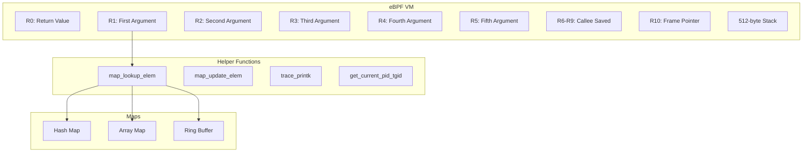

# eBPF for Networking

## Introduction

eBPF (extended Berkeley Packet Filter) is a revolutionary technology in the Linux kernel that allows programs to run in a sandboxed virtual machine within the kernel. Originally designed for packet filtering, eBPF has evolved into a general-purpose execution engine that powers networking, observability, security, and tracing use cases.

In the networking context, eBPF enables programmable packet processing, socket filtering, traffic control, and connection tracking — all without modifying the kernel or loading kernel modules.

## eBPF Architecture

### eBPF Virtual Machine

eBPF programs run in a register-based virtual machine with the following characteristics:



### eBPF Instruction Set

eBPF uses a RISC-like instruction set:

```c
/* eBPF instruction format */
struct bpf_insn {
    __u8    code;       /* Opcode */
    __u8    dst_reg:4;  /* Destination register */
    __u8    src_reg:4;  /* Source register */
    __s16   off;        /* Signed offset */
    __s32   imm;        /* Signed immediate */
};

/* Instruction classes */
#define BPF_LD      0x00    /* Load */
#define BPF_LDX     0x01    /* Load indexed */
#define BPF_ST      0x02    /* Store */
#define BPF_STX     0x03    /* Store indexed */
#define BPF_ALU     0x04    /* 32-bit ALU */
#define BPF_JMP     0x05    /* Jump */
#define BPF_ALU64   0x07    /* 64-bit ALU */
```

### JIT Compilation

eBPF programs are JIT-compiled to native machine code for performance:

```bash
# Check if JIT is enabled
$ cat /proc/sys/net/core/bpf_jit_enable
1

# Enable JIT with debug output
$ echo 2 > /proc/sys/net/core/bpf_jit_enable

# View JIT-compiled code
$ cat /proc/net/bpf_jit_disasm
```

## Networking Program Types

### Socket Filters (BPF_PROG_TYPE_SOCKET_FILTER)

Socket filters attach to sockets and filter incoming packets:

```c
/* Socket filter example: Only allow TCP packets */
#include <linux/bpf.h>
#include <bpf/bpf_helpers.h>
#include <linux/if_ether.h>
#include <linux/ip.h>

SEC("socket")
int socket_filter(struct __sk_buff *skb)
{
    void *data = (void *)(long)skb->data;
    void *data_end = (void *)(long)skb->data_end;

    struct ethhdr *eth = data;
    if ((void *)(eth + 1) > data_end)
        return 0;

    /* Only allow IPv4 */
    if (eth->h_proto != __constant_htons(ETH_P_IP))
        return 0;

    struct iphdr *iph = (struct iphdr *)(eth + 1);
    if ((void *)(iph + 1) > data_end)
        return 0;

    /* Only allow TCP */
    if (iph->protocol != IPPROTO_TCP)
        return 0;

    return 1;  /* Accept packet */
}
```

Userspace attachment:

```c
/* Attach socket filter to socket */
int main(void)
{
    int sock = socket(AF_INET, SOCK_STREAM, 0);

    /* Load BPF program */
    struct bpf_insn prog[] = {
        BPF_STMT(BPF_LD | BPF_W | BPF_ABS, 12),  /* Load ethertype */
        BPF_JUMP(BPF_JMP | BPF_JEQ | BPF_K, ETH_P_IP, 0, 3),
        BPF_STMT(BPF_LD | BPF_B | BPF_ABS, 23),  /* Load IP protocol */
        BPF_JUMP(BPF_JMP | BPF_JEQ | BPF_K, IPPROTO_TCP, 0, 1),
        BPF_STMT(BPF_RET | BPF_K, 0xFFFFFFFF),   /* Accept */
        BPF_STMT(BPF_RET | BPF_K, 0),             /* Drop */
    };

    struct sock_fprog bpf = {
        .len = sizeof(prog) / sizeof(prog[0]),
        .filter = prog,
    };

    /* Attach filter */
    setsockopt(sock, SOL_SOCKET, SO_ATTACH_BPF, &bpf, sizeof(bpf));

    return 0;
}
```

### TC (Traffic Control) BPF

TC BPF programs attach to the traffic control layer for ingress and egress processing:

```c
/* TC BPF classifier/action */
SEC("tc")
int tc_packet_handler(struct __sk_buff *skb)
{
    void *data = (void *)(long)skb->data;
    void *data_end = (void *)(long)skb->data_end;

    struct ethhdr *eth = data;
    if ((void *)(eth + 1) > data_end)
        return TC_ACT_OK;

    /* Mark packets from specific MAC */
    __u8 target_mac[] = {0x00, 0x11, 0x22, 0x33, 0x44, 0x55};
    if (__builtin_memcmp(eth->h_source, target_mac, 6) == 0) {
        /* Set skb mark for policy routing */
        skb->mark = 100;
    }

    /* Rate limit ICMP */
    if (eth->h_proto == __constant_htons(ETH_P_IP)) {
        struct iphdr *iph = (struct iphdr *)(eth + 1);
        if ((void *)(iph + 1) > data_end)
            return TC_ACT_OK;

        if (iph->protocol == IPPROTO_ICMP) {
            /* Use token bucket for rate limiting */
            __u32 key = 0;
            struct rate_limit *rl = bpf_map_lookup_elem(&icmp_rate, &key);
            if (rl) {
                __u64 now = bpf_ktime_get_ns();
                if (rl->tokens > 0 && now - rl->last_update < 1000000000) {
                    rl->tokens--;
                    return TC_ACT_OK;
                }
                return TC_ACT_SHOT;  /* Drop */
            }
        }
    }

    return TC_ACT_OK;
}
```

Attaching TC BPF:

```bash
# Create clsact qdisc
$ sudo tc qdisc add dev eth0 clsact

# Add TC BPF program to ingress
$ sudo tc filter add dev eth0 ingress bpf da obj tc_filter.o sec tc

# Add TC BPF program to egress
$ sudo tc filter add dev eth0 egress bpf da obj tc_filter.o sec tc

# Show attached programs
$ sudo tc filter show dev eth0 ingress

# Remove program
$ sudo tc filter del dev eth0 ingress
```

### Cgroup BPF

Cgroup BPF programs attach to cgroups and control networking behavior for processes in that cgroup:

```c
/* Cgroup socket BPF: Restrict network access */
SEC("cgroup/sock")
int cgroup_sock_policy(struct bpf_sock *sk)
{
    /* Block all UDP from this cgroup */
    if (sk->protocol == IPPROTO_UDP)
        return 0;

    /* Allow TCP to specific port */
    if (sk->protocol == IPPROTO_TCP) {
        if (sk->dst_port == __constant_htons(80) ||
            sk->dst_port == __constant_htons(443))
            return 1;
    }

    return 0;  /* Deny by default */
}
```

```c
/* Cgroup sock_addr BPF: Redirect connections */
SEC("cgroup/connect4")
int cgroup_connect4(struct bpf_sock_addr *ctx)
{
    /* Redirect connections to 8.8.8.8:53 to local DNS */
    if (ctx->user_port == __constant_htons(53)) {
        ctx->user_ip4 = __constant_htonl(0x7F000001);  /* 127.0.0.1 */
        ctx->user_port = __constant_htons(5353);
    }

    return 1;
}
```

Attaching cgroup BPF:

```bash
# Create a cgroup
$ sudo mkdir /sys/fs/cgroup/net_cls/myapp

# Attach BPF program to cgroup
$ sudo bpftool cgroup attach /sys/fs/cgroup/net_cls/myapp sock_verdict \
    id 123

# Show attached programs
$ sudo bpftool cgroup show /sys/fs/cgroup/net_cls/myapp
```

### XDP Programs

XDP programs are covered in detail in the [XDP chapter](xdp.md). Here's a brief example:

```c
/* XDP program for packet filtering */
SEC("xdp")
int xdp_filter(struct xdp_md *ctx)
{
    void *data = (void *)(long)ctx->data;
    void *data_end = (void *)(long)ctx->data_end;

    /* Parse and filter packets */
    struct ethhdr *eth = data;
    if ((void *)(eth + 1) > data_end)
        return XDP_ABORTED;

    /* Drop non-IPv4 packets */
    if (eth->h_proto != __constant_htons(ETH_P_IP))
        return XDP_DROP;

    return XDP_PASS;
}
```

## eBPF Maps

Maps are the primary data structure for sharing data between eBPF programs and userspace, or between different eBPF programs.

### Map Types

```c
/* Hash map */
struct bpf_map_def SEC("maps") hash_map = {
    .type = BPF_MAP_TYPE_HASH,
    .key_size = sizeof(__u32),
    .value_size = sizeof(__u64),
    .max_entries = 10000,
};

/* Array map */
struct bpf_map_def SEC("maps") array_map = {
    .type = BPF_MAP_TYPE_ARRAY,
    .key_size = sizeof(__u32),
    .value_size = sizeof(__u64),
    .max_entries = 256,
};

/* Per-CPU hash map (for high-performance counters) */
struct bpf_map_def SEC("maps") percpu_hash = {
    .type = BPF_MAP_TYPE_PERCPU_HASH,
    .key_size = sizeof(__u32),
    .value_size = sizeof(__u64),
    .max_entries = 10000,
};

/* LRU hash map (auto-eviction) */
struct bpf_map_def SEC("maps") lru_hash = {
    .type = BPF_MAP_TYPE_LRU_HASH,
    .key_size = sizeof(__u32),
    .value_size = sizeof(struct flow_info),
    .max_entries = 100000,
};

/* Ring buffer (perf event replacement) */
struct bpf_map_def SEC("maps") ringbuf = {
    .type = BPF_MAP_TYPE_RINGBUF,
    .max_entries = 256 * 1024,
};

/* Queue/Stack */
struct bpf_map_def SEC("maps") queue = {
    .type = BPF_MAP_TYPE_QUEUE,
    .value_size = sizeof(__u32),
    .max_entries = 1000,
};
```

### Map Operations

```c
/* Lookup */
void *bpf_map_lookup_elem(struct bpf_map *map, const void *key);

/* Update */
int bpf_map_update_elem(struct bpf_map *map, const void *key,
                        const void *value, __u64 flags);

/* Delete */
int bpf_map_delete_elem(struct bpf_map *map, const void *key);

/* Get next key (for iteration) */
int bpf_map_get_next_key(struct bpf_map *map, const void *key,
                         void *next_key);
```

### Map-in-Map

Maps can contain references to other maps:

```c
/* Array of maps */
struct bpf_map_def SEC("maps") map_array = {
    .type = BPF_MAP_TYPE_ARRAY_OF_MAPS,
    .key_size = sizeof(__u32),
    .max_entries = 10,
};

/* Hash of maps */
struct bpf_map_def SEC("maps") map_hash = {
    .type = BPF_MAP_TYPE_HASH_OF_MAPS,
    .key_size = sizeof(__u32),
    .max_entries = 1000,
};
```

## Helper Functions

### Networking Helpers

```c
/* Packet manipulation */
void *bpf_skb_load_bytes(const struct __sk_buff *skb, u32 offset,
                         void *to, u32 len);
int bpf_skb_store_bytes(struct __sk_buff *skb, u32 offset,
                        const void *from, u32 len, u64 flags);

/* Checksum calculation */
int bpf_l3_csum_replace(struct __sk_buff *skb, u32 offset,
                        u64 from, u64 to, u64 size);
int bpf_l4_csum_replace(struct __sk_buff *skb, u32 offset,
                        u64 from, u64 to, u64 flags);

/* VLAN manipulation */
int bpf_skb_vlan_push(struct __sk_buff *skb, __be16 vlan_proto,
                      __u16 vlan_tci);
int bpf_skb_vlan_pop(struct __sk_buff *skb);

/* Tunnel encapsulation/decapsulation */
int bpf_skb_set_tunnel_key(struct __sk_buff *skb,
                           struct bpf_tunnel_key *key, u32 size, u64 flags);
int bpf_skb_get_tunnel_key(struct __sk_buff *skb,
                           struct bpf_tunnel_key *key, u32 size, u64 flags);

/* Packet redirect */
int bpf_redirect(u32 ifindex, u64 flags);
int bpf_redirect_map(struct bpf_map *map, u32 key, u64 flags);
```

### Socket Helpers

```c
/* Socket operations */
int bpf_sk_redirect_map(struct __sk_buff *skb, struct bpf_map *map,
                        u32 key, u64 flags);
int bpf_sock_map_update(struct bpf_sock_ops *skops, struct bpf_map *map,
                        void *key, u64 flags);
```

## BPF CO-RE (Compile Once, Run Everywhere)

CO-RE allows eBPF programs to be portable across kernel versions:

```c
/* CO-RE example with kernel struct access */
#include <vmlinux.h>
#include <bpf/bpf_helpers.h>
#include <bpf/bpf_core_read.h>

SEC("tracepoint/net/net_dev_queue")
int trace_net_dev_queue(struct trace_event_raw_net_dev_template *ctx)
{
    struct sk_buff *skb = ctx->skb;

    /* CO-RE: Read field with relocation */
    __u32 len = BPF_CORE_READ(skb, len);
    __u32 protocol = BPF_CORE_READ(skb, protocol);

    bpf_printk("packet: len=%u proto=%u", len, protocol);

    return 0;
}
```

### BTF (BPF Type Format)

BTF provides type information for CO-RE:

```bash
# Check if kernel has BTF
$ bpftool btf dump file /sys/kernel/btf/vmlinux format raw | head

# Generate vmlinux.h
$ bpftool btf dump file /sys/kernel/btf/vmlinux format c > vmlinux.h

# List BTF-enabled programs
$ bpftool feature probe kernel | grep btf
```

## Development Tools

### bpftool

```bash
# List all loaded BPF programs
$ bpftool prog list

# Show program details
$ bpftool prog show id 123

# Dump program bytecode
$ bpftool prog dump xlated id 123

# Dump JIT-compiled code
$ bpftool prog dump jited id 123

# List all maps
$ bpftool map list

# Dump map contents
$ bpftool map dump id 456

# Pin program to filesystem
$ bpftool prog pin id 123 /sys/fs/bpf/my_prog

# Load and attach program
$ bpftool prog load my_prog.o /sys/fs/bpf/my_prog type xdp
```

### libbpf

```c
/* Modern libbpf skeleton approach */
#include "my_prog.skel.h"

int main(void)
{
    struct my_prog *skel;

    /* Open and load */
    skel = my_prog__open_and_load();

    /* Attach */
    my_prog__attach(skel);

    /* Access maps */
    __u32 key = 0;
    __u64 value;
    bpf_map__lookup_elem(skel->maps.stats, &key, sizeof(key),
                         &value, sizeof(value));

    /* Cleanup */
    my_prog__destroy(skel);

    return 0;
}
```

### BCC (BPF Compiler Collection)

```python
#!/usr/bin/env python3
from bcc import BPF

program = """
#include <uapi/linux/ptrace.h>
#include <net/sock.h>

BPF_HASH(connections, u32, u64);

int trace_tcp_connect(struct pt_regs *ctx, struct sock *sk) {
    u32 pid = bpf_get_current_pid_tgid() >> 32;
    u64 ts = bpf_ktime_get_ns();
    connections.update(&pid, &ts);
    return 0;
}
"""

b = BPF(text=program)
b.attach_kprobe(event="tcp_v4_connect", fn_name="trace_tcp_connect")

while True:
    for k, v in b.get_table("connections").items():
        print(f"PID {k.value}: {v.value}")
```

## Advanced Patterns

### Tail Calls

Tail calls allow one eBPF program to jump to another:

```c
/* Define program array for tail calls */
struct bpf_map_def SEC("maps") jmp_table = {
    .type = BPF_MAP_TYPE_PROG_ARRAY,
    .key_size = sizeof(__u32),
    .value_size = sizeof(__u32),
    .max_entries = 10,
};

SEC("xdp")
int xdp_parser(struct xdp_md *ctx)
{
    void *data = (void *)(long)ctx->data;
    void *data_end = (void *)(long)ctx->data_end;

    struct ethhdr *eth = data;
    if ((void *)(eth + 1) > data_end)
        return XDP_ABORTED;

    /* Jump based on protocol */
    switch (eth->h_proto) {
    case __constant_htons(ETH_P_IP):
        bpf_tail_call(ctx, &jmp_table, 0);  /* IPv4 handler */
        break;
    case __constant_htons(ETH_P_IPV6):
        bpf_tail_call(ctx, &jmp_table, 1);  /* IPv6 handler */
        break;
    case __constant_htons(ETH_P_ARP):
        bpf_tail_call(ctx, &jmp_table, 2);  /* ARP handler */
        break;
    }

    return XDP_PASS;
}

SEC("xdp")
int xdp_ipv4_handler(struct xdp_md *ctx)
{
    /* Handle IPv4 packets */
    return XDP_PASS;
}
```

### Packet Rewriting

```c
/* Rewrite packet headers */
SEC("tc")
int tc_rewriter(struct __sk_buff *skb)
{
    void *data = (void *)(long)skb->data;
    void *data_end = (void *)(long)skb->data_end;

    struct ethhdr *eth = data;
    if ((void *)(eth + 1) > data_end)
        return TC_ACT_OK;

    /* Swap source and destination MAC */
    __u8 tmp_mac[6];
    __builtin_memcpy(tmp_mac, eth->h_source, 6);
    __builtin_memcpy(eth->h_source, eth->h_dest, 6);
    __builtin_memcpy(eth->h_dest, tmp_mac, 6);

    /* Update checksums */
    if (eth->h_proto == __constant_htons(ETH_P_IP)) {
        struct iphdr *iph = (struct iphdr *)(eth + 1);
        if ((void *)(iph + 1) > data_end)
            return TC_ACT_OK;

        /* Swap source and destination IP */
        __be32 tmp_ip = iph->saddr;
        iph->saddr = iph->daddr;
        iph->daddr = tmp_ip;

        /* Recalculate IP checksum */
        iph->check = 0;
        iph->check = csum_fold(csum_partial(iph, iph->ihl * 4, 0));
    }

    return TC_ACT_OK;
}
```

## Best Practices

1. **Validate bounds**: Always check `data_end` before accessing packet data
2. **Use CO-RE**: For portable programs across kernel versions
3. **Prefer per-CPU maps**: For high-frequency counters to avoid contention
4. **Minimize map lookups**: Cache values in local variables
5. **Use tail calls**: For complex programs that exceed instruction limits
6. **Test with `bpftool prog load`**: Verify programs before deploying
7. **Monitor with `bpftool prog show`**: Check for errors and performance

## References

- [The Linux Kernel Documentation](https://docs.kernel.org/)
- [LWN.net - Linux and free software news](https://lwn.net/)
- [GNU Project Documentation](https://www.gnu.org/doc/doc.html)
- [GNU Manuals](https://www.gnu.org/manual/manual.html)
- [Free Software Directory](https://directory.fsf.org/wiki/Main_Page)
- [Planet GNU](https://planet.gnu.org/)
- [Free Software Books](https://www.gnu.org/doc/other-free-books.html)

1. **eBPF.io** — [ebpf.io](https://ebpf.io/)
2. **BPF and XDP Reference Guide** — [docs.cilium.io/en/stable/bpf/](https://docs.cilium.io/en/stable/bpf/)
3. **libbpf Documentation** — [libbpf.readthedocs.io](https://libbpf.readthedocs.io/)
4. **Linux Kernel Source** — `kernel/bpf/`, `include/uapi/linux/bpf.h`
5. *Learning eBPF* by Liz Rice (O'Reilly)

## Related Topics

- [XDP](xdp.md) — eXpress Data Path for high-performance packet processing
- [Kernel Networking Overview](overview.md) — How packets flow through the stack
- [Netfilter](netfilter.md) — Traditional packet filtering framework
- [Socket Layer](sockets.md) — Socket structures and operations
