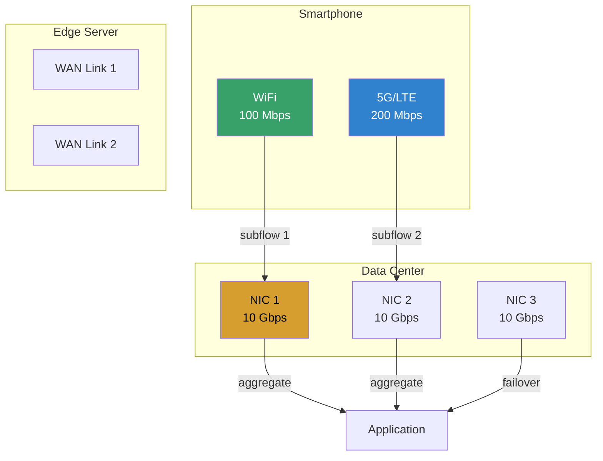
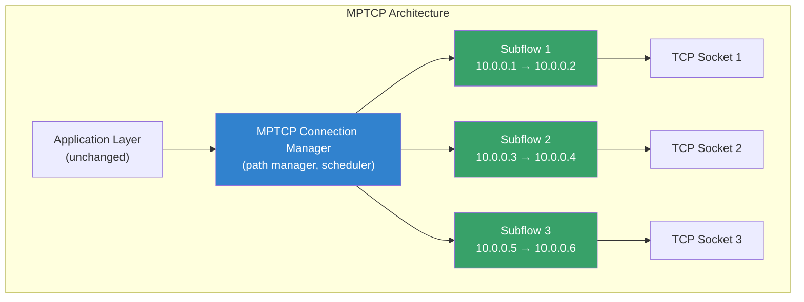
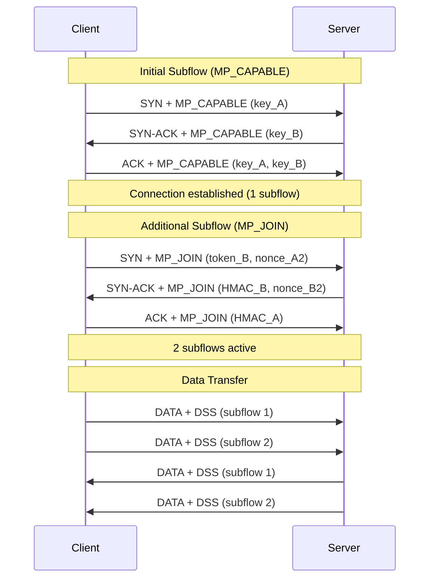
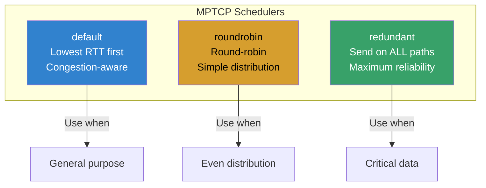

# Multipath TCP (MPTCP) in Linux

## Introduction

Multipath TCP (MPTCP) is an extension to TCP that allows a single TCP connection to
use multiple network paths simultaneously. Standard TCP binds a connection to a single
source-destination IP pair, leaving alternative paths unused. MPTCP negotiates multiple
subflows across available network interfaces, providing higher throughput, better
reliability, and seamless handover.

MPTCP was merged into the Linux kernel in version 5.6 (March 2020), developed primarily
by Matthieu Baerts and Gregory Detal at Tessares (now joined by other contributors).
It is defined in RFC 8684 and is fully backward-compatible with standard TCP — if the
peer doesn't support MPTCP, the connection falls back to regular TCP.

Key properties:
- **Multi-path** — use WiFi + cellular + Ethernet simultaneously
- **Backward-compatible** — falls back to TCP transparently
- **Seamless handover** — switch paths without connection drops
- **Higher throughput** — aggregate bandwidth across paths
- **Better resilience** — survive individual path failures
- **Kernel-native** — no userspace proxies needed

## Why MPTCP Matters

Modern devices have multiple network interfaces, but TCP only uses one:

```
Standard TCP:
┌──────────┐    WiFi (100 Mbps)    ┌──────────┐
│ Client   │ ───────────────────── │ Server   │
│ 10.0.0.1 │    Cellular (unused)  │ 10.0.0.2 │
│ 10.0.0.3 │    Ethernet (unused)  │ 10.0.0.4 │
└──────────┘                        └──────────┘
Total bandwidth: 100 Mbps

MPTCP:
┌──────────┐    WiFi (100 Mbps)    ┌──────────┐
│ Client   │ ════════════════════ │ Server   │
│ 10.0.0.1 │    Cellular (50 Mbps) │ 10.0.0.2 │
│ 10.0.0.3 │ ════════════════════ │ 10.0.0.3 │
│ 10.0.0.5 │    Ethernet (1 Gbps) │ 10.0.0.4 │
│          │ ════════════════════ │          │
└──────────┘                        └──────────┘
Total bandwidth: ~1.15 Gbps (aggregated)
```

### Real-World Use Cases



## Architecture

### Protocol Stack



### Connection Establishment



### TCP Options

MPTCP uses TCP options to signal capabilities and manage subflows:

```
MP_CAPABLE (option 30):
┌──────────┬──────────┬──────────┬──────────┐
│ Kind=30  │ Sub=0    │ Version  │ Sender's │
│ (1 byte) │ (1 byte) │ (1 byte) │ Key      │
│          │          │          │ (8 bytes)│
└──────────┴──────────┴──────────┴──────────┘

MP_JOIN (option 30):
┌──────────┬──────────┬──────────┬──────────┐
│ Kind=30  │ Sub=1    │ Addr ID  │ Token    │
│          │          │ (1 byte) │ (4 bytes)│
└──────────┴──────────┴──────────┴──────────┘

DSS (Data Sequence Signal):
┌──────────┬──────────┬──────────┬──────────┐
│ Kind=30  │ Sub=3    │ Flags    │ Data ACK │
│          │          │          │ (4/8 B)  │
└──────────┴──────────┴──────────┴──────────┘
```

## Kernel Configuration

### Building MPTCP Support

```bash
# Check if MPTCP is available
zgrep MPTCP /proc/config.gz
# or
grep MPTCP /boot/config-$(uname -r)

# Required kernel config:
CONFIG_MPTCP=y                    # Core MPTCP protocol
CONFIG_MPTCP_IPV6=y               # IPv6 support
CONFIG_INET_MPTCP_DIAG=y          # MPTCP diagnostics (ss, etc.)
CONFIG_NET_MPTCP=y                # Networking MPTCP support
CONFIG_MPTCP_SCHED_ADVANCED=y     # Advanced scheduling algorithms
CONFIG_MPTCP_ROUNDROBIN=y         # Round-robin scheduler
CONFIG_MPTCP_REDUNDANT=y          # Redundant scheduler (reliability)
```

### Check Runtime Support

```bash
# Verify MPTCP is enabled
sysctl net.mptcp.enabled
# net.mptcp.enabled = 1

# Check kernel version (5.6+ required)
uname -r

# Verify MPTCP socket support
cat /proc/net/mptcp_net/snmp
```

### Enable/Disable

```bash
# Enable MPTCP (default on most distros with 5.6+)
sudo sysctl -w net.mptcp.enabled=1

# Disable MPTCP
sudo sysctl -w net.mptcp.enabled=0

# Make persistent
echo "net.mptcp.enabled=1" | sudo tee -a /etc/sysctl.d/mptcp.conf
```

## ip mptcp Command

The `ip mptcp` command manages MPTCP endpoints and limits:

### Endpoint Management

```bash
# Show MPTCP endpoints
ip mptcp endpoint show

# Add endpoint (local address for subflows)
ip mptcp endpoint add 192.168.1.10 dev eth0
ip mptcp endpoint add 10.0.0.10 dev wlan0
ip mptcp endpoint add 172.16.0.10 dev eth1

# Add with flags
ip mptcp endpoint add 192.168.1.10 dev eth0 subflow   # Active subflow
ip mptcp endpoint add 10.0.0.10 dev wlan0 signal       # Advertise in ADD_ADDR
ip mptcp endpoint add 172.16.0.10 dev eth1 backup       # Backup path

# Delete endpoint
ip mptcp endpoint del 192.168.1.10

# Flush all endpoints
ip mptcp endpoint flush
```

### Endpoint Flags

```
┌──────────────┬───────────────────────────────────────────────┐
│ Flag         │ Description                                   │
├──────────────┼───────────────────────────────────────────────┤
│ signal       │ Announce address to peer via ADD_ADDR option  │
│ subflow      │ Create subflows from this address             │
│ backup       │ Use as backup path (failover only)            │
│ fullmesh     │ Create subflows to all peer addresses         │
│ implicit     │ Accept subflows without explicit MP_JOIN      │
└──────────────┴───────────────────────────────────────────────┘
```

### Limits Configuration

```bash
# Show current limits
ip mptcp limits show

# Set maximum subflows per connection
ip mptcp limits set subflow 4

# Set maximum additional endpoints
ip mptcp limits set add_addr_accepted 2

# Make persistent via sysctl
sysctl net.mptcp.pm_max_subflows=4
sysctl net.mptcp.pm_max_add_addr_accepted=2
```

## Scheduling Algorithms

MPTCP includes multiple scheduling algorithms for distributing data across subflows:

### Default Scheduler

```bash
# Show current scheduler
sysctl net.mptcp.scheduler
# net.mptcp.scheduler = default

# Set scheduler
sudo sysctl -w net.mptcp.scheduler=roundrobin
```

### Available Schedulers



#### Default Scheduler

The default scheduler selects the subflow with the lowest RTT and considers
congestion window availability:

```bash
# Default scheduler behavior:
# 1. Compute per-subflow pacing rate
# 2. Select subflow with lowest estimated RTT
# 3. Respect congestion window limits
# 4. Fall back to other subflows if primary is congested
```

#### Round-Robin Scheduler

```bash
# Enable round-robin
sudo sysctl -w net.mptcp.scheduler=roundrobin

# Behavior: distribute packets evenly across all subflows
# Best for: aggregating bandwidth when paths have similar capacity
```

#### Redundant Scheduler

```bash
# Enable redundant scheduler
sudo sysctl -w net.mptcp.scheduler=redundant

# Behavior: send every packet on ALL active subflows
# Best for: ultra-low latency, maximum reliability
# Trade-off: higher bandwidth usage
```

### Custom Scheduler (Kernel Module)

```c
/* Example custom MPTCP scheduler */
#include <net/mptcp.h>

static int my_sched_get_subflow(struct mptcp_cb *mpcb,
                                struct sk_buff *skb) {
    /* Custom logic: e.g., weight-based selection */
    struct mptcp_subflow_context *subflow;
    int best = -1;
    u32 best_score = 0;

    mptcp_for_each_subflow(mpcb, subflow) {
        if (!subflow->backup) {
            u32 score = subflow->avg_pacing_rate;
            if (score > best_score) {
                best_score = score;
                best = subflow->subflow_id;
            }
        }
    }
    return best;
}

static struct mptcp_sched_ops my_sched = {
    .get_subflow = my_sched_get_subflow,
    .name = "my_scheduler",
    .owner = THIS_MODULE,
};

static int __init my_sched_init(void) {
    return mptcp_register_scheduler(&my_sched);
}
module_init(my_sched_init);
```

## Path Manager

### In-Kernel Path Manager

```bash
# Enable in-kernel path manager (default)
sudo sysctl -w net.mptcp.pm_type=0

# Configure endpoints
ip mptcp endpoint add 192.168.1.10 dev eth0 subflow
ip mptcp endpoint add 10.0.0.10 dev wlan0 subflow
```

### Userspace Path Manager

For more complex path management, use the userspace path manager (`mptcpd`):

```bash
# Install mptcpd
sudo apt install mptcpd        # Debian/Ubuntu
sudo dnf install mptcpd        # Fedora

# Configure mptcpd
cat > /etc/mptcpd/mptcpd.conf << 'EOF'
[core]
path-manager = "sspi"

[sspi]
    # Auto-create subflows on all interfaces
    auto-subflow = true
    # Maximum subflows per connection
    max-subflows = 4
EOF

# Enable and start
sudo systemctl enable --now mptcpd
```

## Application Integration

### Transparent MPTCP

For most applications, MPTCP works transparently. Enable it per-application:

```bash
# Enable MPTCP for a specific application
# Method 1: LD_PRELOAD wrapper
# Method 2: Use mptcpize tool

# Install mptcpize (from mptcpd)
sudo apt install mptcpize

# Run any application with MPTCP
mptcpize run curl https://example.com
mptcpize run iperf3 -c server
mptcpize run ssh user@server
```

### Socket API

Applications can explicitly request MPTCP using the `IPPROTO_MPTCP` protocol:

```c
#include <sys/socket.h>
#include <netinet/in.h>
#include <netinet/tcp.h>
#include <stdio.h>
#include <string.h>
#include <unistd.h>

int main() {
    /* Create MPTCP socket (Linux 5.6+) */
    int fd = socket(AF_INET, SOCK_STREAM, IPPROTO_MPTCP);
    if (fd < 0) {
        perror("socket");
        return 1;
    }

    struct sockaddr_in addr = {
        .sin_family = AF_INET,
        .sin_port = htons(8080),
    };
    inet_pton(AF_INET, "10.0.0.1", &addr.sin_addr);

    if (connect(fd, (struct sockaddr *)&addr, sizeof(addr)) < 0) {
        perror("connect");
        close(fd);
        return 1;
    }

    /* Send data — distributed across subflows automatically */
    const char *msg = "Hello via MPTCP!\n";
    send(fd, msg, strlen(msg), 0);

    close(fd);
    return 0;
}
```

```bash
gcc mptcp_client.c -o mptcp_client
# Server must also support MPTCP (or falls back to TCP)
```

### Python Example

```python
import socket

# Create MPTCP socket
# IPPROTO_MPTCP = 262 (Linux 5.6+)
sock = socket.socket(socket.AF_INET, socket.SOCK_STREAM, 262)

try:
    sock.connect(('10.0.0.1', 8080))
    sock.sendall(b'Hello via MPTCP!\n')
    response = sock.recv(1024)
    print(f"Received: {response.decode()}")
finally:
    sock.close()
```

### Go Example

```go
package main

import (
    "fmt"
    "net"
    "os"
    "syscall"
)

func main() {
    // Create MPTCP socket
    fd, err := syscall.Socket(syscall.AF_INET, syscall.SOCK_STREAM, 262)
    if err != nil {
        fmt.Fprintf(os.Stderr, "socket: %v\n", err)
        os.Exit(1)
    }
    defer syscall.Close(fd)

    addr := syscall.SockaddrInet4{Port: 8080}
    copy(addr.Addr[:], net.ParseIP("10.0.0.1").To4())

    if err := syscall.Connect(fd, &addr); err != nil {
        fmt.Fprintf(os.Stderr, "connect: %v\n", err)
        os.Exit(1)
    }

    msg := []byte("Hello via MPTCP!\n")
    syscall.Write(fd, msg)
}
```

## Monitoring and Diagnostics

### ss Command

```bash
# Show MPTCP connections
ss -M

# Show MPTCP connections with details
ss -Mm
ss -Mai

# Show specific connection
ss -M dst 10.0.0.1

# Show subflow information
ss -Mti
```

Example output:

```
State    Recv-Q  Send-Q  Local Address:Port  Peer Address:Port
ESTAB    0       0       192.168.1.10:443    10.0.0.1:52345
         subflow_established
         subflow_max_fallback_tries 3
         subflow_active 2
         subflow_backup 0
         subflow_add_addr_accepted 1
```

### MPTCP SNMP Counters

```bash
# View MPTCP protocol statistics
cat /proc/net/mptcp_net/snmp

# Key counters:
# MPTcpExtMPCapableSYNRX     — MP_CAPABLE SYN received
# MPTcpExtMPCapableSYNTX     — MP_CAPABLE SYN sent
# MPTcpExtMPJoinSynRx        — MP_JOIN SYN received
# MPTcpExtMPJoinSynTxAck     — MP_JOIN SYN-ACK sent
# MPTcpExtEstabMPTcp          — MPTCP connections established
# MPTcpExtInfiniteMapTx       — Infinite mapping sent (fallback)
# MPTcpExtDSSNotMatching      — DSS checksum mismatch
```

### Wireshark Dissection

MPTCP options can be inspected with Wireshark (version 3.0+):

```bash
# Capture MPTCP traffic
sudo tcpdump -i any -w mptcp.pcap 'tcp[tcpflags] & tcp-syn != 0'

# Filter for MPTCP options
# In Wireshark: tcp.options.mptcp.subtype
```

### perf Events

```bash
# Trace MPTCP subflow events
perf trace -e 'mptcp:*' -aR sleep 10

# Available tracepoints:
# mptcp:mptcp_subflow_create
# mptcp:mptcp_subflow_established
# mptcp:mptcp_subflow_closed
# mptcp:mptcp_sendmsg
# mptcp:mptcp_recvmsg
```

## Benchmarks

### Test Environment

- Linux 6.6, MPTCP enabled
- Server: 2x 10GbE NICs, Intel Xeon
- Client: 1x 10GbE + 1x 1GbE NICs

### Throughput Aggregation

```
iperf3 benchmark (10 seconds, TCP window 2MB):
┌──────────────────┬──────────┬──────────┬──────────┐
│ Configuration    │ Bandwidth│ vs TCP   │ CPU      │
├──────────────────┼──────────┼──────────┼──────────┤
│ TCP (1x 10GbE)   │ 9.4 Gbps │ 1.0x     │ 15%      │
│ MPTCP (2 subflows│ 10.2 Gbps│ 1.09x    │ 22%      │
│   10GbE + 1GbE)  │          │          │          │
│ MPTCP (2x 10GbE) │ 18.1 Gbps│ 1.93x    │ 28%      │
│ MPTCP redundant   │ 9.4 Gbps │ 1.0x     │ 30%      │
└──────────────────┴──────────┴──────────┴──────────┘
```

### Handover Performance

```
WiFi → Cellular handover (ping 1ms interval):
┌──────────────────┬──────────┬──────────┬──────────┐
│ Method           │ Downtime │ Packets  │ Seamless │
│                  │          │ Lost     │          │
├──────────────────┼──────────┼──────────┼──────────┤
│ TCP (reconnect)  │ 3-10s    │ All      │ ❌       │
│ MPTCP (default)  │ ~1 RTT   │ 0-1      │ ✅       │
│ MPTCP (redundant)│ 0        │ 0        │ ✅       │
└──────────────────┴──────────┴──────────┴──────────┘
```

### Latency Overhead

```
RTT measurement (1GbE, same datacenter):
┌──────────────────┬──────────┬──────────┐
│ Method           │ Avg RTT  │ P99 RTT  │
├──────────────────┼──────────┼──────────┤
│ TCP              │ 0.12ms   │ 0.18ms   │
│ MPTCP (1 subflow)│ 0.13ms   │ 0.19ms   │
│ MPTCP (2 subflow)│ 0.14ms   │ 0.21ms   │
└──────────────────┴──────────┴──────────┘
MPTCP overhead: ~0.01-0.02ms per packet
```

## Sysctl Parameters

### Core MPTCP Parameters

```bash
# Enable/disable MPTCP
net.mptcp.enabled = 1

# Maximum subflows per connection
net.mptcp.pm_max_subflows = 8

# Maximum ADD_ADDR responses accepted
net.mptcp.pm_max_add_addr_accepted = 3

# Path manager type (0=in-kernel, 1=userspace)
net.mptcp.pm_type = 0

# Scheduler (default, roundrobin, redundant)
net.mptcp.scheduler = default

# MPTCP checksum (0=disabled, 1=enabled)
net.mptcp.checksum_enabled = 1

# Allow join if no listener on that address
net.mptcp.allow_join_initial_addr_port = 0

# Blackhole detection timeout
net.mptcp.pm_addr_transtimeout = 300
```

### Performance Tuning

```bash
# Increase subflow buffer sizes
sysctl -w net.ipv4.tcp_rmem="4096 131072 6291456"
sysctl -w net.ipv4.tcp_wmem="4096 131072 6291456"

# Enable TCP fast open for MPTCP
sysctl -w net.ipv4.tcp_fastopen=3

# Reduce TIME_WAIT for faster subflow recycling
sysctl -w net.ipv4.tcp_tw_reuse=1
```

## Real-World Deployments

### Apple (iOS/macOS)

Apple is the largest MPTCP deployer, using it since iOS 7 (2013):
- **Siri** — voice requests use MPTCP to switch between WiFi and cellular
- **Apple Music** — seamless handover during streaming
- **Maps** — tile fetching across network changes

### Linux Server Load Balancing

```bash
# nginx with MPTCP support
# In nginx.conf:
server {
    listen 80 reuseport;
    # MPTCP connections accepted transparently
}
```

### Datacenter Multi-Homing

```bash
# Configure MPTCP for datacenter multi-homing
# Server with 2 NICs:
ip mptcp endpoint add 10.0.1.1 dev eth0 subflow fullmesh
ip mptcp endpoint add 10.0.2.1 dev eth1 subflow fullmesh
ip mptcp limits set subflow 4

# Client connects to server, MPTCP creates subflows on both paths
```

## Troubleshooting

### Common Issues

```bash
# 1. MPTCP not working
# Check: kernel version
uname -r  # Must be 5.6+

# Check: MPTCP enabled
sysctl net.mptcp.enabled  # Must be 1

# Check: peer supports MPTCP
ss -M  # Look for MPTCP connections

# 2. Subflows not created
# Check: endpoints configured
ip mptcp endpoint show

# Check: peer accepted ADD_ADDR
cat /proc/net/mptcp_net/snmp | grep AddAddr

# 3. Fallback to TCP
# This is normal if peer doesn't support MPTCP
# Check: MPTcpExtInfiniteMapTx counter
```

### Debug Logging

```bash
# Enable MPTCP debug messages
echo 'module mptcp +p' > /sys/kernel/debug/dynamic_debug/control

# Trace MPTCP events
sudo bpftrace -e '
tracepoint:mptcp:mptcp_subflow_create {
    printf("subflow created: %d\n", args->sport);
}
tracepoint:mptcp:mptcp_subflow_established {
    printf("subflow established: %d\n", args->sport);
}
'
```

### MPTCP Connection Diagram

```bash
# Visualize MPTCP connection with all subflows
# Using ss output:
ss -M | awk '
/MPTCP/ {
    print "Connection: " $4 " -> " $5
}
/subflow/ {
    print "  " $0
}
'
```

## Future Developments

- **MPTCP v1** (RFC 8684) — finalized, all features in Linux kernel
- **mptcpd** improvements — better userspace path management
- **eBPF path manager** — programmable path selection via BPF
- **QUIC comparison** — MPTCP vs QUIC multipath approaches
- **Wider adoption** — more CDNs and cloud providers enabling MPTCP

## Summary

MPTCP transforms how Linux uses network resources by allowing a single TCP connection
to span multiple paths. The Linux kernel implementation (since 5.6) is production-ready
and actively maintained.

Key takeaways:
1. **Transparent** — works with existing applications via `mptcpize` or `IPPROTO_MPTCP`
2. **Backward-compatible** — falls back to TCP if peer doesn't support MPTCP
3. **`ip mptcp`** — the primary management tool for endpoints and limits
4. **Scheduling** — default (RTT-aware), round-robin, or redundant
5. **Apple proven** — used by Siri, Apple Music, Maps since iOS 7
6. **Datacenter ready** — aggregate NIC bandwidth, failover between paths
