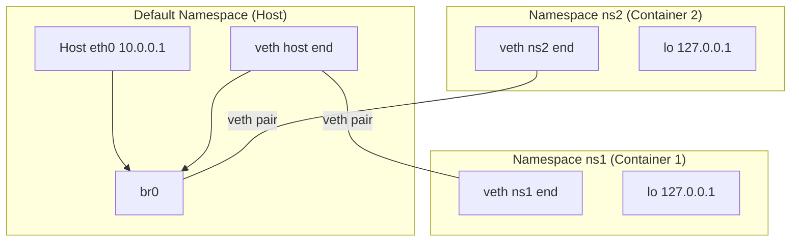

# Network Namespaces

## Introduction

Network namespaces provide complete isolation of the network stack in Linux. Each namespace has its own network interfaces, routing tables, firewall rules, sockets, and `/proc/net` filesystem. This is the foundation of Linux container networking — every container (Docker, LXC, Kubernetes pod) gets its own network namespace, giving it a completely independent network environment.

Network namespaces are one of several namespace types in Linux (PID, mount, UTS, IPC, user, cgroup, time). They were introduced in Linux 2.6.29 (2009) and have become essential for modern container infrastructure.

## Network Namespace Architecture



## Basic Operations

### Creating and Managing Namespaces

```bash
# Create a network namespace
ip netns add ns1

# List namespaces
ip netns list
# ns1

# Execute a command in a namespace
ip netns exec ns1 ip addr show
# 1: lo: <LOOPBACK> mtu 65536 qdisc noop state DOWN
#     link/loopback 00:00:00:00:00:00 brd 00:00:00:00:00:00

# Delete a namespace
ip netns del ns1

# Identify a process's namespace
ls -la /proc/$$/ns/net
# lrwxrwxrwx 1 root root 0 ... /proc/1234/ns/net -> 'net:[4026531840]'

# Find all processes in a namespace
lsns -t net
#         NS TYPE NPID  PID  USER  NETNSID  NSFS  COMMAND
# 4026531840 net    1    1  root unassigned       /sbin/init
# 4026532400 net  500  500  root        0        containerd
```

### Bringing Up Loopback

Namespaces start with loopback down. You must bring it up for localhost to work:

```bash
ip netns add ns1
ip netns exec ns1 ip link set lo up
ip netns exec ns1 ping 127.0.0.1
# PING 127.0.0.1 (127.0.0.1) 56(84) bytes of data.
# 64 bytes from 127.0.0.1: icmp_seq=1 ttl=64 time=0.025 ms
```

## Veth Pairs

A veth (virtual Ethernet) pair is a virtual network device that comes in pairs. Packets transmitted on one end appear on the other end, creating a tunnel between namespaces.

### Creating Veth Pairs

```bash
# Create a veth pair
ip link add veth0 type veth peer name veth1

# Verify both ends exist
ip link show veth0
# veth0@veth1: <BROADCAST,MULTICAST,M-DOWN> mtu 1500 ...
ip link show veth1
# veth1@veth0: <BROADCAST,MULTICAST,M-DOWN> mtu 1500 ...

# Move one end into a namespace
ip link set veth1 netns ns1

# Configure inside namespace
ip netns exec ns1 ip addr add 10.0.0.2/24 dev veth1
ip netns exec ns1 ip link set veth1 up
ip netns exec ns1 ip link set lo up

# Configure host end
ip addr add 10.0.0.1/24 dev veth0
ip link set veth0 up

# Test connectivity
ip netns exec ns1 ping 10.0.0.1
# PING 10.0.0.1 (10.0.0.1) 56(84) bytes of data.
# 64 bytes from 10.0.0.1: icmp_seq=1 ttl=64 time=0.045 ms
```

### Multiple Namespaces Connected via Bridge

```bash
# Create namespaces
ip netns add ns1
ip netns add ns2

# Create bridge on host
ip link add br0 type bridge
ip link set br0 up

# Create veth pairs and connect to bridge
ip link add veth-ns1 type veth peer name veth-ns1-br
ip link add veth-ns2 type veth peer name veth-ns2-br

ip link set veth-ns1 netns ns1
ip link set veth-ns2 netns ns2

ip link set veth-ns1-br master br0
ip link set veth-ns2-br master br0

# Configure namespace interfaces
ip netns exec ns1 ip addr add 10.0.1.1/24 dev veth-ns1
ip netns exec ns1 ip link set veth-ns1 up
ip netns exec ns1 ip link set lo up

ip netns exec ns2 ip addr add 10.0.1.2/24 dev veth-ns2
ip netns exec ns2 ip link set veth-ns2 up
ip netns exec ns2 ip link set lo up

# Bring up host-side interfaces
ip link set veth-ns1-br up
ip link set veth-ns2-br up

# Test connectivity between namespaces
ip netns exec ns1 ping 10.0.1.2
# PING 10.0.1.2 (10.0.1.2) 56(84) bytes of data.
# 64 bytes from 10.0.1.2: icmp_seq=1 ttl=64 time=0.067 ms

# Full network diagram
ip netns exec ns1 ip route add default via 10.0.1.254
```

## Routing Between Namespaces

### Direct Routing (No Bridge)

```bash
# Create namespaces
ip netns add ns1
ip netns add ns2

# Create veth pairs
ip link add veth-h1 type veth peer name veth-n1
ip link add veth-h2 type veth peer name veth-n2

# Move ends into namespaces
ip link set veth-n1 netns ns1
ip link set veth-n2 netns ns2

# Configure host interfaces
ip addr add 10.0.1.1/24 dev veth-h1
ip addr add 10.0.2.1/24 dev veth-h2
ip link set veth-h1 up
ip link set veth-h2 up

# Configure namespace interfaces
ip netns exec ns1 ip addr add 10.0.1.2/24 dev veth-n1
ip netns exec ns1 ip link set veth-n1 up
ip netns exec ns1 ip link set lo up
ip netns exec ns1 ip route add default via 10.0.1.1

ip netns exec ns2 ip addr add 10.0.2.2/24 dev veth-n2
ip netns exec ns2 ip link set veth-n2 up
ip netns exec ns2 ip link set lo up
ip netns exec ns2 ip route add default via 10.0.2.1

# Enable IP forwarding on host
sysctl -w net.ipv4.ip_forward=1

# Test: ns1 -> ns2 goes through host routing
ip netns exec ns1 traceroute 10.0.2.2
# 1  10.0.1.1  0.123 ms
# 2  10.0.2.2  0.234 ms
```

## NAT for Internet Access

Namespaces without a route to the host's default gateway need NAT:

```bash
# Create namespace with internet access via NAT
ip netns add ns1
ip link add veth-h type veth peer name veth-n
ip link set veth-n netns ns1

ip addr add 192.168.100.1/24 dev veth-h
ip link set veth-h up

ip netns exec ns1 ip addr add 192.168.100.2/24 dev veth-n
ip netns exec ns1 ip link set veth-n up
ip netns exec ns1 ip link set lo up
ip netns exec ns1 ip route add default via 192.168.100.1

# Enable forwarding
sysctl -w net.ipv4.ip_forward=1

# Set up NAT (assuming eth0 is the host's internet-facing interface)
iptables -t nat -A POSTROUTING -s 192.168.100.0/24 -o eth0 -j MASQUERADE
iptables -A FORWARD -i veth-h -o eth0 -j ACCEPT
iptables -A FORWARD -i eth0 -o veth-h -m state --state RELATED,ESTABLISHED -j ACCEPT

# Test internet access from namespace
ip netns exec ns1 ping 8.8.8.8
# PING 8.8.8.8 (8.8.8.8) 56(84) bytes of data.
# 64 bytes from 8.8.8.8: icmp_seq=1 ttl=117 time=2.34 ms

# DNS resolution
ip netns exec ns1 bash -c "echo 'nameserver 8.8.8.8' > /etc/resolv.conf"
ip netns exec ns1 nslookup google.com
```

## Using `ip netns exec`

Run any program in a network namespace:

```bash
# Run a shell in a namespace
ip netns exec ns1 bash

# Run a server in a namespace
ip netns exec ns1 python3 -m http.server 8080

# Run tcpdump in a namespace
ip netns exec ns1 tcpdump -i veth-n1

# Run iperf3 server in namespace, client on host
ip netns exec ns1 iperf3 -s &
iperf3 -c 10.0.1.2

# Run a full container-like environment
ip netns exec ns1 unshare --mount --pid --fork /bin/bash
```

## Docker and Network Namespaces

Docker creates a network namespace for each container:

```bash
# Find a container's network namespace
CONTAINER_ID=$(docker ps -q --filter "name=mycontainer")

# Method 1: via /proc
PID=$(docker inspect --format '{{.State.Pid}}' $CONTAINER_ID)
ls -la /proc/$PID/ns/net

# Method 2: Docker's symlink
ls /var/run/docker/netns/

# Enter container's namespace
nsenter -t $PID -n ip addr show

# View all container namespaces
for cid in $(docker ps -q); do
    name=$(docker inspect --format '{{.Name}}' $cid | sed 's/\///')
    pid=$(docker inspect --format '{{.State.Pid}}' $cid)
    nsenter -t $pid -n ip -br addr show | grep -v lo
    echo "--- $name ---"
done
```

## Kubernetes Pod Networking

In Kubernetes, all containers in a pod share the same network namespace:

```yaml
apiVersion: v1
kind: Pod
metadata:
  name: mypod
spec:
  containers:
  - name: app
    image: nginx
  - name: sidecar
    image: busybox
    command: ["sleep", "3600"]
```

```bash
# Both containers share the same network namespace
# They can talk via localhost

# In production, CNI plugins (Calico, Flannel, Cilium) manage namespaces
# Typically via veth pairs connecting to a bridge or overlay network

# View pod network namespace
crictl inspect <container_id> | grep netns
```

## Named Namespaces (Persistent)

Named namespaces persist until explicitly deleted, even if no processes are using them:

```bash
# Create named namespace
ip netns add myns

# Run with unshare (unnamed namespace — dies with process)
unshare --net bash

# Bind-mount a namespace to persist it
touch /var/run/netns/persistent-ns
mount --bind /proc/$$/ns/net /var/run/netns/persistent-ns
# Now visible via ip netns list

# Or use ip netns (automatically managed)
ip netns add myns
# Creates /var/run/netns/mys automatically
```

## Network Namespace + Other Namespaces

```bash
# Full isolation: network + PID + mount + hostname
unshare --net --pid --mount --uts --fork bash

# Inside, set hostname
hostname container1
echo "hostname: $(hostname)"

# Mount proc (for ps to work)
mount -t proc proc /proc
ps aux

# All networking commands work in isolated namespace
ip link add lo type lo
ip link set lo up
ip addr add 127.0.0.1/8 dev lo
```

## Debugging Network Namespaces

```bash
# List all namespaces
ip netns list

# Find processes in each namespace
for ns in $(ip netns list); do
    echo "=== $ns ==="
    ip netns pids $ns | while read pid; do
        ps -p $pid -o pid,comm
    done
done

# Run commands in all namespaces
for ns in $(ip netns list); do
    echo "=== $ns ==="
    ip netns exec $ns ip -br addr show
done

# Capture traffic in a namespace
ip netns exec ns1 tcpdump -i any -w /tmp/ns1.pcap

# Check connectivity
ip netns exec ns1 ping -c 3 10.0.0.1

# View routing table
ip netns exec ns1 ip route show

# View ARP table
ip netns exec ns1 ip neigh show

# View firewall rules
ip netns exec ns1 iptables -L -n -v

# Move a process between namespaces
nsenter -t $PID --net=/var/run/netns/target-ns

# View namespace file descriptors
ls -la /var/run/netns/
# total 0
# -r--r--r-- 1 root root 0 ... ns1
# -r--r--r-- 1 root root 0 ... ns2

# Network namespace ID (netnsid)
ip netns list-id
```

## Programmatic Namespace Manipulation

```c
#include <sched.h>
#include <sys/mount.h>

/* Create new network namespace */
int create_netns(void)
{
    if (unshare(CLONE_NEWNET) < 0)
        return -1;
    
    /* Bring up loopback */
    /* ... use netlink or system("ip link set lo up") ... */
    return 0;
}

/* Move process to existing namespace */
#include <fcntl.h>
#include <sched.h>

int join_netns(pid_t target_pid)
{
    char path[64];
    int fd;
    
    snprintf(path, sizeof(path), "/proc/%d/ns/net", target_pid);
    fd = open(path, O_RDONLY);
    if (fd < 0)
        return -1;
    
    if (setns(fd, CLONE_NEWNET) < 0) {
        close(fd);
        return -1;
    }
    
    close(fd);
    return 0;
}
```

## Network Namespace Isolation Details

### What Isolated in Each Namespace

```mermaid
graph TB
    subgraph "Per-Namespace Isolation"
        NETDEV["Network devices<br/>(eth0, lo, veth, etc.)]
        ROUTE["Routing tables<br/>(ip route)"]
        IPTABLES["Firewall rules<br/>(iptables/nftables)"]
        PROCNET["/proc/net<br/>netstat, tcp, udp"]
        SOCK["Socket space<br/>(bind addresses)"]
        SYSCTL["Per-ns sysctls<br/>(ip_forward, etc.)]
        ARP["ARP/NDP tables"]
        XFRM["IPsec/XFRM state"]
    end

    subgraph "Shared (Host-Wide)"
        CLOCK["System clock"]
        HOSTNAME["Hostname (UTS ns)"]
        MODULES["Kernel modules"]
        DEV["Device nodes (/dev)"]
    end
```

### sysfs and procfs per Namespace

```bash
# Each namespace has its own /proc/net
ip netns exec ns1 cat /proc/net/tcp
# Shows only sockets in ns1

# Each namespace has its own /proc/net/netstat
ip netns exec ns1 cat /proc/net/dev
# Shows only devices in ns1

# Per-namespace sysctl values
ip netns exec ns1 sysctl net.ipv4.ip_forward
ip netns exec ns1 sysctl -w net.ipv4.ip_forward=1
```

## Advanced Veth Configuration

### Veth with VLAN Support

```bash
# Create a VLAN-aware veth setup
ip netns add ns1
ip link add veth-h type veth peer name veth-n
ip link set veth-n netns ns1

# Create VLAN subinterfaces on host side
ip link add link veth-h name veth-h.10 type vlan id 10
ip link add link veth-h name veth-h.20 type vlan id 20
ip addr add 10.0.10.1/24 dev veth-h.10
ip addr add 10.0.20.1/24 dev veth-h.20
ip link set veth-h up
ip link set veth-h.10 up
ip link set veth-h.20 up

# Configure trunk in namespace
ip netns exec ns1 ip link add link veth-n name veth-n.10 type vlan id 10
ip netns exec ns1 ip link add link veth-n name veth-n.20 type vlan id 20
ip netns exec ns1 ip addr add 10.0.10.2/24 dev veth-n.10
ip netns exec ns1 ip addr add 10.0.20.2/24 dev veth-n.20
ip netns exec ns1 ip link set veth-n up
ip netns exec ns1 ip link set veth-n.10 up
ip netns exec ns1 ip link set veth-n.20 up
```

### Veth with Traffic Shaping

```bash
# Apply bandwidth limit per namespace
ip link set veth-h up

# Limit to 100Mbit with HTB
tc qdisc add dev veth-h root handle 1: htb default 10
tc class add dev veth-h parent 1: classid 1:10 htb rate 100mbit
tc qdisc add dev veth-h parent 1:10 handle 10: sfq perturb 10

# Apply latency with netem
tc qdisc add dev veth-h root handle 1: netem delay 10ms 2ms
# 10ms delay with 2ms jitter
```

### Veth with XDP (eXpress Data Path)

```bash
# Attach XDP program to veth for high-performance filtering
ip link set veth-h xdpgeneric obj xdp_filter.o sec xdp

# Verify
ip link show dev veth-h
# ... xdpgeneric id 1
```

## Container Runtime Integration

### Containerd/CRI-O Namespace Lifecycle

```bash
# Container runtimes create namespaces via the runtime spec
# OCI runtime spec (config.json): {
#   "linux": {
#     "namespaces": [
#       {"type": "network"},
#       {"type": "pid"},
#       {"type": "mount"},
#       {"type": "uts"}
#     ]
#   }
# }

# List container namespaces via crictl
for cid in $(crictl ps -q); do
    echo "Container: $cid"
    crictl inspect $cid | grep -A5 'namespaces'
done

# Enter container namespace
nsenter -t $(crictl inspect $cid | jq '.info.pid') -n ip addr
```

### Systemd-nspawn Networking

```bash
# Create a container with its own network namespace
systemd-nspawn -D /srv/container --network-veth

# The --network-veth flag creates a veth pair
# Host end connects to host bridge (vz-*)
# Container end gets its own eth0

# Manual namespace with systemd-nspawn
systemd-nspawn -D /srv/container \
  --network-zone=myservice \
  --network-bridge=br0
```

## Network Namespace Persistence

### Saving and Restoring Namespace State

```bash
# ip netns automatically persists named namespaces
# They are bind-mounted to /var/run/netns/

# Manual persistence of unnamed namespace
PID=12345  # PID of process in the namespace
mkdir -p /var/run/netns
mount --bind /proc/$PID/ns/net /var/run/netns/migrated-ns

# Now it appears in ip netns list
ip netns list
# migrated-ns

# CRIU-based checkpoint/restore of network state
# Requires CRIU (Checkpoint/Restore In Userspace)
criu dump -t $PID --tcp-established -D /tmp/checkpoint/
criu restore -D /tmp/checkpoint/
```

### Network Namespace Lifecycle with systemd

```ini
# /etc/systemd/network/20-veth.netdev
[NetDev]
Name=veth-host
Kind=veth

[VethPeer]
Name=veth-container
```

## nsenter Deep Dive

`nsenter` enters namespaces of another process without spawning a new container:

```bash
# Enter all namespaces of PID 1234
nsenter -t 1234 -n ip addr show

# Enter only network namespace
nsenter -t 1234 -n

# Enter multiple namespaces
nsenter -t 1234 --net --pid --mount -- bash

# Enter namespace and run a specific command
nsenter -t 1234 -n -- tcpdump -i eth0 -c 100

# Enter namespace of a Docker container
docker inspect -f '{{.State.Pid}}' mycontainer | \
  xargs -I{} nsenter -t {} -n ip route show

# Persistent namespace entry via script
#!/bin/bash
NS_PID=$(docker inspect -f '{{.State.Pid}}' $1)
exec nsenter -t $NS_PID -n -- ${@:2}
```

## Network Namespace Debugging Cookbook

### Trace All Network Namespaces

```bash
# List all network namespaces with their PIDs
lsns -t net -o NS,PID,COMMAND

# Find which namespace a device belongs to
ip link show dev eth0
# Note the netns inode number

# Cross-reference with lsns
lsns -t net | grep <inode>

# Find all devices across all namespaces
for ns in $(ip netns list); do
    echo "=== $ns ==="
    ip netns exec $ns ip -br link show
done
```

### Debug Namespace Connectivity

```bash
# Test from inside namespace
ip netns exec ns1 ping -c 3 10.0.0.1
ip netns exec ns1 traceroute 10.0.0.1
ip netns exec ns1 ss -tlnp

# Capture traffic in namespace
ip netns exec ns1 tcpdump -i any -w /tmp/ns1.pcap -c 1000

# Monitor namespace ARP table
ip netns exec ns1 ip neigh show

# Check namespace routing
ip netns exec ns1 ip route get 8.8.8.8

# Debug iptables in namespace
ip netns exec ns1 iptables -L -n -v
ip netns exec ns1 nft list ruleset
```

### Common Issues and Solutions

| Issue | Symptom | Solution |
|-------|---------|----------|
| Loopback down | No localhost access | `ip netns exec ns1 ip link set lo up` |
| No default route | Can't reach external | Add `ip route add default via ...` |
| NAT not working | No internet from ns | Check iptables MASQUERADE rule |
| veth not up | No connectivity | Set both ends UP |
| Bridge not forwarding | Intermittent connectivity | Check bridge port membership |
| DNS not resolving | nslookup fails | Configure /etc/resolv.conf in ns |

## Programmatic Namespace Manipulation (Go)

```go
package main

import (
    "fmt"
    "os/exec"
    "runtime"
    "syscall"
)

func createNetNS(name string) error {
    return exec.Command("ip", "netns", "add", name).Run()
}

func enterNetNS(name string) error {
    // Lock thread to OS thread (required for namespace operations)
    runtime.LockOSThread()
    defer runtime.UnlockOSThread()

    // Open namespace file
    nsPath := fmt.Sprintf("/var/run/netns/%s", name)
    fd, err := syscall.Open(nsPath, syscall.O_RDONLY, 0)
    if err != nil {
        return err
    }
    defer syscall.Close(fd)

    // Enter namespace
    return syscall.Setns(fd, syscall.CLONE_NEWNET)
}

func main() {
    if err := createNetNS("test"); err != nil {
        panic(err)
    }
    fmt.Println("Namespace 'test' created")
}
```

## References

- [GNU Project Documentation](https://www.gnu.org/doc/doc.html)
- [GNU Manuals](https://www.gnu.org/manual/manual.html)
- [Free Software Directory](https://directory.fsf.org/wiki/Main_Page)
- [Planet GNU](https://planet.gnu.org/)
- [Free Software Books](https://www.gnu.org/doc/other-free-books.html)

- [Kernel Namespaces Documentation](https://docs.kernel.org/networking/scaling.html)
- [man-pages: namespaces(7)](https://man7.org/linux/man-pages/man7/namespaces.7.html)
- [man-pages: network_namespaces(7)](https://man7.org/linux/man-pages/man7/network_namespaces.7.html)
- [LWN: Network namespaces](https://lwn.net/Articles/219827/)
- [LWN: Namespaces in operation](https://lwn.net/Articles/531114/)
- [Docker networking deep dive](https://docs.docker.com/network/)

## Related Topics

- [Bridging](./bridging.md) — Connecting namespace interfaces
- [Veth Pairs](./namespaces.md#veth-pairs) — Virtual Ethernet tunnels
- [Netlink](./netlink.md) — Programmatic namespace management
- [VLANs](./vlans.md) — VLANs in namespaced environments
- [Traffic Control](./tc.md) — QoS per namespace
