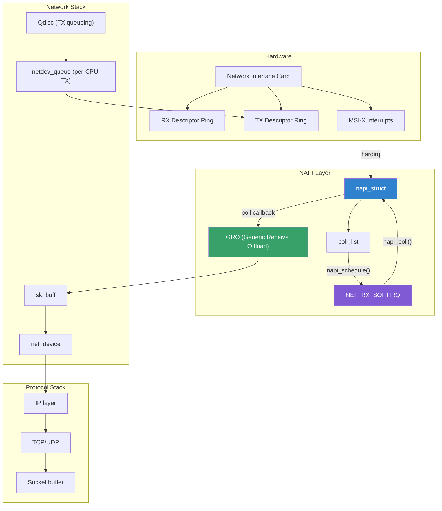
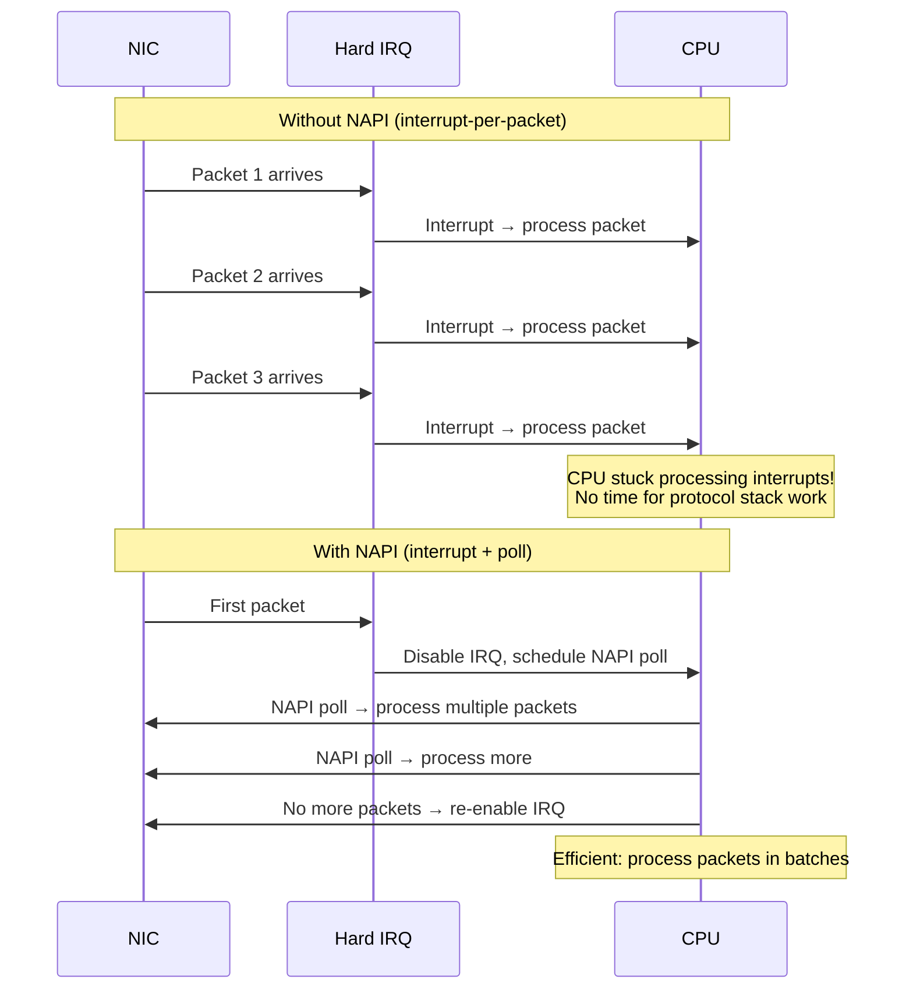
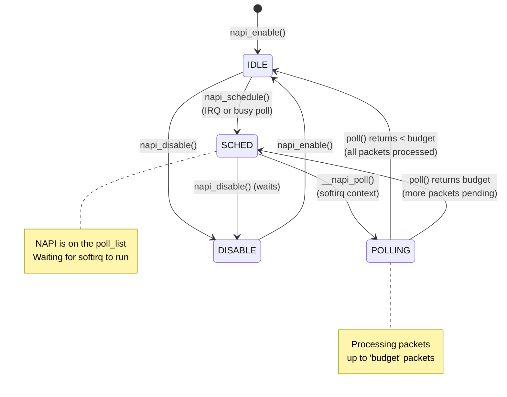
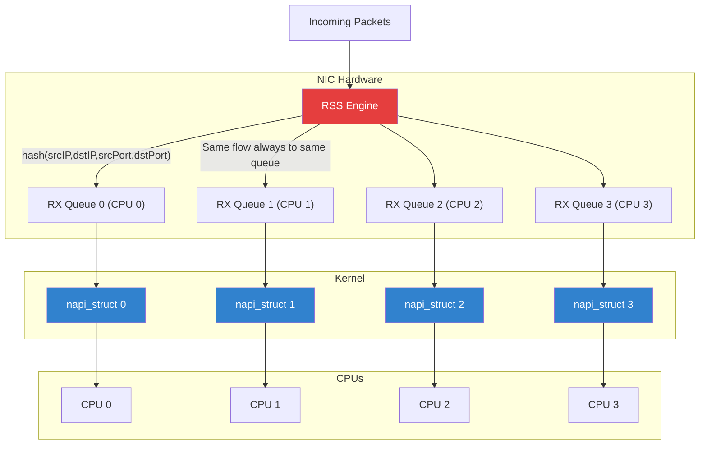
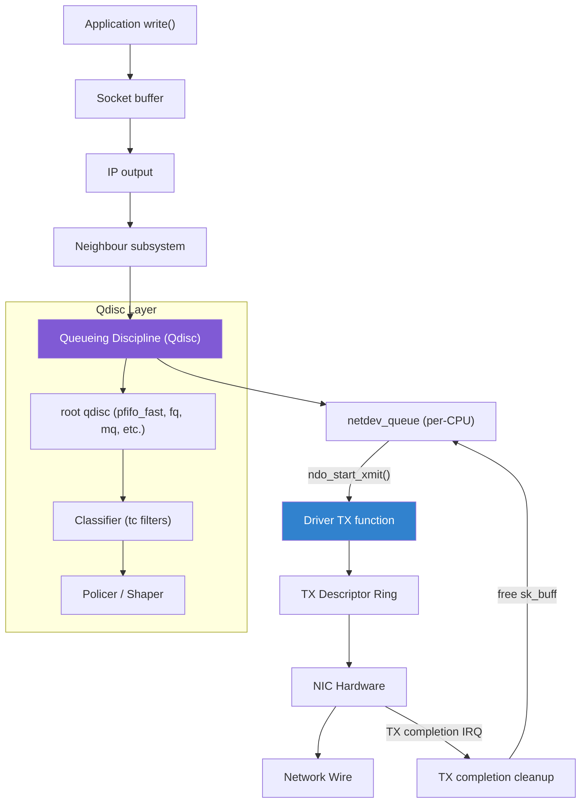
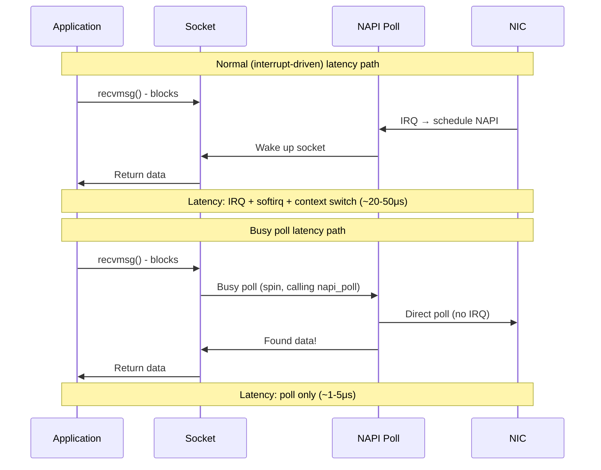
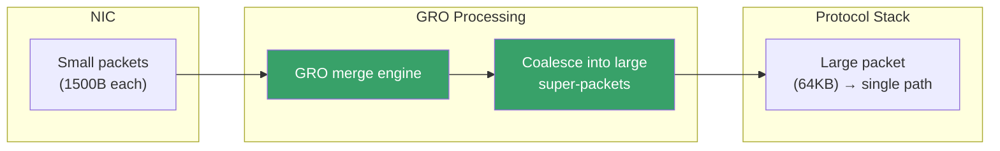
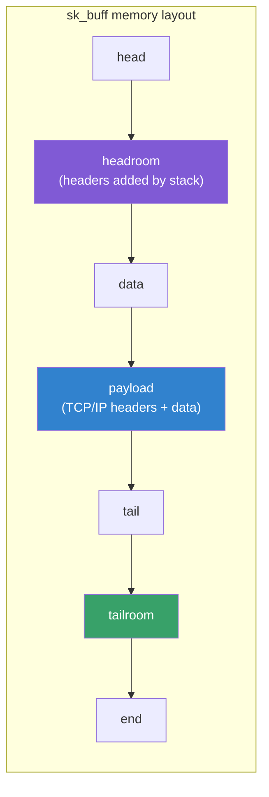

# Network Device Subsystem (NAPI, Queues, Busy Polling)

## Introduction

The Linux network device subsystem is the heart of packet processing. It manages the interface between hardware network devices and the kernel's protocol stack. This page covers three critical mechanisms:

1. **NAPI (New API)** — interrupt-driven to poll-driven packet reception
2. **Queue management** — multi-queue NICs, TX/RX queue architecture
3. **Busy polling** — low-latency packet processing without interrupts

The `netdev` subsystem coordinates packet reception, transmission, flow control, and hardware offloads through a sophisticated architecture designed for high-throughput, low-latency networking.

## Architecture Overview



## NAPI (New API)

### Why NAPI Exists

In the original Linux networking model, every packet arrival triggered an interrupt. At high packet rates, this caused **receive livelock** — the CPU spent all its time processing interrupts and never got to process the packets:



### NAPI Data Structure

```c
/* include/linux/netdevice.h */
struct napi_struct {
    /* Poll list — linked into per-CPU softnet_data->poll_list */
    struct list_head poll_list;

    /* Weight — max packets to process per poll (default 64) */
    unsigned int weight;

    /* State flags */
    unsigned long state;    /* NAPI_STATE_SCHED, NAPI_STATE_DISABLE, etc. */

    /* Device this NAPI belongs to */
    struct net_device *dev;

    /* Queue index for multi-queue devices */
    int queue_index;

    /* GRO (Generic Receive Offload) list */
    struct sk_buff *gro_list;
    struct sk_buff *skb;

    /* Poll function — called by softirq to process packets */
    int (*poll)(struct napi_struct *napi, int budget);

    /* IRQ number (for single-queue devices) */
    int irq;

    /* NAPI ID — used for busy polling and socket hashing */
    unsigned int napi_id;

    /* List of NAPI structures on the same device */
    struct list_head dev_list;

    /* Weight saved when NAPI is disabled */
    unsigned int defer_hard_irqs_count;
};
```

### NAPI State Machine



### NAPI Poll Function

The driver implements a `poll()` callback that the kernel calls to process received packets:

```c
static int my_nic_poll(struct napi_struct *napi, int budget)
{
    struct my_nic_priv *priv = container_of(napi, struct my_nic_priv, napi);
    struct net_device *dev = priv->dev;
    int work_done = 0;

    /* Process received packets up to budget */
    while (work_done < budget) {
        struct sk_buff *skb;
        u32 status;

        /* Check for completed RX descriptors */
        status = readl(priv->rx_ring + priv->rx_head * DESC_SIZE + STATUS_OFF);
        if (!(status & DESC_STATUS_DONE))
            break;

        /* Allocate and fill sk_buff */
        skb = my_nic_rx_skb(priv, priv->rx_head);
        if (!skb)
            break;

        /* Pass to protocol stack */
        napi_gro_receive(napi, skb);

        priv->rx_head = (priv->rx_head + 1) % priv->rx_ring_size;
        work_done++;
    }

    /* If we processed less than budget, we're done */
    if (work_done < budget) {
        napi_complete_done(napi, work_done);

        /* Re-enable RX interrupt */
        my_nic_enable_rx_irq(priv);
    }

    return work_done;
}
```

### NAPI Initialization and Lifecycle

```c
/* In driver probe function */
static int my_nic_probe(struct pci_dev *pdev, const struct pci_device_id *id)
{
    struct net_device *dev;
    struct my_nic_priv *priv;

    dev = alloc_etherdev(sizeof(*priv));
    priv = netdev_priv(dev);

    /* Initialize NAPI with weight 64 */
    netif_napi_add(dev, &priv->napi, my_nic_poll, 64);

    /* ... register netdev, allocate rings, etc. ... */

    register_netdevice(dev);

    /* Enable NAPI after registration */
    napi_enable(&priv->napi);

    return 0;
}

/* In driver remove function */
static void my_nic_remove(struct pci_dev *pdev)
{
    struct my_nic_priv *priv = pci_get_drvdata(pdev);

    napi_disable(&priv->napi);
    netif_napi_del(&priv->napi);
    /* ... cleanup ... */
}
```

### NAPI Scheduling

```c
/* Called from hardirq handler when packet arrives */
static irqreturn_t my_nic_irq_handler(int irq, void *data)
{
    struct my_nic_priv *priv = data;

    /* Disable further RX interrupts */
    my_nic_disable_rx_irq(priv);

    /* Schedule NAPI to run in softirq context */
    napi_schedule(&priv->napi);

    return IRQ_HANDLED;
}

/* The softirq flow:
 * 1. napi_schedule() adds napi to per-CPU poll_list
 * 2. Raises NET_RX_SOFTIRQ
 * 3. ksoftirqd or return-from-irq processes the softirq
 * 4. net_rx_action() iterates poll_list, calls napi_poll()
 * 5. Driver poll() processes packets, returns work_done
 */
```

## Multi-Queue Architecture

### RX Multi-Queue with RSS

Modern NICs support **Receive Side Scaling (RSS)** to distribute packets across multiple RX queues, enabling parallel processing on multiple CPUs:



### TX Multi-Queue

TX queues are mapped to CPUs to avoid lock contention:

```c
/* Select TX queue based on CPU or flow hash */
static u16 my_nic_select_queue(struct net_device *dev, struct sk_buff *skb,
                                struct net_device *sb_dev)
{
    /* Use flow hash for consistent queue selection */
    return skb_get_hash(skb) % dev->real_num_tx_queues;
}

/* netdev_ops */
static const struct net_device_ops my_nic_netdev_ops = {
    .ndo_select_queue = my_nic_select_queue,
    /* ... */
};
```

### Configuring Queue Counts

```bash
# Show current queue settings
ethtool -l eth0

# Set combined (RX+TX) queues
ethtool -L eth0 combined 8

# Set separate RX and TX queues
ethtool -L eth0 rx 4 tx 4

# Show RSS hash settings
ethtool -x eth0

# Set RSS hash key
ethtool -X eth0 hkey <hex-key>

# Set RSS indirection table
ethtool -X eth0 equal 8
```

### IRQ Affinity

```bash
# Bind queue IRQs to specific CPUs
# Queue 0 → CPU 0, Queue 1 → CPU 1, etc.
for irq in $(grep eth0 /proc/interrupts | awk '{print $1}' | tr -d ':'); do
    cpu=$((irq % $(nproc)))
    echo $cpu > /proc/irq/$irq/smp_affinity_list
done

# Check current affinity
cat /proc/irq/*/smp_affinity_list | head
```

## TX Path and Queueing Disciplines

### TX Path Overview



### TX Ring Buffer

```c
/* TX descriptor ring structure */
struct my_nic_tx_ring {
    struct my_nic_tx_desc *desc;    /* Descriptor ring (DMA) */
    struct sk_buff **skbs;          /* sk_buff pointers */
    dma_addr_t *dma_addrs;         /* DMA addresses for unmapping */

    u32 head;                       /* Next descriptor to fill */
    u32 tail;                       /* Next descriptor to complete */
    u32 size;                       /* Ring size (power of 2) */
    u32 mask;                       /* size - 1 for wrapping */

    /* Per-ring stats */
    u64 packets;
    u64 bytes;
    u64 drops;
};

/* TX function called by kernel */
static netdev_tx_t my_nic_xmit(struct sk_buff *skb,
                                struct net_device *dev)
{
    struct my_nic_priv *priv = netdev_priv(dev);
    struct my_nic_tx_ring *ring = &priv->tx_rings[skb->queue_mapping];
    struct my_nic_tx_desc *desc;
    dma_addr_t dma;
    u32 entry;

    /* Check if ring is full */
    if (my_nic_tx_ring_full(ring)) {
        netif_stop_subqueue(dev, skb->queue_mapping);
        return NETDEV_TX_BUSY;
    }

    /* Map skb data for DMA */
    dma = dma_map_single(&priv->pdev->dev, skb->data, skb->len,
                          DMA_TO_DEVICE);
    if (dma_mapping_error(&priv->pdev->dev, dma)) {
        dev_kfree_skb_any(skb);
        return NETDEV_TX_OK;
    }

    /* Fill TX descriptor */
    entry = ring->head & ring->mask;
    desc = &ring->desc[entry];
    desc->addr = cpu_to_le64(dma);
    desc->len = cpu_to_le16(skb->len);
    desc->flags = DESC_FLAG_EOP | DESC_FLAG_IFCS;  /* End of packet */

    /* Save skb and DMA addr for completion */
    ring->skbs[entry] = skb;
    ring->dma_addrs[entry] = dma;
    ring->head++;

    /* Kick the NIC */
    writel(ring->head, priv->regs + TX_HEAD_REG);

    /* Update stats */
    ring->packets++;
    ring->bytes += skb->len;

    return NETDEV_TX_OK;
}
```

### TX Completion (NAPI for TX)

```c
/* TX completion — often combined with RX poll in NAPI */
static int my_nic_poll(struct napi_struct *napi, int budget)
{
    struct my_nic_priv *priv = container_of(napi, struct my_nic_priv, napi);
    int tx_done, rx_done;

    /* Process TX completions first */
    tx_done = my_nic_clean_tx(priv);

    /* Then process RX */
    rx_done = my_nic_clean_rx(priv, budget);

    /* If TX freed up space, wake stopped queues */
    if (tx_done && netif_queue_stopped(priv->dev))
        netif_wake_queue(priv->dev);

    if (rx_done < budget) {
        napi_complete_done(napi, rx_done);
        my_nic_enable_irqs(priv);
    }

    return rx_done;
}

static int my_nic_clean_tx(struct my_nic_priv *priv)
{
    struct my_nic_tx_ring *ring = &priv->tx_rings[0];
    int cleaned = 0;

    while (ring->tail != ring->head) {
        u32 entry = ring->tail & ring->mask;
        struct my_nic_tx_desc *desc = &ring->desc[entry];

        if (!(desc->status & DESC_STATUS_DONE))
            break;

        /* Unmap DMA */
        dma_unmap_single(&priv->pdev->dev, ring->dma_addrs[entry],
                         ring->skbs[entry]->len, DMA_TO_DEVICE);

        /* Free sk_buff */
        dev_kfree_skb_any(ring->skbs[entry]);
        ring->skbs[entry] = NULL;
        ring->tail++;
        cleaned++;
    }

    return cleaned;
}
```

## Busy Polling

### What is Busy Polling?

Busy polling eliminates interrupt latency by having the application thread poll the NIC directly instead of sleeping and waiting for an interrupt. This reduces latency from ~20-50μs to ~1-5μs.



### Enabling Busy Polling

```bash
# Global busy polling enable
# Set timeout in microseconds (0 = disabled)
sysctl -w net.core.busy_read=50
sysctl -w net.core.busy_poll=50

# Per-socket via setsockopt (preferred)
# SO_BUSY_POLL — set busy poll timeout for this socket

# Check current settings
sysctl net.core.busy_read
sysctl net.core.busy_poll

# Recommended for low-latency trading / HPC
sysctl -w net.core.busy_read=50
sysctl -w net.core.busy_poll=50
sysctl -w net.core.netdev_budget_usecs=2000
sysctl -w net.core.netdev_budget=600
```

### SO_BUSY_POLL Socket Option

```c
#include <sys/socket.h>
#include <netinet/in.h>
#include <stdio.h>

int main(void)
{
    int fd = socket(AF_INET, SOCK_DGRAM, 0);
    int timeout_us = 50;  /* 50 microseconds */

    /* Enable busy polling on this socket */
    setsockopt(fd, SOL_SOCKET, SO_BUSY_POLL, &timeout_us,
               sizeof(timeout_us));

    /* Optional: also set per-socket prefer_busy_poll */
    int prefer = 1;
    setsockopt(fd, SOL_SOCKET, SO_PREFER_BUSY_POLL, &prefer,
               sizeof(prefer));

    /* Now recvmsg() will busy-poll for up to 50μs before sleeping */
    struct sockaddr_in addr = {
        .sin_family = AF_INET,
        .sin_port = htons(12345),
        .sin_addr.s_addr = INADDR_ANY,
    };
    bind(fd, (struct sockaddr *)&addr, sizeof(addr));

    char buf[1024];
    ssize_t len = recv(fd, buf, sizeof(buf), 0);
    /* This recv() will busy-poll NAPI for low latency */

    return 0;
}
```

### epoll with Busy Polling

```c
#include <sys/epoll.h>
#include <sys/socket.h>
#include <netinet/in.h>

int main(void)
{
    int epfd = epoll_create1(0);
    int fd = socket(AF_INET, SOCK_DGRAM, 0);

    /* Enable busy polling */
    int timeout = 50;
    setsockopt(fd, SOL_SOCKET, SO_BUSY_POLL, &timeout, sizeof(timeout));

    /* Bind and register with epoll */
    struct sockaddr_in addr = {
        .sin_family = AF_INET,
        .sin_port = htons(12345),
        .sin_addr.s_addr = INADDR_ANY,
    };
    bind(fd, (struct sockaddr *)&addr, sizeof(addr));

    struct epoll_event ev = {
        .events = EPOLLIN,
        .data.fd = fd,
    };
    epoll_ctl(epfd, EPOLL_CTL_ADD, fd, &ev);

    /* epoll_wait with busy polling */
    /* The kernel will busy-poll registered NAPI instances */
    struct epoll_event events[16];
    int nfds = epoll_wait(epfd, events, 16, -1);
    /* With SO_BUSY_POLL, this returns faster */

    for (int i = 0; i < nfds; i++) {
        char buf[1024];
        recv(events[i].data.fd, buf, sizeof(buf), 0);
    }

    return 0;
}
```

### NAPI Busy Poll Flow

```c
/* Kernel busy poll implementation (simplified) */
static int napi_busy_poll(struct napi_struct *napi)
{
    int work = 0;
    unsigned long flags;

    /* Must be in softirq or BH-disabled context */
    local_irq_save(flags);

    if (napi->poll) {
        /* Call the driver's poll function directly */
        work = napi->poll(napi, napi->weight);
    }

    local_irq_restore(flags);
    return work;
}

/* Called from recvmsg() path when SO_BUSY_POLL is set */
int sk_busy_loop(struct sock *sk, int nonblock)
{
    unsigned long end_time = busy_loop_current_time() + READ_ONCE(sk->sk_busy_poll);
    struct napi_struct *napi;
    int rc;

    /* Find NAPI structures associated with this socket */
    rcu_read_lock();
    napi = rcu_dereference(sk->sk_napi);
    if (!napi) {
        rcu_read_unlock();
        return 0;
    }

    /* Busy poll until data arrives or timeout */
    do {
        if (napi_busy_poll(napi))
            break;  /* Data available */
        cpu_relax();
    } while (busy_loop_current_time() < end_time);

    rcu_read_unlock();
    return 0;
}
```

## GRO (Generic Receive Offload)

### GRO Architecture



### GRO in the Driver

```c
/* Driver passes packets to GRO instead of netif_receive_skb() */
static int my_nic_poll(struct napi_struct *napi, int budget)
{
    int work_done = 0;

    while (work_done < budget) {
        struct sk_buff *skb = my_nic_get_rx_skb(priv);
        if (!skb)
            break;

        /* Use napi_gro_receive() instead of netif_receive_skb() */
        napi_gro_receive(napi, skb);
        work_done++;
    }

    return work_done;
}

/* GRO segment types */
struct napi_gro_cb {
    /* Number of merged segments */
    u8 same_flow:1;
    u8 free:2;
    u8 is_atomic:1;
    u8 is_flist:1;

    /* Encapsulation level */
    int data_offset;

    /* List of GRO segments */
    struct sk_buff *last;

    /* Count */
    u16 count;

    /* Protocol-specific fields */
    u16 proto;
};
```

## sk_buff Deep Dive

### sk_buff Structure (Key Fields)

```c
struct sk_buff {
    /* Linked list pointers */
    struct sk_buff *next, *prev;

    /* Associated socket and device */
    struct sock *sk;
    struct net_device *dev;

    /* Timestamp */
    ktime_t tstamp;

    /* Packet data pointers */
    unsigned char *head;    /* Start of allocated buffer */
    unsigned char *data;    /* Start of protocol data */
    unsigned char *tail;    /* End of protocol data */
    unsigned char *end;     /* End of allocated buffer */

    /* Lengths */
    unsigned int len;       /* Total data length (including fragments) */
    unsigned int data_len;  /* Data in fragments only */
    __u16 mac_len;          /* MAC header length */
    __u16 hdr_len;          /* Hardware header length */

    /* Protocol headers (pointers into data) */
    union {
        struct tcphdr *th;
        struct udphdr *uh;
        struct iphdr *iph;
        struct ipv6hdr *ipv6h;
        unsigned char *raw;
    } h;

    union {
        struct iphdr *iph;
        struct ipv6hdr *ipv6h;
        struct arphdr *arp;
        unsigned char *raw;
    } nh;

    union {
        unsigned char *raw;
    } mac;

    /* Packet type (PACKET_HOST, BROADCAST, etc.) */
    __u8 pkt_type:3;

    /* Checksum */
    __u16 ip_summed;    /* CHECKSUM_NONE, UNNECESSARY, COMPLETE, PARTIAL */

    /* VLAN tags */
    __u16 vlan_tci;

    /* Priority */
    __u32 priority;

    /* Queue mapping (for multi-queue TX) */
    __u16 queue_mapping;

    /* Network features this packet was offloaded for */
    netdev_features_t encapsulation;

    /* Headroom and tailroom */
    /* head ← [headroom] ← data ← [payload] ← tail ← [tailroom] ← end */
};
```

### sk_buff Headroom/Tailroom



## ethtool Configuration

### Ring Buffer Sizes

```bash
# Show ring buffer settings
ethtool -g eth0

# Set ring buffer size
ethtool -G eth0 rx 4096 tx 4096

# Ring size affects:
# - RX: How many packets can be buffered before dropping
# - TX: How many packets can be queued before blocking
```

### Offloads

```bash
# Show offload capabilities
ethtool -k eth0

# Enable/disable offloads
ethtool -K eth0 tso on          # TCP Segmentation Offload
ethtool -K eth0 gro on          # Generic Receive Offload
ethtool -K eth0 lro off         # Large Receive Offload (conflicts with bridging)
ethtool -K eth0 gso on          # Generic Segmentation Offload
ethtool -K eth0 tx-checksum-ipv4 on
ethtool -K eth0 rx-checksum on

# Show hardware features
ethtool -i eth0  # Driver info
```

### Interrupt Coalescing

```bash
# Show interrupt coalescing
ethtool -c eth0

# Set coalescing parameters
ethtool -C eth0 rx-usecs 50      # Max latency before interrupt (μs)
ethtool -C eth0 rx-frames 64     # Max packets before interrupt
ethtool -C eth0 tx-usecs 50

# Adaptive coalescing (driver-dependent)
ethtool -C eth0 adaptive-rx on
ethtool -C eth0 adaptive-tx on
```

## Sysfs and Procfs

### Netdev Statistics

```bash
# Per-device statistics
cat /proc/net/dev
# Interface | RX bytes/packets/errors/drops | TX bytes/packets/errors/drops

# Detailed stats
ethtool -S eth0

# Per-queue stats
ls /sys/class/net/eth0/queues/
# rx-0/ rx-1/ ... tx-0/ tx-1/ ...

# Queue-level statistics
cat /sys/class/net/eth0/queues/rx-0/rps_cpus
cat /sys/class/net/eth0/queues/tx-0/tx_maxrate
```

### NAPI Configuration

```bash
# Per-device NAPI weight (usually 64)
# Not directly tunable — set by driver

# NAPI busy poll timeout
sysctl net.core.busy_read

# Budget per softirq cycle
sysctl net.core.netdev_budget        # default 300
sysctl net.core.netdev_budget_usecs  # default 2000

# Backlog (per-CPU queue for packets awaiting processing)
sysctl net.core.netdev_max_backlog   # default 1000
```

### RPS (Receive Packet Steering)

```bash
# Software RSS for devices without hardware multi-queue
# Distribute RX processing across CPUs

# Set RPS CPUs for queue 0
echo "f" > /sys/class/net/eth0/queues/rx-0/rps_cpus  # CPUs 0-3

# Set RFS (Receive Flow Steering) table size
echo 32768 > /sys/class/net/eth0/queues/rx-0/rps_flow_cnt

# Global RFS table size
sysctl net.core.rps_sock_flow_entries  # default 0 (disabled)
```

## Kernel Source References

| Component | Source File | Description |
|-----------|-------------|-------------|
| net_device | `include/linux/netdevice.h` | Core network device structures |
| NAPI | `net/core/dev.c` | NAPI scheduling and `net_rx_action()` |
| sk_buff | `include/linux/skbuff.h` | Socket buffer definition |
| GRO | `net/core/gro.c` | Generic Receive Offload |
| dev_queue_xmit | `net/core/dev.c` | TX entry point |
| Busy poll | `net/core/sock.c` | `sk_busy_loop()` implementation |
| RPS | `net/core/dev.c` | Receive Packet Steering |
| XDP | `net/core/xdp.c` | eXpress Data Path |
| ethtool | `net/ethtool/` | Ethtool netlink interface |

## See Also

- [Network Drivers](../drivers/net-drivers.md) — Writing network device drivers
- [XDP](./xdp.md) — eXpress Data Path for high-performance packet processing
- [Netfilter](./netfilter.md) — Packet filtering and NAT
- [Sockets](./sockets.md) — Socket layer and socket options
- [eBPF](./ebpf.md) — BPF for programmable packet processing
- [Network Performance](../../performance/network.md) — Performance tuning
- [Bonding](./bonding.md) — Link aggregation
- [Netlink](./netlink.md) — Netlink communication with userspace
