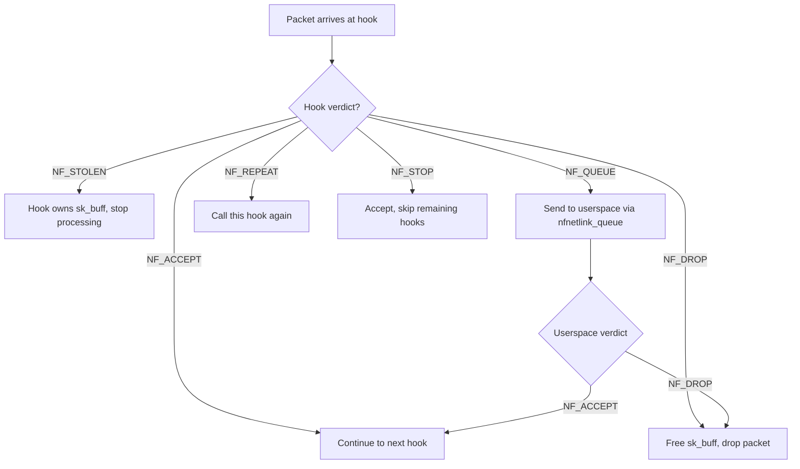

# Netfilter Hooks

## Overview

**Netfilter** is the Linux kernel's framework for packet filtering, NAT, and packet mangling. It provides a series of **hook points** in the network stack where kernel modules can register callback functions to inspect, modify, or drop packets.

Netfilter is the foundation for `iptables`, `nftables`, and numerous third-party networking modules.

> **See also:** [iptables and nftables](./iptables.md), [Conntrack](./conntrack.md), [NAT](./nat.md)

---

## Hook Points (NF_INET_*)

The kernel defines five hook points for IPv4/IPv6 traffic. Each corresponds to a specific location in the packet processing path:

| Hook Constant         | Chain Name (iptables) | Location                                   |
|-----------------------|-----------------------|--------------------------------------------|
| `NF_INET_PRE_ROUTING` | `PREROUTING`         | After packet arrives, before routing decision |
| `NF_INET_LOCAL_IN`    | `INPUT`              | Packet destined for local delivery         |
| `NF_INET_FORWARD`     | `FORWARD`            | Packet being forwarded to another host     |
| `NF_INET_LOCAL_OUT`   | `OUTPUT`             | Packet originating from local processes    |
| `NF_INET_POST_ROUTING`| `POSTROUTING`        | After routing decision, before transmission|

Additionally, for ARP:

| Hook Constant       | Description                    |
|---------------------|--------------------------------|
| `NF_ARP_IN`         | Incoming ARP packet            |
| `NF_ARP_OUT`        | Outgoing ARP packet            |
| `NF_ARP_FORWARD`    | Forwarded ARP packet           |

For bridge (Layer 2):

| Hook Constant         | Description                    |
|-----------------------|--------------------------------|
| `NF_BR_PRE_ROUTING`   | Bridge pre-routing             |
| `NF_BR_LOCAL_IN`      | Bridge local input             |
| `NF_BR_FORWARD`       | Bridge forwarding              |
| `NF_BR_LOCAL_OUT`     | Bridge local output            |
| `NF_BR_POST_ROUTING`  | Bridge post-routing            |

### Packet Flow Diagram

```
                            ┌─────────────┐
  Network Interface ──────►│PRE_ROUTING   │
                            └──────┬──────┘
                                   │
                           ┌───────▼───────┐
                           │ Routing        │
                           │ Decision       │
                           └───┬───────┬───┘
                               │       │
                    ┌──────────▼┐   ┌──▼──────────┐
                    │ LOCAL_IN   │   │ FORWARD      │
                    │ (to local) │   │ (to another) │
                    └──────┬────┘   └───────┬──────┘
                           │                │
                    ┌──────▼─────┐   ┌──────▼──────┐
                    │ Local      │   │POST_ROUTING  │
                    │ Process    │   └──────┬──────┘
                    └──────┬─────┘          │
                           │                ▼
                    ┌──────▼─────┐   Network Interface
                    │ LOCAL_OUT  │
                    └──────┬─────┘
                           │
                           ▼
                    ┌─────────────┐
                    │POST_ROUTING │
                    └──────┬──────┘
                           │
                           ▼
                    Network Interface
```

---

## Return Values

Netfilter hook functions return one of these verdicts:

| Verdict                | Value | Meaning                                       |
|------------------------|-------|-----------------------------------------------|
| `NF_DROP`             | 0     | Drop the packet silently                      |
| `NF_ACCEPT`           | 1     | Accept; continue normal processing            |
| `NF_STOLEN`           | 2     | Packet consumed by hook; don't continue       |
| `NF_QUEUE`            | 3     | Queue to userspace (via `nfnetlink_queue`)    |
| `NF_REPEAT`           | 4     | Call this hook again                          |
| `NF_STOP`             | 5     | Accept but stop calling other hooks           |

### Stolen vs. Drop

- `NF_STOLEN` — The hook takes ownership of the `sk_buff`. Used for asynchronous processing (e.g., queueing for later).
- `NF_DROP` — The `sk_buff` is freed by the caller.

### Verdict Decision Tree



---

## Hook Priority

When multiple modules register hooks at the same point, they execute in **priority order** (lower number = higher priority):

| Priority Constant              | Value | Typical Use                    |
|--------------------------------|-------|--------------------------------|
| `NF_IP_PRI_CONNTRACK_DEFRAG`  | -400  | Connection tracking defrag     |
| `NF_IP_PRI_RAW`                | -300  | Raw table processing           |
| `NF_IP_PRI_SELINUX_FIRST`     | -225  | SELinux first hook             |
| `NF_IP_PRI_CONNTRACK`         | -200  | Connection tracking             |
| `NF_IP_PRI_MANGLE`            | -150  | Packet mangling                |
| `NF_IP_PRI_NAT_DST`           | -100  | Destination NAT (conntrack)    |
| `NF_IP_PRI_FILTER`            | 0     | Standard filtering (iptables)  |
| `NF_IP_PRI_SECURITY`          | 50    | Security table                 |
| `NF_IP_PRI_NAT_SRC`           | 100   | Source NAT (conntrack)         |
| `NF_IP_PRI_CONNTRACK_HELPER`  | 200   | Connection tracking helpers    |
| `NF_IP_PRI_CONNTRACK_CONFIRM` | `INT_MAX` | Final conntrack confirm    |

---

## nf_hook_ops Structure

Kernel modules register hooks by filling in `struct nf_hook_ops`:

```c
#include <linux/netfilter.h>

static unsigned int my_hook_fn(void *priv,
                               struct sk_buff *skb,
                               const struct nf_hook_state *state)
{
    struct iphdr *iph = ip_hdr(skb);

    if (iph->protocol == IPPROTO_ICMP) {
        pr_info("ICMP packet from %pI4\n", &iph->saddr);
    }

    return NF_ACCEPT;
}

static struct nf_hook_ops my_hook_ops = {
    .hook        = my_hook_fn,
    .hooknum     = NF_INET_PRE_ROUTING,
    .pf          = PF_INET,           /* IPv4 */
    .priority    = NF_IP_PRI_FILTER,
};

static int __init my_module_init(void)
{
    return nf_register_net_hook(&init_net, &my_hook_ops);
}

static void __exit my_module_exit(void)
{
    nf_unregister_net_hook(&init_net, &my_hook_ops);
}

module_init(my_module_init);
module_exit(my_module_exit);
MODULE_LICENSE("GPL");
```

### Key Fields

| Field        | Description                                        |
|-------------|----------------------------------------------------|
| `.hook`     | Callback function pointer                          |
| `.hooknum`  | Which hook point (`NF_INET_*`)                     |
| `.pf`       | Protocol family: `PF_INET` (IPv4) or `PF_INET6`   |
| `.priority` | Execution order among hooks at the same point      |

### Network Namespaces

`nf_register_net_hook()` registers a hook within a specific network namespace. Use `&init_net` for the default namespace, or pass the appropriate `struct net *` for container-specific hooks.

```c
/* Register hook in a specific network namespace */
extern struct net init_net;

/* For container-specific hooks */
struct net *container_net = get_net_ns_by_pid(container_pid);
nf_register_net_hook(container_net, &my_hook_ops);
```

---

## Base Chains in nftables

In **nftables**, chains are classified as either **base chains** (attached to a netfilter hook) or **regular chains** (called by jump/goto from base chains).

### Creating a Base Chain

```bash
# Create a base chain attached to NF_INET_INPUT, priority 0 (filter)
nft add chain ip mytable myinput '{ type filter hook input priority 0; policy accept; }'

# NAT base chain at PREROUTING, priority -100 (dstnat)
nft add chain ip mytable prerouting '{ type nat hook prerouting priority -100; policy accept; }'
```

### Chain Types

| Type     | Allowed Hooks                              | Typical Priority |
|----------|-------------------------------------------|------------------|
| `filter` | All hooks                                 | 0                |
| `nat`    | `PREROUTING`, `INPUT`, `OUTPUT`, `POSTROUTING` | -100 (dst), 100 (src) |
| `route`  | `OUTPUT`                                  | -100             |

### Verdict Processing

In nftables, rules within a chain return **verdicts**:

| Verdict   | Effect                                       |
|-----------|----------------------------------------------|
| `accept`  | Allow the packet (equivalent to `NF_ACCEPT`) |
| `drop`    | Drop the packet (equivalent to `NF_DROP`)    |
| `queue`   | Send to userspace queue                      |
| `continue`| Continue evaluating next rule                |
| `jump`    | Jump to another chain (return after)         |
| `goto`    | Go to another chain (no return)              |

### Complete nftables Firewall Example

```bash
#!/usr/sbin/nft -f
# Complete firewall using nftables with netfilter hooks

flush ruleset

table inet firewall {
    # Rate limiting set
    set rate_limit {
        type ipv4_addr
        flags dynamic, timeout
        timeout 1m
    }

    chain input {
        type filter hook input priority 0; policy drop;

        # Allow established/related connections
        ct state established,related accept
        ct state invalid drop

        # Loopback
        iif lo accept

        # Rate limiting: max 25 new connections per minute per IP
        ct state new add @rate_limit { ip saddr limit rate 25/minute } accept
        ct state new drop

        # ICMP (ping)
        ip protocol icmp icmp type echo-request limit rate 10/second accept
        ip6 nexthdr icmpv6 icmpv6 type echo-request limit rate 10/second accept

        # SSH
        tcp dport 22 ct state new limit rate 5/minute accept

        # HTTP/HTTPS
        tcp dport { 80, 443 } ct state new accept

        # DNS
        udp dport 53 accept
        tcp dport 53 accept

        # Log dropped packets
        log prefix "nft-drop: " counter drop
    }

    chain forward {
        type filter hook forward priority 0; policy drop;

        # Allow forwarding for containers
        iifname "docker0" accept
        oifname "docker0" ct state established,related accept
    }

    chain output {
        type filter hook output priority 0; policy accept;
    }

    chain prerouting {
        type nat hook prerouting priority -100; policy accept;
    }

    chain postrouting {
        type nat hook postrouting priority 100; policy accept;

        # Masquerade container traffic
        oifname "eth0" masquerade
    }
}
```

---

## iptables Rules Using Hook Points

### Connection State Filtering

```bash
# Allow established connections (uses conntrack hooks)
iptables -A INPUT -m conntrack --ctstate ESTABLISHED,RELATED -j ACCEPT
iptables -A INPUT -m conntrack --ctstate INVALID -j DROP

# New SSH connections, rate limited
iptables -A INPUT -p tcp --dport 22 -m conntrack --ctstate NEW \
    -m recent --set --name SSH
iptables -A INPUT -p tcp --dport 22 -m conntrack --ctstate NEW \
    -m recent --update --seconds 60 --hitcount 4 --name SSH -j DROP
iptables -A INPUT -p tcp --dport 22 -m conntrack --ctstate NEW -j ACCEPT
```

### DNAT (Destination NAT) at PREROUTING

```bash
# Redirect port 80 to internal server
iptables -t nat -A PREROUTING -i eth0 -p tcp --dport 80 \
    -j DNAT --to-destination 192.168.1.100:8080

# SNAT (Source NAT) at POSTROUTING
iptables -t nat -A POSTROUTING -o eth0 -s 192.168.1.0/24 \
    -j MASQUERADE
```

### Logging at Specific Hooks

```bash
# Log all dropped packets at INPUT
iptables -A INPUT -j LOG --log-prefix "netfilter-input-drop: " --log-level 4

# Log forwarded packets
iptables -A FORWARD -j LOG --log-prefix "netfilter-forward: " --log-level 4
```

### Matching by Interface and Direction

```bash
# INPUT hook: traffic arriving on eth0 destined for local
iptables -A INPUT -i eth0 -p tcp --dport 443 -j ACCEPT

# OUTPUT hook: traffic originating from local
iptables -A OUTPUT -o eth0 -p tcp --dport 53 -j ACCEPT

# FORWARD hook: traffic being routed through
iptables -A FORWARD -i eth0 -o eth1 -j ACCEPT
```

---

## Connection Tracking Integration

Netfilter hooks are tightly integrated with **conntrack**. The conntrack subsystem registers hooks at:

1. `NF_INET_PRE_ROUTING` (priority -200) — For incoming packets
2. `NF_INET_LOCAL_OUT` (priority -100) — For locally generated packets
3. `NF_INET_LOCAL_IN` (priority 200) — Helper attachment
4. `NF_INET_POST_ROUTING` (priority 200) — Final confirmation

```bash
# View connection tracking table
conntrack -L

# View conntrack statistics
cat /proc/net/stat/nf_conntrack

# Monitor new connections
conntrack -E

# Flush conntrack table
conntrack -F

# Set conntrack table size
sysctl -w net.netfilter.nf_conntrack_max=262144

# Set conntrack timeouts
sysctl -w net.netfilter.nf_conntrack_tcp_timeout_established=86400
sysctl -w net.netfilter.nf_conntrack_tcp_timeout_time_wait=30
```

### Conntrack Table Entry

```bash
# View specific connection
conntrack -L -p tcp --dport 443
# tcp  6 431999 ESTABLISHED src=10.0.0.1 dst=93.184.216.34 sport=54321 dport=443 \
#   src=93.184.216.34 dst=10.0.0.1 sport=443 dport=54321 [ASSURED] use=1

# Conntrack zones (for overlapping IP spaces)
conntrack -L -z 100
```

### Conntrack Helpers

```bash
# Load FTP helper
modprobe nf_conntrack_ftp

# Assign helper to traffic
iptables -t raw -A PREROUTING -p tcp --dport 21 \
    -j CT --helper ftp

# View active helpers
cat /proc/net/nf_conntrack_helper
```

> **See also:** [Connection Tracking](./conntrack.md)

---

## Hook Multiplicity

Multiple hooks can coexist at the same point. The kernel iterates through them in priority order:

```
NF_INET_PRE_ROUTING (priority order):
  [-400] conntrack_defrag
  [-300] raw processing
  [-200] conntrack
  [-150] mangle
  [-100] DNAT
  [   0] filter (user rules)
  ...
```

Each hook independently returns `NF_ACCEPT`, `NF_DROP`, etc. If **any** hook drops the packet, processing stops and the packet is dropped.

---

## Userspace Queueing (NFQUEUE)

Packets can be sent to userspace for inspection via `NF_QUEUE`:

```bash
# iptables: queue packets to userspace NFQUEUE number 1
iptables -A INPUT -p tcp --dport 80 -j NFQUEUE --queue-num 1

# nftables equivalent
nft add rule ip mytable input tcp dport 80 queue num 1
```

Userspace programs use `libnetfilter_queue` to receive and verdict packets:

```c
/* Pseudocode: receive and accept */
struct nfq_handle *h = nfq_open();
nfq_create_queue(h, 1, callback, NULL);
/* callback returns NF_ACCEPT or NF_DROP */
```

### NFQUEUE with Load Balancing

```bash
# Queue to multiple queues for parallel processing
iptables -A INPUT -p tcp --dport 80 -j NFQUEUE --queue-balance 0:3

# nftables
nft add rule ip mytable input tcp dport 80 queue num 0-3
```

### NFQUEUE with conntrack

```bash
# Use connmark for flow-based queue assignment
iptables -t mangle -A PREROUTING -p tcp --dport 80 \
    -j CONNMARK --set-mark 1
iptables -t mangle -A PREROUTING -m connmark --mark 1 \
    -j NFQUEUE --queue-balance 0:3 --queue-bypass
```

---

## eBPF and Netfilter Integration

Linux 6.x+ allows eBPF programs to interact with netfilter hooks:

```c
/* eBPF program attached to netfilter hook */
SEC("netfilter")
int netfilter_prog(struct bpf_nf_ctx *ctx)
{
    struct sk_buff *skb = ctx->skb;
    struct iphdr *iph = ip_hdr(skb);

    /* Drop packets from specific IP */
    if (iph->saddr == htonl(0xC0A80101)) {  /* 192.168.1.1 */
        return NF_DROP;
    }

    return NF_ACCEPT;
}
```

### Attaching eBPF to Netfilter Hooks

```bash
# Using bpftool to attach eBPF to netfilter
bpftool prog load netfilter_prog.o /sys/fs/bpf/netfilter_prog
bpftool net attach netfilter id <prog_id> hook <hook_name>

# Or via iproute2/tc for bridge netfilter
tc filter add dev eth0 ingress bpf da obj netfilter_prog.o sec netfilter
```

### eBPF vs Traditional Netfilter Modules

| Aspect | Netfilter Module | eBPF Program |
|--------|-----------------|--------------|
| Safety | Kernel code, can crash | Verified, safe by construction |
| Performance | Good | Excellent (JIT compiled) |
| Flexibility | Full kernel API | Limited by verifier |
| Hot-reload | Module unload/load | Atomic replace |
| Debugging | ftrace, printk | bpftool, bpf_printk |
| State | Kernel data structures | BPF maps |

---

## Debugging

### /proc and /sys Entries

```bash
# View registered hooks
cat /proc/net/netfilter/nf_log

# View netfilter statistics
cat /proc/net/stat/nf_conntrack

# View nf_log per-protocol
ls /proc/sys/net/netfilter/nf_log/

# View registered hook modules
lsmod | grep nf_

# View netfilter module parameters
modinfo nf_conntrack
```

### Tracing with nftrace (nftables)

```bash
# Enable tracing for matched packets
nft add rule ip mytable input tcp dport 22 nftrace set 1

# View trace events
nft monitor trace

# Trace output example:
# trace id 8f7a6e5d ip mytable input tcp dport 22: rule tcp dport 22 accept (verdict accept)
```

### Kernel Logging

```c
/* In a hook function */
pr_debug("netfilter: packet from %pI4 to %pI4\n",
         &iph->saddr, &iph->daddr);
```

Use dynamic debug to selectively enable:

```bash
echo "file net/ipv4/netfilter/*.c +p" > /sys/kernel/debug/dynamic_debug/control
```

### Using bpftrace for Netfilter Debugging

```bash
# Trace netfilter hook calls
bpftrace -e 'kprobe:nf_hook_slow { printf("hook called: %s\n", comm); }'

# Count packets per hook
bpftrace -e 'kprobe:nf_hook_slow { @[kstack] = count(); }'

# Trace packet drops
bpftrace -e 'kretprobe:nf_hook_slow /retval == 0/ { printf("drop: %s\n", comm); }'
```

### Packet Counters

```bash
# iptables packet counters
iptables -L -v -n
# Chain INPUT (policy ACCEPT 1234 packets, 567890 bytes)
#   pkts bytes target  prot opt in  out  source    destination
#   100  5000 ACCEPT  tcp  --  *   *    0.0.0.0/0 0.0.0.0/0  tcp dpt:22

# nftables counters
nft list ruleset -a
# add rule ip mytable input tcp dport 22 counter accept # handle 4
nft list chain ip mytable input
# counter packets 100 bytes 5000 accept
```

---

## IPv6 Hooks

The same five hook points exist for IPv6 (`PF_INET6`):

```c
static struct nf_hook_ops my_hook_ops = {
    .hook     = my_hook_fn_v6,
    .hooknum  = NF_INET_PRE_ROUTING,
    .pf       = PF_INET6,
    .priority = NF_IP_PRI_FILTER,
};
```

Use `ipv6_hdr(skb)` instead of `ip_hdr(skb)` to access the IPv6 header.

### IPv6-specific Considerations

```c
/* IPv6 hook with extension header handling */
static unsigned int ipv6_hook_fn(void *priv,
                                  struct sk_buff *skb,
                                  const struct nf_hook_state *state)
{
    struct ipv6hdr *ip6h = ipv6_hdr(skb);

    /* ICMPv6 */
    if (ip6h->nexthdr == IPPROTO_ICMPV6) {
        struct icmp6hdr *icmp6 = icmp6_hdr(skb);
        if (icmp6->icmp6_type == ICMPV6_ECHO_REQUEST) {
            pr_info("ICMPv6 ping from %pI6c\n", &ip6h->saddr);
        }
    }

    /* Fragment handling */
    if (ip6h->nexthdr == NEXTHDR_FRAGMENT) {
        /* Fragment header present - handle reassembly */
    }

    return NF_ACCEPT;
}
```

---

## Writing a Complete Module

```c
#include <linux/module.h>
#include <linux/netfilter.h>
#include <linux/ip.h>

static unsigned int count_packets;

static unsigned int hook_fn(void *priv,
                            struct sk_buff *skb,
                            const struct nf_hook_state *state)
{
    count_packets++;
    return NF_ACCEPT;
}

static struct nf_hook_ops ops = {
    .hook     = hook_fn,
    .hooknum  = NF_INET_FORWARD,
    .pf       = PF_INET,
    .priority = NF_IP_PRI_LAST,
};

static int __init mod_init(void)
{
    return nf_register_net_hook(&init_net, &ops);
}

static void __exit mod_exit(void)
{
    nf_unregister_net_hook(&init_net, &ops);
    pr_info("Forwarded %u packets\n", count_packets);
}

module_init(mod_init);
module_exit(mod_exit);
MODULE_LICENSE("GPL");
MODULE_AUTHOR("Kernel Developer");
```

### Multi-Hook Module Example

```c
/* Module that registers hooks at multiple points */
#include <linux/module.h>
#include <linux/netfilter.h>
#include <linux/ip.h>
#include <linux/proc_fs.h>
#include <linux/seq_file.h>

static atomic_t pre_routing_cnt = ATOMIC_INIT(0);
static atomic_t local_in_cnt = ATOMIC_INIT(0);
static atomic_t forward_cnt = ATOMIC_INIT(0);

static unsigned int hook_pre_routing(void *priv, struct sk_buff *skb,
                                      const struct nf_hook_state *state)
{
    atomic_inc(&pre_routing_cnt);
    return NF_ACCEPT;
}

static unsigned int hook_local_in(void *priv, struct sk_buff *skb,
                                   const struct nf_hook_state *state)
{
    atomic_inc(&local_in_cnt);
    return NF_ACCEPT;
}

static unsigned int hook_forward(void *priv, struct sk_buff *skb,
                                  const struct nf_hook_state *state)
{
    atomic_inc(&forward_cnt);
    return NF_ACCEPT;
}

static struct nf_hook_ops hooks[] = {
    {
        .hook = hook_pre_routing,
        .hooknum = NF_INET_PRE_ROUTING,
        .pf = PF_INET,
        .priority = NF_IP_PRI_LAST,
    },
    {
        .hook = hook_local_in,
        .hooknum = NF_INET_LOCAL_IN,
        .pf = PF_INET,
        .priority = NF_IP_PRI_LAST,
    },
    {
        .hook = hook_forward,
        .hooknum = NF_INET_FORWARD,
        .pf = PF_INET,
        .priority = NF_IP_PRI_LAST,
    },
};

/* /proc/net/netfilter_stats */
static int stats_show(struct seq_file *m, void *v)
{
    seq_printf(m, "pre_routing: %u\n", atomic_read(&pre_routing_cnt));
    seq_printf(m, "local_in:    %u\n", atomic_read(&local_in_cnt));
    seq_printf(m, "forward:     %u\n", atomic_read(&forward_cnt));
    return 0;
}

static int __init mod_init(void)
{
    int i, ret;

    for (i = 0; i < ARRAY_SIZE(hooks); i++) {
        ret = nf_register_net_hook(&init_net, &hooks[i]);
        if (ret) {
            while (--i >= 0)
                nf_unregister_net_hook(&init_net, &hooks[i]);
            return ret;
        }
    }

    proc_create_single("netfilter_stats", 0444, NULL, stats_show);
    pr_info("Netfilter stats module loaded\n");
    return 0;
}

static void __exit mod_exit(void)
{
    int i;
    remove_proc_entry("netfilter_stats", NULL);
    for (i = ARRAY_SIZE(hooks) - 1; i >= 0; i--)
        nf_unregister_net_hook(&init_net, &hooks[i]);
    pr_info("Netfilter stats module unloaded\n");
}

module_init(mod_init);
module_exit(mod_exit);
MODULE_LICENSE("GPL");
```

---

## Performance Considerations

### Hook Registration Overhead

- Each registered hook adds a function call to every packet traversing that hook point
- Minimize the number of hooks; combine logic where possible
- Use early-exit (return `NF_ACCEPT` quickly) for non-matching packets

### Conntrack Performance

```bash
# Increase conntrack table size for busy servers
sysctl -w net.netfilter.nf_conntrack_max=1048576

# Reduce timeouts for short-lived connections
sysctl -w net.netfilter.nf_conntrack_tcp_timeout_syn_recv=10
sysctl -w net.netfilter.nf_conntrack_tcp_timeout_fin_wait=10
sysctl -w net.netfilter.nf_conntrack_tcp_timeout_time_wait=10

# Disable conntrack for specific traffic (NOTRACK)
iptables -t raw -A PREROUTING -p tcp --dport 80 -j NOTRACK
iptables -t raw -A OUTPUT -p tcp --sport 80 -j NOTRACK
```

### Bypassing Netfilter for Performance

```bash
# Disable conntrack for high-throughput traffic
iptables -t raw -A PREROUTING -i eth0 -p tcp --dport 3306 -j NOTRACK
iptables -t raw -A OUTPUT -o eth0 -p tcp --sport 3306 -j NOTRACK

# Use nftables sets for fast lookups
nft add set ip filter blocked_ips { type ipv4_addr\; flags interval\; }
nft add element ip filter blocked_ips { 192.168.1.100, 10.0.0.0/8 }
nft add rule ip filter input ip saddr @blocked_ips drop
```

---

## Security Considerations

### Hook Ordering Attacks

- Incorrect hook priority can allow packets to bypass security checks
- Always use well-defined priorities (see priority table above)
- Test hook ordering with `nft monitor trace` or packet captures

### Conntrack Bypass

- Attackers can craft packets that confuse conntrack state tracking
- Use `ct state invalid drop` to catch malformed state transitions
- Enable `nf_conntrack_tcp_be_liberal` cautiously

### Module Loading Security

```bash
# Only load signed netfilter modules (with kernel lockdown)
cat /sys/kernel/security/lockdown
# [integrity] confidentiality

# Verify module signatures
modinfo nf_conntrack | grep sig
```

### Privilege Requirements

- Registering netfilter hooks requires `CAP_NET_ADMIN`
- In containers, this capability is typically restricted
- Use `nftables` with proper user permissions

---

## Cross-References

- [iptables and nftables](./iptables.md) — User-space firewall configuration
- [Connection Tracking](./conntrack.md) — Conntrack subsystem
- [NAT](./nat.md) — Network Address Translation
- [eBPF and XDP](./ebpf-xdp.md) — eBPF packet processing
- [Netfilter Logging](./nf-log.md) — Packet logging

---

## Further Reading

- [Netfilter.org](https://www.netfilter.org/) — Official project page
- [Linux kernel source: `include/uapi/linux/netfilter.h`](https://elixir.bootlin.com/linux/latest/source/include/uapi/linux/netfilter.h)
- [Linux kernel source: `net/netfilter/core.c`](https://elixir.bootlin.com/linux/latest/source/net/netfilter/core.c)
- [nftables wiki](https://wiki.nftables.org/)
- **Linux Kernel Networking: Implementation and Theory** — Rami Rosen
- [LWN: A brief history of nftables](https://lwn.net/Articles/744528/)
- [Netfilter Hooks](https://www.netfilter.org/documentation/HOWTO/netfilter-hacking-HOWTO-3.html)
- [Writing Netfilter Modules (PDF)](https://inai.de/documents/Netfilter_Modules.pdf)
- [Oracle: Introduction to Netfilter](https://blogs.oracle.com/linux/introduction-to-netfilter)

> **Related topics:** [iptables](./iptables.md), [eBPF and XDP](./ebpf-xdp.md), [Netfilter Logging](./nf-log.md), [Conntrack](./conntrack.md)
