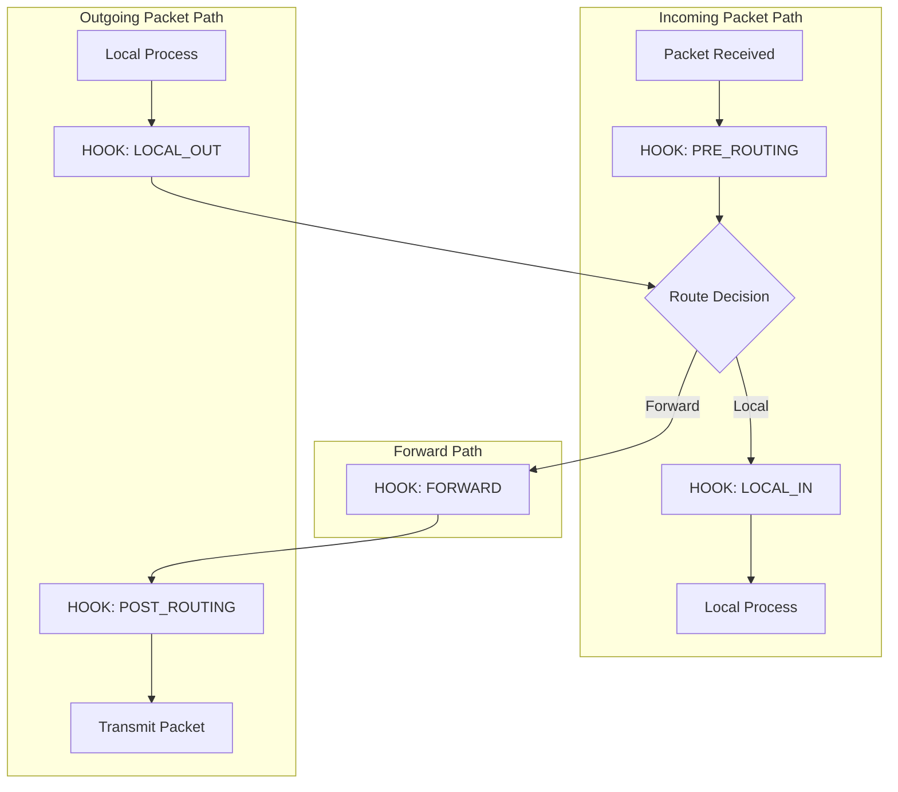
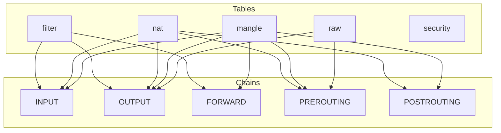
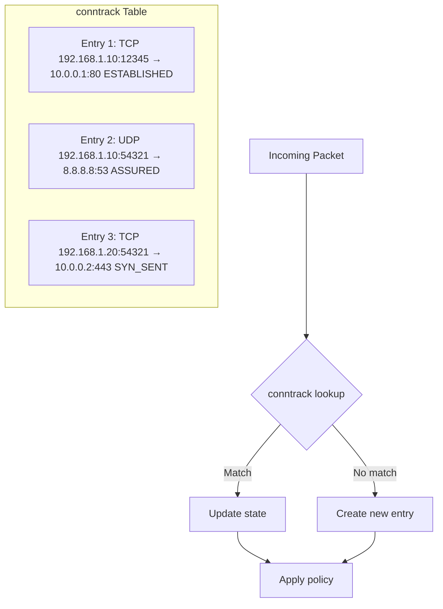
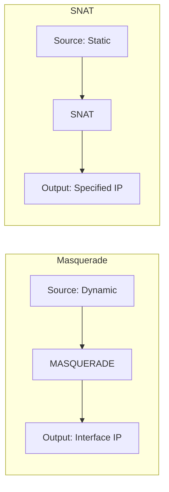
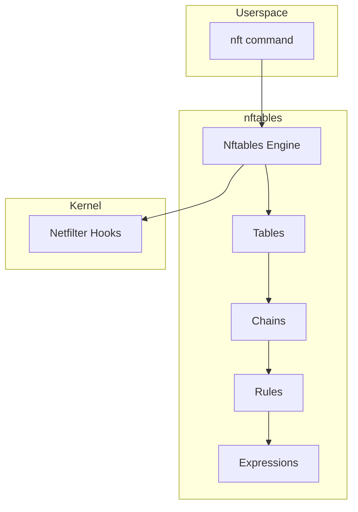

# Netfilter Framework

## Introduction

Netfilter is the Linux kernel's packet filtering, mangling, and NAT framework. It provides a set of hooks in the kernel networking stack where packet manipulation functions can be registered. Netfilter is the foundation for tools like `iptables`, `nftables`, and connection tracking (`conntrack`).

This chapter covers the Netfilter architecture, hook points, tables and chains, connection tracking, and the evolution from iptables to nftables.

## Netfilter Architecture

Netfilter operates by inserting hook functions at strategic points in the packet processing path. These hooks allow registered callback functions to examine, modify, accept, drop, or queue packets.

### Hook Points

There are five main hook points in the Netfilter framework:



| Hook | Constant | Description |
|------|----------|-------------|
| PRE_ROUTING | `NF_INET_PRE_ROUTING` | Before routing decision |
| LOCAL_IN | `NF_INET_LOCAL_IN` | After routing, destined for local process |
| FORWARD | `NF_INET_FORWARD` | Packets being forwarded |
| LOCAL_OUT | `NF_INET_LOCAL_OUT` | Locally generated packets |
| POST_ROUTING | `NF_INET_POST_ROUTING` | After routing, before transmission |

### Hook Registration

Kernel modules register callbacks at hook points:

```c
/* Netfilter hook structure */
struct nf_hook_ops {
    struct list_head    list;
    nf_hookfn           *hook;         /* Hook function */
    struct net_device   *dev;          /* Device (NULL for all) */
    void                *priv;         /* Private data */
    u_int8_t            pf;            /* Protocol family */
    unsigned int        hooknum;       /* Hook number */
    int                 priority;      /* Hook priority */
};

/* Example hook function */
static unsigned int my_hook_fn(void *priv,
                               struct sk_buff *skb,
                               const struct nf_hook_state *state)
{
    struct iphdr *iph = ip_hdr(skb);

    /* Drop packets from a specific IP */
    if (iph->saddr == htonl(0xC0A80101))  /* 192.168.1.1 */
        return NF_DROP;

    return NF_ACCEPT;
}

/* Register the hook */
static struct nf_hook_ops my_hook = {
    .hook       = my_hook_fn,
    .pf         = PF_INET,
    .hooknum    = NF_INET_PRE_ROUTING,
    .priority   = NF_IP_PRI_FIRST,
};

/* In module init */
nf_register_net_hook(&init_net, &my_hook);
```

### Hook Return Values

| Return | Constant | Description |
|--------|----------|-------------|
| 0 | `NF_DROP` | Drop the packet |
| 1 | `NF_ACCEPT` | Accept and continue processing |
| 2 | `NF_STOLEN` | Packet taken by hook, don't continue |
| 3 | `NF_QUEUE` | Queue packet to userspace |
| 4 | `NF_REPEAT` | Call this hook again (re-evaluate same hook) |
| 5 | `NF_STOP` | Accept, but don't continue with other hooks |

## Tables and Chains (iptables)

### iptables Architecture

iptables organizes rules into tables and chains:



### Table Purposes

| Table | Purpose |
|-------|---------|
| `filter` | Packet filtering (firewall rules) |
| `nat` | Network Address Translation |
| `mangle` | Packet header modification |
| `raw` | Connection tracking bypass |
| `security` | SELinux security markings |

### Chain Processing Order

For incoming packets destined for local process:
```
raw:PREROUTING → conntrack → mangle:PREROUTING → nat:PREROUTING →
routing decision → mangle:INPUT → filter:INPUT → security:INPUT → local process
```

For forwarded packets:
```
raw:PREROUTING → conntrack → mangle:PREROUTING → nat:PREROUTING →
routing decision → mangle:FORWARD → filter:FORWARD → security:FORWARD →
mangle:POSTROUTING → nat:POSTROUTING → transmit
```

For locally generated packets:
```
local process → raw:OUTPUT → conntrack → mangle:OUTPUT → nat:OUTPUT →
routing decision → filter:OUTPUT → security:OUTPUT →
mangle:POSTROUTING → nat:POSTROUTING → transmit
```

### iptables Commands

```bash
# List all rules
$ sudo iptables -L -n -v

# Add a rule to drop incoming traffic from 192.168.1.100
$ sudo iptables -A INPUT -s 192.168.1.100 -j DROP

# Allow incoming SSH
$ sudo iptables -A INPUT -p tcp --dport 22 -j ACCEPT

# Allow established connections
$ sudo iptables -A INPUT -m state --state ESTABLISHED,RELATED -j ACCEPT

# NAT (masquerade)
$ sudo iptables -t nat -A POSTROUTING -o eth0 -j MASQUERADE

# Port forwarding
$ sudo iptables -t nat -A PREROUTING -p tcp --dport 80 \
    -j DNAT --to-destination 192.168.1.10:80

# Delete a rule by number
$ sudo iptables -D INPUT 3

# Save rules
$ sudo iptables-save > /etc/iptables/rules.v4

# Restore rules
$ sudo iptables-restore < /etc/iptables/rules.v4
```

## Connection Tracking (conntrack)

### How conntrack Works

Connection tracking is the foundation of stateful firewalling and NAT in Linux. It maintains a table of all network connections passing through the system.



### Connection States

```c
/* Connection tracking states */
enum ip_conntrack_info {
    IP_CT_NEW,              /* New connection */
    IP_CT_ESTABLISHED,      /* Established connection */
    IP_CT_RELATED,          /* Related to existing connection */
    IP_CT_IS_REPLY,         /* Reply direction */
    IP_CT_ESTABLISHED_REPLY,/* Established reply */
    IP_CT_RELATED_REPLY,    /* Related reply */
    IP_CT_NUMBER = IP_CT_IS_REPLY * 2 - 1
};
```

### conntrack Commands

```bash
# List all tracked connections
$ sudo conntrack -L

# Show connection count
$ sudo conntrack -C

# Show specific protocol connections
$ sudo conntrack -L -p tcp

# Flush the conntrack table
$ sudo conntrack -F

# Delete specific entry
$ sudo conntrack -D -s 192.168.1.100

# Monitor new connections
$ sudo conntrack -E

# conntrack statistics
$ cat /proc/net/stat/nf_conntrack

# View conntrack table parameters
$ sudo sysctl net.netfilter.nf_conntrack_max
net.netfilter.nf_conntrack_max = 262144

# Set maximum connections
$ sudo sysctl -w net.netfilter.nf_conntrack_max=524288

# View conntrack timeouts
$ sudo sysctl net.netfilter.nf_conntrack_tcp_timeout_established
net.netfilter.nf_conntrack_tcp_timeout_established = 432000
```

### conntrack Helper Modules

```bash
# Load FTP conntrack helper
$ sudo modprobe nf_conntrack_ftp

# Load SIP conntrack helper
$ sudo modprobe nf_conntrack_sip

# Use in iptables
$ sudo iptables -A INPUT -m helper --helper ftp -j ACCEPT
```

## NAT (Network Address Translation)

### SNAT (Source NAT)

```bash
# Masquerade (dynamic SNAT)
$ sudo iptables -t nat -A POSTROUTING -o eth0 -j MASQUERADE

# Static SNAT
$ sudo iptables -t nat -A POSTROUTING -o eth0 \
    -j SNAT --to-source 203.0.113.1

# Kernel implementation
static unsigned int nf_nat_ipv4_out(void *priv, struct sk_buff *skb,
                                    const struct nf_hook_state *state)
{
    /* Modify source address */
    if (ct->status & IPS_SRC_NAT) {
        iph->saddr = new_addr;
        inet_proto_csum_replace4(&iph->check, skb, old_addr,
                                  new_addr, false);
    }
}
```

### DNAT (Destination NAT)

```bash
# Port forwarding
$ sudo iptables -t nat -A PREROUTING -i eth0 -p tcp --dport 80 \
    -j DNAT --to-destination 192.168.1.10:80

# Redirect to local port
$ sudo iptables -t nat -A PREROUTING -p tcp --dport 8080 \
    -j REDIRECT --to-port 80
```

### Masquerade vs SNAT



- **Masquerade**: Automatically uses the outgoing interface's IP address. Good for dynamic IP (DHCP).
- **SNAT**: Uses a statically configured IP address. Better performance for fixed IPs.

## nftables

### Architecture

nftables is the successor to iptables, providing a more efficient and flexible framework:



### Key Improvements Over iptables

| Feature | iptables | nftables |
|---------|----------|----------|
| Rule processing | Linear scan | Optimized with sets and maps |
| IPv4/IPv6 | Separate tools | Unified framework |
| Atomic updates | No | Yes |
| Custom data types | Limited | Full support |
| Performance | O(n) | O(1) with sets |

### nftables Commands

```bash
# List all rules
$ sudo nft list ruleset

# Create a table
$ sudo nft add table inet filter

# Create a chain
$ sudo nft add chain inet filter input { type filter hook input priority 0 \; policy drop \; }

# Add rules
$ sudo nft add rule inet filter input tcp dport 22 accept
$ sudo nft add rule inet filter input ct state established,related accept

# Create a set for efficient IP matching
$ sudo nft add set inet filter blocked_ips { type ipv4_addr \; }
$ sudo nft add element inet filter blocked_ips { 192.168.1.100, 10.0.0.50 }
$ sudo nft add rule inet filter input ip saddr @blocked_ips drop

# NAT with nftables
$ sudo nft add table nat
$ sudo nft add chain nat postrouting { type nat hook postrouting priority 100 \; }
$ sudo nft add rule nat postrouting oifname "eth0" masquerade

# Save ruleset
$ sudo nft list ruleset > /etc/nftables.conf

# Restore ruleset
$ sudo nft -f /etc/nftables.conf
```

### Migration from iptables

```bash
# Translate iptables rules to nftables
$ sudo iptables-translate -A INPUT -s 192.168.1.100 -j DROP
nft add rule ip filter INPUT ip saddr 192.168.1.100 drop

# Translate entire ruleset
$ sudo iptables-translate-restore < /etc/iptables/rules.v4

# Run iptables rules using nftables backend (compatibility layer)
$ sudo update-alternatives --set iptables /usr/sbin/iptables-nft
```

## Netfilter Hooks Implementation

### Hook Registration

```c
/* Register a netfilter hook */
int nf_register_net_hook(struct net *net, const struct nf_hook_ops *reg)
{
    struct nf_hook_entries *p, *new_hooks;
    struct nf_hook_entries __rcu **pp;

    /* Allocate new hook entry */
    new_hooks = nf_hook_entries_grow(p, reg);

    /* Insert at correct priority */
    list_add_tail(&reg->list, &net->nf.hooks[reg->pf][reg->hooknum]);

    return 0;
}
```

### Hook Execution

```c
/* Execute netfilter hooks */
unsigned int nf_hook_slow(struct sk_buff *skb,
                          struct nf_hook_state *state,
                          struct nf_hook_entries *e,
                          unsigned int index)
{
    unsigned int verdict;

    for (; index < e->num_hook_entries; index++) {
        verdict = e->hooks[index].hook(e->hooks[index].priv,
                                        skb, state);

        switch (verdict) {
        case NF_ACCEPT:
            continue;      /* Continue to next hook */
        case NF_DROP:
            kfree_skb(skb);
            return NF_DROP;
        case NF_QUEUE:
            nf_queue(skb, state, e, index);
            return NF_STOLEN;
        case NF_STOLEN:
            return NF_STOLEN;
        case NF_REPEAT:
            index--;
            continue;
        }
    }

    return NF_ACCEPT;
}
```

### Priority Values

```c
/* Netfilter hook priorities */
enum nf_ip_hook_priorities {
    NF_IP_PRI_FIRST = INT_MIN,
    NF_IP_PRI_RAW_BEFORE_DEFRAG = -450,
    NF_IP_PRI_CONNTRACK_DEFRAG = -400,
    NF_IP_PRI_RAW = -300,
    NF_IP_PRI_SELINUX_FIRST = -225,
    NF_IP_PRI_CONNTRACK = -200,
    NF_IP_PRI_MANGLE = -150,
    NF_IP_PRI_NAT_DST = -100,
    NF_IP_PRI_FILTER = 0,
    NF_IP_PRI_SECURITY = 50,
    NF_IP_PRI_NAT_SRC = 100,
    NF_IP_PRI_SELINUX_LAST = 225,
    NF_IP_PRI_CONNTRACK_HELPER = 300,
    NF_IP_PRI_NAT_SEQ_ADJUST = INT_MAX - 2,
    NF_IP_PRI_LAST = INT_MAX,
};
```

## Queueing to Userspace (NFQUEUE)

```c
/* NFQUEUE userspace processing */
static unsigned int nf_queue_hook(void *priv, struct sk_buff *skb,
                                  const struct nf_hook_state *state)
{
    return nf_queue(skb, state, ...);
}

/* Userspace processing with libnetfilter_queue */
#include <libnetfilter_queue/libnetfilter_queue.h>

static int callback(struct nfq_q_handle *qh,
                    struct nfgenmsg *nfmsg,
                    struct nfq_data *nfa, void *data)
{
    struct nfqnl_msg_packet_hdr *ph;
    unsigned char *payload;
    int len;

    ph = nfq_get_msg_packet_hdr(nfa);
    len = nfq_get_payload(nfa, &payload);

    /* Analyze packet and decide */
    return nfq_set_verdict(qh, ntohl(ph->packet_id),
                           NF_ACCEPT, 0, NULL);
}
```

## Performance Considerations

### Rule Optimization

```bash
# Use sets for efficient IP matching (nftables)
$ sudo nft add set inet filter whitelist { type ipv4_addr \; flags interval \; }
$ sudo nft add element inet filter whitelist { 192.168.1.0/24, 10.0.0.0/8 }
$ sudo nft add rule inet filter input ip saddr @whitelist accept

# Use connection tracking instead of port matching
$ sudo iptables -A INPUT -m conntrack --ctstate ESTABLISHED,RELATED -j ACCEPT
```

### conntrack Performance

```bash
# Increase conntrack table size
$ sudo sysctl -w net.netfilter.nf_conntrack_max=1048576

# Reduce timeouts for better memory usage
$ sudo sysctl -w net.netfilter.nf_conntrack_tcp_timeout_time_wait=30
$ sudo sysctl -w net.netfilter.nf_conntrack_tcp_timeout_close_wait=30

# Disable conntrack for specific traffic
$ sudo iptables -t raw -A PREROUTING -p tcp --dport 80 -j NOTRACK
$ sudo iptables -t raw -A OUTPUT -p tcp --sport 80 -j NOTRACK
```

## Debugging Netfilter

### Logging

```bash
# Log dropped packets
$ sudo iptables -A INPUT -j LOG --log-prefix "INPUT DROP: " --log-level 4

# View kernel log
$ sudo journalctl -k | grep "INPUT DROP"

# nftables logging
$ sudo nft add rule inet filter input log prefix "INPUT DROP: " drop
```

### Monitoring

```bash
# Watch conntrack events in real-time
$ sudo conntrack -E

# Check packet/byte counters
$ sudo iptables -L -v -n

# View netfilter statistics
$ cat /proc/net/stat/nf_conntrack
entries  found  new  invalid  ignore  delete  delete_list  insert  insert_failed  drop  early_drop  error  search_restart
1234     5678   90   12       34      56      78           90      1              0     0           0      12
```

## conntrack Sysctl Variables (from Kernel Docs)

From the kernel documentation at `docs.kernel.org/networking/nf_conntrack-sysctl.html`:

| Variable | Default | Description |
|----------|---------|-------------|
| `nf_conntrack_acct` | 0 | Enable per-flow 64-bit byte and packet counters |
| `nf_conntrack_buckets` | auto (RAM/16384) | Hash table size (1024–262144 buckets) |
| `nf_conntrack_checksum` | 1 | Verify checksum of incoming packets |
| `nf_conntrack_count` | (read-only) | Number of currently allocated flow entries |
| `nf_conntrack_events` | 2 (auto) | Provide conntrack events via ctnetlink |
| `nf_conntrack_expect_max` | buckets/256 | Maximum expectation table size |
| `nf_conntrack_max` | =buckets | Maximum tracked connections (entries added twice—original + reply) |
| `nf_conntrack_tcp_be_liberal` | 0 | Only mark out-of-window RST as INVALID |
| `nf_conntrack_tcp_loose` | 1 | Pick up already established connections |
| `nf_conntrack_tcp_max_retrans` | 3 | Max retransmits before shorter timer |
| `nf_conntrack_timestamp` | 0 | Enable per-flow timestamping |

### TCP Timeout Variables

| Variable | Default (seconds) |
|----------|-------------------|
| `nf_conntrack_tcp_timeout_established` | 432000 (5 days) |
| `nf_conntrack_tcp_timeout_syn_sent` | 120 |
| `nf_conntrack_tcp_timeout_syn_recv` | 60 |
| `nf_conntrack_tcp_timeout_fin_wait` | 120 |
| `nf_conntrack_tcp_timeout_close_wait` | 60 |
| `nf_conntrack_tcp_timeout_last_ack` | 30 |
| `nf_conntrack_tcp_timeout_time_wait` | 120 |
| `nf_conntrack_tcp_timeout_close` | 10 |
| `nf_conntrack_tcp_timeout_max_retrans` | 300 |
| `nf_conntrack_tcp_timeout_unacknowledged` | 300 |

### Other Protocol Timeouts

| Variable | Default (seconds) |
|----------|-------------------|
| `nf_conntrack_udp_timeout` | 30 |
| `nf_conntrack_udp_timeout_stream` | 120 |
| `nf_conntrack_icmp_timeout` | 30 |
| `nf_conntrack_icmpv6_timeout` | 30 |
| `nf_conntrack_gre_timeout` | 30 |
| `nf_conntrack_gre_timeout_stream` | 180 |
| `nf_conntrack_generic_timeout` | 600 |
| `nf_conntrack_sctp_timeout_established` | 210 |

### Flow Table Offloading

| Variable | Default | Description |
|----------|---------|-------------|
| `nf_flowtable_tcp_timeout` | 30 | TCP offload timeout (returns to conntrack after aging) |
| `nf_flowtable_udp_timeout` | 30 | UDP offload timeout |

## References

- [The Linux Kernel Documentation](https://docs.kernel.org/)
- [LWN.net - Linux and free software news](https://lwn.net/)
- [GNU Project Documentation](https://www.gnu.org/doc/doc.html)
- [GNU Manuals](https://www.gnu.org/manual/manual.html)
- [Free Software Directory](https://directory.fsf.org/wiki/Main_Page)
- [Planet GNU](https://planet.gnu.org/)
- [Free Software Books](https://www.gnu.org/doc/other-free-books.html)

1. **Netfilter Project** — [www.netfilter.org](https://www.netfilter.org/)
2. **nftables Wiki** — [wiki.nftables.org](https://wiki.nftables.org/)
3. **Linux Kernel Source** — `net/netfilter/`, `net/ipv4/netfilter/`
4. **RFC 3022** — Traditional IP Network Address Translator
5. **Netfilter Conntrack Sysctl** — [docs.kernel.org/networking/nf_conntrack-sysctl.html](https://docs.kernel.org/networking/nf_conntrack-sysctl.html)
6. **man pages** — `iptables(8)`, `nft(8)`, `conntrack(8)`

## Related Topics

- [Kernel Networking Overview](overview.md) — How packets flow through the stack
- [TCP/IP Implementation](tcpip.md) — TCP/IP protocol implementation
- [XDP](xdp.md) — High-performance packet processing
- [eBPF for Networking](ebpf.md) — Programmable networking
- [Network Fundamentals](../networking/fundamentals.md) — OSI model and network basics
