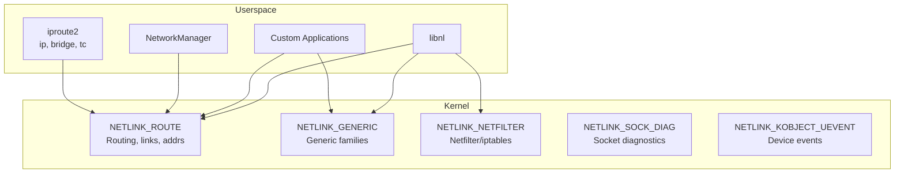

# Netlink

## Introduction

Netlink is a Linux kernel IPC mechanism designed specifically for communication between the kernel and userspace. It is the primary interface for configuring and monitoring the network subsystem. Tools like `ip`, `bridge`, `tc`, `nftables`, and `wpa_supplicant` all use netlink sockets under the hood.

Netlink replaces the older ioctl interface for network configuration with a message-based protocol that supports structured data (via TLV — Type-Length-Value attributes), multicast notifications, and asynchronous events. It uses standard socket APIs (`socket()`, `sendmsg()`, `recvmsg()`), making it familiar to network programmers.

## Netlink Architecture



## Netlink Families

| Family | Constant | Purpose |
|--------|----------|---------|
| `NETLINK_ROUTE` | 0 | Routing, link, address, neighbor management |
| `NETLINK_NETFILTER` | 12 | Netfilter (iptables/nftables) |
| `NETLINK_SOCK_DIAG` | 4 | Socket diagnostics (ss) |
| `NETLINK_GENERIC` | 16 | Generic families (nl80211, nbd, etc.) |
| `NETLINK_KOBJECT_UEVENT` | 15 | Kernel uevents (udev) |
| `NETLINK_NFLOG` | 5 | Netfilter logging |
| `NETLINK_AUDIT` | 9 | Audit subsystem |
| `NETLINK_CRYPTO` | 21 | Crypto subsystem |
| `NETLINK_SCSITRANSPORT` | 18 | SCSI transport |

## Basic Netlink Socket

### Raw Socket API

```c
#include <sys/socket.h>
#include <linux/netlink.h>
#include <linux/rtnetlink.h>
#include <string.h>
#include <unistd.h>

int main(void)
{
    int fd;
    struct sockaddr_nl addr;
    
    /* Create netlink socket */
    fd = socket(AF_NETLINK, SOCK_RAW, NETLINK_ROUTE);
    if (fd < 0) {
        perror("socket");
        return 1;
    }
    
    /* Bind to receive kernel notifications */
    memset(&addr, 0, sizeof(addr));
    addr.nl_family = AF_NETLINK;
    addr.nl_pid = getpid();    /* unique ID (0 for kernel-assigned) */
    addr.nl_groups = RTMGRP_LINK | RTMGRP_IPV4_IFADDR;  /* multicast groups */
    
    if (bind(fd, (struct sockaddr *)&addr, sizeof(addr)) < 0) {
        perror("bind");
        close(fd);
        return 1;
    }
    
    /* Receive messages */
    char buf[4096];
    struct sockaddr_nl from;
    struct iovec iov = { buf, sizeof(buf) };
    struct msghdr msg = {
        .msg_name = &from,
        .msg_namelen = sizeof(from),
        .msg_iov = &iov,
        .msg_iovlen = 1,
    };
    
    while (1) {
        ssize_t len = recvmsg(fd, &msg, 0);
        if (len < 0)
            break;
        
        struct nlmsghdr *nlh = (struct nlmsghdr *)buf;
        for (; NLMSG_OK(nlh, len); nlh = NLMSG_NEXT(nlh, len)) {
            switch (nlh->nlmsg_type) {
            case RTM_NEWLINK:
                printf("New link\n");
                break;
            case RTM_DELLINK:
                printf("Deleted link\n");
                break;
            case RTM_NEWADDR:
                printf("New address\n");
                break;
            case RTM_DELADDR:
                printf("Deleted address\n");
                break;
            default:
                printf("Message type: %d\n", nlh->nlmsg_type);
            }
        }
    }
    
    close(fd);
    return 0;
}
```

### Sending Netlink Messages

```c
#include <sys/socket.h>
#include <linux/netlink.h>
#include <linux/rtnetlink.h>
#include <linux/if.h>
#include <string.h>

/* Request all network interfaces */
int send_dump_request(int fd)
{
    struct {
        struct nlmsghdr nlh;
        struct ifinfomsg ifm;
    } req;
    
    memset(&req, 0, sizeof(req));
    req.nlh.nlmsg_len = sizeof(req);
    req.nlh.nlmsg_type = RTM_GETLINK;
    req.nlh.nlmsg_flags = NLM_F_REQUEST | NLM_F_DUMP;
    req.nlh.nlmsg_seq = 1;
    req.nlh.nlmsg_pid = getpid();
    req.ifm.ifi_family = AF_UNSPEC;
    
    struct sockaddr_nl addr = {
        .nl_family = AF_NETLINK,
    };
    
    struct iovec iov = { &req, req.nlh.nlmsg_len };
    struct msghdr msg = {
        .msg_name = &addr,
        .msg_namelen = sizeof(addr),
        .msg_iov = &iov,
        .msg_iovlen = 1,
    };
    
    return sendmsg(fd, &msg, 0);
}
```

## Netlink Message Format

### Classic vs Generic Netlink

From the kernel documentation at `docs.kernel.org/userspace-api/netlink/intro.html`:

The initial implementation of Netlink (Classic Netlink) depended on static allocation of IDs to subsystems. Classic Netlink protocols include `NETLINK_ROUTE` (general networking), `NETLINK_ISCSI` (iSCSI), and `NETLINK_AUDIT` (audit). The list is defined in `include/uapi/linux/netlink.h`.

**Generic Netlink** (introduced in 2005) allows for dynamic registration of subsystems and subsystem ID allocation. It provides introspection and simplifies implementing the kernel side. The number of subsystems using Generic Netlink outnumbers the older protocols by an order of magnitude, and there are no plans for adding more Classic Netlink protocols.

### Message Flow Pattern

A simplified Netlink "call" follows this pattern:

```c
fd = socket(AF_NETLINK, SOCK_RAW, NETLINK_GENERIC);

/* format the request */
send(fd, &request, sizeof(request));
n = recv(fd, &response, RSP_BUFFER_SIZE);
/* interpret the response */
```

For **dumping** (e.g., listing all network interfaces):

```c
fd = socket(AF_NETLINK, SOCK_RAW, NETLINK_GENERIC);
send(fd, &request, sizeof(request));
while (1) {
    n = recv(fd, &buffer, RSP_BUFFER_SIZE);
    for (nl_msg in buffer) {
        if (nl_msg.nlmsg_type == NLMSG_DONE)
            goto dump_finished;
        /* process the object */
    }
}
dump_finished:
```

Three usual types of message exchanges:
- **do**: Performing a single action (`NLM_F_REQUEST | NLM_F_ACK`)
- **dump**: Dumping information (`NLM_F_REQUEST | NLM_F_ACK | NLM_F_DUMP`)
- **multicast**: Asynchronous notifications from the kernel (subscription-based)

### Header: struct nlmsghdr

```c
struct nlmsghdr {
    __u32 nlmsg_len;    /* Length of message including header */
    __u16 nlmsg_type;   /* Message type */
    __u16 nlmsg_flags;  /* Flags */
    __u32 nlmsg_seq;    /* Sequence number */
    __u32 nlmsg_pid;    /* Port ID (sender) */
};
```

### Message Types (NETLINK_ROUTE)

```c
/* Link messages */
#define RTM_NEWLINK    16   /* Create/modify interface */
#define RTM_DELLINK    17   /* Delete interface */
#define RTM_GETLINK    18   /* Get interface info */

/* Address messages */
#define RTM_NEWADDR    20   /* Add address */
#define RTM_DELADDR    21   /* Delete address */
#define RTM_GETADDR    22   /* Get address info */

/* Route messages */
#define RTM_NEWROUTE   24   /* Add route */
#define RTM_DELROUTE   25   /* Delete route */
#define RTM_GETROUTE   26   /* Get route info */

/* Neighbor messages */
#define RTM_NEWNEIGH   28   /* Add ARP entry */
#define RTM_DELNEIGH   29   /* Delete ARP entry */
#define RTM_GETNEIGH   30   /* Get ARP info */

/* Rule messages */
#define RTM_NEWRULE    32   /* Add routing rule */
#define RTM_DELRULE    33   /* Delete routing rule */
#define RTM_GETRULE    34   /* Get routing rule */
```

### Message Flags

```c
#define NLM_F_REQUEST   0x01  /* Request message */
#define NLM_F_MULTI     0x02  /* Multi-part message */
#define NLM_F_ACK       0x04  /* Request ACK */
#define NLM_F_ECHO      0x08  /* Echo this request */
#define NLM_F_DUMP      (NLM_F_ROOT | NLM_F_MATCH)
#define NLM_F_ROOT      0x100  /* Return entire table */
#define NLM_F_MATCH     0x200  /* Return matching entries */
#define NLM_F_ATOMIC    0x400  /* Atomic dump */
#define NLM_F_CREATE    0x400  /* Create if doesn't exist */
#define NLM_F_EXCL      0x200  /* Don't if already exists */
#define NLM_F_REPLACE   0x100  /* Replace existing */
#define NLM_F_APPEND    0x800  /* Add to end of list */
```

### TLV Attributes

```c
struct rtattr {
    unsigned short rta_len;    /* Length of option */
    unsigned short rta_type;   /* Type of option */
    /* Followed by attribute data */
};

/* Macros for working with attributes */
#define RTA_LENGTH(len)     (RTA_ALIGN(sizeof(struct rtattr)) + (len))
#define RTA_DATA(rta)       ((void *)(((char *)(rta)) + RTA_LENGTH(0)))
#define RTA_OK(rta, len)    ((len) >= (int)sizeof(struct rtattr) && \
                             (rta)->rta_len >= sizeof(struct rtattr) && \
                             (rta)->rta_len <= (len))
#define RTA_NEXT(rta, attrlen) \
    ((attrlen) -= RTA_ALIGN((rta)->rta_len), \
     (struct rtattr *)(((char *)(rta)) + RTA_ALIGN((rta)->rta_len)))

/* Parsing attributes */
static int parse_rtattr(struct rtattr *tb[], int max,
                        struct rtattr *rta, int len)
{
    memset(tb, 0, sizeof(struct rtattr *) * (max + 1));
    
    while (RTA_OK(rta, len)) {
        if (rta->rta_type <= max)
            tb[rta->rta_type] = rta;
        rta = RTA_NEXT(rta, len);
    }
    
    return 0;
}
```

## Parsing Link Messages

```c
#include <linux/if_link.h>

void parse_link_message(struct nlmsghdr *nlh)
{
    struct ifinfomsg *ifi = NLMSG_DATA(nlh);
    struct rtattr *tb[IFLA_MAX + 1];
    int len;
    
    len = nlh->nlmsg_len - NLMSG_LENGTH(sizeof(*ifi));
    parse_rtattr(tb, IFLA_MAX, IFLA_RTA(ifi), len);
    
    /* Interface index and flags */
    printf("Index: %d\n", ifi->ifi_index);
    printf("Flags: 0x%x", ifi->ifi_flags);
    if (ifi->ifi_flags & IFF_UP) printf(" UP");
    if (ifi->ifi_flags & IFF_RUNNING) printf(" RUNNING");
    printf("\n");
    
    /* Interface name */
    if (tb[IFLA_IFNAME])
        printf("Name: %s\n", (char *)RTA_DATA(tb[IFLA_IFNAME]));
    
    /* MTU */
    if (tb[IFLA_MTU])
        printf("MTU: %d\n", *(int *)RTA_DATA(tb[IFLA_MTU]));
    
    /* MAC address */
    if (tb[IFLA_ADDRESS]) {
        unsigned char *mac = RTA_DATA(tb[IFLA_ADDRESS]);
        printf("MAC: %02x:%02x:%02x:%02x:%02x:%02x\n",
               mac[0], mac[1], mac[2], mac[3], mac[4], mac[5]);
    }
}
```

## Parsing Address Messages

```c
#include <linux/if_addr.h>
#include <arpa/inet.h>

void parse_addr_message(struct nlmsghdr *nlh)
{
    struct ifaddrmsg *ifa = NLMSG_DATA(nlh);
    struct rtattr *tb[IFA_MAX + 1];
    int len;
    char addr[INET6_ADDRSTRLEN];
    
    len = nlh->nlmsg_len - NLMSG_LENGTH(sizeof(*ifa));
    parse_rtattr(tb, IFA_MAX, IFA_RTA(ifa), len);
    
    printf("Interface index: %d\n", ifa->ifa_index);
    printf("Address family: %s\n",
           ifa->ifa_family == AF_INET ? "IPv4" : "IPv6");
    printf("Prefix length: %d\n", ifa->ifa_prefixlen);
    
    if (tb[IFA_LOCAL]) {
        inet_ntop(ifa->ifa_family, RTA_DATA(tb[IFA_LOCAL]),
                  addr, sizeof(addr));
        printf("Address: %s/%d\n", addr, ifa->ifa_prefixlen);
    }
    
    if (tb[IFA_LABEL])
        printf("Label: %s\n", (char *)RTA_DATA(tb[IFA_LABEL]));
}
```

## Creating/Modifying Interfaces

```c
/* Create a VLAN interface */
int create_vlan(int fd, const char *name, int parent_index, int vlan_id)
{
    struct {
        struct nlmsghdr nlh;
        struct ifinfomsg ifm;
        char buf[256];
    } req;
    
    memset(&req, 0, sizeof(req));
    req.nlh.nlmsg_len = NLMSG_LENGTH(sizeof(req.ifm));
    req.nlh.nlmsg_type = RTM_NEWLINK;
    req.nlh.nlmsg_flags = NLM_F_REQUEST | NLM_F_CREATE | NLM_F_EXCL;
    req.ifm.ifi_family = AF_UNSPEC;
    
    /* Add attributes using nested structure */
    struct rtattr *linkinfo, *data;
    
    /* Interface name */
    addattr_l(&req.nlh, sizeof(req), IFLA_IFNAME, name, strlen(name) + 1);
    
    /* Parent link index */
    addattr32(&req.nlh, sizeof(req), IFLA_LINK, parent_index);
    
    /* Link info (nested) */
    linkinfo = addattr_nest(&req.nlh, sizeof(req), IFLA_LINKINFO);
    addattr_l(&req.nlh, sizeof(req), IFLA_INFO_KIND, "vlan", 5);
    
    data = addattr_nest(&req.nlh, sizeof(req), IFLA_INFO_DATA);
    addattr32(&req.nlh, sizeof(req), IFLA_VLAN_ID, vlan_id);
    addattr_nest_end(&req.nlh, data);
    
    addattr_nest_end(&req.nlh, linkinfo);
    
    return send_request(fd, &req.nlh);
}
```

## NETLINK_GENERIC

Generic netlink allows subsystems to register their own families:

```c
#include <linux/genetlink.h>

/* Find generic family ID by name */
int find_genl_family(int fd, const char *name)
{
    struct {
        struct nlmsghdr nlh;
        struct genlmsghdr genl;
        char buf[256];
    } req;
    
    memset(&req, 0, sizeof(req));
    req.nlh.nlmsg_len = NLMSG_LENGTH(GENL_HDRLEN);
    req.nlh.nlmsg_type = GENL_ID_CTRL;
    req.nlh.nlmsg_flags = NLM_F_REQUEST;
    req.genl.cmd = CTRL_CMD_GETFAMILY;
    req.genl.version = 1;
    
    addattr_l(&req.nlh, sizeof(req), CTRL_ATTR_FAMILY_NAME,
              name, strlen(name) + 1);
    
    /* Send request and parse response for CTRL_ATTR_FAMILY_ID */
    /* ... */
}
```

### nl80211 (Wireless)

The nl80211 subsystem uses NETLINK_GENERIC:

```c
/* Scan for wireless networks using nl80211 */
#include <linux/nl80211.h>

int trigger_scan(int fd, int ifindex, int family_id)
{
    struct {
        struct nlmsghdr nlh;
        struct genlmsghdr genl;
        char buf[512];
    } req;
    
    memset(&req, 0, sizeof(req));
    req.nlh.nlmsg_len = NLMSG_LENGTH(GENL_HDRLEN);
    req.nlh.nlmsg_type = family_id;
    req.nlh.nlmsg_flags = NLM_F_REQUEST | NLM_F_ACK;
    req.genl.cmd = NL80211_CMD_TRIGGER_SCAN;
    req.genl.version = 0;
    
    addattr32(&req.nlh, sizeof(req), NL80211_ATTR_IFINDEX, ifindex);
    
    /* Scan frequencies (nested) */
    struct rtattr *freqs = addattr_nest(&req.nlh, sizeof(req),
                                         NL80211_ATTR_SCAN_FREQUENCIES);
    addattr32(&req.nlh, sizeof(req), 0, 2412);   /* channel 1 */
    addattr32(&req.nlh, sizeof(req), 0, 2437);   /* channel 6 */
    addattr32(&req.nlh, sizeof(req), 0, 2462);   /* channel 11 */
    addattr_nest_end(&req.nlh, freqs);
    
    return send_request(fd, &req.nlh);
}
```

## libnl Library

The `libnl` library provides a C API on top of raw netlink sockets:

```c
#include <netlink/netlink.h>
#include <netlink/socket.h>
#include <netlink/route/link.h>
#include <netlink/route/addr.h>

/* List all interfaces */
int list_interfaces(void)
{
    struct nl_sock *sk;
    struct nl_cache *link_cache;
    struct rtnl_link *link;
    int err;
    
    sk = nl_socket_alloc();
    if (!sk)
        return -1;
    
    /* Connect to kernel */
    err = nl_connect(sk, NETLINK_ROUTE);
    if (err < 0) {
        nl_socket_free(sk);
        return err;
    }
    
    /* Allocate link cache */
    err = rtnl_link_alloc_cache(sk, AF_UNSPEC, &link_cache);
    if (err < 0) {
        nl_socket_free(sk);
        return err;
    }
    
    /* Iterate over all links */
    link = (struct rtnl_link *)nl_cache_get_first(link_cache);
    while (link) {
        printf("%s: state=%s\n",
               rtnl_link_get_name(link),
               rtnl_link_get_operstate_name(rtnl_link_get_operstate(link)));
        link = (struct rtnl_link *)nl_cache_get_next((struct nl_object *)link);
    }
    
    nl_cache_put(link_cache);
    nl_socket_free(sk);
    return 0;
}

/* Add an IP address */
int add_address(const char *ifname, const char *addr, int prefix)
{
    struct nl_sock *sk;
    struct rtnl_addr *rtnladdr;
    struct nl_addr *local;
    struct rtnl_link *link;
    struct nl_cache *link_cache;
    int ifindex, err;
    
    sk = nl_socket_alloc();
    nl_connect(sk, NETLINK_ROUTE);
    
    rtnl_link_alloc_cache(sk, AF_UNSPEC, &link_cache);
    link = rtnl_link_get_by_name(link_cache, ifname);
    if (!link) {
        nl_socket_free(sk);
        return -1;
    }
    ifindex = rtnl_link_get_ifindex(link);
    rtnl_link_put(link);
    nl_cache_put(link_cache);
    
    /* Create address object */
    rtnladdr = rtnl_addr_alloc();
    nl_addr_parse(addr, AF_INET, &local);
    rtnl_addr_set_local(rtnladdr, local);
    rtnl_addr_set_prefixlen(rtnladdr, prefix);
    rtnl_addr_set_ifindex(rtnladdr, ifindex);
    
    /* Add to kernel */
    err = rtnl_addr_add(sk, rtnladdr, 0);
    
    rtnl_addr_put(rtnladdr);
    nl_addr_put(local);
    nl_socket_free(sk);
    return err;
}
```

## Monitoring Netlink Events

```bash
# Monitor network events with ip
ip monitor
# [LINK]3: eth0: <BROADCAST,MULTICAST,UP,LOWER_UP> mtu 1500 ...
# [ADDR]3: eth0    inet 192.168.1.100/24 ...
# [ROUTE]default via 192.168.1.1 dev eth0

# Monitor specific event types
ip monitor link    # interface changes only
ip monitor addr    # address changes only
ip monitor route   # route changes only
ip monitor neigh   # ARP changes only

# Monitor in specific namespace
ip netns exec ns1 ip monitor
```

## Kernel Side: Generic Netlink Families

Kernel subsystems register generic netlink families:

```c
#include <net/genetlink.h>

/* Define family and operations */
static struct genl_family my_family = {
    .name = "my_family",
    .version = 1,
    .maxattr = MY_ATTR_MAX,
    .netnsok = true,
};

static struct genl_ops my_ops[] = {
    {
        .cmd = MY_CMD_GET,
        .doit = my_cmd_get_doit,
        .flags = GENL_ADMIN_PERM,
    },
    {
        .cmd = MY_CMD_SET,
        .doit = my_cmd_set_doit,
        .flags = GENL_ADMIN_PERM,
    },
};

/* Register */
my_family.ops = my_ops;
my_family.n_ops = ARRAY_SIZE(my_ops);
genl_register_family(&my_family);

/* Unregister */
genl_unregister_family(&my_family);
```

## Netlink Multicast Notifications

```c
/* Kernel sends multicast notifications to userspace */
static void notify_userspace(struct my_data *data)
{
    struct sk_buff *skb;
    void *hdr;
    
    skb = nlmsg_new(NLMSG_DEFAULT_SIZE, GFP_KERNEL);
    if (!skb)
        return;
    
    hdr = genlmsg_put(skb, 0, 0, &my_family, 0, MY_CMD_EVENT);
    nla_put_string(skb, MY_ATTR_NAME, data->name);
    nla_put_u32(skb, MY_ATTR_VALUE, data->value);
    genlmsg_end(skb, hdr);
    
    genlmsg_multicast(&my_family, skb, 0, 0, GFP_KERNEL);
}

/* Userspace subscribes */
int subscribe_events(int fd, int family_id)
{
    int grp_id;  /* obtained from family info */
    
    /* Subscribe to multicast group */
    setsockopt(fd, SOL_NETLINK, NETLINK_ADD_MEMBERSHIP,
               &grp_id, sizeof(grp_id));
    
    /* Now recvmsg will include events */
    return 0;
}
```

## Netlink vs Other Interfaces

| Feature | Netlink | ioctl | sysfs | procfs |
|---------|---------|-------|-------|--------|
| Direction | Bidirectional | Bidirectional | Mostly read | Mostly read |
| Async events | Yes (multicast) | No | Inotify limited | Inotify limited |
| Structured data | TLV attributes | Binary structs | Text | Text |
| Namespaces | Yes | Depends | Yes | Global |
| Performance | Good | Good | Good for small | Good for small |
| Complexity | High | Medium | Low | Low |

## References

- [Kernel Netlink Documentation: Introduction](https://docs.kernel.org/userspace-api/netlink/intro.html)
- [Kernel Netlink Documentation: Netlink Handbook](https://docs.kernel.org/userspace-api/netlink/index.html)
- [man-pages: netlink(7)](https://man7.org/linux/man-pages/man7/netlink.7.html)
- [man-pages: rtnetlink(7)](https://man7.org/linux/man-pages/man7/rtnetlink.7.html)
- [LWN: Generic netlink](https://lwn.net/Articles/208755/)
- [libnl documentation](https://www.infradead.org/~tgr/libnl/)
- [Netlink protocol spec](https://docs.kernel.org/userspace-api/netlink/netlink-raw.html)

## Related Topics

- [Traffic Control](./tc.md) — TC uses netlink for configuration
- [VLANs](./vlans.md) — VLAN creation via netlink
- [Bridging](./bridging.md) — Bridge management via netlink
- [Wireless](./wireless.md) — nl80211 wireless configuration
- [Network Namespaces](./namespaces.md) — Netlink is namespace-aware
