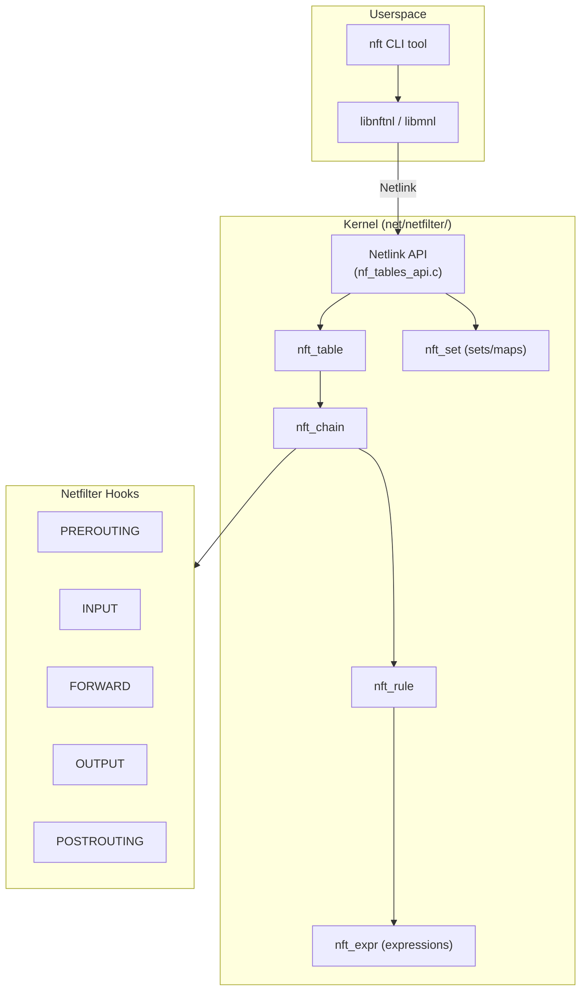
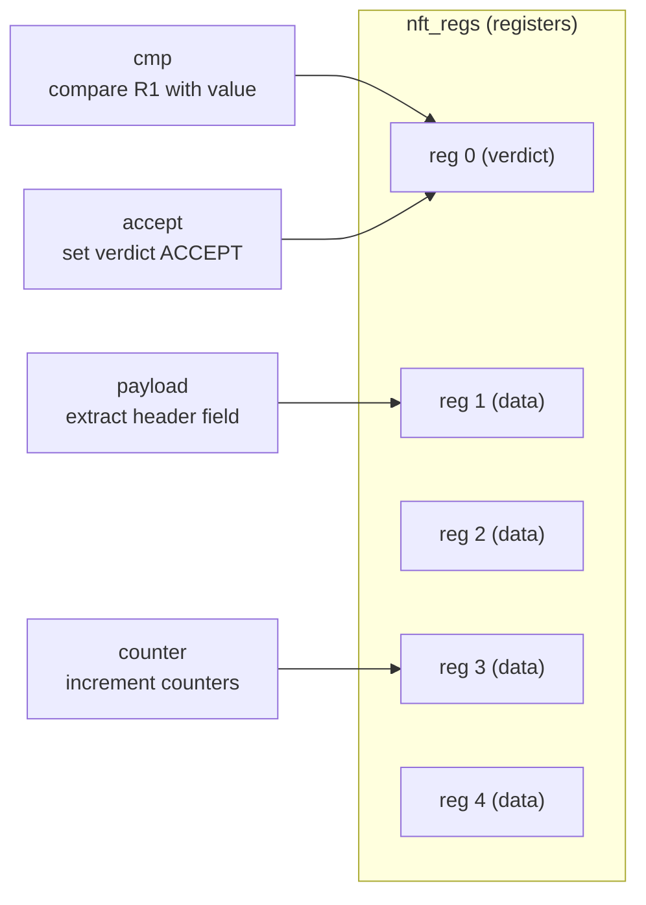
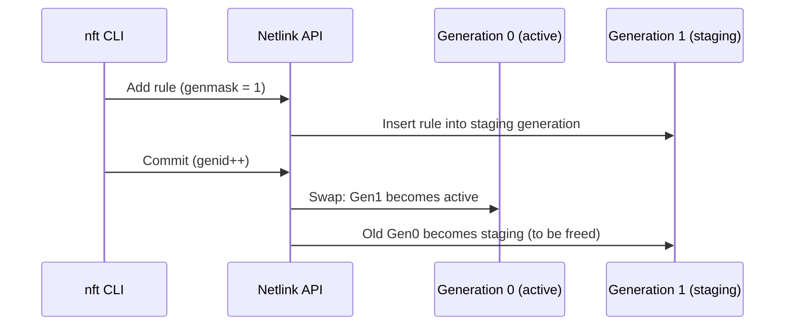
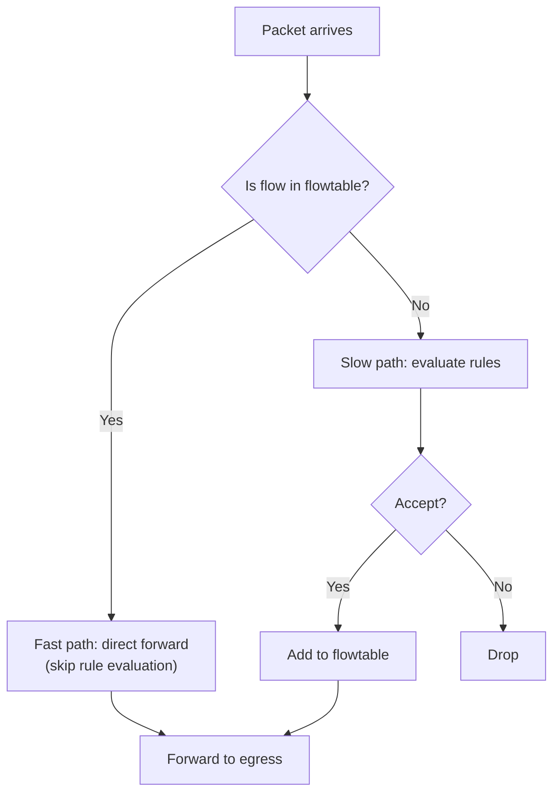
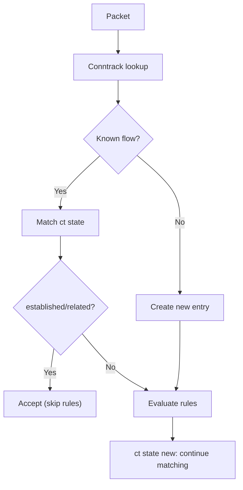
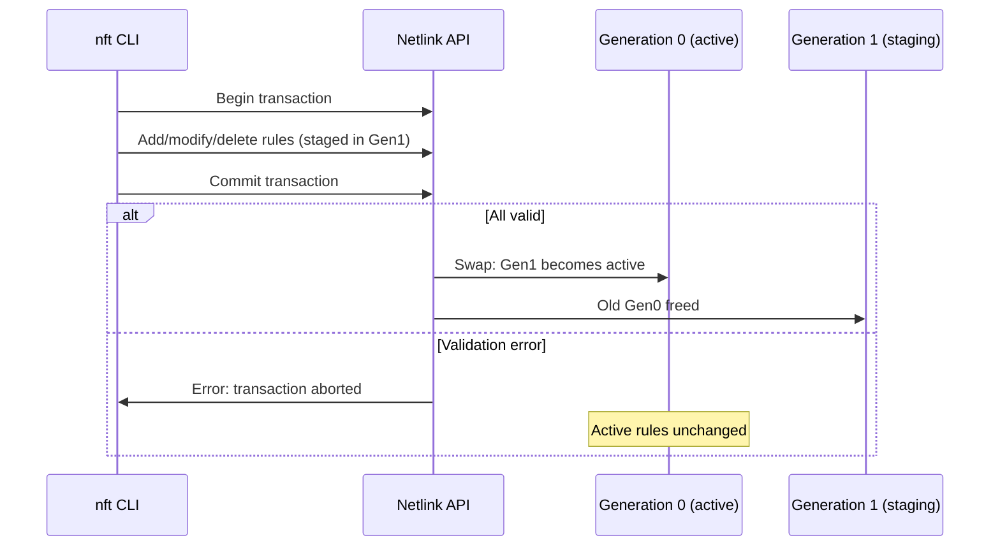

# nftables

## Overview

nftables is the successor to iptables/ip6tables/ebtables as the packet filtering and classification framework in the Linux kernel. Merged in Linux 3.13 (2014), nftables provides a unified, extensible, and more efficient packet processing engine built on top of the netfilter hooks.

Unlike iptables, which has separate code paths for IPv4, IPv6, ARP, and bridge, nftables uses a single framework with a unified bytecode-like **expression evaluation engine**. Rules are compiled into a virtual machine bytecode that runs in kernel space.

> **Introduced:** Linux 3.13 (commit `3573667`)  
> **Source:** `net/netfilter/nf_tables_api.c`  
> **Key structures:** `struct nft_table`, `struct nft_chain`, `struct nft_rule`, `struct nft_expr`

---

## Architecture



---

## Key Data Structures

### struct nft_table

A table is the top-level container, associated with a specific protocol family:

```c
/* include/net/netfilter/nf_tables.h */
struct nft_table {
    struct list_head list;          /* Global table list */
    u16 family;                     /* NFPROTO_IPV4, NFPROTO_IPV6, etc. */
    u16 flags;                      /* NFT_TABLE_F_* flags */
    u32 genid;                      /* Generation ID */
    char name[NFT_NAME_MAXLEN];     /* Table name */
    u64 handle;                     /* Unique handle */
    struct nft_rule_blob *blob_gen_0; /* Rules for generation 0 */
    struct nft_rule_blob *blob_gen_1; /* Rules for generation 1 */
    unsigned int use;               /* Reference count */
    /* ... */
};
```

### struct nft_chain

Chains contain ordered lists of rules and are attached to netfilter hooks:

```c
/* include/net/netfilter/nf_tables.h */
struct nft_chain {
    struct nft_rule_blob *blob_gen_0; /* Rules generation 0 */
    struct nft_rule_blob *blob_gen_1; /* Rules generation 1 */
    struct list_head rules;            /* Rule list */
    struct list_head list;             /* Table chain list */
    struct nft_table *table;           /* Parent table */
    u64 handle;                        /* Unique handle */
    u32 use;                           /* Reference count */
    u8 flags:5;                        /* NFT_CHAIN_* flags */
    u8 bound:1;                        /* Bound to base chain */
    u8 genmask:2;                      /* Generation mask */
    char name[NFT_NAME_MAXLEN];        /* Chain name */
    /* ... */
};
```

Chain types:
- **Base chain**: Attached to a netfilter hook (PREROUTING, INPUT, etc.)
- **Regular chain**: Jumped to from other chains (like iptables user chains)

### struct nft_rule

Rules contain expressions that are evaluated sequentially:

```c
/* include/net/netfilter/nf_tables.h */
struct nft_rule {
    struct list_head list;          /* Chain rule list */
    u64 handle;                     /* Unique handle */
    u8 genmask:2;                   /* Generation mask */
    unsigned int data_len;          /* Expression data length */
    unsigned int dlen;              /* User data length */
    u16 flags;                      /* NFT_RULE_* flags */
    /* Followed by: nft_expr[] (array of expressions) */
    char data[] __attribute__((aligned(__alignof__(struct nft_expr))));
};
```

### struct nft_expr

Each expression is a small structure with an ops table:

```c
/* include/net/netfilter/nf_tables.h */
struct nft_expr {
    const struct nft_expr_ops *ops;  /* Expression operations */
    u8 data[];                        /* Expression-specific data */
};

struct nft_expr_ops {
    const char *name;                /* Expression name */
    int (*eval)(const struct nft_expr *expr,
                struct nft_regs *regs,
                const struct nft_pktinfo *pkt);  /* Evaluate */
    int (*init)(const struct nft_ctx *ctx,
                const struct nft_expr *expr,
                const struct nlattr * const tb[]); /* Initialize */
    void (*destroy)(const struct nft_ctx *ctx,
                    const struct nft_expr *expr);  /* Cleanup */
    /* ... */
};
```

---

## Expression Evaluation Engine

nftables rules are evaluated by walking an array of expressions. Each expression reads/writes registers and sets the verdict:



### Expression Types

| Expression | Purpose | Example |
|-----------|---------|---------|
| `payload` | Extract packet header fields | `ip saddr`, `tcp dport` |
| `cmp` | Compare register with value | `== 80`, `!= 22` |
| `counter` | Count packets and bytes | `counter packets 100 bytes 50000` |
| `meta` | Packet metadata | `meta iifname "eth0"` |
| `ct` | Conntrack state | `ct state established` |
| `nat` | NAT operations | `snat to 10.0.0.1` |
| `accept` | Verdict: accept | `accept` |
| `drop` | Verdict: drop | `drop` |
| `jump` | Jump to chain | `jump filter_chain` |
| `goto` | Goto chain (no return) | `goto filter_chain` |
| `log` | Log packet | `log prefix "DROPPED: "` |
| `reject` | Reject with response | `reject with tcp reset` |
| `set` | Set membership test | `@myset` |
| `map` | Map lookup | `@mymap` |

### Evaluation Flow

```c
/* net/netfilter/nf_tables_core.c */
unsigned int nft_do_chain(struct nft_pktinfo *pkt, void *priv)
{
    struct nft_rule *rule;
    struct nft_regs regs;
    int rcode;

    /* Initialize verdict to continue */
    regs.verdict.code = NFT_CONTINUE;

    /* Walk rules in chain */
    list_for_each_entry_rcu(rule, &chain->rules, list) {
        /* Evaluate each expression in the rule */
        nft_rule_eval(rule, &regs, pkt);

        /* Check verdict */
        rcode = regs.verdict.code;
        if (rcode != NFT_CONTINUE)
            break;
    }

    /* Return verdict to netfilter */
    return nft_verdict2verdict(rcode);
}
```

---

## Sets and Maps

### nft_set

Sets are collections of elements for fast lookup (like ipset):

```c
/* include/net/netfilter/nf_tables.h */
struct nft_set {
    struct list_head list;          /* Global set list */
    char name[NFT_NAME_MAXLEN];     /* Set name */
    u32 klen;                       /* Key length */
    u32 dlen;                       /* Data length (for maps) */
    u32 flags;                      /* NFT_SET_* flags */
    const struct nft_set_ops *ops;  /* Backend operations */
    /* ... */
};
```

### Set Backends

| Backend | Use Case | Performance |
|---------|----------|-------------|
| `rbtree` | General-purpose, ranges | O(log n) |
| `hash` | Exact match | O(1) average |
| `bitmap` | Port ranges | O(1) |
| `pipapo` | Large sets with ranges | O(1) with SIMD |

### Maps

Maps are key→value sets for dynamic lookups:

```bash
# Define a map
nft add map ip nat portmap { type inet_service : ipv4_addr \; }
nft add element ip nat portmap { 80 : 10.0.0.1, 443 : 10.0.0.2 }

# Use in a rule
nft add rule ip nat prerouting dnat to tcp dport map @portmap
```

---

## Generation-Based Updates

nftables uses a **generation-based** commit model for atomic rule updates:



This ensures no packet sees a partially-updated ruleset.

---

## nftables vs iptables

| Aspect | iptables | nftables |
|--------|----------|----------|
| **Code** | ~50,000 lines (per-family) | Single unified engine |
| **Extensions** | Compiled into kernel | Expression modules |
| **Atomic updates** | No (partial rule changes) | Yes (generation commit) |
| **Sets** | Separate ipset module | Built-in sets/maps |
| **Performance** | Linear rule matching | Optimized expression eval |
| **IPv4/IPv6** | Separate tools | Single `nft` command |
| **Debugging** | Limited | Better tracing support |

### Migration from iptables

```bash
# Save current iptables rules in nftables format
iptables-save > /tmp/iptables.rules
iptables-translate -f /tmp/iptables.rules

# Or use nftables compatibility layer
nft list ruleset
```

---

## Usage Examples

### Basic Firewall

```bash
#!/usr/sbin/nft -f

# Flush existing ruleset
flush ruleset

# Create table and chains
table inet firewall {
    chain input {
        type filter hook input priority 0; policy drop;

        # Allow established connections
        ct state established,related accept

        # Allow loopback
        iif "lo" accept

        # Allow SSH
        tcp dport 22 accept

        # Allow HTTP/HTTPS
        tcp dport { 80, 443 } accept

        # Log and drop everything else
        log prefix "DROPPED: " drop
    }

    chain forward {
        type filter hook forward priority 0; policy drop;
    }

    chain output {
        type filter hook output priority 0; policy accept;
    }
}
```

### Rate Limiting

```bash
# Rate limit SSH connections
nft add rule inet firewall input tcp dport 22 ct state new \
    meter ssh-rate { ip saddr limit rate 3/minute } accept

# Burst limiting
nft add rule inet firewall input tcp dport 80 \
    meter http-burst { ip saddr limit rate 100/second burst 200 packets } accept
```

### NAT

```bash
# Masquerade outbound traffic
nft add table ip nat
nft add chain ip nat postrouting { type nat hook postrouting priority 100 \; }
nft add rule ip nat postrouting oifname "eth0" masquerade

# Port forwarding
nft add chain ip nat prerouting { type nat hook prerouting priority -100 \; }
nft add rule ip nat prerouting tcp dport 8080 dnat to 10.0.0.1:80
```

### Dynamic Sets

```bash
# Create a set for blocking IPs
nft add set ip filter blocklist { type ipv4_addr \; flags interval \; }
nft add element ip filter blocklist { 192.168.1.100, 10.0.0.0/8 }
nft add rule ip filter input ip saddr @blocklist drop

# Dynamic add from log analysis
nft add element ip filter blocklist { 203.0.113.50 }
```

---

## Monitoring and Debugging

### Listing Rules

```bash
# List entire ruleset
nft list ruleset

# List specific table
nft list table inet firewall

# List with handles (for deletion)
nft -a list ruleset

# List counters
nft list counters
```

### Tracing

```bash
# Add a tracing rule (requires nftrace)
nft add rule inet firewall input meta nftrace set 1

# View trace
nft monitor trace
# Output shows packet matching details
```

### Performance Counters

```bash
# Per-rule counters
nft list ruleset | grep counter
# counter packets 100 bytes 50000

# Reset counters
nft reset counters
```

### Kernel Messages

```bash
# nft events (rule changes)
nft monitor

# Kernel netfilter events
dmesg | grep -i nft
```

---

## Common Issues

### Rule Not Matching

**Cause**: Wrong chain type or hook priority.

**Solutions**:
- Verify chain type: `type filter hook input priority 0`
- Check hook priority: lower = earlier
- Use `nft monitor trace` to see packet flow

### Performance Issues

**Cause**: Too many rules or linear matching.

**Solutions**:
- Use sets instead of multiple rules for IP matching
- Use maps for dynamic lookups
- Place common rules first
- Use `nft list ruleset` to verify rule count

### Migration from iptables

**Cause**: iptables rules don't work after switching to nftables.

**Solutions**:
- Use `iptables-translate` to convert rules
- Use `nftables` compatibility layer (`iptables-nft`)
- Rewrite rules using nftables syntax

---

## Flowtables (Fast Path)

nftables **flowtables** provide a fast-path for established connections by bypassing the rule evaluation engine for packets belonging to tracked flows:



```bash
# Create a flowtable
nft add table inet mytable
nft add flowtable inet mytable ft '{ hook ingress priority 0; devices = { eth0, eth1 }; }'

# Use flowtable in a rule
nft add rule inet mytable forward ct state established,related flow add @ft accept

# Full NAT router example with flowtable
nft -f - <<'EOF'
table ip nat {
    chain prerouting {
        type nat hook prerouting priority -100;
        tcp dport 80 dnat to 10.0.0.1:80
    }
    chain postrouting {
        type nat hook postrouting priority 100;
        oifname "eth0" masquerade
    }
}
table inet filter {
    flowtable ft {
        hook ingress priority 0;
        devices = { eth0, eth1 };
    }
    chain forward {
        type filter hook forward priority 0; policy drop;
        ct state established,related flow add @ft accept
        ct state new accept
    }
}
EOF
```

### Flowtable Internals

```c
/* include/net/netfilter/nf_tables.h */
struct nft_flowtable {
    struct list_head            list;       /* Table flowtable list */
    char                        name[NFT_NAME_MAXLEN];
    u32                         genmask;
    u64                         handle;
    u32                         use;        /* Reference count */
    u8                          priority;   /* Hook priority */
    u16                         flags;
    struct nf_hook_ops          *hook_ops;  /* Netfilter hooks */
    struct list_head            hook_list;  /* Per-device hooks */
    struct nft_table            *table;
};

/* Flowtable uses nf_flow_table for actual flow offload */
struct nf_flowtable {
    struct list_head            list;
    struct nf_hook_ops          *hook_ops;
    const struct nf_flow_table_type *type;
    struct rhashtable           rhashtable; /* Flow hash table */
};
```

### Hardware Offload
nftables flowtables can offload flow processing to NIC hardware:

```bash
# Enable hardware offload (requires NIC support)
nft add flowtable inet mytable ft '{ hook ingress priority 0; devices = { eth0, eth1 }; flags offload; }'

# Check offload status
ethtool -k eth0 | grep -i offload
```

## Verdict Maps

Verdict maps combine set lookups with verdicts, enabling dynamic packet classification:

```bash
# Define a verdict map
nft add map ip filter policies { type ipv4_addr : verdict \; }
nft add element ip filter policies { 192.168.1.100 : accept, 192.168.1.200 : drop }

# Use in rule
nft add rule ip filter input ip saddr vmap @policies

# Equivalent to:
# if src == 192.168.1.100 then accept
# if src == 192.168.1.200 then drop

# Dynamic verdict maps (with intervals)
nft add map ip filter policies { type ipv4_addr : verdict \; flags interval \; }
nft add element ip filter policies { 10.0.0.0/8 : accept, 172.16.0.0/12 : drop }
```

## Concatenation
nftables supports **concatenated keys** in sets, enabling efficient multi-field lookups:

```bash
# Create a set with concatenated keys
nft add set inet filter portip { type inet_service . ipv4_addr \; }
nft add element inet filter portip { 80 . 10.0.0.1, 443 . 10.0.0.2 }

# Use concatenated lookup in rule
nft add rule inet filter input tcp dport . ip daddr @portip accept

# This matches: tcp dport == 80 AND ip daddr == 10.0.0.1
# Much faster than sequential rule matching
```

### Concatenation with Maps

```bash
# Map from concatenated key to verdict
nft add map inet filter acl { type inet_service . ipv4_addr : verdict \; }
nft add element inet filter acl { 80 . 10.0.0.1 : accept, 22 . 10.0.0.1 : accept }
nft add rule inet filter input tcp dport . ip daddr vmap @acl
```

## Metering (Rate Limiting)

nftables meters provide flexible rate limiting:

```bash
# Simple rate limit
nft add rule inet filter input meter ssh-rate { ip saddr limit rate 3/minute } accept

# Rate limit with burst
nft add rule inet filter input meter http-burst { ip saddr limit rate 100/second burst 200 packets } accept

# Rate limit per destination
nft add rule inet filter input meter dst-rate { ip daddr limit rate 1000/second } accept

# Rate limit with timeout (auto-expire entries)
nft add set inet filter scan { type ipv4_addr \; flags dynamic,timeout \; timeout 1h \; }
nft add rule inet filter input meter scan { ip saddr limit rate over 10/minute add @scan \; } drop

# Log rate limiting
nft add rule inet filter input tcp dport 22 ct state new \
    limit rate 5/minute burst 10 packets \
    log prefix "SSH-ATTEMPT: " accept
```

## Connection Tracking Helpers

nftables integrates with connection tracking for stateful filtering:

```bash
# Basic conntrack state matching
nft add rule inet filter input ct state established,related accept
nft add rule inet filter input ct state invalid drop

# Conntrack zone (isolate overlapping addresses)
nft add rule inet filter input ct zone 1

# Conntrack mark (set and match)
nft add rule inet filter forward ct mark set 0x1
nft add rule inet filter forward ct mark 0x1 accept

# Conntrack helpers (ALG for FTP, SIP, etc.)
nft add rule inet filter input ct helper set "ftp"

# Conntrack labels (per-packet metadata)
nft add rule inet filter input ct label set "trusted"
nft add rule inet filter forward ct label "trusted" accept

# Conntrack timeout configuration
nft add ct timeout inet filter tcp-established '{ protocol tcp \; service 80 \; timeout 1h \; }'
```

### Conntrack Integration Architecture



## Bridge Filtering

nftables can filter bridged (Layer 2) traffic:

```bash
# Bridge table
nft add table bridge filter
nft add chain bridge filter input { type filter hook input priority 0; policy accept; }
nft add chain bridge filter forward { type filter hook forward priority 0; policy accept; }

# Filter by MAC address
nft add rule bridge filter input ether saddr 00:11:22:33:44:55 drop
nft add rule bridge filter input ether type ip ip saddr 10.0.0.1 accept

# VLAN filtering
nft add rule bridge filter input ether type vlan vlan id 100 accept
```

## ARP Filtering

nftables supports ARP/NDP packet filtering:

```bash
# ARP table
nft add table arp filter
nft add chain arp filter input { type filter hook input priority 0; policy accept; }

# Filter ARP requests
nft add rule arp filter input arp operation request arp saddr ip 192.168.1.0/24 accept
nft add rule arp filter input arp operation request arp saddr ip != 192.168.1.0/24 drop

# NDP (IPv6 neighbor discovery) uses inet table
nft add rule inet filter input icmpv6 type { nd-neighbor-solicit, nd-neighbor-advert } accept
```

## Packet Tracing

nftables provides detailed packet tracing for debugging:

```bash
# Add trace rule
nft add rule inet filter input meta nftrace set 1 tcp dport 22

# Monitor trace output
nft monitor trace
# Output example:
# trace id 8c8f6f2b inet filter input packet: ... tcp dport 22
# trace id 8c8f6f2b inet filter input rule meta nftrace set 1 (verdict accept)

# Trace with specific family
nft monitor trace ip

# Trace to file
nft monitor trace > /tmp/nft-trace.log 2>&1 &
```

### Trace Output Fields

| Field | Description |
|-------|-------------|
| `trace id` | Unique packet identifier (links matching chain) |
| `table` | Table name |
| `chain` | Chain name |
| `packet` | Packet headers (raw) |
| `rule` | Matching rule (with handle) |
| `verdict` | Final verdict (accept/drop/jump/goto) |

## Rule Handle Management

nftables uses **handles** for precise rule management:

```bash
# List rules with handles
nft -a list ruleset
# output: ... tcp dport 22 accept # handle 42

# Delete specific rule by handle
nft delete rule inet filter input handle 42

# Insert rule before/after a handle
nft insert rule inet filter input handle 42 tcp dport 80 accept
nft add rule inet filter input handle 42 tcp dport 443 accept

# Replace a rule (same handle, new content)
nft replace rule inet filter input handle 42 tcp dport 22 ct state new limit rate 5/minute accept
```

## Transaction Atomicity

nftables applies all changes in a single atomic transaction:

```bash
# This entire ruleset update is atomic
nft -f - <<'EOF'
flush ruleset
table inet firewall {
    chain input {
        type filter hook input priority 0; policy drop;
        ct state established,related accept
        tcp dport 22 accept
    }
}
EOF

# No packet ever sees a partially-updated ruleset
# Even if the script fails partway, no changes apply
```



## Netlink Interface

The kernel nftables API uses Netlink for all communication:

```c
/* Netlink message types for nftables */
#define NFT_MSG_NEWTABLE    0
#define NFT_MSG_GETTABLE    1
#define NFT_MSG_DELTABLE    2
#define NFT_MSG_NEWCHAIN    3
#define NFT_MSG_GETCHAIN    4
#define NFT_MSG_DELCHAIN    5
#define NFT_MSG_NEWRULE     6
#define NFT_MSG_GETRULE     7
#define NFT_MSG_DELRULE     8
#define NFT_MSG_NEWSET      9
#define NFT_MSG_GETSET      10
#define NFT_MSG_DELSET      11
#define NFT_MSG_NEWSETELEM  12
#define NFT_MSG_GETSETELEM  13
#define NFT_MSG_DELSETELEM  14
#define NFT_MSG_NEWGEN      15
#define NFT_MSG_GETGEN      16
#define NFT_MSG_TRACE       17
#define NFT_MSG_NEWOBJ      18
#define NFT_MSG_GETOBJ      19
#define NFT_MSG_DELOBJ      20
#define NFT_MSG_NEWFLOWTABLE 21
#define NFT_MSG_GETFLOWTABLE 22
#define NFT_MSG_DELFLOWTABLE 23
```

### libnftnl

Userspace library for direct Netlink communication:

```c
#include <libnftnl/table.h>
#include <libnftnl/chain.h>
#include <libnftnl/rule.h>

/* Create table via libnftnl */
struct nft_table *table = nft_table_alloc();
nft_table_set_str(table, NFT_TABLE_SET_NAME, "mytable");
nft_table_set_u32(table, NFT_TABLE_SET_FAMILY, NFPROTO_IPV4);
/* ... build and send via mnl_socket ... */
```

## Performance Considerations

### Rule Evaluation Cost

| Expression Type | Relative Cost | Notes |
|----------------|---------------|-------|
| meta (iifname) | Very fast | Kernel metadata lookup |
| payload (ip/tcp) | Fast | Packet header parse |
| cmp | Very fast | Register comparison |
| set lookup | O(1) hash / O(log n) rbtree | Depends on backend |
| ct state | Fast | Conntrack table lookup |
| log | Medium | Kernel/userspace I/O |
| nat | Medium | Conntrack + packet mod |
| limit | Medium | Token bucket algorithm |

### Optimization Tips

```bash
# 1. Use sets instead of multiple rules for IP matching
# Bad:
nft add rule ip filter input ip saddr 10.0.0.1 accept
nft add rule ip filter input ip saddr 10.0.0.2 accept
# Good:
nft add set ip filter whitelist { type ipv4_addr \; }
nft add element ip filter whitelist { 10.0.0.1, 10.0.0.2 }
nft add rule ip filter input ip saddr @whitelist accept

# 2. Use concatenated sets for multi-field matching
# Instead of sequential rules matching port+IP

# 3. Use flowtables for high-throughput forwarding
# Bypasses rule evaluation for established flows

# 4. Place common rules first (evaluation is sequential)
# Rules matched by 90% of traffic should be first

# 5. Use metering instead of per-rule counters
# Meters are more memory-efficient at scale
```

### Benchmarks

| Scenario | iptables | nftables | Improvement |
|----------|----------|----------|-------------|
| 10 rules, linear | 1x | 1.2x | Slight overhead |
| 1000 rules, linear | 1x | 3-5x | Faster (expression eval) |
| 1000 rules, set-based | N/A | 10-100x | O(1) set lookup |
| Atomic update | Blocking | Non-blocking | Zero downtime |
| Memory per rule | ~200 bytes | ~50-100 bytes | 2-4x less |

## Kernel Configuration

```bash
# nftables configuration options
CONFIG_NF_TABLES=m            # Core nftables
CONFIG_NF_TABLES_INET=y       # inet family support
CONFIG_NF_TABLES_IPV4=y       # IPv4 family
CONFIG_NF_TABLES_IPV6=y       # IPv6 family
CONFIG_NF_TABLES_BRIDGE=y     # Bridge filtering
CONFIG_NF_TABLES_ARP=y        # ARP filtering
CONFIG_NFT_PAYLOAD=m          # Payload expression
CONFIG_NFT_CMP=m              # Comparison expression
CONFIG_NFT_COUNTER=m          # Counter expression
CONFIG_NFT_LOG=m              # Log expression
CONFIG_NFT_LIMIT=m            # Rate limiting
CONFIG_NFT_NAT=m              # NAT expression
CONFIG_NFT_MASQ=m             # Masquerade
CONFIG_NFT_REDIR=m            # Redirect
CONFIG_NFT_META=m             # Metadata expression
CONFIG_NFT_CT=m               # Conntrack expression
CONFIG_NFT_SET_RBTREE=m       # rbtree set backend
CONFIG_NFT_SET_HASH=m         # hash set backend
CONFIG_NFT_FIB=m              # FIB (routing) lookup
CONFIG_NFT_FLOWTABLE=m        # Flowtable fast path
CONFIG_NFT_OBJREF=m           # Object reference
CONFIG_NFT_SOCKET=m           # Socket expression
CONFIG_NFT_TPROXY=m           # Transparent proxy
CONFIG_NFT_COMPAT=m           # iptables compatibility
```

---

## Source Files

| File | Contents |
|------|----------|
| `net/netfilter/nf_tables_api.c` | Netlink API for nftables |
| `net/netfilter/nf_tables_core.c` | Expression evaluation engine |
| `net/netfilter/nf_tables_set.c` | Set/map implementation |
| `net/netfilter/nft_payload.c` | Payload expression |
| `net/netfilter/nft_cmp.c` | Comparison expression |
| `net/netfilter/nft_nat.c` | NAT expression |
| `include/net/netfilter/nf_tables.h` | Core data structures |

---

## Further Reading

- **nftables wiki**: [Developer Internals](https://wiki.nftables.org/wiki-nftables/index.php/Portal:DeveloperDocs/nftables_internals)
- **kernel-internals.org**: [Netfilter Architecture](https://kernel-internals.org/net/netfilter/)
- **LWN**: ["The nftables kernel packet filtering framework"](https://lwn.net/Articles/527053/)
- **Kernel documentation**: `Documentation/networking/nfilter/nftables.rst`
- **man page**: `nft(8)`

---

## See Also

- [Netfilter](./netfilter.md) — netfilter hook architecture
- [Connection Tracking](./conntrack.md) — conntrack integration
- [XDP](./xdp.md) — high-performance packet processing
- [Network Namespaces](./namespaces.md) — per-namespace nftables
