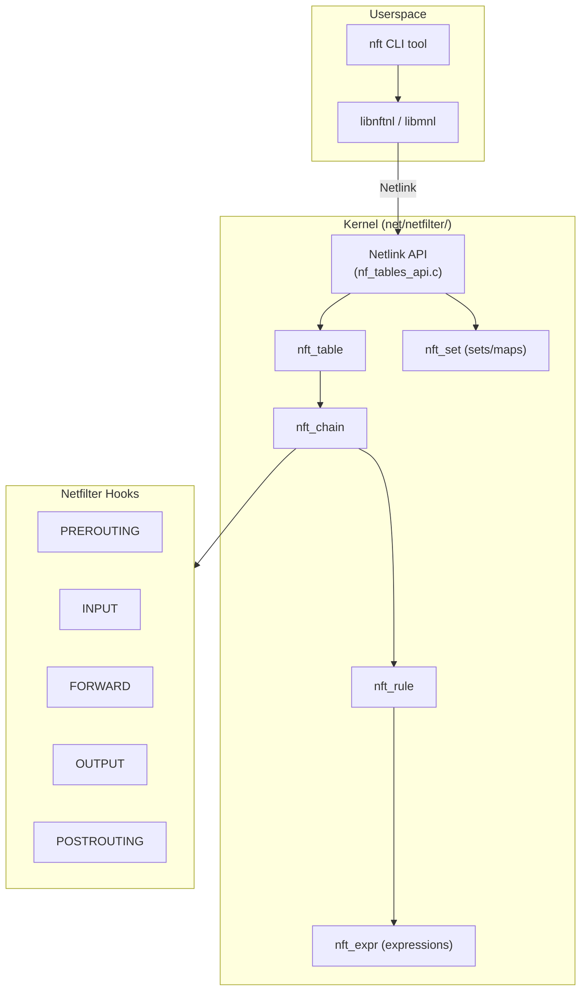
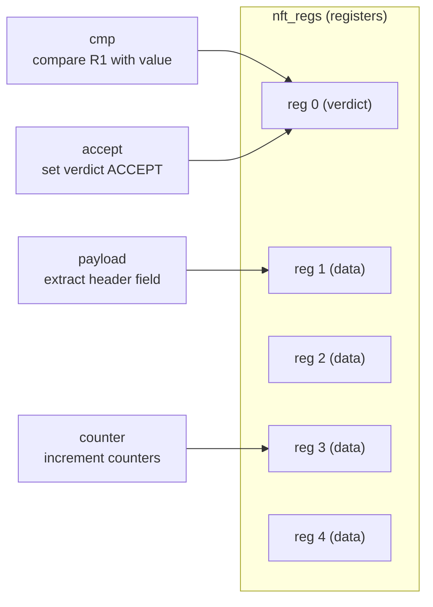
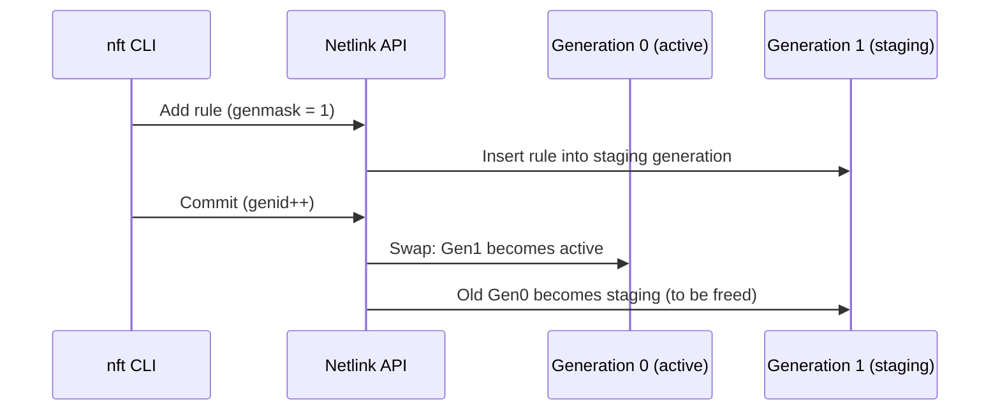

# nftables

## Overview

nftables is the successor to iptables/ip6tables/ebtables as the packet filtering and classification framework in the Linux kernel. Merged in Linux 3.13 (2014), nftables provides a unified, extensible, and more efficient packet processing engine built on top of the netfilter hooks.

Unlike iptables, which has separate code paths for IPv4, IPv6, ARP, and bridge, nftables uses a single framework with a unified bytecode-like **expression evaluation engine**. Rules are compiled into a virtual machine bytecode that runs in kernel space.

> **Introduced:** Linux 3.13 (commit `3573667`)  
> **Source:** `net/netfilter/nf_tables_api.c`  
> **Key structures:** `struct nft_table`, `struct nft_chain`, `struct nft_rule`, `struct nft_expr`

---

## Architecture



---

## Key Data Structures

### struct nft_table

A table is the top-level container, associated with a specific protocol family:

```c
/* include/net/netfilter/nf_tables.h */
struct nft_table {
    struct list_head list;          /* Global table list */
    u16 family;                     /* NFPROTO_IPV4, NFPROTO_IPV6, etc. */
    u16 flags;                      /* NFT_TABLE_F_* flags */
    u32 genid;                      /* Generation ID */
    char name[NFT_NAME_MAXLEN];     /* Table name */
    u64 handle;                     /* Unique handle */
    struct nft_rule_blob *blob_gen_0; /* Rules for generation 0 */
    struct nft_rule_blob *blob_gen_1; /* Rules for generation 1 */
    unsigned int use;               /* Reference count */
    /* ... */
};
```

### struct nft_chain

Chains contain ordered lists of rules and are attached to netfilter hooks:

```c
/* include/net/netfilter/nf_tables.h */
struct nft_chain {
    struct nft_rule_blob *blob_gen_0; /* Rules generation 0 */
    struct nft_rule_blob *blob_gen_1; /* Rules generation 1 */
    struct list_head rules;            /* Rule list */
    struct list_head list;             /* Table chain list */
    struct nft_table *table;           /* Parent table */
    u64 handle;                        /* Unique handle */
    u32 use;                           /* Reference count */
    u8 flags:5;                        /* NFT_CHAIN_* flags */
    u8 bound:1;                        /* Bound to base chain */
    u8 genmask:2;                      /* Generation mask */
    char name[NFT_NAME_MAXLEN];        /* Chain name */
    /* ... */
};
```

Chain types:
- **Base chain**: Attached to a netfilter hook (PREROUTING, INPUT, etc.)
- **Regular chain**: Jumped to from other chains (like iptables user chains)

### struct nft_rule

Rules contain expressions that are evaluated sequentially:

```c
/* include/net/netfilter/nf_tables.h */
struct nft_rule {
    struct list_head list;          /* Chain rule list */
    u64 handle;                     /* Unique handle */
    u8 genmask:2;                   /* Generation mask */
    unsigned int data_len;          /* Expression data length */
    unsigned int dlen;              /* User data length */
    u16 flags;                      /* NFT_RULE_* flags */
    /* Followed by: nft_expr[] (array of expressions) */
    char data[] __attribute__((aligned(__alignof__(struct nft_expr))));
};
```

### struct nft_expr

Each expression is a small structure with an ops table:

```c
/* include/net/netfilter/nf_tables.h */
struct nft_expr {
    const struct nft_expr_ops *ops;  /* Expression operations */
    u8 data[];                        /* Expression-specific data */
};

struct nft_expr_ops {
    const char *name;                /* Expression name */
    int (*eval)(const struct nft_expr *expr,
                struct nft_regs *regs,
                const struct nft_pktinfo *pkt);  /* Evaluate */
    int (*init)(const struct nft_ctx *ctx,
                const struct nft_expr *expr,
                const struct nlattr * const tb[]); /* Initialize */
    void (*destroy)(const struct nft_ctx *ctx,
                    const struct nft_expr *expr);  /* Cleanup */
    /* ... */
};
```

---

## Expression Evaluation Engine

nftables rules are evaluated by walking an array of expressions. Each expression reads/writes registers and sets the verdict:



### Expression Types

| Expression | Purpose | Example |
|-----------|---------|---------|
| `payload` | Extract packet header fields | `ip saddr`, `tcp dport` |
| `cmp` | Compare register with value | `== 80`, `!= 22` |
| `counter` | Count packets and bytes | `counter packets 100 bytes 50000` |
| `meta` | Packet metadata | `meta iifname "eth0"` |
| `ct` | Conntrack state | `ct state established` |
| `nat` | NAT operations | `snat to 10.0.0.1` |
| `accept` | Verdict: accept | `accept` |
| `drop` | Verdict: drop | `drop` |
| `jump` | Jump to chain | `jump filter_chain` |
| `goto` | Goto chain (no return) | `goto filter_chain` |
| `log` | Log packet | `log prefix "DROPPED: "` |
| `reject` | Reject with response | `reject with tcp reset` |
| `set` | Set membership test | `@myset` |
| `map` | Map lookup | `@mymap` |

### Evaluation Flow

```c
/* net/netfilter/nf_tables_core.c */
unsigned int nft_do_chain(struct nft_pktinfo *pkt, void *priv)
{
    struct nft_rule *rule;
    struct nft_regs regs;
    int rcode;

    /* Initialize verdict to continue */
    regs.verdict.code = NFT_CONTINUE;

    /* Walk rules in chain */
    list_for_each_entry_rcu(rule, &chain->rules, list) {
        /* Evaluate each expression in the rule */
        nft_rule_eval(rule, &regs, pkt);

        /* Check verdict */
        rcode = regs.verdict.code;
        if (rcode != NFT_CONTINUE)
            break;
    }

    /* Return verdict to netfilter */
    return nft_verdict2verdict(rcode);
}
```

---

## Sets and Maps

### nft_set

Sets are collections of elements for fast lookup (like ipset):

```c
/* include/net/netfilter/nf_tables.h */
struct nft_set {
    struct list_head list;          /* Global set list */
    char name[NFT_NAME_MAXLEN];     /* Set name */
    u32 klen;                       /* Key length */
    u32 dlen;                       /* Data length (for maps) */
    u32 flags;                      /* NFT_SET_* flags */
    const struct nft_set_ops *ops;  /* Backend operations */
    /* ... */
};
```

### Set Backends

| Backend | Use Case | Performance |
|---------|----------|-------------|
| `rbtree` | General-purpose, ranges | O(log n) |
| `hash` | Exact match | O(1) average |
| `bitmap` | Port ranges | O(1) |
| `pipapo` | Large sets with ranges | O(1) with SIMD |

### Maps

Maps are key→value sets for dynamic lookups:

```bash
# Define a map
nft add map ip nat portmap { type inet_service : ipv4_addr \; }
nft add element ip nat portmap { 80 : 10.0.0.1, 443 : 10.0.0.2 }

# Use in a rule
nft add rule ip nat prerouting dnat to tcp dport map @portmap
```

---

## Generation-Based Updates

nftables uses a **generation-based** commit model for atomic rule updates:



This ensures no packet sees a partially-updated ruleset.

---

## nftables vs iptables

| Aspect | iptables | nftables |
|--------|----------|----------|
| **Code** | ~50,000 lines (per-family) | Single unified engine |
| **Extensions** | Compiled into kernel | Expression modules |
| **Atomic updates** | No (partial rule changes) | Yes (generation commit) |
| **Sets** | Separate ipset module | Built-in sets/maps |
| **Performance** | Linear rule matching | Optimized expression eval |
| **IPv4/IPv6** | Separate tools | Single `nft` command |
| **Debugging** | Limited | Better tracing support |

### Migration from iptables

```bash
# Save current iptables rules in nftables format
iptables-save > /tmp/iptables.rules
iptables-translate -f /tmp/iptables.rules

# Or use nftables compatibility layer
nft list ruleset
```

---

## Usage Examples

### Basic Firewall

```bash
#!/usr/sbin/nft -f

# Flush existing ruleset
flush ruleset

# Create table and chains
table inet firewall {
    chain input {
        type filter hook input priority 0; policy drop;

        # Allow established connections
        ct state established,related accept

        # Allow loopback
        iif "lo" accept

        # Allow SSH
        tcp dport 22 accept

        # Allow HTTP/HTTPS
        tcp dport { 80, 443 } accept

        # Log and drop everything else
        log prefix "DROPPED: " drop
    }

    chain forward {
        type filter hook forward priority 0; policy drop;
    }

    chain output {
        type filter hook output priority 0; policy accept;
    }
}
```

### Rate Limiting

```bash
# Rate limit SSH connections
nft add rule inet firewall input tcp dport 22 ct state new \
    meter ssh-rate { ip saddr limit rate 3/minute } accept

# Burst limiting
nft add rule inet firewall input tcp dport 80 \
    meter http-burst { ip saddr limit rate 100/second burst 200 packets } accept
```

### NAT

```bash
# Masquerade outbound traffic
nft add table ip nat
nft add chain ip nat postrouting { type nat hook postrouting priority 100 \; }
nft add rule ip nat postrouting oifname "eth0" masquerade

# Port forwarding
nft add chain ip nat prerouting { type nat hook prerouting priority -100 \; }
nft add rule ip nat prerouting tcp dport 8080 dnat to 10.0.0.1:80
```

### Dynamic Sets

```bash
# Create a set for blocking IPs
nft add set ip filter blocklist { type ipv4_addr \; flags interval \; }
nft add element ip filter blocklist { 192.168.1.100, 10.0.0.0/8 }
nft add rule ip filter input ip saddr @blocklist drop

# Dynamic add from log analysis
nft add element ip filter blocklist { 203.0.113.50 }
```

---

## Monitoring and Debugging

### Listing Rules

```bash
# List entire ruleset
nft list ruleset

# List specific table
nft list table inet firewall

# List with handles (for deletion)
nft -a list ruleset

# List counters
nft list counters
```

### Tracing

```bash
# Add a tracing rule (requires nftrace)
nft add rule inet firewall input meta nftrace set 1

# View trace
nft monitor trace
# Output shows packet matching details
```

### Performance Counters

```bash
# Per-rule counters
nft list ruleset | grep counter
# counter packets 100 bytes 50000

# Reset counters
nft reset counters
```

### Kernel Messages

```bash
# nft events (rule changes)
nft monitor

# Kernel netfilter events
dmesg | grep -i nft
```

---

## Common Issues

### Rule Not Matching

**Cause**: Wrong chain type or hook priority.

**Solutions**:
- Verify chain type: `type filter hook input priority 0`
- Check hook priority: lower = earlier
- Use `nft monitor trace` to see packet flow

### Performance Issues

**Cause**: Too many rules or linear matching.

**Solutions**:
- Use sets instead of multiple rules for IP matching
- Use maps for dynamic lookups
- Place common rules first
- Use `nft list ruleset` to verify rule count

### Migration from iptables

**Cause**: iptables rules don't work after switching to nftables.

**Solutions**:
- Use `iptables-translate` to convert rules
- Use `nftables` compatibility layer (`iptables-nft`)
- Rewrite rules using nftables syntax

---

## Source Files

| File | Contents |
|------|----------|
| `net/netfilter/nf_tables_api.c` | Netlink API for nftables |
| `net/netfilter/nf_tables_core.c` | Expression evaluation engine |
| `net/netfilter/nf_tables_set.c` | Set/map implementation |
| `net/netfilter/nft_payload.c` | Payload expression |
| `net/netfilter/nft_cmp.c` | Comparison expression |
| `net/netfilter/nft_nat.c` | NAT expression |
| `include/net/netfilter/nf_tables.h` | Core data structures |

---

## Further Reading

- **nftables wiki**: [Developer Internals](https://wiki.nftables.org/wiki-nftables/index.php/Portal:DeveloperDocs/nftables_internals)
- **kernel-internals.org**: [Netfilter Architecture](https://kernel-internals.org/net/netfilter/)
- **LWN**: ["The nftables kernel packet filtering framework"](https://lwn.net/Articles/527053/)
- **Kernel documentation**: `Documentation/networking/nfilter/nftables.rst`
- **man page**: `nft(8)`

---

## See Also

- [Netfilter](./netfilter.md) — netfilter hook architecture
- [Connection Tracking](./conntrack.md) — conntrack integration
- [XDP](./xdp.md) — high-performance packet processing
- [Network Namespaces](./namespaces.md) — per-namespace nftables
