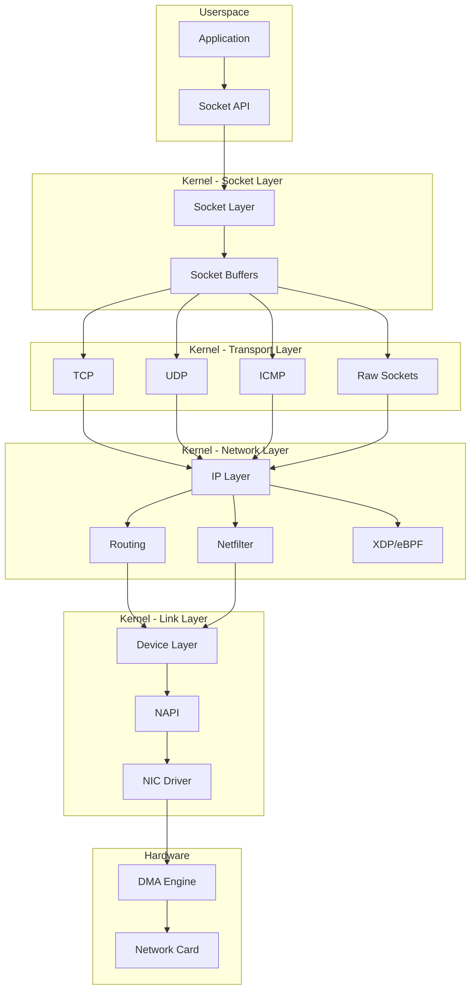
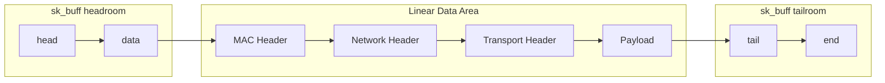
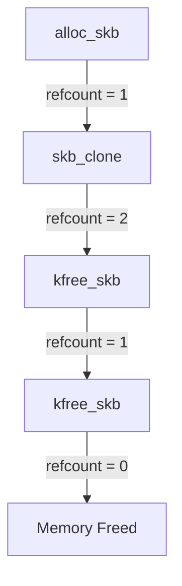
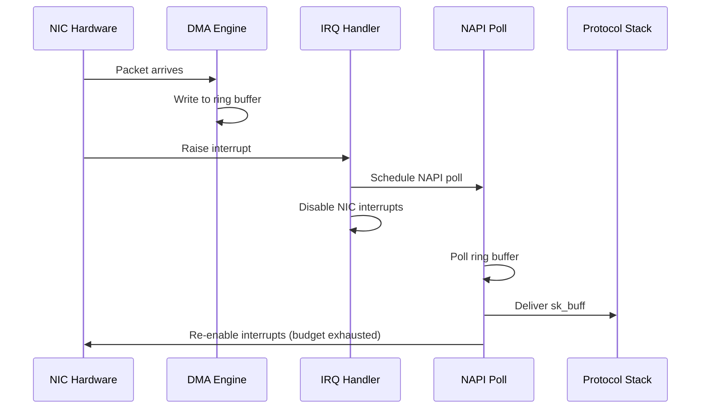
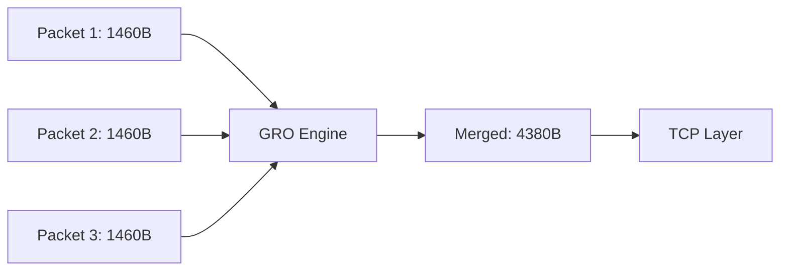
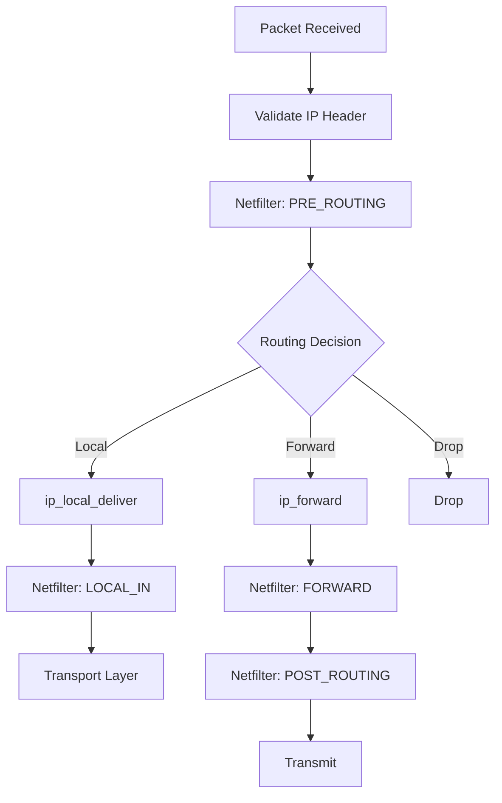
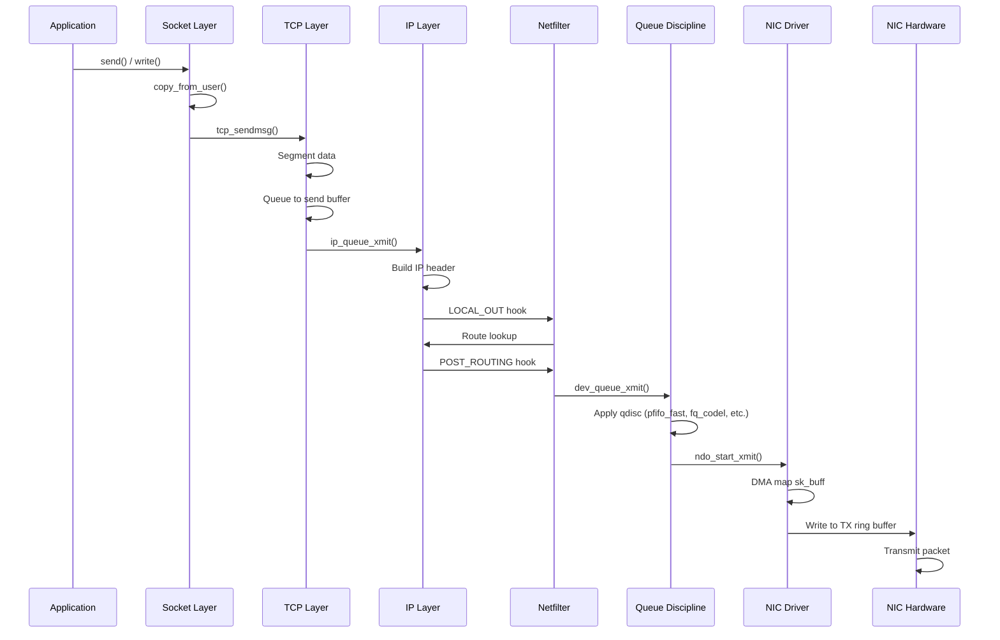

# Kernel Networking Stack Overview

## Introduction

The Linux kernel networking stack is one of the most sophisticated and high-performance networking implementations in any operating system. It handles everything from raw packet reception on network interface cards (NICs) to delivering data to userspace applications through sockets. Understanding this stack is essential for network engineers, kernel developers, and anyone working on high-performance networking systems.

This chapter provides a comprehensive overview of how packets flow through the Linux kernel, the core data structures involved (particularly `sk_buff`), and the architectural decisions that make Linux networking both flexible and fast.

## Architecture Overview

The Linux networking stack follows a layered architecture that mirrors the OSI model but with practical optimizations. The stack is broadly divided into:

1. **Network Interface Layer** — NIC drivers and DMA
2. **Core Networking Layer** — Packet routing, filtering, forwarding
3. **Transport Layer** — TCP, UDP, and other protocol processing
4. **Socket Layer** — The interface between kernel and userspace



## The sk_buff Structure

The `sk_buff` (socket buffer) is the most critical data structure in the Linux networking stack. Every packet — whether received from the network or about to be transmitted — is represented as an `sk_buff`. It acts as a universal container that moves through all layers of the stack.

### Structure Definition

The `sk_buff` is defined in `include/linux/skbuff.h`. Here are the key fields:

```c
struct sk_buff {
    /* These two members must be first */
    struct sk_buff      *next;
    struct sk_buff      *prev;

    union {
        struct net_device   *dev;
        /* Some protocols might use this space when they move
         * the sk_buff to another device */
    };

    struct sock         *sk;           /* Owning socket */
    ktime_t             tstamp;        /* Timestamp */

    /*
     * This is the control buffer. It is free to use for every
     * layer. Please put your private variables there.
     */
    char                cb[48] __aligned(8);

    unsigned long       _skb_refdst;
    void                (*destructor)(struct sk_buff *skb);

    unsigned int        len,           /* Length of actual data */
                        data_len;      /* Data length (non-linear) */
    __u16               mac_len,       /* MAC header length */
                        hdr_len;       /* Cloned skb head length */

    /* Transport layer header */
    union {
        struct tcphdr   *th;
        struct udphdr   *uh;
        struct icmphdr  *icmph;
        struct iphdr    *ipiph;
        unsigned char   *raw;
    } h;

    /* Network layer header */
    union {
        struct iphdr    *iph;
        struct ipv6hdr  *ipv6h;
        struct arphdr   *arph;
        unsigned char   *raw;
    } nh;

    /* Link layer header */
    union {
        struct ethhdr   *ethernet;
        unsigned char   *raw;
    } mac;

    /* Pointers to data area */
    unsigned char       *head,         /* Head of buffer */
                        *data,         /* Data head pointer */
                        *tail,         /* Tail pointer */
                        *end;          /* End pointer */

    __u32               mark;          /* Packet mark (for netfilter) */
    __u16               queue_mapping; /* Queue mapping for multiqueue */
    __u8                ip_summed;     /* Driver fed us an IP checksum */
    __u8                cloned:1,      /* Head may be cloned */
                        nohdr:1;       /* Payload references */

    /* Protocol-specific information */
    __u16               protocol;      /* Packet protocol ID */
    __u32               hash;          /* Packet hash */
};
```

### Memory Layout

Understanding the `sk_buff` memory layout is crucial for performance tuning:



The `head`, `data`, `tail`, and `end` pointers define four regions:

- **Headroom** (`head` to `data`): Space for prepending headers during encapsulation
- **Data** (`data` to `tail`): The actual packet data
- **Tailroom** (`tail` to `end`): Space for appending data
- **Shared info** (after `end`): `skb_shared_info` for fragment lists

### sk_buff Operations

Key operations on socket buffers:

```c
/* Allocate a new sk_buff */
struct sk_buff *alloc_skb(unsigned int size, gfp_t priority);

/* Free an sk_buff */
void kfree_skb(struct sk_buff *skb);

/* Reserve headroom (push pointer forward) */
skb_reserve(struct sk_buff *skb, int len);

/* Add data to the head of the packet */
unsigned char *skb_push(struct sk_buff *skb, unsigned int len);

/* Remove data from the head */
unsigned char *skb_pull(struct sk_buff *skb, unsigned int len);

/* Add data to the tail */
unsigned char *skb_put(struct sk_buff *skb, unsigned int len);

/* Trim the buffer to the specified length */
int skb_trim(struct sk_buff *skb, unsigned int len);

/* Clone an sk_buff (shares data) */
struct sk_buff *skb_clone(struct sk_buff *skb, gfp_t gfp_mask);

/* Deep copy an sk_buff */
struct sk_buff *skb_copy(const struct sk_buff *skb, gfp_t gfp_mask);

/* Linearize scattered data */
int skb_linearize(struct sk_buff *skb);
```

### Reference Counting

`sk_buff` uses reference counting to manage memory efficiently:



When `skb_clone()` is called, the data buffer is shared but the `sk_buff` metadata is duplicated. The reference count (`skb->users`) tracks how many references exist. Only when the count reaches zero is the memory actually freed.

## Packet Reception Path (NIC to Userspace)

The journey of an incoming packet from NIC to application involves several stages, each optimized for performance.

### Stage 1: NIC to Kernel

When a packet arrives at the NIC:

1. **DMA Transfer**: The NIC's DMA engine writes the packet data directly into pre-allocated ring buffers in kernel memory (DMA-coherent memory). This bypasses the CPU entirely for the data transfer.

2. **Interrupt Generation**: After writing the packet, the NIC raises a hardware interrupt (IRQ) to notify the CPU.

3. **Interrupt Handler**: The kernel's interrupt handler (registered by the NIC driver) executes. In modern systems, this typically does minimal work — it just acknowledges the interrupt and schedules NAPI (New API) polling.



### Stage 2: NAPI Processing

NAPI (New API) is the modern interrupt mitigation framework. Instead of processing one packet per interrupt (which causes high interrupt overhead under load), NAPI uses a hybrid approach:

- **Under low load**: Interrupts are used normally for low latency
- **Under high load**: The driver switches to polling mode, processing packets in batches

```c
/* NAPI poll function - called by the kernel */
static int my_driver_poll(struct napi_struct *napi, int budget)
{
    struct my_priv *priv = container_of(napi, struct my_priv, napi);
    int work_done = 0;

    while (work_done < budget) {
        struct sk_buff *skb = my_driver_rx(priv);
        if (!skb)
            break;

        /* Pass packet up the stack */
        napi_gro_receive(napi, skb);
        work_done++;
    }

    if (work_done < budget) {
        napi_complete_done(napi, work_done);
        my_driver_enable_interrupts(priv);
    }

    return work_done;
}
```

### Stage 3: GRO (Generic Receive Offload)

Before packets enter the protocol stack, GRO attempts to merge multiple small packets into larger ones, reducing per-packet processing overhead:



GRO is particularly effective for TCP traffic where consecutive packets share the same flow.

### Stage 4: Protocol Stack Processing

Once an `sk_buff` is ready, it enters the protocol stack:

1. **`netif_receive_skb()`**: The main entry point for received packets
2. **Packet Type Determination**: The kernel examines the Ethernet type field to determine the protocol
3. **Delivery to Protocol Handler**: The packet is delivered to the appropriate protocol handler

```c
/* Simplified packet reception path */
int netif_receive_skb(struct sk_buff *skb)
{
    /* Set timestamp */
    net_timestamp_check(skb);

    /* Check for packet taps (tcpdump, etc.) */
    deliver_skb(skb, &ptype_all, ...);

    /* Determine protocol and deliver */
    skb->protocol = eth_type_trans(skb, skb->dev);

    return __netif_receive_skb(skb);
}

static int __netif_receive_skb(struct sk_buff *skb)
{
    struct packet_type *ptype;
    int ret = NET_RX_DROP;

    /* Walk the protocol handler list */
    list_for_each_entry_rcu(ptype, &ptype_all, list) {
        if (!ptype->dev || ptype->dev == skb->dev) {
            ret = deliver_skb(skb, ptype, ...);
        }
    }

    /* Deliver based on protocol */
    switch (skb->protocol) {
    case htons(ETH_P_IP):
        ret = ip_rcv(skb, skb->dev, ...);
        break;
    case htons(ETH_P_IPV6):
        ret = ipv6_rcv(skb, skb->dev, ...);
        break;
    case htons(ETH_P_ARP):
        ret = arp_rcv(skb, skb->dev, ...);
        break;
    }

    return ret;
}
```

### Stage 5: IP Layer Processing

The IP layer performs:

1. **Header validation**: Checksum verification, length checks
2. **Netfilter PRE_ROUTING hook**: Packet filtering/mangling before routing
3. **Routing decision**: Determine if the packet is for local delivery or forwarding
4. **Defragmentation**: Reassemble fragmented IP packets



### Stage 6: Transport Layer (TCP/UDP)

For TCP packets:

1. **`tcp_v4_rcv()`**: TCP receive entry point
2. **Socket lookup**: Find the socket associated with this packet
3. **State machine processing**: Update TCP state based on packet flags
4. **Data delivery**: Copy data into the socket's receive buffer
5. **Wake up application**: Notify the waiting application

For UDP packets:

1. **`udp_rcv()`**: UDP receive entry point
2. **Socket lookup**: Find matching UDP socket
3. **Queue to socket buffer**: Add packet to socket's receive queue

### Stage 7: Socket to Userspace

The final stage involves copying data from kernel space to userspace:

```c
/* Userspace recv() system call */
ssize_t recv(int sockfd, void *buf, size_t len, int flags);

/* Kernel implementation */
SYSCALL_DEFINE4(recv, int, fd, void __user *, buf, size_t, len, int, flags)
{
    return sys_recvfrom(fd, buf, len, flags, NULL, NULL);
}
```

The data copy uses `copy_to_user()` to transfer data from the kernel socket buffer to the userspace buffer. Zero-copy techniques (like `MSG_ZEROCOPY` or `io_uring`) can avoid this copy for high-performance applications.

## Packet Transmission Path (Userspace to NIC)

The transmission path is essentially the reverse of the receive path:

1. **`send()`/`write()`**: Userspace application calls socket write
2. **Data copy**: Data copied from userspace to kernel `sk_buff`
3. **Socket layer**: Buffer management, flow control
4. **Transport layer**: TCP segmentation or UDP encapsulation
5. **IP layer**: IP header construction, routing
6. **Netfilter hooks**: OUTPUT and POST_ROUTING
7. **Device layer**: Queue to device queue discipline
8. **Driver**: DMA mapping, ring buffer submission
9. **NIC**: Hardware transmission



## Key Kernel Data Structures

### `struct net_device`

Represents a network interface:

```c
struct net_device {
    char            name[IFNAMSIZ];     /* Interface name */
    unsigned long   mem_end;            /* Shared memory end */
    unsigned long   mem_start;          /* Shared memory start */
    unsigned long   base_addr;          /* Device I/O address */
    int             irq;                /* Device IRQ number */

    unsigned char   addr_len;           /* Hardware address length */
    unsigned char   dev_addr[MAX_ADDR_LEN]; /* Hardware address */

    unsigned int    flags;              /* Interface flags */
    unsigned int    mtu;                /* Maximum transfer unit */

    const struct net_device_ops *netdev_ops;  /* Device operations */
    const struct ethtool_ops *ethtool_ops;     /* Ethtool operations */

    struct net_device_stats stats;      /* Device statistics */

    /* Queue management */
    struct netdev_queue *_tx;
    unsigned int        num_tx_queues;
};
```

### `struct sock`

The kernel-side representation of a socket:

```c
struct sock {
    struct sock_common  __sk_common;

#define sk_prot         __sk_common.skc_prot
#define sk_family       __sk_common.skc_family
#define sk_state        __sk_common.skc_state
#define sk_reuse        __sk_common.skc_reuse

    /* Socket buffer management */
    struct sk_buff_head sk_receive_queue;
    struct sk_buff_head sk_write_queue;
    struct sk_buff_head sk_error_queue;

    /* Memory management */
    int             sk_rcvbuf;      /* Receive buffer size */
    int             sk_sndbuf;      /* Send buffer size */

    /* Callbacks */
    void            (*sk_data_ready)(struct sock *sk);
    void            (*sk_write_space)(struct sock *sk);
    void            (*sk_error_report)(struct sock *sk);
};
```

## Performance Optimizations

### SoftIRQ Processing

Network processing happens primarily in softirq context (`NET_RX_SOFTIRQ` and `NET_TX_SOFTIRQ`), which runs with interrupts enabled but at a higher priority than normal processes:

```bash
# Check softirq statistics
$ cat /proc/softirqs
                    CPU0       CPU1       CPU2       CPU3
HI:            0          0          0          0
TIMER:     123456     123455     123457     123454
NET_TX:      1234       1235       1233       1236
NET_RX:    123456     123455     123457     123454
BLOCK:       5678       5677       5679       5676
```

### Busy Polling

For ultra-low latency applications, Linux supports busy polling where the application thread polls the NIC directly, bypassing interrupts:

```bash
# Enable busy polling globally
$ echo 50 > /proc/sys/net/core/busy_read

# Per-socket option
setsockopt(fd, SOL_SOCKET, SO_BUSY_POLL, &timeout, sizeof(timeout));
```

### XDP (eXpress Data Path)

XDP allows packet processing before the `sk_buff` is even allocated, enabling line-rate packet processing. See the [XDP chapter](xdp.md) for details.

### RSS (Receive Side Scaling)

RSS distributes incoming packets across multiple CPU cores using hash-based flow classification:

```bash
# Check RSS settings
$ ethtool -l eth0

# Set RSS to use 4 queues
$ ethtool -L eth0 combined 4
```

## Viewing Network Stack Internals

### Useful Debug Files

```bash
# Network device statistics
$ cat /proc/net/dev

# TCP connection information
$ cat /proc/net/tcp

# Socket statistics
$ ss -tunap

# Network softirq statistics
$ cat /proc/net/softnet_stat

# SNMP counters
$ cat /proc/net/snmp
```

### Debugging with ftrace

```bash
# Trace network-related functions
$ echo 1 > /sys/kernel/debug/tracing/events/net/enable
$ cat /sys/kernel/debug/tracing/trace_pipe

# Trace specific functions
$ echo 'tcp_sendmsg' > /sys/kernel/debug/tracing/set_ftrace_filter
$ echo function > /sys/kernel/debug/tracing/current_tracer
```

### Using BPF for Observability

```c
/* Simple packet counter using BPF */
SEC("xdp")
int xdp_packet_counter(struct xdp_md *ctx) {
    __u32 key = 0;
    __u64 *counter = bpf_map_lookup_elem(&pkt_count, &key);
    if (counter)
        __sync_fetch_and_add(counter, 1);
    return XDP_PASS;
}
```

## Configuration Tuning

### Key sysctl Parameters

```bash
# Receive buffer sizes
$ sysctl net.core.rmem_max=16777216
$ sysctl net.core.rmem_default=1048576

# Send buffer sizes
$ sysctl net.core.somaxconn=65535
$ sysctl net.core.netdev_max_backlog=5000

# TCP-specific tuning
$ sysctl net.ipv4.tcp_rmem="4096 87380 16777216"
$ sysctl net.ipv4.tcp_wmem="4096 65536 16777216"
$ sysctl net.ipv4.tcp_max_syn_backlog=65535

# Congestion control
$ sysctl net.ipv4.tcp_congestion_control=bbr
```

## References

- [The Linux Kernel Documentation](https://docs.kernel.org/)
- [LWN.net - Linux and free software news](https://lwn.net/)
- [GNU Project Documentation](https://www.gnu.org/doc/doc.html)
- [GNU Manuals](https://www.gnu.org/manual/manual.html)
- [Free Software Directory](https://directory.fsf.org/wiki/Main_Page)
- [Planet GNU](https://planet.gnu.org/)
- [Free Software Books](https://www.gnu.org/doc/other-free-books.html)

1. **Linux Kernel Source** — `net/core/`, `net/ipv4/`, `include/linux/skbuff.h`
2. *Understanding Linux Network Internals* by Christian Benvenuti (O'Reilly)
3. *Linux Kernel Networking: Implementation and Theory* by Rami Rosen (Apress)
4. **Linux Foundation Networking Training** — [training.linuxfoundation.org](https://training.linuxfoundation.org/)
5. **kernel.org Documentation** — [www.kernel.org/doc/html/latest/networking/](https://www.kernel.org/doc/html/latest/networking/)

## Related Topics

- [Socket Layer](sockets.md) — Deep dive into socket structures and operations
- [TCP/IP Implementation](tcpip.md) — How TCP/IP is implemented in the kernel
- [Netfilter](netfilter.md) — Packet filtering and mangling framework
- [XDP](xdp.md) — eXpress Data Path for high-performance packet processing
- [eBPF for Networking](ebpf.md) — Programmable packet processing
- [Network Fundamentals](../networking/fundamentals.md) — OSI model and network basics
