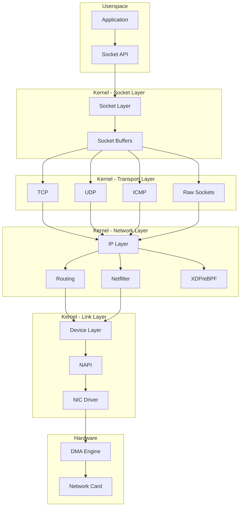
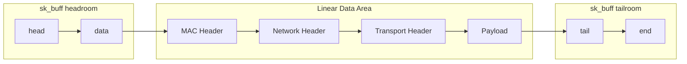
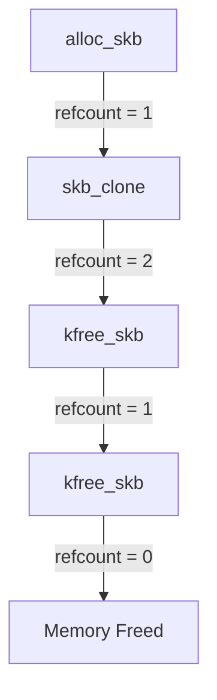
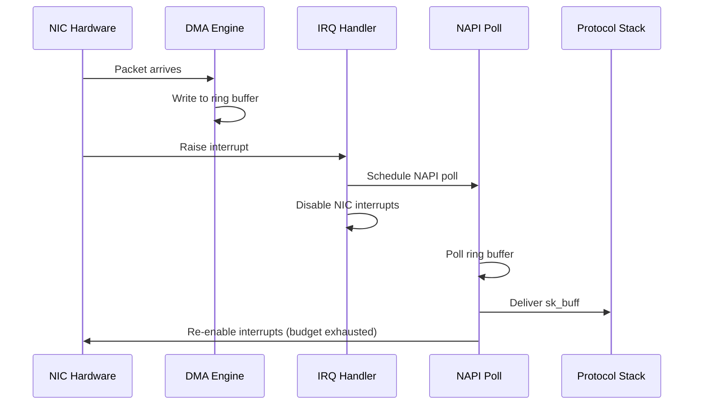
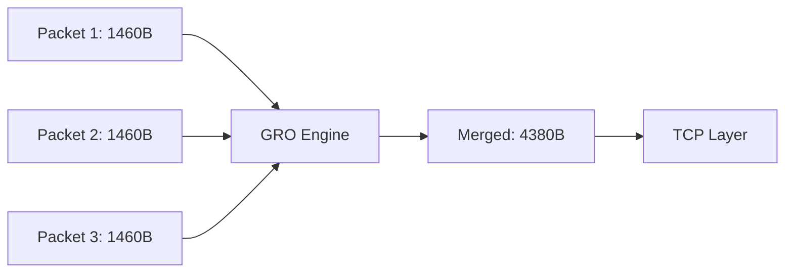
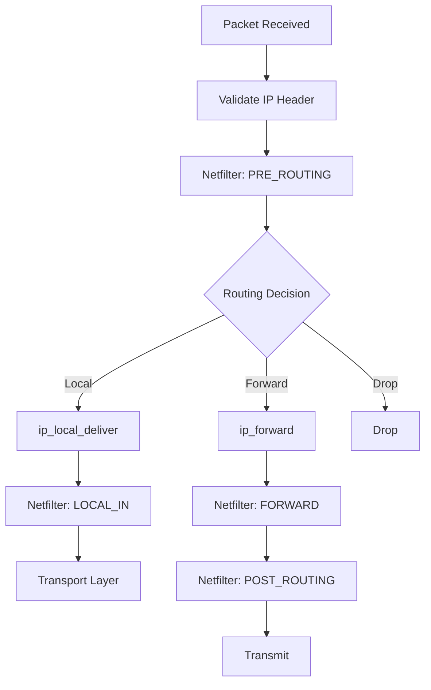
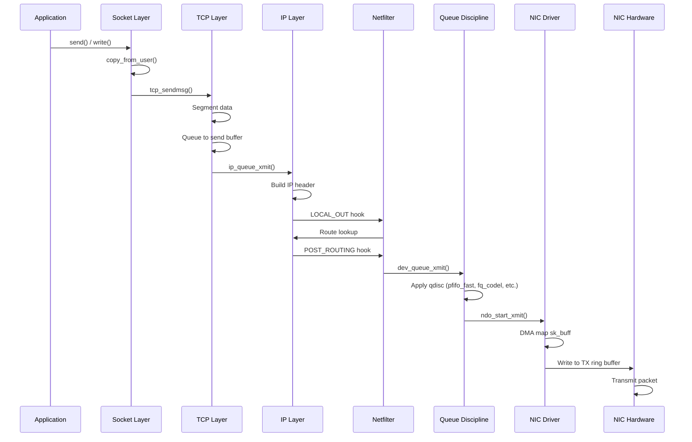
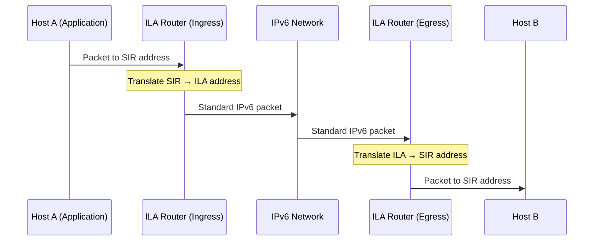

# Kernel Networking Stack Overview

## Introduction

The Linux kernel networking stack is one of the most sophisticated and high-performance networking implementations in any operating system. It handles everything from raw packet reception on network interface cards (NICs) to delivering data to userspace applications through sockets. Understanding this stack is essential for network engineers, kernel developers, and anyone working on high-performance networking systems.

This chapter provides a comprehensive overview of how packets flow through the Linux kernel, the core data structures involved (particularly `sk_buff`), and the architectural decisions that make Linux networking both flexible and fast.

## Architecture Overview

The Linux networking stack follows a layered architecture that mirrors the OSI model but with practical optimizations. The stack is broadly divided into:

1. **Network Interface Layer** — NIC drivers and DMA
2. **Core Networking Layer** — Packet routing, filtering, forwarding
3. **Transport Layer** — TCP, UDP, and other protocol processing
4. **Socket Layer** — The interface between kernel and userspace



## The sk_buff Structure

The `sk_buff` (socket buffer) is the most critical data structure in the Linux networking stack. Every packet — whether received from the network or about to be transmitted — is represented as an `sk_buff`. It acts as a universal container that moves through all layers of the stack.

### Structure Definition

The `sk_buff` is defined in `include/linux/skbuff.h`. Here are the key fields:

```c
struct sk_buff {
    /* These two members must be first */
    struct sk_buff      *next;
    struct sk_buff      *prev;

    union {
        struct net_device   *dev;
        /* Some protocols might use this space when they move
         * the sk_buff to another device */
    };

    struct sock         *sk;           /* Owning socket */
    ktime_t             tstamp;        /* Timestamp */

    /*
     * This is the control buffer. It is free to use for every
     * layer. Please put your private variables there.
     */
    char                cb[48] __aligned(8);

    unsigned long       _skb_refdst;
    void                (*destructor)(struct sk_buff *skb);

    unsigned int        len,           /* Length of actual data */
                        data_len;      /* Data length (non-linear) */
    __u16               mac_len,       /* MAC header length */
                        hdr_len;       /* Cloned skb head length */

    /* Transport layer header */
    union {
        struct tcphdr   *th;
        struct udphdr   *uh;
        struct icmphdr  *icmph;
        struct iphdr    *ipiph;
        unsigned char   *raw;
    } h;

    /* Network layer header */
    union {
        struct iphdr    *iph;
        struct ipv6hdr  *ipv6h;
        struct arphdr   *arph;
        unsigned char   *raw;
    } nh;

    /* Link layer header */
    union {
        struct ethhdr   *ethernet;
        unsigned char   *raw;
    } mac;

    /* Pointers to data area */
    unsigned char       *head,         /* Head of buffer */
                        *data,         /* Data head pointer */
                        *tail,         /* Tail pointer */
                        *end;          /* End pointer */

    __u32               mark;          /* Packet mark (for netfilter) */
    __u16               queue_mapping; /* Queue mapping for multiqueue */
    __u8                ip_summed;     /* Driver fed us an IP checksum */
    __u8                cloned:1,      /* Head may be cloned */
                        nohdr:1;       /* Payload references */

    /* Protocol-specific information */
    __u16               protocol;      /* Packet protocol ID */
    __u32               hash;          /* Packet hash */
};
```

### Memory Layout

Understanding the `sk_buff` memory layout is crucial for performance tuning:



The `head`, `data`, `tail`, and `end` pointers define four regions:

- **Headroom** (`head` to `data`): Space for prepending headers during encapsulation
- **Data** (`data` to `tail`): The actual packet data
- **Tailroom** (`tail` to `end`): Space for appending data
- **Shared info** (after `end`): `skb_shared_info` for fragment lists

### sk_buff Operations

Key operations on socket buffers:

```c
/* Allocate a new sk_buff */
struct sk_buff *alloc_skb(unsigned int size, gfp_t priority);

/* Free an sk_buff */
void kfree_skb(struct sk_buff *skb);

/* Reserve headroom (push pointer forward) */
skb_reserve(struct sk_buff *skb, int len);

/* Add data to the head of the packet */
unsigned char *skb_push(struct sk_buff *skb, unsigned int len);

/* Remove data from the head */
unsigned char *skb_pull(struct sk_buff *skb, unsigned int len);

/* Add data to the tail */
unsigned char *skb_put(struct sk_buff *skb, unsigned int len);

/* Trim the buffer to the specified length */
int skb_trim(struct sk_buff *skb, unsigned int len);

/* Clone an sk_buff (shares data) */
struct sk_buff *skb_clone(struct sk_buff *skb, gfp_t gfp_mask);

/* Deep copy an sk_buff */
struct sk_buff *skb_copy(const struct sk_buff *skb, gfp_t gfp_mask);

/* Linearize scattered data */
int skb_linearize(struct sk_buff *skb);
```

### Reference Counting

`sk_buff` uses reference counting to manage memory efficiently:



When `skb_clone()` is called, the data buffer is shared but the `sk_buff` metadata is duplicated. The reference count (`skb->users`) tracks how many references exist. Only when the count reaches zero is the memory actually freed.

## Packet Reception Path (NIC to Userspace)

The journey of an incoming packet from NIC to application involves several stages, each optimized for performance.

### Stage 1: NIC to Kernel

When a packet arrives at the NIC:

1. **DMA Transfer**: The NIC's DMA engine writes the packet data directly into pre-allocated ring buffers in kernel memory (DMA-coherent memory). This bypasses the CPU entirely for the data transfer.

2. **Interrupt Generation**: After writing the packet, the NIC raises a hardware interrupt (IRQ) to notify the CPU.

3. **Interrupt Handler**: The kernel's interrupt handler (registered by the NIC driver) executes. In modern systems, this typically does minimal work — it just acknowledges the interrupt and schedules NAPI (New API) polling.



### Stage 2: NAPI Processing

NAPI (New API) is the modern interrupt mitigation framework. Instead of processing one packet per interrupt (which causes high interrupt overhead under load), NAPI uses a hybrid approach:

- **Under low load**: Interrupts are used normally for low latency
- **Under high load**: The driver switches to polling mode, processing packets in batches

```c
/* NAPI poll function - called by the kernel */
static int my_driver_poll(struct napi_struct *napi, int budget)
{
    struct my_priv *priv = container_of(napi, struct my_priv, napi);
    int work_done = 0;

    while (work_done < budget) {
        struct sk_buff *skb = my_driver_rx(priv);
        if (!skb)
            break;

        /* Pass packet up the stack */
        napi_gro_receive(napi, skb);
        work_done++;
    }

    if (work_done < budget) {
        napi_complete_done(napi, work_done);
        my_driver_enable_interrupts(priv);
    }

    return work_done;
}
```

### Stage 3: GRO (Generic Receive Offload)

Before packets enter the protocol stack, GRO attempts to merge multiple small packets into larger ones, reducing per-packet processing overhead:



GRO is particularly effective for TCP traffic where consecutive packets share the same flow.

### Stage 4: Protocol Stack Processing

Once an `sk_buff` is ready, it enters the protocol stack:

1. **`netif_receive_skb()`**: The main entry point for received packets
2. **Packet Type Determination**: The kernel examines the Ethernet type field to determine the protocol
3. **Delivery to Protocol Handler**: The packet is delivered to the appropriate protocol handler

```c
/* Simplified packet reception path */
int netif_receive_skb(struct sk_buff *skb)
{
    /* Set timestamp */
    net_timestamp_check(skb);

    /* Check for packet taps (tcpdump, etc.) */
    deliver_skb(skb, &ptype_all, ...);

    /* Determine protocol and deliver */
    skb->protocol = eth_type_trans(skb, skb->dev);

    return __netif_receive_skb(skb);
}

static int __netif_receive_skb(struct sk_buff *skb)
{
    struct packet_type *ptype;
    int ret = NET_RX_DROP;

    /* Walk the protocol handler list */
    list_for_each_entry_rcu(ptype, &ptype_all, list) {
        if (!ptype->dev || ptype->dev == skb->dev) {
            ret = deliver_skb(skb, ptype, ...);
        }
    }

    /* Deliver based on protocol */
    switch (skb->protocol) {
    case htons(ETH_P_IP):
        ret = ip_rcv(skb, skb->dev, ...);
        break;
    case htons(ETH_P_IPV6):
        ret = ipv6_rcv(skb, skb->dev, ...);
        break;
    case htons(ETH_P_ARP):
        ret = arp_rcv(skb, skb->dev, ...);
        break;
    }

    return ret;
}
```

### Stage 5: IP Layer Processing

The IP layer performs:

1. **Header validation**: Checksum verification, length checks
2. **Netfilter PRE_ROUTING hook**: Packet filtering/mangling before routing
3. **Routing decision**: Determine if the packet is for local delivery or forwarding
4. **Defragmentation**: Reassemble fragmented IP packets



### Stage 6: Transport Layer (TCP/UDP)

For TCP packets:

1. **`tcp_v4_rcv()`**: TCP receive entry point
2. **Socket lookup**: Find the socket associated with this packet
3. **State machine processing**: Update TCP state based on packet flags
4. **Data delivery**: Copy data into the socket's receive buffer
5. **Wake up application**: Notify the waiting application

For UDP packets:

1. **`udp_rcv()`**: UDP receive entry point
2. **Socket lookup**: Find matching UDP socket
3. **Queue to socket buffer**: Add packet to socket's receive queue

### Stage 7: Socket to Userspace

The final stage involves copying data from kernel space to userspace:

```c
/* Userspace recv() system call */
ssize_t recv(int sockfd, void *buf, size_t len, int flags);

/* Kernel implementation */
SYSCALL_DEFINE4(recv, int, fd, void __user *, buf, size_t, len, int, flags)
{
    return sys_recvfrom(fd, buf, len, flags, NULL, NULL);
}
```

The data copy uses `copy_to_user()` to transfer data from the kernel socket buffer to the userspace buffer. Zero-copy techniques (like `MSG_ZEROCOPY` or `io_uring`) can avoid this copy for high-performance applications.

## Packet Transmission Path (Userspace to NIC)

The transmission path is essentially the reverse of the receive path:

1. **`send()`/`write()`**: Userspace application calls socket write
2. **Data copy**: Data copied from userspace to kernel `sk_buff`
3. **Socket layer**: Buffer management, flow control
4. **Transport layer**: TCP segmentation or UDP encapsulation
5. **IP layer**: IP header construction, routing
6. **Netfilter hooks**: OUTPUT and POST_ROUTING
7. **Device layer**: Queue to device queue discipline
8. **Driver**: DMA mapping, ring buffer submission
9. **NIC**: Hardware transmission



## Key Kernel Data Structures

### `struct net_device`

Represents a network interface:

```c
struct net_device {
    char            name[IFNAMSIZ];     /* Interface name */
    unsigned long   mem_end;            /* Shared memory end */
    unsigned long   mem_start;          /* Shared memory start */
    unsigned long   base_addr;          /* Device I/O address */
    int             irq;                /* Device IRQ number */

    unsigned char   addr_len;           /* Hardware address length */
    unsigned char   dev_addr[MAX_ADDR_LEN]; /* Hardware address */

    unsigned int    flags;              /* Interface flags */
    unsigned int    mtu;                /* Maximum transfer unit */

    const struct net_device_ops *netdev_ops;  /* Device operations */
    const struct ethtool_ops *ethtool_ops;     /* Ethtool operations */

    struct net_device_stats stats;      /* Device statistics */

    /* Queue management */
    struct netdev_queue *_tx;
    unsigned int        num_tx_queues;
};
```

### `struct sock`

The kernel-side representation of a socket:

```c
struct sock {
    struct sock_common  __sk_common;

#define sk_prot         __sk_common.skc_prot
#define sk_family       __sk_common.skc_family
#define sk_state        __sk_common.skc_state
#define sk_reuse        __sk_common.skc_reuse

    /* Socket buffer management */
    struct sk_buff_head sk_receive_queue;
    struct sk_buff_head sk_write_queue;
    struct sk_buff_head sk_error_queue;

    /* Memory management */
    int             sk_rcvbuf;      /* Receive buffer size */
    int             sk_sndbuf;      /* Send buffer size */

    /* Callbacks */
    void            (*sk_data_ready)(struct sock *sk);
    void            (*sk_write_space)(struct sock *sk);
    void            (*sk_error_report)(struct sock *sk);
};
```

## Performance Optimizations

### SoftIRQ Processing

Network processing happens primarily in softirq context (`NET_RX_SOFTIRQ` and `NET_TX_SOFTIRQ`), which runs with interrupts enabled but at a higher priority than normal processes:

```bash
# Check softirq statistics
$ cat /proc/softirqs
                    CPU0       CPU1       CPU2       CPU3
HI:            0          0          0          0
TIMER:     123456     123455     123457     123454
NET_TX:      1234       1235       1233       1236
NET_RX:    123456     123455     123457     123454
BLOCK:       5678       5677       5679       5676
```

### Busy Polling

For ultra-low latency applications, Linux supports busy polling where the application thread polls the NIC directly, bypassing interrupts:

```bash
# Enable busy polling globally
$ echo 50 > /proc/sys/net/core/busy_read

# Per-socket option
setsockopt(fd, SOL_SOCKET, SO_BUSY_POLL, &timeout, sizeof(timeout));
```

### XDP (eXpress Data Path)

XDP allows packet processing before the `sk_buff` is even allocated, enabling line-rate packet processing. See the [XDP chapter](xdp.md) for details.

### RSS (Receive Side Scaling)

RSS distributes incoming packets across multiple CPU cores using hash-based flow classification:

```bash
# Check RSS settings
$ ethtool -l eth0

# Set RSS to use 4 queues
$ ethtool -L eth0 combined 4
```

## Viewing Network Stack Internals

### Useful Debug Files

```bash
# Network device statistics
$ cat /proc/net/dev

# TCP connection information
$ cat /proc/net/tcp

# Socket statistics
$ ss -tunap

# Network softirq statistics
$ cat /proc/net/softnet_stat

# SNMP counters
$ cat /proc/net/snmp
```

### Debugging with ftrace

```bash
# Trace network-related functions
$ echo 1 > /sys/kernel/debug/tracing/events/net/enable
$ cat /sys/kernel/debug/tracing/trace_pipe

# Trace specific functions
$ echo 'tcp_sendmsg' > /sys/kernel/debug/tracing/set_ftrace_filter
$ echo function > /sys/kernel/debug/tracing/current_tracer
```

### Using BPF for Observability

```c
/* Simple packet counter using BPF */
SEC("xdp")
int xdp_packet_counter(struct xdp_md *ctx) {
    __u32 key = 0;
    __u64 *counter = bpf_map_lookup_elem(&pkt_count, &key);
    if (counter)
        __sync_fetch_and_add(counter, 1);
    return XDP_PASS;
}
```

## Configuration Tuning

### Key sysctl Parameters

```bash
# Receive buffer sizes
$ sysctl net.core.rmem_max=16777216
$ sysctl net.core.rmem_default=1048576

# Send buffer sizes
$ sysctl net.core.somaxconn=65535
$ sysctl net.core.netdev_max_backlog=5000

# TCP-specific tuning
$ sysctl net.ipv4.tcp_rmem="4096 87380 16777216"
$ sysctl net.ipv4.tcp_wmem="4096 65536 16777216"
$ sysctl net.ipv4.tcp_max_syn_backlog=65535

# Congestion control
$ sysctl net.ipv4.tcp_congestion_control=bbr
```

## Networking Subsystem Index

The Linux networking subsystem covers far more than TCP/IP. The kernel includes support for a wide range of networking technologies, hardware device classes, and diagnostic tools. Below is an overview of the major subsystems and topics indexed in the kernel networking documentation.

### Advanced Data Path Technologies

#### AF_XDP (Express Data Path)

AF_XDP is an address family optimized for high-performance packet processing. It provides a zero-copy path between the NIC and user space, bypassing the kernel networking stack entirely:

- Frames are transferred via shared memory **UMEM** regions
- Four ring buffers: RX, TX, Fill, and Completion
- Can operate in **zero-copy mode** (with NIC driver support) or **copy mode**
- Ideal for high-frequency packet processing, NFV, and load balancers

```c
/* AF_XDP socket setup */
int xsk_fd = socket(AF_XDP, SOCK_RAW, 0);
/* Bind to queue 0 on eth0 */
struct sockaddr_xdp sxdp = {
    .sxdp_family = AF_XDP,
    .sxdp_ifindex = if_nametoindex("eth0"),
    .sxdp_queue_id = 0,
};
bind(xsk_fd, (struct sockaddr *)&sxdp, sizeof(sxdp));
```

See the [AF_XDP documentation](https://docs.kernel.org/networking/af_xdp.html) for full details.

#### SocketCAN

SocketCAN provides a socket-based interface for CAN (Controller Area Network) bus communication, used extensively in automotive and industrial systems:

- Uses standard socket API (`socket()`, `bind()`, `send()`, `recv()`)
- Supports CAN 2.0A/B and CAN FD frames
- Protocols: `CAN_RAW`, `CAN_BCM` (Broadcast Manager), `CAN_ISOTP` (ISO-TP)
- Multiple CAN interfaces can be used simultaneously

```c
int s = socket(PF_CAN, SOCK_RAW, CAN_RAW);
struct sockaddr_can addr = {
    .can_family = AF_CAN,
    .can_ifindex = if_nametoindex("can0"),
};
bind(s, (struct sockaddr *)&addr, sizeof(addr));
```

### Network Device Architecture

#### Distributed Switch Architecture (DSA)

DSA is a framework for managing hardware network switches (typically embedded in routers and switches). It presents each switch port as a separate Linux network interface:

- Supports switches connected via MDIO, SPI, or Ethernet
- Switch ports appear as regular `ethN` interfaces
- VLAN, bridging, and routing offload supported
- Used in embedded networking devices (OpenWrt routers, etc.)

#### Devlink

Devlink is a generic framework for configuring and managing network device resources and parameters that don't fit into other APIs (ethtool, iproute2, etc.):

- Device-level resource management (e.g., number of TCAM entries)
- Firmware flash and activation
- Health reporting and recovery
- Device info (serial number, board info)
- Shared buffer configuration for switches

```bash
# List all devlink devices
$ devlink dev show

# Show device info
$ devlink dev info pci/0000:03:00.0

# Configure resources
$ devlink resource set pci/0000:03:00.0 path /kvd/linear size 98304
```

#### Netlink Ethtool Interface

Modern ethtool operations use a **netlink-based interface** (`ETHTOOL_GENL_`) instead of the legacy `ioctl` path. This provides:

- Structured, extensible message format
- Multi-attribute support (get/set multiple params in one call)
- Notifications for configuration changes
- Better support for modern NIC features

### Hardware Device Drivers

The kernel networking subsystem includes drivers for a wide range of hardware categories:

| Category | Examples | Kernel Directory |
|----------|----------|------------------|
| **Ethernet** | igb, ixgbe, mlx5, bnxt, e1000e, r8169 | `drivers/net/ethernet/` |
| **WiFi (WLAN)** | iwlwifi, ath11k, mt76, rtw89, brcmfmac | `drivers/net/wireless/` |
| **CAN** | kvaser, peak, socketcan, m_can | `drivers/net/can/` |
| **Cellular / WWAN** | qmi_wwan, cdc_mbim, sierra_net | `drivers/net/wwan/` |
| **InfiniBand / RDMA** | mlx5, bnxt_re, efa | `drivers/infiniband/` |
| **Bluetooth** | btusb, btintel, btmtk | `net/bluetooth/`, `drivers/bluetooth/` |
| **Tunneling** | vxlan, geneve, gre, ipip | `drivers/net/` (virtual) |
| **Bonding / Team** | bonding, team | `drivers/net/bonding/`, `drivers/net/team/` |

### Networking Diagnostics

The kernel provides extensive networking diagnostics and debugging tools:

#### /proc/net/ Files

```bash
# Per-interface statistics
$ cat /proc/net/dev

# TCP connection table
$ cat /proc/net/tcp

# UDP sockets
$ cat /proc/net/udp

# ARP table
$ cat /proc/net/arp

# Routing table
$ cat /proc/net/route

# Netfilter conntrack
$ cat /proc/net/nf_conntrack

# SNMP counters
$ cat /proc/net/snmp

# Network softirq statistics
$ cat /proc/net/softnet_stat
```

#### Socket Statistics (ss)

```bash
# All TCP sockets with process info
$ ss -tunap

# Filter by state
$ ss -t state established

# Show socket memory usage
$ ss -tum

# Show BPF programs attached to sockets
$ ss --bpf
```

#### Network Namespaces

```bash
# List network namespaces
$ ip netns list

# Create a namespace
$ ip netns add test_ns

# Run a command in a namespace
$ ip netns exec test_ns ip addr

# Move an interface to a namespace
$ ip link set veth0 netns test_ns
```

#### Tracepoints and BPF

```bash
# Trace TCP retransmissions
$ sudo bpftrace -e 'kprobe:tcp_retransmit_skb { printf("retransmit\n"); }'

# Trace dropped packets
$ sudo perf trace -e 'net:*' -- sleep 5

# Count packets by protocol
$ sudo bpftool prog list
```

## VXLAN — Virtual eXtensible Local Area Network

VXLAN is a tunnelling protocol designed to solve the limited VLAN ID space (4096) in IEEE 802.1q. With VXLAN, the identifier is expanded to **24 bits** (16,777,216 segments). VXLAN is described by **IETF RFC 7348** and runs over UDP using a single destination port (IANA-assigned port **4789**).

### Key Properties

| Property | Detail |
|----------|--------|
| Encapsulation | Layer 2 over Layer 3 (UDP) |
| VNI size | 24 bits (16M segments vs 4K for VLAN) |
| Default UDP port | 4789 (Linux default may differ for backward compat) |
| Learning | Dynamic (like a learning bridge) or static forwarding entries |
| Topology | 1:N network (not just point-to-point) |

### Linux VXLAN Configuration

```bash
# Create a VXLAN device
ip link add vxlan0 type vxlan id 42 group 239.1.1.1 dev eth1 dstport 4789

# Delete a VXLAN device
ip link delete vxlan0

# Show VXLAN info
ip -d link show vxlan0

# Add a static forwarding entry
bridge fdb add to 00:17:42:8a:b4:05 dst 192.19.0.2 dev vxlan0

# Delete a forwarding entry
bridge fdb delete 00:17:42:8a:b4:05 dev vxlan0

# Show forwarding table
bridge fdb show dev vxlan0
```

### NIC Offloads for VXLAN

Modern NICs support hardware offloads for VXLAN:

| Offload | Description |
|---------|-------------|
| `tx-udp_tnl-segmentation` | TSO for UDP-encapsulated frames |
| `tx-udp_tnl-csum-segmentation` | Checksum offload + TSO for VXLAN |
| `rx-udp_tunnel-port-offload` | RX parsing of encapsulated frames (checksum validation) |

```bash
# Check offloaded tunnel ports
ethtool --show-tunnels eth0
```

The Linux VXLAN implementation predates the IANA port assignment and uses a Linux-selected default port for backward compatibility. The kernel implementation is separate from Open vSwitch's VXLAN.

---

## MPLS — Multi-Protocol Label Switching

MPLS is a protocol that operates between Layer 2 (data link) and Layer 3 (network), using short fixed-length labels to make forwarding decisions. The Linux kernel supports MPLS as a routing protocol.

### MPLS Concepts

- **Label**: A 20-bit identifier (0–1048575) prepended to packets
- **Label Stack**: Multiple labels can be stacked (for tunneling, VPN, etc.)
- **LSR (Label Switch Router)**: Forwards packets based on label values
- **LSP (Label Switched Path)**: The path through MPLS routers

### Linux MPLS Configuration

MPLS forwarding is controlled via sysctl and `ip route`:

```bash
# Enable MPLS on interfaces
sysctl -w net.mpls.platform_labels=1048575  # Max label space
sysctl -w net.mpls.conf.eth0.input=1        # Accept MPLS on eth0
sysctl -w net.mpls.conf.eth1.input=1        # Accept MPLS on eth1

# Add MPLS routes (label 100 → forward via eth1)
ip route add 10.0.0.0/8 encap mpls 100 via 192.168.1.1 dev eth1

# Pop label and deliver locally
ip -f mpls route add 200 dev lo
```

### MPLS Sysctl Parameters

From `docs.kernel.org/networking/mpls-sysctl.html`:

| Parameter | Description |
|-----------|-------------|
| `platform_labels` | Number of entries in the platform label table (0–1048575). Default: 0 (disabled) |
| `ip_ttl_propagate` | TTL propagation: 0 = RFC 3443 Short Pipe Model, 1 = Uniform Model (default) |
| `default_ttl` | Default TTL for MPLS packets without IP header (1–255, default 255) |
| `conf/<iface>/input` | Enable/disable MPLS input on interface (0 = disabled by default) |

Setting `platform_labels=0` disables MPLS forwarding entirely. Reducing the value removes label routing entries that no longer fit.

---

## Networking Subsystem Components (from docs.kernel.org)

The kernel networking documentation at `docs.kernel.org/networking/index.html` reveals the full breadth of the networking subsystem, which extends far beyond TCP/IP.

### AF_XDP (Express Data Path)

AF_XDP is an address family optimized for high-performance packet processing. It provides a zero-copy path between the NIC and user space, bypassing the kernel networking stack entirely:

- Frames are transferred via shared memory **UMEM** regions
- Four ring buffers: RX, TX, Fill, and Completion
- Can operate in **zero-copy mode** (with NIC driver support) or **copy mode**
- Ideal for high-frequency packet processing, NFV, and load balancers

### SocketCAN

SocketCAN provides a socket-based interface for CAN (Controller Area Network) bus communication, used extensively in automotive and industrial systems. It uses the standard socket API with protocols like `CAN_RAW`, `CAN_BCM` (Broadcast Manager), and `CAN_ISOTP` (ISO-TP).

### Distributed Switch Architecture (DSA)

DSA is a framework for managing hardware network switches (typically embedded in routers). It presents each switch port as a separate Linux network interface and supports VLAN, bridging, and routing offload.

### Devlink

Devlink is a generic framework for configuring network device resources that don't fit into other APIs (ethtool, iproute2). It handles device-level resource management, firmware flash, health reporting, and shared buffer configuration.

### Kernel TLS

The kernel supports TLS encryption directly in the kernel, with optional hardware offload via NICs:
- `kTLS` operates after the TLS handshake (done in user space)
- Supports sendfile() zero-copy with encryption
- NIC offload for TX and RX encryption/decryption

### Network Scaling Technologies

The kernel provides multiple layers of packet distribution:

- **RSS (Receive Side Scaling)**: Hardware-based flow hashing across queues
- **RPS (Receive Packet Steering)**: Software-based flow hashing to CPUs
- **RFS (Receive Flow Steering)**: Flow-aware steering to the CPU running the application
- **XPS (Transmit Packet Steering)**: Maps TX queues to CPUs

### Checksum and Segmentation Offloads

The kernel supports extensive hardware offload capabilities:
- **TSO (TCP Segmentation Offload)**: NIC segments large TCP buffers
- **GSO (Generic Segmentation Offload)**: Deferred segmentation in software
- **GRO (Generic Receive Offload)**: Merges small packets into larger ones
- **UFO (UDP Fragmentation Offload)**: Fragment large UDP datagrams
- **Checksum offload**: TX and RX checksum computation in hardware

## TIPC (Transparent Inter Process Communication)

TIPC is a protocol specifically designed for **intra-cluster communication**. Unlike TCP/IP, which is designed for wide-area networking, TIPC is optimized for communication between nodes in a tightly-coupled cluster.

### Key Features

- **Cluster-wide IPC service**: Provides the convenience of Unix Domain Sockets across cluster nodes — no DNS lookups, no IP address management, no timer-based peer monitoring.
- **Service Addressing**: Applications choose their own addresses (service addresses) rather than using IP:port pairs. Clients send messages using service addresses; the kernel handles routing.
- **Service Tracking**: Clients subscribe for binding/unbinding events on service addresses, enabling automatic discovery of available servers.
- **Multiple Transmission Modes**:
  - **Datagram**: Connectionless message delivery
  - **Connection-oriented**: Reliable, sequenced byte streams
  - **Communication Groups**: Brokerless message bus with multicast
- **Inter-Node Links**: Automatic link management between cluster nodes with guaranteed delivery, sequencing, and flow control.
- **Cluster Scalability**: Uses Overlapping Ring Monitoring to scale up to 1000 nodes with 1-2 second failure detection.
- **Neighbor Discovery**: Automatic discovery via Ethernet broadcast or UDP multicast.

### Performance Characteristics

TIPC message latency is lower than any other known protocol. Maximum byte throughput for inter-node connections is somewhat lower than TCP, but intra-node and inter-container throughput on the same host is superior.

### Language Support

The TIPC user API supports C, Python, Perl, Ruby, D, and Go.

### TIPC Architecture

```bash
# TIPC is implemented as a kernel module
modprobe tipc

# Basic configuration (cluster mode)
tipc bearer enable media udp ip:192.168.1.1
tipc peer detect

# Or Ethernet-based
tipc bearer enable media eth dev eth0

# View TIPC status
tipc node show
```

The TIPC implementation lives in `net/tipc/` and uses these key data structures:
- `struct tipc_bearer` — network interface abstraction (media-agnostic)
- `struct tipc_media` — media-specific operations (Ethernet, UDP)
- `struct publication` — published service address or range
- `struct name_table` — hash table of all published services
- `struct tipc_subscription` — topology event subscription

## References

- [The Linux Kernel Documentation](https://docs.kernel.org/)
- [LWN.net - Linux and free software news](https://lwn.net/)
- [GNU Project Documentation](https://www.gnu.org/doc/doc.html)
- [GNU Manuals](https://www.gnu.org/manual/manual.html)
- [Free Software Directory](https://directory.fsf.org/wiki/Main_Page)
- [Planet GNU](https://planet.gnu.org/)
- [Free Software Books](https://www.gnu.org/doc/other-free-books.html)

1. **Linux Kernel Source** — `net/core/`, `net/ipv4/`, `include/linux/skbuff.h`
2. *Understanding Linux Network Internals* by Christian Benvenuti (O'Reilly)
3. *Linux Kernel Networking: Implementation and Theory* by Rami Rosen (Apress)
4. **Linux Foundation Networking Training** — [training.linuxfoundation.org](https://training.linuxfoundation.org/)
5. **kernel.org Documentation** — [www.kernel.org/doc/html/latest/networking/](https://www.kernel.org/doc/html/latest/networking/)
6. [Linux Kernel Networking Documentation](https://docs.kernel.org/networking/index.html) — Official kernel networking subsystem index
7. [TIPC Protocol Documentation — docs.kernel.org](https://docs.kernel.org/networking/tipc.html) — Official TIPC kernel documentation
8. [TIPC Getting Started](http://tipc.io/getting_started.html) — TIPC setup guide
9. [TIPC Programming Guide](http://tipc.io/programming.html) — TIPC API reference
10. [TIPC Protocol Specification](http://tipc.io/protocol.html) — Protocol details
11. [Identifier Locator Addressing (ILA) — docs.kernel.org](https://docs.kernel.org/networking/ila.html)
12. [VXLAN documentation — docs.kernel.org](https://docs.kernel.org/networking/vxlan.html)
13. [MPLS Sysfs variables — docs.kernel.org](https://docs.kernel.org/networking/mpls-sysctl.html)

## ILA — Identifier Locator Addressing

Identifier-Locator Addressing (ILA) is an IPv6-based technique that separates a node's **identity** (immutable identifier) from its **location** (topological network prefix). This enables overlay networking without encapsulation — packets are translated in-flight by performing destination address rewrites, so the network sees standard IPv6 traffic (ECMP, RSS, GRO, GSO all work normally).

ILA is defined in Internet-Draft `draft-herbert-intarea-ila` and implemented in the Linux kernel.

### Key Concepts

| Term | Description |
|------|-------------|
| **Identifier** | 64-bit immutable identity of a node |
| **Locator** | 64-bit network prefix routing to a physical host |
| **SIR address** | IPv6 = SIR prefix (upper 64) + identifier (lower 64) — visible to applications |
| **ILA address** | IPv6 = locator (upper 64) + identifier (lower 64) — never visible to applications |
| **ILA router** | Network node performing ILA translation and forwarding |
| **ILA host** | End host performing ILA translation on TX or RX |

### How ILA Works



### Transport Checksum Handling

ILA address translation modifies the destination address, which is covered by transport-layer checksums (TCP/UDP). Three strategies:

- **No action**: Allow incorrect checksums on wire; receiver verifies after ILA→SIR translation
- **Adjust transport checksum**: Parse packet and recompute checksum (requires deep packet inspection)
- **Checksum-neutral mapping** (preferred): Offset the difference in the low-order 16 bits of the identifier so the checksum remains valid without parsing beyond the IP header

### Configuration

```bash
# ILA route with checksum-neutral mapping
ip route add 3333:0:0:1:2000:0:1:87/128 encap ila 2001:0:87:0 \
    csum-mode neutral-map ident-type use-format

# ILA to SIR translation (receive path)
ip ila add loc_match 2001:0:119:0 loc 3333:0:0:1 \
    csum-mode neutral-map-auto ident-type luid
```

ILA can also be implemented as an XDP program for high-performance router deployments.

## Related Topics

- [Socket Layer](sockets.md) — Deep dive into socket structures and operations
- [TCP/IP Implementation](tcpip.md) — How TCP/IP is implemented in the kernel
- [Netfilter](netfilter.md) — Packet filtering and mangling framework
- [XDP](xdp.md) — eXpress Data Path for high-performance packet processing
- [eBPF for Networking](ebpf.md) — Programmable packet processing
- [Network Fundamentals](../networking/fundamentals.md) — OSI model and network basics
