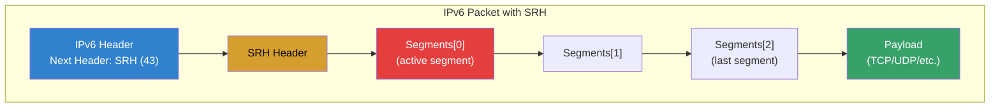
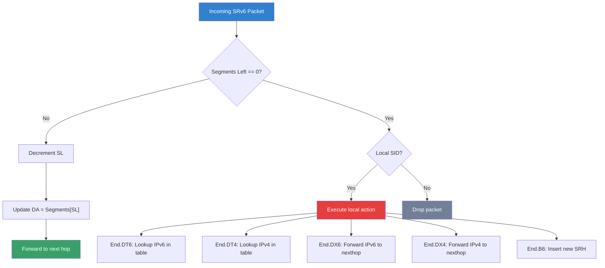
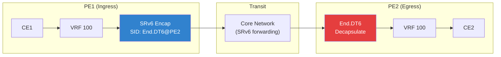
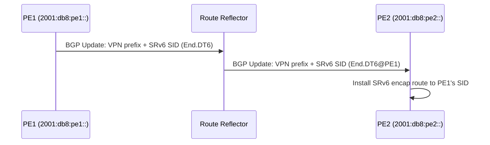
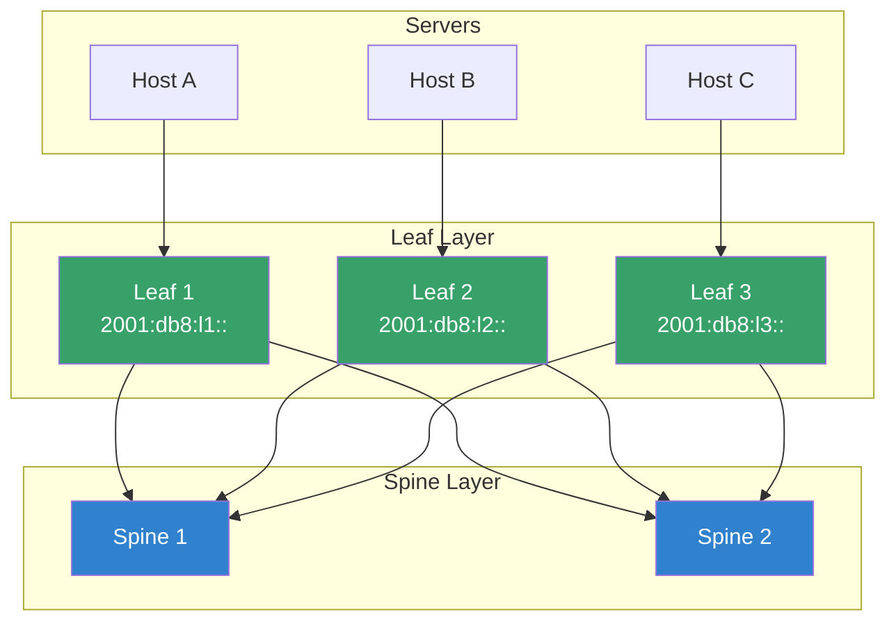

# SRv6: Segment Routing over IPv6

## Introduction

Segment Routing over IPv6 (SRv6) is a source-routing architecture that leverages the IPv6 header and a new Routing Header type called the Segment Routing Header (SRH) to steer packets through an ordered list of forwarding instructions called *segments*. Unlike traditional MPLS-based Segment Routing (SR-MPLS), SRv6 requires no additional label stack — segments are encoded directly as IPv6 addresses.

SRv6 enables:
- **Traffic engineering** — explicit path control without per-flow state in transit nodes
- **Network programming** — arbitrary functions executed at each segment endpoint
- **VPN services** — scalable L2/L3 VPN without MPLS
- **Service chaining** — steer traffic through a sequence of network functions

## Core Concepts

### Segments

A **segment** is a 128-bit identifier that represents:
- A topological instruction (go to node X)
- A service instruction (apply function F at node X)
- A binding instruction (traverse a specific path)

Segment types:

| Type | Abbreviation | Description |
|------|-------------|-------------|
| Prefix Segment | `End` | Forward to a node's prefix |
| Adjacency Segment | `End.X` | Forward over a specific link |
| Binding Segment | `End.B6` | Encapsulate and traverse another SRv6 path |
| VPN Segment | `End.DT4` / `End.DT6` | Decapsulate and deliver to a VRF table |
| Service Segment | `End.*` | Execute a custom network function |

### SRH: Segment Routing Header

The SRH is a new IPv6 Routing Header (type 4) defined in RFC 8754.



### SRH Header Structure

```
 0                   1                   2                   3
 0 1 2 3 4 5 6 7 8 9 0 1 2 3 4 5 6 7 8 9 0 1 2 3 4 5 6 7 8 9 0 1
+-+-+-+-+-+-+-+-+-+-+-+-+-+-+-+-+-+-+-+-+-+-+-+-+-+-+-+-+-+-+-+-+
|  Next Header  |  Hdr Ext Len  | Routing Type  | Segments Left |
+-+-+-+-+-+-+-+-+-+-+-+-+-+-+-+-+-+-+-+-+-+-+-+-+-+-+-+-+-+-+-+-+
|  Last Entry   |     Flags     |            Tag                |
+-+-+-+-+-+-+-+-+-+-+-+-+-+-+-+-+-+-+-+-+-+-+-+-+-+-+-+-+-+-+-+-+
|                                                               |
|            Segment List[0] (128-bit IPv6 address)             |
|                                                               |
|                                                               |
+-+-+-+-+-+-+-+-+-+-+-+-+-+-+-+-+-+-+-+-+-+-+-+-+-+-+-+-+-+-+-+-+
|                                                               |
|            Segment List[1] (128-bit IPv6 address)             |
|                                                               |
|                                                               |
+-+-+-+-+-+-+-+-+-+-+-+-+-+-+-+-+-+-+-+-+-+-+-+-+-+-+-+-+-+-+-+-+
|                            ...                                |
+-+-+-+-+-+-+-+-+-+-+-+-+-+-+-+-+-+-+-+-+-+-+-+-+-+-+-+-+-+-+-+-+
|                                                               |
|            Segment List[n] (128-bit IPv6 address)             |
|                                                               |
|                                                               |
+-+-+-+-+-+-+-+-+-+-+-+-+-+-+-+-+-+-+-+-+-+-+-+-+-+-+-+-+-+-+-+-+
```

**Fields:**
- **Segments Left** — index of next segment to process (decremented at each hop)
- **Last Entry** — index of the last segment in the list
- **Flags** — SRH flags (O-flag for cleanup, etc.)
- **Tag** — 16-bit tag for packet classification

### Segment ID (SID) Format

SRv6 SIDs are 128-bit values, structured as:

```
|<-- Locator (32-64 bits) -->|<-- Function (16-32 bits) -->|<-- Args (0-48 bits) -->|
```

**Example SID:** `2001:db8:a::1` where:
- `2001:db8:a::` is the **locator** (identifies the node)
- `1` is the **function** (e.g., `End`, `End.X`, `End.DT4`)

## Linux Kernel SRv6 Implementation

### Kernel Configuration

```bash
# Required kernel config
CONFIG_IPV6=y
CONFIG_IPV6_SEG6=y                  # SRv6 core
CONFIG_IPV6_SEG6_LWTUNNEL=y         # Lightweight tunnels for SRv6
CONFIG_IPV6_SEG6_HMAC=y             # SRH HMAC authentication
CONFIG_IPV6_SEG6_INLINE=y           # Inline mode
CONFIG_NETFILTER_XT_MATCH_SRH=y     # Netfilter SRH matching
CONFIG_LWTUNNEL=y                   # Lightweight tunnel infrastructure
```

### Checking SRv6 Support

```bash
# Verify kernel support
zgrep SEG6 /proc/config.gz
# or
grep SEG6 /boot/config-$(uname -r)

# Check if SRv6 module is loaded
lsmod | grep seg6

# Load SRv6 modules
sudo modprobe ipv6
sudo modprobe seg6
sudo modprobe seg6_local
sudo modprobe seg6_iptun
sudo modprobe seg6_hmac
```

### SRv6 with iproute2

#### Basic SRv6 Configuration

```bash
# Enable IPv6 forwarding
sudo sysctl -w net.ipv6.conf.all.forwarding=1

# Add an SRv6 encapsulation route
sudo ip -6 route add 2001:db8:dead::/48 encap seg6 mode encap \
    segs 2001:db8:a::1,2001:db8:b::1 dev eth0

# Add an SRv6 insert route (inline mode)
sudo ip -6 route add 2001:db8:dead::/48 encap seg6 mode inline \
    segs 2001:db8:a::1,2001:db8:b::1 dev eth0

# Add an SRv6 decapsulation route (End.DT6)
sudo ip -6 route add 2001:db8:c::1/128 encap seg6local action End.DT6 \
    table 100 dev eth0
```

#### SRv6 Local Actions (Segment Endpoints)

```bash
# End — regular SRv6 endpoint
sudo ip -6 route add 2001:db8:a::1/128 encap seg6local action End dev lo

# End.X — cross-connect (forward to specific next-hop)
sudo ip -6 route add 2001:db8:a::2/128 encap seg6local action End.X \
    nh6 2001:db8:1::2 dev eth0

# End.T — decapsulate and lookup in specific table
sudo ip -6 route add 2001:db8:a::3/128 encap seg6local action End.T \
    table 100 dev lo

# End.DT4 — VPN: decap IPv4 and lookup in VRF table
sudo ip -6 route add 2001:db8:a::4/128 encap seg6local action End.DT4 \
    table 100 dev lo

# End.DT6 — VPN: decap IPv6 and lookup in VRF table
sudo ip -6 route add 2001:db8:a::5/128 encap seg6local action End.DT6 \
    table 100 dev lo

# End.DT46 — VPN: decap IPv4/IPv6 and lookup in VRF table
sudo ip -6 route add 2001:db8:a::6/128 encap seg6local action End.DT46 \
    table 100 dev lo

# End.DX4 — decap and forward IPv4 to specific nexthop
sudo ip -6 route add 2001:db8:a::7/128 encap seg6local action End.DX4 \
    nh4 10.0.0.1 dev lo

# End.DX6 — decap and forward IPv6 to specific nexthop
sudo ip -6 route add 2001:db8:a::8/128 encap seg6local action End.DX6 \
    nh6 2001:db8:1::2 dev lo

# End.B6 — encap in another SRv6 path
sudo ip -6 route add 2001:db8:a::9/128 encap seg6local action End.B6 \
    segs 2001:db8:x::1,2001:db8:y::1 dev lo

# End.B6.Encaps — encapsulate in a new IPv6+SRH
sudo ip -6 route add 2001:db8:a::10/128 encap seg6local action End.B6.Encaps \
    segs 2001:db8:x::1,2001:db8:y::1 dev lo
```

#### SRv6 End Function Reference



## SRv6 Network Programming (SRv6 Network Programming)

### Micro-SIDs (uSID)

SRv6 micro-SIDs (uSID, draft-ietf-spring-srv6-srh-compression) compress the 128-bit SID by encoding multiple micro-instructions in a single IPv6 address:

```
Traditional SRv6 SID:  2001:db8:a::1    (128 bits = 1 instruction)
uSID SID:              fcbb:bb00:1:2::  (128 bits = 2+ instructions)
```

This reduces header overhead significantly.

### SRv6 for VPN Services



### Configuration Example: SRv6 L3VPN

```bash
#!/bin/bash
# SRv6 L3VPN setup on PE router

# Enable forwarding
sysctl -w net.ipv6.conf.all.forwarding=1
sysctl -w net.ipv4.ip_forward=1

# Create VRF for customer
ip link add vrf-customer type vrf table 100
ip link set vrf-customer up

# Assign interface to VRF
ip link set eth1 master vrf-customer
ip addr add 10.0.0.1/24 dev eth1

# Configure SRv6 SID for VPN decapsulation
ip -6 route add 2001:db8:pe1::dt6/128 encap seg6local \
    action End.DT6 table 100 dev lo

# Configure SRv6 encapsulation for outbound VPN traffic
# Customer traffic to 10.0.1.0/24 via remote PE
ip route add 10.0.1.0/24 vrf vrf-customer encap seg6 \
    mode encap segs 2001:db8:pe2::dt6 dev eth0
```

## SRv6 with BGP

### BGP SRv6 SID Advertisement



### FRR Configuration

```bash
# FRR SRv6 configuration (bgpd.conf)
router bgp 65000
 !
 address-family ipv6 vpn
  neighbor 2001:db8:rr:: activate
  neighbor 2001:db8:rr:: send-community extended
 exit-address-family
 !
 segment-routing
  srv6
   locators
    locator PE1
     prefix 2001:db8:pe1::/48
    exit
   exit
  exit
 exit
```

## SRv6 with eBPF

Linux eBPF programs can inspect and manipulate SRv6 headers:

```c
#include <linux/bpf.h>
#include <linux/seg6.h>
#include <linux/ipv6.h>

/* eBPF program to inspect SRv6 headers */
SEC("xdp")
int xdp_srv6_inspect(struct xdp_md *ctx)
{
    void *data = (void *)(long)ctx->data;
    void *data_end = (void *)(long)ctx->data_end;

    struct ipv6hdr *ip6 = data;
    if ((void *)(ip6 + 1) > data_end)
        return XDP_PASS;

    /* Check for SRH (Routing Header type 4) */
    if (ip6->nexthdr != 43)
        return XDP_PASS;

    struct sr6hdr *srh = (void *)(ip6 + 1);
    if ((void *)(srh + 1) > data_end)
        return XDP_PASS;

    /* Log segment count */
    bpf_printk("SRv6: %d segments left\n", srh->segments_left);

    return XDP_PASS;
}
```

## SRv6 Traffic Engineering

### SRv6-TE Policy

```bash
#!/bin/bash
# SRv6 TE: steer traffic through specific nodes

# Policy: traffic to 2001:db8:dst::/48 via path through A then B
sudo ip -6 route add 2001:db8:dst::/48 encap seg6 mode encap \
    segs 2001:db8:a::1,2001:db8:b::1,2001:db8:dst::1 \
    dev eth0

# SRv6 with TI-LFA (Topology-Independent Loop-Free Alternate)
# Automatic fast-reroute using SRv6 segments
sudo ip -6 route add 2001:db8:dst::/48 encap seg6 mode encap \
    segs 2001:db8:backup::1 dev eth0
```

### SRv6 in Data Center Fabric



## HMAC Authentication for SRH

SRv6 supports HMAC authentication (RFC 8754, Section 5.1) to prevent segment spoofing:

```bash
# Configure SRv6 HMAC
sudo ip -6 sr hmac set 00000001 2001:db8:key::1

# Add HMAC to SRv6 policy
sudo ip -6 route add 2001:db8:dst::/48 encap seg6 mode encap \
    segs 2001:db8:a::1 hmac 00000001 dev eth0
```

## Kernel Source Code

### Key Files

```
net/ipv6/
├── seg6.c              # SRv6 core
├── seg6_local.c        # Local segment actions (End, End.X, etc.)
├── seg6_hmac.c         # HMAC authentication
├── seg6_iptun.t        # SRv6 tunnels (encap/inline)
├── seg6_main.c         # Module initialization
└── include/
    ├── net/seg6.h      # SRv6 structures
    └── net/seg6_local.h # Local segment definitions
```

### Key Data Structures

```c
/* SRv6 Segment Routing Header */
struct sr6hdr {
    __u8    nexthdr;
    __u8    hdrlen;
    __u8    type;          /* Routing Type 4 */
    __u8    segments_left;
    __u8    first_segment;
    __u8    flags;
    __u16   tag;
    struct in6_addr segments[0]; /* Segment list */
};

/* SRv6 local action */
struct seg6_action_desc {
    int action;
    int (*input)(struct sk_buff *skb, struct seg6_action_desc *desc);
    int attrs;
    int (*static_headroom)(struct seg6_action_desc *desc);
};
```

## Troubleshooting

### Common Issues

| Symptom | Cause | Solution |
|---------|-------|----------|
| Packets dropped at SRv6 node | SL out of range | Check segment list ordering |
| No SRv6 in routing | Module not loaded | `modprobe seg6 seg6_local` |
| HMAC verification failed | Key mismatch | Sync HMAC keys across nodes |
| High CPU on transit | SRH inserted on every packet | Use `mode inline` instead of `mode encap` |
| PMTU issues | SRH adds overhead | Adjust MTU or enable PMTU discovery |

### Debugging Commands

```bash
# Show SRv6 routes
ip -6 route show encap seg6
ip -6 route show encap seg6local

# Dump SRv6 segment routing headers
sudo tcpdump -i eth0 -vv ip6 proto 43

# SRv6 statistics
cat /proc/net/snmp6 | grep Seg6

# Trace SRv6 packet path
sudo ip6tables -t raw -A PREROUTING -m srh --srh-next-hdr 6 -j TRACE
sudo dmesg | grep TRACE

# Monitor SRv6 counters
ip -6 sr stats show
```

## Further Reading

- [RFC 8754 — IPv6 Segment Routing Header (SRH)](https://tools.ietf.org/html/rfc8754)
- [RFC 8986 — Segment Routing over IPv6 (SRv6) Network Programming](https://tools.ietf.org/html/rfc8986)
- [draft-ietf-spring-srv6-srh-compression — SRv6 SID Compression](https://datatracker.ietf.org/doc/draft-ietf-spring-srv6-srh-compression/)
- [Linux Kernel SRv6 Documentation](https://www.kernel.org/doc/html/latest/networking/segment-routing.html)
- [SRv6 Linux Kernel Implementation](https://github.com/torvalds/linux/tree/master/net/ipv6)
- [FRR SRv6 Configuration](https://docs.frrouting.org/en/latest/seg6.html)

## See Also

- [IPv6](./tcpip.md) — IPv6 protocol fundamentals
- [Netfilter](./netfilter.md) — packet filtering with SRv6
- [eBPF](./ebpf.md) — SRv6 packet manipulation with eBPF
- [Namespaces](./namespaces.md) — network namespace isolation for SRv6
- [TC](./tc.md) — traffic control with SRv6 policies
