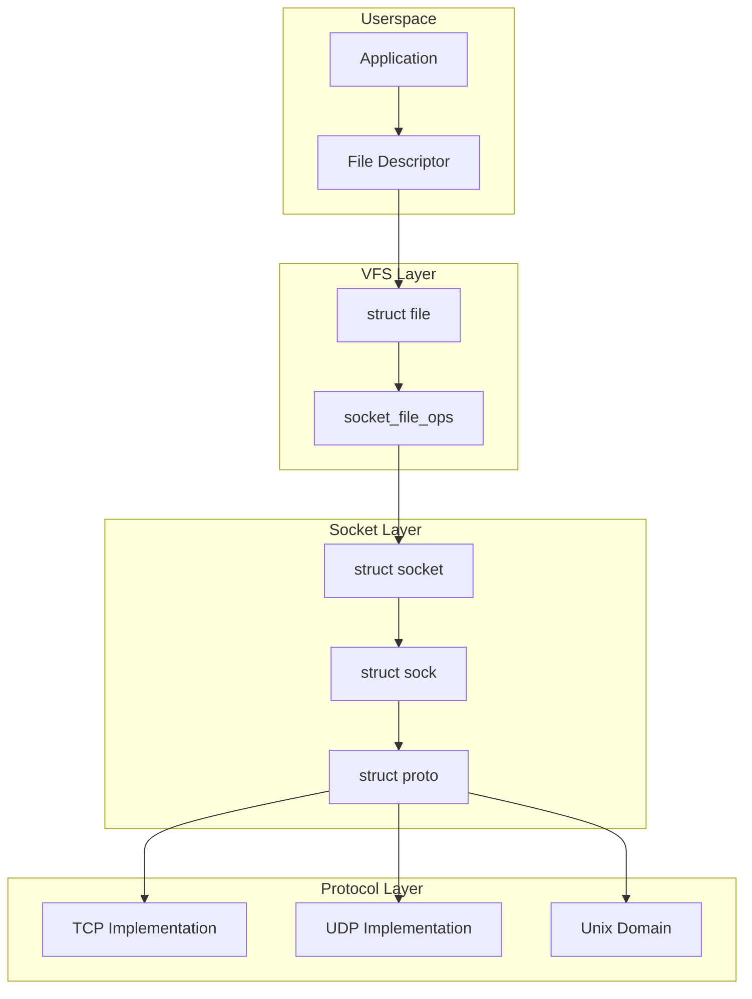
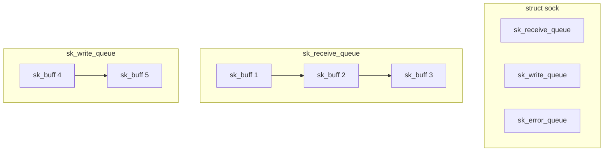
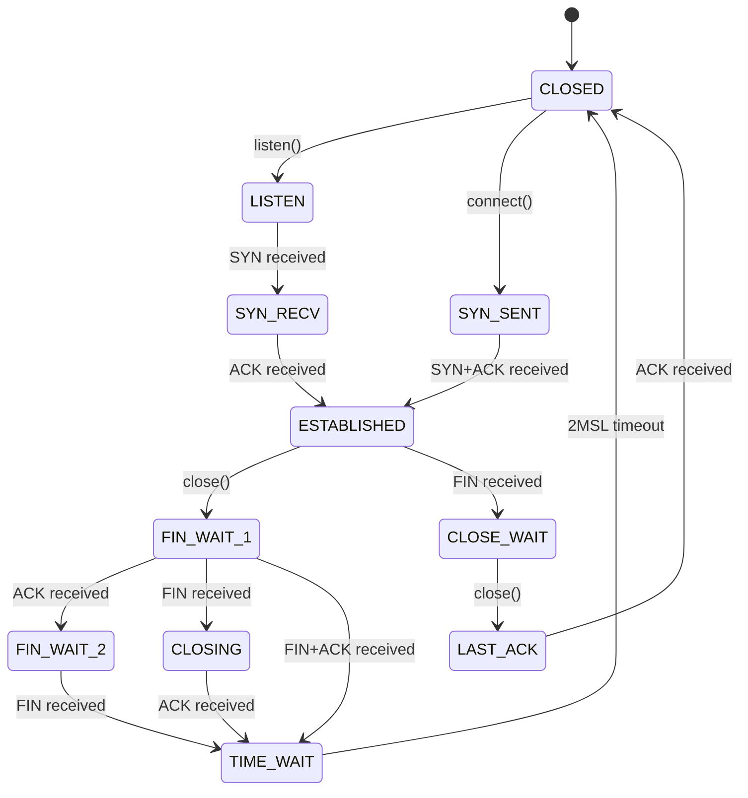

# Socket Layer

## Introduction

The socket layer is the primary interface between userspace applications and the kernel networking stack. It provides a unified API for network communication across different protocols (TCP, UDP, Unix domain sockets, etc.) and abstracts away the complexity of the underlying protocol implementations.

This chapter covers the kernel-side socket structures, protocol operations, socket buffer management, and how the socket layer bridges userspace and kernel networking.

## Socket Architecture

The socket layer sits at the top of the networking stack, providing a file descriptor-based interface to applications. Every socket is backed by a `struct socket` (the BSD socket) and a `struct sock` (the protocol-specific socket).



## Core Data Structures

### `struct socket` (BSD Socket)

The `struct socket` is the userspace-visible socket representation, defined in `include/linux/net.h`:

```c
struct socket {
    socket_state            state;       /* Socket state */

    short                   type;        /* Socket type (SOCK_STREAM, etc.) */
    unsigned long           flags;       /* Socket flags */

    struct file             *file;       /* Backing file */
    struct sock             *sk;         /* Internal networking socket */
    const struct proto_ops  *ops;        /* Protocol operations */

    struct socket_wq        wq;          /* Wait queue */
};
```

**Socket states:**

| State | Description |
|-------|-------------|
| `SS_FREE` | Socket not allocated |
| `SS_UNCONNECTED` | Not connected to anyone |
| `SS_CONNECTING` | In process of connecting |
| `SS_CONNECTED` | Connected to another socket |
| `SS_DISCONNECTING` | In process of disconnecting |

### `struct sock` (Inode Socket)

The `struct sock` is the protocol-independent socket representation used internally by the kernel. It contains all the state needed for packet processing:

```c
struct sock {
    struct sock_common      __sk_common;

    /* Protocol-specific operations */
    struct proto            *sk_prot;

    /* Socket buffers */
    struct sk_buff_head     sk_receive_queue;
    struct sk_buff_head     sk_write_queue;
    struct sk_buff_head     sk_error_queue;

    /* Memory management */
    int                     sk_rcvbuf;     /* Receive buffer size */
    int                     sk_sndbuf;     /* Send buffer size */
    atomic_t                sk_rmem_alloc; /* Receive queue bytes */
    atomic_t                sk_wmem_alloc; /* Write queue bytes */

    /* Callbacks */
    void                    (*sk_data_ready)(struct sock *sk);
    void                    (*sk_write_space)(struct sock *sk);
    void                    (*sk_error_report)(struct sock *sk);
    void                    (*sk_state_change)(struct sock *sk);

    /* Socket options */
    long                    sk_rcvtimeo;   /* Receive timeout */
    long                    sk_sndtimeo;   /* Send timeout */

    /* Security */
    struct sk_security_struct *sk_security;

    /* Destructor */
    void                    (*sk_destruct)(struct sock *sk);
};
```

### `struct sock_common`

The most frequently accessed fields are grouped in `struct sock_common` for cache-line optimization:

```c
struct sock_common {
    /* Socket identification */
    union {
        __addrpair  skc_addrpair;    /* Local + remote address */
        struct {
            __be32  skc_daddr;       /* Remote IPv4 address */
            __be32  skc_rcv_saddr;   /* Local IPv4 address */
        };
    };
    union {
        __portpair  skc_portpair;    /* Local + remote port */
        struct {
            __be16  skc_dport;       /* Remote port */
            __u16   skc_num;         /* Local port */
        };
    };

    /* Socket state */
    short               skc_state;   /* Socket state (TCP states) */

    /* Hash chain */
    struct hlist_node   skc_bind_node;
    struct hlist_node   skc_portaddr_node;

    /* Protocol family and type */
    unsigned short      skc_family;
    unsigned char       skc_state;
};
```

## Socket Creation

When an application calls `socket()`, the kernel performs several steps:

### System Call Path

```c
/* Userspace */
int sockfd = socket(AF_INET, SOCK_STREAM, 0);

/* Kernel entry point */
SYSCALL_DEFINE3(socket, int, family, int, type, int, protocol)
{
    int retval;
    struct socket *sock;
    int flags;

    /* Extract flags from type */
    flags = type & ~SOCK_TYPE_MASK;
    type &= SOCK_TYPE_MASK;

    /* Create the socket */
    retval = sock_create(family, type, protocol, &sock);
    if (retval < 0)
        return retval;

    /* Install the socket as a file descriptor */
    return sock_map_fd(sock, flags & (O_CLOEXEC | O_NONBLOCK));
}
```

### Socket Creation Internals

```c
int sock_create(int family, int type, int protocol, struct socket **res)
{
    return __sock_create(current->nsproxy->net_ns,
                         family, type, protocol, res, 0);
}

int __sock_create(struct net *net, int family, int type, int protocol,
                  struct socket **res, int kern)
{
    struct socket *sock;
    const struct net_proto_family *pf;

    /* Look up the protocol family */
    pf = rcu_dereference(net_families[family]);

    /* Allocate the socket */
    sock = sock_alloc();

    /* Set the type */
    sock->type = type;

    /* Create the protocol-specific socket */
    pf->create(net, sock, protocol, kern);

    /* Set up the file operations */
    sock->ops = pf->ops[protocol];

    *res = sock;
    return 0;
}
```

### Protocol Family Registration

Each protocol family registers itself during initialization:

```c
/* IPv4 protocol family */
static const struct net_proto_family inet_family_ops = {
    .family = PF_INET,
    .create = inet_create,
    .owner  = THIS_MODULE,
};

static int __init inet_init(void)
{
    /* Register protocol family */
    sock_register(&inet_family_ops);

    /* Register protocols */
    proto_register(&tcp_prot, 1);
    proto_register(&udp_prot, 1);

    /* Add protocol handlers */
    inet_add_protocol(&tcp_protocol, IPPROTO_TCP);
    inet_add_protocol(&udp_protocol, IPPROTO_UDP);

    return 0;
}
```

## Socket Operations (`proto_ops`)

Each socket type has a set of operations defined in `struct proto_ops`:

```c
struct proto_ops {
    int         family;
    struct module *owner;

    int         (*bind)(struct socket *sock,
                       struct sockaddr *myaddr, int sockaddr_len);
    int         (*connect)(struct socket *sock,
                          struct sockaddr *vaddr, int sockaddr_len, int flags);
    int         (*accept)(struct socket *sock, struct socket *newsock,
                         struct proto_ops *ops, bool kern);
    int         (*getname)(struct socket *sock, struct sockaddr *addr,
                          int *sockaddr_len, int peer);
    __poll_t    (*poll)(struct file *file, struct socket *sock,
                       struct poll_table_struct *wait);
    int         (*ioctl)(struct socket *sock, unsigned int cmd,
                        unsigned long arg);
    int         (*listen)(struct socket *sock, int len);
    int         (*shutdown)(struct socket *sock, int flags);
    int         (*setsockopt)(struct socket *sock, int level,
                             int optname, char __user *optval,
                             unsigned int optlen);
    int         (*getsockopt)(struct socket *sock, int level,
                             int optname, char __user *optval,
                             int __user *optlen);

    ssize_t     (*sendmsg)(struct socket *sock, struct msghdr *m,
                          size_t total_len);
    ssize_t     (*recvmsg)(struct socket *sock, struct msghdr *m,
                          size_t total_len, int flags);

    int         (*mmap)(struct file *file, struct socket *sock,
                       struct vm_area_struct *vma);
    ssize_t     (*sendpage)(struct socket *sock, struct page *page,
                           int offset, size_t size, int flags);
    ssize_t     (*splice_read)(struct socket *sock, loff_t *ppos,
                              struct pipe_inode_info *pipe, size_t len,
                              unsigned int flags);
};
```

### IPv4 Stream (TCP) Operations

```c
const struct proto_ops inet_stream_ops = {
    .family         = PF_INET,
    .owner          = THIS_MODULE,
    .bind           = inet_bind,
    .connect        = inet_stream_connect,
    .accept         = inet_accept,
    .getname        = inet_getname,
    .poll           = tcp_poll,
    .ioctl          = inet_ioctl,
    .listen         = inet_listen,
    .shutdown       = inet_shutdown,
    .setsockopt     = sock_common_setsockopt,
    .getsockopt     = sock_common_getsockopt,
    .sendmsg        = inet_sendmsg,
    .recvmsg        = inet_recvmsg,
    .mmap           = tcp_mmap,
    .sendpage       = inet_sendpage,
};
```

### IPv4 Datagram (UDP) Operations

```c
const struct proto_ops inet_dgram_ops = {
    .family         = PF_INET,
    .owner          = THIS_MODULE,
    .bind           = inet_bind,
    .connect        = inet_dgram_connect,
    .getname        = inet_getname,
    .poll           = udp_poll,
    .ioctl          = inet_ioctl,
    .shutdown       = inet_shutdown,
    .setsockopt     = sock_common_setsockopt,
    .getsockopt     = sock_common_getsockopt,
    .sendmsg        = inet_sendmsg,
    .recvmsg        = inet_recvmsg,
};
```

## Protocol Operations (`struct proto`)

The `struct proto` defines protocol-specific operations for the internal socket:

```c
struct proto {
    char            name[32];

    /* Memory management */
    int             (*init)(struct sock *sk);
    void            (*destroy)(struct sock *sk);
    void            (*shutdown)(struct sock *sk, int how);

    /* Connection management */
    int             (*connect)(struct sock *sk, struct sockaddr *uaddr,
                              int addr_len);
    int             (*disconnect)(struct sock *sk, int flags);
    int             (*accept)(struct sock *sk, struct sock *newsk,
                             int flags, bool kern);
    int             (*listen)(struct sock *sk, int len);

    /* Data transfer */
    int             (*sendmsg)(struct sock *sk, struct msghdr *msg,
                              size_t len);
    int             (*recvmsg)(struct sock *sk, struct msghdr *msg,
                              size_t len, int noblock, int flags,
                              int *addr_len);

    /* Memory management */
    int             (*forward_alloc_get)(struct sock *sk);
    void            (*enter_memory_pressure)(struct sock *sk);

    /* Backlog processing */
    void            (*backlog_rcv)(struct sock *sk, struct sk_buff *skb);

    /* Hashing */
    int             (*hash)(struct sock *sk);
    void            (*unhash)(struct sock *sk);

    /* Socket buffer allocation */
    void            (*enter_memory_pressure)(struct sock *sk);
    void            (*memory_allocated)(struct sock *sk);
};
```

### TCP Protocol Structure

```c
struct proto tcp_prot = {
    .name           = "TCP",
    .owner          = THIS_MODULE,
    .init           = tcp_v4_init_sock,
    .destroy        = tcp_v4_destroy_sock,
    .connect        = tcp_v4_connect,
    .disconnect     = tcp_disconnect,
    .accept         = inet_csk_accept,
    .listen         = inet_csk_listen,
    .sendmsg        = tcp_sendmsg,
    .recvmsg        = tcp_recvmsg,
    .backlog_rcv    = tcp_v4_do_rcv,
    .hash           = inet_hash,
    .unhash         = inet_unhash,
};
```

## Socket Buffer Management

### Socket Buffer Queues

Each socket maintains three queues for `sk_buff` management:



- **`sk_receive_queue`**: Packets ready for the application to read
- **`sk_write_queue`**: Packets waiting to be sent
- **`sk_error_queue`**: Error packets (e.g., ICMP errors)

### Buffer Size Management

The kernel manages buffer sizes to prevent memory exhaustion:

```c
/* Check if receive buffer has space */
static inline bool sk_rcvqueues_full(const struct sock *sk)
{
    /* Check against sysctl limits */
    return atomic_read(&sk->sk_rmem_alloc) > sk->sk_rcvbuf;
}

/* Allocate receive buffer memory */
static inline void sk_rmem_schedule(struct sock *sk, struct sk_buff *skb)
{
    if (!sk_rmem_schedule_check(sk, skb))
        __sk_mem_schedule(sk, skb->truesize, SK_MEM_RECV);
}
```

### Backlog Processing

When a packet arrives and the socket is locked, it's queued to the backlog:

```c
/* Add packet to backlog */
int tcp_v4_rcv(struct sk_buff *skb)
{
    struct sock *sk;

    /* Look up socket */
    sk = __inet_lookup_skb(skb);

    /* If socket is locked, queue to backlog */
    if (!sock_owned_by_user(sk)) {
        if (!tcp_prequeue(sk, skb))
            ret = tcp_v4_do_rcv(sk, skb);
    } else {
        if (tcp_add_backlog(sk, skb))
            goto discard_and_relse;
    }
}
```

## Socket State Management

### TCP Socket States

TCP sockets have well-defined states managed through a state machine:



### State Change Notifications

Applications are notified of state changes through callbacks:

```c
/* Called when socket state changes */
static void sock_def_state_change(struct sock *sk)
{
    /* Wake up any processes waiting for state change */
    wake_up_interruptible_all(sk_sleep(sk));
}

/* Called when data is ready to read */
static void sock_def_data_ready(struct sock *sk)
{
    /* Wake up processes waiting for data */
    wake_up_interruptible_sync_poll(sk_sleep(sk), POLLIN | POLLRDNORM |
                                        POLLRDBAND);
}

/* Called when write space becomes available */
static void sock_def_write_space(struct sock *sk)
{
    /* Wake up processes waiting to write */
    wake_up_interruptible_sync_poll(sk_sleep(sk), POLLOUT |
                                        POLLWRNORM | POLLWRBAND);
}
```

## Socket Options

### Setting Socket Options

```c
int sock_common_setsockopt(struct socket *sock, int level, int optname,
                           char __user *optval, unsigned int optlen)
{
    struct sock *sk = sock->sk;

    /* Handle socket-level options */
    if (level == SOL_SOCKET)
        return sock_setsockopt(sk, level, optname, optval, optlen);

    /* Delegate to protocol-specific handler */
    if (sk->sk_prot->setsockopt)
        return sk->sk_prot->setsockopt(sk, level, optname, optval, optlen);

    return -ENOPROTOOPT;
}
```

### Common Socket Options

```bash
# View socket options
$ ss -t -i
State  Recv-Q  Send-Q  Local Address:Port  Peer Address:Port
ESTAB  0       0       192.168.1.10:22     192.168.1.20:54321
    cubic wscale:7,7 rto:204 rtt:1.5/0.75 ato:40 mss:1448
    rcvmss:1448 advmss:1448 cwnd:10 ssthresh:7 bytes_sent:1234
    bytes_received:5678 segs_out:10 segs_in:15 data_segs_out:5
    data_segs_in:8 send 77.4Mbps lastsnd:100 lastrcv:50 lastack:50
```

### Example: TCP_NODELAY

```c
/* Disable Nagle's algorithm for low latency */
int flag = 1;
setsockopt(sockfd, IPPROTO_TCP, TCP_NODELAY, &flag, sizeof(flag));

/* Kernel implementation */
int tcp_setsockopt(struct sock *sk, int level, int optname,
                   char __user *optval, unsigned int optlen)
{
    if (level == IPPROTO_TCP) {
        switch (optname) {
        case TCP_NODELAY:
            if (val) {
                /* Disable Nagle's algorithm */
                tp->nonagle |= TCP_NAGLE_OFF;
            } else {
                tp->nonagle &= ~TCP_NAGLE_OFF;
            }
            break;
        }
    }
}
```

## Multiplexing with epoll

### epoll and Sockets

The `epoll` interface is the most efficient way to handle multiple sockets:

```c
/* Create epoll instance */
int epfd = epoll_create1(0);

/* Add socket to epoll */
struct epoll_event ev;
ev.events = EPOLLIN | EPOLLET;  /* Edge-triggered */
ev.data.fd = sockfd;
epoll_ctl(epfd, EPOLL_CTL_ADD, sockfd, &ev);

/* Wait for events */
struct epoll_event events[MAX_EVENTS];
int nfds = epoll_wait(epfd, events, MAX_EVENTS, -1);

for (int i = 0; i < nfds; i++) {
    if (events[i].events & EPOLLIN) {
        /* Data available for reading */
        recv(events[i].data.fd, buf, sizeof(buf), 0);
    }
}
```

### Kernel Implementation

```c
/* Socket poll implementation for TCP */
__poll_t tcp_poll(struct file *file, struct socket *sock,
                 struct poll_table_struct *wait)
{
    __poll_t mask;
    struct sock *sk = sock->sk;
    const struct tcp_sock *tp = tcp_sk(sk);

    sock_poll_wait(file, sock, wait);

    mask = 0;

    /* Check for readable data */
    if (tcp_stream_is_readable(sk, target))
        mask |= EPOLLIN | EPOLLRDNORM;

    /* Check for writable space */
    if (sk_stream_is_writeable(sk))
        mask |= EPOLLOUT | EPOLLWRNORM;

    /* Check for errors */
    if (sk->sk_err)
        mask |= EPOLLERR;

    /* Check for hangup */
    if (sk->sk_shutdown & RCV_SHUTDOWN)
        mask |= EPOLLRDHUP | EPOLLIN | EPOLLRDNORM;

    return mask;
}
```

## Socket Memory Management

### Per-Socket Memory Accounting

```mermaid
graph TB
    subgraph "Socket Memory"
        RMEM[sk_rmem_alloc]
        WMEM[sk_wmem_alloc]
        RBUF[sk_rcvbuf]
        WBUF[sk_sndbuf]
    end

    subgraph "System Limits"
        MAXMEM[net.core.rmem_max]
        SYSMEM[/proc/sys/net/core/rmem_default]
    end

    RMEM -->|Exceeds| RBUF
    RBUF -->|Capped by| MAXMEM
    MAXMEM --> SYSMEM
```

### Memory Pressure Handling

```bash
# Check memory pressure status
$ cat /proc/net/sockstat
sockets: used 1234
TCP: inuse 56 orphan 0 tw 10 alloc 60 mem 120
UDP: inuse 12 mem 24
UDPLITE: inuse 0
RAW: inuse 0
FRAG: inuse 0 memory 0

# Configure memory limits
$ sysctl net.core.rmem_max=16777216
$ sysctl net.ipv4.tcp_mem="786432 1048576 1572864"
$ sysctl net.ipv4.tcp_rmem="4096 87380 16777216"
$ sysctl net.ipv4.tcp_wmem="4096 65536 16777216"
```

## Socket Diagnostics

### ss Command

The `ss` (socket statistics) command provides detailed socket information:

```bash
# Show all TCP sockets with detailed info
$ ss -t -i -n
State    Recv-Q  Send-Q  Local Address:Port   Peer Address:Port
LISTEN   0       128     0.0.0.0:22           0.0.0.0:*
    cubic cwnd:10
ESTAB    0       0       192.168.1.10:22      192.168.1.20:54321
    cubic wscale:7,7 rto:200.5 rtt:0.5/0.25 ato:40 mss:1448
    cwnd:10 ssthresh:7 bytes_sent:12345 bytes_received:67890
    segs_out:100 segs_in:150 data_segs_out:50 data_segs_in:75

# Show socket memory usage
$ ss -t -m
State    Recv-Q  Send-Q  Local Address:Port   Peer Address:Port
ESTAB    0       0       192.168.1.10:22      192.168.1.20:54321
    skmem:(r0,rb374400,t0,tb46080,f0,w0,o0,bl0,d0)

# Show socket timers
$ ss -t -o
State    Recv-Q  Send-Q  Local Address:Port   Peer Address:Port
ESTAB    0       0       192.168.1.10:22      192.168.1.20:54321
    timer:(keepalive,119min,0)
```

### /proc/net Files

```bash
# TCP socket information
$ cat /proc/net/tcp
  sl  local_address rem_address   st tx_queue rx_queue ...
   0: 00000000:0016 00000000:0000 0A 00000000:00000000 ...
   1: 0100A8C0:0016 1400A8C0:D431 01 00000000:00000000 ...

# UDP socket information
$ cat /proc/net/udp
  sl  local_address rem_address   st tx_queue rx_queue ...
   0: 00000000:0035 00000000:0000 07 00000000:00000000 ...

# Unix domain sockets
$ cat /proc/net/unix
Num RefCount Protocol Flags Type St Inode Path
  0: 00000002 00000000 00010000 0001 01 12345 /var/run/docker.sock
```

### BPF-based Socket Tracing

```c
/* Trace socket connect() calls */
SEC("tracepoint/syscalls/sys_enter_connect")
int trace_connect(struct trace_event_raw_sys_enter *ctx)
{
    struct sockaddr_in *addr = (struct sockaddr_in *)ctx->args[1];
    __u16 port = 0;

    bpf_probe_read(&port, sizeof(port), &addr->sin_port);
    port = __builtin_bswap16(port);

    bpf_printk("connect to port %d", port);
    return 0;
}
```

## Zero-Copy Networking

### MSG_ZEROCOPY

For high-throughput applications, `MSG_ZEROCOPY` avoids copying data from userspace to kernel:

```c
/* Enable zero-copy on socket */
int val = 1;
setsockopt(fd, SOL_SOCKET, SO_ZEROCOPY, &val, sizeof(val));

/* Send with zero-copy */
sendmsg(fd, &msg, MSG_ZEROCOPY);

/* Wait for completion notification */
struct msghdr cmsg;
recvmsg(fd, &cmsg, MSG_ERRQUEUE);
```

### io_uring for Sockets

```c
/* io_uring socket operations */
struct io_uring_sqe *sqe = io_uring_get_sqe(&ring);
io_uring_prep_recv(sqe, sockfd, buf, len, 0);
io_uring_submit(&ring);

struct io_uring_cqe *cqe;
io_uring_wait_cqe(&ring, &cqe);
int bytes = cqe->res;
io_uring_cqe_seen(&ring, cqe);
```

## Unix Domain Sockets

Unix domain sockets provide efficient IPC on the same machine:

```c
/* Unix domain socket address */
struct sockaddr_un {
    sa_family_t sun_family;     /* AF_UNIX */
    char sun_path[108];         /* Pathname */
};

/* Create Unix domain socket */
int fd = socket(AF_UNIX, SOCK_STREAM, 0);
struct sockaddr_un addr;
addr.sun_family = AF_UNIX;
strcpy(addr.sun_path, "/tmp/mysocket");
bind(fd, (struct sockaddr *)&addr, sizeof(addr));
```

### Abstract Namespace

```c
/* Abstract socket (no filesystem path) */
struct sockaddr_un addr;
addr.sun_family = AF_UNIX;
addr.sun_path[0] = '\0';  /* Abstract namespace */
strcpy(addr.sun_path + 1, "mysocket");
```

## References

- [The Linux Kernel Documentation](https://docs.kernel.org/)
- [LWN.net - Linux and free software news](https://lwn.net/)
- [GNU Project Documentation](https://www.gnu.org/doc/doc.html)
- [GNU Manuals](https://www.gnu.org/manual/manual.html)
- [Free Software Directory](https://directory.fsf.org/wiki/Main_Page)
- [Planet GNU](https://planet.gnu.org/)
- [Free Software Books](https://www.gnu.org/doc/other-free-books.html)

1. **Linux Kernel Source** — `net/socket.c`, `include/linux/net.h`, `include/net/sock.h`
2. *Unix Network Programming, Volume 1* by W. Richard Stevens
3. *The Linux Programming Interface* by Michael Kerrisk
4. **man pages** — `socket(2)`, `bind(2)`, `listen(2)`, `accept(2)`, `connect(2)`
5. **kernel.org Documentation** — [www.kernel.org/doc/html/latest/networking/](https://www.kernel.org/doc/html/latest/networking/)

## Related Topics

- [Kernel Networking Overview](overview.md) — How the networking stack is organized
- [TCP/IP Implementation](tcpip.md) — TCP/IP protocol implementation details
- [Netfilter](netfilter.md) — Packet filtering and mangling
- [eBPF for Networking](ebpf.md) — Programmable networking with eBPF
- [Network Fundamentals](../networking/fundamentals.md) — OSI model and network basics
- [TCP/IP Suite](../networking/tcpip-suite.md) — TCP/IP protocol details
