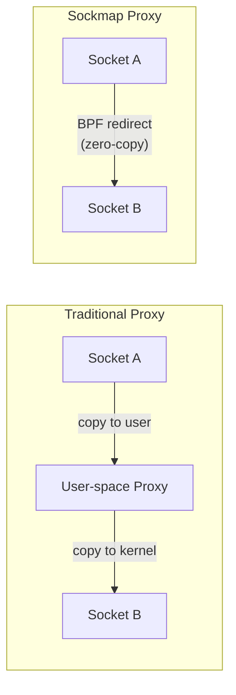
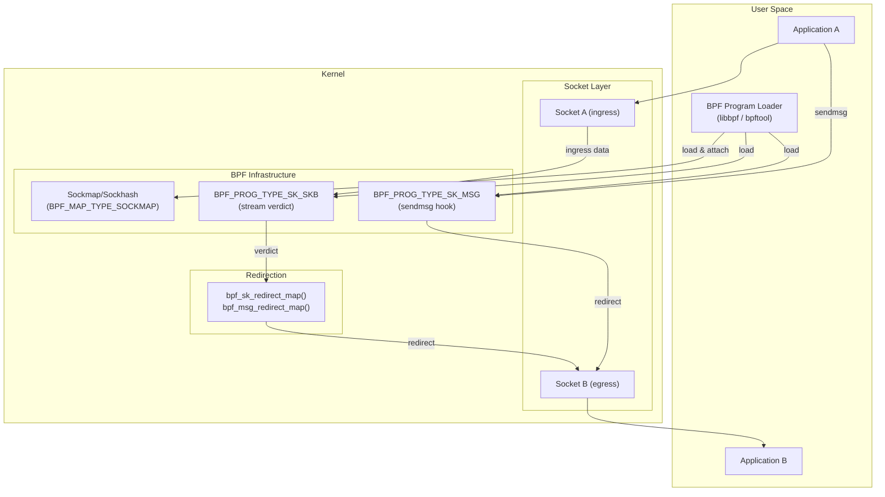
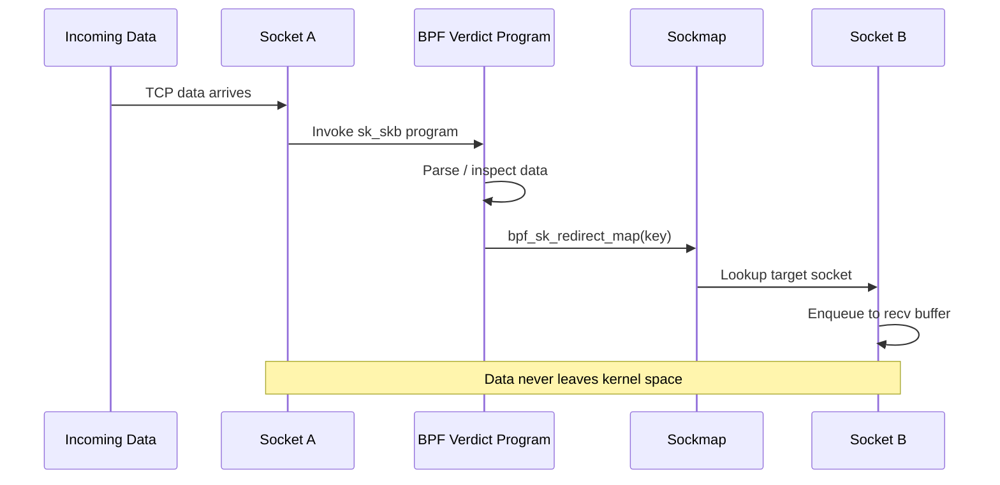
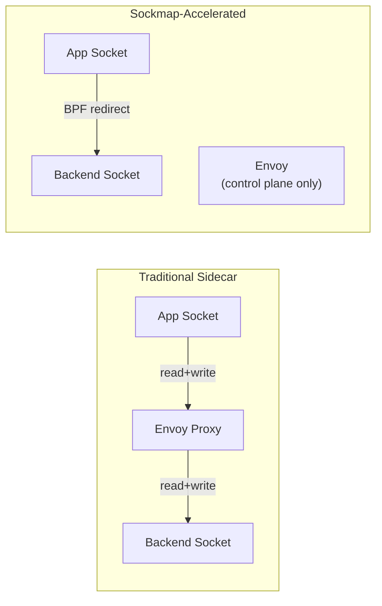
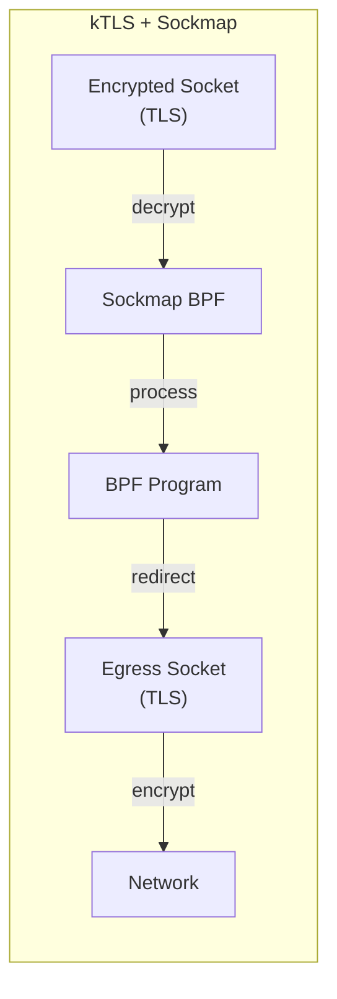

# Sockmap

Sockmap is a BPF-based mechanism that redirects packets between sockets
**inside the kernel**, bypassing the normal networking stack entirely.  It
enables high-performance socket-to-socket forwarding, load balancing, and
protocol parsing without copying data to user space.

---

## 1. Motivation

Consider a proxy: bytes arrive on one socket, the proxy reads them,
processes them, and writes them to another socket.  This involves two
copies (kernel→user, user→kernel), two system calls, and context switches.
Sockmap eliminates this by letting BPF programs redirect sk_buff or sk_msg
between sockets while the data remains entirely in kernel space.



---

## 2. Architecture



### 2.1 Components

| Component | Role |
|---|---|
| **Sockmap** | `BPF_MAP_TYPE_SOCKMAP` — stores socket references (array-indexed) |
| **Sockhash** | `BPF_MAP_TYPE_SOCKHASH` — stores socket references (hash-indexed) |
| **Stream verdict** | `BPF_PROG_TYPE_SK_SKB` attached to sockmap |
| **sk_msg** | `BPF_PROG_TYPE_SK_MSG` for sendmsg hooks |
| **`bpf_sk_redirect_map()`** | Helper to redirect to a sockmap entry |
| **`bpf_msg_redirect_map()`** | Helper for sk_msg redirection |

### 2.2 Sockmap vs Sockhash

| Feature | Sockmap | Sockhash |
|---|---|---|
| Key type | `int` (array index) | Arbitrary (hash) |
| Lookup | O(1) direct index | O(1) hash lookup |
| Max entries | Typically 65535 | Typically 65535 |
| Use case | Fixed number of sockets | Dynamic socket sets |
| Key space | Sequential integers | Any 4/8/16 byte key |

---

## 3. Creating and Using a Sockmap

### 3.1 Create the Map

```c
/* C with libbpf */
struct {
    __uint(type, BPF_MAP_TYPE_SOCKMAP);
    __uint(max_entries, 64);
    __type(key, int);
    __type(value, int);
} sock_map SEC(".maps");
```

Or using `bpf_create_map()` directly:

```c
int sock_map = bpf_create_map(BPF_MAP_TYPE_SOCKMAP,
                              sizeof(int),   /* key */
                              sizeof(int),   /* value (fd placeholder) */
                              64,            /* max entries */
                              0);
```

### 3.2 Insert Sockets

```c
int key = 0;
int fd  = accept(server_fd, ...);
bpf_map_update_elem(sock_map, &key, &fd, BPF_ANY);
```

### 3.3 Attach a BPF Program

The program type determines the hook point:

| Type | Hook | Use Case |
|---|---|---|
| `BPF_PROG_TYPE_SK_SKB` | `BPF_SK_SKB_STREAM_VERDICT` | TCP stream parsing |
| `BPF_PROG_TYPE_SK_SKB` | `BPF_SK_SKB_VERDICT` | UDP per-packet verdict |
| `BPF_PROG_TYPE_SK_MSG` | `BPF_SK_MSG_VERDICT` | sendmsg/sendpage hook |

```c
bpf_prog_attach(prog_fd, sock_map,
                BPF_SK_SKB_STREAM_VERDICT, 0);
```

---

## 4. `BPF_SK_SKB_STREAM_VERDICT`

This is the most common sockmap program type.  It is invoked for every
chunk of data received on a socket that is in the sockmap.

### 4.1 Program Signature

```c
SEC("sk_skb/stream_verdict")
int bpf_prog(struct __sk_buff *skb)
{
    int key = 0;
    return bpf_sk_redirect_map(skb, &sock_map, key, 0);
}
```

### 4.2 Return Values

| Return | Meaning |
|---|---|
| `SK_PASS` | Deliver data to the socket's recv queue normally |
| `SK_DROP` | Drop the data |
| `bpf_sk_redirect_map()` | Redirect to another socket in the map |

### 4.3 Parsing Example

A BPF program can parse a protocol header, extract a routing key, and
redirect:

```c
SEC("sk_skb/stream_verdict")
int verdict(struct __sk_buff *skb)
{
    struct proto_hdr *hdr;

    if (skb->len < sizeof(*hdr))
        return SK_DROP;

    hdr = (void *)(long)skb->data;
    int key = hdr->stream_id % 64;

    return bpf_sk_redirect_map(skb, &sock_map, key, 0);
}
```

### 4.4 Full TCP Proxy Example

```c
// sockmap_proxy.c — BPF program
#include <linux/bpf.h>
#include <bpf/bpf_helpers.h>
#include <bpf/bpf_endian.h>

struct {
    __uint(type, BPF_MAP_TYPE_SOCKMAP);
    __uint(max_entries, 2);
    __type(key, int);
    __type(value, int);
} proxy_map SEC(".maps");

/* Redirect all incoming data to the other socket */
SEC("sk_skb/stream_verdict")
int bpf_proxy_verdict(struct __sk_buff *skb)
{
    int key;

    /* Simple ping-pong: socket 0 → socket 1, and vice versa */
    if (skb->sk) {
        /* Determine which socket this data came from */
        /* Use cb[0] or skb->sk to identify */
        key = 1; /* Default: redirect to socket 1 */
    }

    return bpf_sk_redirect_map(skb, &proxy_map, key, 0);
}

char _license[] SEC("license") = "GPL";
```

---

## 5. sk_msg

`BPF_PROG_TYPE_SK_MSG` hooks into the `sendmsg()` and `sendfile()` paths.
Instead of intercepting received data, it intercepts data being sent.

### 5.1 Key Differences from sk_skb

| Feature | sk_skb | sk_msg |
|---|---|---|
| Hook | recv path | send path |
| Data | `struct __sk_buff` | `struct sk_msg_md` |
| Helper | `bpf_sk_redirect_map` | `bpf_msg_redirect_map` |
| Chunking | Stream segments | Full messages |
| Use case | Protocol routing | Send-side filtering/routing |
| Context | softirq | syscall |

### 5.2 `sk_msg_md` Structure

```c
struct sk_msg_md {
    __u32 family;       /* AF_INET or AF_INET6 */
    __u32 remote_ip4;   /* Remote IPv4 address */
    __u32 local_ip4;    /* Local IPv4 address */
    __u32 remote_ip6[4];/* Remote IPv6 address */
    __u32 local_ip6[4]; /* Local IPv6 address */
    __u32 remote_port;  /* Remote port */
    __u32 local_port;   /* Local port */
    __u32 size;         /* Message size */
    __u32 sk;           /* Socket pointer (for sk_lookup) */
};
```

### 5.3 Example

```c
SEC("sk_msg")
int bpf_msg_verdict(struct sk_msg_md *msg)
{
    /* Drop messages larger than 4K */
    if (msg->size > 4096)
        return SK_DROP;

    /* Redirect small messages to socket 1 */
    int key = 1;
    return bpf_msg_redirect_map(msg, &sock_map, key, BPF_F_INGRESS);
}
```

---

## 6. Socket Redirection Internals

### 6.1 `bpf_sk_redirect_map()`

```c
u64 bpf_sk_redirect_map(struct __sk_buff *skb,
                        void *map, u32 key, u64 flags);
```

This stores the target socket in `skb->redir_index` and returns
`SK_REDIRECT`.  The kernel then calls `__sock_map_redirect()` which:

1. Looks up the target socket in the map.
2. Calls the target socket's `sk_prot->recvmsg` or enqueues to the receive
   buffer directly.
3. The data never passes through the TCP/IP stack.

### 6.2 Internal Kernel Flow



### 6.3 Performance

Sockmap redirection avoids:

* Routing table lookups
* Netfilter hooks
* Socket buffer allocation for the network path
* Context switches (no syscall on the receive side)

Throughput improvements of **2-5×** are typical for proxy workloads compared
to a user-space proxy on the same machine.

| Scenario | User-space Proxy | Sockmap Proxy | Speedup |
|----------|-----------------|---------------|---------|
| TCP echo (1B) | 500K req/s | 1.2M req/s | 2.4× |
| TCP stream (64K) | 8 GB/s | 20 GB/s | 2.5× |
| Latency (p99) | 120 µs | 45 µs | 2.7× |

---

## 7. `apply_bytes` and `cork`ing

For stream protocols, the BPF program may want to buffer data until a full
message is available:

### 7.1 `bpf_msg_apply_bytes()`

```c
bpf_msg_apply_bytes(msg, bytes_consumed);
```

Tells the kernel "I've processed `bytes_consumed` bytes of this message;
only invoke me again for the remainder."

### 7.2 `bpf_msg_cork_bytes()`

```c
bpf_msg_cork_bytes(msg, required_size);
```

Buffers data in the kernel until at least `required_size` bytes are
available, then invokes the BPF program once.  Essential for protocol
parsing (e.g., HTTP headers).

### 7.3 Example: HTTP Header Parsing

```c
SEC("sk_msg")
int bpf_http_parse(struct sk_msg_md *msg)
{
    char *data = (char *)msg;

    /* Cork until we have at least 1024 bytes */
    if (msg->size < 1024) {
        bpf_msg_cork_bytes(msg, 1024);
        return SK_PASS;
    }

    /* Parse HTTP headers */
    if (data[0] == 'G' && data[1] == 'E' && data[2] == 'T') {
        /* GET request — redirect to backend */
        int key = 0;
        bpf_msg_apply_bytes(msg, msg->size);
        return bpf_msg_redirect_map(msg, &backend_map, key, 0);
    }

    /* Unknown — drop */
    bpf_msg_apply_bytes(msg, msg->size);
    return SK_DROP;
}
```

---

## 8. Sockmap vs. Other BPF Mechanisms

| Mechanism | Where | What |
|---|---|---|
| **Sockmap** | Socket layer | Redirect between sockets |
| **TC (cls_bpf)** | Network device | Redirect between interfaces |
| **XDP** | Driver level | Drop/redirect before skb |
| **Socket filter** | Socket layer | Filter/modify per-packet |
| **cgroup/connect4** | cgroup | Intercept connect() calls |
| **flow_dissector** | Core networking | Parse packet headers |

Sockmap operates **above** the TCP/IP stack.  TC and XDP operate **below**
it.  Sockmap is the right choice when the goal is to route data between
sockets on the same host.

---

## 9. Use Cases

### 9.1 Layer-7 Load Balancer

Parse HTTP/1.1 or gRPC headers in BPF, extract the path or service name,
and redirect to the appropriate backend socket.

### 9.2 Service Mesh Sidecar Acceleration

Envoy sidecars spend most of their time copying data between two sockets.
Sockmap can redirect directly, cutting latency by 30-50%.



### 9.3 Multi-stream Multiplexing

A single TCP connection carries multiple logical streams (like HTTP/2).
BPF demuxes the stream ID and redirects each stream to its own socket for
parallel processing.

### 9.4 Kernel TLS (kTLS) Offload

Sockmap integrates with kTLS.  Data can be redirected after TLS decryption,
processed by BPF, and re-encrypted on the egress socket — all without
touching user space.



---

## 10. bpftool and Debugging

### 10.1 Creating Sockmap with bpftool

```bash
# Create a sockmap
bpftool map create /sys/fs/bpf/proxy_map \
    type sockmap \
    key 4 \
    value 4 \
    entries 64

# Load and attach BPF program
bpftool prog load sockmap_prog.o /sys/fs/bpf/prog
bpftool prog attach pinned /sys/fs/bpf/prog \
    stream_verdict pinned /sys/fs/bpf/proxy_map

# Show maps
bpftool map show

# Dump sockmap entries
bpftool map dump pinned /sys/fs/bpf/proxy_map
```

### 10.2 Inspecting Sockmap State

```bash
# List all BPF maps
bpftool map list

# Show specific map details
bpftool map show id <map_id>

# Dump map contents (shows socket inodes)
bpftool map dump id <map_id>

# Show attached programs
bpftool map show id <map_id> | grep -i "attached"
```

### 10.3 Tracing Sockmap Activity

```bash
# Trace BPF program invocations
sudo cat /sys/kernel/debug/tracing/trace_pipe

# Use bpftrace to monitor sockmap redirects
bpftrace -e '
kprobe:__sock_map_redirect {
    printf("sockmap redirect: %s\n", comm);
}
'

# Monitor with perf
sudo perf trace -e 'bpf:*' -a sleep 5
```

---

## 11. Error Handling and Edge Cases

### Socket State Transitions

Sockmap requires sockets to be in a connected state. Inserting a socket that is still listening or has been closed will fail:

```c
int ret = bpf_map_update_elem(sock_map, &key, &fd, BPF_ANY);
if (ret < 0) {
    /* Common errors:
     * -EINVAL: socket not in valid state
     * -EOPNOTSUPP: socket type not supported
     * -ENOMEM: map full
     */
}
```

### Handling Socket Closure

When a socket in a sockmap is closed, the kernel automatically removes it from the map. The BPF program does not need to handle this explicitly, but the application should handle the resulting errors:

```c
/* Application side: detect when peer closes */
int n = recv(fd, buf, sizeof(buf), 0);
if (n <= 0) {
    /* Socket closed or error
     * The kernel already removed it from the sockmap */
    close(fd);
}
```

### Race Conditions

Sockmap operations are subject to standard concurrency concerns:

* **Map update vs. redirect**: A socket removed from the map while a redirect is in flight will cause the redirect to fail gracefully (data is dropped).
* **Multiple programs**: Only one verdict program can be attached to a sockmap at a time. Attaching a new one replaces the old one.
* **Socket migration**: If a socket is moved between sockmaps, there is a brief window where redirects may target the old map.

### BPF Program Error Paths

```c
SEC("sk_skb/stream_verdict")
int verdict(struct __sk_buff *skb)
{
    /* Always handle malformed packets */
    if (skb->len < sizeof(struct proto_hdr))
        return SK_DROP;

    /* Validate key before redirect */
    int key = get_stream_key(skb);
    if (key < 0 || key >= MAX_STREAMS)
        return SK_DROP;

    /* Check if target socket exists */
    void *target = bpf_map_lookup_elem(&sock_map, &key);
    if (!target)
        return SK_PASS;  /* Fall back to normal delivery */

    return bpf_sk_redirect_map(skb, &sock_map, key, 0);
}
```

## 12. Sockmap with SO_REUSEPORT

Sockmap can work with `SO_REUSEPORT` sockets, enabling multi-threaded server architectures where each thread has its own socket:

```c
/* Server: create reuseport sockets */
int opt = 1;
setsockopt(server_fd, SOL_SOCKET, SO_REUSEPORT, &opt, sizeof(opt));

/* Each worker thread accepts on the same port */
for (int i = 0; i < num_workers; i++) {
    int fd = socket(AF_INET, SOCK_STREAM, 0);
    setsockopt(fd, SOL_SOCKET, SO_REUSEPORT, &opt, sizeof(opt));
    bind(fd, ...);
    listen(fd, 128);

    /* Insert accepted sockets into per-worker sockmap */
    int key = i;
    bpf_map_update_elem(worker_map[i], &key, &accepted_fd, BPF_ANY);
}
```

With sockmap, the BPF program can distribute incoming connections across workers based on custom logic (e.g., consistent hashing of source IP).

## 13. Multi-Map Architectures

Complex applications may use multiple sockmaps for different traffic flows:

```
Incoming TCP ──→ Sockmap A (ingress verdict) ──→ Backend Pool 1
                └──→ Sockmap B (ingress verdict) ──→ Backend Pool 2

Backend Response ──→ Sockmap C (egress verdict) ──→ Client Socket
```

```c
/* BPF program routing to different maps based on port */
SEC("sk_skb/stream_verdict")
int multi_pool_verdict(struct __sk_buff *skb)
{
    struct iphdr *ip = (void *)(long)skb->data;
    struct tcphdr *tcp = (void *)(ip + 1);

    __u16 dport = bpf_ntohs(tcp->dest);

    if (dport == 80) {
        int key = 0;
        return bpf_sk_redirect_map(skb, &http_map, key, 0);
    } else if (dport == 443) {
        int key = 0;
        return bpf_sk_redirect_map(skb, &https_map, key, 0);
    }

    return SK_PASS;
}
```

## 14. Performance Tuning

### Socket Buffer Sizes

Sockmap bypasses the normal networking stack, but socket buffer sizes still matter:

```bash
# Increase socket buffer sizes for high-throughput sockmap
sysctl -w net.core.rmem_max=16777216
sysctl -w net.core.wmem_max=16777216
sysctl -w net.ipv4.tcp_rmem="4096 131072 16777216"
sysctl -w net.ipv4.tcp_wmem="4096 131072 16777216"
```

### BPF Program Optimization

Keep verdict programs short to minimize softirq latency:

* Avoid loops (use `bpf_loop()` for bounded iteration)
* Minimize map lookups (cache results in `skb->cb[]`)
* Use `bpf_msg_apply_bytes()` to avoid re-invocation for partial messages
* Prefer sockhash over sockmap for dynamic socket sets (avoids linear scan)

### Benchmarking

```bash
# Use perf to measure sockmap overhead
sudo perf record -g -e 'bpf:bpf_prog_run' -- sleep 10
sudo perf report

# Measure redirect throughput
# Install sockmap benchmark from kernel samples
make -C tools/testing/selftests/bpf
./tools/testing/selftests/bpf/test_sockmap
```

## 15. Kernel Version History

| Kernel | Feature |
|--------|--------|
| 4.18   | Initial sockmap support (TCP only) |
| 5.0    | sk_msg support, sendmsg hook |
| 5.3    | Sockhash map type |
| 5.6    | IPv6 sk_msg metadata |
| 5.10   | UDP sockmap (experimental) |
| 5.15   | Sockmap + kTLS improvements |
| 6.0    | Multi-prog attachment |
| 6.4    | Sockmap performance optimizations |
| 6.8    | Sockmap + SO_REUSEPORT improvements |

## 16. Limitations

* Only works with **connected** sockets (TCP, Unix stream).  UDP support is
  limited and experimental.
* The BPF program runs in the **softirq** context for sk_skb and in the
  **syscall** context for sk_msg.  Heavy processing may cause latency spikes.
* `SOCKMAP` entries use integer keys; `SOCKHASH` is needed for hash-based
  lookups.
* Maximum map size is typically 65535 entries.
* Not all socket types support all operations (e.g., `splice()` through
  sockmap has quirks).
* TLS offload requires kTLS to be configured on both sockets.
* IPv6 support requires kernel 5.6+ for full sk_msg metadata.
* Sockmap redirects are per-CPU — no cross-CPU redirection without extra work.
* Data redirected via sockmap does not pass through netfilter, so firewall
  rules are not applied.

## 17. Kernel Source Structure

```
net/core/sock_map.c          # Core sockmap/sockhash implementation
net/core/filter.c             # BPF helper functions (redirect, etc.)
include/linux/bpf_types.h    # BPF map type definitions
include/uapi/linux/bpf.h     # User-space API (map types, helpers)
net/core/skbuff.c             # sk_buff management for redirects
net/ipv4/tcp.c                # TCP socket integration with sockmap
net/unix/af_unix.c            # Unix socket sockmap support
```

Key functions:

```c
/* net/core/sock_map.c */
int sock_map_update_elem(struct bpf_map *map, void *key,
                         void *value, u64 flags);
int sock_hash_update_elem(struct bpf_map *map, void *key,
                          void *value, u64 flags);
int sock_map_bpf_prog_attach(/* ... */);

/* Redirect path */
int __sock_map_redirect(struct sk_buff *skb, struct bpf_map *map);
int sock_map_redirect(struct sk_buff *skb, struct bpf_map *map, u32 key);
```

## 18. Further Reading

* **LWN: [BPF and Sockmap](https://lwn.net/Articles/731133/)**
* **LWN: [Socket redirection with BPF](https://lwn.net/Articles/776717/)**
* **Documentation: `Documentation/networking/sockmap.rst`**
* **Brendan Gregg's BPF sockmap examples**
* **John Fastabend's sockmap talks (Netdev 0x12, LPC 2018)**
* **Source: `net/core/sock_map.c`**
* **[SRECon23 Sockmap slides](https://www.usenix.org/system/files/srecon23emea-slides_sitnicki.pdf)**
* **[BPF Networking (TC, cgroup, sockmap)](https://kernel-internals.org/bpf/bpf-networking/)**

---

## Cross-References

* [BPF Overview](../bpf/index.md) — BPF program types and helpers
* [XDP](./xdp.md) — lower-level packet processing
* [kTLS](./ktls.md) — kernel TLS integration
* [Socket Layer](./sockets.md) — the socket subsystem
* [TC and cls_bpf](./tc.md) — traffic control BPF
* [cgroups](../containers/cgroups-v2.md) — cgroup BPF programs
* [tcpip-suite](../../networking/tcpip-suite.md) — TCP/IP protocol suite overview
* [vpn](../../networking/vpn.md) — VPN technologies and tunneling
