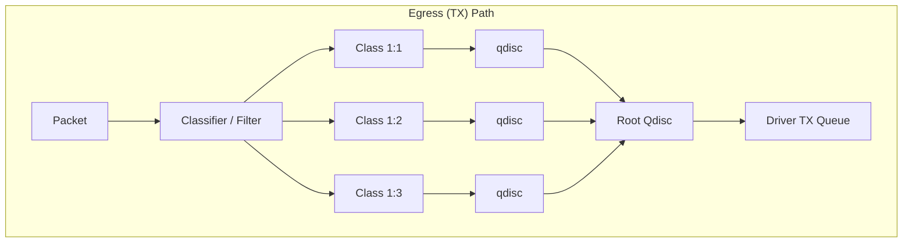
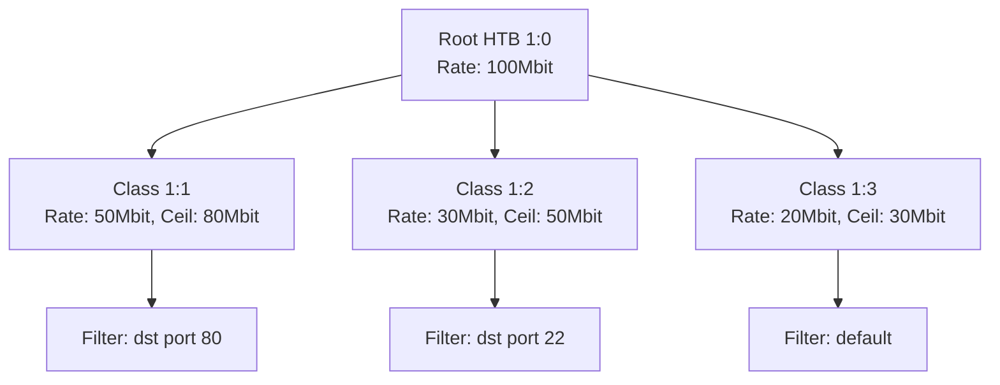
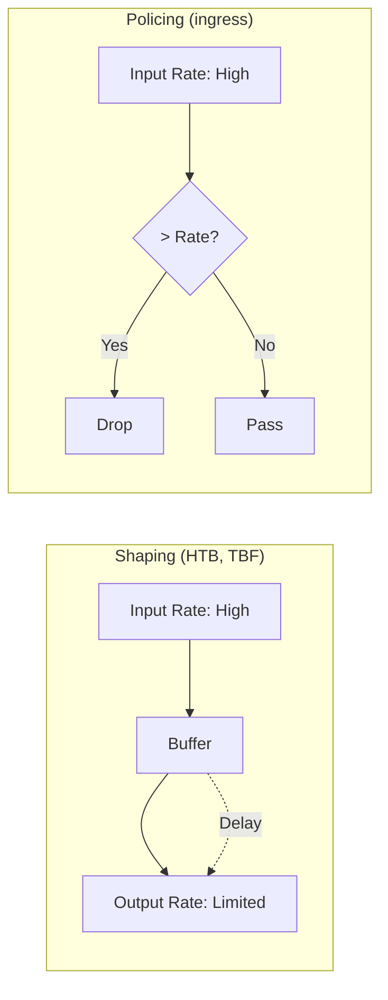

# Traffic Control (tc)

## Introduction

Traffic Control (tc) is the Linux kernel's framework for controlling how packets are queued, scheduled, shaped, and policed on network interfaces. It implements Quality of Service (QoS) capabilities that allow administrators to prioritize traffic, limit bandwidth, and manage congestion. The tc subsystem is implemented in `net/sched/` and is configured via the `tc` command (part of iproute2).

Understanding tc requires grasping three concepts: **qdiscs** (queueing disciplines) manage the queue of packets waiting to be transmitted; **classes** subdivide bandwidth within a qdisc; **filters** classify packets into classes.

## TC Architecture



## Core Concepts

### Qdisc (Queueing Discipline)

A qdisc is the Linux kernel's packet scheduler. Every network interface has at least one qdisc — the root qdisc. By default, it's `pfifo_fast` (or `fq_codel` on modern kernels).

| Qdisc | Type | Description |
|-------|------|-------------|
| `pfifo_fast` | Classless | Default, 3-band priority FIFO |
| `fq_codel` | Classless | Fair Queuing with Controlled Delay |
| `htb` | Classful | Hierarchical Token Bucket |
| `tbf` | Classless | Token Bucket Filter |
| `sfq` | Classless | Stochastic Fairness Queuing |
| `red` | Classless | Random Early Detection |
| `prio` | Classful | Priority banding |
| `ingress` | Special | Ingress policing |
| `noqueue` | Special | No queueing (virtual devices) |
| `blackhole` | Special | Silently drop all packets |

### Class

Classes exist only within classful qdiscs. They represent subdivisions of bandwidth. For example, in HTB, you can have a parent class with a total bandwidth limit and child classes that share it.

### Filter (Classifier)

Filters determine which packets go to which class. They use various criteria: IP address, port, protocol, DSCP/ToS, firewall marks, etc.

| Filter | Description |
|--------|-------------|
| `u32` | Match on arbitrary packet bytes |
| `fw` | Match on firewall (iptables) marks |
| `basic` | Match using BPF expressions |
| `flower` | Match on multiple fields (modern) |
| `matchall` | Match all packets |
| `route` | Match on routing information |

## Basic Commands

### Viewing Current Configuration

```bash
# Show qdisc configuration
tc qdisc show dev eth0
# qdisc fq_codel 0: root refcnt 2 limit 10240p flows 1024 quantum 1514 target 5.0ms interval 100.0ms memory_limit 32Mb ecn

# Show classes
tc class show dev eth0

# Show filters
tc filter show dev eth0

# Show all at once
tc -s qdisc show dev eth0
# qdisc fq_codel 0: root refcnt 2 limit 10240p flows 1024 quantum 1514
#  Sent 123456789 bytes 987654 pkt (dropped 0, overlimits 0 requeues 0)
#  backlog 0b 0p requeues 0
#  maxpacket 1514 drop_overlimit 0 new_flow_count 12345 ecn_mark 0
#  new_flows_len 0 old_flows_len 0

# Show ingress qdisc
tc qdisc show dev eth0 ingress
```

## Classless Qdiscs

### Token Bucket Filter (TBF)

TBF limits outgoing traffic to a specified rate with a burst tolerance:

```bash
# Limit eth0 to 10 Mbit/s with 256KB burst
tc qdisc add dev eth0 root tbf rate 10mbit burst 256kbit latency 400ms

# Verify
tc -s qdisc show dev eth0
# qdisc tbf 8001: root refcnt 2 rate 10Mbit burst 256Kb lat 400ms
#  Sent 5678 bytes 42 pkt (dropped 0, overlimits 0)

# Remove
tc qdisc del dev eth0 root

# Replace existing qdisc
tc qdisc replace dev eth0 root tbf rate 5mbit burst 128kbit latency 300ms
```

### Stochastic Fairness Queuing (SFQ)

SFQ ensures fair bandwidth sharing among flows:

```bash
# SFQ with 10 second perturbation
tc qdisc add dev eth0 root sfq perturb 10

# With flow hashing
tc qdisc add dev eth0 root sfq perturb 10 quantum 1514
```

### Random Early Detection (RED)

RED proactively drops packets before the queue overflows, preventing TCP global synchronization:

```bash
# RED with parameters
tc qdisc add dev eth0 root red \
    limit 150000 min 30000 max 90000 \
    avpkt 1000 burst 55 \
    probability 0.02 \
    bandwidth 100mbit
```

### Fair Queuing CoDel (fq_codel)

The modern default qdisc. Provides fair queuing with controlled delay:

```bash
# fq_codel is usually the default; manual configuration:
tc qdisc add dev eth0 root fq_codel \
    limit 10240 target 5ms interval 100ms \
    quantum 1514 ecn

# View statistics
tc -s qdisc show dev eth0
# qdisc fq_codel 0: root refcnt 2 limit 10240p flows 1024 quantum 1514
#  target 5.0ms interval 100.0ms memory_limit 32Mb ecn
#  Sent 1234567 bytes 5432 pkt (dropped 0, overlimits 0 requeues 0)
#  maxpacket 1514 drop_overlimit 0 new_flow_count 789
#  ecn_mark 0 ce_mark 0
#  new_flows_len 0 old_flows_len 0
```

## Classful Qdiscs

### Hierarchical Token Bucket (HTB)

HTB is the most commonly used classful qdisc. It allows hierarchical bandwidth allocation with borrowing between classes.



```bash
# 1. Add HTB root qdisc
tc qdisc add dev eth0 root handle 1: htb default 30

# 2. Add parent class (total bandwidth)
tc class add dev eth0 parent 1: classid 1:1 htb \
    rate 100mbit ceil 100mbit

# 3. Add child classes
# Web traffic: 50 Mbit guaranteed, can burst to 80
tc class add dev eth0 parent 1:1 classid 1:10 htb \
    rate 50mbit ceil 80mbit prio 1

# SSH traffic: 30 Mbit guaranteed, can burst to 50
tc class add dev eth0 parent 1:1 classid 1:20 htb \
    rate 30mbit ceil 50mbit prio 2

# Default: 20 Mbit guaranteed, can burst to 30
tc class add dev eth0 parent 1:1 classid 1:30 htb \
    rate 20mbit ceil 30mbit prio 3

# 4. Add fair queuing within each class
tc qdisc add dev eth0 parent 1:10 handle 10: fq_codel
tc qdisc add dev eth0 parent 1:20 handle 20: fq_codel
tc qdisc add dev eth0 parent 1:30 handle 30: fq_codel

# 5. Add filters to classify traffic
# Web traffic (port 80/443) -> class 1:10
tc filter add dev eth0 parent 1: protocol ip prio 1 u32 \
    match ip dport 80 0xffff flowid 1:10
tc filter add dev eth0 parent 1: protocol ip prio 1 u32 \
    match ip dport 443 0xffff flowid 1:10

# SSH traffic (port 22) -> class 1:20
tc filter add dev eth0 parent 1: protocol ip prio 2 u32 \
    match ip dport 22 0xffff flowid 1:20

# Default traffic -> class 1:30 (no filter needed, default is 30)

# Verify
tc -s class show dev eth0
tc -s filter show dev eth0
```

### HTB Rate vs Ceil

- **rate**: Guaranteed minimum bandwidth. The class always gets at least this rate.
- **ceil**: Maximum bandwidth. The class can borrow up to this rate if parent has spare capacity.
- **prio**: Lower priority number = higher priority. Higher priority classes get served first.
- **burst**: Allows short bursts above rate (in bytes).

### Priority Qdisc (prio)

```bash
# Simple priority bands
tc qdisc add dev eth0 root handle 1: prio bands 3 \
    priomap 2 2 2 2 2 2 2 2 1 1 1 1 1 1 1 0

# Band 0: highest priority (ToS 0x10 — minimize delay)
# Band 1: medium priority
# Band 2: lowest priority (default)

# Add SFQ to each band for fairness
tc qdisc add dev eth0 parent 1:1 handle 10: sfq perturb 10
tc qdisc add dev eth0 parent 1:2 handle 20: sfq perturb 10
tc qdisc add dev eth0 parent 1:3 handle 30: sfq perturb 10
```

## Filters (Classifiers)

### u32 Filter

The u32 filter matches on arbitrary packet fields:

```bash
# Match destination IP
tc filter add dev eth0 parent 1: protocol ip prio 1 u32 \
    match ip dst 192.168.1.0/24 flowid 1:10

# Match source port
tc filter add dev eth0 parent 1: protocol ip prio 1 u32 \
    match ip sport 80 0xffff flowid 1:10

# Match protocol
tc filter add dev eth0 parent 1: protocol ip prio 1 u32 \
    match ip protocol 17 0xff flowid 1:20  # UDP

# Match DSCP/ToS
tc filter add dev eth0 parent 1: protocol ip prio 1 u32 \
    match ip tos 0x10 0xfc flowid 1:10  # minimize delay

# Match TCP flags
tc filter add dev eth0 parent 1: protocol ip prio 1 u32 \
    match ip protocol 6 0xff \
    match u8 0x05 0x0f at 0 \
    match u16 0x0050 0xffff at 2 \
    flowid 1:10
```

### fw Filter (Firewall Marks)

Use iptables to mark packets, then classify by mark:

```bash
# Mark packets with iptables
iptables -t mangle -A PREROUTING -p tcp --dport 80 -j MARK --set-mark 1
iptables -t mangle -A PREROUTING -p tcp --dport 22 -j MARK --set-mark 2

# Classify by mark
tc filter add dev eth0 parent 1: protocol ip prio 1 handle 1 fw flowid 1:10
tc filter add dev eth0 parent 1: protocol ip prio 2 handle 2 fw flowid 1:20
```

### Flower Filter (Modern)

The flower classifier is the modern, hardware-offloadable filter:

```bash
# Match on destination MAC
tc filter add dev eth0 parent 1: protocol ip prio 1 flower \
    dst_mac 00:11:22:33:44:55 \
    action drop

# Match on IP + port
tc filter add dev eth0 parent 1: protocol ip prio 1 flower \
    dst_ip 192.168.1.100 \
    ip_proto tcp \
    dst_port 80 \
    action mirred egress redirect dev eth1

# Match on VLAN
tc filter add dev eth0 parent 1: protocol 802.1Q prio 1 flower \
    vlan_id 100 \
    flowid 1:10
```

## Policing (Ingress)

Policing drops traffic that exceeds a rate limit. Unlike shaping, policing doesn't buffer — it simply drops:

```bash
# Add ingress qdisc
tc qdisc add dev eth0 ingress

# Policing: limit incoming traffic to 50 Mbit/s
tc filter add dev eth0 parent ffff: protocol ip prio 1 u32 \
    match ip dst 0.0.0.0/0 \
    police rate 50mbit burst 10k drop flowid :1

# Or using matchall
tc filter add dev eth0 parent ffff: protocol all prio 1 matchall \
    police rate 50mbit burst 10k drop

# Remove ingress qdisc
tc qdisc del dev eth0 ingress
```

## Shaping vs Policing



| Feature | Shaping | Policing |
|---------|---------|----------|
| Method | Buffer and delay | Drop excess |
| Burst tolerance | Yes (buffer) | Limited |
| Latency | Increased | Unchanged |
| Direction | Egress (TX) | Ingress (RX) or Egress |
| Packet loss | Low | Can be high |
| Use case | WAN, link sharing | Rate limiting incoming |

## Actions

TC actions perform operations on packets:

```bash
# Drop
tc filter add dev eth0 parent 1: protocol ip prio 1 flower \
    dst_ip 10.0.0.1 action drop

# Accept (pass through)
tc filter add dev eth0 parent 1: protocol ip prio 1 flower \
    dst_ip 10.0.0.1 action pass

# Mirror to another interface
tc filter add dev eth0 parent 1: protocol ip prio 1 flower \
    dst_port 80 action mirred egress mirror dev eth1

# Redirect to another interface
tc filter add dev eth0 parent 1: protocol ip prio 1 flower \
    dst_port 80 action mirred egress redirect dev eth1

# Set DSCP
tc filter add dev eth0 parent 1: protocol ip prio 1 u32 \
    match ip dport 22 0xffff \
    action dscp set af42

# Rate limit per flow (using police action)
tc filter add dev eth0 parent 1: protocol ip prio 1 flower \
    action police rate 10mbit burst 10k conform-exceed drop/pipe
```

## Real-World Examples

### Limit Upload Speed Per User

```bash
# HTB with per-IP classes
tc qdisc add dev eth0 root handle 1: htb default 99

tc class add dev eth0 parent 1: classid 1:1 htb rate 100mbit

# User 1: 192.168.1.100 — 10 Mbit limit
tc class add dev eth0 parent 1:1 classid 1:100 htb \
    rate 10mbit ceil 15mbit prio 2

# User 2: 192.168.1.101 — 20 Mbit limit
tc class add dev eth0 parent 1:1 classid 1:101 htb \
    rate 20mbit ceil 30mbit prio 2

# Default class
tc class add dev eth0 parent 1:1 classid 1:99 htb \
    rate 5mbit ceil 10mbit prio 3

# Fair queuing per class
tc qdisc add dev eth0 parent 1:100 handle 100: fq_codel
tc qdisc add dev eth0 parent 1:101 handle 101: fq_codel
tc qdisc add dev eth0 parent 1:99 handle 99: fq_codel

# Filter by source IP
tc filter add dev eth0 parent 1: protocol ip prio 1 u32 \
    match ip src 192.168.1.100/32 flowid 1:100
tc filter add dev eth0 parent 1: protocol ip prio 1 u32 \
    match ip src 192.168.1.101/32 flowid 1:101
```

### Prioritize VoIP Traffic

```bash
# VoIP (UDP port 5060, RTP ports 10000-20000) gets highest priority
tc qdisc add dev eth0 root handle 1: prio bands 3

# VoIP -> band 0 (highest)
tc filter add dev eth0 parent 1: protocol ip prio 1 u32 \
    match ip dport 5060 0xffff flowid 1:1
tc filter add dev eth0 parent 1: protocol ip prio 1 u32 \
    match ip protocol 17 0xff \
    match ip dport 10000 0xfffe flowid 1:1

# SFQ for fairness within bands
tc qdisc add dev eth0 parent 1:1 handle 10: fq_codel
tc qdisc add dev eth0 parent 1:2 handle 20: fq_codel
tc qdisc add dev eth0 parent 1:3 handle 30: fq_codel
```

## TC with Network Namespaces

```bash
# Apply tc inside a namespace
ip netns exec ns1 tc qdisc add dev veth-n1 root tbf \
    rate 10mbit burst 256kbit latency 400ms

# Apply tc to ingress in namespace
ip netns exec ns1 tc qdisc add dev veth-n1 ingress
ip netns exec ns1 tc filter add dev veth-n1 parent ffff: protocol ip \
    prio 1 u32 match ip dst 0.0.0.0/0 police rate 5mbit burst 10k drop
```

## Monitoring TC

```bash
# Show all qdiscs with stats
tc -s qdisc show dev eth0

# Show classes with stats
tc -s class show dev eth0

# Show filters
tc filter show dev eth0

# Monitor drops
tc -s qdisc show dev eth0 | grep -i drop

# Use tc Monitor for changes
tc monitor

# View queue length
ip -s link show eth0 | grep -i queue
# TX: bytes  packets  errors  dropped carrier collisions
#  12345     100       0        2        0       0

# Calculate actual throughput per class
tc -s class show dev eth0 | grep -E "class htb|Sent"
```

## TC Actions Reference

TC actions define what happens to a packet after it's classified. Actions are the fundamental building blocks of TC's packet processing pipeline.

### Action Types

| Action | Module | Description |
|--------|--------|-------------|
| `gact` | `act_gact` | Generic action: drop (`shot`), pass (`ok`), reclassify, pipe, continue |
| `mirred` | `act_mirred` | Mirror or redirect packet to another interface |
| `police` | `act_police` | Rate limiting (conform/exceed/violate actions) |
| `skbedit` | `act_skbedit` | Edit skb metadata (priority, mark, queue mapping) |
| `dscp` | `act_dscp` | Set DSCP (Differentiated Services Code Point) |
| `vlan` | `act_vlan` | Push/pop/modify VLAN tags |
| `tunnel_key` | `act_tunnel_key` | Set/unset tunnel metadata (for VXLAN, Geneve, etc.) |
| `ct` | `act_ct` | Connection tracking (flow offload) |
| `mpls` | `act_mpls` | Push/pop/modify MPLS labels |
| `pedit` | `act_pedit` | Generic packet header editing |
| `bpf` | `act_bpf` | Run BPF program as action |
| `sample` | `act_sample` | Packet sampling (for traffic monitoring) |
| `nat` | `act_nat` | Stateless NAT (source/destination rewrite) |
| `gate` | `act_gate` | Time-based gating (TSN/802.1Qbv) |

### Conform/Exceed Actions

The `police` action uses three action buckets based on rate comparison:

```bash
# conform-exceed-violate action syntax
# action police rate 10mbit burst 10k \
#     conform-exceed {pass/drop/pipe/reclassify}

# Drop packets exceeding rate
tc filter add dev eth0 parent 1: protocol ip prio 1 flower \
    dst_ip 10.0.0.1 action police rate 10mbit burst 10k conform-exceed drop/pipe

# Pass conforming, drop exceeding
# conform-exceed drop/pipe means:
#   conform → drop, exceed → pipe (continue to next action)
```

### Action Chaining

Multiple actions can be chained. The `pipe` action continues to the next action in the chain:

```bash
# Mirror to eth1 AND then pass to normal stack
tc filter add dev eth0 parent 1: protocol ip prio 1 flower \
    dst_port 80 \
    action mirred egress mirror dev eth1 pipe \
    action ok

# Mark packet with DSCP value and then redirect
tc filter add dev eth0 parent 1: protocol ip prio 1 flower \
    dst_port 443 \
    action dscp set af42 pipe \
    action mirred egress redirect dev eth1

# VLAN manipulation: push VLAN tag then redirect
tc filter add dev eth0 parent 1: protocol ip prio 1 flower \
    dst_ip 10.0.0.0/24 \
    action vlan push id 100 pipe \
    action mirred egress redirect dev eth1
```

### BPF as Action

Use BPF programs as TC actions for maximum flexibility:

```bash
# Load BPF program as TC action
sudo tc filter add dev eth0 parent 1: protocol ip prio 1 \
    bpf obj action.o sec action direct-action

# The BPF program returns TC_ACT_OK, TC_ACT_SHOT, TC_ACT_REDIRECT, etc.
```

### Action Return Codes

| Code | Value | Meaning |
|------|-------|--------|
| `TC_ACT_OK` | 0 | Continue processing, pass packet |
| `TC_ACT_SHOT` | 2 | Drop packet |
| `TC_ACT_RECLASSIFY` | 1 | Restart classification from root |
| `TC_ACT_PIPE` | 3 | Continue to next action in chain |
| `TC_ACT_STOLEN` | 4 | Packet consumed (don't free) |
| `TC_ACT_REDIRECT` | 7 | Redirect to another interface |

### Environmental Rules for Action Authors

From the kernel documentation (`docs.kernel.org/networking/tc-actions-env-rules.html`):

1. **Stealing/borrowing packets**: If an action queues or redirects a packet, it must clone the skb first
2. **Modifying packets**: If an action modifies the skb, it must call `pskb_expand_head()` if someone else references it
3. **Dropping**: Don't free packets you don't own — return `TC_ACT_SHOT` and let the caller handle it
4. **Callers**: Qdiscs and other callers are responsible for freeing anything returned as `TC_ACT_SHOT`, `TC_ACT_STOLEN`, or `TC_ACT_QUEUED`

### Flower Classifier (Modern)

The `flower` classifier is the preferred modern classifier, supporting hardware offload:

```bash
# Full flower filter with multiple match fields and actions
tc filter add dev eth0 protocol ip parent 1: prio 1 flower \
    dst_mac 00:11:22:33:44:55 \
    src_ip 192.168.1.0/24 \
    ip_proto tcp \
    dst_port 443 \
    action dscp set af31 pipe \
    action mirred egress mirror dev eth1 pipe \
    action ok

# Hardware offload (if NIC supports it)
tc filter add dev eth0 protocol ip parent 1: prio 1 flower \
    dst_ip 10.0.0.1 \
    skip_sw \
    action drop
```

## References

- [Linux Advanced Routing & Traffic Control](http://lartc.org/lartc.html)
- [tc man page](https://man7.org/linux/man-pages/man8/tc.8.html)
- [Kernel Traffic Control documentation](https://docs.kernel.org/networking/sched/index.html)
- [HTB — Hierarchical Token Bucket](http://luxik.cdi.cz/~devik/qos/htb/)
- [LWN: Flow Queueing CoDel](https://lwn.net/Articles/496509/)
- [tldp.org: Linux Traffic Control HOWTO](https://tldp.org/HOWTO/Traffic-Control-HOWTO/)
- [TC Actions Environmental Rules](https://docs.kernel.org/networking/tc-actions-env-rules.html) — Rules for TC action authors
- [Kernel TC Documentation](https://docs.kernel.org/networking/sched/index.html) — Traffic control scheduler and action subsystems

## Related Topics

- [Network Bonding](./bonding.md) — Bonding and QoS
- [Bridging](./bridging.md) — Bridge and TC interaction
- [VLANs](./vlans.md) — VLAN-aware traffic classification
- [Network Namespaces](./namespaces.md) — Per-namespace QoS
- [Netlink](./netlink.md) — TC uses netlink for configuration
