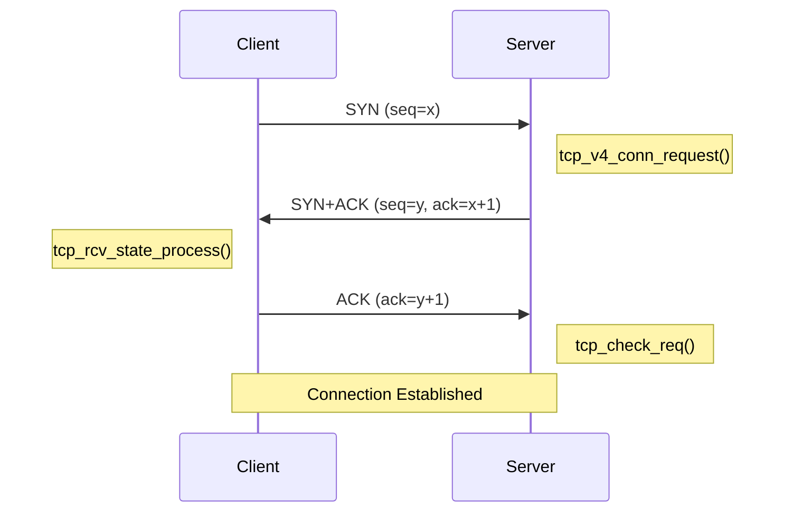
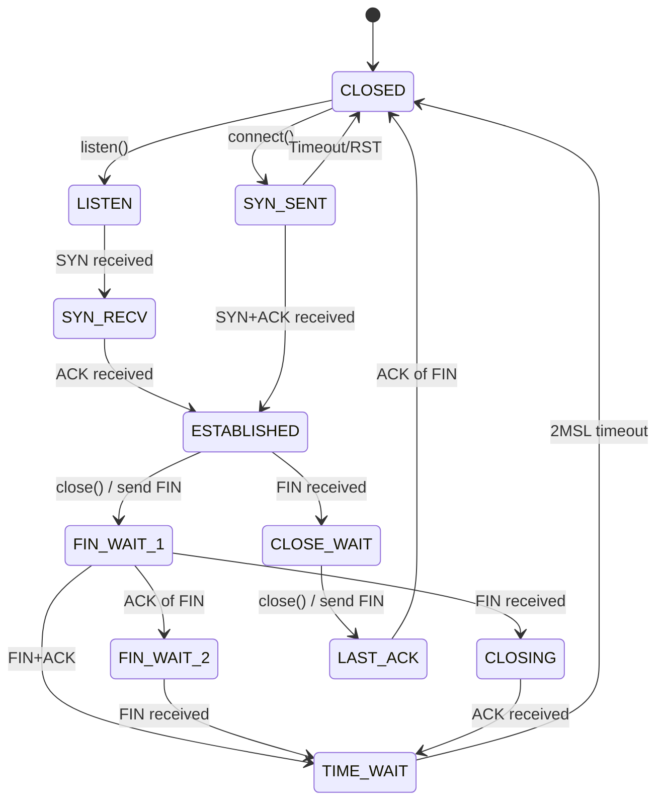
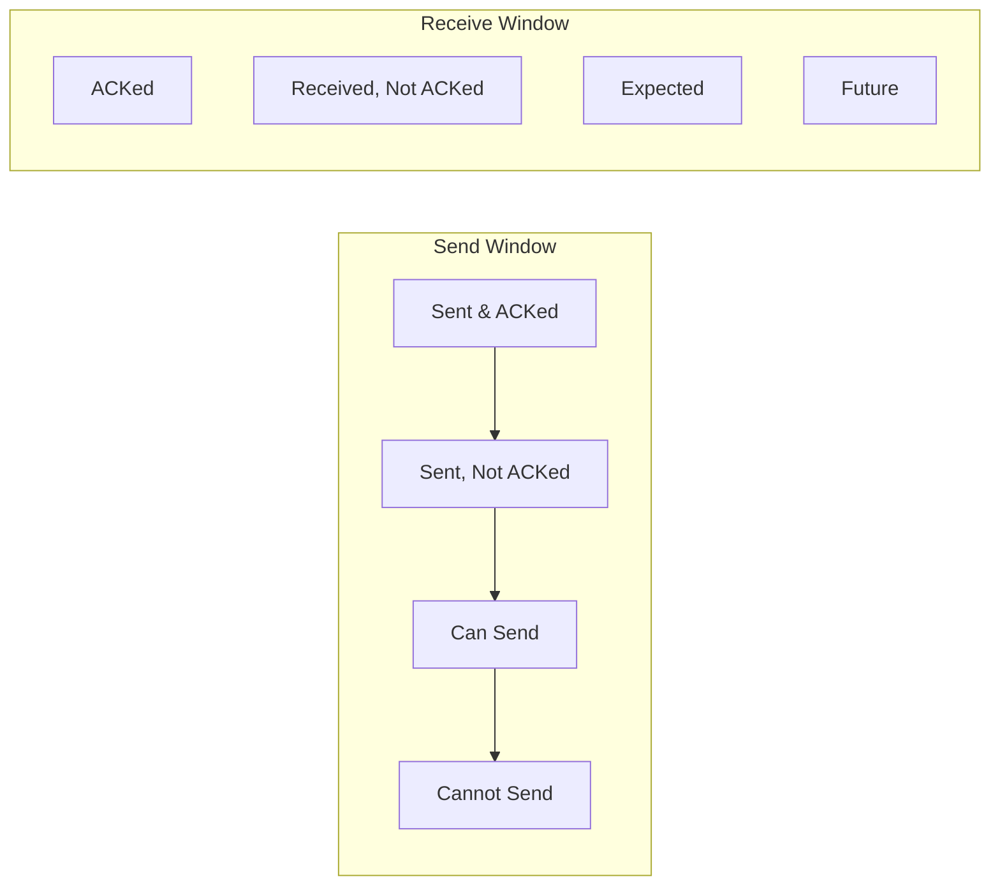
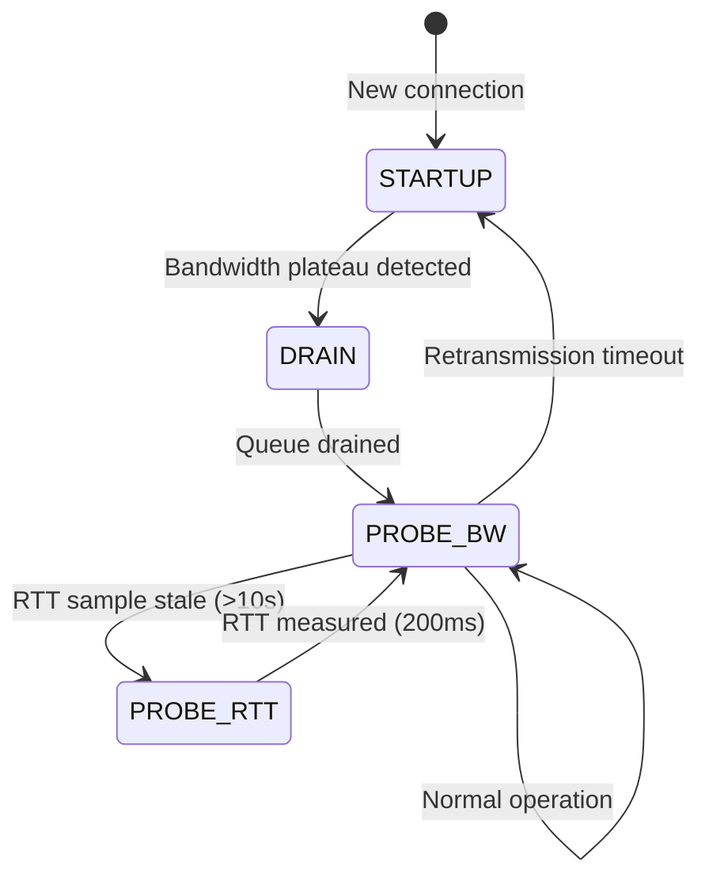
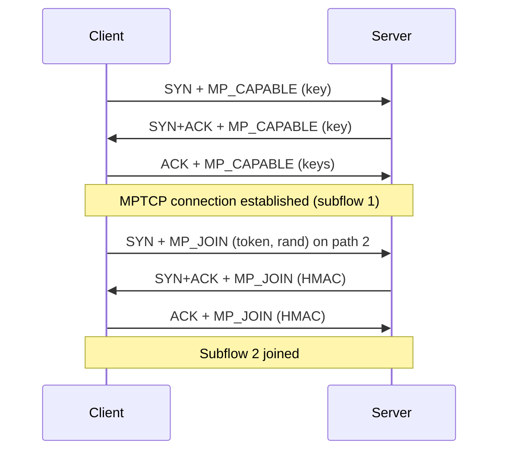

# TCP/IP In-Kernel Implementation

## Introduction

The Linux kernel implements the TCP/IP protocol suite with a focus on performance, scalability, and correctness. The TCP implementation alone is tens of thousands of lines of code, handling everything from connection establishment and data transfer to congestion control and error recovery.

This chapter covers the in-kernel implementation of TCP/IP, including connection setup, the TCP state machine, congestion control algorithms, and IP layer processing.

## TCP Connection Setup

### Three-Way Handshake

TCP connection establishment follows the standard three-way handshake, implemented in `net/ipv4/tcp_ipv4.c`:



### Client-Side Connection

When a client calls `connect()`:

```c
/* Userspace */
int connect(int sockfd, const struct sockaddr *addr, socklen_t addrlen);

/* Kernel implementation */
int tcp_v4_connect(struct sock *sk, struct sockaddr *uaddr, int addr_len)
{
    struct inet_sock *inet = inet_sk(sk);
    struct tcp_sock *tp = tcp_sk(sk);
    struct sockaddr_in *usin = (struct sockaddr_in *)uaddr;
    struct flowi4 *fl4;
    struct rtable *rt;

    /* Validate address */
    if (addr_len < sizeof(*usin))
        return -EINVAL;

    /* Route lookup */
    rt = ip_route_connect(fl4, usin->sin_addr.s_addr,
                          inet->inet_saddr, ...);

    /* Set up connection parameters */
    inet->inet_daddr = usin->sin_addr.s_addr;
    inet->inet_dport = usin->sin_port;

    /* Initialize TCP state */
    tp->write_seq = secure_tcp_seq();
    tp->copied_seq = tp->rcv_nxt = 0;

    /* Send SYN */
    tcp_connect(sk);

    return 0;
}
```

### SYN Packet Construction

```c
int tcp_connect(struct sock *sk)
{
    struct tcp_sock *tp = tcp_sk(sk);
    struct sk_buff *buff;

    /* Allocate SYN skb */
    buff = sk_stream_alloc_skb(sk, 0, sk->sk_allocation, true);

    /* Initialize TCP header */
    tcp_init_nondata_skb(buff, tp->write_seq, TCPHDR_SYN);

    /* Set state to SYN_SENT */
    tcp_set_state(sk, TCP_SYN_SENT);

    /* Initialize retransmit timer */
    inet_csk_reset_xmit_timer(sk, ICSK_TIME_RETRANS,
                              tcp_timeout_init(sk), TCP_RTO_MAX);

    /* Queue and send the SYN */
    tcp_connect_queue_skb(sk, buff);
    __tcp_transmit_skb(sk, buff, ...);

    return 0;
}
```

### Server-Side Connection

When a SYN arrives at a listening socket:

```c
/* Called when SYN packet arrives */
int tcp_v4_conn_request(struct sock *sk, struct sk_buff *skb)
{
    struct tcp_options_received tmp_opt;
    struct request_sock *req;

    /* Create request socket (SYN_RECV state) */
    req = inet_reqsk_alloc(&tcp_request_sock_ops, sk, true);

    /* Save SYN information */
    req->rmt_addr = ip_hdr(skb)->saddr;
    req->rmt_port = tcp_hdr(skb)->source;
    req->cookie_ts = tmp_opt.tstamp_ok;

    /* Generate SYN+ACK sequence number */
    tcp_rsk(req)->snt_isn = secure_tcp_seq();
    tcp_rsk(req)->rcv_isn = tcp_hdr(skb)->seq;

    /* Send SYN+ACK */
    tcp_v4_send_synack(sk, req, ...);

    /* Add to SYN queue */
    inet_csk_reqsk_queue_hash_add(sk, req, ...);

    return 0;
}
```

### SYN Cookies

Under SYN flood attacks, Linux uses SYN cookies to avoid allocating state:

```c
/* Generate SYN cookie */
static __u32 cookie_v4_init_sequence(struct sock *sk, struct sk_buff *skb,
                                     __u16 *mssp)
{
    __u32 seq;
    __u32 mss = *mssp;

    /* Encode MSS, timestamp, etc. into the sequence number */
    seq = cookie_hash(saddr, daddr, sport, dport, 0, 0);
    seq += tcp_time_stamp;
    seq ^= (mss << 2);  /* Encode MSS */

    return seq;
}

/* Enable SYN cookies */
$ sysctl net.ipv4.tcp_syncookies=1
```

## TCP State Machine

### State Transitions

The TCP state machine is implemented in `net/ipv4/tcp_input.c` and `net/ipv4/tcp.c`:



### State Processing

```c
/* Main TCP state processing function */
int tcp_rcv_state_process(struct sock *sk, struct sk_buff *skb)
{
    struct tcp_sock *tp = tcp_sk(sk);
    struct tcphdr *th = tcp_hdr(skb);

    switch (sk->sk_state) {
    case TCP_CLOSE:
        goto discard;

    case TCP_LISTEN:
        if (th->syn) {
            /* Accept SYN, create child socket */
            icsk->icsk_af_ops->conn_request(sk, skb);
        }
        break;

    case TCP_SYN_SENT:
        /* Process SYN+ACK from server */
        tp->rcv_nxt = TCP_SKB_CB(skb)->seq + 1;
        tcp_set_state(sk, TCP_ESTABLISHED);
        tcp_send_ack(sk);
        break;

    case TCP_ESTABLISHED:
        /* Process data and control packets */
        tcp_data_queue(sk, skb);
        break;

    case TCP_FIN_WAIT1:
        if (th->ack) {
            if (th->fin) {
                /* Simultaneous close */
                tcp_set_state(sk, TCP_TIME_WAIT);
            } else {
                tcp_set_state(sk, TCP_FIN_WAIT2);
            }
        }
        break;

    case TCP_FIN_WAIT2:
        if (th->fin) {
            tcp_set_state(sk, TCP_TIME_WAIT);
            tcp_send_ack(sk);
        }
        break;

    case TCP_CLOSE_WAIT:
        /* Application hasn't called close() yet */
        tcp_data_queue(sk, skb);
        break;

    case TCP_LAST_ACK:
        if (th->ack) {
            tcp_set_state(sk, TCP_CLOSED);
        }
        break;

    case TCP_TIME_WAIT:
        /* 2MSL timer handling */
        break;
    }

    return 0;
}
```

## TCP Data Transfer

### Sending Data

When an application calls `send()`:

```c
ssize_t tcp_sendmsg(struct sock *sk, struct msghdr *msg, size_t size)
{
    struct tcp_sock *tp = tcp_sk(sk);
    struct sk_buff *skb;
    int flags, err;
    size_t copied = 0;

    lock_sock(sk);

    flags = msg->msg_flags;

    /* Wait for connection to be established */
    if (sk->sk_state == TCP_CLOSE) {
        err = -EPIPE;
        goto out_err;
    }

    /* Copy data from userspace to sk_buffs */
    while (msg_data_left(msg)) {
        int copy;
        bool merge;

        /* Get or allocate a sk_buff */
        skb = tcp_write_queue_tail(sk);
        if (!skb || !tcp_skb_can_collapse_to(skb)) {
            skb = sk_stream_alloc_skb(sk, ...);
            tcp_add_write_queue_tail(sk, skb);
        }

        /* Calculate how much to copy */
        copy = min_t(int, msg_data_left(msg),
                     skb_availroom(skb));

        /* Copy from userspace */
        skb_add_data_nocache(sk, skb, msg, copy);

        copied += copy;
        tp->write_seq += copy;
    }

    /* Push data to network */
    if (copied)
        tcp_push(sk, flags, mss_now, tp->nonagle);

    release_sock(sk);
    return copied;
}
```

### Receiving Data

```c
/* Called when data packet arrives */
void tcp_data_queue(struct sock *sk, struct sk_buff *skb)
{
    struct tcp_sock *tp = tcp_sk(sk);
    struct tcphdr *th = tcp_hdr(skb);

    /* Check if data is in order */
    if (TCP_SKB_CB(skb)->seq == tp->rcv_nxt) {
        /* In-order data */
        if (tcp_receive_window(tp) == 0) {
            /* Window is zero, drop and send ACK */
            tcp_send_dupack(sk, skb);
            kfree_skb(skb);
            return;
        }

        /* Add to receive queue */
        eaten = tcp_queue_rcv(sk, skb, &fragstolen);

        /* Update rcv_nxt */
        tp->rcv_nxt += TCP_SKB_CB(skb)->end_seq -
                       TCP_SKB_CB(skb)->seq;

        /* Send ACK */
        tcp_send_ack(sk);

        /* Wake up application */
        sk->sk_data_ready(sk);
    } else {
        /* Out-of-order data, add to out-of-order queue */
        tcp_data_queue_ofo(sk, skb);
        tcp_send_dupack(sk, skb);
    }
}
```

### Window Management

TCP uses a sliding window for flow control:



## Congestion Control

Linux implements multiple congestion control algorithms, selectable per-socket or system-wide.

### Congestion Control Framework

```c
struct tcp_congestion_ops {
    char        name[TCP_CA_NAME_MAX];

    /* Called when congestion is detected */
    void        (*cong_avoid)(struct sock *sk, u32 ack, u32 acked);

    /* Called on receiving ACK */
    void        (*pkts_acked)(struct sock *sk, const struct ack_sample *sample);

    /* Called when entering congestion state */
    void        (*ssthresh)(struct sock *sk);

    /* Called when leaving congestion state */
    void        (*cong_control)(struct sock *sk, const struct rate_sample *rs);

    /* Undo congestion window reduction */
    u32         (*undo_cwnd)(struct sock *sk);

    /* Called on state changes */
    void        (*init)(struct sock *sk);
    void        (*release)(struct sock *sk);

    u32         key;
    u32         flags;
};
```

### Reno Congestion Control

The classic Reno algorithm:

```c
/* TCP Reno congestion avoidance */
static void tcp_reno_cong_avoid(struct sock *sk, u32 ack, u32 acked)
{
    struct tcp_sock *tp = tcp_sk(sk);

    if (!tcp_is_cwnd_limited(sk))
        return;

    if (tcp_in_slow_start(tp)) {
        /* Slow start: exponential growth */
        tcp_slow_start(tp, acked);
    } else {
        /* Congestion avoidance: linear growth */
        tcp_cong_avoid_ai(tp, tcp_snd_cwnd(tp), acked);
    }
}

static u32 tcp_reno_ssthresh(struct sock *sk)
{
    const struct tcp_sock *tp = tcp_sk(sk);
    /* Halve the congestion window */
    return max(tp->snd_cwnd >> 1U, 2U);
}
```

### CUBIC Congestion Control

CUBIC is the default congestion control algorithm in Linux (since 2.6.20). It uses a cubic function for window growth, which is more stable and fair than Reno's linear growth:

```c
/* net/ipv4/tcp_cubic.c */

/* CUBIC state per connection */
struct bictcp {
    u32 cnt;            /* Target cwnd */
    u32 last_max_cwnd;  /* Last maximum cwnd */
    u32 last_cwnd;      /* Last cwnd */
    u32 last_time;      /* Time since last congestion event */
    u32 bic_origin_point;/* Origin point of cubic function */
    u32 bic_K;          /* K = cube_root(last_max_cwnd - origin) */
    u32 delay_min;      /* Minimum RTT */
    u32 epoch_start;    /* Start of current epoch */
    /* ... */
};

/* CUBIC window growth function */
static void bictcp_cong_avoid(struct sock *sk, u32 ack, u32 acked)
{
    struct tcp_sock *tp = tcp_sk(sk);
    struct bictcp *ca = inet_csk_ca(sk);
    u32 delta, bic_target, t;

    if (!tcp_is_cwnd_limited(sk))
        return;

    if (tcp_in_slow_start(tp)) {
        /* Slow start: exponential growth (same as Reno) */
        tcp_slow_start(tp, acked);
        return;
    }

    /* CUBIC congestion avoidance */
    t = tcp_stamp - ca->epoch_start;  /* Time since last loss */

    /* CUBIC function: W(t) = C * (t - K)^3 + W_max */
    /* C = 0.4 (cubic scaling factor) */
    /* K = cube_root(W_max * beta / C) */

    bic_target = cubic(t, ca->bic_origin_point, ca->bic_K);

    if (bic_target > tcp_snd_cwnd(tp)) {
        /* Below target: grow towards it */
        delta = bic_target - tcp_snd_cwnd(tp);
        ca->cnt = tcp_snd_cwnd(tp) / delta;
    } else {
        /* Above target: grow slowly (TCP-friendly region) */
        ca->cnt = 100 * tcp_snd_cwnd(tp);
    }
}
```

### CUBIC Growth Curve

```
Window
  ^
  |      /‾‾‾‾‾‾‾‾‾‾‾‾‾‾‾‾‾‾‾‾‾ W_max
  |     /
  |    /  CUBIC: concave growth
  |   /   (approaching W_max slowly)
  |  /
  | /
  |/  CUBIC: convex growth
  |   (recovering from loss quickly)
  |__________________________________> Time
      ^          ^
      Loss       W_max reached
      event
```

```bash
# CUBIC tunables
$ cat /proc/sys/net/ipv4/tcp_congestion_control
cubic

# CUBIC beta = 0.7 (reduce cwnd to 70% on loss)
$ cat /sys/module/tcp_cubic/parameters/beta
# (not always exposed; default 0.7)

# View CUBIC state for a connection
$ ss -i dst 10.0.0.1
# cubic cwnd:100 ssthresh:50 rtt:1.234/0.567
```

### BBR Congestion Control

BBR (Bottleneck Bandwidth and Round-trip propagation time) is a newer algorithm that models the network path rather than reacting to packet loss:

```c
/* net/ipv4/tcp_bbr.c */

/* BBR state per connection */
struct bbr {
    u32 min_rtt_us;         /* Minimum RTT (propagation delay) */
    u32 bw;                 /* Estimated bottleneck bandwidth */
    u32 cycle_idx;          /* Current gain cycle index */
    u32 has_seen_rtt:1;     /* Have we seen an RTT sample? */
    u32 unused:15;
    u32 full_bw;            /* Bandwidth estimate at full pipe */
    u32 round_count;        /* Number of packet-timed rounds */
    u64 cycle_mstamp;       /* Time of last cycle phase */
    u32 mode:3;             /* BBR mode (STARTUP, DRAIN, PROBE_BW, PROBE_RTT) */
    /* ... */
};
```

BBR has four operating modes:



```c
/* BBR mode definitions */
enum bbr_mode {
    BBR_STARTUP,    /* Ramp up sending rate quickly */
    BBR_DRAIN,      /* Drain excess queue from startup */
    BBR_PROBE_BW,   /* Steady state: probe for more bandwidth */
    BBR_PROBE_RTT,  /* Probe for lower RTT */
};

/* BBR pacing rate calculation */
static u32 bbr_pacing_rate(struct sock *sk)
{
    struct bbr *bbr = inet_csk_ca(sk);
    u32 rate = bbr->bw * bbr->pacing_gain;

    /* During startup, pace at 2.89x bandwidth estimate */
    if (bbr->mode == BBR_STARTUP)
        rate = bbr->bw * 289 / 100;

    return rate;
}
```

```bash
# Enable BBR
$ sysctl net.ipv4.tcp_congestion_control=bbr

# Check available algorithms
$ sysctl net.ipv4.tcp_available_congestion_control
net.ipv4.tcp_available_congestion_control = reno cubic bbr

# Per-socket selection
setsockopt(fd, IPPROTO_TCP, TCP_CONGESTION, "bbr", 3);

# BBR tunables (BBRv2, available when tcp_bbr2 module loaded)
# Note: original BBR (tcp_bbr) has no sysctl tunables
$ sysctl net.ipv4.tcp_bbr2_high_gain=2890
$ sysctl net.ipv4.tcp_bbr2_drain_gain=250
$ sysctl net.ipv4.tcp_bbr2_probe_rtt_mode_ms=200
```

### BBR vs CUBIC

| Feature | CUBIC | BBR |
|---------|-------|-----|
| Model | Loss-based | Model-based |
| Congestion signal | Packet loss | Bandwidth/RTT estimation |
| Buffer filling | Fills buffers | Avoids buffer bloat |
| Loss tolerance | Reduces on loss | Ignores random loss |
| Fairness | Good (same algo) | Can starve CUBIC flows |
| Default | Linux default | Must enable manually |
| Best for | Traditional networks | High BDP, lossy links |

### ECN (Explicit Congestion Notification)

```c
/* ECN support in TCP */
static inline int tcp_ecn_rcv_ecn_echo(struct tcp_sock *tp,
                                       const struct tcphdr *th)
{
    if (th->ece && !th->cwr)
        return 1;
    return 0;
}

/* Enable ECN */
$ sysctl net.ipv4.tcp_ecn=1
```

## Nagle Algorithm

The Nagle algorithm coalesces small writes to reduce the number of tiny packets sent over the network:

```c
/* net/ipv4/tcp_output.c */
static bool tcp_nagle_test(struct tcp_sock *tp, struct sk_buff *skb,
                           unsigned int mss_now, int nonagle)
{
    /* Nagle disabled: always send immediately */
    if (nonagle & TCP_NAGLE_OFF)
        return true;

    /* If we have full-sized segment, send */
    if (skb->len >= mss_now)
        return true;

    /* If all previous data is ACKed, send */
    if (tcp_skb_is_last(sk, skb))
        return true;

    /* If we're in quickack mode, send */
    if (tp->pred_flags & TCP_QUICKACK)
        return true;

    /* Otherwise, wait for more data or ACK */
    return false;
}
```

### Nagle Interaction with Delayed ACK

The Nagle algorithm can interact badly with delayed ACKs, causing a "write-write-write" pattern to stall:

```
Without TCP_NODELAY:
  Client: write(1 byte) → wait for ACK...
  Server: receives 1 byte → delays ACK (up to 40ms)
  Client: write(1 byte) → blocked by Nagle (unACKed data)
  ... 40ms delay ...
  Server: sends delayed ACK
  Client: sends second byte

With TCP_NODELAY:
  Client: write(1 byte) → send immediately
  Client: write(1 byte) → send immediately
  Server: receives both → responds
```

### Disabling Nagle (TCP_NODELAY)

```c
#include <netinet/tcp.h>

int flag = 1;
setsockopt(fd, IPPROTO_TCP, TCP_NODELAY, &flag, sizeof(flag));

/* Also can use TCP_CORK for opposite effect: */
int cork = 1;
setsockopt(fd, IPPROTO_TCP, TCP_CORK, &cork, sizeof(cork));
/* TCP_CORK: hold small writes until cork removed or buffer full */
cork = 0;
setsockopt(fd, IPPROTO_TCP, TCP_CORK, &cork, sizeof(cork));
```

```bash
# View TCP_NODELAY state
$ ss -o state established '( dport = :80 )' | grep -o 'nodelay\|cork'

# sysctl for Nagle (not typically exposed)
# Nagle is controlled per-socket via TCP_NODELAY
```

### When to Disable Nagle

- **Interactive protocols** (SSH, telnet, gaming): Disable with `TCP_NODELAY`
- **RPC/HTTP**: Disable with `TCP_NODELAY` for request-response patterns
- **Bulk transfer**: Keep Nagle enabled (default) for throughput
- **Database connections**: Usually disable with `TCP_NODELAY`

## IP Layer Implementation

### IP Packet Reception

```c
/* IP receive entry point */
int ip_rcv(struct sk_buff *skb, struct net_device *dev,
           struct packet_type *pt, struct net_device *orig_dev)
{
    const struct iphdr *iph;
    struct net *net;

    /* Validate IP header */
    if (!pskb_may_pull(skb, iph->ihl * 4))
        goto drop;

    iph = ip_hdr(skb);

    /* Verify version */
    if (iph->version != 4)
        goto drop;

    /* Verify header length */
    if (iph->ihl < 5)
        goto drop;

    /* Verify checksum */
    if (unlikely(ip_fast_csum((u8 *)iph, iph->ihl)))
        goto csum_error;

    /* Pass to netfilter */
    return NF_HOOK(NFPROTO_IPV4, NF_INET_PRE_ROUTING,
                   net, NULL, skb, dev, NULL,
                   ip_rcv_finish);
}
```

### IP Routing

```c
/* IP routing decision */
static int ip_rcv_finish(struct net *net, struct sock *sk,
                         struct sk_buff *skb)
{
    const struct iphdr *iph = ip_hdr(skb);
    struct rtable *rt;

    /* Look up route */
    rt = ip_route_input_noref(skb, iph->daddr, iph->saddr,
                               iph->tos, dev);

    /* Determine packet destination */
    if (rt->rt_type == RTN_LOCAL) {
        /* Deliver locally */
        return ip_local_deliver(skb);
    } else if (rt->rt_type == RTN_MULTICAST) {
        /* Multicast handling */
        return ip_mr_input(skb);
    } else {
        /* Forward packet */
        return ip_forward(skb);
    }
}
```

### IP Fragmentation

```c
/* IP fragmentation */
int ip_fragment(struct net *net, struct sock *sk, struct sk_buff *skb,
                int (*output)(struct net *, struct sock *, struct sk_buff *))
{
    struct iphdr *iph = ip_hdr(skb);
    int mtu, offset, ptr;
    struct sk_buff *frag;

    mtu = ip_skb_dst_mtu(skb);

    /* Check if fragmentation is needed */
    if (skb->len <= mtu)
        return output(net, sk, skb);

    /* Fragment the packet */
    offset = 0;
    ptr = 0;

    while (offset < skb->len) {
        frag = skb_clone(skb, GFP_ATOMIC);

        /* Set fragment offset and flags */
        iph = ip_hdr(frag);
        iph->frag_off = htons(offset >> 3);
        if (offset + mtu < skb->len)
            iph->frag_off |= htons(IP_MF);

        /* Send fragment */
        output(net, sk, frag);

        offset += mtu;
    }

    kfree_skb(skb);
    return 0;
}
```

### IP Fragment Reassembly

```c
/* Fragment reassembly */
static int ip_frag_reasm(struct ipq *qp, struct sk_buff *prev,
                         struct net_device *dev)
{
    struct sk_buff *fp, *head = qp->q.fragments;
    int len;

    /* Calculate total length */
    len = head->len;
    for (fp = head->next; fp; fp = fp->next)
        len += fp->len;

    /* Create a linear buffer */
    skb_shinfo(head)->frag_list = head->next;
    skb_headlen_set(head, head->len);

    /* Fix up the IP header */
    ip_hdr(head)->tot_len = htons(len);
    ip_hdr(head)->frag_off = 0;

    /* Remove from fragment queue */
    ipq_put(qp);

    return head;
}
```

## ICMP Implementation

### ICMP Packet Processing

```c
/* ICMP receive handler */
static int icmp_rcv(struct sk_buff *skb)
{
    struct icmphdr *icmph;
    struct net *net;

    /* Validate ICMP header */
    if (!pskb_may_pull(skb, sizeof(*icmph)))
        goto drop;

    icmph = icmp_hdr(skb);

    /* Verify checksum */
    if (icmp_checksum_verify(skb))
        goto csum_error;

    /* Process based on type */
    switch (icmph->type) {
    case ICMP_ECHO:
        icmp_echo(skb);         /* Reply to ping */
        break;
    case ICMP_DEST_UNREACH:
        icmp_unreach(skb);      /* Destination unreachable */
        break;
    case ICMP_REDIRECT:
        icmp_redirect(skb);     /* Route redirect */
        break;
    case ICMP_TIMESTAMP:
        icmp_timestamp(skb);    /* Timestamp request */
        break;
    default:
        icmp_discard(skb);
    }

    return 0;
}
```

### ICMP Echo (Ping)

```c
static void icmp_echo(struct sk_buff *skb)
{
    struct net *net;
    struct icmp_bxm icmp_param;

    /* Set up reply */
    icmp_param.data.icmph.type = ICMP_ECHOREPLY;
    icmp_param.data.icmph.code = 0;
    icmp_param.data.icmph.un.echo.id = icmp_hdr(skb)->un.echo.id;
    icmp_param.data.icmph.un.echo.sequence = icmp_hdr(skb)->un.echo.sequence;
    icmp_param.skb = skb;
    icmp_param.offset = 0;
    icmp_param.data_len = skb->len;

    /* Send reply */
    icmp_reply(&icmp_param, skb);
}
```

## ARP Implementation

### ARP Packet Processing

```c
/* ARP receive handler */
static int arp_rcv(struct sk_buff *skb, struct net_device *dev,
                   struct packet_type *pt, struct net_device *orig_dev)
{
    struct arphdr *arp;

    /* Validate ARP header */
    if (!pskb_may_pull(skb, arp_hdr_len(dev)))
        goto freeskb;

    arp = arp_hdr(skb);

    /* Check hardware type */
    if (arp->ar_hln != dev->addr_len)
        goto freeskb;

    /* Process based on operation */
    switch (ntohs(arp->ar_op)) {
    case ARPOP_REQUEST:
        arp_process(skb);       /* ARP request */
        break;
    case ARPOP_REPLY:
        arp_process(skb);       /* ARP reply */
        break;
    }

    return 0;
}
```

### ARP Resolution

```c
/* Resolve IP address to MAC address */
int arp_resolve(struct net_device *dev, struct sk_buff *skb,
                __be32 target_ip, unsigned char *dest_hw)
{
    struct neighbour *neigh;

    /* Look up neighbor entry */
    neigh = __neigh_lookup_errno(&arp_tbl, &target_ip, dev);

    /* If entry exists, use it */
    if (neigh->nud_state & NUD_VALID) {
        memcpy(dest_hw, neigh->ha, dev->addr_len);
        return 0;
    }

    /* Send ARP request */
    neigh_event_send(neigh, skb);

    return 1;
}
```

## UDP Implementation

### UDP Packet Processing

```c
/* UDP receive handler */
int udp_rcv(struct sk_buff *skb)
{
    struct udphdr *uh;
    struct sock *sk;

    /* Validate UDP header */
    uh = udp_hdr(skb);
    if (uh->len < sizeof(*uh))
        goto drop;

    /* Look up socket */
    sk = __udp4_lib_lookup_skb(skb, uh->source, uh->dest,
                               &udp_table);

    /* Deliver to socket */
    return udp_queue_rcv_skb(sk, skb);
}

/* Queue skb to socket */
static int udp_queue_rcv_skb(struct sock *sk, struct sk_buff *skb)
{
    /* Socket filter */
    if (!udp_sk(sk)->encap_rcv) {
        if (sk_filter_trim_rcv(sk, skb))
            goto drop;
    }

    /* Add to receive queue */
    __skb_queue_tail(&sk->sk_receive_queue, skb);

    /* Wake up application */
    sk->sk_data_ready(sk);

    return 0;
}
```

## TCP/IP Performance Monitoring

### TCP Statistics

```bash
# View TCP statistics
$ cat /proc/net/netstat
TcpExt: SyncookiesSent SyncookiesRecv SyncookiesFailed ...
TcpExt: 1234 5678 90 ...

# SNMP counters
$ cat /proc/net/snmp
Tcp: RtoAlgorithm RtoMin RtoMax MaxConn ActiveOpens ...
Tcp: 1 200 120000 -1 12345 ...

# Connection statistics
$ ss -s
Total: 1234
TCP:   567 (estab 123, closed 345, orphaned 0, timewait 34)
UDP:   89

# TCP retransmissions
$ nstat -a | grep -i retrans
TcpRetransSegs 123 0.0
TcpExtTCPSlowStartRetrans 45 0.0
```

### Kernel Tuning

```bash
# TCP buffer sizes
$ sysctl -w net.ipv4.tcp_rmem="4096 87380 16777216"
$ sysctl -w net.ipv4.tcp_wmem="4096 65536 16777216"

# TCP connection limits
$ sysctl -w net.core.somaxconn=65535
$ sysctl -w net.ipv4.tcp_max_syn_backlog=65535

# TCP keepalive
$ sysctl -w net.ipv4.tcp_keepalive_time=600
$ sysctl -w net.ipv4.tcp_keepalive_intvl=30
$ sysctl -w net.ipv4.tcp_keepalive_probes=5

# TCP timestamps and window scaling
$ sysctl -w net.ipv4.tcp_timestamps=1
$ sysctl -w net.ipv4.tcp_window_scaling=1

# Selective ACK
$ sysctl -w net.ipv4.tcp_sack=1
```

## Multipath TCP (MPTCP)

MPTCP ([RFC 8684](https://www.rfc-editor.org/rfc/rfc8684.html)) extends TCP to allow a single connection to use multiple network paths simultaneously. The Linux kernel implementation was merged in Linux 5.6.

### Architecture

MPTCP creates a **subflow** (a regular TCP connection) for each network path. A control connection (initial subflow) negotiates MPTCP capability via the `MP_CAPABLE` TCP option. If the remote host or a middlebox does not support MPTCP, the connection falls back to regular TCP transparently.



### Key Components

**Path Manager** — Controls subflow creation/deletion and address announcements:
- In-kernel (`net.mptcp.path_manager=kernel`): uniform rules via `ip mptcp`
- Userspace (`net.mptcp.path_manager=userspace`): per-connection rules via [mptcpd](https://mptcpd.mptcp.dev/)

**Packet Scheduler** — Selects which subflow(s) to use for the next data packet. Configurable via `net.mptcp.scheduler` sysctl.

### Creating MPTCP Sockets

```c
#include <sys/socket.h>
#include <netinet/in.h>

/* MPTCP is opt-in: use IPPROTO_MPTCP (262) */
int sd = socket(AF_INET, SOCK_STREAM, IPPROTO_MPTCP);

/* If MPTCP is unavailable:
 * EINVAL    — kernel < 5.6
 * ENOPROTOOPT — MPTCP disabled via net.mptcp.enabled=0
 */
```

Applications can be forced to use MPTCP via:
- `LD_PRELOAD` with `mptcpize`
- eBPF with `mptcpify`
- SystemTAP
- `GODEBUG=multipathtcp=1` (Go)

### MPTCP Socket Options

| Option | Level | Description |
|--------|-------|-------------|
| `MPTCP_INFO` | `SOL_MPTCP` (284) | Get `struct mptcp_info` (connection stats) |
| `MPTCP_TCPINFO` | `SOL_MPTCP` | Get per-subflow `tcp_info` arrays |
| `MPTCP_SUBFLOW_ADDRS` | `SOL_MPTCP` | Get source/dest addresses of each subflow |
| `TCP_IS_MPTCP` | `IPPROTO_TCP` | Query whether MPTCP is active (0 or 1) |

### MPTCP Use Cases

- **Seamless handover**: Mobile devices switch between Wi-Fi and cellular without dropping connections
- **Network aggregation**: Combine multiple paths for higher throughput (e.g., Wi-Fi + cellular)
- **Best path selection**: Use the lowest-latency or most reliable path

### Configuring MPTCP

```bash
# Enable MPTCP (Linux 5.6+)
sysctl net.mptcp.enabled=1

# Configure endpoints (addresses available for subflows)
ip mptcp endpoint add 192.168.1.10 dev eth0 subflow
ip mptcp endpoint add 10.0.0.5 dev wlan0 signal

# List endpoints
ip mptcp endpoint show

# Configure path manager
sysctl net.mptcp.path_manager=kernel

# Check MPTCP connections
ss -M
# or
ss -i | grep mptcp

# MPTCP sysctl tunables
sysctl net.mptcp.pm_type          # 0=kernel, 1=userspace
sysctl net.mptcp.scheduler         # Default scheduler
sysctl net.mptcp.checksum_enabled  # Enable MPTCP checksum (interop compat)
```

## References

- [The Linux Kernel Documentation](https://docs.kernel.org/)
- [LWN.net - Linux and free software news](https://lwn.net/)
- [GNU Project Documentation](https://www.gnu.org/doc/doc.html)
- [GNU Manuals](https://www.gnu.org/manual/manual.html)
- [Free Software Directory](https://directory.fsf.org/wiki/Main_Page)
- [Planet GNU](https://planet.gnu.org/)
- [Free Software Books](https://www.gnu.org/doc/other-free-books.html)

1. **Linux Kernel Source** — `net/ipv4/tcp_ipv4.c`, `net/ipv4/tcp_input.c`, `net/ipv4/tcp_output.c`
2. **RFC 793** — Transmission Control Protocol
3. **RFC 5681** — TCP Congestion Control
4. **RFC 8312** — CUBIC for TCP
5. **RFC 7567** — IETF Recommendations Regarding Active Queue Management
6. *TCP/IP Illustrated, Volume 1* by W. Richard Stevens
7. *TCP/IP Illustrated, Volume 2* by Gary R. Wright and W. Richard Stevens
8. [Multipath TCP (MPTCP) — docs.kernel.org](https://docs.kernel.org/networking/mptcp.html)
9. [RFC 8684 — MPTCP v1](https://www.rfc-editor.org/rfc/rfc8684.html)
10. [mptcp.dev — MPTCP in the Linux kernel](https://www.mptcp.dev/)

## Related Topics

- [Kernel Networking Overview](overview.md) — How packets flow through the stack
- [Socket Layer](sockets.md) — Socket structures and operations
- [Netfilter](netfilter.md) — Packet filtering framework
- [XDP](xdp.md) — High-performance packet processing
- [TCP/IP Suite](../networking/tcpip-suite.md) — TCP/IP protocol details
- [DNS](../networking/dns.md) — Domain Name System
