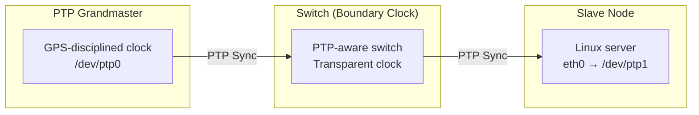
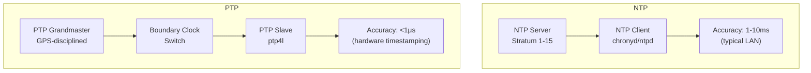

# SO_TIMESTAMPING: Network Packet Timestamping

## Overview

SO_TIMESTAMPING is a Linux socket option that enables software and hardware timestamping of network packets. It provides a unified interface for obtaining transmit (TX) and receive (RX) timestamps at various points in the networking stack, and is the primary mechanism for Precision Time Protocol (PTP) support in Linux.

Unlike the older SO_TIMESTAMP and SO_TIMESTAMPNS options (which only provide RX timestamps), SO_TIMESTAMPING supports:

- **Both TX and RX timestamps**
- **Multiple timestamp delivery modes** (ancillary data or data socket)
- **Hardware timestamps** from NICs with PTP support
- **Software timestamps** at well-defined points in the stack

## Socket Option

```c
#include <linux/net_tstamp.h>

int sock_fd = socket(AF_INET, SOCK_DGRAM, 0);

int flags = SOF_TIMESTAMPING_SOFTWARE |   /* Software timestamps */
            SOF_TIMESTAMPING_TX_SOFTWARE | /* SW TX timestamp */
            SOF_TIMESTAMPING_RX_SOFTWARE | /* SW RX timestamp */
            SOF_TIMESTAMPING_TX_HARDWARE | /* HW TX timestamp */
            SOF_TIMESTAMPING_RX_HARDWARE;  /* HW RX timestamp */

setsockopt(sock_fd, SOL_SOCKET, SO_TIMESTAMPING, &flags, sizeof(flags));
```

## Timestamp Flags

### Timestamp Types

| Flag | Description |
|------|-------------|
| `SOF_TIMESTAMPING_SOFTWARE` | Request software timestamps |
| `SOF_TIMESTAMPING_SYS_HARDWARE` | Request hardware timestamps (deprecated) |
| `SOF_TIMESTAMPING_RAW_HARDWARE` | Request raw hardware timestamps from NIC |

### Direction Flags

| Flag | Description |
|------|-------------|
| `SOF_TIMESTAMPING_TX_SOFTWARE` | Software TX timestamp |
| `SOF_TIMESTAMPING_TX_HARDWARE` | Hardware TX timestamp |
| `SOF_TIMESTAMPING_RX_SOFTWARE` | Software RX timestamp |
| `SOF_TIMESTAMPING_RX_HARDWARE` | Hardware RX timestamp |

### Reporting Flags

| Flag | Description |
|------|-------------|
| `SOF_TIMESTAMPING_SOFTWARE` | Report via control message (ancillary data) |
| `SOF_TIMESTAMPING_RAW_HARDWARE` | Report via control message |
| `SOF_TIMESTAMPING_OPT_CMSG` | Provide timestamps via cmsg |
| `SOF_TIMESTAMPING_OPT_TSONLY` | Timestamp only, no payload copy |
| `SOF_TIMESTAMPING_OPT_STATS` | Include transmit statistics |
| `SOF_TIMESTAMPING_OPT_PKTINFO` | Include packet info |
| `SOF_TIMESTAMPING_OPT_TX_SWHW` | Report both SW and HW TX timestamps |
| `SOF_TIMESTAMPING_OPT_BIND_PHC` | Bind to a specific PTP hardware clock |
| `SOF_TIMESTAMPING_OPT_ID` | Include a unique ID for TX timestamps |

### Timestamp Sources

| Flag | Description |
|------|-------------|
| `SOF_TIMESTAMPING_TX_SCHED` | Timestamp at queue scheduler entry |
| `SOF_TIMESTAMPING_TX_ACK` | Timestamp when packet is ACKed (TCP) |
| `SOF_TIMESTAMPING_DATA_CMSG` | Deliver timestamps as data, not cmsg |

## Timestamp Delivery

### Ancillary Data (Control Messages)

By default, timestamps arrive as ancillary data via `recvmsg()`:

```c
struct msghdr msg;
struct cmsghdr *cmsg;
struct timespec ts[3]; /* SW, HW legacy, HW raw */

recvmsg(sock_fd, &msg, 0);

for (cmsg = CMSG_FIRSTHDR(&msg); cmsg != NULL;
     cmsg = CMSG_NXTHDR(&msg, cmsg)) {
    if (cmsg->cmsg_level == SOL_SOCKET &&
        cmsg->cmsg_type == SO_TIMESTAMPING) {
        memcpy(ts, CMSG_DATA(cmsg), sizeof(ts));
        /* ts[0] = software timestamp
         * ts[1] = hardware timestamp (legacy)
         * ts[2] = hardware timestamp (raw) */
    }
}
```

### Data Socket (Timestamp-Only)

With `SOF_TIMESTAMPING_OPT_TSONLY`, TX timestamps can be delivered on the data socket without echoing the entire packet:

```c
flags |= SOF_TIMESTAMPING_OPT_TSONLY;
setsockopt(sock_fd, SOL_SOCKET, SO_TIMESTAMPING, &flags, sizeof(flags));

/* Then recvmsg() returns zero-length data with only the timestamp cmsg */
```

This is essential for high-throughput applications that don't want to waste memory echoing full packets.

### TCP Timestamps

For TCP, TX timestamps are particularly tricky because the packet may be retransmitted, fragmented, or ACKed at an unknown future time. The kernel defers TX timestamp delivery until:

- `SOF_TIMESTAMPING_TX_SOFTWARE`: when the packet is handed to the device driver
- `SOF_TIMESTAMPING_TX_HARDWARE`: when the NIC reports the timestamp (which may be delayed)
- `SOF_TIMESTAMPING_TX_ACK`: when the ACK for the data is received (TCP only)

Use `SOF_TIMESTAMPING_OPT_ID` to associate a user-provided key with each send, so you can correlate the deferred timestamp with the original send call:

```c
/* Set per-packet key via cmsg */
uint32_t key = 42;
struct cmsghdr *cmsg;
/* ... build cmsg with SCM_TIMESTAMPING_OPT_ID ... */
```

## Software Timestamps

Software timestamps are taken at well-defined points in the kernel networking stack by calling `ktime_get_real()` (or equivalent) and storing the result in the socket's `skb`:

### TX Software Timestamp Points

1. **`sk_stamp`** — when `sendmsg()` is called (early in the stack)
2. **`skb_tx_timestamp()`** — just before the packet enters the device driver queue
3. **Driver hook** — some drivers take an additional software timestamp just before DMA

The exact points depend on the driver and kernel version. The `sk->sk_stamp` field records the earliest software TX timestamp.

### RX Software Timestamp Points

1. **`netif_receive_skb()`** — when the packet enters the networking stack from the driver
2. **`__net_timestamp()`** — optional early timestamp in the receive path

Software timestamps use `ktime_get_real()` which is synchronized with NTP but has jitter in the microsecond range (depending on clock source and interrupt latency).

## Hardware Timestamps

Hardware timestamps are taken by the NIC itself, typically using a dedicated PTP clock crystal. They offer sub-microsecond accuracy, often in the low-nanosecond range.

### Requirements

1. **NIC support**: The NIC must have a hardware clock and timestamping unit. Most modern server NICs (Intel, Mellanox/NVIDIA, Broadcom) support this.
2. **PHC (PTP Hardware Clock)**: The NIC exposes a PHC device, usually at `/dev/ptpN`.
3. **Driver support**: The NIC driver must implement the `ethtool_ts_info` callback and the `ndo_do_ioctl` for `SIOCSHWTSTAMP` / `SIOCGHWTSTAMP`.

### Enabling Hardware Timestamps

```bash
# Check capabilities
ethtool -T eth0

# Enable hardware timestamping for all packets
# (Done via setsockopt, not ethtool, but ethtool can configure filters)
ethtool -T eth0
# Look for:
#   hardware-raw-clock
#   hardware-transmit
#   hardware-receive
```

```c
/* Program the NIC to timestamp all packets */
struct hwtstamp_config cfg;
cfg.flags = 0;
cfg.tx_type = HWTSTAMP_TX_ON;         /* Timestamp all TX */
cfg.rx_filter = HWTSTAMP_FILTER_ALL;  /* Timestamp all RX */

ioctl(sock_fd, SIOCSHWTSTAMP, &cfg);
```

### RX Hardware Timestamp Filters

Rather than timestamping every packet (expensive), you can filter:

| Filter | Description |
|--------|-------------|
| `HWTSTAMP_FILTER_NONE` | No RX hardware timestamps |
| `HWTSTAMP_FILTER_ALL` | Timestamp all incoming packets |
| `HWTSTAMP_FILTER_PTP_V1_L4_EVENT` | PTPv1 L4 event messages |
| `HWTSTAMP_FILTER_PTP_V1_L4_SYNC` | PTPv1 L4 sync messages |
| `HWTSTAMP_FILTER_PTP_V1_L4_DELAY_REQ` | PTPv1 L4 delay requests |
| `HWTSTAMP_FILTER_PTP_V2_L4_EVENT` | PTPv2 L4 event messages |
| `HWTSTAMP_FILTER_PTP_V2_L4_SYNC` | PTPv2 L4 sync messages |
| `HWTSTAMP_FILTER_PTP_V2_L4_DELAY_REQ` | PTPv2 L4 delay requests |
| `HWTSTAMP_FILTER_PTP_V2_L2_EVENT` | PTPv2 L2 event messages |
| `HWTSTAMP_FILTER_PTP_V2_L2_SYNC` | PTPv2 L2 sync messages |
| `HWTSTAMP_FILTER_PTP_V2_L2_DELAY_REQ` | PTPv2 L2 delay requests |
| `HWTSTAMP_FILTER_PTP_V2_EVENT` | PTPv2 event (any transport) |

## PTP (Precision Time Protocol)

### PTP Overview

IEEE 1588 PTP synchronizes clocks across a network with sub-microsecond accuracy. Linux implements PTP userspace support through:

- **`linuxptp`** — the standard PTP implementation (`ptp4l`, `phc2sys`, `pmc`)
- **PHC subsystem** — kernel interface to hardware clocks

### PTP and SO_TIMESTAMPING

PTP uses SO_TIMESTAMPING to:

1. **Timestamp PTP event messages** (Sync, Delay_Request) in hardware
2. **Correlate timestamps** between the master and slave clocks
3. **Compute offset and delay** using the four timestamps in a PTP exchange

```
PTP Sync Exchange:

Master                          Slave
  │                               │
  │──── Sync ──────────────────►│  t1 (TX HW timestamp from master)
  │                               │  t2 (RX HW timestamp from slave)
  │◄─── Delay_Request ──────────│  t3 (TX HW timestamp from slave)
  │                               │
  │──── Delay_Response ─────────►│  t4 (RX HW timestamp from master...no)
  │     (contains t4)             │  t4 is actually master's RX of Delay_Request
```

The Linux PTP stack in `linuxptp` opens a socket, sets SO_TIMESTAMPING with hardware flags, and uses the returned timestamps to discipline the PHC.

### PHC Device Interface

Each PHC is exposed as a character device:

```bash
# List PHC devices
ls /dev/ptp*

# Get PHC clock info
phc_ctl /dev/ptp0 get

# Read current time from PHC
phc_ctl /dev/ptp0 gettime

# Synchronize PHC to system clock
phc2sys -s /dev/ptp0 -c CLOCK_REALTIME -O 0
```

The kernel PHC subsystem is in `drivers/ptp/`:

```c
/* PHC registration (in NIC driver) */
struct ptp_clock_info {
    .owner      = THIS_MODULE,
    .name       = "my_nic_ptp",
    .max_adj    = 100000000,  /* max frequency adjustment in ppb */
    .n_alarm    = 0,
    .n_ext_ts   = 0,
    .n_pins     = 0,
    .pps        = 0,
    .adjfreq    = my_ptp_adjfreq,
    .adjtime    = my_ptp_adjtime,
    .gettime64  = my_ptp_gettime,
    .settime64  = my_ptp_settime,
    .enable     = my_ptp_enable,
};
```

## Timestamp Flow in the Kernel

### TX Path

```
User calls sendmsg()
    ↓
ip_output() / ip6_output()
    ↓
dev_queue_xmit()
    ↓
sch_direct_xmit()  ← [SW TX timestamp: skb_tx_timestamp()]
    ↓
NIC driver ndo_start_xmit()
    ↓
NIC hardware timestamps the packet  ← [HW TX timestamp]
    ↓
TX completion interrupt
    ↓
skb_tstamp_tx() → delivers timestamp to socket
```

### RX Path

```
NIC receives packet
    ↓
NIC hardware timestamps it  ← [HW RX timestamp]
    ↓
DMA to ring buffer
    ↓
Driver interrupt → napi_gro_receive()
    ↓
__netif_receive_skb()  ← [SW RX timestamp: net_timestamp()]
    ↓
Socket delivery → recvmsg() with cmsg containing timestamps
```

## Implementation

### Key Data Structures

```c
/* In struct sock */
ktime_t sk_stamp;     /* Software TX timestamp */

/* In struct sock_skb_cb (skb->cb) */
union {
    struct scm_timestamping tstamp;
    struct {
        u32 ts_key;    /* For OPT_ID */
    };
};

/* The timestamp structure returned to userspace */
struct scm_timestamping {
    struct timespec ts[3];
    /* ts[0] = software
     * ts[1] = deprecated legacy HW
     * ts[2] = raw HW */
};
```

### Key Functions

```c
/* Deliver a TX timestamp to the socket */
void skb_tstamp_tx(struct sk_buff *orig_skb, struct sk_buff *skb);

/* Take a software timestamp */
void __net_timestamp(struct sk_buff *skb);

/* Low-level timestamp */
ktime_t ktime_get_real(void);

/* Convert skb timestamp to timespec */
void skb_complete_tx_timestamp(struct sk_buff *skb, struct skb_shared_hwtstamps *hwtstamps);
```

### NIC Driver Callbacks

Drivers implement hardware timestamping through:

```c
/* ethtool callback: report capabilities */
int (*get_ts_info)(struct net_device *dev, struct ethtool_ts_info *info);

/* ioctl callback: configure timestamping */
int (*ndo_do_ioctl)(struct net_device *dev, struct ifreq *ifr, int cmd);

/* Internal: get hardware timestamps for a packet */
void (*ndo_get_hwtstamp)(struct net_device *dev,
                         struct skb_shared_hwtstamps *hwtstamps);
```

## Userspace Tools

### hwtstamp_test

A simple test tool from the kernel source:

```bash
# Build
make -C tools/testing/selftests/net

# Run
./hwtstamp_test eth0
```

### SO_TIMESTAMPING Example

From the kernel's `tools/testing/selftests/net/timestamping.c`:

```bash
gcc -o timestamping tools/testing/selftests/net/timestamping.c
./timestamping eth0
```

This sends UDP packets and prints TX/RX timestamps from both software and hardware sources.

### ptp4l (linuxptp)

```bash
# Run as PTP slave
sudo ptp4l -i eth0 -s -m

# Run as PTP master
sudo ptp4l -i eth0 -m

# Synchronize system clock to PHC
sudo phc2sys -s eth0 -c CLOCK_REALTIME -w -m
```

### ptp4l Configuration File

```ini
# /etc/linuxptp/ptp4l.conf
[global]
# PTP domain (isolates different PTP networks)
domainNumber 0

# Clock type: OC (ordinary clock), BC (boundary clock), E2E, P2P
clockClass 248
clockAccuracy 0xFE
offsetScaledLogVariance 0xFFFF

# Transport: L2 (IEEE 802.3) or UDPv4/UDPv6
networkTransport L2

# Delay mechanism: E2E (end-to-end) or P2P (peer-to-peer)
delay_mechanism E2E

# Time stamping: hardware, software, or both
time_stamping hardware

# Logging
verbose 1
logging_level 6
message_tag ptp4l

# Transport specific
[eth0]
```

### phc2sys Configuration

```ini
# /etc/linuxptp/phc2sys.conf
[global]
# Clock source (PHC device or interface)
device /dev/ptp0

# Clock sink (system clock)
sink CLOCK_REALTIME

# Offset correction
offset 0

# Servo (PI controller)
pi_proportional 0.7
pi_integral 0.3
pi_offset 0.0

# Logging
verbose 1
```

### pmc (PTP Management Client)

```bash
# Query PTP clock properties
sudo pmc -u -b 0 'GET CURRENT_DATA_SET'
# CURRENT_DATA_SET
#     stepsRemoved     0
#     offsetFromMaster 0.000000000
#     meanPathDelay    0.000000000

# Query time properties
sudo pmc -u -b 0 'GET TIME_PROPERTIES_DATA_SET'
# TIME_PROPERTIES_DATA_SET
#     currentUtcOffset      37
#     leap61                0
#     leap59                0
#     timeTraceable        1
#     frequencyTraceable    1
#     ptpTimescale         1
#     currentUtcOffsetValid 1

# Set a clock parameter
sudo pmc -u -b 0 'SET GRANDMASTER_SETTINGS_NP clockClass 128'
```

## Complete PTP Setup Example

### Network Topology



### Step-by-Step Setup

```bash
# 1. Verify NIC hardware timestamping support
$ ethtool -T eth0
Time stamping parameters for eth0:
Capabilities:
    hardware-transmit
    software-transmit
    hardware-receive
    software-receive
    hardware-raw-clock
PTP Hardware Clock: 0
Hardware Transmit Timestamp Modes:
    off
    on
Hardware Receive Filter Modes:
    none
    all

# 2. Enable hardware timestamping on the interface
$ ethtool -L eth0 combined 4  # Ensure enough queues

# 3. Start ptp4l as slave
$ sudo ptp4l -i eth0 -s -m -H
ptp4l[12345.678]: port 1: INITIALIZING to LISTENING on INIT_COMPLETE
ptp4l[12345.679]: port 0: INITIALIZING to LISTENING on INIT_COMPLETE
ptp4l[12350.123]: port 1: new foreign master 001a2b.fffe.3c4d5e
ptp4l[12352.456]: port 1: LISTENING to UNCALIBRATED on RS_SLAVE
ptp4l[12353.789]: port 1: UNCALIBRATED to SLAVE on MASTER_CLOCK_SELECTED
ptp4l[12354.012]: rms 25 max 50 freq -1234 ± 5

# 4. Synchronize system clock to PHC
$ sudo phc2sys -s eth0 -c CLOCK_REALTIME -w -m
phc2sys[12360.000]: eth0 CLOCK_REALTIME rms 5 max 10

# 5. Verify synchronization
$ pmc -u -b 0 'GET CURRENT_DATA_SET'
CURRENT_DATA_SET
    stepsRemoved     1
    offsetFromMaster 0.000000125
    meanPathDelay    0.000234567

# 6. Check system clock accuracy
$ chronyc tracking
Reference ID    : 192.168.1.1
Stratum         : 2
Ref time (UTC)  : Mon Jan  1 00:00:00 2024
System time     : 0.000000125 seconds fast
RMS offset      : 0.000000050 seconds
```

## NIC-Specific Timestamping

### Intel NICs (e1000e, igb, ixgbe, i40e, ice)

```bash
# Intel NICs have mature PTP support
$ ethtool -T eth0 | grep -E "hardware|PTP"
    hardware-transmit
    hardware-receive
    hardware-raw-clock
PTP Hardware Clock: 0

# Intel PHC adjustments
$ phc_ctl /dev/ptp0 get
clock time: 1704067200.123456789

# Configure Intel NIC for PTP (via ethtool)
$ ethtool -L eth0 combined 4

# View Intel NIC PTP statistics
$ ethtool -S eth0 | grep -i ptp
ptp_tx_timestamps: 1234
ptp_rx_timestamps: 5678
ptp_tx_lost: 0
```

### Mellanox/NVIDIA NICs (mlx5)

```bash
# Mellanox NICs support hardware timestamping
$ ethtool -T enp1s0f0 | grep -E "hardware|PTP"
    hardware-transmit
    hardware-receive
    hardware-raw-clock
PTP Hardware Clock: 0

# Mellanox clock info
$ phc_ctl /dev/ptp0 get
clock time: 1704067200.123456789

# Configure Mellanox timestamping
$ ethtool --set-priv-flags enp1s0f0 tx_port_ts on
```

### Broadcom NICs (bnxt_en)

```bash
# Broadcom NIC timestamping
$ ethtool -T eth0 | grep -E "hardware|PTP"
    hardware-transmit
    hardware-receive
    hardware-raw-clock
PTP Hardware Clock: 0
```

## NTP vs PTP



| Aspect | NTP | PTP |
|--------|-----|-----|
| Standard | RFC 5905 | IEEE 1588 |
| Accuracy | 1–10 ms (LAN), 10–100 ms (WAN) | <1 μs (HW), 10–100 μs (SW) |
| Hardware requirement | None | PTP-capable NIC with PHC |
| Protocol | UDP port 123 | UDP 319/320 or L2 |
| Complexity | Low | Medium-High |
| Use case | General time sync | Telecom, finance, industrial |
| Linux daemon | chronyd, ntpd | ptp4l, chrony (PTP mode) |
| Cost | Free | NIC must support PTP |

### Using chrony with PTP

```bash
# chrony can act as a PTP slave (Linux 5.x+)
# /etc/chrony.conf
# Use PTP as time source
refclock PHC /dev/ptp0 poll 2 dpoll -2 offset 0

# Or use NTP with PTP as fallback
server 0.pool.ntp.org iburst
server 1.pool.ntp.org iburst
refclock PHC /dev/ptp0 poll 2 dpoll -2 offset 0 prefer
```

## Common Use Cases

1. **PTP clock synchronization** — using hardware timestamps to synchronize clocks across a network
2. **Latency measurement** — measuring one-way or round-trip network latency with nanosecond precision
3. **High-frequency trading** — timestamping market data and order messages
4. **Audio/video sync** — synchronizing media streams across network devices
5. **Network monitoring** — precise packet timing for traffic analysis
6. **Industrial automation** — time-critical control systems (PROFINET IRT)
7. **5G/LTE networks** — base station synchronization (IEEE 1914.3)

## Latency Measurement Example

```c
/*
 * Measure one-way latency using SO_TIMESTAMPING
 * Send UDP packets and compare TX/RX timestamps
 */

#include <stdio.h>
#include <string.h>
#include <sys/socket.h>
#include <linux/net_tstamp.h>
#include <arpa/inet.h>

int main() {
    int sock = socket(AF_INET, SOCK_DGRAM, 0);

    /* Enable hardware TX/RX timestamps */
    int flags = SOF_TIMESTAMPING_SOFTWARE |
                SOF_TIMESTAMPING_TX_SOFTWARE |
                SOF_TIMESTAMPING_RX_SOFTWARE |
                SOF_TIMESTAMPING_TX_HARDWARE |
                SOF_TIMESTAMPING_RX_HARDWARE |
                SOF_TIMESTAMPING_RAW_HARDWARE |
                SOF_TIMESTAMPING_OPT_TSONLY;
    setsockopt(sock, SOL_SOCKET, SO_TIMESTAMPING, &flags, sizeof(flags));

    /* Send packet */
    struct sockaddr_in addr = {
        .sin_family = AF_INET,
        .sin_port = htons(12345),
    };
    inet_pton(AF_INET, "192.168.1.100", &addr.sin_addr);

    char buf[] = "timestamp test";
    sendto(sock, buf, sizeof(buf), 0, (struct sockaddr *)&addr, sizeof(addr));

    /* Receive with timestamp */
    char recvbuf[256];
    char cmsgbuf[256];
    struct msghdr msg = {0};
    struct iovec iov = { recvbuf, sizeof(recvbuf) };
    msg.msg_iov = &iov;
    msg.msg_iovlen = 1;
    msg.msg_control = cmsgbuf;
    msg.msg_controllen = sizeof(cmsgbuf);

    recvmsg(sock, &msg, 0);

    /* Extract timestamp */
    struct cmsghdr *cmsg;
    for (cmsg = CMSG_FIRSTHDR(&msg); cmsg;
         cmsg = CMSG_NXTHDR(&msg, cmsg)) {
        if (cmsg->cmsg_level == SOL_SOCKET &&
            cmsg->cmsg_type == SO_TIMESTAMPING) {
            struct timespec *ts = (struct timespec *)CMSG_DATA(cmsg);
            printf("SW timestamp: %ld.%09ld\n", ts[0].tv_sec, ts[0].tv_nsec);
            printf("HW timestamp: %ld.%09ld\n", ts[2].tv_sec, ts[2].tv_nsec);
        }
    }
    return 0;
}
```

## Caveats and Gotchas

- **TX timestamps are deferred**: they arrive asynchronously, potentially long after `sendmsg()` returns. Don't block waiting for them.
- **NIC timestamping limits**: most NICs can only timestamp a limited number of packets per second with hardware timestamps.
- **Reordering**: TX timestamps may arrive out of order if packets are reordered or retransmitted.
- **Permissions**: `SIOCSHWTSTAMP` requires `CAP_NET_ADMIN`.
- **Driver support varies**: not all NIC drivers support all timestamp features. Check `ethtool -T`.
- **PTP filter mode**: some NICs only support PTP-specific filters, not `HWTSTAMP_FILTER_ALL`.
- **Clock discipline**: PHC frequency adjustments affect all timestamps; don't adjust the PHC clock while measuring latency.
- **Cross-NUMA effects**: reading timestamps from a NIC on a different NUMA node adds jitter.

## Source Files

- `net/core/timestamping.c` — core timestamping infrastructure
- `net/socket.c` — SO_TIMESTAMPING socket option handling
- `include/linux/net_tstamp.h` — timestamp flag definitions
- `include/uapi/linux/net_tstamp.h` — userspace flag definitions
- `drivers/net/ethernet/intel/e1000e/ptp.c` — example NIC PTP implementation
- `drivers/ptp/` — PHC subsystem

## Further Reading

- **Documentation/networking/timestamping.txt** — comprehensive kernel documentation
- **Documentation/networking/ptp.rst** — PTP hardware clock documentation
- **Linuxptp project** — <https://linuxptp.sourceforge.net/>
- **LWN: Network timestamping** — <https://lwn.net/Articles/636918/>
- **IEEE 1588-2008** — Precision Time Protocol standard

## See Also

- [PTP Hardware Clock](../drivers/ptp.md) — PHC subsystem
- [ethtool](../networking/ethtool.md) — NIC configuration
- [Netfilter](../networking/netfilter.md) — packet filtering
- [TCP](../networking/tcp.md) — TCP protocol internals
