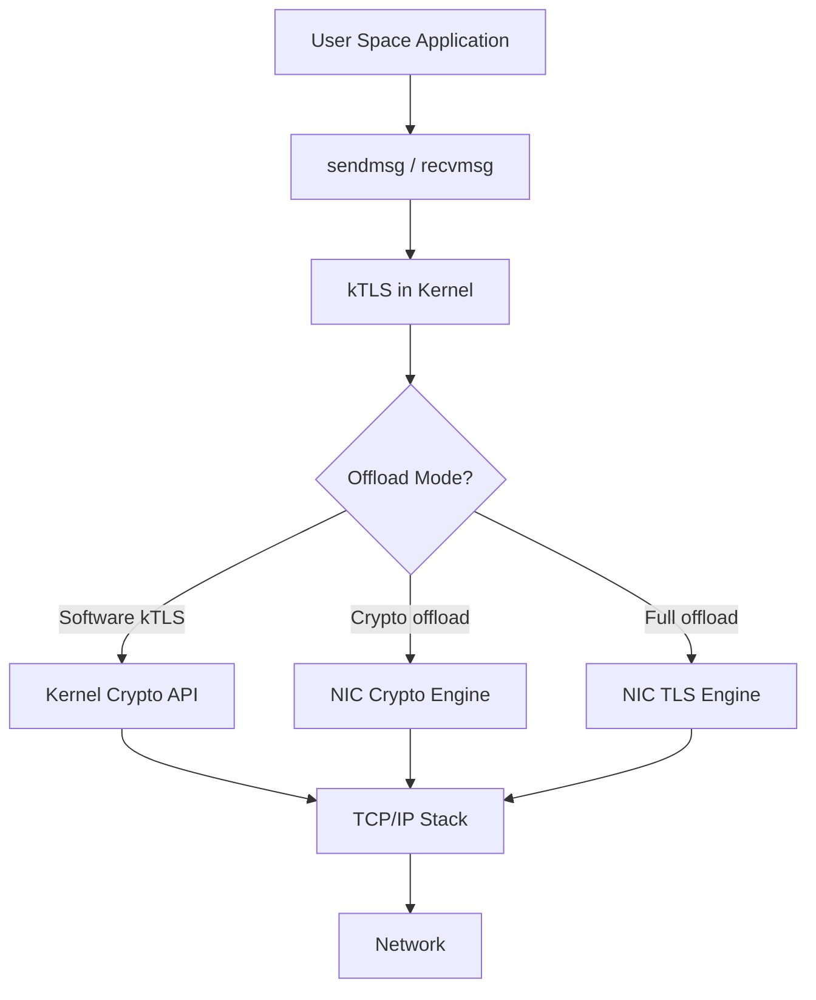
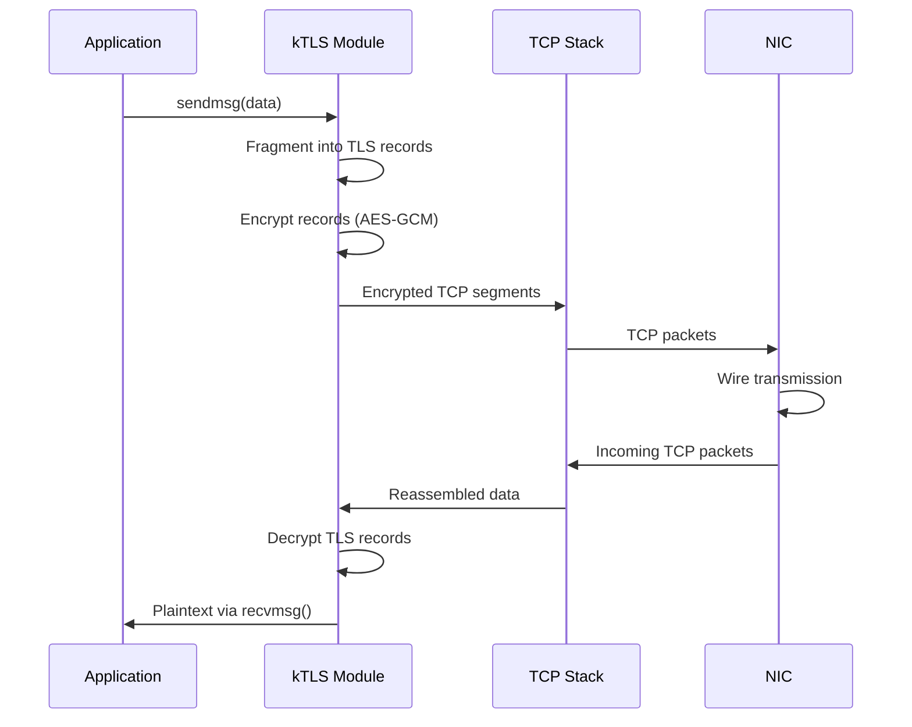
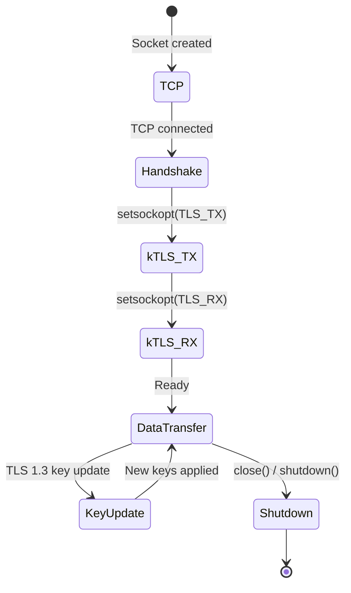

# TLS Offload

## Introduction

Transport Layer Security (TLS) offload moves cryptographic operations from the kernel's
software implementation to hardware accelerators or network interface cards (NICs).
Linux implements **kTLS** (kernel TLS) as the foundation, enabling the kernel to handle
TLS record framing directly. Combined with hardware offload, this achieves near-line-rate
encrypted throughput while reducing CPU utilization. TLS offload is critical for servers
handling massive volumes of HTTPS traffic.

## Architecture Overview



## kTLS: Kernel TLS

kTLS (introduced in Linux 4.13) moves TLS record handling into the kernel. Applications
continue using standard socket APIs, but the kernel handles encryption/decryption.

### How kTLS Works



### Enabling kTLS

```c
#include <netinet/tcp.h>
#include <linux/tls.h>

int enable_ktls(int sockfd, const unsigned char *key,
                const unsigned char *iv, const unsigned char *salt)
{
    struct tls12_crypto_info_aes_gcm_128_crypto_info crypto_info;

    /* Set up crypto info for TLS 1.2 with AES-128-GCM */
    crypto_info.info.version = TLS_1_2_VERSION;
    crypto_info.info.cipher_type = TLS_CIPHER_AES_GCM_128;

    memcpy(crypto_info.key, key, TLS_CIPHER_AES_GCM_128_KEY_SIZE);
    memcpy(crypto_info.iv, iv, TLS_CIPHER_AES_GCM_128_IV_SIZE);
    memcpy(crypto_info.salt, salt, TLS_CIPHER_AES_GCM_128_SALT_SIZE);
    crypto_info.rec_seq = 0;  /* Will be managed by kernel */

    /* Enable kTLS for transmit */
    int ret = setsockopt(sockfd, SOL_TCP, TCP_ULP, "tls", sizeof("tls"));
    if (ret) return ret;

    /* Set the crypto parameters */
    ret = setsockopt(sockfd, SOL_TLS, TLS_TX, &crypto_info, sizeof(crypto_info));
    if (ret) return ret;

    /* Optionally enable receive side */
    ret = setsockopt(sockfd, SOL_TLS, TLS_RX, &crypto_info, sizeof(crypto_info));

    return ret;
}
```

### TLS Record Framing in Kernel

```c
/* net/tls/tls_sw.c - simplified record construction */
static int tls_push_record(struct sock *sk, int flags,
                            unsigned char record_type)
{
    struct tls_context *tls_ctx = tls_get_ctx(sk);
    struct tls_prot_info *prot = &tls_ctx->prot_info;
    struct tls_rec *rec;

    /* Allocate a TLS record */
    rec = kzalloc(sizeof(*rec), GFP_KERNEL);

    /* Build the TLS record header */
    /* ContentType (1 byte) + Version (2 bytes) + Length (2 bytes) */
    rec->header[0] = record_type;
    rec->header[1] = TLS_1_2_VERSION_MAJOR;
    rec->header[2] = TLS_1_2_VERSION_MINOR;
    rec->header[3] = (payload_len >> 8) & 0xFF;
    rec->header[4] = payload_len & 0xFF;

    /* Encrypt the payload */
    tls_encrypt(sk, rec);

    /* Send via TCP */
    tls_tx_records(sk, flags);

    return 0;
}
```

## Hardware Offload Modes

### Crypto Offload (TLS_CIPHER_HW)

In crypto offload mode, the NIC handles encryption/decryption but the kernel
still performs record framing:

```mermaid
graph LR
    A[kTLS Record Framing] --> B[Encrypted payload]
    B --> C[NIC Crypto Engine]
    C --> D[AES-GCM Encrypt]
    D --> E[TX DMA to NIC]
    E --> F[Wire]

    G[Wire] --> H[RX DMA]
    H --> I[NIC Crypto Engine]
    I --> J[AES-GCM Decrypt]
    J --> kTLS Kernel
```

### Full Offload (TLS_HW_RECORD)

In full offload, the NIC handles both record framing and encryption:


### Offload Mode Comparison

| Aspect | Software kTLS | Crypto Offload | Full Offload |
|--------|--------------|----------------|--------------|
| Record framing | Kernel | Kernel | NIC |
| Encryption | Kernel crypto API | NIC crypto engine | NIC TLS engine |
| CPU usage | High | Low | Minimal |
| Throughput | ~50 Gbps | ~90 Gbps | ~98 Gbps (100GbE) |
| NIC support | Any | Most modern NICs | Select NICs |
| TLS resume | Seamless | Seamless | Requires renegotiation |
| Debug visibility | Full | Partial | Limited |

### NIC Capabilities Detection

```c
/* Query NIC TLS offload capabilities */
#include <linux/ethtool.h>

void check_tls_offload(int sock)
{
    struct ethtool_gfeatures features;
    struct ethtool_get_features_block blocks[1];

    features.size = 1;
    features.features[0].ethtool_mask = 0;

    if (ioctl(sock, ETHTOOL_GFEATURES, &features) == 0) {
        if (features.features[0].active & NETIF_F_HW_TLS_TX)
            printf("TX TLS hardware offload supported\n");
        if (features.features[0].active & NETIF_F_HW_TLS_RX)
            printf("RX TLS hardware offload supported\n");
    }
}
```

### Enabling Hardware Offload

```bash
# Enable TLS offload on a NIC
ethtool -K eth0 tls-hw-tx-offload on
ethtool -K eth0 tls-hw-rx-offload on

# Check current offload state
ethtool -k eth0 | grep tls
# tls-hw-tx-offload: on
# tls-hw-rx-offload: on
```

## Kernel Crypto API Integration

kTLS uses the kernel crypto API for software encryption:

```c
/* Cipher configuration for kTLS */
struct cipher_context {
    struct crypto_aead *aead;     /* AEAD cipher handle */
    u8 key[TLS_CIPHER_AES_GCM_128_KEY_SIZE];
    u8 salt[TLS_CIPHER_AES_GCM_128_SALT_SIZE];
    u64 rec_seq;                  /* Record sequence number */
};

/* Initialize AEAD cipher */
int init_tls_cipher(struct cipher_context *ctx)
{
    ctx->aead = crypto_alloc_aead("gcm(aes)", 0, 0);
    if (IS_ERR(ctx->aead))
        return PTR_ERR(ctx->aead);

    /* Set the key */
    crypto_aead_setkey(ctx->aead, ctx->key,
                       TLS_CIPHER_AES_GCM_128_KEY_SIZE);

    /* Set authentication tag size */
    crypto_aead_setauthsize(ctx->aead,
                             TLS_CIPHER_AES_GCM_128_TAG_SIZE);

    return 0;
}
```

### Supported Cipher Suites

| Cipher Suite | Key Size | Tag Size | kTLS Version | Hardware Offload |
|-------------|----------|----------|--------------|------------------|
| AES-128-GCM | 16 bytes | 16 bytes | 4.13+ | Yes |
| AES-256-GCM | 32 bytes | 16 bytes | 4.13+ | Yes |
| ChaCha20-Poly1305 | 32 bytes | 16 bytes | 5.11+ | Limited |
| AES-128-CCM | 16 bytes | 16 bytes | 5.x+ | Rare |
| SM4-GCM | 16 bytes | 16 bytes | 6.x+ | No |
| ARIA-128-GCM | 16 bytes | 16 bytes | 6.x+ | No |

## TLS 1.3 Support

Linux 6.x+ adds TLS 1.3 offload support with new cipher suites:

```c
/* TLS 1.3 with AES-256-GCM */
struct tls12_crypto_info_aes_gcm_256_crypto_info crypto_info;
crypto_info.info.version = TLS_1_3_VERSION;
crypto_info.info.cipher_type = TLS_CIPHER_AES_GCM_256;

/* TLS 1.3 with ChaCha20-Poly1305 */
struct tls12_crypto_info_chacha20_poly1305_crypto_info chacha_info;
chacha_info.info.version = TLS_1_3_VERSION;
chacha_info.info.cipher_type = TLS_CIPHER_CHACHA20_POLY1305;
```

### TLS 1.3 vs 1.2 in kTLS

| Feature | TLS 1.2 | TLS 1.3 |
|---------|---------|---------|
| Handshake | In userspace (OpenSSL) | In userspace |
| Record encryption | Kernel | Kernel |
| Key schedule | Static keys | Key update supported |
| 0-RTT | No | Yes (early data) |
| Cipher negotiation | In handshake | In handshake |
| Record type | Plaintext in header | Encrypted (CH bit) |
| Middlebox compat | N/A | Record type hiding |

### TLS 1.3 Key Update

TLS 1.3 supports key updates during a connection. kTLS handles this transparently:

```c
/* Key update is triggered by the TLS library in userspace */
/* kTLS receives new keys via setsockopt */
struct tls12_crypto_info_aes_gcm_256_crypto_info new_crypto;
new_crypto.info.version = TLS_1_3_VERSION;
new_crypto.info.cipher_type = TLS_CIPHER_AES_GCM_256;
memcpy(new_crypto.key, new_key, 32);
memcpy(new_crypto.iv, new_iv, 12);
new_crypto.rec_seq = 0;

/* Update the TX key */
setsockopt(sockfd, SOL_TLS, TLS_TX, &new_crypto, sizeof(new_crypto));
```

## Multi-buffer Encryption

kTLS leverages the kernel's multi-buffer crypto infrastructure for SIMD-optimized
encryption:

```c
/* Multi-buffer crypto processes multiple blocks in parallel */
/* Uses AVX-512 / AVX2 / NEON instructions */
/* Particularly effective for bulk data transfer */
```

### SIMD Crypto Performance

| Instruction Set | AES-GCM-128 Throughput | CPU Savings vs Software |
|----------------|----------------------|----------------------|
| Scalar | 1 GB/s | Baseline |
| AES-NI + SSE | 5 GB/s | ~5x |
| AES-NI + AVX2 | 10 GB/s | ~10x |
| AES-NI + AVX-512 | 20 GB/s | ~20x |
| Hardware NIC | 100+ Gbps | Offloaded |

### Multi-buffer Crypto Architecture

The kernel's multi-buffer crypto manager (`crypto/mb/`) batches multiple encryption
requests and processes them in parallel using SIMD instructions:

```c
/* Simplified view of multi-buffer processing */
struct mb_crypto_request {
    struct scatterlist src;    /* Source data */
    struct scatterlist dst;    /* Destination data */
    u8 iv[16];                 /* Initialization vector */
    u8 tag[16];                /* Authentication tag */
};

/* Up to 8 requests batched for AVX-512 */
#define MB_BATCH_SIZE 8

/* Submit request to multi-buffer queue */
crypto_aead_encrypt(req);  /* Non-blocking, queued */

/* When batch is full or timer fires:
 * Process all 8 requests in parallel using AVX-512 */
```

## Integration with NGINX / Apache

### NGINX Configuration

```nginx
# NGINX with kTLS support (requires OpenSSL 3.0+ or BoringSSL)
# Compile with: ./configure --with-openssl-opt=enable-ktls

server {
    listen 443 ssl;
    ssl_certificate /etc/ssl/cert.pem;
    ssl_certificate_key /etc/ssl/key.pem;

    # kTLS is enabled automatically when supported
    # Verify with: openssl ciphers -v | grep GCM
}
```

### Apache Configuration

```apache
# Apache with kTLS (requires OpenSSL 3.0+)
# kTLS is automatically used when available

LoadModule ssl_module modules/mod_ssl.so

<VirtualHost *:443>
    SSLEngine on
    SSLCertificateFile /etc/ssl/cert.pem
    SSLCertificateKeyFile /etc/ssl/key.pem
    # kTLS is transparent - no specific directive needed
</VirtualHost>
```

### Verifying kTLS is Active

```bash
# Check if kTLS module is loaded
lsmod | grep tls

# Monitor kTLS stats
cat /proc/net/tls_stat

# Output example:
# TlsCurrTxSw           10
# TlsCurrRxSw           8
# TlsCurrTxDevice       2      # Hardware offloaded
# TlsCurrRxDevice       0
# TlsDecryptFail        0

# Check which connections use kTLS
ss -t -i | grep tls
# or
ss -t -i | grep "tls cipher"
```

### OpenSSL kTLS Detection

```c
/* Check if OpenSSL is using kTLS */
#include <openssl/ssl.h>

int is_ktls_enabled(SSL *ssl) {
    /* OpenSSL 3.0+ */
    return SSL_get_options(ssl) & SSL_OP_ENABLE_KTLS;
}

/* Force kTLS in OpenSSL (usually automatic) */
SSL_CTX_set_options(ctx, SSL_OP_ENABLE_KTLS);
```

## Performance Characteristics

### Throughput Comparison

| Setup | Throughput (100GbE) | CPU Usage |
|-------|-------------------|-----------|
| OpenSSL userspace | ~30 Gbps | 100% (8 cores) |
| kTLS software | ~50 Gbps | 100% (4 cores) |
| kTLS + crypto offload | ~90 Gbps | 10% (1 core) |
| kTLS + full offload | ~98 Gbps | 2% |

### Zero-copy Sendfile

kTLS enables zero-copy file serving by combining `sendfile()` with TLS:

```c
/* Zero-copy TLS file serving */
ssize_t sendfile_tls(int out_fd, int in_fd, off_t *offset, size_t count)
{
    /* kTLS handles TLS framing transparently */
    /* File data is encrypted in-place by NIC or kernel crypto */
    return sendfile(out_fd, in_fd, offset, count);
}
```

### Splice Support

kTLS also supports `splice()` for pipe-based zero-copy:

```c
/* Splice from file to TLS socket via pipe */
int pipefd[2];
pipe(pipefd);

/* splice: file → pipe (zero-copy) */
splice(file_fd, &offset, pipefd[1], NULL, count, SPLICE_F_MOVE);

/* splice: pipe → TLS socket (encrypted by kTLS) */
splice(pipefd[0], NULL, tls_fd, NULL, count, SPLICE_F_MOVE);
```

### sendfile() vs read()/write() Performance

| Method | CPU Usage | Copies | kTLS Compatible |
|--------|-----------|--------|-----------------|
| read() + write() | High | 2 (kernel→user→kernel) | Yes |
| sendfile() | Low | 0 (zero-copy) | Yes |
| splice() | Low | 0 (zero-copy) | Yes |
| sendfile() + kTLS + offload | Minimal | 0 (NIC encrypts) | Yes |

## Supported NICs

| Vendor | Model | Crypto Offload | Full Offload | Max Throughput |
|--------|-------|---------------|-------------|----------------|
| Mellanox/NVIDIA | ConnectX-6 Dx | ✓ | ✓ | 100 Gbps |
| Mellanox/NVIDIA | ConnectX-7 | ✓ | ✓ | 400 Gbps |
| Intel | E810-CQDA2 | ✓ | - | 100 Gbps |
| Intel | E810-XXVDA2 | ✓ | - | 25 Gbps |
| Broadcom | BCM57800 | ✓ | - | 10 Gbps |
| Netronome | Agilio CX | ✓ | ✓ | 40 Gbps |
| Marvell | FastLinQ 41000 | ✓ | - | 100 Gbps |

### NVIDIA/Mellanox Configuration

```bash
# Enable TLS offload on ConnectX-6 Dx
mlnx_qos -i eth0 --trust dscp
ethtool -K eth0 tls-hw-tx-offload on
ethtool -K eth0 tls-hw-rx-offload on

# Verify firmware supports TLS
mlxfwmanager --query | grep TLS

# Monitor TLS offload counters
ethtool -S eth0 | grep tls
# rx_tls_decrypted_packets: 1234567
# tx_tls_encrypted_packets: 2345678
# rx_tls_drop_no_sync_data: 0
# tx_tls_drop_bypass_required: 0
```

### Intel E810 Configuration

```bash
# Enable TLS offload on Intel E810
ethtool -K eth0 tls-hw-tx-offload on
ethtool -K eth0 tls-hw-rx-offload on

# Check ice driver TLS support
dmesg | grep -i "ice.*tls"
# ice: TLS HW offload enabled

# Monitor
ethtool -S eth0 | grep -i tls
```

## Connection Lifecycle

### kTLS Connection States



### Graceful Shutdown

```c
/* TLS shutdown sends close_notify alert */
ssize_t send_tls_alert(int sockfd, unsigned char alert_type)
{
    /* Alert record: ContentType=21, Version, Length=2, AlertLevel, AlertDesc */
    unsigned char alert[7] = {
        0x15,              /* ContentType: Alert */
        0x03, 0x03,        /* Version: TLS 1.2 */
        0x00, 0x02,        /* Length: 2 */
        0x01,              /* Level: warning */
        alert_type         /* Description: close_notify(0) */
    };
    return send(sockfd, alert, sizeof(alert), 0);
}
```

### Handling TLS Errors

```c
/* kTLS error handling */
int handle_tls_error(int sockfd) {
    char buf[256];
    ssize_t n = recv(sockfd, buf, sizeof(buf), 0);

    if (n == -1) {
        if (errno == EBADMSG) {
            /* TLS decryption failed - possible tampering */
            fprintf(stderr, "TLS decryption error\n");
        } else if (errno == EMSGSIZE) {
            /* Record too large */
            fprintf(stderr, "TLS record size error\n");
        } else if (errno == ENOMEM) {
            /* Kernel memory allocation failed */
            fprintf(stderr, "kTLS memory error\n");
        }
    }
    return n;
}
```

## Security Considerations

### Threat Model

| Threat | Mitigation | Notes |
|--------|------------|-------|
| Key extraction from NIC | Hardware secure key storage | Keys stored in NIC's secure enclave |
| Memory dump (key in kernel) | Key scrubbing, mlock() | Software kTLS only |
| Man-in-the-middle | Standard TLS authentication | Unchanged by offload |
| Replay attacks | Sequence number tracking | Kernel-managed per-connection |
| Record truncation | close_notify mandatory | kTLS enforces proper shutdown |
| Side-channel (timing) | Constant-time crypto | NIC or kernel crypto implementation |

### Key Material Handling

1. **Software kTLS**: Keys reside in kernel memory, protected by kernel address space layout
2. **Crypto offload**: Keys are transferred to NIC via secure firmware interface
3. **Full offload**: Keys are stored in NIC's on-chip secure memory, never exposed to host
4. **Key rotation**: TLS 1.3 key updates are handled atomically in kernel

### Zero-copy Risks

```bash
# Data may remain in DMA buffers after use
# Mitigation: ensure NIC driver clears buffers on connection close

# Check if NIC clears DMA buffers
ethtool -i eth0 | grep driver
# driver: mlx5_core
# Verify driver behavior in documentation
```

### Certificate Verification Remains in Userspace

kTLS only handles record-layer encryption. Certificate verification, SNI, and
handshake logic remain in userspace (OpenSSL, BoringSSL, etc.):

```c
/* Handshake happens in userspace */
SSL_CTX *ctx = SSL_CTX_new(TLS_method());
SSL *ssl = SSL_new(ctx);
SSL_set_fd(ssl, sockfd);
SSL_connect(ssl);  /* Full handshake in userspace */

/* After handshake, extract keys and enable kTLS */
const SSL_CIPHER *cipher = SSL_get_current_cipher(ssl);
/* Extract key material via SSL_export_keying_material() */
/* Then setsockopt to enable kTLS */
```

## Kernel Configuration

```
CONFIG_TLS=y                    # kTLS support
CONFIG_TLS_DEVICE=y             # Hardware offload support
CONFIG_CRYPTO_AES_GCM=y         # AES-GCM cipher
CONFIG_CRYPTO_AES_NI_INTEL=y    # AES-NI acceleration (x86)
CONFIG_CRYPTO_AES_ARM64_CE=y    # ARM Crypto Extensions (ARM64)
CONFIG_CRYPTO_GCM=y             # GCM mode
CONFIG_CRYPTO_MANAGER=y         # Crypto manager
```

## Troubleshooting

### Common Issues

```bash
# kTLS not available
cat /proc/net/tls_stat 2>/dev/null || echo "kTLS not loaded"
# Fix: ensure CONFIG_TLS=y or modprobe tls

# Hardware offload not working
ethtool -k eth0 | grep tls
# Check: NIC driver supports TLS offload
# Check: firmware is up to date
# Check: ethtool -K eth0 tls-hw-tx-offload on

# Performance not as expected
cat /proc/net/tls_stat
# TlsCurrTxSw: high → software fallback, check NIC offload
# TlsDecryptFail: non-zero → key mismatch or data corruption

# Connection drops
dmesg | grep -i tls
# Look for: "TLS: decryption error" or "TLS: record overflow"
```

### Debugging kTLS

```bash
# Enable kTLS debug logging
echo 'module tls +p' > /sys/kernel/debug/dynamic_debug/control

# Monitor kTLS connections
ss -t -i | grep -A1 "tls"

# View TLS statistics
cat /proc/net/tls_stat
# Fields:
# TlsCurrTxSw        - Currently using software TX
# TlsCurrRxSw        - Currently using software RX
# TlsCurrTxDevice    - Currently using HW TX offload
# TlsCurrRxDevice    - Currently using HW RX offload
# TlsTxSw            - Total software TX connections
# TlsRxSw            - Total software RX connections
# TlsTxDevice        - Total HW TX connections
# TlsRxDevice        - Total HW RX connections
# TlsDecryptError    - Decryption failures
# TlsRxDeviceResync  - HW RX resync events
```

### Performance Tuning

```bash
# Increase TCP send/receive buffers for kTLS
sysctl -w net.core.rmem_max=16777216
sysctl -w net.core.wmem_max=16777216
sysctl -w net.ipv4.tcp_rmem="4096 131072 16777216"
sysctl -w net.ipv4.tcp_wmem="4096 131072 16777216"

# Enable TCP timestamps (helps kTLS sequence tracking)
sysctl -w net.ipv4.tcp_timestamps=1

# Disable Nagle's algorithm for low-latency TLS
# (set TCP_NODELAY on socket)
```

## Container Considerations

kTLS works transparently in containers, but hardware offload requires
the container to have access to the physical NIC (SR-IOV or passthrough):

```bash
# In a container with SR-IOV VF
ethtool -K eth0 tls-hw-tx-offload on  # Works on VF

# In a standard container (no NIC access)
# kTLS software mode works, hardware offload falls back to software
cat /proc/net/tls_stat
# TlsCurrTxDevice: 0 (no HW offload available)
# TlsCurrTxSw: N (using software)
```

## Cross-References

- [TLS Overview](../../networking/tls.md) - TLS protocol fundamentals
- [TCP/IP Stack](tcpip.md) - TCP/IP implementation in Linux
- [Network Drivers](../drivers/net-drivers.md) - NIC driver architecture
- [Cryptography](../../security/cryptography.md) - Kernel crypto subsystem
- [Network Performance](../../performance/network.md) - Network optimization
- [XDP](xdp.md) - eXpress Data Path (related offload technology)

## Further Reading

- [kTLS documentation](https://www.kernel.org/doc/html/latest/networking/tls.html)
- [TLS offload (LWN.net)](https://lwn.net/Articles/666509/)
- [Mellanox TLS offload](https://docs.nvidia.com/networking/pages/viewpage.action?pageId=12013428)
- [kTLS and sendfile (Cloudflare blog)](https://blog.cloudflare.com/optimizing-tls-over-tcp-to-reduce-latency/)
- [OpenSSL kTLS support](https://github.com/openssl/openssl/blob/master/ssl/tls13_enc.c)
- [BoringSSL kTLS](https://boringssl.googlesource.com/boringssl/+/refs/heads/master/ssl/tls13_enc.cc)
- [Intel E810 TLS offload](https://www.intel.com/content/www/us/en/products/details/ethernet/800-series/e810.html)
- [NVIDIA kTLS offload guide](https://docs.nvidia.com/networking/display/mlnxofedv24100700/kernel+transport+layer+security+(ktls)+offloads)
