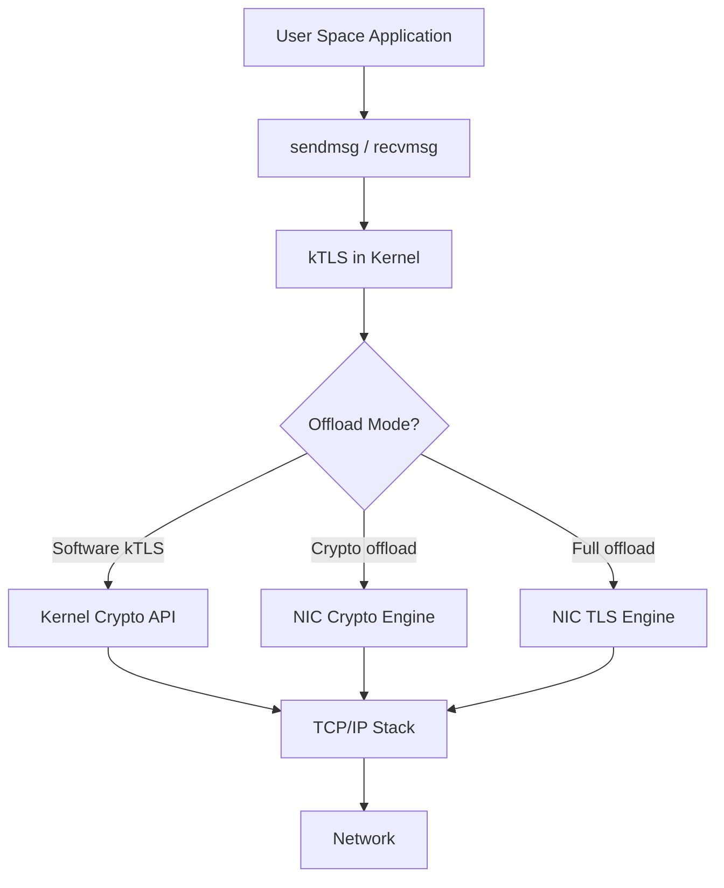
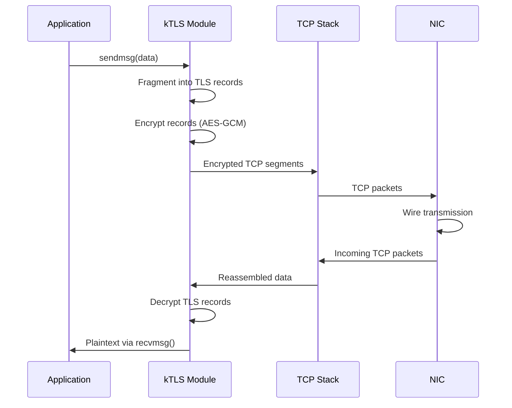
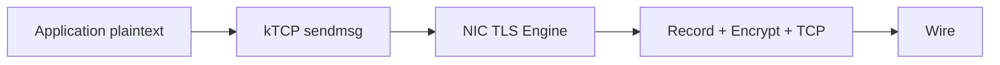

# TLS Offload

## Introduction

Transport Layer Security (TLS) offload moves cryptographic operations from the kernel's
software implementation to hardware accelerators or network interface cards (NICs).
Linux implements **kTLS** (kernel TLS) as the foundation, enabling the kernel to handle
TLS record framing directly. Combined with hardware offload, this achieves near-line-rate
encrypted throughput while reducing CPU utilization. TLS offload is critical for servers
handling massive volumes of HTTPS traffic.

## Architecture Overview



## kTLS: Kernel TLS

kTLS (introduced in Linux 4.13) moves TLS record handling into the kernel. Applications
continue using standard socket APIs, but the kernel handles encryption/decryption.

### How kTLS Works



### Enabling kTLS

```c
#include <netinet/tcp.h>
#include <linux/tls.h>

int enable_ktls(int sockfd, const unsigned char *key,
                const unsigned char *iv, const unsigned char *salt)
{
    struct tls12_crypto_info_aes_gcm_128_crypto_info crypto_info;

    /* Set up crypto info for TLS 1.2 with AES-128-GCM */
    crypto_info.info.version = TLS_1_2_VERSION;
    crypto_info.info.cipher_type = TLS_CIPHER_AES_GCM_128;

    memcpy(crypto_info.key, key, TLS_CIPHER_AES_GCM_128_KEY_SIZE);
    memcpy(crypto_info.iv, iv, TLS_CIPHER_AES_GCM_128_IV_SIZE);
    memcpy(crypto_info.salt, salt, TLS_CIPHER_AES_GCM_128_SALT_SIZE);
    crypto_info.rec_seq = 0;  /* Will be managed by kernel */

    /* Enable kTLS for transmit */
    int ret = setsockopt(sockfd, SOL_TCP, TCP_ULP, "tls", sizeof("tls"));
    if (ret) return ret;

    /* Set the crypto parameters */
    ret = setsockopt(sockfd, SOL_TLS, TLS_TX, &crypto_info, sizeof(crypto_info));
    if (ret) return ret;

    /* Optionally enable receive side */
    ret = setsockopt(sockfd, SOL_TLS, TLS_RX, &crypto_info, sizeof(crypto_info));

    return ret;
}
```

### TLS Record Framing in Kernel

```c
/* net/tls/tls_sw.c - simplified record construction */
static int tls_push_record(struct sock *sk, int flags,
                            unsigned char record_type)
{
    struct tls_context *tls_ctx = tls_get_ctx(sk);
    struct tls_prot_info *prot = &tls_ctx->prot_info;
    struct tls_rec *rec;

    /* Allocate a TLS record */
    rec = kzalloc(sizeof(*rec), GFP_KERNEL);

    /* Build the TLS record header */
    /* ContentType (1 byte) + Version (2 bytes) + Length (2 bytes) */
    rec->header[0] = record_type;
    rec->header[1] = TLS_1_2_VERSION_MAJOR;
    rec->header[2] = TLS_1_2_VERSION_MINOR;
    rec->header[3] = (payload_len >> 8) & 0xFF;
    rec->header[4] = payload_len & 0xFF;

    /* Encrypt the payload */
    tls_encrypt(sk, rec);

    /* Send via TCP */
    tls_tx_records(sk, flags);

    return 0;
}
```

## Hardware Offload Modes

### Crypto Offload (TLS_CIPHER_HW)

In crypto offload mode, the NIC handles encryption/decryption but the kernel
still performs record framing:

```mermaid
graph LR
    A[kTLS Record Framing] --> B[Encrypted payload]
    B --> C[NIC Crypto Engine]
    C --> D[AES-GCM Encrypt]
    D --> E[TX DMA to NIC]
    E --> F[Wire]

    G[Wire] --> H[RX DMA]
    H --> I[NIC Crypto Engine]
    I --> J[AES-GCM Decrypt]
    J --> kTLS Kernel
```

### Full Offload (TLS_HW_RECORD)

In full offload, the NIC handles both record framing and encryption:



### NIC Capabilities Detection

```c
/* Query NIC TLS offload capabilities */
#include <linux/ethtool.h>

void check_tls_offload(int sock)
{
    struct ethtool_gfeatures features;
    struct ethtool_get_features_block blocks[1];

    features.size = 1;
    features.features[0].ethtool_mask = 0;

    if (ioctl(sock, ETHTOOL_GFEATURES, &features) == 0) {
        if (features.features[0].active & NETIF_F_HW_TLS_TX)
            printf("TX TLS hardware offload supported\n");
        if (features.features[0].active & NETIF_F_HW_TLS_RX)
            printf("RX TLS hardware offload supported\n");
    }
}
```

### Enabling Hardware Offload

```bash
# Enable TLS offload on a NIC
ethtool -K eth0 tls-hw-tx-offload on
ethtool -K eth0 tls-hw-rx-offload on

# Check current offload state
ethtool -k eth0 | grep tls
# tls-hw-tx-offload: on
# tls-hw-rx-offload: on
```

## Kernel Crypto API Integration

kTLS uses the kernel crypto API for software encryption:

```c
/* Cipher configuration for kTLS */
struct cipher_context {
    struct crypto_aead *aead;     /* AEAD cipher handle */
    u8 key[TLS_CIPHER_AES_GCM_128_KEY_SIZE];
    u8 salt[TLS_CIPHER_AES_GCM_128_SALT_SIZE];
    u64 rec_seq;                  /* Record sequence number */
};

/* Initialize AEAD cipher */
int init_tls_cipher(struct cipher_context *ctx)
{
    ctx->aead = crypto_alloc_aead("gcm(aes)", 0, 0);
    if (IS_ERR(ctx->aead))
        return PTR_ERR(ctx->aead);

    /* Set the key */
    crypto_aead_setkey(ctx->aead, ctx->key,
                       TLS_CIPHER_AES_GCM_128_KEY_SIZE);

    /* Set authentication tag size */
    crypto_aead_setauthsize(ctx->aead,
                             TLS_CIPHER_AES_GCM_128_TAG_SIZE);

    return 0;
}
```

## TLS 1.3 Support

Linux 6.x+ adds TLS 1.3 offload support with new cipher suites:

```c
/* TLS 1.3 with AES-256-GCM */
struct tls12_crypto_info_aes_gcm_256_crypto_info crypto_info;
crypto_info.info.version = TLS_1_3_VERSION;
crypto_info.info.cipher_type = TLS_CIPHER_AES_GCM_256;

/* TLS 1.3 with ChaCha20-Poly1305 */
struct tls12_crypto_info_chacha20_poly1305_crypto_info chacha_info;
chacha_info.info.version = TLS_1_3_VERSION;
chacha_info.info.cipher_type = TLS_CIPHER_CHACHA20_POLY1305;
```

## Multi-buffer Encryption

kTLS leverages the kernel's multi-buffer crypto infrastructure for SIMD-optimized
encryption:

```c
/* Multi-buffer crypto processes multiple blocks in parallel */
/* Uses AVX-512 / AVX2 / NEON instructions */
/* Particularly effective for bulk data transfer */
```

### SIMD Crypto Performance

| Instruction Set | AES-GCM-128 Throughput | CPU Savings vs Software |
|----------------|----------------------|----------------------|
| Scalar | 1 GB/s | Baseline |
| AES-NI + SSE | 5 GB/s | ~5x |
| AES-NI + AVX2 | 10 GB/s | ~10x |
| AES-NI + AVX-512 | 20 GB/s | ~20x |
| Hardware NIC | 100+ Gbps | Offloaded |

## Integration with NGINX / Apache

### NGINX Configuration

```nginx
# NGINX with kTLS support (requires OpenSSL 3.0+ or BoringSSL)
# Compile with: ./configure --with-openssl-opt=enable-ktls

server {
    listen 443 ssl;
    ssl_certificate /etc/ssl/cert.pem;
    ssl_certificate_key /etc/ssl/key.pem;

    # kTLS is enabled automatically when supported
    # Verify with: openssl ciphers -v | grep GCM
}
```

### Verifying kTLS is Active

```bash
# Check if kTLS module is loaded
lsmod | grep tls

# Monitor kTLS stats
cat /proc/net/tls_stat

# Output example:
# TlsCurrTxSw           10
# TlsCurrRxSw           8
# TlsCurrTxDevice       2      # Hardware offloaded
# TlsCurrRxDevice       0
# TlsDecryptFail        0
```

## Performance Characteristics

### Throughput Comparison

| Setup | Throughput (100GbE) | CPU Usage |
|-------|-------------------|-----------|
| OpenSSL userspace | ~30 Gbps | 100% (8 cores) |
| kTLS software | ~50 Gbps | 100% (4 cores) |
| kTLS + crypto offload | ~90 Gbps | 10% (1 core) |
| kTLS + full offload | ~98 Gbps | 2% |

### Zero-copy Sendfile

kTLS enables zero-copy file serving by combining `sendfile()` with TLS:

```c
/* Zero-copy TLS file serving */
ssize_t sendfile_tls(int out_fd, int in_fd, off_t *offset, size_t count)
{
    /* kTLS handles TLS framing transparently */
    /* File data is encrypted in-place by NIC or kernel crypto */
    return sendfile(out_fd, in_fd, offset, count);
}
```

## Supported NICs

| Vendor | Model | Crypto Offload | Full Offload |
|--------|-------|---------------|-------------|
| Mellanox | ConnectX-6 Dx | ✓ | ✓ |
| Mellanox | ConnectX-7 | ✓ | ✓ |
| Intel | E810 | ✓ | - |
| Broadcom | BCM57800 | ✓ | - |
| Netronome | Agilio | ✓ | ✓ |

## Kernel Configuration

```
CONFIG_TLS=y                    # kTLS support
CONFIG_TLS_DEVICE=y             # Hardware offload support
CONFIG_CRYPTO_AES_GCM=y         # AES-GCM cipher
CONFIG_CRYPTO_AES_NI_INTEL=y    # AES-NI acceleration (x86)
```

## Security Considerations

1. **Key material**: Keys are passed to the kernel; hardware NICs store keys in secure memory
2. **Record boundaries**: kTLS preserves TLS record boundaries for proper decryption
3. **Sequence numbers**: Managed by kernel to prevent replay attacks
4. **Zero-copy risks**: Data may remain in DMA buffers after use

## Cross-References

- [TLS Overview](../../networking/tls.md) - TLS protocol fundamentals
- [TCP/IP Stack](tcpip.md) - TCP/IP implementation in Linux
- [Network Drivers](../drivers/net-drivers.md) - NIC driver architecture
- [Cryptography](../../security/cryptography.md) - Kernel crypto subsystem
- [Network Performance](../../performance/network.md) - Network optimization
- [XDP](xdp.md) - eXpress Data Path (related offload technology)

## Further Reading

- [kTLS documentation](https://www.kernel.org/doc/html/latest/networking/tls.html)
- [TLS offload (LWN.net)](https://lwn.net/Articles/666509/)
- [Mellanox TLS offload](https://docs.nvidia.com/networking/pages/viewpage.action?pageId=12013428)
- [kTLS and sendfile (Cloudflare blog)](https://blog.cloudflare.com/optimizing-tls-over-tcp-to-reduce-latency/)
- [OpenSSL kTLS support](https://github.com/openssl/openssl/blob/master/ssl/tls13_enc.c)
- [BoringSSL kTLS](https://boringssl.googlesource.com/boringssl/+/refs/heads/master/ssl/tls13_enc.cc)
- [Intel E810 TLS offload](https://www.intel.com/content/www/us/en/products/details/ethernet/800-series/e810.html)
