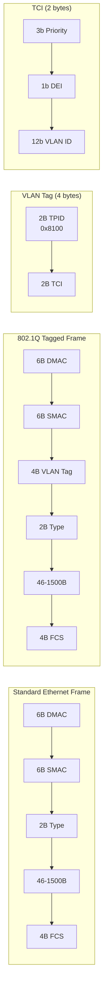

# VLANs

## Introduction

VLANs (Virtual Local Area Networks) are defined by IEEE 802.1Q and allow a single physical network to be logically segmented into multiple broadcast domains. Each VLAN operates as if it were a separate physical switch — devices on VLAN 100 cannot communicate with devices on VLAN 200 without a router or Layer 3 device.

In Linux, VLANs are implemented as virtual interfaces (subinterfaces) on top of physical or bonded interfaces. The kernel adds/removes 802.1Q tags (4 bytes) on outgoing/incoming frames, allowing a single physical link to carry traffic for multiple VLANs (trunk mode).

## 802.1Q Frame Format



The VLAN tag adds 4 bytes to the Ethernet frame:
- **TPID** (Tag Protocol Identifier): 0x8100 identifies a VLAN-tagged frame
- **Priority** (3 bits): 802.1p CoS (Class of Service), 0-7
- **DEI** (1 bit): Drop Eligible Indicator
- **VID** (12 bits): VLAN ID, 0-4095 (0 and 4095 are reserved)

## Creating VLAN Interfaces

### Using iproute2

```bash
# Ensure 8021q module is loaded
modprobe 8021q

# Create VLAN interface
ip link add link eth0 name eth0.100 type vlan id 100

# Configure IP
ip addr add 192.168.100.1/24 dev eth0.100
ip link set eth0.100 up

# Bring up parent interface
ip link set eth0 up

# Verify
ip -d link show eth0.100
# eth0.100@eth0: <BROADCAST,MULTICAST,UP,LOWER_UP> mtu 1500 ...
#     vlan protocol 802.1Q id 100

# View VLAN details
cat /proc/net/vlan/eth0.100
# eth0.100  VID: 100   REORDER_HDR: 1  dev->priv_flags: 1
#          total frames received          12345
#           total bytes received         1234567
#       Tagged frames received            12345
#      Priority tagged received               0
#         VLAN frames TX                 6789
#          total bytes transmitted       678901
```

### Multiple VLANs on One Interface (Trunk)

```bash
# Physical interface acts as trunk
ip link set eth0 up

# Create VLAN 100 (office)
ip link add link eth0 name eth0.100 type vlan id 100
ip addr add 192.168.100.1/24 dev eth0.100
ip link set eth0.100 up

# Create VLAN 200 (servers)
ip link add link eth0 name eth0.200 type vlan id 200
ip addr add 192.168.200.1/24 dev eth0.200
ip link set eth0.200 up

# Create VLAN 300 (management)
ip link add link eth0 name eth0.300 type vlan id 300
ip addr add 10.0.30.1/24 dev eth0.300
ip link set eth0.300 up

# Verify all VLANs
ip link show type vlan
# eth0.100@eth0: ... vlan protocol 802.1Q id 100
# eth0.200@eth0: ... vlan protocol 802.1Q id 200
# eth0.300@eth0: ... vlan protocol 802.1Q id 300
```

### Using vconfig (Legacy, Deprecated)

```bash
# Legacy method — use iproute2 instead
vconfig add eth0 100
vconfig set_flag eth0.100 1 1
ifconfig eth0.100 192.168.100.1 netmask 255.255.255.0 up
```

## VLAN Configuration Methods

### Using /etc/netplan (Ubuntu)

```yaml
# /etc/netplan/01-vlans.yaml
network:
  version: 2
  ethernets:
    eth0:
      dhcp4: false
  vlans:
    eth0.100:
      id: 100
      link: eth0
      addresses:
        - 192.168.100.1/24
    eth0.200:
      id: 200
      link: eth0
      addresses:
        - 192.168.200.1/24
```

### Using NetworkManager

```bash
# Create VLAN connection
nmcli connection add type vlan \
    con-name vlan100 \
    ifname eth0.100 \
    dev eth0 \
    id 100 \
    ipv4.addresses 192.168.100.1/24 \
    ipv4.method manual

# Activate
nmcli connection up vlan100

# Show VLAN
nmcli connection show vlan100 | grep vlan
# vlan.parent:    eth0
# vlan.id:        100
# vlan.protocol:  802.1Q
```

## Bridge VLAN Filtering

Linux bridges support VLAN-aware switching (802.1Q). See also [Bridging](./bridging.md).

```bash
# Create VLAN-aware bridge
ip link add name br0 type bridge vlan_filtering 1

# eth0: trunk port (carries VLANs 100, 200)
ip link set eth0 master br0
bridge vlan add dev eth0 vid 100
bridge vlan add dev eth0 vid 200

# tap0: access port on VLAN 100
ip link set tap0 master br0
bridge vlan add dev tap0 vid 100 pvid untagged
bridge vlan del dev tap0 vid 1  # remove default VLAN

# tap1: access port on VLAN 200
ip link set tap1 master br0
bridge vlan add dev tap1 vid 200 pvid untagged
bridge vlan del tap1 vid 1

# Show VLAN table
bridge vlan show
# port    vlan ids
# eth0     100
#          200
# tap0     1 PVID Egress Untagged
#          100 PVID Egress Untagged
# tap1     1 PVID Egress Untagged
#          200 PVID Egress Untagged
# br0      1 PVID Egress Untagged
```

### Bridge VLAN and STP

```bash
# Per-VLAN STP state
bridge vlan dev eth0 vid 100 state 3  # forwarding
bridge vlan dev eth0 vid 200 state 3  # forwarding

# View VLAN STP states
bridge -d vlan show
```

## VLAN + Bonding

Bonded interfaces can carry VLAN-tagged traffic:

```bash
# Create bond
ip link add bond0 type bond mode 802.3ad
ip link set eth0 master bond0
ip link set eth1 master bond0
ip link set bond0 up

# Create VLANs on bond
ip link add link bond0 name bond0.100 type vlan id 100
ip addr add 192.168.100.1/24 dev bond0.100
ip link set bond0.100 up

ip link add link bond0 name bond0.200 type vlan id 200
ip addr add 192.168.200.1/24 dev bond0.200
ip link set bond0.200 up
```

## Native (Untagged) VLAN

The native VLAN is the VLAN that receives untagged traffic on a trunk port. By default, it's VLAN 1:

```bash
# Set native VLAN on bridge port
bridge vlan add dev eth0 vid 100 pvid untagged

# pvid: port VLAN ID — tag incoming untagged frames with this VLAN
# untagged: strip VLAN tag on egress (frames leave untagged)

# Remove native VLAN 1
bridge vlan del dev eth0 vid 1
```

## 802.1ad (Q-in-Q / Stacked VLANs)

Q-in-Q allows VLAN stacking — an outer VLAN tag (service provider) wraps an inner VLAN tag (customer):

```bash
# Create Q-in-Q interface
ip link add link eth0 name eth0.100 type vlan id 100 protocol 802.1ad
ip link add link eth0.100 name eth0.100.200 type vlan id 200

# Outer tag: VLAN 100 (provider)
# Inner tag: VLAN 200 (customer)
ip addr add 192.168.200.1/24 dev eth0.100.200
ip link set eth0.100.200 up

# Verify
ip -d link show eth0.100.200
# eth0.100.200@eth0.100: ... vlan protocol 802.1ad id 200
```

## VLAN MTU Considerations

VLAN tagging adds 4 bytes to the Ethernet frame. With standard 1500 MTU:

```bash
# VLAN interface inherits parent MTU
ip link show eth0
# eth0: ... mtu 1500

ip link show eth0.100
# eth0.100@eth0: ... mtu 1500

# If parent supports jumbo frames, increase parent MTU first
ip link set eth0 mtu 9000
ip link add link eth0 name eth0.100 type vlan id 100
ip link set eth0.100 mtu 9000

# With Q-in-Q (double tagging), reduce by 8 bytes per level
# If parent MTU is 1500, inner VLAN MTU should be 1496
```

## VLAN Troubleshooting

```bash
# Check if 8021q module is loaded
lsmod | grep 8021q
# 8021q                  40960  0

# Load if missing
modprobe 8021q

# Verify VLAN interface is up
ip link show eth0.100

# Check VLAN configuration
cat /proc/net/vlan/config
# Name          | VLAN ID | Device
# eth0.100      | 100     | eth0
# eth0.200      | 200     | eth0

# Capture VLAN-tagged traffic
tcpdump -i eth0 -e vlan
# ... ethertype 802.1Q (0x8100), vlan 100 ...

# Capture untagged traffic on trunk
tcpdump -i eth0 -e not vlan

# Check for VLAN on bridge
bridge vlan show

# Verify with ethtool
ethtool -k eth0 | grep vlan
# vlan-stag-hw-parse: off
# vlan-challenged: off
# tx-vlan-offload: on
# rx-vlan-offload: on
# vlan-stag-hw-parse: off

# Test connectivity within VLAN
ping -I eth0.100 192.168.100.2

# View VLAN statistics
ip -s link show eth0.100
```

## VLAN Hardware Offloading

Modern NICs can handle VLAN tagging/untagging in hardware:

```bash
# Check VLAN offload capabilities
ethtool -k eth0 | grep vlan
# rx-vlan-offload: on
# tx-vlan-offload: on
# rx-vlan-stag-hw-parse: off
# tx-vlan-stag-hw-insert: off

# Enable/disable VLAN offload
ethtool -K eth0 rxvlan on
ethtool -K eth0 txvlan on

# View VLAN offload stats
ethtool -S eth0 | grep vlan
# rx_vlan_offload_good: 12345
# tx_vlan_offload_good: 6789
```

## Programmatically Managing VLANs

### Via Netlink

```c
/* Create VLAN via netlink (see Netlink chapter) */
/* RTM_NEWLINK with IFLA_INFO_KIND="vlan" and IFLA_INFO_DATA containing IFLA_VLAN_ID */
```

### Via libnl

```c
#include <netlink/route/link/vlan.h>

struct rtnl_link *vlan;
struct nl_sock *sk;

sk = nl_socket_alloc();
nl_connect(sk, NETLINK_ROUTE);

vlan = rtnl_link_alloc();
rtnl_link_set_name(vlan, "eth0.100");
rtnl_link_set_link(vlan, rtnl_link_name2idx(cache, "eth0"));
rtnl_link_set_type(vlan, "vlan");

/* Set VLAN ID */
struct nlattr *data = rtnl_link_vlan_get_id(vlan, 100);

rtnl_link_add(sk, vlan, NLM_F_CREATE);
```

## VLANs and Network Namespaces

```bash
# Create VLAN in a namespace
ip netns add ns1
ip link add link eth0 name eth0.100 type vlan id 100
ip link set eth0.100 netns ns1
ip netns exec ns1 ip addr add 192.168.100.2/24 dev eth0.100
ip netns exec ns1 ip link set eth0.100 up
ip netns exec ns1 ip link set lo up
```

## References

- [IEEE 802.1Q Standard](https://standards.ieee.org/standard/802_1Q-2018.html)
- [Linux VLAN Documentation](https://docs.kernel.org/networking/vlan.html)
- [Kernel 802.1Q module](https://git.kernel.org/pub/scm/linux/kernel/git/torvalds/linux.git/tree/net/8021q/)
- [man-pages: vlan(5)](https://man7.org/linux/man-pages/man5/vlan.5.html)
- [Red Hat: Configuring VLANs](https://docs.redhat.com/en/documentation/red_hat_enterprise_linux/9/html/configuring_and_managing_networking/configuring-vlans_configuring-and-managing-networking)

## Related Topics

- [Bridging](./bridging.md) — VLAN-aware bridge
- [Network Bonding](./bonding.md) — VLANs over bonded links
- [Network Namespaces](./namespaces.md) — VLANs in containers
- [Traffic Control](./tc.md) — VLAN-aware traffic classification
- [Netlink](./netlink.md) — Programmatic VLAN management
