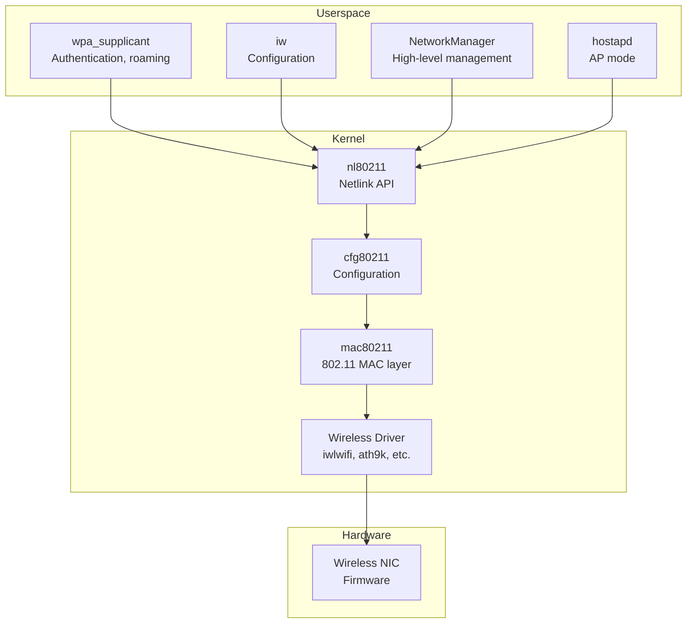

# Wireless Networking

## Introduction

Linux wireless networking is implemented through a layered architecture: the **mac80211** subsystem provides the IEEE 802.11 MAC layer implementation, **cfg80211** provides the configuration interface between userspace and the kernel, and **nl80211** is the netlink-based API for userspace tools. This architecture separates the complex 802.11 protocol handling from individual driver implementations, allowing wireless drivers to be relatively simple.

Understanding Linux wireless requires familiarity with the 802.11 standard, regulatory domains, authentication/encryption mechanisms, and the tools used to configure wireless interfaces (`iw`, `wpa_supplicant`, `hostapd`).

## Wireless Architecture



## cfg80211 and mac80211

### cfg80211

cfg80211 is the configuration API for wireless devices. It:
- Manages wireless device registration
- Handles regulatory compliance
- Provides the nl80211 userspace interface
- Validates channel/frequency configurations

### mac80211

mac80211 is a software MAC layer implementation. It handles:
- 802.11 frame management (beacons, probes, authentication)
- Scanning and roaming
- Power save mode
- Fragmentation and reassembly
- Rate control (minstrel_ht)
- QoS (WMM/WME)
- Virtual interfaces (STA, AP, Monitor, Mesh)

```c
/* mac80211 driver structure (what drivers implement) */
struct ieee80211_ops {
    int (*start)(struct ieee80211_hw *hw);
    void (*stop)(struct ieee80211_hw *hw);
    int (*add_interface)(struct ieee80211_hw *hw, struct ieee80211_vif *vif);
    void (*remove_interface)(struct ieee80211_hw *hw, struct ieee80211_vif *vif);
    int (*config)(struct ieee80211_hw *hw, u32 changed);
    void (*bss_info_changed)(struct ieee80211_hw *hw, struct ieee80211_vif *vif,
                              struct ieee80211_bss_conf *info, u64 changed);
    int (*start_ap)(struct ieee80211_hw *hw, struct ieee80211_vif *vif);
    void (*stop_ap)(struct ieee80211_hw *hw, struct ieee80211_vif *vif);
    int (*sta_add)(struct ieee80211_hw *hw, struct ieee80211_vif *vif,
                    struct ieee80211_sta *sta);
    void (*sta_remove)(struct ieee80211_hw *hw, struct ieee80211_vif *vif,
                        struct ieee80211_sta *sta);
    void (*tx)(struct ieee80211_hw *hw, struct ieee80211_tx_control *control,
               struct sk_buff *skb);
    void (*wake_tx_queue)(struct ieee80211_hw *hw, struct ieee80211_txq *txq);
    int (*set_key)(struct ieee80211_hw *hw, enum set_key_cmd cmd,
                    struct ieee80211_vif *vif, struct ieee80211_sta *sta,
                    struct ieee80211_key_conf *key);
    int (*hw_scan)(struct ieee80211_hw *hw, struct ieee80211_vif *vif,
                    struct ieee80211_scan_request *req);
    int (*set_rts_threshold)(struct ieee80211_hw *hw, u32 value);
    int (*set_antenna)(struct ieee80211_hw *hw, u32 tx_ant, u32 rx_ant);
    int (*get_survey)(struct ieee80211_hw *hw, int idx,
                       struct survey_info *survey);
    /* ... many more ... */
};
```

## Wireless Interface Modes

| Mode | Description | Use Case |
|------|-------------|----------|
| **Managed (STA)** | Client, connects to AP | Laptops, phones |
| **Access Point (AP)** | Acts as a wireless router | Routers, hotspots |
| **Monitor** | Captures all wireless frames | Packet capture, security |
| **Mesh (IBSS)** | Ad-hoc peer-to-peer | Mesh networks |
| **P2P** | Wi-Fi Direct | Device-to-device |
| **WDS** | Wireless Distribution System | Bridging APs |

## Using iw

`iw` is the primary tool for configuring wireless interfaces (replaces `iwconfig`):

### Basic Operations

```bash
# Show wireless interfaces
iw dev
# phy#0
# 	Interface wlan0
# 		ifindex 3
# 		wdev 0x1
# 		addr aa:bb:cc:dd:ee:ff
# 		type managed
# 		channel 6 (2437 MHz), width: 20 MHz, center1: 2437 MHz
# 		txpower 20.00 dBm

# Show wireless device capabilities
iw phy phy0 info
# Wiphy phy0
# 	max # scan SSIDs: 20
# 	max scan IEs length: 2048 bytes
# 	max # sched scan SSIDs: 20
# 	max # match sets: 11
# 	Retry short limit: 7
# 	Retry long limit: 4
# 	Coverage class: 0 (up to 0m)
# 	Device supports roaming.
# 	Supported Ciphers:
# 		* WEP40 (00-0f-ac:1)
# 		* WEP104 (00-0f-ac:5)
# 		* TKIP (00-0f-ac:2)
# 		* CCMP-128 (00-0f-ac:4)
# 	Supported channels:
# 		* 2412 MHz [1] (20.0 dBm)
# 		* 2417 MHz [2] (20.0 dBm)
# 		* 2422 MHz [3] (20.0 dBm)
# 		* 2427 MHz [4] (20.0 dBm)
# 		* 2432 MHz [5] (20.0 dBm)
# 		* 2437 MHz [6] (20.0 dBm)
# 		...
# 	Supported bands:
# 		Band 1:
# 			...
# 		Band 2:
# 			...
```

### Scanning

```bash
# Trigger scan (requires root)
iw dev wlan0 scan

# Scan for specific SSID
iw dev wlan0 scan ssid MyNetwork

# Pretty-print scan results
iw dev wlan0 scan | grep -E "SSID|signal|freq|capability"
# 	BSS aa:bb:cc:dd:ee:ff(on wlan0)
# 		freq: 2437
# 		signal: -45.00 dBm
# 		SSID: MyNetwork
# 		capability: ESS Privacy
# 	BSS 11:22:33:44:55:66(on wlan0)
# 		freq: 2462
# 		signal: -67.00 dBm
# 		SSID: NeighborWifi

# Scan and display in a table
iw dev wlan0 scan | awk '
  /^BSS/ { bss=$2 }
  /freq:/ { freq=$2 }
  /signal:/ { signal=$2 " " $3 }
  /SSID:/ { ssid=$2; printf "%s  %-25s %s  %s\n", bss, ssid, freq, signal }
'
```

### Connecting to Networks

```bash
# Connect to open network
iw dev wlan0 connect MyNetwork

# Connect to WPA2 network (usually requires wpa_supplicant)
iw dev wlan0 connect MyNetwork key 0:password123

# Disconnect
iw dev wlan0 disconnect

# Show current connection info
iw dev wlan0 link
# Connected to aa:bb:cc:dd:ee:ff (on wlan0)
# 	SSID: MyNetwork
# 	freq: 2437
# 	RX: 1234567 bytes (8765 packets)
# 	TX: 234567 bytes (1234 packets)
# 	signal: -45 dBm
# 	rx bitrate: 144.4 MBit/s MCS 15 40MHz short GI
# 	tx bitrate: 144.4 MBit/s MCS 15 40MHz short GI
# 	bss flags: short-preamble short-slot-time
# 	dtim period: 2
# 	beacon int: 100
```

### Interface Management

```bash
# Create monitor interface
iw phy phy0 interface add mon0 type monitor
ip link set mon0 up

# Create AP interface
iw phy phy0 interface add ap0 type __ap

# Change interface type
iw dev wlan0 set type monitor
iw dev wlan0 set type managed

# Delete interface
iw dev mon0 del

# Set channel
iw dev wlan0 set channel 6
iw dev wlan0 set channel 36 HT40+  # 5GHz, 40MHz wide

# Set frequency
iw dev wlan0 set freq 2437
iw dev wlan0 set freq 5180 80 5210  # 5GHz, 80MHz wide

# Set TX power
iw dev wlan0 set txpower fixed 1500  # 15 dBm in 100ths of dBm

# Get link statistics
iw dev wlan0 station dump
# Station aa:bb:cc:dd:ee:ff (on wlan0)
# 	inactive time:	0 ms
# 	rx bytes:	1234567
# 	rx packets:	8765
# 	tx bytes:	234567
# 	tx packets:	1234
# 	tx retries:	56
# 	tx failed:	2
# 	rx drop misc:	0
# 	signal:  	-45 dBm
# 	signal avg:	-46 dBm
# 	tx bitrate:	144.4 MBit/s MCS 15 40MHz short GI
# 	rx bitrate:	144.4 MBit/s MCS 15 40MHz short GI
# 	expected throughput:	72.2 MBit/s
```

## wpa_supplicant

`wpa_supplicant` handles WPA/WPA2/WPA3 authentication, key management, and roaming:

### Configuration File

```ini
# /etc/wpa_supplicant/wpa_supplicant-wlan0.conf
ctrl_interface=/var/run/wpa_supplicant
ctrl_interface_group=0
update_config=1

# Open network
network={
    ssid="OpenNetwork"
    key_mgmt=NONE
    priority=1
}

# WPA2-Personal
network={
    ssid="MyNetwork"
    psk="password123"
    key_mgmt=WPA-PSK
    proto=RSN
    pairwise=CCMP
    group=CCMP
    priority=10
}

# WPA2-Enterprise
network={
    ssid="CorpNetwork"
    key_mgmt=WPA-EAP
    eap=PEAP
    identity="user@corp.com"
    password="secret"
    phase2="auth=MSCHAPV2"
    priority=20
}

# WPA3-Personal (SAE)
network={
    ssid="WPA3Network"
    psk="password123"
    key_mgmt=SAE
    sae_password="password123"
    proto=RSN
    pairwise=CCMP-256
    group=CCMP-256
    priority=30
}

# Hidden network
network={
    ssid="HiddenNetwork"
    psk="password123"
    scan_ssid=1
    key_mgmt=WPA-PSK
}
```

### Running wpa_supplicant

```bash
# Start wpa_supplicant
wpa_supplicant -B -i wlan0 -c /etc/wpa_supplicant/wpa_supplicant-wlan0.conf

# Using systemd
systemctl start wpa_supplicant@wlan0

# wpa_cli interactive mode
wpa_cli -i wlan0
# > scan
# OK
# <3>CTRL-EVENT-SCAN-RESULTS
# > scan_results
# bssid / frequency / signal level / flags / ssid
# aa:bb:cc:dd:ee:ff	2437	-45	[WPA2-PSK-CCMP][ESS]	MyNetwork
# > add_network
# 0
# > set_network 0 ssid "MyNetwork"
# OK
# > set_network 0 psk "password123"
# OK
# > enable_network 0
# OK
# <3>CTRL-EVENT-CONNECTED - Connection to aa:bb:cc:dd:ee:ff completed
# > status
# bssid=aa:bb:cc:dd:ee:ff
# freq=2437
# ssid=MyNetwork
# id=0
# mode=station
# pairwise_cipher=CCMP
# group_cipher=CCMP
# key_mgmt=WPA2-PSK
# wpa_state=COMPLETED
# ip_address=192.168.1.100
```

### Command-Line Usage

```bash
# Add a network non-interactively
wpa_passphrase MyNetwork password123 > /etc/wpa_supplicant/wpa_supplicant-wlan0.conf

# Connect
wpa_supplicant -B -i wlan0 -c /etc/wpa_supplicant/wpa_supplicant-wlan0.conf
dhclient wlan0  # or: dhcpcd wlan0

# Check connection
wpa_cli -i wlan0 status
```

## Access Point Mode (hostapd)

```bash
# /etc/hostapd/hostapd.conf
interface=wlan0
driver=nl80211
ssid=MyAccessPoint
hw_mode=g
channel=6
ieee80211n=1
ht_capab=[HT40+][SHORT-GI-40]
wmm_enabled=1
auth_algs=1
wpa=2
wpa_passphrase=SecurePassword123
wpa_key_mgmt=WPA-PSK
rsn_pairwise=CCMP

# Start hostapd
hostapd /etc/hostapd/hostapd.conf

# With systemd
systemctl start hostapd

# Bridge AP to wired network
ip link add br-ap type bridge
ip link set wlan0 master br-ap
ip link set eth0 master br-ap
ip addr add 192.168.1.1/24 dev br-ap
ip link set br-ap up

# Run DHCP server on bridge
dnsmasq --interface=br-ap --dhcp-range=192.168.1.100,192.168.1.200,12h
```

## Regulatory Domains

Wireless operation is regulated by country. Linux enforces regulatory compliance:

```bash
# Show current regulatory domain
iw reg get
# country US: DFS-FCC
# 	(2402 - 2472 @ 40), (N/A, 30), (N/A)
# 	(5170 - 5250 @ 80), (N/A, 23), (N/A), AUTO-BW
# 	(5250 - 5330 @ 80), (N/A, 23), (0 ms), DFS, AUTO-BW
# 	(5490 - 5730 @ 160), (N/A, 23), (0 ms), DFS
# 	(5735 - 5835 @ 80), (N/A, 30), (N/A)
# 	(57240 - 71000 @ 2160), (N/A, 40), (N/A)

# Set regulatory domain
iw reg set DE  # Germany
iw reg set JP  # Japan
iw reg set CN  # China

# View available channels
iw phy phy0 channels

# View supported frequencies
iw phy phy0 info | grep -A5 "Frequencies"

# Note: Some channels require DFS (Dynamic Frequency Selection)
# DFS channels: 5250-5330 MHz and 5490-5730 MHz
# DFS requires radar detection; the AP must check for radar
# before using the channel and vacate if radar is detected
```

## Wireless Security Protocols

| Protocol | Year | Key Management | Encryption | Status |
|----------|------|----------------|------------|--------|
| WEP | 1997 | Static key | RC4 (broken) | Insecure |
| WPA (TKIP) | 2003 | WPA-PSK/WPA-EAP | TKIP (weak) | Deprecated |
| WPA2 (CCMP) | 2004 | WPA2-PSK/WPA2-EAP | AES-CCMP | Current |
| WPA3 | 2018 | SAE/WPA3-EAP | AES-GCMP/CCMP-256 | Latest |
| OWE | 2018 | None (open) | AES-CCMP | Opportunistic encryption |

## 802.11 Standards

| Standard | Name | Frequency | Max Speed | Channel Width |
|----------|------|-----------|-----------|---------------|
| 802.11b | Wi-Fi 1 | 2.4 GHz | 11 Mbps | 22 MHz |
| 802.11a | Wi-Fi 2 | 5 GHz | 54 Mbps | 20 MHz |
| 802.11g | Wi-Fi 3 | 2.4 GHz | 54 Mbps | 20 MHz |
| 802.11n | Wi-Fi 4 | 2.4/5 GHz | 600 Mbps | 20/40 MHz |
| 802.11ac | Wi-Fi 5 | 5 GHz | 6.9 Gbps | 20/40/80/160 MHz |
| 802.11ax | Wi-Fi 6 | 2.4/5 GHz | 9.6 Gbps | 20/40/80/160 MHz |
| 802.11ax | Wi-Fi 6E | 6 GHz | 9.6 Gbps | 20/40/80/160 MHz |
| 802.11be | Wi-Fi 7 | 2.4/5/6 GHz | 46 Gbps | Up to 320 MHz |

## Debugging Wireless

```bash
# View wireless events
iw event
# (scan started)
# (scan finished)
# connected to aa:bb:cc:dd:ee:ff

# View kernel wireless messages
dmesg | grep -i wifi
dmesg | grep -i wireless
dmesg | grep -i iwlwifi
dmesg | grep -i ath9k

# View connection quality
watch -n1 'iw dev wlan0 link | grep -E "signal|bitrate"'

# View wireless statistics
cat /proc/net/wireless
# Inter-| sta-|   Quality       |   Discarded packets              | Missed | WE
#  face | tion |link level noise|  nwid  crypt   frag  retry   misc | beacon | 22
# wlan0: 0000   70.  -45.  -256        0      0      0      2      0        0

# View firmware version
ethtool -i wlan0
# driver: iwlwifi
# version: 5.15.0-generic
# firmware-version: 72.daa05568.0
# expansion-rom-version:
# bus-info: 0000:02:00.0

# Packet capture in monitor mode
iw phy phy0 interface add mon0 type monitor
ip link set mon0 up
tcpdump -i mon0 -w capture.pcap

# View wpa_supplicant logs
journalctl -u wpa_supplicant@wlan0 -f

# Reconfigure wpa_supplicant
wpa_cli -i wlan0 reconfigure

# Force reassociation
wpa_cli -i wlan0 reassociate
```

## Common Issues

```bash
# "Device or resource busy" when changing mode
# Kill wpa_supplicant first
killall wpa_supplicant
iw dev wlan0 set type monitor

# Cannot find wireless interface
rfkill list all
# 0: phy0: Wireless LAN
# 	Soft blocked: no
# 	Hard blocked: no

# Unblock if blocked
rfkill unblock wifi

# Interface not showing up
ip link show wlan0
# If missing, check driver is loaded
lsmod | grep iwlwifi
modprobe iwlwifi

# Slow connection — check signal strength
iw dev wlan0 link | grep signal
# signal: -75 dBm  # Weak signal, move closer to AP

# DFS channel not available
# Some 5 GHz channels require DFS and may not be available
# Check with: iw phy phy0 channels
```

## References

- [Linux Wireless Wiki](https://wireless.wiki.kernel.org/)
- [Kernel Wireless Documentation](https://docs.kernel.org/networking/wireless/)
- [iw documentation](https://wireless.wiki.kernel.org/en/users/documentation/iw)
- [wpa_supplicant documentation](https://w1.fi/wpa_supplicant/)
- [IEEE 802.11 Standard](https://standards.ieee.org/standard/802_11-2020.html)
- [hostapd documentation](https://w1.fi/hostapd/)
- [LWN: The mac80211 subsystem](https://lwn.net/Articles/285416/)

## Related Topics

- [Network Drivers](../drivers/net-drivers.md) — Wireless driver implementation
- [Netlink](./netlink.md) — nl80211 uses generic netlink
- [Network Namespaces](./namespaces.md) — Wireless in containers
- [Bridging](./bridging.md) — Bridging wireless interfaces
- [Traffic Control](./tc.md) — Wireless QoS
