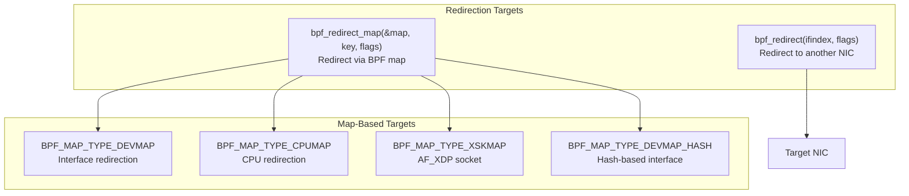
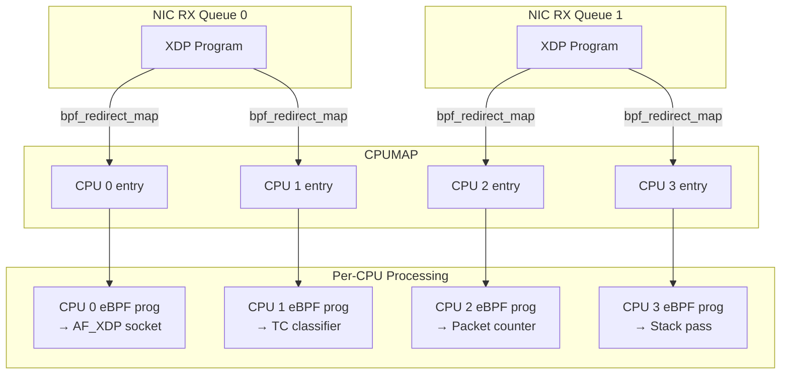
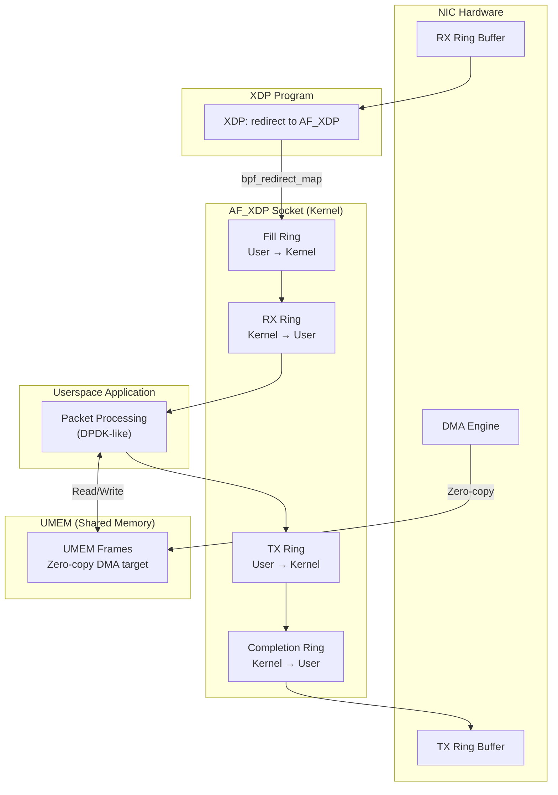
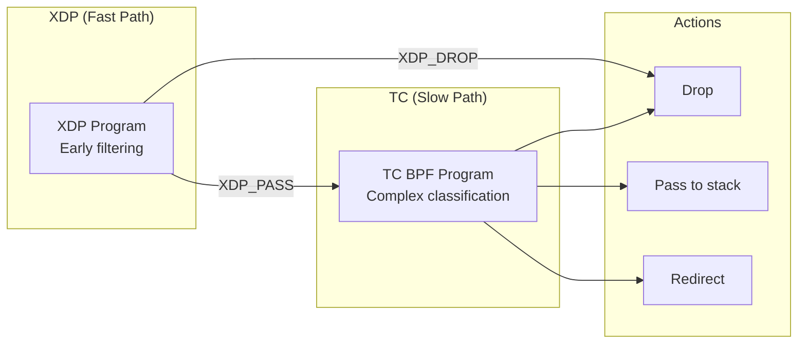

# XDP Advanced Programming

## Introduction

This guide covers advanced XDP programming beyond the basics: `bpf_redirect` for packet forwarding, AF_XDP for high-performance userspace packet processing, `cpumap` for per-CPU processing pipelines, and multi-buffer handling. It assumes familiarity with the [XDP overview](./xdp.md).

XDP programs that use `bpf_redirect` can forward packets to other interfaces, to AF_XDP sockets, or to per-CPU maps for load distribution — all without ever allocating an `sk_buff`. This enables building high-performance network functions (firewalls, load balancers, packet capture) that operate at line rate.

> **Key source files:** `net/core/xdp.c`, `include/net/xdp.h`, `net/core/dev.c`  
> **Kernel version:** Linux 5.10+ (basic), 6.x (advanced features)

---

## bpf_redirect: Packet Redirection

### Redirection Fundamentals

`bpf_redirect()` and `bpf_redirect_map()` are the primary mechanisms for moving packets between interfaces, CPUs, and AF_XDP sockets without going through the kernel networking stack.



### Interface Redirection with bpf_redirect

```c
/* Redirect packets to a specific interface */
#include <linux/bpf.h>
#include <bpf/bpf_helpers.h>
#include <linux/if_ether.h>
#include <linux/ip.h>

SEC("xdp")
int xdp_redirect_prog(struct xdp_md *ctx)
{
    void *data = (void *)(long)ctx->data;
    void *data_end = (void *)(long)ctx->data_end;

    struct ethhdr *eth = data;
    if ((void *)(eth + 1) > data_end)
        return XDP_ABORTED;

    /* Redirect all traffic to interface index 3 */
    __u32 target_ifindex = 3;

    /* bpf_redirect: direct redirect to an interface */
    return bpf_redirect(target_ifindex, 0);
}

char _license[] SEC("license") = "GPL";
```

### DEVMAP-Based Redirection

```c
/* Use a DEVMAP for flexible interface redirection */
#include <linux/bpf.h>
#include <bpf/bpf_helpers.h>

/* Map: key = source interface, value = destination interface */
struct {
    __uint(type, BPF_MAP_TYPE_DEVMAP);
    __uint(max_entries, 64);
    __type(key, __u32);
    __type(value, __u32);
} redirect_map SEC(".maps");

SEC("xdp")
int xdp_devmap_redirect(struct xdp_md *ctx)
{
    __u32 ingress = ctx->ingress_ifindex;

    /* Look up where to redirect based on ingress interface */
    __u32 *dst = bpf_map_lookup_elem(&redirect_map, &ingress);
    if (!dst)
        return XDP_PASS;

    /* Redirect to the mapped interface */
    return bpf_redirect_map(&redirect_map, ingress, 0);
}
```

### DEVMAP Hash for Dynamic Redirects

```c
/* BPF_MAP_TYPE_DEVMAP_HASH: redirect to arbitrary interfaces */
struct {
    __uint(type, BPF_MAP_TYPE_DEVMAP_HASH);
    __uint(max_entries, 1024);
    __type(key, __u32);       /* Arbitrary key */
    __type(value, __u32);     /* Interface index */
} devmap_hash SEC(".maps");

SEC("xdp")
int xdp_hash_redirect(struct xdp_md *ctx)
{
    void *data = (void *)(long)ctx->data;
    void *data_end = (void *)(long)ctx->data_end;

    struct ethhdr *eth = data;
    if ((void *)(eth + 1) > data_end)
        return XDP_ABORTED;

    /* Hash based on destination MAC for L2 switching */
    __u32 key = eth->h_dest[5] & 0x3F;  /* Last 6 bits */

    return bpf_redirect_map(&devmap_hash, key, 0);
}
```

---

## CPUMAP: Per-CPU Processing Pipelines

### Architecture

CPUMAP allows XDP programs to redirect packets to specific CPUs for further processing. This is critical for:
- **Load balancing** across CPU cores
- **RSS-like distribution** in software
- **Pipeline processing** where different CPUs handle different stages
- **IRQ affinity** alignment



### CPUMAP XDP Program

```c
/* XDP program that distributes packets across CPUs via cpumap */
#include <linux/bpf.h>
#include <bpf/bpf_helpers.h>
#include <linux/if_ether.h>
#include <linux/ip.h>

/* CPUMAP: key = CPU id, value = queue size */
struct {
    __uint(type, BPF_MAP_TYPE_CPUMAP);
    __uint(max_entries, 256);
    __type(key, __u32);
    __type(value, struct bpf_cpumap_val);
} cpu_map SEC(".maps");

/* Per-CPU packet counter */
struct {
    __uint(type, BPF_MAP_TYPE_PERCPU_ARRAY);
    __uint(max_entries, 256);
    __type(key, __u32);
    __type(value, __u64);
} cpu_pkt_count SEC(".maps");

SEC("xdp")
int xdp_cpumap_lb(struct xdp_md *ctx)
{
    void *data = (void *)(long)ctx->data;
    void *data_end = (void *)(long)ctx->data_end;

    struct ethhdr *eth = data;
    if ((void *)(eth + 1) > data_end)
        return XDP_ABORTED;

    /* Simple hash: distribute based on source MAC */
    __u32 cpu = eth->h_source[5] % 4;

    /* Update per-CPU counter */
    __u64 *count = bpf_map_lookup_elem(&cpu_pkt_count, &cpu);
    if (count)
        *count += 1;

    /* Redirect to target CPU */
    return bpf_redirect_map(&cpu_map, cpu, 0);
}
```

### CPUMAP with Attached eBPF Program

Starting with Linux 5.9, you can attach an eBPF program to a CPUMAP entry. This program runs on the target CPU after the redirect, enabling per-CPU processing logic:

```c
/* Program attached to CPUMAP entry — runs on the target CPU */
SEC("xdp")
int cpumap_process(struct xdp_md *ctx)
{
    void *data = (void *)(long)ctx->data;
    void *data_end = (void *)(long)ctx->data_end;

    struct ethhdr *eth = data;
    if ((void *)(eth + 1) > data_end)
        return XDP_ABORTED;

    /* Drop non-IPv4 traffic on this CPU */
    if (eth->h_proto != htons(0x0800))
        return XDP_DROP;

    /* Pass everything else to the normal stack */
    return XDP_PASS;
}
```

```bash
# Load and attach CPUMAP program
$ sudo bpftool prog load xdp_cpumap.o /sys/fs/bpf/xdp_cpumap
$ sudo bpftool map update pinned /sys/fs/bpf/cpu_map \
    key 0 0 0 0 value 64 0 0 0  # CPU 0, queue size 64
$ sudo bpftool map update pinned /sys/fs/bpf/cpu_map \
    key 1 0 0 0 value 64 0 0 0  # CPU 1, queue size 64

# Attach per-CPU program
$ sudo bpftool prog loadall cpumap_process.o /sys/fs/bpf/cpumap_progs
$ sudo bpftool map update pinned /sys/fs/bpf/cpu_map \
    key 0 0 0 0 value 64 0 0 0 prog_id <id>
```

---

## AF_XDP: High-Performance Userspace Packet Processing

### Architecture Overview

AF_XDP provides a zero-copy path from NIC to userspace. Packets are DMA'd directly into a shared memory region (UMEM), bypassing the entire kernel networking stack.



### Complete AF_XDP Application

```c
/* af_xdp_forward.c — High-performance packet forwarder */
#include <stdio.h>
#include <stdlib.h>
#include <string.h>
#include <unistd.h>
#include <sys/mman.h>
#include <net/if.h>
#include <bpf/xsk.h>
#include <bpf/bpf.h>

#define NUM_FRAMES    4096
#define FRAME_SIZE    2048
#define RX_BATCH_SIZE 64

struct xsk_socket_info {
    struct xsk_socket *xsk;
    struct xsk_umem *umem;
    struct xsk_ring_cons rx;
    struct xsk_ring_prod tx;
    struct xsk_ring_prod fill;
    struct xsk_ring_cons comp;
    void *umem_area;
    u32 outstanding_tx;
};

static struct xsk_socket_info *xsk_configure(const char *ifname, u32 queue_id)
{
    struct xsk_socket_info *xsk;
    struct xsk_socket_config xsk_cfg;
    struct xsk_umem_config umem_cfg;
    int ret;

    xsk = calloc(1, sizeof(*xsk));

    /* Allocate UMEM */
    xsk->umem_area = mmap(NULL, NUM_FRAMES * FRAME_SIZE,
                          PROT_READ | PROT_WRITE,
                          MAP_PRIVATE | MAP_ANONYMOUS, -1, 0);

    /* Configure UMEM */
    umem_cfg.fill_size = NUM_FRAMES;
    umem_cfg.comp_size = NUM_FRAMES;
    umem_cfg.frame_size = FRAME_SIZE;
    umem_cfg.frame_headroom = XSK_UMEM__DEFAULT_FRAME_HEADROOM;
    umem_cfg.flags = 0;

    ret = xsk_umem__create(&xsk->umem, xsk->umem_area,
                           NUM_FRAMES * FRAME_SIZE,
                           &xsk->fill, &xsk->comp, &umem_cfg);
    if (ret)
        goto error;

    /* Configure AF_XDP socket */
    xsk_cfg.rx_size = XSK_RING_CONS__DEFAULT_NUM_DESCS;
    xsk_cfg.tx_size = XSK_RING_PROD__DEFAULT_NUM_DESCS;
    xsk_cfg.libbpf_flags = XSK_LIBBPF_FLAGS__INHIBIT_PROG_LOAD;
    xsk_cfg.xdp_flags = 0;
    xsk_cfg.bind_flags = 0;

    ret = xsk_socket__create(&xsk->xsk, ifname, queue_id,
                              xsk->umem, &xsk->rx, &xsk->tx, &xsk_cfg);
    if (ret)
        goto error;

    /* Populate fill ring with UMEM frames */
    u32 idx;
    ret = xsk_ring_prod__reserve(&xsk->fill, NUM_FRAMES, &idx);
    if (ret != NUM_FRAMES)
        goto error;

    for (int i = 0; i < NUM_FRAMES; i++)
        *xsk_ring_prod__fill_addr(&xsk->fill, idx++) = i * FRAME_SIZE;

    xsk_ring_prod__submit(&xsk->fill, NUM_FRAMES);

    return xsk;

error:
    free(xsk);
    return NULL;
}

/* Main processing loop */
static void xsk_process(struct xsk_socket_info *xsk)
{
    u32 idx_rx = 0, idx_tx = 0;
    int rcvd, i;

    /* Receive packets */
    rcvd = xsk_ring_cons__peek(&xsk->rx, RX_BATCH_SIZE, &idx_rx);
    if (!rcvd)
        return;

    /* Reserve TX slots */
    int tx_slots = xsk_ring_prod__reserve(&xsk->tx, rcvd, &idx_tx);

    for (i = 0; i < rcvd; i++) {
        struct xdp_desc *rx_desc = xsk_ring_cons__rx_desc(&xsk->rx, idx_rx);
        void *pkt = xsk_umem__get_data(xsk->umem_area, rx_desc->addr);

        /* Process packet (example: swap MAC addresses for L2 forwarding) */
        struct ethhdr *eth = pkt;
        __u8 tmp[ETH_ALEN];
        memcpy(tmp, eth->h_dest, ETH_ALEN);
        memcpy(eth->h_dest, eth->h_source, ETH_ALEN);
        memcpy(eth->h_source, tmp, ETH_ALEN);

        /* Fill TX descriptor */
        if (i < tx_slots) {
            struct xdp_desc *tx_desc = xsk_ring_prod__tx_desc(&xsk->tx, idx_tx);
            tx_desc->addr = rx_desc->addr;
            tx_desc->len = rx_desc->len;
            idx_tx++;
        }

        idx_rx++;
    }

    /* Submit RX and TX */
    xsk_ring_cons__release(&xsk->rx, rcvd);
    if (tx_slots)
        xsk_ring_prod__submit(&xsk->tx, tx_slots);
}
```

### AF_XDP with libxdp

```c
/* Using libxdp for AF_XDP (modern API) */
#include <xdp/libxdp.h>
#include <xdp/xsk.h>

int main(int argc, char **argv)
{
    struct xdp_program *xdp_prog;
    struct xsk_socket *xsk;
    int ifindex;

    ifindex = if_nametoindex("eth0");

    /* Load XDP program that redirects to AF_XDP */
    xdp_prog = xdp_program__open_file("af_xdp_kern.o", "xdp_sock", NULL);
    xdp_program__attach(xdp_prog, ifindex, XDP_MODE_NATIVE, 0);

    /* Create AF_XDP socket */
    struct xsk_socket_config cfg = {
        .rx_size = 2048,
        .tx_size = 2048,
        .bind_flags = 0,
    };
    xsk_socket__create(&xsk, "eth0", 0, umem, &rx, &tx, &cfg);

    /* Main loop */
    while (1) {
        /* Poll and process */
        poll(&pfd, 1, 100);
        xsk_process(xsk);
    }

    xdp_program__detach(xdp_prog, ifindex, XDP_MODE_NATIVE, 0);
    return 0;
}
```

### AF_XDP XDP Program (Kernel Side)

```c
/* af_xdp_kern.bpf.c — XDP program for AF_XDP */
#include <linux/bpf.h>
#include <bpf/bpf_helpers.h>

struct {
    __uint(type, BPF_MAP_TYPE_XSKMAP);
    __uint(max_entries, 64);
    __type(key, __u32);
    __type(value, __u32);
} xsks_map SEC(".maps");

struct {
    __uint(type, BPF_MAP_TYPE_PERCPU_ARRAY);
    __uint(max_entries, 2);
    __type(key, __u32);
    __type(value, __u32);
} pkt_count SEC(".maps");

SEC("xdp")
int xdp_sock_prog(struct xdp_md *ctx)
{
    __u32 index = ctx->rx_queue_index;
    __u32 *cnt;
    __u32 key = 0;

    /* Count packets */
    cnt = bpf_map_lookup_elem(&pkt_count, &key);
    if (cnt)
        *cnt += 1;

    /* Try AF_XDP socket first */
    if (bpf_map_lookup_elem(&xsks_map, &index))
        return bpf_redirect_map(&xsks_map, index, 0);

    /* Fall through to kernel stack */
    key = 1;
    cnt = bpf_map_lookup_elem(&pkt_count, &key);
    if (cnt)
        *cnt += 1;

    return XDP_PASS;
}

char _license[] SEC("license") = "GPL";
```

---

## Multi-Buffer XDP

### XDP Multi-Buffer (mb) Support

Starting with Linux 5.18, XDP supports packets larger than a single page (previously limited to ~4KB):

```c
/* Multi-buffer aware XDP program */
#include <linux/bpf.h>
#include <bpf/bpf_helpers.h>

SEC("xdp")
int xdp_mb_handler(struct xdp_md *ctx)
{
    void *data = (void *)(long)ctx->data;
    void *data_end = (void *)(long)ctx->data_end;
    __u32 pkt_len = data_end - data;

    /* For multi-buffer packets, data_end extends to the last fragment */
    if (pkt_len > 4096) {
        /* This is a multi-buffer packet (e.g., jumbo frame) */
        /* Handle accordingly */
    }

    return XDP_PASS;
}
```

### Fragments Handling

```c
/* XDP multi-buffer: iterate over fragments */
/* Requires kernel 6.3+ for bpf_xdp_get_buff_len() */

SEC("xdp")
int xdp_frag_handler(struct xdp_md *ctx)
{
    /* Get total packet length including fragments */
    __u32 total_len = bpf_xdp_get_buff(ctx, 0, NULL, 0);

    if (total_len > 1514) {
        /* Jumbo frame or fragmented packet */
        /* Process all fragments as a contiguous buffer */
        void *data = (void *)(long)ctx->data;
        void *data_end = (void *)(long)ctx->data_end;
        __u32 linear_len = data_end - data;

        /* Linear portion is in data..data_end */
        /* Fragments are accessible via xdp_buff->xdp_frags */
    }

    return XDP_PASS;
}
```

---

## XDP with TC (Traffic Control) Integration

### XDP + TC Pipeline



```c
/* XDP program: fast-path filtering, pass interesting packets to TC */
SEC("xdp")
int xdp_fast_filter(struct xdp_md *ctx)
{
    void *data = (void *)(long)ctx->data;
    void *data_end = (void *)(long)ctx->data_end;

    struct ethhdr *eth = data;
    if ((void *)(eth + 1) > data_end)
        return XDP_ABORTED;

    /* Fast path: drop non-IP traffic */
    if (eth->h_proto != htons(ETH_P_IP))
        return XDP_DROP;

    struct iphdr *iph = (struct iphdr *)(eth + 1);
    if ((void *)(iph + 1) > data_end)
        return XDP_ABORTED;

    /* Fast path: drop obviously bad packets */
    if (iph->ttl == 0)
        return XDP_DROP;

    /* Pass interesting packets to TC for detailed classification */
    return XDP_PASS;
}
```

```c
/* TC BPF program: detailed packet classification */
#include <linux/bpf.h>
#include <bpf/bpf_helpers.h>
#include <linux/pkt_cls.h>

SEC("tc")
int tc_classify(struct __sk_buff *skb)
{
    /* TC has access to full sk_buff — more metadata available */
    void *data = (void *)(long)skb->data;
    void *data_end = (void *)(long)skb->data_end;

    /* Complex classification logic */
    /* Mark packets, set QoS class, etc. */

    return TC_ACT_OK;
}
```

---

## Advanced XDP Patterns

### XDP Tail Call Chain

```c
/* XDP tail calls: chain multiple programs for pipeline processing */
#include <linux/bpf.h>
#include <bpf/bpf_helpers.h>

struct {
    __uint(type, BPF_MAP_TYPE_PROG_ARRAY);
    __uint(max_entries, 4);
    __type(key, __u32);
    __type(value, __u32);
} prog_array SEC(".maps");

#define PROG_PARSE     0
#define PROG_FILTER    1
#define PROG_REWRITE   2
#define PROG_FORWARD   3

/* Stage 1: Parse headers */
SEC("xdp/parse")
int xdp_parse(struct xdp_md *ctx)
{
    void *data = (void *)(long)ctx->data;
    void *data_end = (void *)(long)ctx->data_end;

    struct ethhdr *eth = data;
    if ((void *)(eth + 1) > data_end)
        return XDP_ABORTED;

    /* Store metadata for next stage */
    /* ... */

    /* Tail call to filter stage */
    bpf_tail_call(ctx, &prog_array, PROG_FILTER);

    return XDP_PASS;
}

/* Stage 2: Filter */
SEC("xdp/filter")
int xdp_filter(struct xdp_md *ctx)
{
    /* Filtering logic */
    /* ... */

    /* Tail call to rewrite stage */
    bpf_tail_call(ctx, &prog_array, PROG_REWRITE);

    return XDP_PASS;
}

/* Stage 3: Rewrite headers */
SEC("xdp/rewrite")
int xdp_rewrite(struct xdp_md *ctx)
{
    /* Header modification */
    /* ... */

    /* Tail call to forward stage */
    bpf_tail_call(ctx, &prog_array, PROG_FORWARD);

    return XDP_PASS;
}

/* Stage 4: Forward decision */
SEC("xdp/forward")
int xdp_forward(struct xdp_md *ctx)
{
    /* Final forwarding decision */
    return bpf_redirect(3, 0);  /* Redirect to interface 3 */
}
```

### XDP Metadata

```c
/* XDP metadata: pass information from XDP to TC/other programs */
#include <linux/bpf.h>
#include <bpf/bpf_helpers.h>

struct xdp_meta {
    __u32 src_ip;
    __u32 dst_ip;
    __u16 src_port;
    __u16 dst_port;
    __u8  protocol;
    __u8  flags;
};

SEC("xdp")
int xdp_metadata(struct xdp_md *ctx)
{
    void *data = (void *)(long)ctx->data;
    void *data_end = (void *)(long)ctx->data_end;

    /* Adjust head to make room for metadata */
    int ret = bpf_xdp_adjust_meta(ctx, -(int)sizeof(struct xdp_meta));
    if (ret < 0)
        return XDP_PASS;

    void *meta = (void *)(long)ctx->data_meta;
    if (meta + sizeof(struct xdp_meta) > data)
        return XDP_PASS;

    /* Fill metadata */
    struct ethhdr *eth = data;
    if ((void *)(eth + 1) > data_end)
        return XDP_ABORTED;

    if (eth->h_proto == htons(ETH_P_IP)) {
        struct iphdr *iph = (struct iphdr *)(eth + 1);
        if ((void *)(iph + 1) > data_end)
            return XDP_ABORTED;

        struct xdp_meta *m = meta;
        m->src_ip = iph->saddr;
        m->dst_ip = iph->daddr;
        m->protocol = iph->protocol;
    }

    return XDP_PASS;
}
```

---

## Performance Optimization

### Batch Processing

```c
/* Optimize: process packets in batches */
/* AF_XDP naturally supports batch processing */

static void process_batch(struct xsk_socket_info *xsk)
{
    u32 idx_rx = 0, idx_tx = 0;
    int rcvd;

    /* Process up to 64 packets at a time */
    rcvd = xsk_ring_cons__peek(&xsk->rx, 64, &idx_rx);
    if (!rcvd) {
        /* Need more packets: refill fill ring first */
        refill_fill_ring(xsk);
        return;
    }

    /* Reserve TX space */
    int tx_ready = xsk_ring_prod__reserve(&xsk->tx, rcvd, &idx_tx);

    /* Process all packets */
    for (int i = 0; i < rcvd && i < tx_ready; i++) {
        struct xdp_desc *desc = xsk_ring_cons__rx_desc(&xsk->rx, idx_rx + i);
        void *pkt = xsk_umem__get_data(xsk->umem_area, desc->addr);

        /* Process */
        process_packet(pkt, desc->len);

        /* Copy to TX */
        struct xdp_desc *tx_desc = xsk_ring_prod__tx_desc(&xsk->tx, idx_tx + i);
        tx_desc->addr = desc->addr;
        tx_desc->len = desc->len;
    }

    /* Submit */
    xsk_ring_prod__submit(&xsk->tx, tx_ready);
    xsk_ring_cons__release(&xsk->rx, rcvd);

    /* Kick TX */
    if (sendto(xsk_socket__fd(xsk->xsk), NULL, 0, MSG_DONTWAIT, NULL, 0) < 0) {
        if (errno != EAGAIN && errno != ENOBUFS)
            perror("sendto");
    }
}
```

### Busy Polling

```c
/* Busy polling for minimum latency */
#include <linux/if_xdp.h>

/* Enable busy poll on AF_XDP socket */
int enable_busy_poll(int fd)
{
    /* Set busy poll timeout */
    int timeout = 50;  /* microseconds */
    setsockopt(fd, SOL_SOCKET, SO_BUSY_POLL, &timeout, sizeof(timeout));

    /* Set budget */
    int budget = 64;
    setsockopt(fd, SOL_SOCKET, SO_BUSY_POLL_BUDGET, &budget, sizeof(budget));

    return 0;
}

/* Polling loop with busy poll */
void busy_poll_loop(struct xsk_socket_info *xsk)
{
    struct pollfd fds = {
        .fd = xsk_socket__fd(xsk->xsk),
        .events = POLLIN,
    };

    while (1) {
        /* Busy poll: kernel spins waiting for packets */
        int ret = poll(&fds, 1, 0);  /* 0 timeout = busy poll */
        if (ret > 0) {
            process_batch(xsk);
        }
    }
}
```

### IRQ Affinity Alignment

```bash
# Align NIC IRQ affinity with AF_XDP processing CPUs
# This ensures RX queue N is processed on CPU N

# Check current IRQ affinity
$ cat /proc/irq/123/smp_affinity

# Set IRQ affinity for NIC queue 0 to CPU 0
$ echo 1 > /proc/irq/123/smp_affinity

# Set IRQ affinity for NIC queue 1 to CPU 1
$ echo 2 > /proc/irq/124/smp_affinity

# Use irqbalance or manual setup
$ sudo ethtool -L eth0 combined 4   # 4 RX/TX queues
```

---

## XDP Use Case: Software Load Balancer

### Complete L4 Load Balancer

```c
/* xdp_lb.bpf.c — XDP L4 load balancer */
#include <linux/bpf.h>
#include <bpf/bpf_helpers.h>
#include <linux/if_ether.h>
#include <linux/ip.h>
#include <linux/tcp.h>
#include <linux/udp.h>

#define MAX_BACKENDS 16

struct backend {
    __u32 ip;           /* Backend IP */
    __u8  mac[6];       /* Backend MAC */
    __u16 port;         /* Backend port */
    __u32 ifindex;      /* Backend interface */
    __u32 weight;       /* Load weight */
};

struct flow_key {
    __u32 src_ip;
    __u32 dst_ip;
    __u16 src_port;
    __u16 dst_port;
    __u8  protocol;
};

struct {
    __uint(type, BPF_MAP_TYPE_ARRAY);
    __uint(max_entries, MAX_BACKENDS);
    __type(key, __u32);
    __type(value, struct backend);
} backends SEC(".maps");

struct {
    __uint(type, BPF_MAP_TYPE_HASH);
    __uint(max_entries, 65536);
    __type(key, struct flow_key);
    __type(value, __u32);  /* Backend index */
} flow_table SEC(".maps");

/* VIP (Virtual IP) address */
#define VIP_ADDR 0x0A000001  /* 10.0.0.1 */

static __always_inline __u32 hash_flow(struct flow_key *key)
{
    return jhash_3words(key->src_ip, key->dst_ip,
                        (__u32)key->src_port << 16 | key->dst_port,
                        0x12345678);
}

SEC("xdp")
int xdp_load_balancer(struct xdp_md *ctx)
{
    void *data = (void *)(long)ctx->data;
    void *data_end = (void *)(long)ctx->data_end;

    /* Parse Ethernet */
    struct ethhdr *eth = data;
    if ((void *)(eth + 1) > data_end)
        return XDP_ABORTED;
    if (eth->h_proto != htons(ETH_P_IP))
        return XDP_PASS;

    /* Parse IP */
    struct iphdr *iph = (struct iphdr *)(eth + 1);
    if ((void *)(iph + 1) > data_end)
        return XDP_ABORTED;

    /* Only handle traffic to VIP */
    if (iph->daddr != htonl(VIP_ADDR))
        return XDP_PASS;

    /* Parse TCP/UDP */
    struct flow_key key = {
        .src_ip = iph->saddr,
        .dst_ip = iph->daddr,
        .protocol = iph->protocol,
    };

    if (iph->protocol == IPPROTO_TCP) {
        struct tcphdr *tcp = (struct tcphdr *)(iph + 1);
        if ((void *)(tcp + 1) > data_end)
            return XDP_ABORTED;
        key.src_port = tcp->source;
        key.dst_port = tcp->dest;
    } else if (iph->protocol == IPPROTO_UDP) {
        struct udphdr *udp = (struct udphdr *)(iph + 1);
        if ((void *)(udp + 1) > data_end)
            return XDP_ABORTED;
        key.src_port = udp->source;
        key.dst_port = udp->dest;
    } else {
        return XDP_PASS;
    }

    /* Look up existing flow */
    __u32 *backend_idx = bpf_map_lookup_elem(&flow_table, &key);
    if (!backend_idx) {
        /* New flow: select backend */
        __u32 hash = hash_flow(&key);
        __u32 idx = hash % MAX_BACKENDS;
        bpf_map_update_elem(&flow_table, &key, &idx, BPF_ANY);
        backend_idx = &idx;
    }

    /* Get backend */
    struct backend *backend = bpf_map_lookup_elem(&backends, backend_idx);
    if (!backend)
        return XDP_DROP;

    /* Rewrite destination */
    __builtin_memcpy(eth->h_dest, backend->mac, ETH_ALEN);
    iph->daddr = htonl(backend->ip);

    /* Recalculate IP checksum */
    iph->check = 0;
    iph->check = csum_fold(csum_partial(iph, iph->ihl * 4, 0));

    /* Rewrite TCP/UDP port if needed */
    if (iph->protocol == IPPROTO_TCP) {
        struct tcphdr *tcp = (struct tcphdr *)(iph + 1);
        if ((void *)(tcp + 1) > data_end)
            return XDP_ABORTED;
        tcp->dest = htons(backend->port);
        /* TCP checksum would need recalculation */
    }

    /* Redirect to backend interface */
    return bpf_redirect(backend->ifindex, 0);
}

char _license[] SEC("license") = "GPL";
```

---

## XDP Program Attachment and Management

### Loading and Attachment

```bash
# Attach XDP program (native mode)
$ sudo ip link set dev eth0 xdp obj xdp_prog.o sec xdp

# Attach with generic mode (fallback)
$ sudo ip link set dev eth0 xdp obj xdp_prog.o sec xdp generic

# Replace existing XDP program
$ sudo ip link set dev eth0 xdp obj xdp_new.o sec xdp

# Detach XDP program
$ sudo ip link set dev eth0 xdp off

# Using bpftool (preferred for advanced setups)
$ sudo bpftool prog load xdp_prog.o /sys/fs/bpf/xdp_prog
$ sudo bpftool net attach xdp id 42 dev eth0

# Multi-attachment (pinning)
$ sudo bpftool prog load xdp_prog.o /sys/fs/bpf/xdp_prog \
    map name cpu_map pinned /sys/fs/bpf/cpu_map
```

### Debugging XDP Programs

```bash
# Show attached XDP programs
$ sudo bpftool net show dev eth0
xdp:
id 42 tag abc123:xyz

# Show XDP program details
$ sudo bpftool prog show id 42
id 42 type xdp name xdp_load_balancer tag abc123:xyz
loaded_at 2024-01-01T00:00:00+0000 uid 0
xlated 1234B jited 567B memlock 4096B map_ids 1,2,3

# Dump XDP program maps
$ sudo bpftool map dump id 1

# Trace XDP return codes
$ sudo cat /sys/kernel/debug/tracing/trace_pipe
# Shows: xdp:prog_name action=XDP_PASS

# XDP statistics
$ ip -s link show eth0
# Shows: XDP: action stats
```

---

## Best Practices

1. **Always validate bounds** — every pointer dereference needs a bounds check
2. **Use per-CPU maps** — avoid cache contention for counters
3. **Batch AF_XDP operations** — process 64+ packets per poll iteration
4. **Align IRQ affinity** — match NIC queues to processing CPUs
5. **Use native mode** — generic mode is 10× slower
6. **Test with xdp-tools** — `xdp-filter`, `xdp-loader`, `xdp-bench`
7. **Monitor with bpftool** — `bpftool prog show`, `bpftool map dump`
8. **Handle multi-buffer** — check for jumbo frames and fragments
9. **Use tail calls for pipelines** — avoid monolithic programs
10. **Profile before deploying** — use `perf` to verify XDP is on the fast path

---

## References

- **XDP project** — [xdp-project.net](https://xdp-project.net/)
- **XDP tutorial** — [github.com/xdp-project/xdp-tutorial](https://github.com/xdp-project/xdp-tutorial)
- **AF_XDP documentation** — `Documentation/networking/af_xdp.rst`
- **Kernel source** — `net/core/xdp.c`, `include/net/xdp.h`
- **libxdp** — [github.com/xdp-project/xdp-tools](https://github.com/xdp-project/xdp-tools)
- **LWN: AF_XDP** — [lwn.net/Articles/750845/](https://lwn.net/Articles/750845/)
- **LWN: XDP multi-buffer** — [lwn.net/Articles/887989/](https://lwn.net/Articles/887989/)

## Related Topics

- [XDP Overview](./xdp.md) — Basic XDP concepts and architecture
- [eBPF for Networking](./ebpf.md) — eBPF networking programs
- [TC (Traffic Control)](./tc.md) — Traffic control with BPF
- [Netfilter](./netfilter.md) — Traditional packet filtering
- [Socket Options](./sockets.md) — Socket programming
- [Packet Capture](../networking/packet-capture.md) — Packet capture techniques
