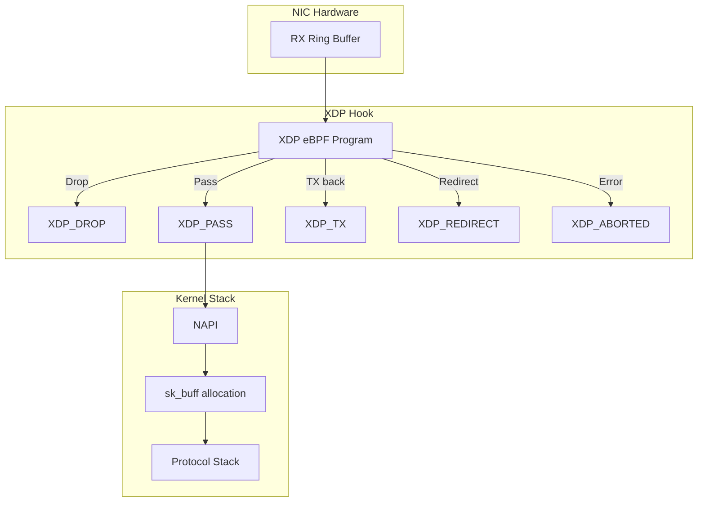
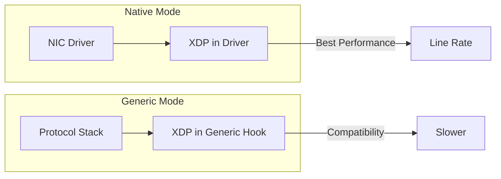
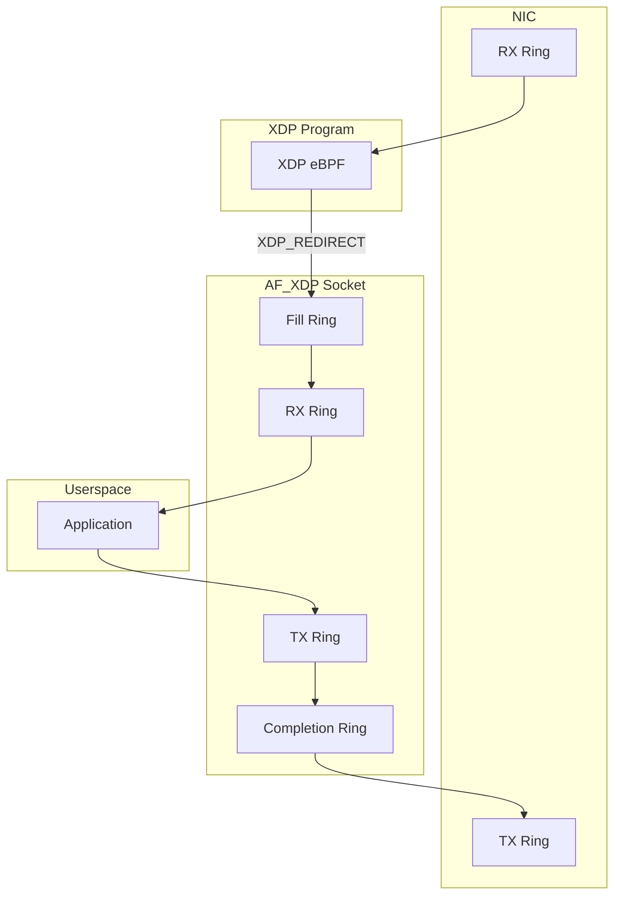
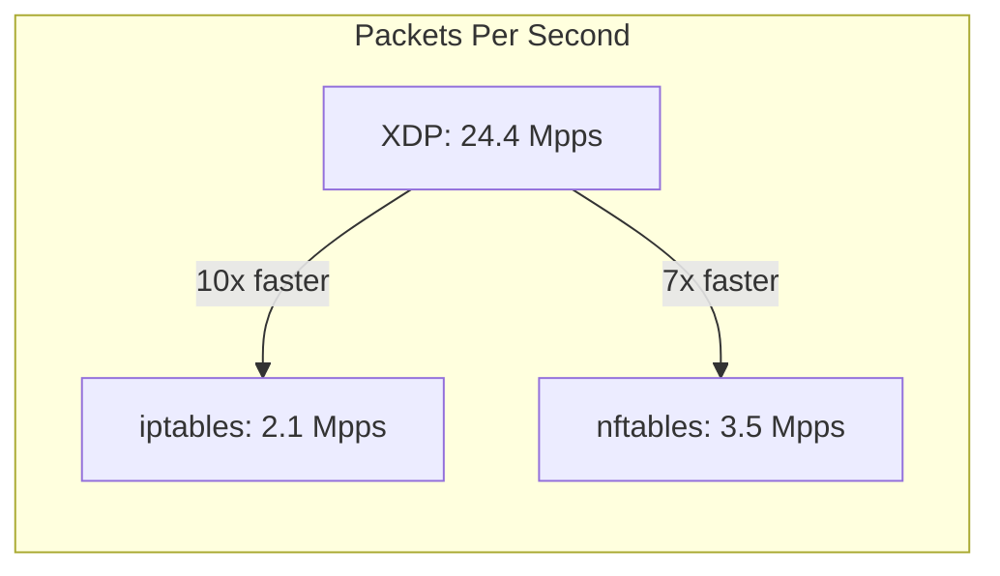

# XDP: eXpress Data Path

## Introduction

XDP (eXpress Data Path) is a high-performance, programmable packet processing framework in the Linux kernel. It operates at the lowest point in the networking stack — directly in the NIC driver, before any `sk_buff` allocation. This enables packet processing at line rate with minimal overhead, making XDP ideal for DDoS mitigation, load balancing, and firewall applications.

XDP uses eBPF (extended Berkeley Packet Filter) programs that are JIT-compiled to native code, running in a sandboxed environment with direct access to packet data.

## Architecture

### XDP Processing Model

XDP programs run at the earliest possible point in the receive path:



### XDP Return Codes

| Code | Value | Description |
|------|-------|-------------|
| `XDP_ABORTED` | 0 | Error, packet dropped, tracepoint triggered |
| `XDP_DROP` | 1 | Drop packet silently |
| `XDP_PASS` | 2 | Pass to normal network stack |
| `XDP_TX` | 3 | Transmit packet back out the same NIC |
| `XDP_REDIRECT` | 4 | Redirect to another NIC or map |

### XDP Execution Modes

XDP programs can run in two modes:



- **Native mode**: XDP program runs directly in the NIC driver, before `sk_buff` allocation. Requires driver support.
- **Generic mode**: XDP program runs after `sk_buff` allocation. Works with all drivers but slower.

## XDP Program Structure

### Basic XDP Program

```c
#include <linux/bpf.h>
#include <bpf/bpf_helpers.h>
#include <linux/if_ether.h>
#include <linux/ip.h>
#include <linux/tcp.h>

/* Define a map for statistics */
struct bpf_map_def SEC("maps") xdp_stats = {
    .type = BPF_MAP_TYPE_PERCPU_ARRAY,
    .key_size = sizeof(__u32),
    .value_size = sizeof(__u64),
    .max_entries = 4,
};

SEC("xdp")
int xdp_packet_counter(struct xdp_md *ctx)
{
    void *data = (void *)(long)ctx->data;
    void *data_end = (void *)(long)ctx->data_end;

    struct ethhdr *eth = data;

    /* Bounds check */
    if ((void *)(eth + 1) > data_end)
        return XDP_ABORTED;

    /* Update statistics */
    __u32 key = XDP_PASS;
    __u64 *counter = bpf_map_lookup_elem(&xdp_stats, &key);
    if (counter)
        *counter += 1;

    return XDP_PASS;
}

char _license[] SEC("license") = "GPL";
```

### Header Parsing

```c
/* Parse Ethernet and IP headers */
static __always_inline int parse_ethernet(struct xdp_md *ctx)
{
    void *data = (void *)(long)ctx->data;
    void *data_end = (void *)(long)ctx->data_end;

    struct ethhdr *eth = data;
    __u16 eth_type;

    /* Bounds check for Ethernet header */
    if ((void *)(eth + 1) > data_end)
        return XDP_ABORTED;

    eth_type = eth->h_proto;

    /* Handle VLAN tags */
    if (eth_type == htons(ETH_P_8021Q)) {
        struct vlan_hdr *vlan = (struct vlan_hdr *)(eth + 1);
        if ((void *)(vlan + 1) > data_end)
            return XDP_ABORTED;
        eth_type = vlan->h_vlan_encapsulated_proto;
    }

    /* Only process IPv4 */
    if (eth_type != htons(ETH_P_IP))
        return XDP_PASS;

    return parse_ipv4(ctx, data + sizeof(struct ethhdr), data_end);
}

/* Parse IPv4 header */
static __always_inline int parse_ipv4(struct xdp_md *ctx,
                                      void *nh, void *data_end)
{
    struct iphdr *iph = nh;

    /* Bounds check for IP header */
    if ((void *)(iph + 1) > data_end)
        return XDP_ABORTED;

    /* Only process TCP */
    if (iph->protocol != IPPROTO_TCP)
        return XDP_PASS;

    return parse_tcp(ctx, (void *)iph + (iph->ihl * 4), data_end);
}

/* Parse TCP header */
static __always_inline int parse_tcp(struct xdp_md *ctx,
                                     void *th, void *data_end)
{
    struct tcphdr *tcp = th;

    /* Bounds check for TCP header */
    if ((void *)(tcp + 1) > data_end)
        return XDP_ABORTED;

    /* Drop packets to port 80 */
    if (tcp->dest == htons(80))
        return XDP_DROP;

    return XDP_PASS;
}
```

## XDP Maps

### Map Types for XDP

```c
/* Per-CPU array for statistics */
struct bpf_map_def SEC("maps") stats_map = {
    .type = BPF_MAP_TYPE_PERCPU_ARRAY,
    .key_size = sizeof(__u32),
    .value_size = sizeof(__u64),
    .max_entries = 256,
};

/* Hash map for IP blacklist */
struct bpf_map_def SEC("maps") blacklist = {
    .type = BPF_MAP_TYPE_HASH,
    .key_size = sizeof(__u32),      /* IPv4 address */
    .value_size = sizeof(__u8),     /* Drop flag */
    .max_entries = 10000,
};

/* LRU hash for connection tracking */
struct bpf_map_def SEC("maps") conntrack = {
    .type = BPF_MAP_TYPE_LRU_HASH,
    .key_size = sizeof(struct flow_key),
    .value_size = sizeof(struct flow_value),
    .max_entries = 100000,
};

/* Ring buffer for packet copying to userspace */
struct bpf_map_def SEC("maps") ringbuf = {
    .type = BPF_MAP_TYPE_RINGBUF,
    .max_entries = 256 * 1024,
};
```

### Map Operations from Userspace

```python
#!/usr/bin/env python3
from bcc import BPF

# Load XDP program
b = BPF(src_file="xdp_filter.c")

# Attach to interface
fn = b.load_func("xdp_packet_filter", BPF.XDP)
b.attach_xdp("eth0", fn, 0)

# Access maps
stats = b.get_table("stats_map")
blacklist = b.get_table("blacklist")

# Add IP to blacklist
import socket
ip = socket.inet_aton("192.168.1.100")
blacklist[ctypes.c_uint(int.from_bytes(ip, 'big'))] = ctypes.c_uint8(1)

# Read statistics
for key, value in stats.items():
    print(f"Action {key.value}: {value.value} packets")

# Detach
b.remove_xdp("eth0", 0)
```

## AF_XDP

AF_XDP (Address Family XDP) is a new socket type that allows applications to receive and send packets through XDP, bypassing the kernel networking stack entirely.

### Architecture



### UMEM (User Memory)

AF_XDP uses a shared memory region called UMEM:

```c
/* UMEM structure */
struct xsk_umem {
    void *frames;           /* Memory region */
    size_t size;            /* Total size */
    size_t frame_size;      /* Size of each frame */
    size_t frame_headroom;  /* Headroom per frame */
};

/* Create AF_XDP socket */
int xsk_socket__create(struct xsk_socket **xsk,
                       const char *ifname,
                       __u32 queue_id,
                       struct xsk_umem *umem,
                       const struct xsk_socket_config *config);
```

### AF_XDP Application Example

```c
#include <bpf/xsk.h>
#include <linux/if_xdp.h>

#define NUM_FRAMES 4096
#define FRAME_SIZE 2048

int main(int argc, char **argv)
{
    struct xsk_socket *xsk;
    struct xsk_umem *umem;
    struct xsk_ring_cons rx;
    struct xsk_ring_prod tx;
    struct xsk_ring_prod fill;
    struct xsk_ring_cons comp;
    void *umem_area;

    /* Allocate UMEM */
    umem_area = mmap(NULL, NUM_FRAMES * FRAME_SIZE,
                     PROT_READ | PROT_WRITE,
                     MAP_PRIVATE | MAP_ANONYMOUS, -1, 0);

    /* Create UMEM */
    xsk_umem__create(&umem, umem_area,
                     NUM_FRAMES * FRAME_SIZE,
                     &fill, &comp, NULL);

    /* Create AF_XDP socket */
    xsk_socket__create(&xsk, "eth0", 0, umem,
                       &rx, &tx, NULL);

    /* Fill the fill ring with UMEM frames */
    for (int i = 0; i < NUM_FRAMES; i++) {
        __u64 *frame = xsk_ring_prod__fill_addr(&fill, i);
        *frame = i * FRAME_SIZE;
    }
    xsk_ring_prod__submit(&fill, NUM_FRAMES);

    /* Main processing loop */
    while (1) {
        /* Receive packets */
        __u32 idx_rx;
        int rcvd = xsk_ring_cons__peek(&rx, 64, &idx_rx);

        for (int i = 0; i < rcvd; i++) {
            struct xdp_desc *desc = xsk_ring_cons__rx_desc(&rx, idx_rx);
            void *pkt = xsk_umem__get_data(umem_area, desc->addr);

            /* Process packet */
            process_packet(pkt, desc->len);

            /* Return frame to fill ring */
            xsk_ring_prod__fill_addr(&fill, idx_rx);
            idx_rx++;
        }

        xsk_ring_cons__release(&rx, rcvd);
        xsk_ring_prod__submit(&fill, rcvd);
    }

    return 0;
}
```

## XDP Use Cases

### DDoS Mitigation

```c
/* XDP DDoS mitigation program */
SEC("xdp")
int xdp_ddos_mitigate(struct xdp_md *ctx)
{
    void *data = (void *)(long)ctx->data;
    void *data_end = (void *)(long)ctx->data_end;

    struct ethhdr *eth = data;
    struct iphdr *iph;

    if ((void *)(eth + 1) > data_end)
        return XDP_ABORTED;

    if (eth->h_proto != htons(ETH_P_IP))
        return XDP_PASS;

    iph = (struct iphdr *)(eth + 1);
    if ((void *)(iph + 1) > data_end)
        return XDP_ABORTED;

    /* Rate limiting per source IP */
    __u32 src_ip = iph->saddr;
    __u64 *count = bpf_map_lookup_elem(&rate_limit, &src_ip);
    if (count) {
        *count += 1;
        if (*count > 1000) {  /* 1000 packets per second */
            return XDP_DROP;
        }
    } else {
        __u64 init = 1;
        bpf_map_update_elem(&rate_limit, &src_ip, &init, BPF_ANY);
    }

    /* SYN flood protection */
    if (iph->protocol == IPPROTO_TCP) {
        struct tcphdr *tcp = (struct tcphdr *)(iph + 1);
        if ((void *)(tcp + 1) > data_end)
            return XDP_ABORTED;

        if (tcp->syn && !tcp->ack) {
            /* Track SYN rate per source */
            __u64 *syn_count = bpf_map_lookup_elem(&syn_rate, &src_ip);
            if (syn_count && *syn_count > 100) {
                return XDP_DROP;  /* Block SYN flood */
            }
        }
    }

    return XDP_PASS;
}
```

### Load Balancer

```c
/* XDP L4 load balancer */
SEC("xdp")
int xdp_load_balancer(struct xdp_md *ctx)
{
    void *data = (void *)(long)ctx->data;
    void *data_end = (void *)(long)ctx->data_end;

    /* Parse headers */
    struct ethhdr *eth = data;
    if ((void *)(eth + 1) > data_end)
        return XDP_ABORTED;

    if (eth->h_proto != htons(ETH_P_IP))
        return XDP_PASS;

    struct iphdr *iph = (struct iphdr *)(eth + 1);
    if ((void *)(iph + 1) > data_end)
        return XDP_ABORTED;

    if (iph->protocol != IPPROTO_TCP)
        return XDP_PASS;

    struct tcphdr *tcp = (struct tcphdr *)(iph + 1);
    if ((void *)(tcp + 1) > data_end)
        return XDP_ABORTED;

    /* Only balance traffic to VIP (Virtual IP) */
    if (iph->daddr != VIP_ADDR)
        return XDP_PASS;

    /* Select backend server using consistent hashing */
    __u32 hash = jhash_3words(iph->saddr, tcp->source,
                               tcp->dest, 0);
    __u32 backend_idx = hash % NUM_BACKENDS;

    struct backend *backend = bpf_map_lookup_elem(&backends,
                                                   &backend_idx);
    if (!backend)
        return XDP_DROP;

    /* Rewrite destination MAC and IP */
    __builtin_memcpy(eth->h_dest, backend->mac, ETH_ALEN);
    iph->daddr = backend->ip;

    /* Recalculate checksums */
    iph->check = 0;
    iph->check = csum_fold(csum_partial(iph, iph->ihl * 4, 0));

    /* Redirect to backend interface */
    return bpf_redirect(backend->ifindex, 0);
}
```

### Packet Mirroring

```c
/* XDP packet mirroring for monitoring */
SEC("xdp")
int xdp_mirror(struct xdp_md *ctx)
{
    void *data = (void *)(long)ctx->data;
    void *data_end = (void *)(long)ctx->data_end;

    /* Clone packet to monitoring interface */
    __u32 monitor_ifindex = 3;  /* Monitoring interface */
    int ret = bpf_redirect(monitor_ifindex, 0);

    /* Also pass to normal stack */
    return XDP_PASS;
}
```

## XDP Performance

### Benchmarking

```bash
# Check XDP mode
$ ip link show eth0
2: eth0: <BROADCAST,MULTICAST,UP,LOWER_UP> mtu 1500
    prog/xdp id 123 tag abc123:xyz

# XDP statistics
$ bpftool prog show id 123
    id 123 type xdp name xdp_filter tag abc123:xyz
    loaded_at 2024-01-01T00:00:00+0000 uid 0
    xlated 1234B jited 567B memlock 4096B map_ids 1,2

# Per-action statistics
$ bpftool map dump id 1
key: 00 00 00 00  value: 12345 67890 0 0
key: 01 00 00 00  value: 0 0 0 0
```

### Performance Comparison



Performance benchmarks (10Gbps NIC, 64-byte packets):

| Method | Packets/sec | CPU Usage |
|--------|-------------|-----------|
| XDP (native) | 24.4 Mpps | 1 core |
| XDP (generic) | 3.2 Mpps | 2 cores |
| nftables | 3.5 Mpps | 4 cores |
| iptables | 2.1 Mpps | 4 cores |
| DPDK | 37.4 Mpps | 4 cores |

## XDP Development Tools

### Loading XDP Programs

```bash
# Using iproute2
$ sudo ip link set dev eth0 xdp obj xdp_filter.o sec xdp

# Using bpftool
$ sudo bpftool prog load xdp_filter.o /sys/fs/bpf/xdp_filter
$ sudo bpftool net attach xdp id 123 dev eth0

# Remove XDP program
$ sudo ip link set dev eth0 xdp off

# Show attached programs
$ sudo bpftool net show dev eth0
```

### BCC (BPF Compiler Collection)

```python
#!/usr/bin/env python3
from bcc import BPF

program = """
#include <linux/bpf.h>
#include <linux/if_ether.h>

int hello(struct xdp_md *ctx) {
    void *data = (void *)(long)ctx->data;
    void *data_end = (void *)(long)ctx->data_end;
    int pkt_sz = data_end - data;

    bpf_trace_printk("packet size: %d\\n", pkt_sz);
    return XDP_PASS;
}
"""

b = BPF(text=program)
fn = b.load_func("hello", BPF.XDP)
b.attach_xdp("eth0", fn, 0)

# Read trace output
while True:
    print(b.trace_readline())
```

### libbpf

```c
/* Using libbpf to load XDP program */
#include <bpf/libbpf.h>
#include <bpf/bpf.h>

int main(int argc, char **argv)
{
    struct bpf_object *obj;
    struct bpf_program *prog;
    int ifindex;

    /* Open BPF object file */
    obj = bpf_object__open_file("xdp_filter.o", NULL);

    /* Load into kernel */
    bpf_object__load(obj);

    /* Find XDP program */
    prog = bpf_object__find_program_by_name(obj, "xdp_filter");

    /* Attach to interface */
    ifindex = if_nametoindex("eth0");
    bpf_xdp_attach(ifindex, bpf_program__fd(prog), 0, NULL);

    /* Detach on exit */
    bpf_xdp_detach(ifindex, 0, NULL);
    bpf_object__close(obj);

    return 0;
}
```

## XDP Program Types

XDP programs are eBPF programs of type `BPF_PROG_TYPE_XDP`. They are attached to network interfaces and invoked for every incoming packet before any `sk_buff` allocation. The kernel's XDP infrastructure supports several program types and attachment mechanisms:

### Native XDP Programs

The standard XDP program type (`SEC("xdp")`) runs in the NIC driver's receive path. It receives an `xdp_md` context:

```c
struct xdp_md {
    __u32 data;         /* Start of packet data */
    __u32 data_end;     /* End of packet data */
    __u32 data_meta;    /* Start of metadata (prependended to data) */
    __u32 ingress_ifindex;  /* Ingress interface index */
    __u32 rx_queue_index;   /* RX queue index */
    __u32 egress_ifindex;   /* Egress interface index (for XDP_REDIRECT) */
};
```

### XDP Attachment Modes

| Mode | Description | Performance |
|------|-------------|-------------|
| **Native** | Runs in NIC driver (requires driver support) | Best (line rate) |
| **Offloaded** | Runs on NIC hardware (SmartNICs like Netronome) | Wire speed |
| **Generic** | Runs after sk_buff allocation (all drivers) | Slower |

```bash
# Attach in native mode (default when driver supports it)
sudo ip link set dev eth0 xdp obj prog.o sec xdp

# Force generic mode
sudo ip link set dev eth0 xdp obj prog.o sec xdp generic

# Offloaded mode (requires hardware support)
sudo ip link set dev eth0 xdp obj prog.o sec xdp offloaded

# Check which mode is active
ip link show eth0
# prog/xdp id 123 tag abc123:xyz
```

### XDP Multi-Buffer (MB)

Starting with Linux 5.18, XDP supports multi-buffer packets (packets larger than a single page):

```c
/* Multi-buffer aware XDP program */
SEC("xdp")
int xdp_mb_example(struct xdp_md *ctx)
{
    void *data = (void *)(long)ctx->data;
    void *data_end = (void *)(long)ctx->data_end;

    /* Check if this is a multi-buffer packet */
    if (ctx->data_end - ctx->data > 4096) {
        /* Use xdp_buff helpers for multi-buffer */
        struct xdp_buff *xdp = (struct xdp_buff *)ctx;
        /* Process fragments */
    }

    return XDP_PASS;
}
```

## Best Practices

1. **Always validate bounds**: Every pointer access must be preceded by a bounds check
2. **Keep programs short**: XDP programs should be fast; avoid complex logic
3. **Use per-CPU maps**: For statistics and counters to avoid cache contention
4. **Test with generic mode first**: Then switch to native mode for production
5. **Monitor with bpftool**: Use `bpftool prog show` and `bpftool map dump` for debugging

## AF_XDP Socket Details

AF_XDP (Address Family XDP) is a socket type that allows applications to receive and send packets through XDP, bypassing the kernel networking stack entirely.

### Socket Creation and Rings

An AF_XDP socket (XSK) is created with the normal `socket()` syscall. Each XSK has two rings: the RX ring and the TX ring. These are registered and sized with `setsockopt(XDP_RX_RING)` and `setsockopt(XDP_TX_RING)`. At least one ring is mandatory per socket.

### UMEM Architecture

UMEM is a region of virtual contiguous memory divided into equal-sized frames. An UMEM is associated with a netdev and specific queue ID, created and configured via `XDP_UMEM_REG` setsockopt. Key properties:

- An AF_XDP socket is linked to a single UMEM, but one UMEM can have multiple sockets
- UMEM has two SPSC rings: FILL (user→kernel) and COMPLETION (kernel→user)
- To share UMEM between processes, use `XDP_SHARED_UMEM` flag in `bind()`
- Frames are referenced by offset (addr) within the UMEM region

### Ring Operations

| Ring | Direction | Purpose |
|------|-----------|--------|
| **FILL** | User→Kernel | Supply UMEM frames for RX |
| **RX** | Kernel→User | Received packet descriptors |
| **TX** | User→Kernel | Packet descriptors to send |
| **COMPLETION** | Kernel→User | Sent frames returned to user |

All rings are SPSC (single-producer, single-consumer) for performance. Ring sizes must be powers of two.

### AF_XDP Operating Modes

- **XDP_SKB mode**: Uses SKBs with generic XDP support, copies data to userspace. Works with all drivers.
- **XDP_DRV mode**: Uses native driver XDP support for better performance, still copies data to userspace.

### Packet Distribution with XSKMAP

A BPF map of type `BPF_MAP_TYPE_XSKMAP` distributes packets to XSKs. The XDP program redirects packets to specific map indices, and XDP validates the XSK is bound to the correct device and ring number.

## AF_XDP Socket Deep Dive

AF_XDP (Address Family XDP) is an address family optimized for high-performance packet processing. It enables XDP programs to redirect frames directly to a memory buffer in a user-space application, bypassing the entire kernel networking stack.

### Socket Creation and Binding

An AF_XDP socket (XSK) is created with the normal `socket()` syscall using `AF_XDP`. Each XSK has two rings (RX and TX) registered via `setsockopt(XDP_RX_RING)` and `setsockopt(XDP_TX_RING)`. At least one ring is mandatory. The socket is bound to a specific device and queue ID via `bind()` — traffic only flows after binding completes.

### UMEM Architecture Details

UMEM is a region of virtual contiguous memory divided into equal-sized chunks:
- Created and configured via `setsockopt(XDP_UMEM_REG)` (chunk size, headroom, start address, size)
- An AF_XDP socket is linked to a single UMEM, but one UMEM can serve multiple sockets
- UMEM has two SPSC rings: **FILL** (user→kernel) and **COMPLETION** (kernel→user)
- Frame addresses are offsets within the UMEM region

### Ring Semantics

| Ring | Direction | Producer | Consumer | Purpose |
|------|-----------|----------|----------|--------|
| **FILL** | User→Kernel | User | Kernel | Supply empty UMEM frames for RX |
| **RX** | Kernel→User | Kernel | User | Received packet descriptors (addr + len) |
| **TX** | User→Kernel | User | Kernel | Packet descriptors to transmit |
| **COMPLETION** | Kernel→User | Kernel | User | Sent frames returned for reuse |

All rings are **single-producer/single-consumer (SPSC)** for maximum performance. Ring sizes must be powers of two. Multiple processes/threads accessing the same ring require explicit synchronization.

### Operating Modes

- **`XDP_SKB` mode**: Uses SKBs with generic XDP support, copies data to userspace. Works with all drivers (fallback mode).
- **`XDP_DRV` mode**: Uses native driver XDP support for better performance, still copies to userspace.
- **Zero-copy mode** (`XDP_ZEROCOPY` bind flag): The NIC DMAs directly into UMEM frames, eliminating copies entirely. Requires driver support.
- **Copy mode** (`XDP_COPY` bind flag): Forces copy mode even if zero-copy is available.

### XSKMAP Packet Distribution

A BPF map of type `BPF_MAP_TYPE_XSKMAP` distributes packets to XSKs. The XDP program uses `bpf_redirect_map()` to send packets to a specific index in the map. XDP validates that the target XSK is bound to the correct device and queue — otherwise the packet is dropped.

```c
/* XDP program redirecting to AF_XDP socket */
struct {
    __uint(type, BPF_MAP_TYPE_XSKMAP);
    __uint(max_entries, 64);
    __type(key, __u32);
    __type(value, __u32);
} xsks_map SEC(".maps");

SEC("xdp")
int xdp_sock_prog(struct xdp_md *ctx) {
    /* Redirect packet to AF_XDP socket */
    return bpf_redirect_map(&xsks_map, ctx->rx_queue_index, 0);
}
```

### Shared UMEM

To share a UMEM between sockets, set `XDP_SHARED_UMEM` in `bind()` and pass the file descriptor of the existing socket via `sxdp_shared_umem_fd`. This works across different queue IDs and even different netdevs. Each socket has its own RX/TX rings, but FILL/COMPLETION rings are per unique (netdev, queue_id) tuple.

## References

- [The Linux Kernel Documentation](https://docs.kernel.org/)
- [LWN.net - Linux and free software news](https://lwn.net/)
- [GNU Project Documentation](https://www.gnu.org/doc/doc.html)
- [GNU Manuals](https://www.gnu.org/manual/manual.html)
- [Free Software Directory](https://directory.fsf.org/wiki/Main_Page)
- [Planet GNU](https://planet.gnu.org/)
- [Free Software Books](https://www.gnu.org/doc/other-free-books.html)

1. **XDP Project** — [xdp-project.net](https://xdp-project.net/)
2. **Linux Kernel Source** — `net/core/xdp.c`, `include/net/xdp.h`
3. **XDP Tutorial** — [github.com/xdp-project/xdp-tutorial](https://github.com/xdp-project/xdp-tutorial)
4. **AF_XDP Documentation** — [docs.kernel.org/networking/af_xdp.html](https://docs.kernel.org/networking/af_xdp.html)
4b. **XDP Documentation** — [docs.kernel.org/networking/xdp.html](https://docs.kernel.org/networking/xdp.html)
5. **LWN: Accelerating networking with AF_XDP** — [lwn.net/Articles/750845/](https://lwn.net/Articles/750845/)
6. *Linux Kernel Networking* by Rami Rosen (Apress)

## Related Topics

- [eBPF for Networking](ebpf.md) — eBPF program types for networking
- [Kernel Networking Overview](overview.md) — How packets flow through the stack
- [Netfilter](netfilter.md) — Traditional packet filtering
- [TCP/IP Implementation](tcpip.md) — TCP/IP in the kernel
