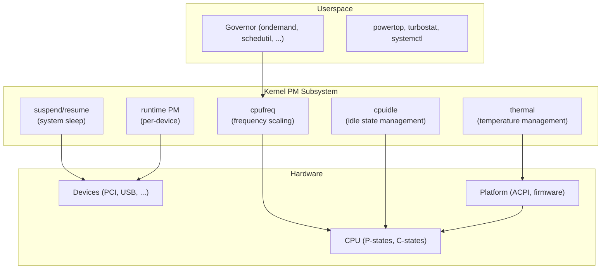
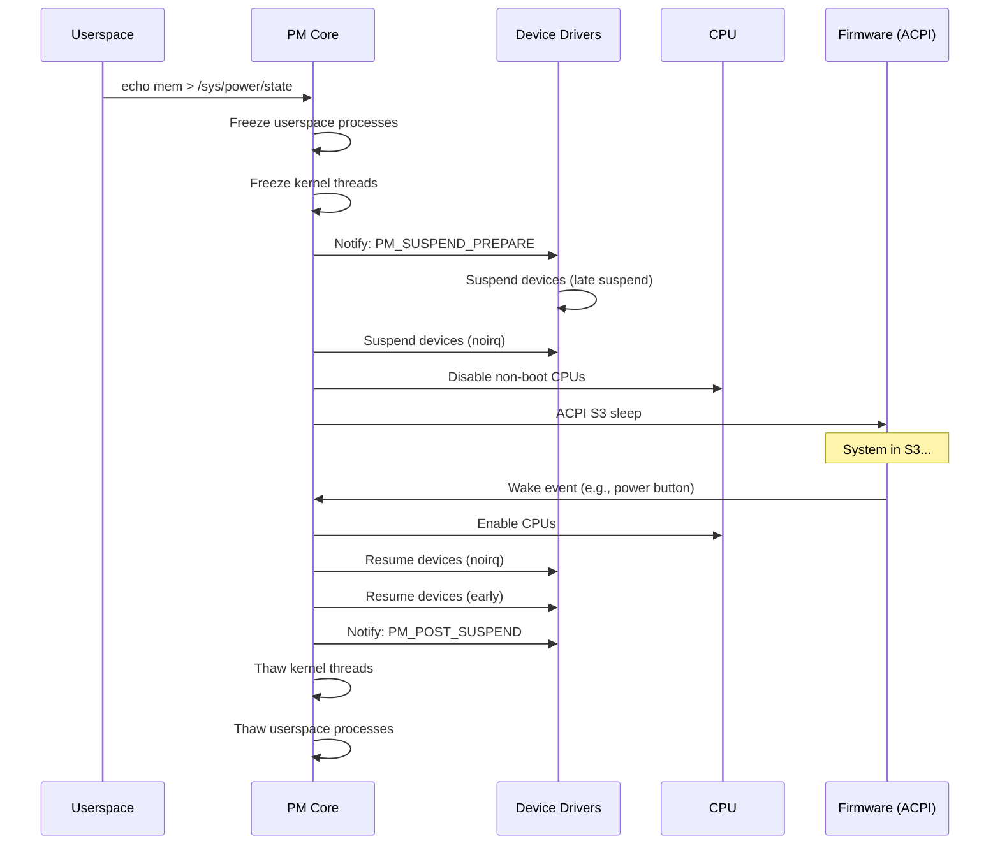
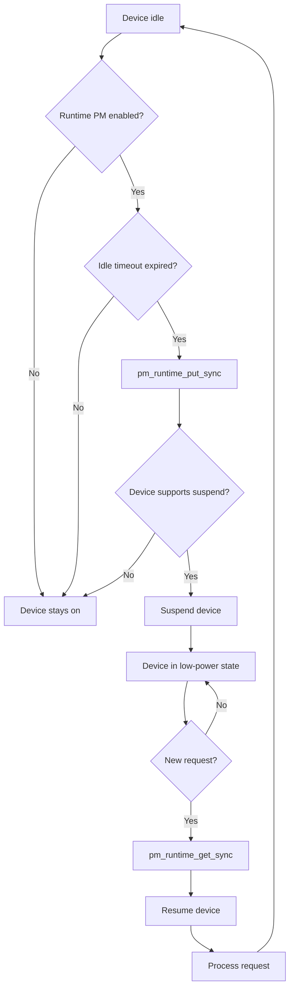

# Power Management

## Overview

Linux kernel power management (PM) encompasses CPU frequency scaling, CPU idle states, system suspend/resume, and runtime device power management. The goal is to minimize power consumption while maintaining acceptable performance — critical for laptops, mobile devices, embedded systems, and data centers.

The PM subsystem has several interacting components: **cpufreq** (CPU frequency scaling), **cpuidle** (CPU idle state management), **suspend/resume** (system-wide sleep), and **runtime PM** (per-device power management).

> **Key sources:** `drivers/cpufreq/`, `drivers/cpuidle/`, `kernel/power/`, `drivers/base/power/`

---

## Architecture



---

## CPU Frequency Scaling (cpufreq)

cpufreq adjusts CPU clock frequency and voltage based on workload to save power.

### P-States

Modern CPUs support multiple **P-states** (performance states) — combinations of frequency and voltage:

| P-State | Frequency | Voltage | Power |
|---------|-----------|---------|-------|
| P0 (Turbo) | 4.5 GHz | 1.35V | 125W |
| P1 (Base) | 3.5 GHz | 1.10V | 65W |
| P2 | 2.5 GHz | 0.90V | 35W |
| P3 (Min) | 800 MHz | 0.70V | 10W |

### Governors

Governors decide when and how to change CPU frequency:

| Governor | Strategy | Best For |
|----------|----------|----------|
| `performance` | Always max frequency | Benchmarking |
| `powersave` | Always min frequency | Battery saving |
| `ondemand` | Scale based on CPU utilization | General purpose |
| `conservative` | Gradual frequency changes | Smooth scaling |
| `schedutil` | Scale based on scheduler load | Modern default |

### schedutil Governor

The `schedutil` governor (default since Linux 4.7) uses **scheduler utilization** data to make frequency decisions, providing faster and more accurate scaling:

```c
/* drivers/cpufreq/cpufreq_schedutil.c */
static void sugov_update_single(struct update_util_data *hook, u64 time,
                                 unsigned int flags)
{
    struct sugov_cpu *sg_cpu = container_of(hook, struct sugov_cpu, update_util);
    unsigned long util = sugov_get_util(sg_cpu);
    unsigned long max = sg_cpu->max;

    /* Calculate target frequency based on utilization */
    unsigned long freq = map_util_freq(util, max, freq_next);

    /* Apply frequency change */
    sugov_update_commit(sg_policy, time, freq);
}
```

### cpufreq sysfs Interface

```bash
# List available frequencies
cat /sys/devices/system/cpu/cpu0/cpufreq/scaling_available_frequencies
# 800000 1200000 1800000 2500000 3500000 4500000

# List available governors
cat /sys/devices/system/cpu/cpu0/cpufreq/scaling_available_governors
# conservative ondemand userspace powersave performance schedutil

# Set governor
echo schedutil > /sys/devices/system/cpu/cpu0/cpufreq/scaling_governor

# Set frequency limits
echo 1800000 > /sys/devices/system/cpu/cpu0/cpufreq/scaling_max_freq
echo 800000 > /sys/devices/system/cpu/cpu0/cpufreq/scaling_min_freq

# Current frequency
cat /sys/devices/system/cpu/cpu0/cpufreq/scaling_cur_freq

# CPU frequency stats
cat /sys/devices/system/cpu/cpu0/cpufreq/stats/time_in_state
# 800000 12345
# 1800000 67890
# 3500000 23456
```

### Intel P-State Driver

Modern Intel CPUs use the `intel_pstate` driver instead of generic cpufreq:

```bash
# Check if intel_pstate is active
cat /sys/devices/system/cpu/cpu0/cpufreq/scaling_driver
# intel_pstate

# Intel-specific controls
cat /sys/devices/system/cpu/cpu0/cpufreq/base_frequency
cat /sys/devices/system/cpu/intel_pstate/max_perf_pct
cat /sys/devices/system/cpu/intel_pstate/min_perf_pct
cat /sys/devices/system/cpu/intel_pstate/turbo_pct

# Disable turbo boost
echo 1 > /sys/devices/system/cpu/intel_pstate/no_turbo
```

---

## CPU Idle States (cpuidle)

When a CPU has no work, it enters low-power **C-states**. Deeper states save more power but have higher wakeup latency.

### C-States

| C-State | Description | Latency | Power Savings |
|---------|-------------|---------|---------------|
| C0 | Active (running) | 0 | None |
| C1 (HALT) | Halted, instant wake | ~1 µs | Minimal |
| C1E | HALT with frequency drop | ~1 µs | Low |
| C3 (Sleep) | Clock stopped, cache flushed | ~50 µs | Moderate |
| C6 (Deep Power Down) | Voltage off, state saved | ~100 µs | High |
| C7+ | Deeper states (package) | ~200+ µs | Very high |

### cpuidle Governors

The cpuidle governor selects which idle state to enter when a CPU becomes idle. The decision is based on predicted idle duration versus the state's target residency and exit latency.

#### menu Governor

The `menu` governor predicts idle duration using:
- Timer wheel: scans pending timers to estimate next wakeup
- I/O activity: accounts for I/O completion interrupts
- Historical data: uses recent idle durations for prediction

```c
/* drivers/cpuidle/governors/menu.c — simplified */
static int menu_select(struct cpuidle_driver *drv,
                       struct cpuidle_device *dev)
{
    /* 1. Predict idle duration from timer wheel */
    predicted_ns = get_typical_interval(dev);

    /* 2. Factor in performance multiplier */
    predicted_ns *= performance_multiplier;

    /* 3. Find deepest state within predicted duration */
    for (i = drv->state_count - 1; i >= 0; i--) {
        if (drv->states[i].target_residency <= predicted_ns)
            return i;
    }
    return 0;  /* Fall back to C1 */
}
```

#### TEO Governor (Timer Events Oriented)

The TEO governor (Linux 5.0+) is designed to be more robust than `menu` for workloads with short, frequent timer wakeups:

```c
/* drivers/cpuidle/governors/teo.c — simplified concept */
/*
 * TEO categorizes idle states into "sleeping" and "non-sleeping":
 * - Non-sleeping: C1/C1E (low latency, minimal savings)
 * - Sleeping: C3+ (higher latency, better savings)
 *
 * TEO tracks how often timers vs non-timer events wake the CPU:
 * - If timers dominate → predict based on timer list
 * - If non-timer events dominate → use shallower states
 *
 * Key insight: the menu governor can be "fooled" by deep states
 * that have long target residencies but the CPU wakes up early.
 * TEO avoids this by focusing on timer events specifically.
 */
```

```bash
# Compare governors
cat /sys/devices/system/cpu/cpu0/cpuidle/current_governor_ro
# teo

# TEO-specific debug info
cat /sys/devices/system/cpu/cpu0/cpuidle/teo/name
```

### cpuidle sysfs Interface

```bash
# List available C-states
cat /sys/devices/system/cpu/cpu0/cpuidle/state0/name
cat /sys/devices/system/cpu/cpu0/cpuidle/state0/latency
cat /sys/devices/system/cpu/cpu0/cpuidle/state0/usage
cat /sys/devices/system/cpu/cpu0/cpuidle/state0/time

# Show all states
for state in /sys/devices/system/cpu/cpu0/cpuidle/state*; do
    echo "$(cat $state/name): latency=$(cat $state/latency)µs usage=$(cat $state/usage)"
done

# Disable a specific C-state
echo 1 > /sys/devices/system/cpu/cpu0/cpuidle/state3/disable

# View per-state time residency
cat /sys/devices/system/cpu/cpu0/cpuidle/state*/time
# Shows time (in µs) spent in each state
```

### Measuring C-State Residency

```bash
# turbostat shows C-state residency percentages
turbostat --Summary
# PkgWatt  CorWatt  GHz   Busy%  C1%  C6%  C7%
#  12.5     8.3     1.2    45.2   12.3 25.1 17.4

# Intel-specific: read MSR registers for precise residency
# Use rdmsr tool (msr-tools package)
rdmsr 0x3fd   # Core C3 residency counter
rdmsr 0x3fe   # Core C6 residency counter
rdmsr 0x3ff   # Core C7 residency counter

# Or via turbostat (aggregated)
turbostat --interval 1 | grep -E 'Busy|C1|C6|C7'
```

---

## Suspend/Resume

### System Sleep States

| State | Description | Wake Latency | State Saved |
|-------|-------------|--------------|-------------|
| **S0 (Running)** | Normal operation | — | — |
| **S1 (Standby)** | CPU halted, RAM active | ~1 µs | CPU/cache |
| **S2 (Sleep)** | CPU off, RAM active | ~1 ms | RAM |
| **S3 (Suspend to RAM)** | Most devices off, RAM active | ~1 s | RAM |
| **S4 (Hibernate)** | RAM saved to disk, power off | ~10 s | Disk |
| **S5 (Off)** | Power off | Full boot | Nothing |

### Suspend to RAM (S3)

```bash
# Enter suspend (S3)
echo mem > /sys/power/state
# or
systemctl suspend

# Check suspend support
cat /sys/power/state
# freeze mem disk

# Check wake sources
cat /sys/power/pm_wakeup_irq

# Wake-on-LAN
ethtool -s eth0 wol g
```

### Hibernate (S4)

```bash
# Hibernate (save RAM to disk)
echo disk > /sys/power/state
# or
systemctl hibernate

# Check hibernate support
cat /sys/power/disk
# [platform] shutdown reboot

# Hybrid sleep (suspend + hibernate backup)
systemctl hybrid-sleep
```

### Suspend/Resume Internals



---

## Runtime PM

Runtime PM manages power for individual devices while the system is running:

### Concept



### Runtime PM API

```c
/* include/linux/pm_runtime.h */

/* Increment usage count, resume if suspended */
int pm_runtime_get_sync(struct device *dev);

/* Decrement usage count, may suspend */
int pm_runtime_put_sync(struct device *dev);

/* Mark device as active, schedule suspend */
void pm_runtime_mark_last_busy(struct device *dev);

/* Enable/disable runtime PM for device */
int pm_runtime_enable(struct device *dev);
void pm_runtime_disable(struct device *dev);

/* Set autosuspend delay (ms) */
int pm_runtime_set_autosuspend_delay(struct device *dev, int delay);
```

### Per-Device Runtime PM

```bash
# Check runtime PM status
cat /sys/bus/pci/devices/0000:00:1f.2/power/runtime_status
# active / suspended / suspending / resuming

# Enable runtime PM
echo auto > /sys/bus/pci/devices/0000:00:1f.2/power/control

# Disable runtime PM (always on)
echo on > /sys/bus/pci/devices/0000:00:1f.2/power/control

# Set autosuspend delay (ms)
echo 1000 > /sys/bus/pci/devices/0000:00:1f.2/power/autosuspend_delay_ms

# Runtime PM statistics
cat /sys/bus/pci/devices/0000:00:1f.2/power/runtime_active_time
cat /sys/bus/pci/devices/0000:00:1f.2/power/runtime_suspended_time
```

---

## Thermal Management

Thermal management prevents overheating by throttling CPUs and devices:

### Thermal Zones

```bash
# List thermal zones
ls /sys/class/thermal/thermal_zone*/

# Current temperature
cat /sys/class/thermal/thermal_zone0/temp
# 45000 (45°C)

# Trip points (thresholds)
cat /sys/class/thermal/thermal_zone0/trip_point_0_temp
# 85000 (85°C)

# Cooling devices
ls /sys/class/thermal/cooling_device*/
cat /sys/class/thermal/cooling_device0/type
# Processor
```

### CPU Throttling

```bash
# Check if CPU is throttled
cat /sys/devices/system/cpu/cpu0/cpufreq/scaling_cur_freq
# If below max, may be thermal throttling

# Intel thermal throttling
cat /sys/devices/system/cpu/cpu0/thermal_throttle/core_throttle_count
```

## PM QoS Framework

The PM Quality of Service framework allows drivers and userspace to express latency and throughput requirements:

```c
/* include/linux/pm_qos.h */

/* CPU DMA latency — how long the CPU can stay in deep C-states */
struct pm_qos_request {
    struct plist_node node;
    int pm_qos_class;
};

/* Register a latency requirement */
struct pm_qos_request my_req;
my_req.pm_qos_class = PM_QOS_CPU_DMA_LATENCY;
pm_qos_add_request(&my_req, PM_QOS_CPU_DMA_LATENCY,
                   100);  /* Max 100 µs latency */

/* Update requirement */
pm_qos_update_request(&my_req, 50);  /* Now 50 µs max */

/* Remove requirement */
pm_qos_remove_request(&my_req);
```

### PM QoS sysfs Interface

```bash
# View current CPU DMA latency constraint
cat /dev/cpu_dma_latency
# Returns binary data; use xxd to read
xxd /dev/cpu_dma_latency
# Or use a C program to read the int32 value

# Network latency/throughput PM QoS
cat /sys/devices/system/cpu/cpu0/power/pm_qos_resume_latency_us
# 0  (default: no constraint)

# Set resume latency constraint
echo 100 > /sys/devices/system/cpu/cpu0/power/pm_qos_resume_latency_us

# Per-device PM QoS
ls /sys/bus/pci/devices/0000:00:1f.2/power/
# autosuspend_delay_ms  control  pm_qos_resume_latency_us
```

### Userspace PM QoS via /dev/cpu_dma_latency

```c
#include <fcntl.h>
#include <stdint.h>
#include <unistd.h>

/* Prevent CPU from entering deep C-states */
int fd = open("/dev/cpu_dma_latency", O_WRONLY);
int32_t latency_us = 100;  /* Max 100 µs */
write(fd, &latency_us, sizeof(latency_us));

/* Now the system will use shallow C-states only */
/* Close the file to release the constraint */
close(fd);
```

This is critical for real-time audio, industrial control, and other latency-sensitive applications.

---

## Power Measurement Tools

### powertop

```bash
# Install and run
powertop --auto-tune  # Apply all suggestions

# HTML report
powertop --html=power-report.html
```

### turbostat

```bash
# Show CPU power states
turbostat --Summary

# Per-core statistics
turbostat --interval 1

# Output columns:
# PkgWatt    — Package power consumption
# CorWatt    — Core power consumption
# GHz        — Actual frequency
# Busy%      — CPU utilization
# C1%, C6%, C7% — Time in each C-state
```

### Energy Model

```bash
# Energy model information (per-CPU)
cat /sys/devices/system/cpu/cpu0/cpufreq/energy_model/*/frequency
cat /sys/devices/system/cpu/cpu0/cpufreq/energy_model/*/power
```

---

## Common Tuning Scenarios

### Server (Performance)

```bash
# Set performance governor
echo performance > /sys/devices/system/cpu/cpu*/cpufreq/scaling_governor

# Disable deep C-states (reduces latency)
for state in /sys/devices/system/cpu/cpu*/cpuidle/state[3-9]*; do
    echo 1 > $state/disable 2>/dev/null
done

# Disable C-states in BIOS for lowest latency
```

### Laptop (Battery Life)

```bash
# Set powersave governor
echo powersave > /sys/devices/system/cpu/cpu*/cpufreq/scaling_governor

# Enable all C-states
for state in /sys/devices/system/cpu/cpu*/cpuidle/state*; do
    echo 0 > $state/disable 2>/dev/null
done

# Enable runtime PM for all PCI devices
for dev in /sys/bus/pci/devices/*/power/control; do
    echo auto > $dev 2>/dev/null
done

# Use TLP for automated power management
# apt install tlp && tlp start
```

### Real-Time / Low Latency

```bash
# Set performance governor
echo performance > /sys/devices/system/cpu/cpu*/cpufreq/scaling_governor

# Disable deep C-states
for state in /sys/devices/system/cpu/cpu*/cpuidle/state[2-9]*; do
    echo 1 > $state/disable 2>/dev/null
done

# Disable CPU frequency scaling
echo 0 > /sys/devices/system/cpu/cpu*/cpufreq/ondemand/up_threshold 2>/dev/null
```

---

## Common Issues

### System Won't Suspend

**Cause**: Device driver doesn't support suspend.

**Solutions**:
- Check `dmesg | grep -i suspend` for errors
- Disable problematic device's runtime PM
- Use `pm_trace` for debugging:
  ```bash
  echo 1 > /sys/power/pm_trace
  # After failed suspend, check dmesg for device info
  ```

### High Power Consumption

**Cause**: Wrong governor, deep C-states disabled, or runaway device.

**Solutions**:
- Use `powertop` to identify issues
- Check `turbostat` for C-state residency
- Verify `schedutil` governor is active
- Check for devices with runtime PM disabled

### CPU Stuck at Low Frequency

**Cause**: Thermal throttling or BIOS power limit.

**Solutions**:
- Check temperature: `cat /sys/class/thermal/thermal_zone*/temp`
- Check `turbostat` for thermal throttle counts
- Verify BIOS power settings
- Check `intel_pstate` limits

---

## Source Files

| File | Contents |
|------|----------|
| `drivers/cpufreq/` | cpufreq framework and governors |
| `drivers/cpuidle/` | cpuidle framework and governors |
| `kernel/power/` | Suspend/hibernate core |
| `drivers/base/power/` | Runtime PM framework |
| `drivers/thermal/` | Thermal management |
| `include/linux/pm.h` | PM core definitions |
| `include/linux/pm_runtime.h` | Runtime PM API |

---

## Further Reading

- **Kernel documentation**: `Documentation/admin-guide/pm/`
- **kernel-internals.org**: [Power Management](https://kernel-internals.org/power/)
- **Intel**: [Linux Power Management](https://01.org/linuxpm)
- **LWN**: ["An EEVDF CPU scheduler for Linux"](https://lwn.net/Articles/925371/) — scheduler/PM interaction
- **powertop**: [01.org/powertop](https://01.org/powertop)

---

## See Also

- [CPU Scheduling](./scheduler.md) — scheduler and cpufreq interaction
- [Thermal](./thermal.md) — thermal framework
- [NVMe](./nvme.md) — NVMe power states
- [Suspend/Resume](./suspend.md) — detailed suspend internals
