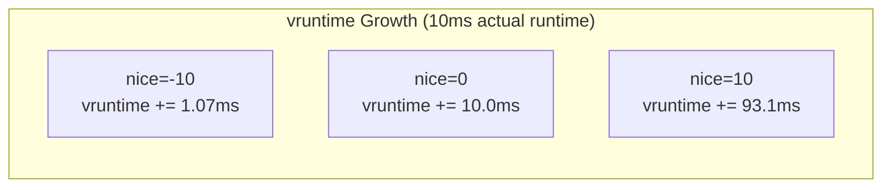
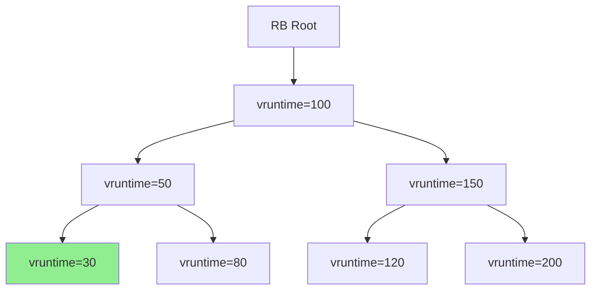
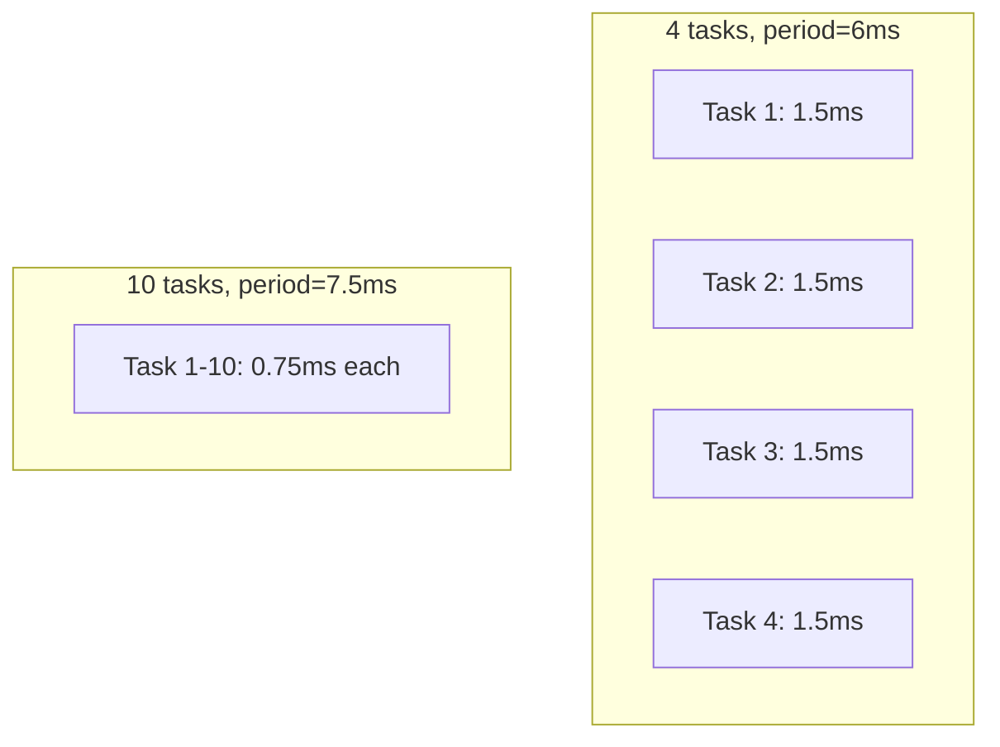
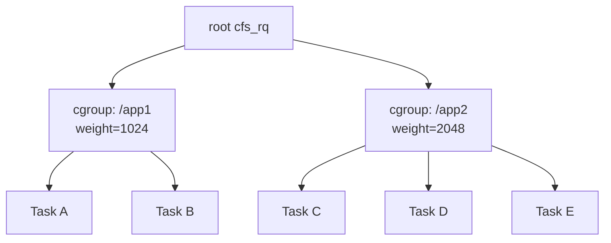

# CFS: The Completely Fair Scheduler

## Introduction

The **Completely Fair Scheduler (CFS)** is the default scheduling class for normal (non-real-time) processes in Linux since kernel 2.6.23 (2007). It replaced the earlier O(1) scheduler with a design based on a simple principle: **every task should get a fair share of CPU time proportional to its weight (nice value)**.

CFS models an "ideal, precise multi-tasking CPU" where each task runs at `1/n` of the CPU speed (where `n` is the number of runnable tasks). Since real CPUs can only run one task at a time, CFS tracks the **virtual runtime** (`vruntime`) of each task — the amount of CPU time a task has received, scaled by its weight. The scheduler always picks the task with the lowest `vruntime`, ensuring fairness.

> **Note**: As of Linux 6.6, CFS is being replaced by **EEVDF** (Earliest Eligible Virtual Deadline First). See [EEVDF Scheduler](eevdf.md) for the successor. The core concepts of `vruntime` and fair scheduling remain relevant.

## Virtual Runtime (vruntime)

### The Core Concept

`vruntime` is the key abstraction in CFS. It tracks how much CPU time a task has consumed, normalized by weight:

```
vruntime += actual_runtime * NICE_0_LOAD / task_weight
```

Where:
- `actual_runtime` — wall-clock CPU time consumed
- `NICE_0_LOAD` — weight of nice-0 task (1024)
- `task_weight` — weight based on the task's nice value

Tasks with **higher nice** (lower priority) have a **smaller weight** (higher weight divisor), so their `vruntime` grows faster — they get less CPU time.
Tasks with **lower nice** (higher priority) have a **larger weight** (lower weight divisor), so their `vruntime` grows slower — they get more CPU time.

### Nice-to-Weight Mapping

```c
/* kernel/sched/core.c */
const int sched_prio_to_weight[40] = {
 /* -20 */     88761,     71755,     56483,     46273,     36291,
 /* -15 */     29154,     23254,     18705,     14949,     11916,
 /* -10 */      9548,      7620,      6100,      4904,      3906,
 /*  -5 */      3121,      2501,      1991,      1586,      1277,
 /*   0 */      1024,       820,       655,       526,       423,
 /*   5 */       335,       272,       215,       172,       137,
 /*  10 */       110,        87,        70,        56,        45,
 /*  15 */        36,        29,        23,        18,        15,
};

/* Inverse weights for faster division (precomputed) */
const u32 sched_prio_to_wmult[40] = {
 /* -20 */     48388,     59856,     76040,     92818,    118348,
 /* -15 */    147320,    184698,    229616,    287308,    360437,
 /* -10 */    449829,    563644,    704093,    875809,   1099582,
 /*  -5 */   1376151,   1717300,   2157191,   2708050,   3363326,
 /*   0 */   4194304,   5237765,   6557202,   8165337,  10153587,
 /*   5 */  12820798,  15790321,  19976592,  24970740,  31350126,
 /*  10 */  39045157,  49367440,  61356676,  76695844,  95443717,
 /*  15 */ 119304647, 148102320, 186737708, 238609294, 286331153,
};
```

### vruntime Calculation

```c
/* kernel/sched/fair.c */
static inline u64 calc_delta_fair(u64 delta, struct sched_entity *se)
{
    if (unlikely(se->load.weight != NICE_0_LOAD))
        delta = __calc_delta(delta, NICE_0_LOAD, &se->load);
    return delta;
}

/* __calc_delta: delta * weight / inv_weight */
static u64 __calc_delta(u64 delta_exec, unsigned long weight,
                        struct load_weight *lw)
{
    u64 fact = scale_load_down(weight);
    int shift = WMULT_SHIFT;

    /* Use precomputed inverse weight for fast division */
    fact = mul_u32_u32(fact, lw->inv_weight);

    /* ... */
    return mul_u64_u32_shr(delta_exec, fact, shift);
}
```

### Example: vruntime Growth

Consider 3 tasks with different nice values, each running for 10ms:

```
Task A: nice=-10, weight=9548
  vruntime += 10ms * 1024/9548 = 1.07ms

Task B: nice=0, weight=1024
  vruntime += 10ms * 1024/1024 = 10.0ms

Task C: nice=10, weight=110
  vruntime += 10ms * 1024/110 = 93.1ms
```

After equal wall-clock time, the low-priority task has much higher `vruntime` and will be scheduled less.



## The Red-Black Tree

### Structure

CFS stores runnable tasks in a **red-black tree** keyed by `vruntime`. This gives:
- **O(log n)** insertion and deletion
- **O(1)** access to the leftmost node (minimum `vruntime`)

```c
/* kernel/sched/sched.h */
struct cfs_rq {
    struct load_weight load;
    unsigned int nr_running;
    u64 exec_clock;
    u64 min_vruntime;          /* Monotonic minimum vruntime */

    struct rb_root_cached tasks_timeline;  /* Red-black tree */
    struct sched_entity *curr;              /* Currently running entity */
    struct sched_entity *next;              /* Next to run (hint) */
    struct sched_entity *skip;              /* Skip this entity (yield) */
};
```



The leftmost node (vruntime=30) is cached for O(1) access.

### Insertion and Removal

```c
/* kernel/sched/fair.c */
static void enqueue_entity(struct cfs_rq *cfs_rq, struct sched_entity *se, int flags)
{
    /* Update vruntime */
    if (!(flags & ENQUEUE_WAKEUP) || (flags & ENQUEUE_WAKING))
        se->vruntime += cfs_rq->min_vruntime;

    /* Update statistics */
    update_stats_enqueue(cfs_rq, se, flags);

    /* Insert into the red-black tree */
    if (se != cfs_rq->curr)
        __enqueue_entity(cfs_rq, se);

    cfs_rq->nr_running++;
}

static void __enqueue_entity(struct cfs_rq *cfs_rq, struct sched_entity *se)
{
    struct rb_node **link = &cfs_rq->tasks_timeline.rb_root.rb_node;
    struct rb_node *parent = NULL;
    struct sched_entity *entry;
    bool leftmost = true;

    /* Find insertion point */
    while (*link) {
        parent = *link;
        entry = rb_entry(parent, struct sched_entity, run_node);

        if (entity_before(se, entry)) {
            link = &parent->rb_left;
        } else {
            link = &parent->rb_right;
            leftmost = false;
        }
    }

    /* Insert and update leftmost cache */
    rb_link_node(&se->run_node, parent, link);
    rb_insert_color_cached(&se->run_node,
                           &cfs_rq->tasks_timeline, leftmost);
}
```

### Picking the Next Task

```c
/* kernel/sched/fair.c */
static struct sched_entity *pick_next_entity(struct cfs_rq *cfs_rq)
{
    struct sched_entity *se = __pick_first_entity(cfs_rq);
    struct sched_entity *left = se;

    /* Check if 'next' or 'skip' hints override */
    if (cfs_rq->next && entity_before(cfs_rq->next, se))
        se = cfs_rq->next;
    if (cfs_rq->skip) {
        /* ... find next after skip ... */
    }

    return se;
}

/* O(1) access to leftmost node */
struct sched_entity *__pick_first_entity(struct cfs_rq *cfs_rq)
{
    struct rb_node *left = rb_first_cached(&cfs_rq->tasks_timeline);
    if (!left)
        return NULL;
    return rb_entry(left, struct sched_entity, run_node);
}
```

## Scheduling Granularity

### Scheduling Latency and Granularity

CFS uses three key tunable parameters that control scheduling behavior:

| Parameter | Default | Description |
|-----------|---------|-------------|
| `sysctl_sched_latency` | 6ms | Target scheduling period — all tasks should run within this window |
| `sysctl_sched_min_granularity` | 0.75ms | Minimum time each task runs before being preempted |
| `sysctl_sched_wakeup_granularity` | 1ms | Minimum vruntime gap required for a waking task to preempt the current task |

The number of tasks that fit within the latency target without violating the minimum granularity is:

```
sched_nr_latency = sysctl_sched_latency / sysctl_sched_min_granularity
                 = 6ms / 0.75ms = 8
```

When the number of runnable tasks exceeds `sched_nr_latency`, the scheduling period grows to `nr_running * sysctl_sched_min_granularity`, ensuring each task still gets at least the minimum granularity.

### Time Slice Calculation

CFS doesn't assign fixed time slices. Instead, it calculates how long a task should run before being preempted:

```c
/* kernel/sched/fair.c */

/* Target latency: all tasks should run within this period */
unsigned int sysctl_sched_latency = 6000000ULL;  /* 6ms */

/* Minimum granularity: each task gets at least this much */
unsigned int sysctl_sched_min_granularity = 750000ULL;  /* 0.75ms */

/* Wakeup granularity: don't preempt unless vruntime gap exceeds this */
unsigned int sysctl_sched_wakeup_granularity = 1000000ULL;  /* 1ms */

static u64 sched_slice(struct cfs_rq *cfs_rq, struct sched_entity *se)
{
    u64 slice = __sched_period(cfs_rq->nr_running + !se->on_rq);
    struct load_weight *load;
    struct load_weight lw;

    /* slice = period * (se_weight / total_weight) */
    load = &cfs_rq->load;
    if (se->on_rq) {
        lw = cfs_rq->load;
        update_load_add(&lw, se->load.weight);
        load = &lw;
    }
    slice = __calc_delta(slice, se->load.weight, load);

    return max(slice, (u64)sysctl_sched_min_granularity);
}

static u64 __sched_period(unsigned long nr_running)
{
    if (unlikely(nr_running > sched_nr_latency))
        return nr_running * sysctl_sched_min_granularity;
    return sysctl_sched_latency;
}
```

### Scheduling Period

The scheduling period is the time window in which all runnable tasks should each run at least once:

```
period = max(latency, nr_running * min_granularity)
```

With default values:
- If 4 tasks: period = 6ms (each gets 1.5ms)
- If 10 tasks: period = 7.5ms (10 × 0.75ms, since 10 × 0.75ms > 6ms)



## Preemption Decisions

### Wakeup Preemption

When a task wakes up, CFS decides whether to preempt the currently running task:

```c
/* kernel/sched/fair.c */
static void check_preempt_wakeup(struct rq *rq, struct task_struct *p, int wake_flags)
{
    struct task_struct *curr = rq->curr;
    struct sched_entity *se = &curr->se, *pse = &p->se;

    /* Don't preempt if same task */
    if (unlikely(se == pse))
        return;

    /* Don't preempt if the waker is waking itself */
    if (unlikely(curr->policy == SCHED_IDLE) &&
        likely(p->policy != SCHED_IDLE))
        goto preempt;

    /* Check vruntime difference against wakeup granularity */
    if (wakeup_preempt_entity(se, pse) == 1)
        goto preempt;

    return;

preempt:
    resched_curr(rq);
}

static int wakeup_preempt_entity(struct sched_entity *curr,
                                  struct sched_entity *se)
{
    s64 gran, vdiff = curr->vruntime - se->vruntime;

    /* If se has much lower vruntime, it should preempt */
    gran = sysctl_sched_wakeup_granularity;
    if (vdiff > gran)
        return 1;  /* Preempt */

    return 0;  /* Don't preempt */
}
```

### Tick Preemption

On each timer tick, the scheduler checks if the current task has exhausted its time slice:

```c
/* kernel/sched/fair.c */
static void entity_tick(struct cfs_rq *cfs_rq, struct sched_entity *curr, int queued)
{
    /* Update current entity's runtime statistics */
    update_curr(cfs_rq);

    /* Check if we should preempt */
    if (cfs_rq->nr_running > 1)
        check_preempt_tick(cfs_rq, curr);
}

static void check_preempt_tick(struct cfs_rq *cfs_rq, struct sched_entity *curr)
{
    u64 ideal_runtime, delta_exec;

    /* Calculate ideal runtime for this task */
    ideal_runtime = sched_slice(cfs_rq, curr);

    /* How long has this task actually run? */
    delta_exec = rq_clock_task(rq_of(cfs_rq)) - curr->exec_start;

    /* If exceeded ideal runtime, reschedule */
    if (delta_exec > ideal_runtime)
        resched_curr(rq_of(cfs_rq));

    /* Also check if vruntime gap is too large */
    if (delta_exec > sysctl_sched_min_granularity)
        resched_curr(rq_of(cfs_rq));
}
```

## Group Scheduling (CFS Bandwidth Control)

### Fair Group Scheduling

With `CONFIG_FAIR_GROUP_SCHED`, CFS can schedule **groups of tasks** as a unit. This is essential for containers and cgroups:



Each group has its own `cfs_rq` and a `sched_entity` that represents the group in the parent's run queue:

```c
/* kernel/sched/sched.h */
struct task_group {
    struct sched_entity **se;       /* Per-CPU scheduling entities */
    struct cfs_rq **cfs_rq;        /* Per-CPU CFS run queues */

    unsigned long shares;           /* Bandwidth share */
    /* ... */
};

/* A sched_entity can represent either a task or a task_group */
struct sched_entity {
    struct load_weight load;
    struct rb_node run_node;
    u64 exec_start;
    u64 sum_exec_runtime;
    u64 vruntime;
    u64 prev_sum_exec_runtime;

    struct sched_entity *parent;    /* Parent entity (for group scheduling) */
    struct cfs_rq *cfs_rq;          /* Run queue this entity is on */
    struct cfs_rq *my_q;            /* Run queue this entity owns (groups only) */
};
```

### Bandwidth Control

Cgroups can limit CPU bandwidth using CFS bandwidth control:

```bash
# Create a cgroup with CPU bandwidth limit
$ mkdir /sys/fs/cgroup/cpu/mygroup

# Limit to 50% of one CPU (50ms per 100ms period)
$ echo 50000 > /sys/fs/cgroup/cpu/mygroup/cpu.cfs_quota_us
$ echo 100000 > /sys/fs/cgroup/cpu/mygroup/cpu.cfs_period_us

# Add a process
$ echo 1234 > /sys/fs/cgroup/cpu/mygroup/cgroup.procs

# Verify
$ cat /sys/fs/cgroup/cpu/mygroup/cpu.stat
nr_periods 1234
nr_throttled 56
throttled_time 123456789
```

```c
/* kernel/sched/fair.c */
static void do_sched_cfs_period_timer(struct cfs_bandwidth *cfs_b, int overrun)
{
    /* ... */
    /* Refill the bandwidth quota */
    cfs_b->runtime = cfs_b->quota;
    /* Unthrottle throttled entities */
    /* ... */
}
```

## Update_curr() — The Heart of CFS

Every scheduling decision involves `update_curr()`, which updates the current task's runtime statistics:

```c
/* kernel/sched/fair.c */
static void update_curr(struct cfs_rq *cfs_rq)
{
    struct sched_entity *curr = cfs_rq->curr;
    u64 now = rq_clock_task(rq_of(cfs_rq));
    u64 delta_exec;

    if (unlikely(!curr))
        return;

    /* Time since last update */
    delta_exec = now - curr->exec_start;
    if (unlikely((s64)delta_exec <= 0))
        return;

    curr->exec_start = now;
    curr->sum_exec_runtime += delta_exec;

    /* Update vruntime */
    curr->vruntime += calc_delta_fair(delta_exec, curr);

    /* Update min_vruntime (monotonically increasing) */
    update_min_vruntime(cfs_rq);

    /* Update statistics for bandwidth control */
    account_cfs_rq_runtime(cfs_rq, delta_exec);
}
```

`update_min_vruntime()` tracks the minimum `vruntime` across all runnable tasks and the previously running task:

```c
static void update_min_vruntime(struct cfs_rq *cfs_rq)
{
    u64 vruntime = cfs_rq->min_vruntime;

    if (cfs_rq->curr)
        vruntime = cfs_rq->curr->vruntime;

    if (cfs_rq->tasks_timeline.rb_root.rb_node) {
        struct sched_entity *se = rb_entry(rb_first_cached(&cfs_rq->tasks_timeline),
                                           struct sched_entity, run_node);
        if (!cfs_rq->curr)
            vruntime = se->vruntime;
        else
            vruntime = min_vruntime(vruntime, se->vruntime);
    }

    /* Ensure min_vruntime never goes backward */
    cfs_rq->min_vruntime = max_vruntime(cfs_rq->min_vruntime, vruntime);
}
```

## Sleep and Wakeup Fairness

### Sleep Credit

When a task sleeps, its `vruntime` doesn't grow. To prevent it from monopolizing the CPU after waking (since it would have the lowest `vruntime`), CFS places sleeping tasks at a `vruntime` that's slightly behind the current minimum:

```c
/* kernel/sched/fair.c */
static void place_entity(struct cfs_rq *cfs_rq, struct sched_entity *se, int initial)
{
    u64 vruntime = cfs_rq->min_vruntime;

    /* Give sleeper bonus: reduce vruntime by latency target */
    if (initial && sched_feat(START_DEBIT))
        vruntime += sched_vslice(cfs_rq, se);

    /* For waking tasks: place at min_vruntime - latency */
    if (!initial) {
        /* Sleeper bonus: reduce vruntime by scheduling latency */
        u64 lat = sysctl_sched_latency;
        vruntime -= lat;
    }

    se->vruntime = max_vruntime(se->vruntime, vruntime);
}
```

This prevents the "thundering herd" problem where many sleeping tasks wake up simultaneously and all have very low `vruntime`.

## Practical Examples

### Inspecting CFS Parameters

```bash
# CFS tunables (under /proc/sys/kernel/)
# Note: these were removed in Linux 6.6+ with EEVDF; shown for historical reference
$ sysctl kernel.sched_latency_ns
kernel.sched_latency_ns = 6000000

$ sysctl kernel.sched_min_granularity_ns
kernel.sched_min_granularity_ns = 750000

$ sysctl kernel.sched_wakeup_granularity_ns
kernel.sched_wakeup_granularity_ns = 1000000

# Per-cgroup CFS parameters
$ cat /sys/fs/cgroup/cpu/mygroup/cpu.cfs_quota_us
50000
$ cat /sys/fs/cgroup/cpu/mygroup/cpu.cfs_period_us
100000
```

### Observing vruntime

```bash
# Use perf to trace CFS events
$ sudo perf sched record -- sleep 5
$ sudo perf sched map
  *A  .B   C   D  |  CPU 0
   A  *B   C   D  |  CPU 1
   A   B  *C   D  |  CPU 2

# Check scheduler debug
$ cat /proc/sched_debug | grep -A 5 "Task"
  task          PID   tree-key  switches  prio  wait-time  sum-exec  sum-sleep
  bash          500   12345.678    1000    120    0.000ms    234.567ms  5678.901ms
```

### CFS with cgroups

```bash
# Create a group with 25% CPU share
$ mkdir /sys/fs/cgroup/cpu/limited
$ echo 25000 > /sys/fs/cgroup/cpu/limited/cpu.shares

# Add process
$ echo $PID > /sys/fs/cgroup/cpu/limited/cgroup.procs

# Monitor throttling
$ cat /sys/fs/cgroup/cpu/limited/cpu.stat
nr_periods 1000
nr_throttled 250
throttled_time 500000000
```

## CFS Limitations

1. **Latency vs. throughput tradeoff** — The latency target is a global parameter; it's hard to satisfy both interactive and batch workloads simultaneously
2. **Wakeup latency** — Sleepers get a bonus, but this can lead to slight unfairness
3. **Scalability** — The red-black tree has O(log n) operations; with thousands of tasks, this becomes noticeable
4. **No deadline awareness** — CFS doesn't know about latency requirements; it only balances CPU time

These limitations led to the development of EEVDF (see [EEVDF Scheduler](eevdf.md)).

## Further Reading

- [The Linux Kernel Documentation](https://docs.kernel.org/)
- [GNU Project Documentation](https://www.gnu.org/doc/doc.html)
- [GNU Manuals](https://www.gnu.org/manual/manual.html)
- [Free Software Directory](https://directory.fsf.org/wiki/Main_Page)
- [Planet GNU](https://planet.gnu.org/)
- [Free Software Books](https://www.gnu.org/doc/other-free-books.html)

- [Linux kernel: kernel/sched/fair.c](https://elixir.bootlin.com/linux/latest/source/kernel/sched/fair.c)
- [LWN: CFS scheduler](https://lwn.net/Articles/230574/) — Original CFS announcement
- [LWN: The EEVDF CPU scheduler](https://lwn.net/Articles/925371/) — CFS replacement
- [Ingo Molnar's CFS design document](https://www.kernel.org/doc/html/latest/scheduler/sched-design-CFS.html)
- [Linux kernel documentation: CFS bandwidth control](https://www.kernel.org/doc/html/latest/scheduler/sched-bwc.html)
- [Robert Love: Linux Kernel Development - Process Scheduling](https://www.oreilly.com/library/view/linux-kernel-development/9780768696974/)

## Related Topics

- [EEVDF Scheduler](eevdf.md) — The successor to CFS
- [Scheduler Overview](scheduler.md) — Overall scheduling architecture
- [Real-Time Scheduling](realtime-scheduling.md) — SCHED_FIFO, SCHED_RR
- [Process States](process-states.md) — How tasks transition between states
- [Context Switching](context-switching.md) — How the scheduler triggers task switches
