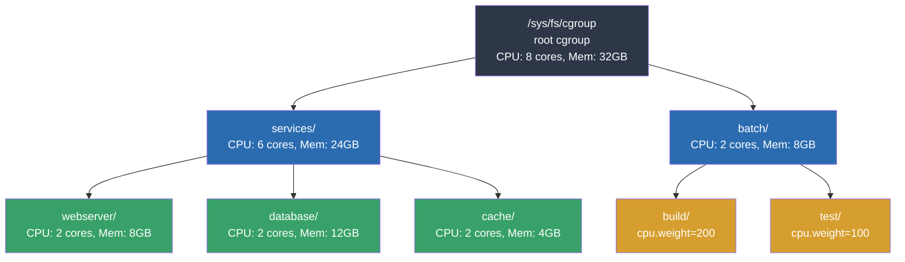

# Control Groups (cgroups)

## Introduction

Control groups (cgroups) are a Linux kernel feature that allows processes to be organized into hierarchical groups with fine-grained resource limits, accounting, and isolation. Originally developed by Google engineers (Paul Menage and Rohit Seth) in 2006 and merged into the mainline kernel in 2.6.24, cgroups form one of the foundational building blocks of containerization technologies like Docker, Kubernetes, and LXC.

Cgroups answer a fundamental question: **how do you divide a machine's resources among competing workloads?** Without cgroups, a single runaway process could consume all available CPU, memory, or I/O bandwidth, starving other workloads. With cgroups, you can guarantee minimum resources, enforce maximum limits, and account for actual usage—all with negligible overhead.

## Cgroup v1 vs v2

### cgroup v1 (Legacy)

The original cgroup implementation (v1) treats each resource controller as an independent hierarchy. This means you can create completely different tree structures for CPU, memory, and I/O controllers. While this offers flexibility, it introduces significant complexity:

- Each controller can mount a different hierarchy
- Processes can be in different positions in each hierarchy
- No unified view of resource allocation
- Inconsistent behavior across controllers

```
# cgroup v1: multiple independent hierarchies
/sys/fs/cgroup/
├── cpu,cpuacct/          # CPU hierarchy
│   ├── docker/
│   │   └── container1/
│   └── myapp/
├── memory/               # Memory hierarchy (different tree!)
│   ├── docker/
│   │   └── container1/
│   └── myapp/
└── blkio/                # Block I/O hierarchy (yet another tree!)
    └── ...
```

### cgroup v2 (Unified)

Cgroup v2, merged in Linux 4.5 and becoming production-ready around 4.15+, provides a **single unified hierarchy** for all controllers. Key improvements:

- **Single hierarchy**: One tree for all controllers
- **Internal process constraint**: A cgroup can have either processes OR child cgroups, not both (except the root)
- **Pressure Stall Information (PSI)**: Built-in pressure metrics
- **Delegation safety**: Safe delegation of subtrees to unprivileged users
- **Simpler interface**: Consistent semantics across all controllers

```
# cgroup v2: unified hierarchy
/sys/fs/cgroup/
├── cgroup.controllers        # Lists available controllers
├── cgroup.subtree_control    # Controllers enabled for children
├── workload-a/
│   ├── cgroup.controllers
│   ├── cpu.max
│   ├── memory.max
│   └── io.max
└── workload-b/
    ├── cpu.max
    └── memory.max
```

### Feature Comparison

| Feature | cgroup v1 | cgroup v2 |
|---------|-----------|-----------|
| Hierarchy | Multiple independent | Single unified |
| Controller mount | Per-controller | All-in-one |
| PSI (Pressure Stall Info) | No | Yes |
| Thread-level control | Limited | cgroup.threads |
| Delegation | Unsafe | Safe (subtree_control) |
| Memory OOM handling | oom_control | memory.events + PSI |
| I/O control | blkio (CFQ-based) | io (BFQ/request-based) |
| Freeze/thaw | cgroup.freezer | cgroup.freeze |

### Checking Your cgroup Version

```bash
# Check which version is active
stat -fc %T /sys/fs/cgroup/
# "cgroup2fs" = v2, "tmpfs" = v1

# Or more explicitly:
mount | grep cgroup
# v2: cgroup2 on /sys/fs/cgroup type cgroup2 (rw,...)
# v1: cgroup on /sys/fs/cgroup/cpu type cgroup (rw,...)

# Check kernel support
zgrep CONFIG_CGROUP /proc/config.gz
# Or on many distros:
grep CGROUP /boot/config-$(uname -r)
```

## Cgroup Controllers

Controllers are kernel subsystems that enforce resource limits. Each controller manages a specific resource type.

### CPU Controller

The CPU controller manages processor time allocation. In v2, it exposes two key files:

```bash
# View available bandwidth
cat /sys/fs/cgroup/myapp/cpu.max
# Output: 100000 100000
# Format: $MAX $PERIOD (microseconds)
# 100000 100000 = 100% of one CPU

# Limit to 50% of one CPU
echo "50000 100000" > /sys/fs/cgroup/myapp/cpu.max

# Limit to 2 full CPUs
echo "200000 100000" > /sys/fs/cgroup/myapp/cpu.max

# Check CPU pressure
cat /sys/fs/cgroup/myapp/cpu.pressure
# Output: some avg10=0.00 avg60=0.00 avg300=0.00 total=0
#         full avg10=0.00 avg60=0.00 avg300=0.00 total=0
```

**Weight-based distribution** (v2): Instead of hard limits, you can use relative weights:

```bash
# Set relative weight (default 100, range 1-10000)
echo 200 > /sys/fs/cgroup/myapp/cpu.weight
# This group gets ~2x the CPU of a group with weight 100
```

In cgroup v1, the interface was different:

```bash
# v1 CPU controller
echo 50000 > /sys/fs/cgroup/cpu/myapp/cpu.cfs_quota_us
echo 100000 > /sys/fs/cgroup/cpu/myapp/cpu.cfs_period_us
# = 50% of one CPU

echo 200 > /sys/fs/cgroup/cpu/myapp/cpu.shares
# Relative weight (default 1024)
```

### Memory Controller

The memory controller tracks and limits memory usage, including page cache, swap, and kernel memory:

```bash
# Set memory limit (v2)
echo 536870912 > /sys/fs/cgroup/myapp/memory.max    # 512MB hard limit
echo 268435456 > /sys/fs/cgroup/myapp/memory.high   # 256MB high watermark

# View current usage
cat /sys/fs/cgroup/myapp/memory.current
# Output: 134217728  (128MB)

# View memory events (v2)
cat /sys/fs/cgroup/myapp/memory.events
# Output:
# low 0
# high 5       ← processes throttled 5 times at memory.high
# max 2        ← processes killed 2 times at memory.max
# oom 1        ← OOM killer invoked once
# oom_kill 1   ← one process killed
# oom_group_kill 0

# Swap limit (v2)
echo 134217728 > /sys/fs/cgroup/myapp/memory.swap.max

# Memory+swap combined limit
echo 671088640 > /sys/fs/cgroup/myapp/memory.max
echo 268435456 > /sys/fs/cgroup/myapp/memory.swap.max
# Total usable: 512MB memory + 256MB swap = 768MB
```

**memory.high vs memory.max**:
- `memory.high`: Soft limit. Processes are heavily throttled but not killed. Good for graceful degradation.
- `memory.max`: Hard limit. The OOM killer is invoked when exceeded.

### I/O Controller

The I/O controller (v2) limits block device I/O bandwidth:

```bash
# Set I/O limits (v2)
# Format: $MAJOR:$MINOR $RIOPS $WIOPS $RBPS $WBPS
echo "8:0 riops=1000 wiops=500 rbps=10485760 wbps=5242880" \
    > /sys/fs/cgroup/myapp/io.max
# 1000 read IOPS, 500 write IOPS
# 10MB/s read bandwidth, 5MB/s write bandwidth

# View I/O statistics
cat /sys/fs/cgroup/myapp/io.stat
# Output: 8:0 rbytes=1048576 wbytes=524288 rios=100 wios=50 dbytes=0 dios=0

# I/O weight (relative priority, v2)
echo "default 200" > /sys/fs/cgroup/myapp/io.weight
# Range 1-10000, default 100
```

### PIDs Controller

The PIDs controller limits the number of processes in a cgroup, preventing fork bombs:

```bash
# Limit to 100 processes
echo 100 > /sys/fs/cgroup/myapp/pids.max

# Check current count
cat /sys/fs/cgroup/myapp/pids.current
# Output: 42

# View events
cat /sys/fs/cgroup/myapp/pids.events
# Output: max 3  ← fork attempts were denied 3 times
```

### Other Controllers

```bash
# cpuset: Pin to specific CPUs and NUMA nodes
echo "0-3" > /sys/fs/cgroup/myapp/cpuset.cpus
echo "0" > /sys/fs/cgroup/myapp/cpuset.mems

# hugetlb: Limit huge page usage
echo 1073741824 > /sys/fs/cgroup/myapp/hugetlb.2MB.max

# rdma: Limit RDMA resources
echo "mlx5_0 hca_handle=1 hca_object=2" > /sys/fs/cgroup/myapp/rdma.max

# misc: Catch-all controller (cgroup v2, Linux 6.4+)
echo 1 > /sys/fs/cgroup/myapp/misc.max
```

## Cgroup Hierarchy and Operations

### Creating and Managing cgroups

```bash
# Create a new cgroup (v2) — just create a directory
mkdir /sys/fs/cgroup/myworkload

# The kernel auto-populates interface files
ls /sys/fs/cgroup/myworkload/
# cgroup.controllers  cgroup.events  cgroup.freeze  cgroup.max.depth
# cgroup.max.descendants  cgroup.procs  cgroup.stat  cgroup.subtree_control
# cgroup.threads  cpu.max  memory.max  ...

# Add a process to the cgroup
echo $PID > /sys/fs/cgroup/myworkload/cgroup.procs

# Move current shell
echo $$ > /sys/fs/cgroup/myworkload/cgroup.procs

# Remove a cgroup (must be empty of processes and children)
rmdir /sys/fs/cgroup/myworkload
```

### Nested Hierarchy

```bash
# Create nested cgroups
mkdir -p /sys/fs/cgroup/services/webserver
mkdir -p /sys/fs/cgroup/services/database

# Enable controllers for children
echo "+cpu +memory +io +pids" > /sys/fs/cgroup/services/cgroup.subtree_control

# Configure at different levels
echo "200000 100000" > /sys/fs/cgroup/services/cpu.max          # 2 CPUs for all services
echo "100000 100000" > /sys/fs/cgroup/services/webserver/cpu.max # 1 CPU for web
echo "100000 100000" > /sys/fs/cgroup/services/database/cpu.max  # 1 CPU for DB
```

### Using systemd with cgroups

systemd automatically manages cgroups for services:

```ini
# /etc/systemd/system/myapp.service
[Unit]
Description=My Application

[Service]
ExecStart=/usr/bin/myapp
# cgroup resource controls
CPUQuota=50%
MemoryMax=512M
MemoryHigh=384M
IOWeight=200
TasksMax=100
```

```bash
# Apply without restart
systemctl daemon-reload
systemctl restart myapp

# View cgroup hierarchy
systemd-cgls

# View resource usage
systemd-cgtop

# Set runtime limits (persistent until reboot)
systemctl set-property myapp.service CPUQuota=75%
systemctl set-property myapp.service MemoryMax=1G
```

## Cgroup Hierarchy Diagram



## Container Integration

Cgroups are the backbone of container resource management:

```bash
# Docker: resource limits map directly to cgroups
docker run -d --name web \
    --cpus="1.5" \
    --memory="512m" \
    --memory-swap="768m" \
    --pids-limit=100 \
    --device-read-bps /dev/sda:10mb \
    nginx

# Inspect the cgroup
cat /sys/fs/cgroup/system.slice/docker-<container_id>.scope/memory.max

# Kubernetes resource requests and limits
# pods become cgroup children of the QoS cgroup
```

## Troubleshooting

```bash
# Check which processes are in a cgroup
cat /sys/fs/cgroup/myapp/cgroup.procs

# View cgroup pressure (v2 only)
cat /sys/fs/cgroup/myapp/memory.pressure
# some avg10=4.56 avg60=2.34 avg300=1.23 total=987654321
# full avg10=1.23 avg60=0.67 avg300=0.34 total=123456789
# "some": at least one task stalled
# "full": ALL tasks stalled (more severe)

# Debug OOM events
journalctl -k | grep -i oom
dmesg | grep -i "out of memory"

# Check cgroup kernel config
zgrep -E 'CONFIG_CGROUP|CONFIG_MEMCG|CONFIG_BLK_CGROUP|CONFIG_CGROUP_SCHED' /proc/config.gz
```

## Cgroup v2 Internals (from docs.kernel.org)

The kernel documentation at `docs.kernel.org/admin-guide/cgroup-v2.html` is the authoritative reference for cgroup v2. Key details from the official documentation:

### Mounting

cgroup v2 has a single unified hierarchy, mounted with:
```bash
mount -t cgroup2 none $MOUNT_POINT
```

The cgroup2 filesystem has magic number `0x63677270` ("cgrp"). All controllers that support v2 and are not bound to a v1 hierarchy are automatically bound to the v2 hierarchy at the root.

### Mount Options

| Option | Description |
|--------|-------------|
| `nsdelegate` | Treat cgroup namespaces as delegation boundaries |
| `favordynmods` | Reduce latency of dynamic cgroup modifications (task migrations, controller on/off) at the cost of making fork/exit more expensive |
| `memory_localevents` | Only populate memory.events for the current cgroup, not subtrees |
| `memory_recursiveprot` | Recursively apply memory.min and memory.low protection to entire subtrees |
| `memory_hugetlb_accounting` | Count HugeTLB memory towards the cgroup's overall memory usage |
| `pids_localevents` | Restore v1-like behavior of pids.events:max (local-only counting) |

### Organizing Processes and Threads

- Processes are migrated by writing their PID to the target cgroup's `cgroup.procs` file
- Only one process can be migrated per `write(2)` call
- When a process forks, the child inherits the parent's cgroup
- `/proc/$PID/cgroup` shows a process's cgroup membership (format: `0::$PATH`)

### Thread Mode

cgroup v2 supports thread granularity for a subset of controllers. Key concepts:

- **Threaded controllers**: cpu, cpuset, perf_event, pids
- **Domain controllers**: All others (memory, io, etc.)
- A cgroup can be made threaded by writing `"threaded"` to `cgroup.type`
- Threaded cgroups join their parent's resource domain
- Threads of a process can be spread across a threaded subtree

### Unpopulated Notification

each non-root cgroup has `cgroup.events` with a `populated` field (0 = no live processes, 1 = has processes). Poll and inotify events are triggered when the value changes, useful for cleanup after all processes exit.

### Controlling Controllers

Controllers are enabled/disabled via `cgroup.subtree_control`:
```bash
cat cgroup.controllers           # List available controllers
echo "+cpu +memory -io" > cgroup.subtree_control  # Enable/disable
```

Enabling a controller in a cgroup means distribution of that resource across its immediate children will be controlled. Controllers enabled on nested cgroups always restrict further — root restrictions cannot be overridden.

### Key Interface Files

| File | Description |
|------|-------------|
| `cgroup.controllers` | List of available controllers |
| `cgroup.subtree_control` | Controllers enabled for children |
| `cgroup.procs` | PIDs of processes in this cgroup |
| `cgroup.threads` | TIDs of threads in this cgroup |
| `cgroup.type` | Cgroup type (domain, threaded, domain invalid) |
| `cgroup.events` | Populated and frozen status |
| `cgroup.freeze` | Freeze/thaw all processes in the cgroup |
| `cgroup.max.depth` | Limit on nesting depth |
| `cgroup.max.descendants` | Limit on number of descendant cgroups |

### Delegation

cgroup v2 supports safe delegation of subtrees to unprivileged users. When `nsdelegate` is used, cgroup namespaces act as delegation boundaries. A delegated subtree can be managed by the namespace owner without affecting the rest of the hierarchy.

## References

- [The Linux Kernel Documentation](https://docs.kernel.org/)
- [LWN.net - Linux and free software news](https://lwn.net/)
- [GNU Project Documentation](https://www.gnu.org/doc/doc.html)
- [GNU Manuals](https://www.gnu.org/manual/manual.html)
- [Free Software Directory](https://directory.fsf.org/wiki/Main_Page)
- [Planet GNU](https://planet.gnu.org/)
- [Free Software Books](https://www.gnu.org/doc/other-free-books.html)

- [Control Group v2](https://docs.kernel.org/admin-guide/cgroup-v2.html) — Official kernel cgroup v2 documentation
- [cgroup v2 documentation](https://www.kernel.org/doc/Documentation/cgroup-v2.txt) — Official Linux kernel documentation
- [cgroup v1 documentation](https://www.kernel.org/doc/Documentation/cgroup-v1/) — Legacy cgroup docs
- [systemd resource control](https://www.freedesktop.org/software/systemd/man/latest/systemd.resource-control.html) — systemd cgroup integration
- [Red Hat cgroup v2 guide](https://access.redhat.com/documentation/en-us/red_hat_enterprise_linux/9/html/managing_monitoring_and_updating_the_kernel/using-cgroups-v2-to-control-distribution-of-cpu-time-for-applications_managing-monitoring-and-updating-the-kernel)
- [Docker resource constraints](https://docs.docker.com/config/containers/resource_constraints/)
- [Control Group v2](https://docs.kernel.org/admin-guide/cgroup-v2.html) — Official kernel cgroup v2 documentation

## Related Topics

- [Namespaces](./namespaces.md) — Process isolation alongside cgroups
- [Process Priorities](./priorities.md) — CPU scheduling priority (nice values)
- [NUMA Scheduling](./numa-scheduling.md) — Memory placement policies
- [Completion Variables](../sync/completions.md) — Kernel synchronization primitives
