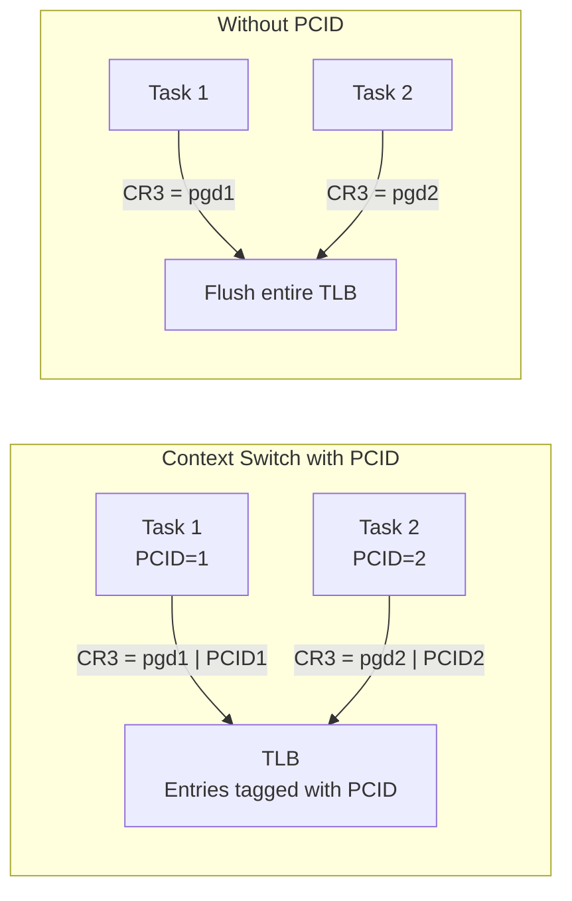
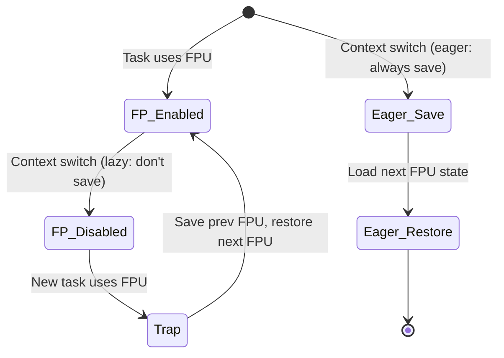
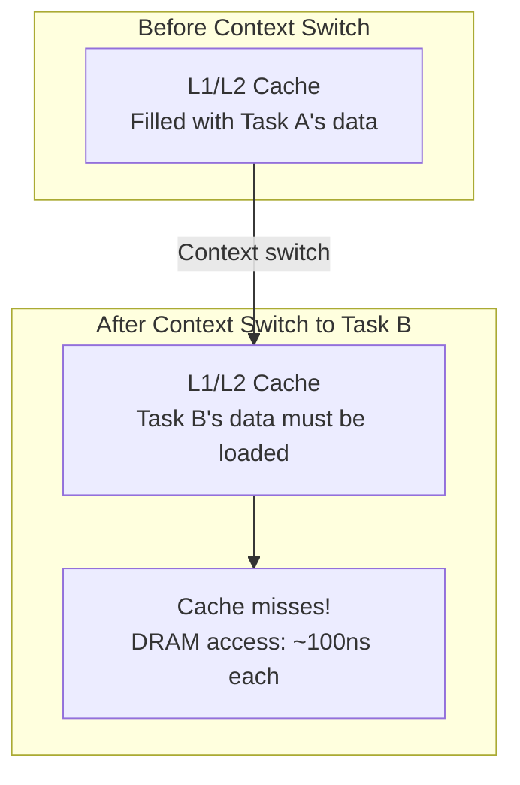
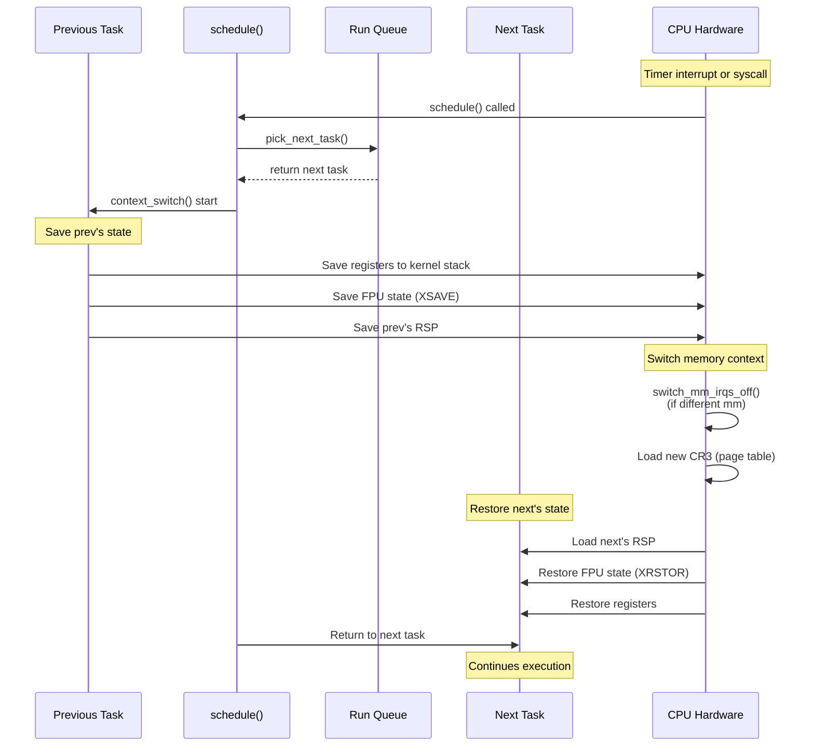

# Context Switching

## Introduction

A **context switch** is the process of saving the state of the currently running task and restoring the state of the next task to run. It's one of the most fundamental operations in an operating system — every multitasking OS must perform context switches to share the CPU among multiple tasks.

In Linux, a context switch involves saving and restoring:
1. **CPU registers** (general-purpose, instruction pointer, stack pointer)
2. **Memory management state** (page tables, TLB)
3. **Floating-point/SIMD state** (FPU, SSE, AVX registers)
4. **Kernel stack pointer** (switching to the new task's kernel stack)

Context switches happen at every `schedule()` call — whether triggered by a timer interrupt, voluntary sleep, or preemption. Since they occur thousands of times per second, their performance is critical.

## The switch_to Macro

### Architecture-Specific Implementation

The core of context switching is the `switch_to()` macro, which is architecture-specific. On x86-64:

```c
/* arch/x86/include/asm/switch_to.h */
#define switch_to(prev, next, last)                     \
do {                                                    \
    prepare_switch_to(next);                            \
                                                        \
    ((last) = __switch_to_asm((prev), (next)));         \
} while (0)
```

The actual assembly is in `__switch_to_asm`:

```asm
/* arch/x86/entry/entry_64.S */
SYM_FUNC_START(__switch_to_asm)
    /* Save callee-saved registers */
    pushq   %rbp
    pushq   %rbx
    pushq   %r12
    pushq   %r13
    pushq   %r14
    pushq   %r15

    /* Switch kernel stack */
    movq    %rsp, TASK_threadsp(%rdi)   /* Save prev's RSP */
    movq    TASK_threadsp(%rsi), %rsp   /* Load next's RSP */

    /* Save/restore FPU state */
    /* ... handled by __switch_to() ... */

    /* Restore callee-saved registers */
    popq    %r15
    popq    %r14
    popq    %r13
    popq    %r12
    popq    %rbx
    popq    %rbp

    /* Return to the new task's saved instruction pointer */
    jmp     __switch_to
SYM_FUNC_END(__switch_to_asm)
```

### The __switch_to() Function

After the stack switch, `__switch_to()` handles the remaining context:

```c
/* arch/x86/kernel/process_64.c */
__visible struct task_struct *__switch_to(struct task_struct *prev_p,
                                          struct task_struct *next_p)
{
    struct thread_struct *prev = &prev_p->thread;
    struct thread_struct *next = &next_p->thread;

    /* Switch FPU/SIMD state */
    switch_fpu_finish();

    /* Update per-CPU current_task */
    this_cpu_write(current_task, next_p);

    /* Switch TLS (Thread-Local Storage) */
    if (prev->fsbase != next->fsbase)
        wrmsrl(MSR_FS_BASE, next->fsbase);
    if (prev->gsbase != next->gsbase)
        wrmsrl(MSR_KERNEL_GS_BASE, next->gsbase);

    /* Switch debug registers */
    if (unlikely(test_tsk_thread_flag(next_p, TIF_DEBUG)))
        switch_to_debugregs(next_p);

    /* Load LDT if needed */
    if (unlikely(prev->ldt != next->ldt))
        load_mm_ldt(next->active_mm);

    /* Switch I/O bitmap */
    if (unlikely(prev->io_bitmap_ptr != next->io_bitmap_ptr))
        tss_update_io_bitmap();

    /* Update stack canary (for stack smashing protection) */
    task_stack_canary_set(next_p, next->stack_canary);

    return prev_p;
}
```

### ARM64 Implementation

```asm
/* arch/arm64/kernel/entry.S */
SYM_FUNC_START(__switch_to)
    /* Save callee-saved registers */
    stp     x19, x20, [sp, #-16]!
    stp     x21, x22, [sp, #-16]!
    stp     x23, x24, [sp, #-16]!
    stp     x25, x26, [sp, #-16]!
    stp     x27, x28, [sp, #-16]!
    stp     x29, x30, [sp, #-16]!

    /* Save prev's context */
    mov     x6, sp
    str     x6, [x0, #THREAD_CPU_CONTEXT]

    /* Load next's context */
    add     x6, x1, #THREAD_CPU_CONTEXT
    ldp     x19, x20, [x6], #16
    ldp     x21, x22, [x6], #16
    ldp     x23, x24, [x6], #16
    ldp     x25, x26, [x6], #16
    ldp     x27, x28, [x6], #16
    ldp     x29, x30, [x6], #16
    ldr     x6, [x6]
    mov     sp, x6

    /* ... */
    ret
SYM_FUNC_END(__switch_to)
```

## The context_switch() Function

### High-Level Flow

```c
/* kernel/sched/core.c */
static __always_inline struct rq *
context_switch(struct rq *rq, struct task_struct *prev,
               struct task_struct *next, struct rq_flags *rf)
{
    /* Prepare memory management for the switch */
    if (!next->mm) {                                /* Kernel thread */
        next->active_mm = prev->active_mm;
        mmgrab(prev->active_mm);                    /* Increment mm refcount */
        enter_lazy_tlb(prev->active_mm, next);      /* Lazy TLB mode */
    } else {                                        /* User process */
        membarrier_switch_mm(rq, prev->active_mm, next->mm);
        switch_mm_irqs_off(prev->active_mm, next->mm, next);  /* Switch page tables */
    }

    /* Release prev's mm if it's a kernel thread */
    if (!prev->mm) {
        prev->active_mm = NULL;
        rq->prev_mm = prev_mm;
    }

    /* Architecture-specific register switch */
    switch_to(prev, next, prev);

    /* Returns here when we're switched back in */
    barrier();
    return finish_task_switch(prev);
}
```

## Memory Management During Context Switch

### Page Table Switch

When switching between user processes, the kernel must switch page tables:

```c
/* arch/x86/mm/tlb.c */
void switch_mm_irqs_off(struct mm_struct *prev,
                        struct mm_struct *next,
                        struct task_struct *tsk)
{
    /* Check if we need to switch CR3 (page table root) */
    if (prev == next)
        return;  /* Same mm, no switch needed (threads) */

    /* Load new page table root */
    load_new_mm_cr3(next->pgd, next->context.ctx_id, true);

    /* Update per-CPU mm pointers */
    this_cpu_write(cpu_tlbstate.loaded_mm, next);
    this_cpu_write(cpu_tlbstate.ctxs[0].ctx_id, next->context.ctx_id);
}
```

### TLB Management

The TLB (Translation Lookaside Buffer) caches page table entries. When switching page tables, the TLB must be flushed or managed:

```c
/* TLB flush strategies */
/* 1. Full flush: flush entire TLB (expensive) */
/* 2. PCID: Process Context ID — tag TLB entries with process ID */
/* 3. Lazy TLB: don't flush for kernel threads borrowing user mm */

/* PCID-based approach (modern x86) */
static inline void load_new_mm_cr3(pgd_t *pgdir, u16 new_asid, bool need_flush)
{
    u64 new_cr3 = __sme_pa(pgdir) | new_asid;

    if (need_flush) {
        /* Full flush needed */
        write_cr3(new_cr3);
    } else {
        /* PCID-tagged switch — TLB entries from other PCIDs remain valid */
        /* INVPCID or PCID-tagged CR3 write */
    }
}
```



### Lazy TLB Mode

When a kernel thread runs, it borrows the previous user process's `mm` (since kernel threads don't have their own address space). This avoids unnecessary TLB flushes:

```c
/* arch/x86/mm/tlb.c */
void enter_lazy_tlb(struct mm_struct *mm, struct task_struct *tsk)
{
    /* Mark that we're in lazy TLB mode
     * The TLB entries from the previous mm are still valid
     * No need to flush until a user task runs again */
    this_cpu_write(cpu_tlbstate.is_lazy, true);
}
```

## FPU/SIMD State

### Why It's Expensive

Modern CPUs have extensive FPU/SIMD state:
- **x87 FPU**: 8 × 80-bit registers (legacy)
- **SSE**: 16 × 128-bit XMM registers
- **AVX-256**: 16 × 256-bit YMM registers
- **AVX-512**: 32 × 512-bit ZMM registers
- **AMX**: Tile registers for matrix operations

Saving and restoring all this state is expensive. Linux uses **lazy FPU switching** to avoid unnecessary saves/restores.

### Lazy vs. Eager FPU Switching



```c
/* Modern Linux uses eager FPU switching for security */
/* (Lazy FPU was vulnerable to speculative execution attacks) */

/* arch/x86/kernel/fpu/core.c */
void switch_fpu_prepare(void)
{
    /* Save FPU state of previous task */
    if (use_eager_fpu()) {
        __save_fpu(prev);
    }
    /* ... */
}

void switch_fpu_finish(void)
{
    /* Restore FPU state of next task */
    if (use_eager_fpu()) {
        __restore_fpu(next);
    }
}
```

### XSAVE/XRSTOR

Modern x86 uses the `XSAVE`/`XRSTOR` instructions for efficient FPU state save/restore:

```c
/* arch/x86/kernel/fpu/xstate.h */
/* Save all FPU state components */
static inline void os_xsave(struct xregs_state *xsave, u64 mask)
{
    u32 lmask = mask;
    u32 hmask = mask >> 32;

    /*
     * XSAVEOPT: Only saves components that have been modified
     * since last XSAVE (hardware tracking)
     */
    alternative_input(
        "1: .byte " REX_PREFIX "0x0f,0xae,0x27\n"
        "2:\n",
        "1: .byte " REX_PREFIX "0x0f,0xc7,0x2f\n"
        "2:\n",
        X86_FEATURE_XSAVEOPT,
        [xsave] "a" (xsave), "c" (lmask), "d" (hmask) :
        "memory");
}

/* Restore all FPU state components */
static inline void os_xrstor(struct xregs_state *xsave, u64 mask)
{
    u32 lmask = mask;
    u32 hmask = mask >> 32;

    asm volatile("1: .byte " REX_PREFIX "0x0f,0xae,0x2f\n"
                 "2:\n"
                 ".section .fixup,\"ax\"\n"
                 "3:  ldmxcsr %2\n"
                 "    jmp 2b\n"
                 ".previous\n"
                 _ASM_EXTABLE(1b, 3b)
                 : : "a" (xsave), "c" (lmask), "d" (hmask),
                     "m" (*xsave) : "memory");
}
```

## Switching Performance

### Context Switch Cost

Context switches are expensive. Typical costs:

| Operation | Cost (approximate) |
|---|---|
| Register save/restore | ~1-2 μs |
| TLB flush (full) | ~5-10 μs |
| TLB switch (PCID) | ~1-2 μs |
| FPU save/restore (SSE) | ~1-2 μs |
| FPU save/restore (AVX-512) | ~3-5 μs |
| Cache cold start | ~10-100 μs (hidden cost) |

### Measuring Context Switch Latency

```bash
# Using lmbench
$ lat_ctx -s 0 2
"size=0k ovr=1.69
2      1.89

# Using perf
$ sudo perf stat -e 'sched:sched_switch' -- sleep 1
 Performance counter stats for 'sleep 1':
         1,234      sched:sched_switch

# Using cyclictest for RT scheduling latency
$ sudo cyclictest -p 99 -i 1000 -l 10000 -m
# Thread 0 Interval: 1000
# Max: 15  Min: 1  Act: 2  Avg: 3  Median: 2
```

### Cache Effects

The hidden cost of context switching is **cache pollution**:



## Kernel Preemption and Context Switches

### Preemptible Kernel

In a preemptible kernel (`CONFIG_PREEMPT`), context switches can happen:
- At every `preempt_check_resched()` call
- When returning from interrupt handlers
- When releasing spinlocks

```c
/* kernel/sched/core.c */
asmlinkage __visible void __sched preempt_schedule(void)
{
    if (likely(!preemptible()))
        return;  /* Can't preempt in atomic context */
    preempt_schedule_common();
}

static void __sched preempt_schedule_common(void)
{
    do {
        preempt_disable_notrace();
        __schedule(SM_PREEMPT);
        preempt_enable_no_resched_notrace();
    } while (need_resched());
}
```

### Preemption Points in the Kernel

```c
/* These are common preemption points: */

/* 1. Returning from system call */
/* arch/x86/entry/entry_64.S */
ret_from_sys_call:
    testl $_TIF_NEED_RESCHED, %eax
    jnz   schedule

/* 2. Returning from interrupt */
/* arch/x86/entry/entry_64.S */
ret_from_intr:
    testl $_TIF_NEED_RESCHED, %eax
    jnz   schedule

/* 3. After releasing a spinlock */
/* include/linux/spinlock.h */
static inline void spin_unlock(spinlock_t *lock)
{
    raw_spin_unlock(&lock->rlock);
    preempt_check_resched();  /* Check if we need to reschedule */
}
```

## Complete Context Switch Sequence



## Practical Examples

### Programmatic Context Switch (User-Level)

```c
#include <ucontext.h>
#include <stdio.h>
#include <stdlib.h>

ucontext_t ctx_main, ctx_func;

void func(void) {
    printf("In func()\n");
    swapcontext(&ctx_func, &ctx_main);  /* Switch back to main */
    printf("Back in func()\n");
}

int main(void) {
    char stack[16384];

    getcontext(&ctx_func);
    ctx_func.uc_stack.ss_sp = stack;
    ctx_func.uc_stack.ss_size = sizeof(stack);
    ctx_func.uc_link = &ctx_main;
    makecontext(&ctx_func, func, 0);

    printf("In main()\n");
    swapcontext(&ctx_main, &ctx_func);  /* Switch to func */
    printf("Back in main()\n");
    return 0;
}
```

### Observing Context Switches

```bash
# Count context switches per process
$ cat /proc/$PID/status | grep ctxt
voluntary_ctxt_switches:    12345
nonvoluntary_ctxt_switches: 678

# System-wide context switch count
$ vmstat 1
procs -----------memory---------- ---swap-- -----io---- -system-- ------cpu-----
 r  b   swpd   free   buff  cache   si   so    bi    bo   in   cs us sy id wa
 1  0      0 123456  12345 123456    0    0     0     0  100  500  5  2 93  0

# Trace context switches
$ sudo perf record -e 'sched:sched_switch' -a -- sleep 5
$ sudo perf report
```

## Further Reading

- [The Linux Kernel Documentation](https://docs.kernel.org/)
- [GNU Project Documentation](https://www.gnu.org/doc/doc.html)
- [GNU Manuals](https://www.gnu.org/manual/manual.html)
- [Free Software Directory](https://directory.fsf.org/wiki/Main_Page)
- [Planet GNU](https://planet.gnu.org/)
- [Free Software Books](https://www.gnu.org/doc/other-free-books.html)

- [Linux kernel: kernel/sched/core.c](https://elixir.bootlin.com/linux/latest/source/kernel/sched/core.c)
- [Linux kernel: arch/x86/kernel/process_64.c](https://elixir.bootlin.com/linux/latest/source/arch/x86/kernel/process_64.c)
- [Linux kernel: arch/x86/kernel/fpu/core.c](https://elixir.bootlin.com/linux/latest/source/arch/x86/kernel/fpu/core.c)
- [Intel SDM Vol 3: Task Management](https://www.intel.com/content/www/us/en/developer/articles/technical/intel-sdm.html)
- [LWN: Improving context switch performance](https://lwn.net/Articles/362088/)
- [Understanding the Linux Kernel, 3rd Edition - Chapter 3](https://www.oreilly.com/library/view/understanding-the-linux/0596005652/)

## Related Topics

- [Scheduler Overview](scheduler.md) — How the scheduler picks the next task
- [CFS Internals](cfs.md) — Fair scheduling decisions
- [Process States](process-states.md) — What triggers context switches
- [task_struct Deep Dive](task-struct.md) — The data structure being switched
- [Process Creation](process-creation.md) — How new tasks get their initial context
