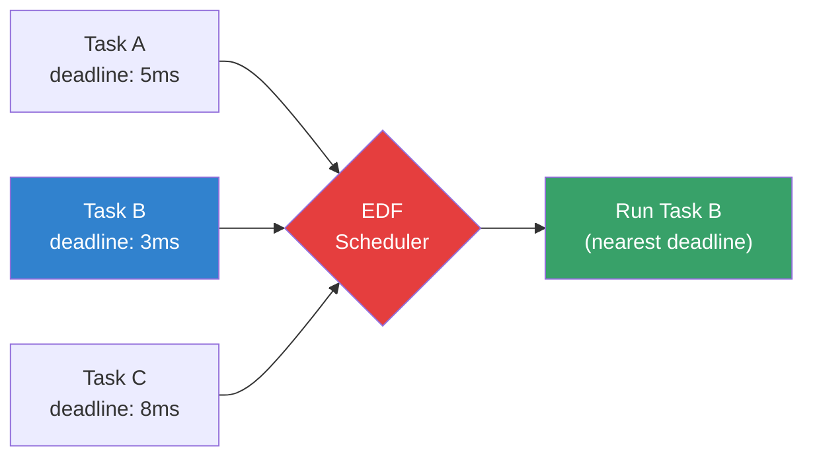
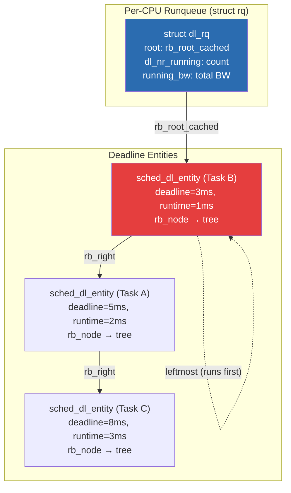
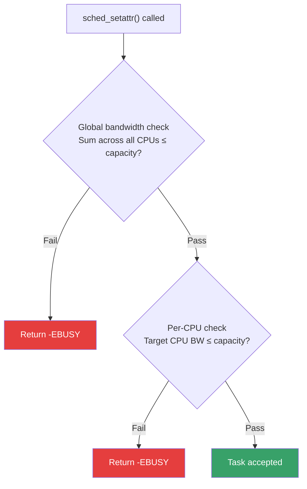
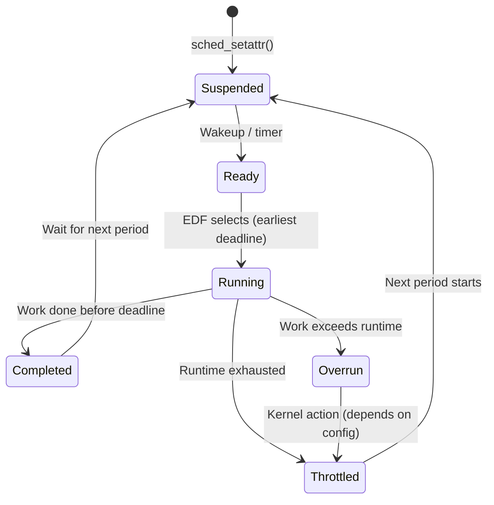
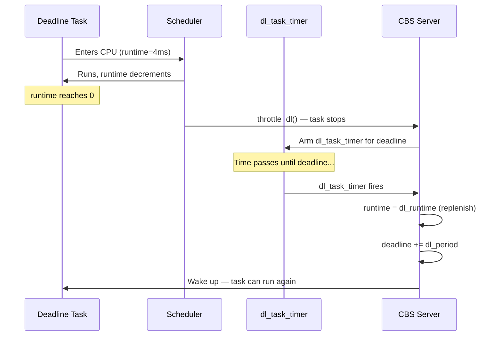
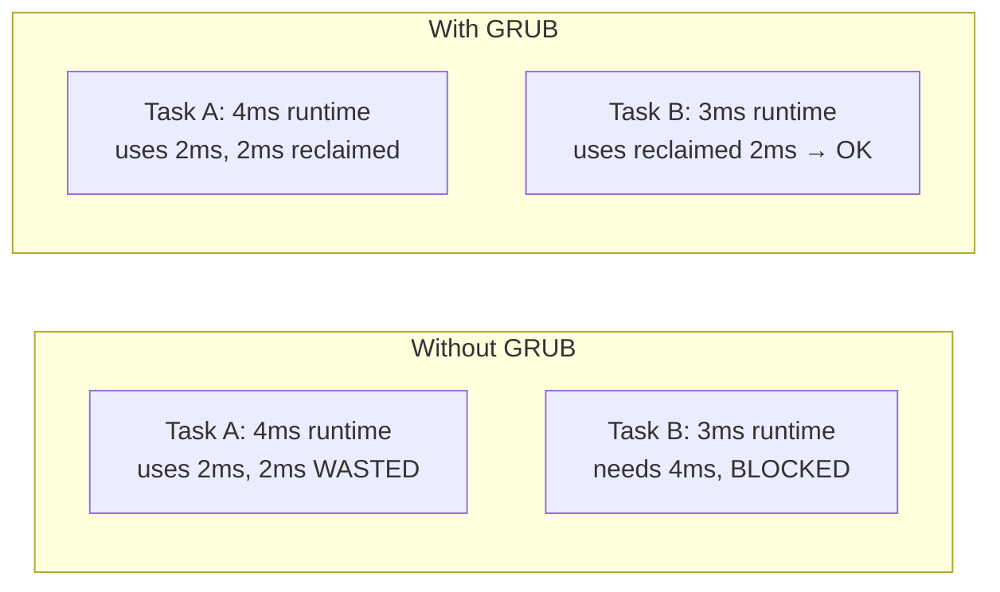
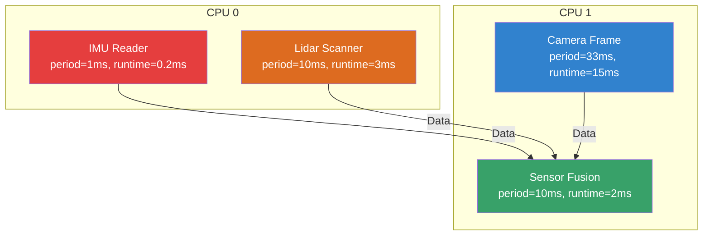

# Deadline Scheduling (SCHED_DEADLINE)

## Introduction

Linux's `SCHED_DEADLINE` scheduler, merged in Linux 3.14 (2013), implements the **Earliest Deadline First (EDF)** scheduling algorithm with **Constant Bandwidth Server (CBS)** admission control. It is designed for real-time workloads with hard or soft timing constraints—tasks that must complete their work within specific time windows.

Unlike `SCHED_FIFO` and `SCHED_RR` which use fixed priorities, `SCHED_DEADLINE` uses a task's deadline as the scheduling criterion: **the task with the nearest absolute deadline runs first**. This provides optimal CPU utilization for real-time workloads (up to 100% for periodic task sets, versus the theoretical ~69% limit of rate-monotonic scheduling).

`SCHED_DEADLINE` tasks are always scheduled **before** any `SCHED_FIFO`, `SCHED_RR`, or `SCHED_NORMAL` tasks.

## Core Concepts

### The Three Parameters

Every `SCHED_DEADLINE` task is characterized by three temporal parameters:

| Parameter | Description | Example |
|-----------|-------------|---------|
| **Runtime** (`sched_runtime`) | Maximum CPU time needed per period | 4ms |
| **Deadline** (`sched_deadline`) | Maximum time from period start to completion | 8ms |
| **Period** (`sched_period`) | Minimum time between successive activations | 10ms |

**Intuitive explanation:** "Every 10ms, I need at most 4ms of CPU time, and I need it finished within 8ms of when my period starts."

### CBS (Constant Bandwidth Server)

CBS is the admission control mechanism that prevents deadline tasks from starving other work. It acts as a "bandwidth reservation" system:

1. Each task is assigned a **server** with bandwidth = runtime/period
2. The kernel tracks each task's remaining runtime within its current period
3. When runtime is exhausted, the task is **throttled** until the next period
4. **Admission control** checks whether the total bandwidth of all deadline tasks on a CPU exceeds the CPU's capacity before accepting a new task

```
Bandwidth = Runtime / Period
Example: 4ms / 10ms = 0.4 (40% CPU)

Total deadline bandwidth on a CPU must be ≤ 1.0 (100%)
In practice, the kernel uses a default of 95% to leave room for interrupts
```

### EDF Scheduling Algorithm



The scheduler always picks the task with the **earliest (smallest) absolute deadline**. When multiple tasks have the same deadline, tie-breaking uses FIFO order.

## Kernel Data Structures

### struct sched_dl_entity

Each deadline task has an embedded `sched_dl_entity` in its `task_struct`:

```c
/* include/linux/sched.h (Linux 6.x) */
struct sched_dl_entity {
    struct rb_node          rb_node;        /* Runqueue linkage (red-black tree) */
    u64                     dl_runtime;     /* Maximum runtime per period (ns) */
    u64                     dl_deadline;    /* Relative deadline (ns) */
    u64                     dl_period;      /* Period (ns) */
    u64                     dl_bw;          /* Bandwidth: dl_runtime / dl_period */
    u64                     dl_density;     /* dl_runtime / dl_deadline */

    /*
     * Actual task state — updated by the scheduler
     */
    s64                     runtime;        /* Remaining runtime in current period */
    u64                     deadline;       /* Absolute deadline (monotonic clock) */
    unsigned int            flags;          /* SCHED_FLAG_* flags */

    /*
     * Timer for budget replenishment
     */
    struct hrtimer          dl_timer;       /* Fires at deadline to replenish budget */

    /*
     * Bandwidth enforcement timer — throttles at runtime exhaustion
     */
    struct hrtimer          inactive_timer; /* Fires when runtime exhausted */

    /*
     * Priority inheritance support
     */
    struct sched_dl_entity  *pi_se;         /* Donor entity when PI-boosted */
};
```

Key fields explained:

- **`rb_node`**: Deadline tasks are organized in a red-black tree ordered by absolute deadline. The leftmost node (earliest deadline) is always selected to run.
- **`runtime`**: Decrements as the task runs. When it reaches zero, the task is throttled.
- **`deadline`**: The absolute time by which the task must finish its current period's work.
- **`dl_timer`**: An `hrtimer` that fires at the task's deadline to replenish its runtime and advance to the next period.
- **`inactive_timer`**: Fires when runtime is exhausted before the deadline, enforcing CBS throttling.
- **`pi_se`**: Points to the donating entity when this task is priority-inherited by a higher-priority task.

### struct dl_rq (Deadline Runqueue)

Each CPU's runqueue contains a `dl_rq` sub-structure:

```c
/* kernel/sched/sched.h */
struct dl_rq {
    struct rb_root_cached   root;           /* RB-tree of deadline tasks, sorted by deadline */
    unsigned int            dl_nr_running;  /* Number of deadline tasks on this CPU */

    u64                     running_bw;     /* Sum of bandwidths of running tasks */
    u64                     this_bw;        /* Bandwidth of currently running DL task */
    u64                     extra_bw;       /* Available bandwidth for new tasks */

    /*
     * Bandwidth tracking for admission control
     */
    u64                     bw_ratio;       /* dl_period / dl_runtime ratio */

    /* Total bandwidth available on this CPU */
    struct root_domain      *rd;            /* Pointer to root domain */
};
```

The `root` field is a red-black tree cache. The leftmost entry (earliest deadline) is cached for O(1) pick of the next task. When the scheduler needs to select the next task:

```c
/* kernel/sched/deadline.c — pick_next_task_dl() */
static struct task_struct *pick_next_task_dl(struct rq *rq)
{
    struct dl_rq *dl_rq = &rq->dl;
    struct sched_dl_entity *dl_se;

    /* Get the leftmost entry — earliest absolute deadline */
    dl_se = rb_entry_cached(dl_rq->root, struct sched_dl_entity, rb_node);
    return dl_se->task;
}
```

### Relationship Between Data Structures



## Setting Up SCHED_DEADLINE

### Using `sched_setattr()` System Call

```c
#define _GNU_SOURCE
#include <linux/sched.h>
#include <linux/sched/types.h>
#include <sys/syscall.h>
#include <unistd.h>
#include <stdio.h>

struct sched_attr {
    uint32_t size;
    uint32_t sched_policy;
    uint64_t sched_flags;
    int32_t  sched_nice;
    uint32_t sched_priority;
    /* SCHED_DEADLINE fields */
    uint64_t sched_runtime;
    uint64_t sched_deadline;
    uint64_t sched_period;
};

static int sched_setattr(pid_t pid, struct sched_attr *attr, unsigned int flags) {
    return syscall(SYS_sched_setattr, pid, attr, flags);
}

int main() {
    struct sched_attr attr = {
        .size           = sizeof(attr),
        .sched_policy   = SCHED_DEADLINE,  /* 6 */
        .sched_flags    = 0,
        .sched_nice     = 0,
        .sched_priority = 0,
        .sched_runtime  = 4 * 1000 * 1000,    /* 4ms in nanoseconds */
        .sched_deadline = 8 * 1000 * 1000,    /* 8ms */
        .sched_period   = 10 * 1000 * 1000,   /* 10ms */
    };

    if (sched_setattr(0, &attr, 0) < 0) {
        perror("sched_setattr");
        return 1;
    }

    /* This process now runs as SCHED_DEADLINE */
    while (1) {
        /* Do real-time work */
        /* ... */
        /* Sleep until next period */
        struct timespec ts = {.tv_sec = 0, .tv_nsec = 10 * 1000 * 1000};
        clock_nanosleep(CLOCK_MONOTONIC, 0, &ts, NULL);
    }
    return 0;
}
```

### Using `chrt` Command

```bash
# Set a process to SCHED_DEADLINE
# chrt --deadline <runtime_us> <deadline_us> <period_us> <command>
chrt --deadline 4000 8000 10000 ./my_rt_app

# Set an existing process
chrt --deadline --pid 4000 8000 10000 12345

# View deadline parameters
chrt -p 12345
# pid 12345's current scheduling policy: SCHED_DEADLINE
# pid 12345's current scheduling attributes:
#   runtime=4000000, deadline=8000000, period=10000000

# View all deadline tasks
ps -eo pid,cls,rtprio,comm | grep DL
#   PID CLS RTPRIO COMMAND
#   456  DL      - my_rt_app
```

### Using `sched_setparam()` with `struct sched_param_ex`

```c
#include <sched.h>

struct sched_param_ex {
    int sched_priority;
    struct timespec sched_runtime;
    struct timespec sched_deadline;
    struct timespec sched_period;
};

struct sched_param_ex param = {
    .sched_priority = 0,
    .sched_runtime  = {.tv_sec = 0, .tv_nsec = 4000000},   /* 4ms */
    .sched_deadline = {.tv_sec = 0, .tv_nsec = 8000000},   /* 8ms */
    .sched_period   = {.tv_sec = 0, .tv_nsec = 10000000},  /* 10ms */
};

sched_setscheduler(pid, SCHED_DEADLINE, &param);
```

### SCHED_DEADLINE Flags

The `sched_flags` field in `struct sched_attr` accepts several flags that modify deadline behavior:

| Flag | Value | Description |
|------|-------|-------------|
| `SCHED_FLAG_DL_OVERRUN` | `0x01` | Send SIGCPUSTAT on runtime overrun |
| `SCHED_FLAG_RECLAIM` | `0x02` | Allow GRUB bandwidth reclaim |
| `SCHED_FLAG_DL_OVERRUN` | `0x04` | Enable overrun notification |

```c
/* Enable overrun notification */
struct sched_attr attr = {
    .size         = sizeof(attr),
    .sched_policy = SCHED_DEADLINE,
    .sched_flags  = SCHED_FLAG_DL_OVERRUN,  /* Notify on overrun */
    .sched_runtime  = 4000000,
    .sched_deadline = 8000000,
    .sched_period   = 10000000,
};
sched_setattr(0, &attr, 0);
```

## Admission Control

The kernel's admission control test determines whether a new deadline task can be accepted without violating existing guarantees.

### The Bandwidth Test

```
For each CPU i:
    sum(runtime_j / period_j) for all deadline tasks on CPU i ≤ 0.95

Global cap (default):
    /proc/sys/kernel/sched_rt_runtime_us = 950000 (for RT classes)
    /proc/sys/kernel/sched_rt_period_us  = 1000000

Deadline-specific:
    /proc/sys/kernel/sched_deadline_period_max_us
    /proc/sys/kernel/sched_deadline_period_min_us
```

```bash
# Check admission control
cat /proc/sys/kernel/sched_rt_runtime_us
# 950000  (950ms per 1000ms period = 95%)

# Modify (careful!)
echo -1 > /proc/sys/kernel/sched_rt_runtime_us  # Disable RT throttling
echo 950000 > /proc/sys/kernel/sched_rt_runtime_us  # Restore

# Check deadline period bounds
cat /proc/sys/kernel/sched_deadline_period_max_us
# 4194304  (4.19 seconds max period)
cat /proc/sys/kernel/sched_deadline_period_min_us
# 100      (100μs min period)

# Admission failure shows in dmesg
dmesg | grep -i deadline
# [sched_setattr] dl admission control failed, rejected
```

### How Admission Control Works in the Kernel

The admission control check happens in `dl_overflow()`:

```c
/* kernel/sched/deadline.c (simplified) */
static bool dl_overflow(struct rq *rq, int policy,
                        struct sched_attr *attr)
{
    u64 new_bw = attr->sched_runtime * BW_SCALE / attr->sched_period;
    u64 total_bw = rq->dl.running_bw;

    /* Subtract old bandwidth if task is already deadline */
    if (policy == SCHED_DEADLINE && current->dl.dl_bw)
        total_bw -= current->dl.dl_bw;

    total_bw += new_bw;

    /* Check: total must not exceed available bandwidth */
    return total_bw > (BW_SCALE - rq->dl.this_bw);
}
```

The admission test is called from `__sched_setscheduler()` when changing a task's scheduling policy. If it returns `true`, the `sched_setattr()` call fails with `-EBUSY`.

### Multi-CPU Admission

```bash
# Pin deadline task to specific CPU
taskset -c 0 chrt --deadline 4000 8000 10000 ./app1
taskset -c 0 chrt --deadline 3000 6000 10000 ./app2
# Total bandwidth on CPU 0: 40% + 50% = 90% ✓ Accepted

taskset -c 0 chrt --deadline 4000 8000 10000 ./app3
# Total: 40% + 50% + 50% = 140% ✗ Admission control rejects
```

### Global vs Per-CPU Bandwidth

The kernel enforces both per-CPU and global bandwidth limits:



## Runtime Behavior and Throttling

### The Deadline Task Lifecycle



### CBS Budget Enforcement

When a deadline task runs, the kernel decrements its `runtime` field:

```c
/* kernel/sched/deadline.c — update_curr_dl() */
static void update_curr_dl(struct rq *rq)
{
    struct task_struct *curr = rq->curr;
    struct sched_dl_entity *dl_se = &curr->dl;
    u64 delta_exec;

    /* Calculate time since last update */
    delta_exec = rq_clock_task(rq) - curr->se.exec_start;
    curr->se.sum_exec_runtime += delta_exec;
    dl_se->runtime -= delta_exec;  /* Decrement remaining budget */

    /* Check if budget exhausted */
    if (dl_se->runtime <= 0) {
        /* Task exceeded its runtime — throttle it */
        throttle_dl(rq, dl_se);
    }
}
```

### Budget Replenishment (dl_task_timer)

When a task's deadline arrives, the `dl_task_timer` hrtimer fires to replenish the budget:

```c
/* kernel/sched/deadline.c — dl_task_timer() */
static enum hrtimer_restart dl_task_timer(struct hrtimer *timer)
{
    struct sched_dl_entity *dl_se;
    struct task_struct *p;
    struct rq *rq;

    dl_se = container_of(timer, struct sched_dl_entity, dl_timer);
    p = dl_task_of(dl_se);
    rq = rq_of_dl_rq(dl_rq_of_se(dl_se));

    /* Replenish runtime budget */
    dl_se->runtime = dl_se->dl_runtime;

    /* Advance deadline to next period */
    dl_se->deadline += dl_se->dl_period;

    /* Re-arm the timer for the next deadline */
    setup_new_dl_entity(dl_se);

    /* Wake the task if it was throttled */
    if (p->state == TASK_INTERRUPTIBLE)
        wake_up_process(p);

    return HRTIMER_NORESTART;
}
```

### Throttling Flow



### Monitoring Deadline Tasks

```bash
# /proc/<pid>/sched shows deadline info
cat /proc/456/sched
# my_rt_app (456, #threads: 1)
# ---------------------------------------------------------
# se.exec_start                      :     1234567.890123
# se.vruntime                        :           0.000000
# se.sum_exec_runtime                :        3456.789012
# nr_switches                        :              1234
# nr_voluntary_switches              :               890
# nr_involuntary_switches            :                344
# dl.runtime                         :        4000000
# dl.deadline                        :     1234567890123
# dl.dl_new                          :               0
# dl.dl_boosted                      :               0
# dl.dl_throttled                    :               0

# trace-cmd for deadline events
trace-cmd record -e sched -e sched_switch -e sched_wakeup
# Look for SCHED_DEADLINE events
trace-cmd report | grep -i deadline
```

### Deadline Overruns

When a task exceeds its runtime budget, the kernel handles it via the CBS mechanism:

```bash
# Check for overruns (kernel 5.10+)
cat /proc/456/sched | grep dl_overrun
# dl_overrun: 3  ← task exceeded its runtime 3 times

# dmesg can show overrun warnings
dmesg | grep -i "dl_throttle\|overrun"
```

When `SCHED_FLAG_DL_OVERRUN` is set, the kernel sends `SIGCPUSTAT` to the task upon overrun, enabling applications to detect and log budget violations.

## GRUB: Reclaiming Unused Bandwidth

Linux 4.13+ introduced **GRUB (Greedy Reclamation of Unused Bandwidth)** for SCHED_DEADLINE. When a deadline task doesn't use its full runtime, the unused bandwidth can be reclaimed by other deadline tasks.

### How GRUB Works

Without GRUB: if a task has 4ms runtime/10ms period but only uses 2ms, the remaining 2ms is wasted.

With GRUB: other deadline tasks can "borrow" the unused 2ms, running beyond their own runtime budget as long as total CPU usage stays within limits.

```bash
# Enable GRUB for a task
# Use SCHED_FLAG_RECLAIM in sched_flags
struct sched_attr attr = {
    .sched_flags = SCHED_FLAG_RECLAIM,
    /* ... deadline params ... */
};
```



## Deadline Priority Inheritance

SCHED_DEADLINE supports **deadline inheritance (D-INHERIT)** via `pi_se`. When a deadline task is blocked by a lower-priority task holding a mutex, the blocking task's deadline is temporarily boosted to the waiter's deadline.

```c
/* kernel/sched/deadline.c */
static inline bool is_dl_boosted(struct sched_dl_entity *dl_se)
{
    /* If pi_se points to a different entity, we're being boosted */
    return pi_of(dl_se) != dl_se;
}
```

This mechanism is implemented through the RT-mutex subsystem and is critical for preventing **priority inversion** in real-time systems using SCHED_DEADLINE alongside other scheduling classes.

## Use Cases

### Audio Processing

```c
/*
 * Audio callback: needs to run every 1ms, consuming max 0.5ms CPU
 * Period: 1ms, Runtime: 0.5ms, Deadline: 1ms
 */
struct sched_attr audio_attr = {
    .size           = sizeof(audio_attr),
    .sched_policy   = SCHED_DEADLINE,
    .sched_runtime  = 500000,      /* 0.5ms */
    .sched_deadline = 1000000,     /* 1ms */
    .sched_period   = 1000000,     /* 1ms */
};

void audio_callback(void) {
    sched_setattr(0, &audio_attr, 0);
    while (running) {
        process_audio_buffer();
        /* Sleep until next period via clock_nanosleep */
    }
}
```

### Industrial Control Loop

```bash
# Control loop: runs every 10ms, needs max 2ms CPU, deadline 5ms
chrt --deadline 2000 5000 10000 ./control_loop

# Video frame processing: 33ms period (30fps), 20ms max work
chrt --deadline 20000 30000 33333 ./video_encoder
```

### Mixed Criticality

```bash
# High-criticality: tight deadline, guaranteed runtime
taskset -c 0 chrt --deadline 1000 2000 5000 ./safety_monitor

# Low-criticality: longer deadline, can be deferred
taskset -c 1 chrt --deadline 5000 20000 50000 ./data_logger

# Both coexist on the system without interference
# (safety_monitor always has priority due to earlier deadline)
```

### Robotics: Multi-Sensor Fusion



## Deadline Scheduling vs Other Policies

| Feature | SCHED_FIFO | SCHED_RR | SCHED_DEADLINE |
|---------|-----------|----------|----------------|
| Algorithm | Fixed priority | Fixed priority + time slice | EDF |
| Admission control | No | No | Yes (CBS) |
| Bandwidth guarantee | No | No | Yes |
| Optimal utilization | ~69% (RMS bound) | ~69% | Up to 100% |
| Starvation risk | High | Medium | None (per-task) |
| Temporal guarantee | None | None | Yes |
| Complexity | Low | Low | Medium |

## sched_yield() for SCHED_DEADLINE

Calling `sched_yield()` on a deadline task has special semantics: it forces the task to wait until its next period boundary before running again:

```c
/* kernel/sched/deadline.c — yield_task_dl() */
static void yield_task_dl(struct rq *rq)
{
    struct sched_dl_entity *dl_se = &rq->curr->dl;

    /* Update deadline to next period */
    dl_se->deadline = rq_clock(rq) + dl_se->dl_period;
    dl_se->runtime = dl_se->dl_runtime;

    /* Re-arm the replenishment timer */
    setup_new_dl_entity(dl_se);
}
```

This is useful for tasks that finish early and want to release the CPU until their next activation.

## Troubleshooting

```bash
# Task rejected by admission control?
# Check current bandwidth usage
cat /proc/sched_debug 2>/dev/null || cat /sys/kernel/debug/sched/debug
# Look for "dl_rq" sections

# Common errors:
# EINVAL: runtime > deadline, or deadline > period
# EBUSY:  admission control failure (bandwidth exceeded)
# EPERM:  insufficient privileges (needs CAP_SYS_NICE)

# Grant capability
sudo setcap cap_sys_nice+ep ./my_rt_app

# Or use systemd service
# [Service]
# AmbientCapabilities=CAP_SYS_NICE
```

### Common Pitfalls

1. **Forgetting to sleep**: A deadline task that spins in a tight loop will exhaust its runtime and be throttled. Always sleep until the next period.
2. **Wrong parameter order**: Must satisfy `runtime ≤ deadline ≤ period`. Violating this returns `-EINVAL`.
3. **Missing `mlockall()`**: Page faults in deadline tasks cause unpredictable latency. Always call `mlockall(MCL_CURRENT | MCL_FUTURE)`.
4. **CPU affinity**: Without `taskset`, the task may migrate between CPUs, losing cache warmth.

### Diagnosing Admission Failures

```bash
# Check per-CPU deadline bandwidth usage
cat /sys/kernel/debug/sched/debug | grep -A 5 "dl_rq"

# See total DL bandwidth on each CPU
for cpu in /sys/devices/system/cpu/cpu*/cpufreq/; do
    echo "=== $(basename $(dirname $cpu)) ==="
    cat /proc/$(pgrep -f deadline_app)/sched | grep "dl\."
done

# List all deadline tasks and their bandwidth
ps -eo pid,cls,rtprio,comm --sort=-cls | head -20
```

## References

- [The Linux Kernel Documentation](https://docs.kernel.org/)
- [LWN.net - Linux and free software news](https://lwn.net/)
- [GNU Project Documentation](https://www.gnu.org/doc/doc.html)
- [GNU Manuals](https://www.gnu.org/manual/manual.html)
- [Free Software Directory](https://directory.fsf.org/wiki/Main_Page)
- [Planet GNU](https://planet.gnu.org/)
- [Free Software Books](https://www.gnu.org/doc/other-free-books.html)

- [SCHED_DEADLINE design document](https://www.kernel.org/doc/sched/deadline-design.txt) — Original design notes
- [sched(7) man page](https://man7.org/linux/man-pages/man7/sched.7.html) — Scheduling overview
- [chrt(1) man page](https://man7.org/linux/man-pages/man1/chrt.1.html) — Command-line tool
- [EDF and CBS Linux kernel documentation](https://www.kernel.org/doc/Documentation/scheduler/sched-deadline.txt)
- [Real-Time Linux Wiki](https://wiki.linuxfoundation.org/realtime/start) — RT Linux resources
- [SCHED_DEADLINE — Linux Kernel Internals](https://kernel-internals.org/sched/deadline/) — Deep dive into data structures
- [GRUB: Greedy Reclamation of Unused Bandwidth](https://dl.acm.org/doi/10.1145/2724942.2724945) — Academic paper on GRUB

## Related Topics

- [Process Priorities](./priorities.md) — Nice values and RT priorities
- [NUMA Scheduling](./numa-scheduling.md) — Memory-aware scheduling
- [Cgroups CPU Bandwidth](./cgroups.md) — Alternative bandwidth control via cgroups
- [Completion Variables](../sync/completions.md) — Kernel synchronization
- [RT-Mutexes / Priority Inheritance](../sync/rt-mutex.md) — Deadline inheritance mechanism
